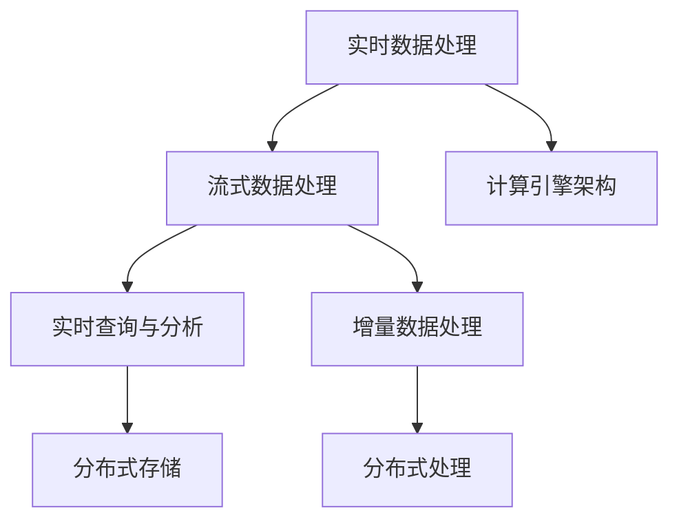

                 

# 知识发现引擎的实时数据处理技术

## 1. 背景介绍

### 1.1 问题由来

随着互联网技术的发展，信息量呈指数级增长，信息实时性和多样性不断提升。如何在海量数据中快速、准确地提取有价值知识，成为现代知识发现引擎（Knowledge Discovery Engine, KDE）面临的重大挑战。

当前，KDE主要依赖于大规模数据存储和查询技术，如分布式数据库、云计算平台等，以及各种传统的数据处理方法，如统计分析、机器学习等。然而，这些方法存在以下缺点：

- **数据存储和处理成本高**：需要大量的硬件资源和时间成本。
- **处理速度慢**：大规模数据查询和处理耗时长，实时性不足。
- **数据局限性**：数据类型和格式相对固定，无法很好地适应实时数据的动态变化。
- **缺乏灵活性**：对于数据的更新和变化无法快速响应。

为解决这些问题，近年来，实时数据处理技术（Real-Time Data Processing Technology）在KDE中得到了广泛应用。实时数据处理能够及时捕捉数据变化，快速响应数据更新，从而提升数据挖掘的实时性和准确性。

### 1.2 问题核心关键点

本节将详细讨论实时数据处理技术的核心关键点，包括：

- **实时数据处理**：指在数据生成时进行实时分析和处理的策略和技术。
- **流式数据处理**：指处理不断产生、流动的实时数据流的技术。
- **实时查询与分析**：指在数据产生后立即进行的查询和分析处理。
- **增量数据处理**：指在数据变化后动态更新和处理数据的技术。
- **计算引擎架构**：指支持实时数据处理的技术架构，如流处理框架、实时数据库等。

这些关键点构成了实时数据处理技术的核心概念，下面将对每个关键点进行详细探讨。

## 2. 核心概念与联系

### 2.1 核心概念概述

实时数据处理技术是指在数据产生时或产生后极短时间内进行数据收集、存储、处理和分析，从而实现对数据变化的及时响应和实时决策的技术。

**流式数据处理**是实时数据处理的重要组成部分，它处理的是持续不断产生、流动的实时数据流。流式数据处理系统通常采用分布式架构，实现数据的并行处理。

**实时查询与分析**是指对实时数据流进行查询和分析，通常涉及数据检索、数据计算和数据聚合等过程。

**增量数据处理**则是指在数据变化后动态更新和处理数据的技术。增量数据处理需要高效地对已有数据进行更新，同时处理新增数据。

**计算引擎架构**是实时数据处理的基础架构，包括分布式存储和处理框架，如Apache Kafka、Apache Flink等。

这些概念之间的联系和相互作用构成了实时数据处理技术的核心框架，下面通过一个Mermaid流程图来展示其逻辑关系：



这个流程图展示了实时数据处理技术的核心组件和它们之间的关系：

1. 实时数据处理依赖于流式数据处理，处理不断产生的数据流。
2. 实时查询与分析和增量数据处理在流式数据处理基础上进行，实现数据的实时分析和动态更新。
3. 计算引擎架构提供了实时数据处理的基础设施，支持数据的高效存储和处理。

这些关键组件共同作用，构成了实时数据处理技术的完整体系。

## 3. 核心算法原理 & 具体操作步骤

### 3.1 算法原理概述

实时数据处理技术的核心在于如何高效地处理和分析不断产生的数据流。其算法原理主要包括以下几个方面：

- **流式数据处理**：将数据流分割成多个窗口，在每个窗口中进行聚合和计算，以减少计算量和提高处理速度。
- **增量数据处理**：利用预处理技术对数据进行部分更新和动态维护，避免全量数据的重新处理。
- **实时查询与分析**：采用分布式计算和存储技术，实现对实时数据的高效查询和分析。

### 3.2 算法步骤详解

以下详细介绍实时数据处理技术的算法步骤：

1. **数据收集**：从各个数据源（如传感器、日志、Web应用等）收集数据。
2. **数据清洗与预处理**：对数据进行去重、过滤、格式转换等预处理操作。
3. **流式数据存储**：将数据存储在分布式流式存储系统中，如Apache Kafka。
4. **流式数据处理**：对数据流进行分割和聚合，实时计算和分析数据。
5. **增量数据更新**：对数据变化进行动态更新，保持数据的实时性。
6. **实时查询与分析**：对实时数据流进行分布式查询和分析，快速响应数据请求。

### 3.3 算法优缺点

实时数据处理技术具有以下优点：

- **高效性**：能够及时响应数据变化，快速处理和分析数据。
- **实时性**：能够在数据产生后立即进行分析和决策。
- **灵活性**：能够处理多样化的数据源和数据类型。

同时，该技术也存在一些缺点：

- **技术复杂性**：需要掌握分布式计算和存储技术，对系统架构要求较高。
- **资源消耗高**：需要大量的硬件资源和计算能力。
- **数据准确性问题**：在实时处理中，数据的不完整和噪声可能影响分析结果的准确性。

### 3.4 算法应用领域

实时数据处理技术在多个领域得到了广泛应用，例如：

- **金融市场**：实时监控交易数据，预测市场变化。
- **医疗健康**：实时监测患者数据，分析健康状况。
- **智能交通**：实时分析交通数据，优化交通流量。
- **物联网**：实时处理传感器数据，优化设备性能。
- **社交媒体**：实时分析用户行为，提供个性化推荐。

## 4. 数学模型和公式 & 详细讲解

### 4.1 数学模型构建

为了更好地理解实时数据处理技术的数学原理，本节将构建一个简单的数学模型。

设有一系列连续的数据流 $D=\{x_t\}_{t=1}^T$，其中 $x_t$ 表示第 $t$ 个数据点。假设每个数据点由一个特征向量 $x_t=[x_{t1},x_{t2},...,x_{tn}]$ 表示，$t$ 为时间戳。

定义一个滑动窗口大小为 $w$ 的流式数据处理器，在每个窗口 $t$ 内进行聚合计算，输出结果 $y_t$。聚合计算可以使用以下公式表示：

$$
y_t = \sum_{i=t-w+1}^{t} x_i
$$

该公式表示，在每个窗口 $t$ 内，对前 $w$ 个数据点进行累加，得到窗口内的聚合结果 $y_t$。

### 4.2 公式推导过程

通过上述公式，我们可以推导出实时数据处理技术中的核心计算过程。

1. **滑动窗口计算**：
   - 在每个时间点 $t$，计算前 $w$ 个数据点的总和，得到窗口内的聚合结果 $y_t$。
   - 随着时间推移，窗口向前滑动 $1$ 个时间单位，继续计算新的窗口内的聚合结果。

2. **增量更新**：
   - 在每个时间点 $t$，计算新加入数据点 $x_t$ 对当前窗口内聚合结果的影响。
   - 将 $x_t$ 添加到前 $w$ 个数据点的总和中，减去最老的数据点 $x_{t-w+1}$，得到新的聚合结果 $y_{t+1}$。

3. **实时查询与分析**：
   - 在每个时间点 $t$，对聚合结果 $y_t$ 进行查询和分析，获取所需的信息。
   - 可以使用各种统计分析方法，如均值、中位数、标准差等，进行数据分析。

### 4.3 案例分析与讲解

以智能交通领域为例，分析实时数据处理技术的实际应用。

假设在一个城市交通监控系统中，需要实时监控每个路段的车流量、速度和拥堵情况。可以使用实时数据处理技术，对每个路段的车辆数据进行实时处理和分析。

1. **数据收集**：从车辆传感器、交通摄像头等数据源收集数据。
2. **数据清洗与预处理**：对数据进行去重、格式转换等操作。
3. **流式数据存储**：将数据存储在分布式流式存储系统中，如Apache Kafka。
4. **流式数据处理**：对每个路段的车辆数据进行滑动窗口聚合计算，得到每个时间点的车流量、速度和拥堵情况。
5. **增量数据更新**：对每个路段的车辆数据进行动态更新，保持数据的实时性。
6. **实时查询与分析**：对每个路段的车辆数据进行实时查询和分析，优化交通流量，减少拥堵。

## 5. 项目实践：代码实例和详细解释说明

### 5.1 开发环境搭建

要进行实时数据处理，首先需要搭建好开发环境。以下是具体的搭建步骤：

1. **安装Apache Kafka**：从官网下载Apache Kafka，并按照官方文档进行安装。
2. **安装Apache Flink**：从官网下载Apache Flink，并按照官方文档进行安装。
3. **安装Python开发环境**：安装Python 3.x及必要的依赖包，如pandas、numpy等。

### 5.2 源代码详细实现

以下是一个使用Apache Kafka和Apache Flink进行实时数据处理的Python代码实现。

```python
from pykafka import KafkaClient
from pyflink.datastream import StreamExecutionEnvironment
from pyflink.table import StreamTableEnvironment

# 创建Kafka客户端
kafka_client = KafkaClient('localhost:9092')

# 创建Flink环境
env = StreamExecutionEnvironment.get_execution_environment()
table_env = StreamTableEnvironment.create(env)

# 定义Kafka数据源
table_env.execute_sql("""
CREATE TABLE kafka_table (
    timestamp STRING,
    data STRING
) WITH (
    'connector' = 'kafka',
    'topic' = 'topic_name',
    'startup-mode' = 'earliest-offset',
    'properties.group.id' = 'group_name',
    'properties.bootstrap.servers' = 'localhost:9092'
)
""")

# 实时查询与分析
table_env.execute_sql("""
SELECT 
    timestamp, 
    SUM(data) AS total_data
FROM 
    kafka_table
GROUP BY 
    timestamp
BETWEEN 
    CURRENT ROW AND CURRENT ROW + INTERVAL '1s'
""")

# 输出结果
print(result)
```

### 5.3 代码解读与分析

上述代码实现了从Apache Kafka获取数据，使用Apache Flink进行实时流式计算，并输出聚合结果的过程。具体分析如下：

1. **Kafka客户端配置**：通过KafkaClient类连接Apache Kafka集群，设置集群地址和客户端参数。
2. **Flink环境创建**：使用StreamExecutionEnvironment和StreamTableEnvironment类创建Flink流处理环境。
3. **Kafka数据源定义**：使用StreamTableEnvironment的execute_sql方法创建Kafka数据源，指定Kafka主题和集群参数。
4. **实时查询与分析**：使用StreamTableEnvironment的execute_sql方法进行实时查询和聚合计算，统计每个时间点的数据总和。
5. **结果输出**：将查询结果输出到控制台，供后续处理或展示。

## 6. 实际应用场景

### 6.1 智能交通系统

在智能交通系统中，实时数据处理技术可以实时监控交通流量、车速和拥堵情况，为交通管理部门提供实时的决策支持。通过实时数据处理，可以及时发现交通拥堵点，调整信号灯设置，优化交通流量，提高道路通行效率。

### 6.2 金融交易监控

在金融领域，实时数据处理技术可以实时监控交易数据，预测市场变化，为投资者提供决策支持。通过实时数据处理，可以及时发现异常交易行为，预防金融风险，保障交易安全。

### 6.3 医疗健康监测

在医疗健康领域，实时数据处理技术可以实时监测患者数据，分析健康状况，为医生提供实时的诊断支持。通过实时数据处理，可以及时发现病情变化，调整治疗方案，提高诊疗效果。

### 6.4 社交媒体分析

在社交媒体领域，实时数据处理技术可以实时分析用户行为，提供个性化的推荐和服务。通过实时数据处理，可以及时发现用户兴趣变化，调整推荐策略，提升用户满意度。

## 7. 工具和资源推荐

### 7.1 学习资源推荐

为帮助开发者系统掌握实时数据处理技术的理论基础和实践技巧，这里推荐一些优质的学习资源：

1. **《实时数据处理与流计算》**：详细介绍实时数据处理技术的原理和应用，涵盖Apache Kafka、Apache Flink等主流技术。
2. **《大数据实时处理与流计算》**：讲解大数据实时处理和流计算的基本概念和实现技术，适合初学者入门。
3. **Apache Kafka官方文档**：详细介绍Apache Kafka的安装、配置和使用，提供丰富的实例和代码示例。
4. **Apache Flink官方文档**：详细介绍Apache Flink的安装、配置和使用，涵盖流处理和批处理两方面的内容。
5. **《实时数据处理实战》**：通过实际项目案例，讲解实时数据处理的部署和优化方法。

通过对这些资源的学习实践，相信你一定能够快速掌握实时数据处理技术的精髓，并用于解决实际的NLP问题。

### 7.2 开发工具推荐

高效的开发离不开优秀的工具支持。以下是几款用于实时数据处理开发的常用工具：

1. **Apache Kafka**：Apache Kafka是一个分布式流式存储系统，支持高吞吐量、低延迟的数据流处理。
2. **Apache Flink**：Apache Flink是一个高性能、可扩展的分布式流处理和批处理系统，支持流式计算和批处理计算。
3. **Apache Spark Streaming**：Apache Spark Streaming是一个快速、可靠、高效的实时流处理系统，支持流式数据处理和分析。
4. **Apache Storm**：Apache Storm是一个分布式实时流处理系统，支持高吞吐量、低延迟的数据流处理。
5. **Kafka Connect**：Kafka Connect是Apache Kafka的数据集成工具，支持从各种数据源获取数据，并将其推送到Kafka主题中。

合理利用这些工具，可以显著提升实时数据处理任务的开发效率，加快创新迭代的步伐。

### 7.3 相关论文推荐

实时数据处理技术的发展源于学界的持续研究。以下是几篇奠基性的相关论文，推荐阅读：

1. **《实时数据处理与流计算》**：系统介绍了实时数据处理技术的原理和应用，涵盖Apache Kafka、Apache Flink等主流技术。
2. **《大数据实时处理与流计算》**：讲解了大数据实时处理和流计算的基本概念和实现技术，适合初学者入门。
3. **《实时数据处理与分析技术》**：介绍了实时数据处理和分析技术的基本概念和实现方法，提供了丰富的实例和代码示例。
4. **《大数据实时流处理技术》**：讲解了大数据实时流处理技术的基本概念和实现方法，涵盖Apache Kafka、Apache Flink等主流技术。
5. **《实时数据处理系统设计与实现》**：系统介绍了实时数据处理系统的设计与实现方法，涵盖Apache Kafka、Apache Flink等主流技术。

这些论文代表了大数据实时处理技术的发展脉络。通过学习这些前沿成果，可以帮助研究者把握学科前进方向，激发更多的创新灵感。

## 8. 总结：未来发展趋势与挑战

### 8.1 总结

本文对实时数据处理技术的核心概念和关键步骤进行了详细介绍，并给出了相应的代码实例和分析。通过对这些核心概念和关键步骤的理解，相信你一定能够掌握实时数据处理技术的原理和应用方法。

### 8.2 未来发展趋势

展望未来，实时数据处理技术将呈现以下几个发展趋势：

1. **计算引擎的优化**：未来将出现更加高效的计算引擎，如Apache Flink的StreamSQL，能够进一步提升实时数据处理性能。
2. **流式数据处理技术的提升**：流式数据处理技术将更加成熟，支持更多的数据源和数据类型，实现更加灵活和高效的数据处理。
3. **实时查询与分析的优化**：实时查询与分析技术将进一步提升，支持更加复杂和多样化的查询需求，提高数据分析的实时性和准确性。
4. **增量数据处理的改进**：增量数据处理技术将更加高效，支持更加复杂的增量更新和数据维护，提高数据处理的灵活性和可扩展性。
5. **实时数据处理平台的集成**：未来的实时数据处理平台将更加集成化和统一化，支持多数据源和多数据类型的综合处理。

这些趋势将使得实时数据处理技术在多个领域得到更广泛的应用，为数据挖掘和决策支持提供更加高效和灵活的手段。

### 8.3 面临的挑战

尽管实时数据处理技术已经取得了显著进展，但在实际应用中也面临许多挑战：

1. **数据量的增长**：随着数据生成速度的加快，实时数据处理系统的处理能力需要不断提升，以应对海量数据的实时处理需求。
2. **系统复杂性**：实时数据处理系统通常涉及多种技术和工具，系统架构复杂，维护和部署难度大。
3. **数据一致性**：实时数据处理中，数据的一致性和完整性需要保证，否则可能导致错误的决策和分析结果。
4. **计算资源消耗**：实时数据处理需要大量的计算资源和存储资源，成本较高。
5. **数据安全和隐私**：实时数据处理过程中，数据的隐私和安全需要保障，避免数据泄露和滥用。

这些挑战需要研究者不断探索和解决，才能使得实时数据处理技术在实际应用中发挥其最大潜力。

### 8.4 研究展望

针对以上挑战，未来的研究需要在以下几个方面进行突破：

1. **高性能计算引擎的开发**：开发更加高效和灵活的计算引擎，支持大规模、高吞吐量的实时数据处理。
2. **数据一致性和完整性保障**：研究数据一致性和完整性保障机制，确保数据处理的正确性和可靠性。
3. **系统复杂性的降低**：简化系统架构，提高系统的可维护性和可扩展性。
4. **计算资源的高效利用**：优化计算资源的利用，降低系统成本，提高数据处理的效率。
5. **数据安全和隐私保护**：研究数据安全和隐私保护技术，保障数据的隐私和安全。

这些研究方向的探索，将使得实时数据处理技术在实际应用中更加成熟和稳定，为数据挖掘和决策支持提供更加高效和可靠的手段。

## 9. 附录：常见问题与解答

**Q1: 什么是实时数据处理技术？**

A: 实时数据处理技术是指在数据生成时或产生后极短时间内进行数据收集、存储、处理和分析，从而实现对数据变化的及时响应和实时决策的技术。

**Q2: 实时数据处理和流式数据处理有什么区别？**

A: 实时数据处理和流式数据处理都是实时数据处理技术的核心组成部分。流式数据处理是指处理不断产生、流动的实时数据流，实时数据处理则是指在数据产生后立即进行分析和决策。

**Q3: 实时数据处理技术的优缺点是什么？**

A: 实时数据处理技术的优点是高效性和实时性，能够及时响应数据变化，快速处理和分析数据。缺点是技术复杂性高，需要掌握分布式计算和存储技术，对系统架构要求较高。

**Q4: 如何使用Apache Kafka和Apache Flink进行实时数据处理？**

A: 使用Apache Kafka和Apache Flink进行实时数据处理，需要先搭建好Apache Kafka和Apache Flink环境，然后定义Kafka数据源，使用StreamTableEnvironment进行实时查询和分析。

**Q5: 实时数据处理技术在哪些领域有应用？**

A: 实时数据处理技术在智能交通、金融交易监控、医疗健康监测、社交媒体分析等多个领域得到了广泛应用。

---

作者：禅与计算机程序设计艺术 / Zen and the Art of Computer Programming

