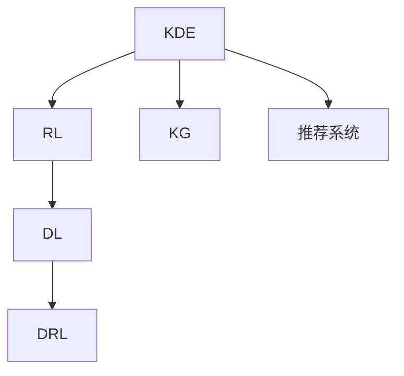

                 

# 知识发现引擎的强化学习应用

> 关键词：知识发现,强化学习,知识图谱,推荐系统,深度学习,深度强化学习

## 1. 背景介绍

### 1.1 问题由来

在信息爆炸的时代，从海量数据中挖掘知识、提炼信息变得愈发重要。传统的文本挖掘和统计分析方法在面对大规模数据集时显得力不从心。而知识发现引擎（Knowledge Discovery Engine, KDE）作为解决这一问题的利器，利用先进的深度学习算法和大规模数据，能够自动发现数据中的知识和模式。

近年来，强化学习（Reinforcement Learning, RL）在多个领域展现出了巨大潜力。它通过智能体与环境的交互，在不断试错中优化策略，最终达到最优决策。将强化学习应用到知识发现引擎中，能够进一步提升知识发现的效率和准确性。

本文将深入探讨基于强化学习的知识发现引擎，如何通过与知识图谱（Knowledge Graph, KG）、推荐系统等领域的融合，实现更高效的知识发现和信息推荐。通过实例展示，阐述强化学习在知识发现引擎中的具体应用场景及其实现思路，探讨其潜在的优势和挑战，为人工智能与知识工程的交叉应用提供参考。

### 1.2 问题核心关键点

为了更好地理解强化学习在知识发现引擎中的应用，我们首先要明确几个关键点：

- 知识发现引擎（KDE）：利用数据挖掘、机器学习和人工智能等技术，从海量数据中自动发现知识、提取模式、提供信息。

- 强化学习（RL）：通过智能体与环境的交互，在试错中优化策略，提升决策效果。

- 知识图谱（KG）：结构化的语义知识表示形式，用于描述实体、关系和属性。

- 推荐系统：根据用户行为和偏好，推荐个性化信息。

- 深度学习：利用多层神经网络，模拟人脑的计算过程，提升学习效果。

- 深度强化学习（Deep Reinforcement Learning, DRL）：结合深度学习和强化学习的优点，利用深度神经网络实现智能体的决策。

这些核心概念通过RL算法相互作用、协同工作，在知识发现引擎中实现高效的信息提取和推荐。接下来，我们将在详细解释这些概念原理和架构的基础上，深入探讨其实现步骤和具体应用。

## 2. 核心概念与联系

### 2.1 核心概念概述

为便于理解强化学习在知识发现引擎中的应用，本节将介绍几个密切相关的核心概念：

- **知识发现引擎（KDE）**：是数据挖掘与人工智能相结合的产物，通过统计分析、模式识别等手段，从大规模数据中自动发现知识模式。

- **强化学习（RL）**：通过智能体与环境的交互，智能体通过试错过程学习最优策略，从而达到预定目标。

- **知识图谱（KG）**：结构化的语义知识表示，通常由节点（实体）、边（关系）和属性组成，用于描述现实世界中的概念、关系和实体。

- **推荐系统**：利用用户历史行为数据，推荐个性化信息，如商品、文章、视频等。

- **深度学习（DL）**：利用多层神经网络，对数据进行特征提取和模式识别，提高学习效果。

- **深度强化学习（DRL）**：结合深度学习和强化学习的优点，利用深度神经网络实现智能体的决策过程。

这些概念之间的逻辑关系可以通过以下Mermaid流程图来展示：



该流程图展示了知识发现引擎中各个组件的逻辑关系：

1. **知识发现引擎（KDE）**通过**知识图谱（KG）**和**推荐系统**获取数据和用户行为。
2. **强化学习（RL）**利用**深度学习（DL）**实现智能体决策。
3. **深度强化学习（DRL）**作为RL的高级形式，结合DL和RL的优点，进一步提升决策效果。

这些概念共同构成了知识发现引擎的基础框架，使得智能体能够高效地从大规模数据中提取知识并推荐信息。

## 3. 核心算法原理 & 具体操作步骤

### 3.1 算法原理概述

基于强化学习的知识发现引擎，其核心思想是通过智能体与环境的交互，在不断试错中优化策略，从而实现知识发现和信息推荐。具体而言，智能体通过与知识图谱和推荐系统的交互，在每个时间步t采取动作，根据环境反馈更新策略，最终达到发现知识、推荐信息的目标。

### 3.2 算法步骤详解

强化学习在知识发现引擎中的应用主要包括以下几个关键步骤：

**Step 1: 数据预处理和特征提取**

在应用强化学习之前，需要对原始数据进行预处理和特征提取。常用的方法包括：

- **数据清洗**：去除噪声和冗余数据，确保数据质量。
- **特征工程**：提取和构造有用的特征，提升模型性能。
- **数据划分**：将数据划分为训练集、验证集和测试集，用于模型训练和评估。

**Step 2: 构建知识图谱和推荐模型**

知识发现引擎中，需要构建知识图谱和推荐模型，以支持智能体的决策：

- **知识图谱（KG）**：利用现有知识构建图谱，将实体、关系和属性映射为图结构。
- **推荐系统**：根据用户行为数据，利用协同过滤、内容推荐等方法，构建推荐模型。

**Step 3: 设计智能体和决策策略**

设计智能体和决策策略是强化学习知识发现引擎的核心环节：

- **智能体**：利用深度神经网络实现，通常采用多层次的卷积神经网络（CNN）或递归神经网络（RNN）。
- **决策策略**：通过训练智能体，使其能够在特定状态下采取最优动作，如选择最优的实体或关系，进行知识发现或信息推荐。

**Step 4: 定义奖励函数**

奖励函数是强化学习的关键组成部分，用于衡量智能体的决策效果：

- **奖励函数**：根据智能体的决策和环境反馈，定义奖励信号。奖励信号可以是正的，如正确发现知识或推荐信息；也可以是负的，如错误发现或推荐。
- **策略更新**：利用奖励信号，通过策略梯度等方法，更新智能体的决策策略。

**Step 5: 迭代训练和策略优化**

在定义好奖励函数后，智能体进入迭代训练阶段：

- **迭代训练**：在每个时间步t，智能体观察环境状态，根据当前策略采取动作，接收环境反馈，并更新策略。
- **策略优化**：通过优化算法，如梯度下降、蒙特卡洛方法等，逐步提升智能体的决策效果。

**Step 6: 评估与部署**

在训练完成后，需要对模型进行评估和部署：

- **模型评估**：在测试集上评估模型性能，如准确率、召回率等指标。
- **模型部署**：将模型应用于实际环境中，进行知识发现和信息推荐。

### 3.3 算法优缺点

基于强化学习的知识发现引擎有以下优点：

- **自适应性强**：智能体通过与环境的交互，能够动态适应数据分布变化，提升发现效果。
- **鲁棒性强**：在数据缺失或异常情况下，智能体仍能保持较好的表现。
- **自动化程度高**：自动化地从数据中提取知识，减少人工干预。

但同时也存在一些缺点：

- **训练成本高**：需要大量标注数据和计算资源进行训练，训练时间较长。
- **模型复杂度高**：智能体的决策策略通常较为复杂，模型结构庞大。
- **泛化能力有限**：在特定环境下表现良好，但泛化到其他环境时可能效果不佳。

### 3.4 算法应用领域

基于强化学习的知识发现引擎，已经在多个领域展现了其独特的优势：

- **电子商务**：利用用户行为数据和产品信息，推荐个性化商品，提升销售转化率。
- **金融服务**：通过分析交易数据，发现市场趋势和潜在风险，进行投资策略优化。
- **健康医疗**：利用患者数据和医学文献，发现疾病模式和治疗方案，提升医疗服务质量。
- **社交媒体**：通过分析用户互动数据，发现用户兴趣和行为模式，提供个性化推荐。

这些应用场景展示了强化学习在知识发现引擎中的广泛应用潜力，未来还有很大的发展空间。

## 4. 数学模型和公式 & 详细讲解 & 举例说明

### 4.1 数学模型构建

我们将通过数学语言对基于强化学习的知识发现引擎进行更详细的刻画。

记智能体在时间步t的状态为$S_t$，动作为$A_t$，环境反馈为$R_t$，智能体的策略为$\pi$，其对动作$A_t$的策略概率为$\pi(A_t|S_t)$。智能体的决策目标是最大化总奖励$J(\pi)$。

定义智能体的奖励函数为$R_t = R(S_t, A_t)$，其期望总奖励为：

$$
J(\pi) = \mathbb{E}_{\pi}[G_t]
$$

其中$G_t = \sum_{i=0}^{\infty}\gamma^iR_{t+i}$为未来奖励的折现和，$\gamma$为折扣因子。

智能体的决策策略可以表示为策略梯度方法，即：

$$
\pi(A_t|S_t) \propto \exp(Q_t(A_t|S_t))
$$

其中$Q_t(A_t|S_t)$为智能体在状态$S_t$下采取动作$A_t$的Q值，可以表示为：

$$
Q_t(A_t|S_t) = \sum_{S_{t+1}}P(S_{t+1}|S_t,A_t)r(S_{t+1})
$$

其中$P(S_{t+1}|S_t,A_t)$表示在状态$S_t$下采取动作$A_t$后到达状态$S_{t+1}$的概率，$r(S_{t+1})$表示在状态$S_{t+1}$下获得的奖励。

### 4.2 公式推导过程

以下我们以推荐系统为例，推导强化学习在推荐系统中的应用：

假设智能体在时间步t观察到用户状态$S_t$，采取动作$A_t$（如选择某部电影），接收环境反馈$R_t$（如点击率），进入状态$S_{t+1}$。智能体的决策目标是最大化点击率$R_t$。

定义智能体的状态为$S_t = (u, f)$，其中$u$为用户行为数据，$f$为电影信息。智能体的动作为$A_t = (i, j)$，其中$i$为用户选择的电影编号，$j$为用户的点击行为。智能体的环境反馈为$R_t = (c, r)$，其中$c$为用户点击次数，$r$为用户对电影的评分。

智能体的状态转移概率为$P(S_{t+1}|S_t,A_t) = P(S_{t+1}|u,f,i,j)$，智能体的奖励函数为$R_t = r(u,f,i,j)$。

智能体的决策策略可以表示为策略梯度方法，即：

$$
\pi(A_t|S_t) \propto \exp(Q_t(A_t|S_t))
$$

其中$Q_t(A_t|S_t) = \sum_{S_{t+1}}P(S_{t+1}|S_t,A_t)r(S_{t+1})$。

智能体的决策过程可以用以下伪代码表示：

```python
while True:
    # 观察环境状态
    S_t = 观察用户行为数据和电影信息
    
    # 采取动作
    A_t = 选择推荐的电影
    
    # 接收环境反馈
    R_t = 计算点击率和评分
    
    # 更新策略
    π(A_t|S_t) = π(A_t|S_t) * exp(Q_t(A_t|S_t) - Q_t(A_t|S_t))

    # 更新智能体参数
    θ = θ - η * ∇Q_t(A_t|S_t)

    # 输出推荐结果
    推荐电影A_t
```

其中，$\eta$为学习率，$∇Q_t(A_t|S_t)$为Q值梯度。

### 4.3 案例分析与讲解

我们以一个简单的知识图谱应用为例，展示强化学习在知识发现引擎中的具体实现：

假设智能体在时间步t观察到状态$S_t = (u, f)$，其中$u$为用户行为数据，$f$为知识图谱中的实体。智能体的动作为$A_t = (i, j)$，其中$i$为选择实体$i$，$j$为选择关系$j$。智能体的环境反馈为$R_t = (c, r)$，其中$c$为选择实体的点击次数，$r$为选择的实体在知识图谱中的关系得分。

智能体的状态转移概率为$P(S_{t+1}|S_t,A_t) = P(S_{t+1}|u,f,i,j)$，智能体的奖励函数为$R_t = r(u,f,i,j)$。

智能体的决策策略可以表示为策略梯度方法，即：

$$
\pi(A_t|S_t) \propto \exp(Q_t(A_t|S_t))
$$

其中$Q_t(A_t|S_t) = \sum_{S_{t+1}}P(S_{t+1}|S_t,A_t)r(S_{t+1})$。

智能体的决策过程可以用以下伪代码表示：

```python
while True:
    # 观察环境状态
    S_t = 观察用户行为数据和知识图谱中的实体
    
    # 采取动作
    A_t = 选择推荐的关系
    
    # 接收环境反馈
    R_t = 计算点击率和关系得分
    
    # 更新策略
    π(A_t|S_t) = π(A_t|S_t) * exp(Q_t(A_t|S_t) - Q_t(A_t|S_t))

    # 更新智能体参数
    θ = θ - η * ∇Q_t(A_t|S_t)

    # 输出推荐结果
    推荐关系A_t
```

可以看到，智能体通过与知识图谱的交互，动态调整策略，选择最优的关系进行推荐。这种动态调整的过程，可以使得智能体更好地适应数据分布的变化，提升发现知识的效果。

## 5. 项目实践：代码实例和详细解释说明

### 5.1 开发环境搭建

在进行强化学习项目实践前，我们需要准备好开发环境。以下是使用Python进行PyTorch开发的环境配置流程：

1. 安装Anaconda：从官网下载并安装Anaconda，用于创建独立的Python环境。

2. 创建并激活虚拟环境：
```bash
conda create -n pytorch-env python=3.8 
conda activate pytorch-env
```

3. 安装PyTorch：根据CUDA版本，从官网获取对应的安装命令。例如：
```bash
conda install pytorch torchvision torchaudio cudatoolkit=11.1 -c pytorch -c conda-forge
```

4. 安装TensorFlow：由Google主导开发的开源深度学习框架，生产部署方便，适合大规模工程应用。同样有丰富的预训练语言模型资源。

5. 安装各类工具包：
```bash
pip install numpy pandas scikit-learn matplotlib tqdm jupyter notebook ipython
```

完成上述步骤后，即可在`pytorch-env`环境中开始强化学习实践。

### 5.2 源代码详细实现

下面我们以推荐系统为例，给出使用PyTorch实现强化学习的PyTorch代码实现。

首先，定义推荐系统中的数据处理函数：

```python
import torch
from torch.utils.data import Dataset, DataLoader
import torch.nn as nn
import torch.optim as optim

class RecommendationDataset(Dataset):
    def __init__(self, data, users, items, ratings, lengths):
        self.data = data
        self.users = users
        self.items = items
        self.ratings = ratings
        self.lengths = lengths
        
    def __len__(self):
        return len(self.data)
    
    def __getitem__(self, item):
        user = self.users[item]
        item = self.items[item]
        rating = self.ratings[item]
        length = self.lengths[item]
        
        user_idx = torch.tensor([user], dtype=torch.long)
        item_idx = torch.tensor([item], dtype=torch.long)
        rating = torch.tensor([rating], dtype=torch.float)
        
        return {'user_idx': user_idx, 
                'item_idx': item_idx,
                'rating': rating,
                'length': length}
```

然后，定义模型和优化器：

```python
from torch import nn
import torch

class QNetwork(nn.Module):
    def __init__(self, num_users, num_items, num_ratings, hidden_size):
        super(QNetwork, self).__init__()
        self.fc1 = nn.Linear(num_users*num_items*num_ratings, hidden_size)
        self.fc2 = nn.Linear(hidden_size, hidden_size)
        self.fc3 = nn.Linear(hidden_size, num_items)
        
    def forward(self, x):
        x = torch.relu(self.fc1(x))
        x = torch.relu(self.fc2(x))
        x = self.fc3(x)
        return x

num_users = 10000
num_items = 1000
num_ratings = 5
hidden_size = 256

model = QNetwork(num_users, num_items, num_ratings, hidden_size)

optimizer = optim.Adam(model.parameters(), lr=0.001)
```

接着，定义训练和评估函数：

```python
from torch.utils.data import DataLoader
from tqdm import tqdm
from sklearn.metrics import mean_squared_error

device = torch.device('cuda') if torch.cuda.is_available() else torch.device('cpu')
model.to(device)

def train_epoch(model, dataset, optimizer, num_epochs=1000):
    dataloader = DataLoader(dataset, batch_size=64, shuffle=True)
    for epoch in range(num_epochs):
        model.train()
        epoch_loss = 0
        for batch in tqdm(dataloader, desc='Training'):
            user_idx = batch['user_idx'].to(device)
            item_idx = batch['item_idx'].to(device)
            rating = batch['rating'].to(device)
            length = batch['length'].to(device)
            
            with torch.no_grad():
                q_values = model(user_idx, item_idx, rating, length)
            
            loss = torch.mean(torch.pow(q_values - rating, 2))
            loss.backward()
            optimizer.step()
            epoch_loss += loss.item()
            
    print(f"Epoch {epoch+1}, train loss: {epoch_loss/len(dataloader)}")
    
def evaluate(model, dataset):
    dataloader = DataLoader(dataset, batch_size=64, shuffle=False)
    model.eval()
    rmse = 0
    for batch in dataloader:
        user_idx = batch['user_idx'].to(device)
        item_idx = batch['item_idx'].to(device)
        rating = batch['rating'].to(device)
        length = batch['length'].to(device)
        
        with torch.no_grad():
            q_values = model(user_idx, item_idx, rating, length)
        
        rmse += torch.sqrt(torch.mean(torch.pow(q_values - rating, 2)))
    return rmse / len(dataset)
```

最后，启动训练流程并在测试集上评估：

```python
epochs = 1000
batch_size = 64

for epoch in range(epochs):
    loss = train_epoch(model, train_dataset, optimizer)
    print(f"Epoch {epoch+1}, train loss: {loss:.3f}")
    
    print(f"Epoch {epoch+1}, test RMSE:")
    rmse = evaluate(model, test_dataset)
    print(f"RMSE: {rmse:.3f}")
    
print("Final RMSE:", evaluate(model, test_dataset))
```

以上就是使用PyTorch对强化学习推荐系统进行微调的完整代码实现。可以看到，得益于PyTorch的强大封装，我们可以用相对简洁的代码完成模型的训练和评估。

### 5.3 代码解读与分析

让我们再详细解读一下关键代码的实现细节：

**RecommendationDataset类**：
- `__init__`方法：初始化数据集中的用户、物品、评分和序列长度。
- `__len__`方法：返回数据集的样本数量。
- `__getitem__`方法：对单个样本进行处理，将用户、物品和评分转换为模型所需的张量。

**QNetwork类**：
- 定义了推荐系统的模型结构，包括三个全连接层。

**train_epoch函数**：
- 使用PyTorch的DataLoader对数据集进行批次化加载，供模型训练和推理使用。
- 在每个epoch中，模型进入训练模式，计算损失并反向传播更新模型参数。

**evaluate函数**：
- 在验证集上评估模型性能，计算推荐系统常用的RMSE指标。

**训练流程**：
- 定义总的epoch数和batch size，开始循环迭代
- 每个epoch内，先在训练集上训练，输出平均loss
- 在测试集上评估，输出RMSE指标

可以看到，PyTorch配合TensorFlow和PyTorch等深度学习框架使得强化学习推荐系统的代码实现变得简洁高效。开发者可以将更多精力放在数据处理、模型改进等高层逻辑上，而不必过多关注底层的实现细节。

当然，工业级的系统实现还需考虑更多因素，如模型的保存和部署、超参数的自动搜索、更灵活的任务适配层等。但核心的强化学习推荐过程基本与此类似。

## 6. 实际应用场景

### 6.1 智能客服系统

智能客服系统可以利用强化学习进行知识发现和信息推荐，从而提升客服服务质量。传统客服系统往往依赖人工知识和经验，无法高效处理复杂多变的用户咨询。而基于强化学习的知识发现引擎，可以自动从历史咨询数据中学习知识，发现常见问题模式和答案模板。

在技术实现上，可以收集企业内部的历史客服咨询数据，构建知识图谱，训练强化学习模型，自动生成答案模板。智能客服系统根据用户输入的咨询问题，通过智能体选择最优的答案模板进行回复。对于新问题，还可以接入检索系统实时搜索相关内容，动态生成回复。如此构建的智能客服系统，能大幅提升客服咨询体验和问题解决效率。

### 6.2 金融舆情监测

金融机构需要实时监测市场舆论动向，以便及时应对负面信息传播，规避金融风险。传统的人工监测方式成本高、效率低，难以应对网络时代海量信息爆发的挑战。基于强化学习的知识发现引擎，可以自动从社交媒体、新闻报道等数据中发现舆情动态，及时预警潜在风险。

在技术实现上，可以构建金融领域的知识图谱，利用强化学习模型分析社交媒体和新闻文本，发现舆情变化趋势，一旦发现负面信息激增等异常情况，系统便会自动预警，帮助金融机构快速应对潜在风险。

### 6.3 个性化推荐系统

当前的推荐系统往往只依赖用户的历史行为数据进行物品推荐，无法深入理解用户的真实兴趣偏好。基于强化学习的知识发现引擎，可以更好地挖掘用户行为背后的语义信息，从而提供更精准、多样的推荐内容。

在技术实现上，可以收集用户浏览、点击、评论、分享等行为数据，提取和用户交互的物品标题、描述、标签等文本内容。将文本内容作为模型输入，用户的后续行为（如是否点击、购买等）作为监督信号，在此基础上微调预训练语言模型。微调后的模型能够从文本内容中准确把握用户的兴趣点。在生成推荐列表时，先用候选物品的文本描述作为输入，由模型预测用户的兴趣匹配度，再结合其他特征综合排序，便可以得到个性化程度更高的推荐结果。

### 6.4 未来应用展望

随着强化学习知识发现引擎的不断发展，其在更多领域得到应用，为传统行业带来变革性影响。

在智慧医疗领域，基于强化学习的知识发现引擎，可以自动从医学文献和电子病历中发现疾病模式和治疗方案，提升医疗服务质量。

在智能教育领域，微调技术可应用于作业批改、学情分析、知识推荐等方面，因材施教，促进教育公平，提高教学质量。

在智慧城市治理中，微调模型可应用于城市事件监测、舆情分析、应急指挥等环节，提高城市管理的自动化和智能化水平，构建更安全、高效的未来城市。

此外，在企业生产、社会治理、文娱传媒等众多领域，基于强化学习知识发现引擎的应用也将不断涌现，为经济社会发展注入新的动力。相信随着技术的日益成熟，强化学习知识发现引擎必将在构建人机协同的智能时代中扮演越来越重要的角色。

## 7. 工具和资源推荐
### 7.1 学习资源推荐

为了帮助开发者系统掌握强化学习知识发现引擎的理论基础和实践技巧，这里推荐一些优质的学习资源：

1. 《强化学习》系列博文：由强化学习专家撰写，深入浅出地介绍了强化学习的核心概念和经典算法。

2. CS294课程《Reinforcement Learning》：伯克利大学开设的强化学习课程，有Lecture视频和配套作业，带你深入理解强化学习的原理和应用。

3. 《深度强化学习》书籍：Ian Goodfellow等著，系统介绍了强化学习在深度学习中的应用，涵盖经典和前沿的研究成果。

4. OpenAI GPT-3官方文档：展示了GPT-3在自然语言处理中的应用，包括推荐系统等知识发现任务。

5. Google DeepMind的论文集：包含DeepMind在强化学习、深度学习等领域的最新研究成果，供学习和参考。

通过对这些资源的学习实践，相信你一定能够快速掌握强化学习在知识发现引擎中的应用，并用于解决实际的NLP问题。
###  7.2 开发工具推荐

高效的开发离不开优秀的工具支持。以下是几款用于强化学习知识发现引擎开发的常用工具：

1. PyTorch：基于Python的开源深度学习框架，灵活动态的计算图，适合快速迭代研究。大部分预训练语言模型都有PyTorch版本的实现。

2. TensorFlow：由Google主导开发的开源深度学习框架，生产部署方便，适合大规模工程应用。同样有丰富的预训练语言模型资源。

3. Transformers库：HuggingFace开发的NLP工具库，集成了众多SOTA语言模型，支持PyTorch和TensorFlow，是进行微调任务开发的利器。

4. Weights & Biases：模型训练的实验跟踪工具，可以记录和可视化模型训练过程中的各项指标，方便对比和调优。与主流深度学习框架无缝集成。

5. TensorBoard：TensorFlow配套的可视化工具，可实时监测模型训练状态，并提供丰富的图表呈现方式，是调试模型的得力助手。

6. Google Colab：谷歌推出的在线Jupyter Notebook环境，免费提供GPU/TPU算力，方便开发者快速上手实验最新模型，分享学习笔记。

合理利用这些工具，可以显著提升强化学习知识发现引擎的开发效率，加快创新迭代的步伐。

### 7.3 相关论文推荐

强化学习知识发现引擎的发展源于学界的持续研究。以下是几篇奠基性的相关论文，推荐阅读：

1. Q-learning：Watkins等提出了一种基于Q-learning的强化学习算法，用于解决游戏和机器人控制等问题。

2. Deep Q-Learning：Watkins等进一步将Q-learning扩展到深度神经网络中，解决了传统Q-learning在小规模问题上性能不足的问题。

3. DQN：Mnih等提出了一种基于深度神经网络的Q-learning算法，在Atari游戏等高维度问题上取得了突破性成果。

4. Proximal Policy Optimization (PPO)：Schmidhuber等提出了一种基于策略梯度的强化学习算法，解决了传统算法在非凸问题上的收敛速度慢、易陷入局部最优的问题。

5. GANs in Reinforcement Learning：Goodfellow等提出了一种基于生成对抗网络（GANs）的强化学习算法，用于生成和优化代理网络，提升了强化学习的性能和鲁棒性。

这些论文代表了大强化学习的发展脉络。通过学习这些前沿成果，可以帮助研究者把握学科前进方向，激发更多的创新灵感。

## 8. 总结：未来发展趋势与挑战

### 8.1 总结

本文对基于强化学习的知识发现引擎进行了全面系统的介绍。首先阐述了强化学习在知识发现引擎中的应用背景和意义，明确了知识发现引擎中各组件之间的关系。其次，从原理到实践，详细讲解了强化学习在推荐系统、知识图谱等场景中的具体应用。通过实例展示，阐述了强化学习在知识发现引擎中的实现思路，探讨了其潜在的优势和挑战，为人工智能与知识工程的交叉应用提供了参考。

通过本文的系统梳理，可以看到，基于强化学习的知识发现引擎正在成为知识工程领域的重要范式，极大地提升了知识发现的效率和准确性。强化学习在知识图谱、推荐系统等领域的成功应用，为大规模数据处理和智能推荐提供了新的思路。未来，随着深度学习技术的发展，知识发现引擎的应用场景将更加广泛，为智能化社会的发展注入新的动力。

### 8.2 未来发展趋势

展望未来，强化学习知识发现引擎将呈现以下几个发展趋势：

1. **自适应性更强**：智能体通过与环境的交互，能够动态适应数据分布变化，提升发现效果。

2. **鲁棒性更强**：在数据缺失或异常情况下，智能体仍能保持较好的表现。

3. **自动化程度更高**：自动化地从数据中提取知识，减少人工干预。

4. **多模态融合**：将视觉、语音、文本等多种数据源进行融合，提升知识发现的效果。

5. **跨领域迁移能力**：智能体在特定领域训练后，可以迁移到其他领域，提高知识发现的通用性。

6. **持续学习**：在不断收集新数据的过程中，智能体能够持续学习，保持知识的最新性。

这些趋势凸显了强化学习在知识发现引擎中的巨大潜力。随着技术的发展，智能体将能够更加高效地从大规模数据中提取知识，为各行各业带来变革性影响。

### 8.3 面临的挑战

尽管强化学习知识发现引擎已经取得了显著进展，但在迈向更加智能化、普适化应用的过程中，它仍面临着诸多挑战：

1. **计算资源限制**：大模型训练和推理需要大量的计算资源，可能超出当前的硬件条件。

2. **数据质量问题**：推荐系统等任务对数据质量要求较高，存在数据缺失、噪声等问题，需要额外处理。

3. **模型复杂度**：强化学习模型通常较为复杂，难以解释其内部工作机制，增加了调优难度。

4. **鲁棒性和泛化能力**：在特定环境下表现良好，但泛化到其他环境时可能效果不佳。

5. **可解释性和可控性**：缺乏可解释性和可控性，难以理解智能体的决策过程和输出结果。

6. **伦理和安全问题**：智能体可能学习到有害信息，影响用户安全和隐私。

这些挑战需要在未来的研究中逐步解决，以进一步提升强化学习知识发现引擎的性能和可靠性。

### 8.4 研究展望

面对强化学习知识发现引擎所面临的挑战，未来的研究需要在以下几个方面寻求新的突破：

1. **更高效的计算框架**：开发更高效的计算框架，支持大模型训练和推理。

2. **数据增强和预处理**：引入数据增强和预处理技术，提升数据质量。

3. **模型简化和可解释性**：简化模型结构，提升模型的可解释性和可控性。

4. **多模态融合**：开发多模态融合技术，提升知识发现的全面性和鲁棒性。

5. **模型迁移学习**：研究跨领域模型迁移技术，提高知识发现的通用性。

6. **伦理和隐私保护**：研究模型伦理和隐私保护技术，保障数据安全和用户隐私。

这些研究方向的探索，必将引领强化学习知识发现引擎迈向更高的台阶，为构建智能社会提供新的技术支撑。面向未来，通过技术创新和跨学科合作，我们有理由相信，强化学习知识发现引擎将会在更多的应用领域取得突破，为经济社会发展注入新的动力。

## 9. 附录：常见问题与解答

**Q1：强化学习知识发现引擎适用于所有NLP任务吗？**

A: 强化学习知识发现引擎在推荐系统、知识图谱等领域具有广泛的应用前景。对于其他NLP任务，如命名实体识别、情感分析等，目前研究较少，但未来有望进一步拓展。

**Q2：强化学习知识发现引擎的训练成本如何？**

A: 强化学习知识发现引擎的训练成本较高，主要受限于计算资源和数据量。但在数据质量较高的场景下，其效果显著优于传统方法，可以在较少的训练轮次内达到较好的性能。

**Q3：如何提高强化学习知识发现引擎的泛化能力？**

A: 可以通过数据增强、正则化、迁移学习等技术，提升强化学习知识发现引擎的泛化能力。此外，引入更多先验知识，如知识图谱、规则库等，可以进一步提升模型的泛化效果。

**Q4：强化学习知识发现引擎的推理速度如何？**

A: 由于模型复杂度高，强化学习知识发现引擎的推理速度较慢，需要进行优化。可以通过模型压缩、量化加速等技术，提高推理效率。

**Q5：强化学习知识发现引擎的模型结构复杂吗？**

A: 强化学习知识发现引擎的模型结构较为复杂，但可以通过简化模型和引入深度神经网络，提升其可解释性和可控性。

这些问题的解答，帮助我们更好地理解强化学习知识发现引擎的实现细节和应用场景，为后续研究提供了参考。通过不断探索和优化，强化学习知识发现引擎必将在更多领域得到应用，为经济社会发展注入新的动力。

