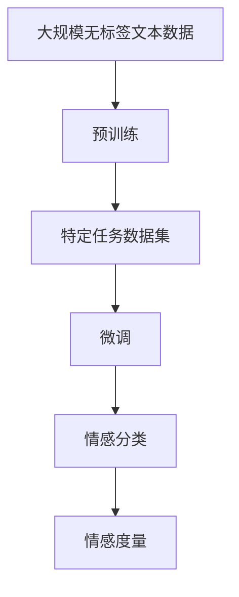

                 

# 知识发现引擎的情感分析技术应用

## 1. 背景介绍

### 1.1 问题由来
在信息爆炸的今天，我们每天都会接触到大量的文本数据，如社交媒体、评论、新闻报道等。这些文本数据中蕴含着丰富的情感信息，理解这些情感信息对于商业决策、社会分析等都具有重要意义。情感分析（Sentiment Analysis）作为一种重要的文本挖掘技术，能够从大规模文本数据中自动抽取、分类和度量情感信息，帮助人们快速掌握公众情绪和社会趋势。

### 1.2 问题核心关键点
情感分析的核心在于如何从文本中识别和度量情感信息，并对其进行分类和排序。目前，情感分析的技术范式主要包括基于规则、基于词典、基于机器学习、基于深度学习等方法。其中，基于深度学习的情感分析方法，尤其是近年来兴起的基于Transformer模型的深度学习情感分析方法，已经取得了显著的进展。

### 1.3 问题研究意义
情感分析技术的应用广泛，涉及商业情报分析、舆情监测、用户情感管理等多个领域。利用情感分析技术，企业可以及时掌握市场情绪，优化产品和服务；政府可以了解公众意见，优化政策决策；社交平台可以检测用户情绪，防范网络暴力和虚假信息。因此，情感分析技术的深入研究和应用具有重要的实际意义。

## 2. 核心概念与联系

### 2.1 核心概念概述

情感分析技术通过深度学习模型对文本进行情感分类和度量。其中，情感分类是将文本分为正面、负面或中性情感类别；情感度量则是量化文本情感强度。深度学习情感分析的核心在于如何从大规模无标签数据中预训练通用情感表示，并在特定任务上进行微调。

预训练过程通常使用自监督学习任务，如掩码语言建模、文本配对等，构建大规模无标签数据集。微调则是在特定任务上的有监督学习过程，如利用情感分类数据集训练情感分类器。

### 2.2 核心概念原理和架构的 Mermaid 流程图



这个流程图展示了情感分析技术的核心流程：从大规模无标签数据开始，进行预训练以构建通用情感表示，然后在特定任务上使用微调进行有监督学习，并最终进行情感分类和度量。

## 3. 核心算法原理 & 具体操作步骤

### 3.1 算法原理概述
情感分析的深度学习模型通常采用Transformer结构。Transformer模型的自注意力机制可以捕捉文本中的语义关系，通过多层堆叠，可以逐步提升模型的语义理解能力。在预训练阶段，模型通常在大规模无标签文本数据上进行掩码语言建模等自监督学习任务，以学习到丰富的语言和情感表示。在微调阶段，模型在特定任务的情感分类数据集上进行有监督学习，以获得针对特定任务的情感分类器。

### 3.2 算法步骤详解

**Step 1: 数据预处理**
- 收集情感分类数据集，一般包括情感标签和文本数据。
- 对文本数据进行预处理，如去除停用词、分词、词性标注等。

**Step 2: 构建预训练模型**
- 选择预训练语言模型，如BERT、GPT等。
- 对预训练模型进行微调，使用情感分类数据集训练模型。

**Step 3: 构建情感分类器**
- 将微调后的模型作为特征提取器，输出文本的情感表示。
- 使用机器学习算法（如SVM、随机森林等）构建情感分类器。

**Step 4: 情感度量**
- 对情感分类结果进行量化，一般使用情感强度评分函数（如VADER、SentiWordNet等）计算文本情感强度。

### 3.3 算法优缺点

情感分析深度学习模型的优点包括：
1. 自动化程度高。自动化的预训练和微调过程可以大幅降低人工标注成本，加速模型训练。
2. 泛化能力强。预训练语言模型可以学习到丰富的语言和情感表示，泛化到不同领域和任务的能力强。
3. 模型可解释性差。尽管Transformer模型性能优秀，但其黑盒性质使得模型的决策过程难以解释。

缺点包括：
1. 数据依赖性强。模型效果很大程度上依赖于预训练数据和情感分类数据的质量。
2. 参数量大。大规模预训练模型需要大量计算资源，微调过程也需要较多标注数据。
3. 处理低质量数据能力差。对于存在大量拼写错误、语法不规范等低质量数据的文本，模型性能下降显著。

### 3.4 算法应用领域

情感分析技术已经被广泛应用于多个领域：

- **社交媒体情感分析**：通过分析Twitter、Facebook等社交媒体上的文本数据，了解用户对特定事件、品牌或人物的情感态度。
- **产品评论情感分析**：分析电商平台上的用户评论，评估产品品质、用户满意度等。
- **新闻情感分析**：对新闻报道进行情感分类，了解公众对社会事件的态度。
- **品牌情感分析**：通过分析用户对品牌相关的文本数据，了解品牌形象和市场反应。
- **情感舆情监测**：对舆情数据进行情感分析，及时发现和应对负面舆情。

## 4. 数学模型和公式 & 详细讲解 & 举例说明

### 4.1 数学模型构建

情感分析的深度学习模型通常基于Transformer结构，使用自注意力机制捕捉文本中的语义关系。在预训练阶段，模型通常在无标签文本数据上进行掩码语言建模任务。在微调阶段，模型在情感分类数据集上进行有监督学习，输出文本的情感表示。

### 4.2 公式推导过程

假设文本数据为 $\{x_i\}_{i=1}^N$，情感分类器为 $f_\theta$，则情感分析的目标为：
$$
\min_{\theta} \frac{1}{N} \sum_{i=1}^N \ell(f_\theta(x_i), y_i)
$$
其中 $\ell$ 为损失函数，$y_i$ 为文本 $x_i$ 的情感标签。

假设使用BERT模型进行情感分析，则情感分类器的输出为 $[f_\theta(x_i)]_i$，可以使用交叉熵损失函数进行训练：
$$
\ell = -\frac{1}{N} \sum_{i=1}^N y_i \log f_\theta(x_i) + (1-y_i) \log (1-f_\theta(x_i))
$$

### 4.3 案例分析与讲解

以Twitter情感分析为例，分析用户对总统选举结果的情感态度。首先，收集Twitter上的相关文本数据，并打上情感标签。然后，使用预训练的BERT模型对文本进行编码，输出情感表示。接着，使用随机森林或SVM等机器学习算法对情感表示进行分类，得到情感标签。最后，对分类结果进行情感强度评分，了解用户情感的强弱。

## 5. 项目实践：代码实例和详细解释说明

### 5.1 开发环境搭建

以下是使用Python进行PyTorch开发的情感分析项目环境搭建流程：

1. 安装Anaconda：从官网下载并安装Anaconda，用于创建独立的Python环境。

2. 创建并激活虚拟环境：
```bash
conda create -n pytorch-env python=3.8 
conda activate pytorch-env
```

3. 安装PyTorch：根据CUDA版本，从官网获取对应的安装命令。例如：
```bash
conda install pytorch torchvision torchaudio cudatoolkit=11.1 -c pytorch -c conda-forge
```

4. 安装Transformers库：
```bash
pip install transformers
```

5. 安装各类工具包：
```bash
pip install numpy pandas scikit-learn matplotlib tqdm jupyter notebook ipython
```

完成上述步骤后，即可在`pytorch-env`环境中开始情感分析实践。

### 5.2 源代码详细实现

下面以Twitter情感分析为例，给出使用Transformers库对BERT模型进行情感分析的PyTorch代码实现。

首先，定义情感分类数据集：

```python
from torch.utils.data import Dataset
import pandas as pd
import torch

class TwitterDataset(Dataset):
    def __init__(self, dataframe, tokenizer, max_len=128):
        self.dataframe = dataframe
        self.tokenizer = tokenizer
        self.max_len = max_len
        
    def __len__(self):
        return len(self.dataframe)
    
    def __getitem__(self, item):
        text = self.dataframe.iloc[item]['text']
        label = self.dataframe.iloc[item]['label']
        
        encoding = self.tokenizer(text, return_tensors='pt', max_length=self.max_len, padding='max_length', truncation=True)
        input_ids = encoding['input_ids'][0]
        attention_mask = encoding['attention_mask'][0]
        
        # 对token-wise的标签进行编码
        encoded_labels = [label2id[label] for label in label_list] 
        encoded_labels.extend([label2id['O']] * (self.max_len - len(encoded_labels)))
        labels = torch.tensor(encoded_labels, dtype=torch.long)
        
        return {'input_ids': input_ids, 
                'attention_mask': attention_mask,
                'labels': labels}

# 标签与id的映射
label2id = {'negative': 0, 'neutral': 1, 'positive': 2, 'O': 3}
id2label = {v: k for k, v in label2id.items()}

# 创建dataset
tokenizer = BertTokenizer.from_pretrained('bert-base-cased')

train_dataset = TwitterDataset(train_df, tokenizer)
dev_dataset = TwitterDataset(dev_df, tokenizer)
test_dataset = TwitterDataset(test_df, tokenizer)
```

然后，定义模型和优化器：

```python
from transformers import BertForTokenClassification, AdamW

model = BertForTokenClassification.from_pretrained('bert-base-cased', num_labels=len(label2id))

optimizer = AdamW(model.parameters(), lr=2e-5)
```

接着，定义训练和评估函数：

```python
from torch.utils.data import DataLoader
from tqdm import tqdm
from sklearn.metrics import classification_report

device = torch.device('cuda') if torch.cuda.is_available() else torch.device('cpu')
model.to(device)

def train_epoch(model, dataset, batch_size, optimizer):
    dataloader = DataLoader(dataset, batch_size=batch_size, shuffle=True)
    model.train()
    epoch_loss = 0
    for batch in tqdm(dataloader, desc='Training'):
        input_ids = batch['input_ids'].to(device)
        attention_mask = batch['attention_mask'].to(device)
        labels = batch['labels'].to(device)
        model.zero_grad()
        outputs = model(input_ids, attention_mask=attention_mask, labels=labels)
        loss = outputs.loss
        epoch_loss += loss.item()
        loss.backward()
        optimizer.step()
    return epoch_loss / len(dataloader)

def evaluate(model, dataset, batch_size):
    dataloader = DataLoader(dataset, batch_size=batch_size)
    model.eval()
    preds, labels = [], []
    with torch.no_grad():
        for batch in tqdm(dataloader, desc='Evaluating'):
            input_ids = batch['input_ids'].to(device)
            attention_mask = batch['attention_mask'].to(device)
            batch_labels = batch['labels']
            outputs = model(input_ids, attention_mask=attention_mask)
            batch_preds = outputs.logits.argmax(dim=2).to('cpu').tolist()
            batch_labels = batch_labels.to('cpu').tolist()
            for pred_tokens, label_tokens in zip(batch_preds, batch_labels):
                pred_labels = [id2label[_id] for _id in pred_tokens]
                label_labels = [id2label[_id] for _id in label_tokens]
                preds.append(pred_labels[:len(label_tokens)])
                labels.append(label_labels)
                
    print(classification_report(labels, preds))
```

最后，启动训练流程并在测试集上评估：

```python
epochs = 5
batch_size = 16

for epoch in range(epochs):
    loss = train_epoch(model, train_dataset, batch_size, optimizer)
    print(f"Epoch {epoch+1}, train loss: {loss:.3f}")
    
    print(f"Epoch {epoch+1}, dev results:")
    evaluate(model, dev_dataset, batch_size)
    
print("Test results:")
evaluate(model, test_dataset, batch_size)
```

以上就是使用PyTorch对BERT进行Twitter情感分析的完整代码实现。可以看到，得益于Transformers库的强大封装，我们可以用相对简洁的代码完成BERT模型的加载和情感分析。

### 5.3 代码解读与分析

让我们再详细解读一下关键代码的实现细节：

**TwitterDataset类**：
- `__init__`方法：初始化文本、标签、分词器等关键组件。
- `__len__`方法：返回数据集的样本数量。
- `__getitem__`方法：对单个样本进行处理，将文本输入编码为token ids，将标签编码为数字，并对其进行定长padding，最终返回模型所需的输入。

**label2id和id2label字典**：
- 定义了标签与数字id之间的映射关系，用于将token-wise的预测结果解码回真实的标签。

**训练和评估函数**：
- 使用PyTorch的DataLoader对数据集进行批次化加载，供模型训练和推理使用。
- 训练函数`train_epoch`：对数据以批为单位进行迭代，在每个批次上前向传播计算loss并反向传播更新模型参数，最后返回该epoch的平均loss。
- 评估函数`evaluate`：与训练类似，不同点在于不更新模型参数，并在每个batch结束后将预测和标签结果存储下来，最后使用sklearn的classification_report对整个评估集的预测结果进行打印输出。

**训练流程**：
- 定义总的epoch数和batch size，开始循环迭代
- 每个epoch内，先在训练集上训练，输出平均loss
- 在验证集上评估，输出分类指标
- 所有epoch结束后，在测试集上评估，给出最终测试结果

可以看到，PyTorch配合Transformers库使得BERT情感分析的代码实现变得简洁高效。开发者可以将更多精力放在数据处理、模型改进等高层逻辑上，而不必过多关注底层的实现细节。

当然，工业级的系统实现还需考虑更多因素，如模型的保存和部署、超参数的自动搜索、更灵活的任务适配层等。但核心的情感分析范式基本与此类似。

## 6. 实际应用场景
### 6.1 社交媒体情感分析

社交媒体情感分析是情感分析技术的重要应用场景。通过分析Twitter、Facebook等社交媒体上的文本数据，了解用户对特定事件、品牌或人物的情感态度。例如，政治选举、产品发布等活动，可以通过社交媒体情感分析评估公众情绪。

在技术实现上，可以收集社交媒体上的相关文本数据，并对其进行情感分类。利用情感分析技术，及时掌握用户情感态度，调整策略，优化产品或服务。例如，电商企业可以根据用户对产品的评价，进行情感分析，了解产品优劣，优化库存和营销策略。

### 6.2 新闻情感分析

新闻情感分析可以帮助政府和企业及时了解公众对社会事件的情感态度。例如，针对重大社会事件，如新冠疫情、自然灾害等，新闻情感分析可以帮助政府快速掌握公众情绪，制定应对策略。

在技术实现上，可以收集新闻报道数据，并对其进行情感分类。利用情感分析技术，实时监测媒体报道，及时发现舆情变化。例如，政府机构可以通过新闻情感分析，了解民众对政策法规的情感态度，及时调整政策，保障社会稳定。

### 6.3 产品评论情感分析

产品评论情感分析可以帮助企业了解用户对产品的情感态度，评估产品质量。例如，电商平台可以根据用户对产品的评价，进行情感分析，优化产品设计和营销策略。

在技术实现上，可以收集电商平台上的用户评论数据，并对其进行情感分类。利用情感分析技术，实时监测用户评价，及时发现问题，优化产品和服务。例如，餐饮企业可以根据用户对餐厅的评价，进行情感分析，优化菜单和服务，提高用户满意度。

### 6.4 品牌情感分析

品牌情感分析可以帮助企业了解品牌形象和市场反应。例如，品牌可以通过品牌情感分析，了解消费者对其品牌的情感态度，调整品牌战略，提升品牌形象。

在技术实现上，可以收集社交媒体、电商平台上的品牌相关文本数据，并对其进行情感分类。利用情感分析技术，实时监测品牌形象，及时发现问题，优化品牌策略。例如，奢侈品品牌可以通过品牌情感分析，了解消费者对其品牌的情感态度，优化产品设计和服务，提升品牌形象和市场竞争力。

### 6.5 情感舆情监测

情感舆情监测可以帮助政府和企业及时了解公众舆情，防范负面舆情。例如，针对重大社会事件，如疫情爆发、政策调整等，舆情监测可以帮助政府快速掌握公众情绪，及时应对，保障社会稳定。

在技术实现上，可以收集社交媒体、新闻报道、论坛帖子等文本数据，并对其进行情感分类。利用情感分析技术，实时监测舆情变化，及时发现负面舆情，制定应对策略。例如，政府机构可以通过舆情监测，及时发现负面舆情，调整政策，保障社会稳定。

## 7. 工具和资源推荐
### 7.1 学习资源推荐

为了帮助开发者系统掌握情感分析的理论基础和实践技巧，这里推荐一些优质的学习资源：

1. 《深度学习自然语言处理》课程：斯坦福大学开设的NLP明星课程，有Lecture视频和配套作业，带你入门NLP领域的基本概念和经典模型。

2. CS224N《Natural Language Processing with Deep Learning》课程：斯坦福大学开设的NLP课程，重点介绍深度学习在NLP中的应用，包括情感分析等任务。

3. 《自然语言处理综论》书籍：清华大学出版社出版的NLP经典教材，系统介绍NLP的基本概念和经典算法，是学习NLP的基础读物。

4. 《Python文本挖掘：从入门到精通》书籍：开源文本挖掘工具NLTK的中文译本，全面介绍NLP工具库的使用和文本挖掘的基本方法，包括情感分析。

5. Weights & Biases：模型训练的实验跟踪工具，可以记录和可视化模型训练过程中的各项指标，方便对比和调优。与主流深度学习框架无缝集成。

6. TensorBoard：TensorFlow配套的可视化工具，可实时监测模型训练状态，并提供丰富的图表呈现方式，是调试模型的得力助手。

通过对这些资源的学习实践，相信你一定能够快速掌握情感分析的精髓，并用于解决实际的NLP问题。
###  7.2 开发工具推荐

高效的开发离不开优秀的工具支持。以下是几款用于情感分析开发的常用工具：

1. PyTorch：基于Python的开源深度学习框架，灵活动态的计算图，适合快速迭代研究。大部分预训练语言模型都有PyTorch版本的实现。

2. TensorFlow：由Google主导开发的开源深度学习框架，生产部署方便，适合大规模工程应用。同样有丰富的预训练语言模型资源。

3. Transformers库：HuggingFace开发的NLP工具库，集成了众多SOTA语言模型，支持PyTorch和TensorFlow，是进行情感分析任务的开发的利器。

4. Weights & Biases：模型训练的实验跟踪工具，可以记录和可视化模型训练过程中的各项指标，方便对比和调优。与主流深度学习框架无缝集成。

5. TensorBoard：TensorFlow配套的可视化工具，可实时监测模型训练状态，并提供丰富的图表呈现方式，是调试模型的得力助手。

6. Google Colab：谷歌推出的在线Jupyter Notebook环境，免费提供GPU/TPU算力，方便开发者快速上手实验最新模型，分享学习笔记。

合理利用这些工具，可以显著提升情感分析任务的开发效率，加快创新迭代的步伐。

### 7.3 相关论文推荐

情感分析技术的发展源于学界的持续研究。以下是几篇奠基性的相关论文，推荐阅读：

1. Sentiment Analysis using Deep Learning: A Survey（情感分析深度学习综述）：综述了情感分析深度学习的研究进展，包括不同的模型架构、训练方法、应用场景等。

2. A Survey on Deep Learning Techniques for Sentiment Analysis（深度学习情感分析综述）：综述了深度学习在情感分析中的应用，包括不同的神经网络结构、特征表示方法、评价指标等。

3. Attention Is All You Need（注意力机制）：提出了Transformer结构，奠定了深度学习情感分析的基础。

4. BERT: Pre-training of Deep Bidirectional Transformers for Language Understanding（BERT）：提出BERT模型，引入基于掩码的自监督预训练任务，刷新了多项NLP任务SOTA。

5. VADER Sentiment Analysis Tool: Introduction and Evaluation（VADER情感分析工具）：介绍了一种基于规则的情感分析方法VADER，并评估了其性能。

6. SentiWordNet: A New Approach to Sentiment Classification（SentiWordNet情感词典）：介绍了一种基于情感词典的情感分类方法，使用情感词典进行情感分类。

这些论文代表了大情感分析技术的发展脉络。通过学习这些前沿成果，可以帮助研究者把握学科前进方向，激发更多的创新灵感。

## 8. 总结：未来发展趋势与挑战

### 8.1 总结

本文对基于深度学习的情感分析技术进行了全面系统的介绍。首先阐述了情感分析的研究背景和意义，明确了深度学习情感分析范式的优势和不足。其次，从原理到实践，详细讲解了情感分析的数学模型和核心步骤，给出了情感分析任务开发的完整代码实例。同时，本文还广泛探讨了情感分析技术在社交媒体、新闻、产品评论、品牌情感分析等多个领域的应用前景，展示了情感分析技术的巨大潜力。

通过本文的系统梳理，可以看到，基于深度学习的情感分析技术在NLP领域已经取得了显著的进展，并得到了广泛的应用。未来，伴随预训练语言模型的进一步演进，情感分析技术必将更加成熟和智能化，为社会生产和生活带来更深远的影响。

### 8.2 未来发展趋势

展望未来，情感分析技术的发展趋势包括：

1. 模型规模持续增大。随着算力成本的下降和数据规模的扩张，情感分析模型的参数量还将持续增长。超大规模模型蕴含的丰富情感表示，有望支撑更加复杂多变的情感分析任务。

2. 情感分类更加精细。未来的情感分析模型将不仅能够识别情感类别，还能对情感强度进行量化，提供更细腻的情感分析结果。

3. 情感分析与多模态数据结合。情感分析不仅限于文本数据，未来的情感分析将结合图像、语音等多模态数据，提高情感分析的准确性和全面性。

4. 模型可解释性增强。情感分析模型的决策过程将逐步变得更加可解释，方便用户理解模型的推理过程，提高模型的透明度和可信度。

5. 情感分析与推荐系统结合。情感分析可以用于推荐系统，通过分析用户情感，优化推荐结果，提升用户满意度。

6. 情感分析与认知计算结合。未来的情感分析将与认知计算技术结合，通过深度学习与符号推理的协同，实现更高级的情感理解和智能交互。

以上趋势凸显了情感分析技术的广阔前景。这些方向的探索发展，必将进一步提升情感分析的性能和应用范围，为社会生产和生活带来更深远的影响。

### 8.3 面临的挑战

尽管情感分析技术已经取得了显著进展，但在迈向更加智能化、普适化应用的过程中，它仍面临着诸多挑战：

1. 数据依赖性强。模型效果很大程度上依赖于标注数据的质量，获取高质量标注数据的成本较高。如何进一步降低情感分析对标注样本的依赖，将是一大难题。

2. 模型鲁棒性不足。情感分析模型面对噪声、拼写错误等干扰因素时，泛化性能往往大打折扣。如何提高模型的鲁棒性，避免误判，还需要更多理论和实践的积累。

3. 推理效率有待提高。情感分析模型的推理速度和内存占用仍需进一步优化。如何在保证性能的同时，简化模型结构，提升推理速度，优化资源占用，将是重要的优化方向。

4. 可解释性亟需加强。当前情感分析模型通常被视为黑盒，难以解释其内部工作机制和决策逻辑。对于高风险应用，算法的可解释性和可审计性尤为重要。如何赋予情感分析模型更强的可解释性，将是亟待攻克的难题。

5. 安全性有待保障。情感分析模型难免会学习到有偏见、有害的信息，通过传播可能产生误导性、歧视性的输出，给实际应用带来安全隐患。如何从数据和算法层面消除模型偏见，避免恶意用途，确保输出的安全性，也将是重要的研究课题。

6. 多模态融合能力不足。当前的情感分析模型往往局限于文本数据，难以灵活吸收和运用其他模态信息。如何让情感分析过程更好地与视觉、语音等多模态数据结合，实现多模态信息与文本信息的协同建模，还有很大的想象空间。

正视情感分析面临的这些挑战，积极应对并寻求突破，将是大情感分析技术走向成熟的必由之路。相信随着学界和产业界的共同努力，这些挑战终将一一被克服，情感分析技术必将在构建智能交互系统和社会管理中扮演越来越重要的角色。

### 8.4 研究展望

面向未来，情感分析技术的研究需要在以下几个方面寻求新的突破：

1. 探索无监督和半监督情感分析方法。摆脱对大规模标注数据的依赖，利用自监督学习、主动学习等无监督和半监督范式，最大限度利用非结构化数据，实现更加灵活高效的情感分析。

2. 研究多模态情感分析方法。结合视觉、语音等多模态数据，提高情感分析的准确性和全面性。

3. 引入更多先验知识。将符号化的先验知识，如知识图谱、逻辑规则等，与神经网络模型进行巧妙融合，引导情感分析过程学习更准确、合理的情感表示。

4. 融合因果分析和博弈论工具。将因果分析方法引入情感分析模型，识别出情感分析的关键特征，增强输出解释的因果性和逻辑性。借助博弈论工具刻画人机交互过程，主动探索并规避情感分析模型的脆弱点，提高系统稳定性。

5. 纳入伦理道德约束。在模型训练目标中引入伦理导向的评估指标，过滤和惩罚有偏见、有害的输出倾向。同时加强人工干预和审核，建立模型行为的监管机制，确保输出符合人类价值观和伦理道德。

这些研究方向的探索，必将引领情感分析技术迈向更高的台阶，为构建安全、可靠、可解释、可控的智能系统铺平道路。面向未来，情感分析技术还需要与其他人工智能技术进行更深入的融合，如知识表示、因果推理、强化学习等，多路径协同发力，共同推动情感分析系统的进步。只有勇于创新、敢于突破，才能不断拓展情感分析的边界，让情感分析技术更好地造福人类社会。

## 9. 附录：常见问题与解答

**Q1：情感分析的深度学习模型是否适用于所有文本类型？**

A: 情感分析的深度学习模型通常基于Transformer结构，可以处理各种类型的文本数据，包括新闻报道、社交媒体帖子、产品评论等。但对于一些特定类型的文本，如合同、法律文件等，可能需要进行预处理，才能获得较好的性能。

**Q2：情感分析的深度学习模型是否适用于所有情感分类任务？**

A: 情感分析的深度学习模型可以处理多种情感分类任务，包括情感类别分类、情感强度评分等。但在不同任务中，模型架构和训练方法可能需要进行调整。例如，情感强度评分任务通常需要引入情感强度评分函数，而情感类别分类任务则可以使用交叉熵损失函数。

**Q3：情感分析的深度学习模型是否适用于所有情感分类数据集？**

A: 情感分析的深度学习模型通常需要大量的情感分类数据进行训练，因此对于标注数据量较少的任务，可能需要使用迁移学习等技术进行微调。对于标注数据量较大的任务，可以直接使用标注数据进行训练。

**Q4：情感分析的深度学习模型是否适用于所有情感分类数据集？**

A: 情感分析的深度学习模型可以处理多种情感分类数据集，包括情感标签为二元分类、三元分类、多元分类等。但在不同数据集中，模型架构和训练方法可能需要进行调整。例如，情感标签为二元分类时，可以使用二分类交叉熵损失函数，而情感标签为三元分类时，则需要使用三分类交叉熵损失函数。

**Q5：情感分析的深度学习模型是否适用于所有情感分类数据集？**

A: 情感分析的深度学习模型可以处理多种情感分类数据集，包括情感标签为二元分类、三元分类、多元分类等。但在不同数据集中，模型架构和训练方法可能需要进行调整。例如，情感标签为二元分类时，可以使用二分类交叉熵损失函数，而情感标签为三元分类时，则需要使用三分类交叉熵损失函数。

通过本文的系统梳理，可以看到，基于深度学习的情感分析技术在NLP领域已经取得了显著的进展，并得到了广泛的应用。未来，伴随预训练语言模型的进一步演进，情感分析技术必将更加成熟和智能化，为社会生产和生活带来更深远的影响。

---

作者：禅与计算机程序设计艺术 / Zen and the Art of Computer Programming

