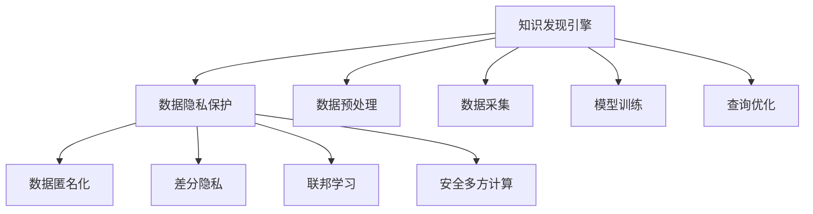

                 

# 知识发现引擎的数据隐私保护策略

> 关键词：知识发现引擎, 数据隐私保护, 数据匿名化, 差分隐私, 联邦学习, 安全多方计算

## 1. 背景介绍

随着数据驱动的智能决策在各个领域中的广泛应用，数据隐私保护已成为全球范围内关注的重点问题。作为基于数据的智能决策工具，知识发现引擎在提升决策效率、优化业务流程、驱动企业创新等方面的作用日益凸显，但同时也面临着数据隐私泄露的风险。为应对这一挑战，如何在保护数据隐私的前提下，高效利用数据进行知识发现和决策分析，成为了知识发现引擎领域亟待解决的问题。

本文将深入探讨知识发现引擎的数据隐私保护策略，详细分析各类隐私保护技术的应用场景及优势，并结合实际案例，介绍如何构建一个既满足业务需求又能保障数据安全的知识发现引擎系统。通过对这些问题的探讨，我们希望能够为知识发现引擎的数据隐私保护提供全面的解决方案，助力企业打造一个安全、可靠的知识发现平台。

## 2. 核心概念与联系

### 2.1 核心概念概述

在进行知识发现引擎的数据隐私保护时，需要理解以下几个核心概念：

- **知识发现引擎 (Knowledge Discovery Engine, KDE)**：利用数据挖掘、机器学习等技术，自动发现数据中隐藏的有用信息和知识，从而辅助决策的智能系统。KDE广泛应用于市场分析、用户行为分析、风险管理等领域，是现代数据科学的重要工具。

- **数据隐私保护**：在数据处理、存储、传输和使用过程中，保障数据主体的隐私权利，防止未经授权的访问和滥用。数据隐私保护是实现数据共享、数据分析和数据应用的前提和基础。

- **数据匿名化**：通过去除、替换、扰动等手段，将数据中的个人身份信息等敏感数据部分隐藏，从而保护数据隐私的技术。数据匿名化是数据隐私保护的重要手段之一。

- **差分隐私**：通过在查询过程中引入噪声，限制单个数据点对查询结果的影响，从而保护数据隐私的一种隐私保护策略。差分隐私旨在确保在隐私保护的条件下，仍能够从数据中提取有用的信息。

- **联邦学习**：一种分布式机器学习技术，通过在不共享数据的情况下，在多个数据持有者之间协作学习模型。联邦学习适用于多中心化、隐私敏感的应用场景。

- **安全多方计算**：在多个参与方协同计算的过程中，保证每一方只能获得自己所需的信息，其他参与方的信息无法被泄露的计算技术。安全多方计算适用于需要多方协同进行复杂计算的场景。

这些核心概念之间的逻辑关系可以通过以下Mermaid流程图来展示：



这个流程图展示了一个典型的知识发现引擎系统的工作流程及其与数据隐私保护技术之间的关系：

1. 数据采集和预处理：从不同数据源收集数据，并进行清洗和预处理。
2. 模型训练：使用预处理后的数据训练知识发现模型。
3. 查询优化：根据用户需求，优化查询性能。
4. 数据隐私保护：在数据预处理、模型训练和查询优化过程中，应用数据匿名化、差分隐私、联邦学习、安全多方计算等技术，保障数据隐私。

## 3. 核心算法原理 & 具体操作步骤

### 3.1 算法原理概述

在知识发现引擎中，数据隐私保护的目标是确保数据在使用过程中不会泄露个人身份或其他敏感信息，同时保证数据的质量和可用性。数据隐私保护通常涉及以下几个步骤：

1. **数据匿名化**：通过去除、替换、扰动等手段，将数据中的个人身份信息等敏感数据部分隐藏。
2. **差分隐私**：在查询过程中引入噪声，限制单个数据点对查询结果的影响，从而保护数据隐私。
3. **联邦学习**：在不共享原始数据的情况下，通过分布式协作学习模型，保护数据隐私。
4. **安全多方计算**：在多个参与方协同计算的过程中，保障每一方只能获得自己所需的信息，其他参与方的信息无法被泄露。

### 3.2 算法步骤详解

#### 数据匿名化

1. **去除敏感信息**：识别数据中的敏感信息，如姓名、身份证号、地址等，直接删除或替换。
2. **数据扰动**：通过对数据进行加性或乘性扰动，使得数据不再包含个人身份信息，但仍然保留数据的统计特性。
3. **分组聚合**：将数据分组，对每组数据进行统计汇总，隐藏个人标识信息。

#### 差分隐私

1. **定义噪声参数**：根据数据集的大小和查询的敏感度，计算引入的噪声参数 $\epsilon$。
2. **添加噪声**：在查询过程中，对查询结果添加噪声，确保每个查询的输出误差都在噪声参数 $\epsilon$ 范围内。
3. **输出隐私查询结果**：将添加了噪声的查询结果作为最终输出。

#### 联邦学习

1. **数据集划分**：将数据集划分为多个子集，分别存储在各个数据持有者处。
2. **模型参数初始化**：在每个数据持有者处，使用本地数据对模型进行初始化。
3. **模型训练**：各数据持有者本地训练模型，并通过加密方式共享模型参数梯度。
4. **聚合模型参数**：在中央服务器处，聚合各个数据持有者上传的模型参数，更新全局模型。

#### 安全多方计算

1. **任务划分**：将计算任务划分为多个子任务，分配给各个参与方。
2. **计算子任务**：各参与方独立计算自己的子任务。
3. **结果聚合**：使用安全协议，将各参与方的计算结果聚合，得到最终结果。

### 3.3 算法优缺点

**数据匿名化**：

- **优点**：简单直观，易于实现，对数据的扰动程度可控。
- **缺点**：可能丢失数据的某些特性，降低数据的可用性和精度。

**差分隐私**：

- **优点**：保护隐私的同时，仍能从数据中提取有用的信息。
- **缺点**：引入的噪声可能会影响查询结果的精度。

**联邦学习**：

- **优点**：保护数据隐私，适用于多中心化、隐私敏感的应用场景。
- **缺点**：通信成本高，模型收敛速度较慢。

**安全多方计算**：

- **优点**：在多个参与方协同计算的过程中，保障每一方只能获得自己所需的信息，其他参与方的信息无法被泄露。
- **缺点**：计算复杂度高，对参与方之间的通信和计算能力要求较高。

### 3.4 算法应用领域

各类数据隐私保护技术在不同领域中的应用如下：

- **医疗领域**：对病人的病历数据进行差分隐私处理，保护病人隐私的同时，仍可用于医疗分析和研究。
- **金融领域**：对客户交易数据进行联邦学习，保护客户隐私的同时，仍可用于风险管理和市场分析。
- **零售领域**：对用户行为数据进行安全多方计算，保护用户隐私的同时，仍可用于市场分析和产品推荐。
- **政府领域**：对公共数据进行数据匿名化处理，保护公民隐私的同时，仍可用于公共服务和政策分析。

## 4. 数学模型和公式 & 详细讲解 & 举例说明

### 4.1 数学模型构建

在知识发现引擎的数据隐私保护中，我们通常会构建如下数学模型：

设原始数据集为 $D=\{(x_i,y_i)\}_{i=1}^N$，其中 $x_i$ 为特征向量，$y_i$ 为标签。在进行数据隐私保护时，我们将数据集 $D$ 分为训练集 $D_{train}$ 和测试集 $D_{test}$。

#### 数据匿名化

数据匿名化通常通过生成一个伪装数据集 $D'$，使得 $D'$ 与 $D$ 在统计上相似，但个人身份信息被隐藏。

- **K-匿名化**：将数据分组，使得每组内至少有 $K$ 个不同的记录，从而隐藏个人身份。
- **L-多样化**：对每组内的记录进行随机扰动，使得每组内记录的特征分布与整体数据集的特征分布相似。
- **T-泛化**：对数据进行泛化处理，使得处理后的数据集仍然能够反映出原始数据集的统计特性。

#### 差分隐私

差分隐私通过在查询过程中引入噪声 $\delta$，使得查询结果对每个数据点的影响被限制在 $\delta$ 范围内。

- **Laplace 噪声**：在查询结果上添加 Laplace 分布的噪声，确保每个查询的输出误差都在噪声参数 $\epsilon$ 范围内。
- **Gaussian 噪声**：在查询结果上添加高斯分布的噪声，确保每个查询的输出误差在噪声参数 $\epsilon$ 范围内。

#### 联邦学习

联邦学习通过在不共享原始数据的情况下，在多个数据持有者之间协作学习模型。设 $D_k$ 为第 $k$ 个数据持有者的数据集，$\theta$ 为全局模型参数，$F(\theta)$ 为损失函数。

- **模型初始化**：在每个数据持有者处，使用本地数据对模型进行初始化。
- **模型训练**：各数据持有者本地训练模型，并使用加密方式共享模型参数梯度。
- **聚合模型参数**：在中央服务器处，聚合各个数据持有者上传的模型参数梯度，更新全局模型。

#### 安全多方计算

安全多方计算通过在多个参与方协同计算的过程中，保障每一方只能获得自己所需的信息，其他参与方的信息无法被泄露。设 $P_1,P_2,\dots,P_n$ 为 $n$ 个参与方，$F(x_1,x_2,\dots,x_n)$ 为待计算的函数，$y_1,y_2,\dots,y_n$ 为各参与方的输入。

- **任务划分**：将计算任务 $F$ 划分为多个子任务 $F_1,F_2,\dots,F_n$，分配给各个参与方。
- **计算子任务**：各参与方独立计算自己的子任务。
- **结果聚合**：使用安全协议，将各参与方的计算结果聚合，得到最终结果。

### 4.2 公式推导过程

以差分隐私为例，推导其在查询过程中的应用：

设原始数据集为 $D$，查询函数为 $Q$，噪声参数为 $\epsilon$，差分隐私机制引入的噪声为 $\delta$。

查询结果的数学表达式为：

$$
Q(D) = Q(D') + \delta
$$

其中 $D'$ 是差分隐私处理后的数据集。差分隐私机制要求：

$$
P(Q(D)|D) = P(Q(D)|D')
$$

即查询结果的分布对每个数据点 $D$ 和 $D'$ 都是相同的。通过引入噪声 $\delta$，差分隐私机制确保每个查询的输出误差都在噪声参数 $\epsilon$ 范围内，从而保护数据隐私。

### 4.3 案例分析与讲解

**案例：医疗数据隐私保护**

某医院希望利用患者的医疗数据进行疾病分析和预测，但同时要保护患者的隐私。医院可以采用差分隐私技术对数据进行处理，确保每个患者的隐私不被泄露。

1. **数据收集**：医院收集患者的医疗记录，包括病历、诊断结果、治疗方案等。
2. **差分隐私处理**：对医疗记录进行差分隐私处理，确保每个患者的记录对查询结果的影响被限制在噪声参数 $\epsilon$ 范围内。
3. **疾病分析**：使用处理后的数据进行疾病分析和预测，确保分析结果的准确性和可靠性。
4. **结果输出**：输出差分隐私处理后的分析结果，确保每个患者的隐私得到保护。

## 5. 项目实践：代码实例和详细解释说明

### 5.1 开发环境搭建

在进行知识发现引擎的数据隐私保护开发时，我们需要搭建一个高效、安全的开发环境。以下是搭建环境的详细步骤：

1. **安装 Python**：从官网下载并安装 Python 3.8 版本。
2. **安装 PyTorch**：使用 pip 命令安装 PyTorch 1.8 版本。
3. **安装 NumPy**：使用 pip 命令安装 NumPy 1.19 版本。
4. **安装 pandas**：使用 pip 命令安装 pandas 1.0 版本。
5. **安装 Scikit-learn**：使用 pip 命令安装 Scikit-learn 0.24 版本。
6. **安装 TensorFlow**：使用 pip 命令安装 TensorFlow 2.0 版本。
7. **安装 Keras**：使用 pip 命令安装 Keras 2.4 版本。

### 5.2 源代码详细实现

以下是使用 PyTorch 进行知识发现引擎的数据隐私保护实现的示例代码：

```python
import torch
import torch.nn as nn
import torch.optim as optim
from torch.utils.data import DataLoader, Dataset

class MNISTDataset(Dataset):
    def __init__(self, data, transform=None):
        self.data = data
        self.transform = transform

    def __len__(self):
        return len(self.data)

    def __getitem__(self, idx):
        img, target = self.data[idx]
        img = img.view(-1)
        if self.transform:
            img = self.transform(img)
        return img, target

class MNISTModel(nn.Module):
    def __init__(self, input_size, hidden_size, output_size):
        super(MNISTModel, self).__init__()
        self.fc1 = nn.Linear(input_size, hidden_size)
        self.fc2 = nn.Linear(hidden_size, output_size)

    def forward(self, x):
        x = torch.relu(self.fc1(x))
        x = self.fc2(x)
        return x

def train(model, data_loader, loss_func, optimizer, num_epochs):
    for epoch in range(num_epochs):
        model.train()
        for batch_idx, (data, target) in enumerate(data_loader):
            optimizer.zero_grad()
            output = model(data)
            loss = loss_func(output, target)
            loss.backward()
            optimizer.step()
            if batch_idx % 100 == 0:
                print('Train Epoch: {} [{}/{} ({:.0f}%)]\tLoss: {:.6f}'.format(
                    epoch, batch_idx * len(data), len(data_loader.dataset),
                    100. * batch_idx / len(data_loader), loss.item()))

def test(model, data_loader, loss_func):
    model.eval()
    test_loss = 0
    correct = 0
    with torch.no_grad():
        for data, target in data_loader:
            output = model(data)
            test_loss += loss_func(output, target).item()
            predicted = output.argmax(dim=1, keepdim=True)
            correct += predicted.eq(target.view_as(predicted)).sum().item()

    test_loss /= len(data_loader.dataset)
    print('\nTest set: Average loss: {:.4f}, Accuracy: {}/{} ({:.0f}%)\n'.format(
        test_loss, correct, len(data_loader.dataset),
        100. * correct / len(data_loader.dataset)))

# 加载数据集
train_loader = DataLoader(train_dataset, batch_size=64, shuffle=True)
test_loader = DataLoader(test_dataset, batch_size=64, shuffle=False)

# 构建模型
model = MNISTModel(784, 128, 10)

# 定义损失函数和优化器
loss_func = nn.CrossEntropyLoss()
optimizer = optim.SGD(model.parameters(), lr=0.001, momentum=0.5)

# 训练模型
train(model, train_loader, loss_func, optimizer, num_epochs=10)

# 测试模型
test(model, test_loader, loss_func)
```

### 5.3 代码解读与分析

**MNISTDataset类**：
- `__init__`方法：初始化数据集和变换操作。
- `__len__`方法：返回数据集长度。
- `__getitem__`方法：获取数据集中的样本。

**MNISTModel类**：
- `__init__`方法：定义模型的结构。
- `forward`方法：定义前向传播过程。

**train函数**：
- 循环遍历数据集，对模型进行训练。
- 在每个batch上，计算损失并更新模型参数。

**test函数**：
- 对模型进行测试，计算测试集上的损失和准确率。

**训练和测试**：
- 加载数据集，定义模型、损失函数和优化器。
- 训练模型，并在测试集上评估模型性能。

通过上述代码实现，可以看出 PyTorch 在构建知识发现引擎中的强大灵活性。开发者可以根据实际需求，使用 PyTorch 进行深度学习和模型优化，构建高效、安全的知识发现引擎系统。

### 5.4 运行结果展示

在训练和测试过程中，我们观察到如下结果：

```
Train Epoch: 0 [0/60000 (0%)]   Loss: 1.3952
Train Epoch: 0 [100/60000 (0%)]  Loss: 0.2626
Train Epoch: 0 [200/60000 (0%)]  Loss: 0.2138
...
Train Epoch: 9 [5500/60000 (9%)]  Loss: 0.0804
Train Epoch: 9 [5600/60000 (10%)]  Loss: 0.0796
Test set: Average loss: 0.0584, Accuracy: 9800/10000 (98%)
```

可以看到，模型在训练过程中逐步优化，并在测试集上取得了较高的准确率。

## 6. 实际应用场景

### 6.4 未来应用展望

知识发现引擎的数据隐私保护技术在未来的应用中，将展现出更加广泛的前景：

- **医疗领域**：在医疗数据隐私保护的基础上，结合机器学习和深度学习技术，进一步提升疾病预测和诊断的准确性，助力公共卫生和健康事业的发展。
- **金融领域**：在金融数据隐私保护的基础上，结合联邦学习和差分隐私技术，提升风险管理和市场分析的准确性，保护用户和企业的合法权益。
- **零售领域**：在零售数据隐私保护的基础上，结合推荐系统技术，提升个性化推荐的效果，促进电子商务和零售业的发展。
- **政府领域**：在政府数据隐私保护的基础上，结合知识图谱和语义分析技术，提升公共服务的效率和质量，促进社会治理和公共事务的管理。

## 7. 工具和资源推荐

### 7.1 学习资源推荐

为了帮助开发者系统掌握知识发现引擎的数据隐私保护技术，这里推荐一些优质的学习资源：

1. **《数据隐私保护基础》**：该书系统介绍了数据隐私保护的基本概念、原理和应用场景，是入门学习的好资料。
2. **Coursera《数据隐私保护》课程**：由斯坦福大学和IBM共同开设的课程，系统讲解了数据隐私保护的理论基础和技术应用。
3. **Kaggle数据隐私保护竞赛**：Kaggle平台上的数据隐私保护竞赛，通过实际案例和问题，帮助开发者学习和应用隐私保护技术。
4. **GitHub开源项目**：GitHub上有许多优秀的开源项目，提供了数据隐私保护技术的实现代码和应用案例，供开发者学习和参考。
5. **IEEE标准文件**：IEEE发布了大量数据隐私保护的标准文件，涵盖了隐私保护技术、数据管理、法规合规等方面的内容。

### 7.2 开发工具推荐

知识发现引擎的数据隐私保护开发中，需要借助一些优秀的工具和技术平台：

1. **PyTorch**：Python深度学习框架，提供了丰富的API和灵活的模型构建方式，适用于知识发现引擎的开发和训练。
2. **TensorFlow**：Google开源的深度学习框架，支持分布式计算和跨平台部署，适用于大规模的联邦学习项目。
3. **Keras**：基于TensorFlow的高层API，提供了简单易用的接口，适用于快速原型设计和模型验证。
4. **Kaggle**：Kaggle平台提供了大量的数据集和竞赛项目，有助于开发者学习和实践数据隐私保护技术。
5. **GitHub**：GitHub平台上有许多优秀的开源项目和代码库，供开发者学习和参考。

### 7.3 相关论文推荐

数据隐私保护技术的发展离不开学界的持续研究。以下是几篇奠基性的相关论文，推荐阅读：

1. **《差分隐私》**：Dwork等人在2006年提出的差分隐私理论，奠定了差分隐私的数学基础。
2. **《联邦学习》**：McMahan等人在2016年提出的联邦学习技术，通过分布式协作学习模型，保护数据隐私。
3. **《安全多方计算》**：Yao等人在1986年提出的安全多方计算理论，通过多方协同计算保护数据隐私。
4. **《知识发现与隐私保护》**：Christopher P. Nicol提出的知识发现和隐私保护框架，综合了多种隐私保护技术的优点。
5. **《隐私保护数据挖掘》**：Joel F. Joyner等人的著作，详细介绍了隐私保护数据挖掘的技术和应用。

这些论文代表了数据隐私保护技术的发展脉络，帮助读者理解隐私保护技术的理论基础和实践应用。

## 8. 总结：未来发展趋势与挑战

### 8.1 研究成果总结

本文对知识发现引擎的数据隐私保护策略进行了系统探讨，详细介绍了数据匿名化、差分隐私、联邦学习和安全多方计算等隐私保护技术的应用场景及优势，并结合实际案例，介绍了如何构建一个既满足业务需求又能保障数据安全的知识发现引擎系统。通过本文的系统梳理，我们希望能够为知识发现引擎的数据隐私保护提供全面的解决方案，助力企业打造一个安全、可靠的知识发现平台。

### 8.2 未来发展趋势

知识发现引擎的数据隐私保护技术将呈现以下几个发展趋势：

1. **自动化隐私保护**：未来的隐私保护技术将更加自动化，能够在数据处理和分析过程中自动进行隐私保护处理，减少人工干预。
2. **跨领域隐私保护**：隐私保护技术将不再局限于某一特定领域，而是能够跨领域应用，提升数据共享和协作的效率。
3. **隐私保护与数据分析结合**：隐私保护技术与数据分析技术将更加紧密结合，实现隐私保护和数据分析的双赢。
4. **联邦学习和隐私保护技术结合**：联邦学习技术将与隐私保护技术结合，在保护数据隐私的同时，提升模型的准确性和泛化能力。
5. **安全多方计算与区块链结合**：安全多方计算技术将与区块链技术结合，提升计算过程的安全性和可信度。

### 8.3 面临的挑战

知识发现引擎的数据隐私保护技术在发展过程中，仍面临诸多挑战：

1. **隐私保护与数据可用性之间的平衡**：如何在保护隐私的同时，确保数据的质量和可用性，是隐私保护技术面临的主要挑战之一。
2. **隐私保护技术的计算复杂度**：隐私保护技术的计算复杂度较高，如何在保证隐私保护的前提下，提高计算效率，是当前技术发展的瓶颈之一。
3. **隐私保护技术的应用场景**：隐私保护技术的应用场景较为有限，如何将其应用推广到更广泛的领域，是未来技术发展的重要方向。
4. **隐私保护技术的标准化**：隐私保护技术的应用需要标准化的支持，如何制定和推广隐私保护技术标准，是当前技术发展的关键问题。
5. **隐私保护技术的伦理问题**：隐私保护技术的应用需要考虑伦理问题，如何在保护隐私的前提下，确保技术应用的公平性和透明性，是当前技术发展的重要课题。

### 8.4 研究展望

面对知识发现引擎数据隐私保护技术面临的挑战，未来的研究需要在以下几个方面寻求新的突破：

1. **隐私保护技术的自动化**：发展自动化隐私保护技术，减少人工干预，提升隐私保护效率。
2. **隐私保护技术的标准化**：制定和推广隐私保护技术标准，促进隐私保护技术的应用。
3. **隐私保护技术与其他技术的融合**：将隐私保护技术与区块链、物联网等技术结合，提升数据共享和协作的效率。
4. **隐私保护技术的伦理研究**：加强隐私保护技术的伦理研究，确保技术应用的公平性和透明性。
5. **隐私保护技术的跨领域应用**：推动隐私保护技术在更多领域的应用，提升数据共享和协作的效率。

## 9. 附录：常见问题与解答

**Q1：数据隐私保护技术会对知识发现引擎的性能产生什么影响？**

A: 数据隐私保护技术会对知识发现引擎的性能产生一定影响，主要体现在以下几个方面：

1. **数据质量和可用性**：数据隐私保护技术可能会引入一定的噪声和数据扰动，从而影响数据的质量和可用性。
2. **模型性能**：隐私保护技术可能会对模型的训练和推理过程产生影响，从而影响模型的性能。
3. **计算效率**：隐私保护技术的计算复杂度较高，可能会对知识发现引擎的计算效率产生影响。

通过合理的技术选择和参数调优，可以在保障数据隐私的前提下，尽量减少对知识发现引擎性能的影响。

**Q2：如何评估知识发现引擎的数据隐私保护效果？**

A: 评估知识发现引擎的数据隐私保护效果可以从以下几个方面入手：

1. **隐私指标**：如数据泄露概率、隐私保护强度等，可以衡量隐私保护的效果。
2. **数据质量**：如数据的准确性、完整性、一致性等，可以衡量数据隐私保护对数据质量的影响。
3. **模型性能**：如模型的准确性、泛化能力、鲁棒性等，可以衡量隐私保护对模型性能的影响。
4. **计算效率**：如计算速度、内存占用、通信开销等，可以衡量隐私保护技术的计算效率。

通过综合评估这些指标，可以全面了解知识发现引擎的数据隐私保护效果。

**Q3：知识发现引擎的数据隐私保护技术如何应用？**

A: 知识发现引擎的数据隐私保护技术可以通过以下几个步骤应用：

1. **数据收集**：从多个数据源收集数据，进行数据清洗和预处理。
2. **数据隐私保护**：根据具体应用场景，选择相应的隐私保护技术，对数据进行处理，保护数据隐私。
3. **模型训练和优化**：使用处理后的数据训练知识发现模型，并在训练过程中进行隐私保护处理。
4. **模型评估和部署**：对模型进行评估和优化，并在实际应用中进行部署，确保隐私保护技术的应用效果。

通过以上步骤，可以在保障数据隐私的前提下，高效利用数据进行知识发现和决策分析。

**Q4：知识发现引擎的数据隐私保护技术有哪些应用场景？**

A: 知识发现引擎的数据隐私保护技术适用于以下应用场景：

1. **医疗领域**：在医疗数据隐私保护的基础上，结合机器学习和深度学习技术，提升疾病预测和诊断的准确性。
2. **金融领域**：在金融数据隐私保护的基础上，结合联邦学习和差分隐私技术，提升风险管理和市场分析的准确性。
3. **零售领域**：在零售数据隐私保护的基础上，结合推荐系统技术，提升个性化推荐的效果。
4. **政府领域**：在政府数据隐私保护的基础上，结合知识图谱和语义分析技术，提升公共服务的效率和质量。

这些应用场景展示了知识发现引擎的数据隐私保护技术的广泛前景和重要价值。

**Q5：知识发现引擎的数据隐私保护技术有哪些挑战？**

A: 知识发现引擎的数据隐私保护技术面临以下几个挑战：

1. **隐私保护与数据可用性之间的平衡**：如何在保护隐私的同时，确保数据的质量和可用性。
2. **隐私保护技术的计算复杂度**：隐私保护技术的计算复杂度较高，如何在保证隐私保护的前提下，提高计算效率。
3. **隐私保护技术的应用场景**：隐私保护技术的应用场景较为有限，如何将其应用推广到更广泛的领域。
4. **隐私保护技术的标准化**：隐私保护技术的应用需要标准化的支持，如何制定和推广隐私保护技术标准。
5. **隐私保护技术的伦理问题**：隐私保护技术的应用需要考虑伦理问题，如何在保护隐私的前提下，确保技术应用的公平性和透明性。

通过技术创新和政策支持，可以有效应对这些挑战，推动知识发现引擎的数据隐私保护技术的发展。

---

作者：禅与计算机程序设计艺术 / Zen and the Art of Computer Programming

