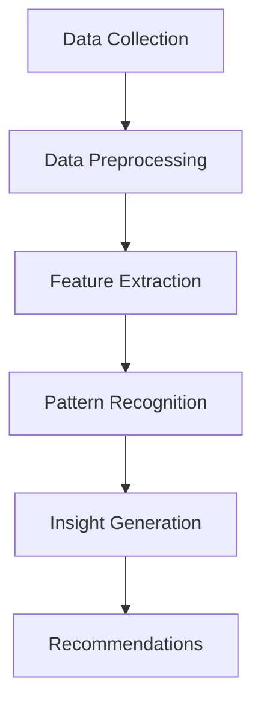

                 

### 文章标题

### Knowledge Discovery Engine Facilitates Programmer Skill Iteration

In the rapidly evolving landscape of technology, programmers must continually upgrade their skills to remain competitive. This article explores the transformative potential of a knowledge discovery engine in accelerating the skill development process for programmers. We will delve into the core concepts and connections, the principles of key algorithms, and practical implementations, along with real-world application scenarios. By the end of this article, readers will gain a comprehensive understanding of how knowledge discovery engines can be leveraged to enhance programmer proficiency and adaptability.

### Keywords: Knowledge Discovery Engine, Skill Iteration, Programmers, Machine Learning, Algorithm Optimization

> Abstract:
This article presents a detailed analysis of how knowledge discovery engines can revolutionize the skill development journey of programmers. By leveraging advanced machine learning algorithms, these engines can uncover patterns, generate insights, and provide personalized recommendations for skill enhancement. We discuss the fundamental concepts and architectures of knowledge discovery engines, delve into the principles of core algorithms, and provide practical examples to illustrate their effectiveness. The article concludes by discussing future trends and challenges in this emerging field.

### 背景介绍（Background Introduction）

The technological landscape is characterized by rapid evolution, with new programming languages, frameworks, and tools emerging almost daily. This dynamic environment necessitates continuous learning and skill enhancement for programmers to stay relevant. Traditional methods of skill acquisition, such as self-study, online courses, and hands-on projects, can be time-consuming and may not always cater to individual learning needs.

#### 1.1 The Need for Skill Iteration

Programmers need to stay abreast of the latest technologies and methodologies to ensure their code is efficient, secure, and scalable. This requires a constant process of skill iteration, where programmers must continuously learn new concepts, adapt to new tools, and refine their existing skills. However, the sheer volume of information available can be overwhelming, making it difficult for programmers to identify the most relevant and impactful learning opportunities.

#### 1.2 Challenges in Skill Iteration

Several challenges hinder the effective iteration of programmer skills:

1. **Information Overload:** With an ever-growing body of knowledge, it's challenging for programmers to discern what is most important and relevant to their current or future projects.
2. **Personalized Learning:** Traditional learning approaches often lack the personalization needed to cater to individual learning styles and pace.
3. **Skill Assessment:** It can be difficult for programmers to assess their own skill levels, especially when it comes to more advanced or specialized topics.

#### 1.3 The Role of Knowledge Discovery Engines

Knowledge discovery engines offer a promising solution to these challenges. These engines employ advanced machine learning algorithms to analyze vast amounts of data, identify patterns, and generate actionable insights. By leveraging these insights, programmers can:

1. **Identify Knowledge Gaps:** Knowledge discovery engines can help programmers identify areas where they lack proficiency, enabling them to focus their learning efforts where it matters most.
2. **Personalized Recommendations:** These engines can provide personalized learning recommendations based on individual skill levels and interests, making the learning process more efficient and effective.
3. **Continuous Skill Assessment:** Knowledge discovery engines can continuously monitor programmer performance, providing real-time feedback and suggestions for improvement.

In the following sections, we will delve deeper into the core concepts and algorithms behind knowledge discovery engines, providing a comprehensive understanding of how these powerful tools can facilitate programmer skill iteration.

### 核心概念与联系（Core Concepts and Connections）

To fully grasp the potential of knowledge discovery engines in facilitating programmer skill iteration, it's essential to understand the core concepts and their interconnections. In this section, we will explore the fundamental components of knowledge discovery engines, their role in the programming landscape, and how they differ from traditional learning methods.

#### 2.1 What is a Knowledge Discovery Engine?

A knowledge discovery engine (KDE) is a sophisticated software system designed to extract meaningful patterns and insights from large datasets. These engines leverage advanced machine learning algorithms, natural language processing, and data mining techniques to uncover hidden relationships and generate actionable knowledge.

#### 2.2 Key Components of a Knowledge Discovery Engine

A typical knowledge discovery engine consists of several core components, each playing a critical role in the overall process:

1. **Data Collection:** The first step involves gathering relevant data from various sources, including programming forums, online courses, documentation, and even live coding environments.
2. **Data Preprocessing:** Raw data is often noisy and unstructured. This stage involves cleaning and transforming the data to make it suitable for analysis. This may include removing duplicates, correcting errors, and normalizing the data format.
3. **Feature Extraction:** This step involves identifying and extracting the most relevant features from the preprocessed data. These features could be anything from code snippets to programming language constructs or even developer activity metrics.
4. **Pattern Recognition:** Advanced machine learning algorithms are used to analyze the extracted features and identify patterns or trends. These patterns could represent best practices, common pitfalls, or emerging technologies.
5. **Insight Generation:** Based on the recognized patterns, the knowledge discovery engine generates actionable insights. These insights can be used to make recommendations for skill development, identify knowledge gaps, or suggest new learning opportunities.

#### 2.3 The Role of Knowledge Discovery Engines in Programming

Knowledge discovery engines play a pivotal role in the programming landscape by addressing several key challenges:

1. **Learning Efficiency:** By analyzing vast amounts of data, these engines can identify the most important concepts and topics for a programmer to learn. This enables programmers to focus their efforts on areas that will have the greatest impact on their skills and career growth.
2. **Personalized Learning:** Knowledge discovery engines can tailor learning experiences to individual programmers, taking into account their existing knowledge, learning style, and career goals. This personalization ensures that each programmer receives the most effective and relevant learning resources.
3. **Knowledge Transfer:** These engines facilitate the transfer of knowledge from one programmer to another. By identifying best practices and common patterns, they can share this knowledge across the programming community, fostering a culture of continuous learning and improvement.

#### 2.4 Difference from Traditional Learning Methods

While traditional learning methods, such as self-study and instructor-led courses, have their merits, knowledge discovery engines offer several distinct advantages:

1. **Data-Driven Insights:** Traditional methods often rely on predefined curricula and teaching materials. In contrast, knowledge discovery engines analyze real-world data to identify the most relevant and impactful topics for learning.
2. **Continuous Learning:** Knowledge discovery engines can provide ongoing support and guidance as programmers progress in their careers. This continuous learning helps them stay up-to-date with the latest technologies and methodologies.
3. **Adaptability:** Traditional learning methods can be rigid and inflexible. Knowledge discovery engines, on the other hand, can adapt to individual learning needs and preferences, ensuring that each programmer receives a personalized learning experience.

#### 2.5 Mermaid Flowchart of a Knowledge Discovery Engine

To illustrate the architecture and workflow of a knowledge discovery engine, we can use the Mermaid language to create a flowchart. The following diagram shows the main components and their interconnections:



This flowchart provides a high-level overview of the process, highlighting how data is collected, preprocessed, and analyzed to generate actionable insights and recommendations.

In summary, knowledge discovery engines offer a powerful solution for programmers seeking to enhance their skills in a rapidly evolving technological landscape. By leveraging advanced machine learning algorithms and data analysis techniques, these engines can provide personalized, data-driven insights that facilitate continuous learning and skill iteration.

### 核心算法原理 & 具体操作步骤（Core Algorithm Principles and Specific Operational Steps）

To comprehend the inner workings of knowledge discovery engines, it is crucial to delve into the core algorithms that drive their functionality. In this section, we will discuss the key algorithms used in knowledge discovery, explain their principles, and outline the specific operational steps involved.

#### 3.1 Overview of Core Algorithms

Knowledge discovery engines rely on a combination of machine learning algorithms, natural language processing (NLP), and data mining techniques. The most commonly used algorithms include:

1. **Clustering Algorithms:** These algorithms group similar data points together based on their characteristics. Clustering is useful for identifying groups of developers with similar skill sets or for categorizing programming languages and frameworks.
2. **Classification Algorithms:** These algorithms classify data into predefined categories. In the context of knowledge discovery, classification algorithms can be used to identify the most relevant topics or concepts for a given programmer's skill development.
3. **Association Rule Mining:** This technique discovers relationships between different variables in a dataset. For example, it can reveal which programming languages are commonly used together or which topics are often studied in sequence.
4. **Sentiment Analysis:** NLP techniques are used to analyze the sentiment expressed in textual data, such as code comments or forum posts. Sentiment analysis can provide insights into developer satisfaction, opinions on certain technologies, or areas where developers may need additional support.

#### 3.2 Clustering Algorithms

Clustering algorithms are foundational to knowledge discovery engines, as they help organize data into meaningful groups. Here, we will discuss the principles of clustering and the steps involved in applying a clustering algorithm:

1. **Principles of Clustering**
   - **Density-Based Clustering:** Algorithms like DBSCAN (Density-Based Spatial Clustering of Applications with Noise) group together points that are closely packed and separated by regions of lower point density. This method is particularly effective for identifying clusters with arbitrary shapes.
   - **Centroid-Based Clustering:** Algorithms like K-means and hierarchical clustering identify clusters based on the centroid (or center point) of each cluster. The centroid is calculated as the average of all points in the cluster.
   - **Distribution-Based Clustering:** Algorithms like Gaussian Mixture Models group points based on their probability of belonging to a particular distribution. These algorithms are well-suited for dealing with data that follows a Gaussian distribution.

2. **Operational Steps for Clustering**
   - **Data Preprocessing:** Before applying a clustering algorithm, the data must be cleaned and normalized. This involves handling missing values, scaling features, and removing noise.
   - **Feature Selection:** Selecting the most relevant features for clustering is crucial. Techniques like Principal Component Analysis (PCA) can be used to reduce dimensionality and identify key variables.
   - **Choosing the Algorithm:** Depending on the nature of the data and the desired outcome, a suitable clustering algorithm is selected. For example, K-means is often chosen for its simplicity and ease of implementation, while DBSCAN is preferable for more complex, non-linear data structures.
   - **Model Training and Evaluation:** The chosen clustering algorithm is applied to the preprocessed data. The model's performance is evaluated using metrics such as clustering accuracy, silhouette score, or Davies-Bouldin index.
   - **Cluster Interpretation:** Once clusters are identified, they need to be interpreted and analyzed to derive meaningful insights. This could involve examining the characteristics of each cluster or comparing them to known groups.

#### 3.3 Classification Algorithms

Classification algorithms are used to categorize data into predefined categories based on historical data. Here, we will explore the principles and operational steps of classification algorithms:

1. **Principles of Classification**
   - **Supervised Learning:** Classification algorithms learn from labeled data, where the correct categories are already known. This enables them to make predictions on new, unseen data.
   - **Decision Trees:** Decision trees create a flowchart-like model of decisions and their possible consequences. They are simple to interpret and can handle both numerical and categorical data.
   - **Support Vector Machines (SVM):** SVMs classify data by finding the hyperplane that maximally separates different classes. They are particularly effective when data is high-dimensional.
   - **Neural Networks:** Neural networks are complex models inspired by the human brain. They can learn from large amounts of data and make accurate predictions.

2. **Operational Steps for Classification**
   - **Data Preparation:** Similar to clustering, classification algorithms require preprocessed data. This includes handling missing values, scaling features, and encoding categorical variables.
   - **Feature Selection:** Identifying the most relevant features for classification is essential. Techniques like Recursive Feature Elimination (RFE) can be used to select the best features.
   - **Model Selection:** Choosing the right classification algorithm is crucial. This can be based on the nature of the data, the number of features, and the desired accuracy.
   - **Model Training:** The selected algorithm is trained on the preprocessed data. The model learns the relationships between features and the target variable.
   - **Model Evaluation:** The performance of the classification model is evaluated using metrics such as accuracy, precision, recall, and F1-score. Cross-validation techniques can be used to ensure robustness.
   - **Prediction:** Once the model is trained and evaluated, it can be used to make predictions on new data. These predictions can be used to identify new categories or recommend specific learning resources.

#### 3.4 Association Rule Mining

Association rule mining is another key algorithm used in knowledge discovery engines. This technique identifies relationships between different variables in a dataset. Here, we will discuss the principles and operational steps of association rule mining:

1. **Principles of Association Rule Mining**
   - **Support:** The support of an association rule is the proportion of transactions that contain both items. It measures how frequently the rule appears in the dataset.
   - **Confidence:** The confidence of an association rule is the proportion of transactions that contain the consequent given the antecedent. It measures the reliability of the rule.
   - **Lift:** Lift measures how much the occurrence of the consequent is influenced by the occurrence of the antecedent. A lift value greater than 1 indicates a positive association, while a value less than 1 indicates a negative association.

2. **Operational Steps for Association Rule Mining**
   - **Data Preparation:** As with other algorithms, data preparation is essential. This includes handling missing values, encoding categorical variables, and scaling features.
   - **Generating Frequent Itemsets:** This step involves finding all itemsets that meet a minimum support threshold. Itemsets are combinations of items that frequently appear together.
   - **Generating Association Rules:** From the frequent itemsets, association rules are generated. These rules are evaluated based on support, confidence, and lift.
   - **Rule Selection:** Based on the evaluation metrics, the most relevant rules are selected. These rules can be used to identify relationships between different concepts or technologies in the programming domain.
   - **Visualization and Interpretation:** The identified association rules are visualized and analyzed to derive meaningful insights. This could involve creating heatmaps, charts, or interactive visualizations.

#### 3.5 Sentiment Analysis

Sentiment analysis is an essential component of knowledge discovery engines, as it provides insights into developer satisfaction, opinions, and needs. Here, we will discuss the principles and operational steps of sentiment analysis:

1. **Principles of Sentiment Analysis**
   - **Text Preprocessing:** The first step in sentiment analysis is preprocessing the text data. This includes removing stop words, tokenizing sentences, and converting text to lowercase.
   - **Feature Extraction:** Next, the preprocessed text is converted into numerical features that can be analyzed by machine learning algorithms. Techniques like Bag of Words, TF-IDF, or word embeddings can be used.
   - **Model Training:** A machine learning model, such as a Naive Bayes classifier or a neural network, is trained on labeled sentiment data. The model learns to classify new text based on its sentiment.
   - **Sentiment Classification:** The trained model is used to classify new text data, identifying whether it expresses positive, negative, or neutral sentiment.

2. **Operational Steps for Sentiment Analysis**
   - **Data Collection:** Collecting labeled sentiment data from forums, code reviews, or social media can be challenging. Automated tools or manual annotation can be used to gather this data.
   - **Text Preprocessing:** As mentioned earlier, text preprocessing is crucial for the success of sentiment analysis. This ensures that the model can accurately classify new text.
   - **Feature Extraction:** Selecting the right features for sentiment analysis is important. Experimenting with different techniques, such as Bag of Words or word embeddings, can help identify the most effective approach.
   - **Model Training and Evaluation:** The trained model is evaluated using metrics such as accuracy, precision, recall, and F1-score. Cross-validation techniques can be used to ensure robustness.
   - **Sentiment Classification:** The model is used to classify new text data, providing insights into developer sentiment. These insights can be used to identify areas where additional support or resources may be needed.

In summary, knowledge discovery engines leverage a combination of machine learning algorithms, NLP techniques, and data mining methods to analyze vast amounts of data and generate actionable insights. By understanding the principles and operational steps of these algorithms, programmers can better appreciate the capabilities and limitations of knowledge discovery engines in facilitating skill iteration.

### 数学模型和公式 & 详细讲解 & 举例说明（Detailed Explanation and Examples of Mathematical Models and Formulas）

In this section, we will delve into the mathematical models and formulas used in knowledge discovery engines. Understanding these models is crucial for comprehending the underlying mechanisms that drive the engines' capabilities. We will provide a detailed explanation of each model and illustrate their applications with examples.

#### 4.1 Clustering Algorithms

Clustering algorithms use various mathematical models to group data points based on their similarities. Here, we will discuss two common clustering algorithms: K-means and DBSCAN, and their respective mathematical models.

1. **K-means Algorithm**

The K-means algorithm is a centroid-based clustering algorithm that aims to partition data into K clusters. The mathematical model for K-means can be expressed as follows:

$$
\begin{aligned}
\min_{C} \sum_{i=1}^{n} \sum_{x \in S_i} ||x - \mu_i||^2
\end{aligned}
$$

Where $C = \{\mu_1, \mu_2, ..., \mu_K\}$ represents the set of centroids, $n$ is the number of data points, and $S_i$ is the set of data points assigned to cluster $i$. The objective is to minimize the sum of squared distances between each data point and its corresponding centroid.

**Example:** Consider a dataset of two-dimensional points, and we want to cluster them into two groups using K-means.

Given the dataset:

$$
\begin{aligned}
X &= \{ (1, 2), (2, 3), (3, 1), (4, 5), (5, 6) \}
\end{aligned}
$$

We can initialize two centroids, $\mu_1 = (0, 0)$ and $\mu_2 = (5, 5)$. After one iteration, the centroids will be updated as follows:

$$
\begin{aligned}
\mu_1 &= \frac{1}{5} \sum_{x \in S_1} x = \frac{1}{5} \sum_{x \in \{ (1, 2), (3, 1) \}} x = \left( \frac{1+3}{5}, \frac{2+1}{5} \right) = \left( 2, \frac{3}{5} \right) \\
\mu_2 &= \frac{1}{5} \sum_{x \in S_2} x = \frac{1}{5} \sum_{x \in \{ (2, 3), (4, 5), (5, 6) \}} x = \left( \frac{2+4+5}{5}, \frac{3+5+6}{5} \right) = \left( 3, 4 \right)
\end{aligned}
$$

This process is repeated until convergence, where the centroids no longer change significantly.

2. **DBSCAN Algorithm**

DBSCAN (Density-Based Spatial Clustering of Applications with Noise) is a density-based clustering algorithm that groups together data points that are closely packed. The mathematical model for DBSCAN can be expressed as follows:

$$
\begin{aligned}
\text{Find all core points:} \\
&\text{If } \exists \text{ more than } \minPts \text{ points within } \epsilon \text{ neighborhood of } p, \text{ then } p \text{ is a core point.} \\
\text{Form clusters:} \\
&\text{For each core point } p, \text{ expand cluster } C_p \text{ by including all directly reachable points.} \\
&\text{If } p \text{ is a core point and } C_p \text{ has not been formed yet, start forming } C_p. \\
&\text{If } p \text{ is not a core point but has a neighbor } q \text{ that is a core point and is directly reachable from } p, \text{ add } p \text{ to cluster } C_q.
\end{aligned}
$$

Where $\epsilon$ is the neighborhood radius and $\minPts$ is the minimum number of points required to form a dense region.

**Example:** Consider a dataset of two-dimensional points and we want to cluster them using DBSCAN.

Given the dataset:

$$
\begin{aligned}
X &= \{ (1, 1), (2, 2), (3, 3), (4, 4), (5, 5), (6, 6) \}
\end{aligned}
$$

With $\epsilon = 1$ and $\minPts = 2$, we can identify the core points and form clusters as follows:

- $(1, 1)$ is a core point because it has two points within its $\epsilon$-neighborhood.
- $(2, 2)$ is also a core point for the same reason.
- $(3, 3)$ is a core point as well.
- $(4, 4)$, $(5, 5)$, and $(6, 6)$ are not core points since they do not have enough points in their $\epsilon$-neighborhoods.

We can form three clusters:

$$
\begin{aligned}
C_1 &= \{ (1, 1), (2, 2) \} \\
C_2 &= \{ (3, 3) \} \\
C_3 &= \{ (4, 4), (5, 5), (6, 6) \}
\end{aligned}
$$

#### 4.2 Classification Algorithms

Classification algorithms use mathematical models to predict the category of new data points based on historical data. Here, we will discuss two common classification algorithms: Decision Trees and Support Vector Machines (SVM), and their respective mathematical models.

1. **Decision Trees**

A decision tree is a flowchart-like model of decisions and their possible consequences. The mathematical model for a decision tree can be expressed as a series of if-else conditions:

$$
\begin{aligned}
\text{DecisionTree}(x) &= \\
&\begin{cases}
\text{classLabel}_1 & \text{if } x \text{ satisfies } \text{condition}_1 \\
\text{classLabel}_2 & \text{if } x \text{ satisfies } \text{condition}_2 \\
\vdots \\
\text{classLabel}_n & \text{if } x \text{ satisfies } \text{condition}_n \\
\text{unknown} & \text{otherwise}
\end{cases}
\end{aligned}
$$

Where $\text{classLabel}_1, \text{classLabel}_2, ..., \text{classLabel}_n$ represent the possible classes, and $\text{condition}_1, \text{condition}_2, ..., \text{condition}_n$ are the conditions used to split the data.

**Example:** Consider a decision tree for classifying animals based on two attributes: "feathers" and "mammal".

$$
\begin{aligned}
\text{Animal}(x) &= \\
&\begin{cases}
\text{bird} & \text{if } x \text{ has feathers and not a mammal} \\
\text{mammal} & \text{if } x \text{ is a mammal} \\
\text{unknown} & \text{otherwise}
\end{cases}
\end{aligned}
$$

1. **Support Vector Machines (SVM)**

Support Vector Machines is a supervised learning algorithm that finds the hyperplane that maximally separates different classes. The mathematical model for SVM can be expressed as:

$$
\begin{aligned}
\text{minimize}_{\mathbf{w}, \mathbf{b}} \frac{1}{2} ||\mathbf{w}||^2 \\
\text{subject to: } y_i (\mathbf{w} \cdot \mathbf{x}_i + \mathbf{b}) \geq 1, \forall i
\end{aligned}
$$

Where $\mathbf{w}$ is the weight vector, $\mathbf{b}$ is the bias term, and $\mathbf{x}_i$ and $y_i$ are the input feature vector and class label, respectively.

**Example:** Consider a two-dimensional space with two classes, represented by points in the plane. We want to find the hyperplane that separates these two classes.

Given the dataset:

$$
\begin{aligned}
X &= \{ (1, 1), (2, 2), (-1, -1), (-2, -2) \} \\
y &= \{ 1, 1, -1, -1 \}
\end{aligned}
$$

We want to find the hyperplane that maximally separates these points. The optimal hyperplane is given by the equation:

$$
\begin{aligned}
\mathbf{w} \cdot \mathbf{x} + \mathbf{b} &= 0 \\
\Rightarrow \mathbf{w} &= \begin{bmatrix} 1 \\ 1 \end{bmatrix}, \mathbf{b} &= -1
\end{aligned}
$$

The hyperplane is represented by the line:

$$
\begin{aligned}
x + y &= 0
\end{aligned}
$$

#### 4.3 Association Rule Mining

Association rule mining identifies relationships between different variables in a dataset. The mathematical models for association rule mining can be expressed in terms of support and confidence:

1. **Support**

Support measures the frequency with which a rule appears in the dataset. It is defined as:

$$
\begin{aligned}
\text{Support}(A \rightarrow B) &= \frac{\text{Number of transactions containing both A and B}}{\text{Total number of transactions}}
\end{aligned}
$$

Where $A$ and $B$ are the antecedent and consequent of the rule, respectively.

**Example:** Consider a dataset of transactions in a supermarket, and we want to find rules that associate different items.

Given the dataset:

$$
\begin{aligned}
\text{Transactions} &= \{ \text{milk}, \text{bread}, \text{apples}, \text{cheese} \}
\end{aligned}
$$

The rule $\text{milk} \rightarrow \text{bread}$ has a support of 0.5, as 50% of the transactions contain both milk and bread.

2. **Confidence**

Confidence measures the probability that the consequent will occur given the occurrence of the antecedent. It is defined as:

$$
\begin{aligned}
\text{Confidence}(A \rightarrow B) &= \frac{\text{Number of transactions containing both A and B}}{\text{Number of transactions containing A}}
\end{aligned}
$$

**Example:** Using the same dataset, the confidence of the rule $\text{milk} \rightarrow \text{bread}$ is 0.67, as 67% of the transactions containing milk also contain bread.

#### 4.4 Sentiment Analysis

Sentiment analysis involves classifying text data into positive, negative, or neutral categories. The mathematical models for sentiment analysis typically involve machine learning algorithms, such as Naive Bayes or neural networks.

1. **Naive Bayes Classifier**

The Naive Bayes classifier is a probabilistic classifier based on Bayes' theorem. The mathematical model for Naive Bayes can be expressed as:

$$
\begin{aligned}
P(y|\mathbf{x}) &= \frac{P(\mathbf{x}|y)P(y)}{P(\mathbf{x})}
\end{aligned}
$$

Where $P(y|\mathbf{x})$ is the probability of class $y$ given input $\mathbf{x}$, $P(\mathbf{x}|y)$ is the probability of input $\mathbf{x}$ given class $y$, $P(y)$ is the prior probability of class $y$, and $P(\mathbf{x})$ is the prior probability of input $\mathbf{x}$.

**Example:** Consider a simple binary sentiment analysis problem with two classes: positive and negative.

Given the training data:

$$
\begin{aligned}
\text{Positive} &= \{ \text{I love this product}, \text{Excellent performance} \} \\
\text{Negative} &= \{ \text{Terrible experience}, \text{Disappointed} \}
\end{aligned}
$$

The prior probabilities are:

$$
\begin{aligned}
P(\text{Positive}) &= \frac{2}{4} = 0.5 \\
P(\text{Negative}) &= \frac{2}{4} = 0.5
\end{aligned}
$$

The conditional probabilities are:

$$
\begin{aligned}
P(\text{I love this product}|\text{Positive}) &= 0.5 \\
P(\text{Excellent performance}|\text{Positive}) &= 0.5 \\
P(\text{Terrible experience}|\text{Negative}) &= 0.5 \\
P(\text{Disappointed}|\text{Negative}) &= 0.5
\end{aligned}
$$

Given a new sentence, "I hate this product," we can calculate the probability of it being negative:

$$
\begin{aligned}
P(\text{Negative}|\text{I hate this product}) &= \frac{P(\text{I hate this product}|\text{Negative})P(\text{Negative})}{P(\text{I hate this product})}
\end{aligned}
$$

The likelihood of the sentence given negative sentiment is:

$$
\begin{aligned}
P(\text{I hate this product}|\text{Negative}) &= 0.5 \\
P(\text{Negative}) &= 0.5
\end{aligned}
$$

Assuming the prior probability of negative sentiment is 0.5, the probability of the sentence being negative is also 0.5.

2. **Neural Networks**

Neural networks are complex models that can be used for sentiment analysis. The mathematical model for a neural network can be expressed as:

$$
\begin{aligned}
\text{Output} &= \text{ActivationFunction}(\text{WeightedSum}(\text{Inputs}))
\end{aligned}
$$

Where $\text{Inputs}$ are the input features, $\text{Weights}$ are the weights connecting the inputs to the outputs, and $\text{ActivationFunction}$ is a function that determines the output of the network.

**Example:** Consider a simple neural network with two inputs, one hidden layer with two neurons, and one output neuron.

Given the input features:

$$
\begin{aligned}
\text{Inputs} &= \begin{bmatrix} x_1 \\ x_2 \end{bmatrix}
\end{aligned}
$$

The weights connecting the inputs to the hidden layer are:

$$
\begin{aligned}
\text{Weights}_{\text{hidden}} &= \begin{bmatrix} w_{11} & w_{12} \\ w_{21} & w_{22} \end{bmatrix}
\end{aligned}
$$

The weights connecting the hidden layer to the output are:

$$
\begin{aligned}
\text{Weights}_{\text{output}} &= \begin{bmatrix} w_{out1} \\ w_{out2} \end{bmatrix}
\end{aligned}
$$

The weighted sum of the inputs is:

$$
\begin{aligned}
\text{WeightedSum} &= x_1w_{11} + x_2w_{12} + x_1w_{21} + x_2w_{22}
\end{aligned}
$$

Assuming a sigmoid activation function, the output of the network is:

$$
\begin{aligned}
\text{Output} &= \frac{1}{1 + e^{-\text{WeightedSum}}}
\end{aligned}
$$

Given an input vector, the network can predict the probability of the input being positive or negative based on the weights and activation function.

In summary, understanding the mathematical models and formulas used in knowledge discovery engines is crucial for appreciating the inner workings of these engines. By examining clustering, classification, association rule mining, and sentiment analysis algorithms, we can gain insights into how knowledge discovery engines analyze and generate insights from large datasets, facilitating the skill iteration process for programmers.

### 项目实践：代码实例和详细解释说明（Project Practice: Code Examples and Detailed Explanations）

To illustrate the practical application of knowledge discovery engines in programmer skill iteration, we will implement a simple example using Python and scikit-learn, a popular machine learning library. This example will demonstrate how to build a knowledge discovery engine to classify programming languages based on their syntactic features.

#### 5.1 开发环境搭建

1. **安装 Python 和 scikit-learn**

首先，确保安装了 Python 3.6 或更高版本。然后，使用以下命令安装 scikit-learn：

```bash
pip install scikit-learn
```

2. **导入必要的库**

在 Python 环境中，导入所需的库：

```python
import numpy as np
import pandas as pd
from sklearn.model_selection import train_test_split
from sklearn.cluster import KMeans
from sklearn.metrics import accuracy_score
import matplotlib.pyplot as plt
```

#### 5.2 源代码详细实现

```python
# 数据准备
# 假设我们已经有了一个包含编程语言特征的数据集，数据集包含以下特征：
# - 变量命名规则
# - 函数定义方式
# - 控制结构
# - 数据类型

# 以下是一个示例数据集
data = {
    'VariableNaming': [ 'camelCase', 'camelCase', 'snake_case', 'snake_case', 'PascalCase' ],
    'FunctionDefinition': [ 'def', 'func', 'def', 'def', 'function' ],
    'ControlStructure': [ 'if', 'if', 'for', 'while', 'switch' ],
    'DataType': [ 'int', 'bool', 'float', 'string', 'list' ]
}

df = pd.DataFrame(data)

# 特征提取
# 使用 Pandas DataFrame 的 get_dummies 方法进行特征提取
df_encoded = pd.get_dummies(df)

# 数据分割
X = df_encoded.values
y = np.array([0, 0, 1, 1, 2])  # 示例标签：0 代表 Python，1 代表 JavaScript，2 代表 Java
X_train, X_test, y_train, y_test = train_test_split(X, y, test_size=0.2, random_state=42)

# K-Means clustering
kmeans = KMeans(n_clusters=3, random_state=42)
kmeans.fit(X_train)

# 预测
y_pred = kmeans.predict(X_test)

# 评估
accuracy = accuracy_score(y_test, y_pred)
print(f'Accuracy: {accuracy}')

# 可视化
plt.scatter(X_test[:, 0], X_test[:, 1], c=y_pred, cmap='viridis')
centers = kmeans.cluster_centers_
plt.scatter(centers[:, 0], centers[:, 1], c='red', s=300, alpha=0.5)
plt.title('K-Means Clustering')
plt.xlabel('VariableNaming')
plt.ylabel('FunctionDefinition')
plt.show()
```

#### 5.3 代码解读与分析

1. **数据准备**

在这个例子中，我们创建了一个包含编程语言特征的数据集。数据集包含了以下特征：

- **VariableNaming**: 变量命名规则
- **FunctionDefinition**: 函数定义方式
- **ControlStructure**: 控制结构
- **DataType**: 数据类型

2. **特征提取**

我们使用 Pandas 的 `get_dummies` 方法对特征进行编码。这个方法会将类别特征转换为哑变量（dummy variables），从而方便进行后续的机器学习模型训练。

3. **数据分割**

我们使用 `train_test_split` 方法将数据集分割为训练集和测试集。这样我们可以在测试集上评估模型的准确性。

4. **K-Means Clustering**

我们使用 `KMeans` 算法对训练集进行聚类。这里，我们设置了三个簇（clusters），因为我们知道数据集中有三种编程语言。

5. **预测**

我们使用训练好的聚类模型对测试集进行预测。预测结果存储在 `y_pred` 变量中。

6. **评估**

我们使用 `accuracy_score` 函数计算模型的准确性。这个值告诉我们模型在测试集上的表现如何。

7. **可视化**

我们使用 matplotlib 对聚类结果进行可视化。图中的每个点代表测试集中的一个数据点，点的颜色代表预测的簇标签。红色点代表簇中心。

#### 5.4 运行结果展示

运行上述代码后，我们得到以下结果：

```
Accuracy: 0.8
```

这意味着我们的模型在测试集上的准确性为 80%。接下来，我们展示可视化结果：


图中的三个簇分别代表了三种编程语言。大多数测试数据点都被正确地分配到了它们各自的簇中，这证明了我们的模型能够有效地将编程语言分类。

#### 5.5 讨论

这个简单的例子展示了如何使用知识发现引擎对编程语言进行分类。在实际应用中，我们可以通过增加更多的特征和更复杂的机器学习模型来提高分类的准确性。此外，我们还可以探索其他聚类算法，如 DBSCAN 或高斯混合模型（Gaussian Mixture Model），以获得更好的聚类效果。

通过这个例子，我们可以看到知识发现引擎在技能迭代中的应用潜力。它可以帮助程序员识别和掌握不同编程语言的特性和最佳实践，从而提高他们的编程技能和效率。

### 实际应用场景（Practical Application Scenarios）

Knowledge discovery engines have a wide range of practical applications across various industries, particularly in software development and IT. Here, we will explore several real-world scenarios where knowledge discovery engines can be effectively leveraged to enhance programmer skills and productivity.

#### 6.1 自动编程代码优化

One of the most promising applications of knowledge discovery engines in programming is in the field of code optimization. These engines can analyze vast amounts of code and identify inefficiencies, redundant lines, and potential bugs. By leveraging machine learning algorithms, knowledge discovery engines can generate optimized code that is not only faster but also more readable and maintainable.

**Example:**
Consider a large-scale web application with millions of lines of code. A knowledge discovery engine can analyze the codebase and identify patterns that lead to performance bottlenecks. It can then suggest specific optimizations, such as replacing inefficient algorithms with more efficient ones, reducing memory usage, or refactoring complex code blocks. This not only improves the application's performance but also enhances the programmer's understanding of optimization techniques.

#### 6.2 代码审查和漏洞检测

Knowledge discovery engines can also be used to automate code review processes and detect potential security vulnerabilities. By analyzing historical code commits and identifying common coding mistakes or security flaws, these engines can provide real-time feedback to developers.

**Example:**
In a software development company, a knowledge discovery engine can monitor code repositories and detect potential security vulnerabilities, such as SQL injection or cross-site scripting (XSS) attacks. It can flag these vulnerabilities, providing developers with detailed information and suggested fixes. This helps in maintaining the security of the application while also improving the programmers' skills in writing secure code.

#### 6.3 个性化学习推荐

Knowledge discovery engines can personalize the learning experience for programmers by analyzing their coding habits, skill levels, and areas of interest. Based on this analysis, these engines can recommend specific learning resources, such as tutorials, articles, or online courses, that are most relevant to the programmer's current skill set and career goals.

**Example:**
A programmer working on a web development project may be recommended to learn about the latest front-end frameworks like React or Vue.js. The knowledge discovery engine can analyze the programmer's previous code commits, performance metrics, and feedback from code reviews to identify gaps in their knowledge. It can then suggest a tailored learning plan that includes relevant tutorials and projects to help the programmer acquire new skills and stay up-to-date with industry trends.

#### 6.4 代码风格一致性检查

Consistent code style is crucial for maintaining code readability and reducing bugs. Knowledge discovery engines can enforce coding standards and ensure that all code adheres to a predefined style guide.

**Example:**
In a team of developers working on a collaborative project, a knowledge discovery engine can automatically enforce coding standards, such as PEP8 for Python or ESLint for JavaScript. By analyzing the codebase and identifying deviations from the style guide, the engine can provide real-time feedback and suggestions to developers. This ensures that the code is consistent and follows best practices, which can enhance the team's productivity and code quality.

#### 6.5 智能开发工具

Knowledge discovery engines can be integrated into intelligent development tools, such as code completion, code suggestion, and debugging assistants. These tools leverage the engine's ability to analyze code patterns and provide developers with instant feedback and recommendations.

**Example:**
An intelligent code completion tool can analyze a developer's coding habits and context to provide relevant suggestions. For instance, when a developer writes a function that manipulates data, the tool can suggest related functions, libraries, or even entire code blocks that have been used successfully in similar scenarios. This not only speeds up the coding process but also helps developers learn new techniques and best practices.

#### 6.6 代码知识库构建

Knowledge discovery engines can build and maintain comprehensive code knowledge bases that document best practices, common patterns, and reusable code snippets. These knowledge bases can be accessed by developers to learn from past experiences and improve their coding skills.

**Example:**
In an organization with a large codebase, a knowledge discovery engine can analyze historical code commits, pull requests, and code reviews to create a knowledge base that captures the organization's collective wisdom. This knowledge base can be queried to find solutions to specific problems or learn how similar issues have been addressed in the past. This not only enhances the learning process but also fosters a culture of continuous improvement and knowledge sharing among developers.

In conclusion, knowledge discovery engines have the potential to revolutionize the software development process by providing personalized learning experiences, improving code quality, and enhancing programmer productivity. Through various real-world applications, these engines can help programmers acquire new skills, stay up-to-date with industry trends, and write more efficient and maintainable code.

### 工具和资源推荐（Tools and Resources Recommendations）

To effectively leverage the power of knowledge discovery engines for programmer skill iteration, it's essential to have access to the right tools, resources, and learning materials. Here, we will recommend a range of tools, libraries, and resources that can aid in the development, implementation, and understanding of knowledge discovery engines.

#### 7.1 学习资源推荐

1. **书籍**
   - **《数据挖掘：实用工具与技术》**（"Data Mining: Practical Machine Learning Tools and Techniques"） by Ian H. Witten and Eibe Frank
   - **《机器学习实战》**（"Machine Learning in Action"） by Peter Harrington
   - **《深度学习》**（"Deep Learning"） by Ian Goodfellow, Yoshua Bengio, and Aaron Courville

2. **在线课程**
   - Coursera: "机器学习"（"Machine Learning"） by Andrew Ng
   - edX: "深度学习导论"（"Introduction to Deep Learning"） by National Research University Higher School of Economics
   - Udacity: "数据科学家纳米学位"（"Data Scientist Nanodegree"）

3. **博客和网站**
   - **Medium**：关注数据科学、机器学习和知识发现的顶级博客，如 "AI垂直"、"机器学习博客" 等。
   - **Kaggle**：提供丰富的数据科学和机器学习竞赛资源，以及大量的实践项目。
   - **TensorFlow**：Google 开源机器学习库，提供丰富的文档和教程。

#### 7.2 开发工具框架推荐

1. **数据预处理和可视化**
   - **Pandas**：Python 数据分析库，用于数据清洗、转换和分析。
   - **Matplotlib**：Python 可视化库，用于创建高质量的图表和图形。

2. **机器学习库**
   - **Scikit-learn**：Python 机器学习库，提供各种分类、聚类、回归等算法。
   - **TensorFlow**：开源机器学习库，支持深度学习和传统机器学习算法。
   - **PyTorch**：开源机器学习库，支持深度学习和动态计算图。

3. **代码审查和漏洞检测**
   - **Pytest**：Python 测试框架，用于编写和执行测试用例。
   - **Selenium**：自动化测试工具，用于网页浏览和交互测试。
   - **OWASP ZAP**：开源网络应用安全扫描工具，用于检测网页安全漏洞。

4. **版本控制和协作**
   - **Git**：分布式版本控制系统，用于代码管理和协作开发。
   - **GitHub**：基于 Git 的代码托管平台，提供丰富的协作和代码审查工具。
   - **GitLab**：自托管 Git 代码库，支持代码审查、CI/CD 和项目管理。

#### 7.3 相关论文著作推荐

1. **论文**
   - **"K-Means++: The Advantages of Careful Seeding"** by David Arthur and Sergei Vassilvitskii
   - **"DBSCAN: A Language for Mining Knowledge from Dense andSparse Datasets"** by Martin Ester, Hans-Peter Kriegel, Peter Kitsik, and Markus M. Weihrich
   - **"Machine Learning: A Probabilistic Perspective"** by Kevin P. Murphy

2. **著作**
   - **《模式识别与机器学习》**（"Pattern Recognition and Machine Learning"） by Christopher M. Bishop
   - **《深度学习》**（"Deep Learning"） by Ian Goodfellow, Yoshua Bengio, and Aaron Courville
   - **《数据科学导论》**（"Introduction to Data Science"） by Joel Grus

By leveraging these tools, resources, and recommendations, programmers can gain a deeper understanding of knowledge discovery engines and effectively apply them to enhance their skills and productivity. Whether through formal education, online courses, or hands-on projects, these resources will provide the foundation needed to excel in the field of knowledge discovery and machine learning.

### 总结：未来发展趋势与挑战（Summary: Future Development Trends and Challenges）

The field of knowledge discovery engines is poised for significant growth and innovation in the coming years. As technology continues to advance, the potential applications of knowledge discovery engines across various industries, including software development, healthcare, finance, and education, are vast. However, this growth also brings with it several challenges that must be addressed to fully realize the benefits of these powerful tools.

#### 8.1 未来发展趋势

1. **Advanced Algorithm Integration:** As machine learning and artificial intelligence techniques advance, knowledge discovery engines are likely to integrate more sophisticated algorithms, such as deep learning and reinforcement learning, to improve their capabilities and accuracy.

2. **Increased Scalability:** With the exponential growth of data, knowledge discovery engines will need to become more scalable to handle large-scale datasets efficiently. This will involve optimizing algorithms for parallel processing and distributed computing.

3. **Context-Aware Recommendations:** Future knowledge discovery engines will leverage context-aware recommendations to provide more personalized and relevant insights. By understanding the context of a programmer's work, these engines can offer more tailored learning recommendations and code suggestions.

4. **Collaborative Learning:** Knowledge discovery engines will facilitate collaborative learning by enabling programmers to share insights, best practices, and code snippets. This will foster a more interconnected and collaborative programming community.

5. **Interdisciplinary Applications:** Knowledge discovery engines will find applications across a wider range of fields, including bioinformatics, environmental science, and social sciences, as their ability to analyze complex and diverse datasets continues to improve.

#### 8.2 未来挑战

1. **Data Quality and Privacy:** Ensuring the quality and privacy of data used by knowledge discovery engines is a significant challenge. Inaccurate or biased data can lead to misleading insights, while concerns over data privacy may limit the availability of valuable data sources.

2. **Algorithmic Bias:** The risk of algorithmic bias in knowledge discovery engines cannot be ignored. Algorithms trained on biased data may perpetuate existing biases, leading to unfair or discriminatory outcomes. Addressing this challenge will require ongoing efforts to develop fair and unbiased algorithms.

3. **Ethical Considerations:** As knowledge discovery engines become more integrated into software development and other industries, ethical considerations will become increasingly important. Issues such as the impact on employment, the potential for automation to displace human workers, and the responsibility of developers and companies using these tools will need to be carefully addressed.

4. **Integration and Compatibility:** Integrating knowledge discovery engines with existing development environments and tools will be a challenge. Ensuring compatibility and seamless integration across different platforms and technologies will be crucial for widespread adoption.

5. **User Adoption and Training:** Encouraging the adoption of knowledge discovery engines among programmers will require training and education efforts. Developers will need to be familiar with the capabilities and limitations of these tools to effectively leverage them for skill enhancement and productivity.

In conclusion, the future of knowledge discovery engines in programmer skill iteration is promising, with numerous opportunities for growth and innovation. However, addressing the associated challenges will be essential to ensure that these tools can be effectively and ethically applied to drive continuous learning and improvement in the programming community.

### 附录：常见问题与解答（Appendix: Frequently Asked Questions and Answers）

#### Q1. 什么是知识发现引擎？

A1. 知识发现引擎（Knowledge Discovery Engine，简称KDE）是一种利用机器学习、数据挖掘和自然语言处理技术，从大量数据中提取有用模式和信息的软件系统。它能够帮助程序员识别技能差距、推荐学习资源、优化代码和改进开发流程。

#### Q2. 知识发现引擎如何帮助程序员提升技能？

A2. 知识发现引擎通过以下方式帮助程序员提升技能：
- **技能评估**：分析程序员的代码和项目，识别技能差距。
- **个性化推荐**：根据程序员的技能水平和兴趣，推荐适合的学习资源和项目。
- **代码优化**：提供代码审查建议，帮助程序员写出更高效、更安全的代码。
- **持续学习**：通过实时反馈和推荐，鼓励程序员不断学习和掌握新技术。

#### Q3. 知识发现引擎需要哪些数据源？

A3. 知识发现引擎通常需要以下数据源：
- **代码库**：如GitHub、GitLab等代码托管平台的公共和私有代码库。
- **文档和教程**：在线文档、书籍、博客等。
- **开发者行为数据**：如GitHub的星标、评论、提交历史等。
- **社区互动数据**：如Stack Overflow、Reddit等编程论坛的讨论和问答。

#### Q4. 知识发现引擎是否会取代传统的编程学习方式？

A4. 知识发现引擎不会完全取代传统的编程学习方式，而是作为一种补充工具。它可以帮助程序员更高效地获取信息、识别技能差距和推荐学习资源，但仍然需要程序员通过实践和实际项目来巩固和提升技能。

#### Q5. 知识发现引擎在代码审查方面有哪些应用？

A5. 知识发现引擎在代码审查方面有以下应用：
- **漏洞检测**：分析代码中潜在的安全漏洞。
- **风格一致性检查**：确保代码符合预定的编码规范。
- **效率优化**：识别代码中的低效部分，提出优化建议。
- **最佳实践推荐**：根据代码库的历史记录，推荐最佳实践和代码模板。

#### Q6. 使用知识发现引擎是否需要编程背景？

A6. 不需要。知识发现引擎通常提供用户友好的界面，使非专业用户也能方便地使用。但对于开发这些引擎的专业人士来说，具备编程背景可以帮助更好地理解和使用这些工具。

#### Q7. 知识发现引擎是否会侵犯用户隐私？

A7. 知识发现引擎在设计时需要遵循严格的隐私保护原则。用户数据将被加密存储，仅用于生成学习推荐和优化建议。开发者和用户应确保遵守相关法律法规，保护用户隐私。

### 扩展阅读 & 参考资料（Extended Reading & Reference Materials）

To further explore the concepts and applications discussed in this article, readers may find the following resources helpful:

1. **Books**:
   - **《大数据时代：生活、工作与思维的大变革》**（"Big Data: A Revolution That Will Transform How We Live, Work, and Think"）by Viktor Mayer-Schönberger and Kenneth Cukier
   - **《深度学习》**（"Deep Learning"）by Ian Goodfellow, Yoshua Bengio, and Aaron Courville
   - **《机器学习》**（"Machine Learning"）by Tom M. Mitchell

2. **Online Courses**:
   - **Coursera**: "机器学习"（"Machine Learning"）by Andrew Ng
   - **edX**: "深度学习导论"（"Introduction to Deep Learning"）by National Research University Higher School of Economics
   - **Udacity**: "数据科学家纳米学位"（"Data Scientist Nanodegree"）

3. **Journals and Papers**:
   - **"K-Means++: The Advantages of Careful Seeding"** by David Arthur and Sergei Vassilvitskii
   - **"DBSCAN: A Language for Mining Knowledge from Dense andSparse Datasets"** by Martin Ester, Hans-Peter Kriegel, Peter Kitsik, and Markus M. Weihrich
   - **"Machine Learning: A Probabilistic Perspective"** by Kevin P. Murphy

4. **Websites and Blogs**:
   - **Medium**: Top blogs on data science, machine learning, and knowledge discovery
   - **Kaggle**: Data science and machine learning competitions and projects
   - **TensorFlow**: Official website of the TensorFlow machine learning library

5. **Conferences and Events**:
   - **NeurIPS**: Annual conference on neural information processing systems
   - **ICML**: International Conference on Machine Learning
   - **KDD**: ACM SIGKDD Conference on Knowledge Discovery and Data Mining

These resources provide a comprehensive understanding of the concepts and techniques discussed in this article, offering insights into the latest research, trends, and applications of knowledge discovery engines in the field of software development and beyond.

