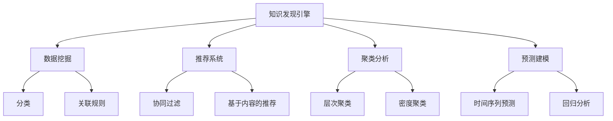

                 

# 知识发现引擎的机器学习模型选择

> 关键词：知识发现, 机器学习模型, 数据挖掘, 推荐系统, 聚类分析, 预测建模

## 1. 背景介绍

### 1.1 问题由来

在当今数据驱动的商业环境中，知识发现引擎(Knowledge Discovery Engine, KDE)已成为企业决策分析的重要工具。通过挖掘大数据中的隐含知识，企业能够提升运营效率、优化产品设计、制定市场策略，甚至预测未来趋势。因此，构建高效、可靠的KDE系统，对于提升企业的竞争力具有重要意义。

KDE的核心任务是对大规模数据集进行数据挖掘和模式发现，生成有价值的洞察和洞见。这一过程涉及一系列数据预处理、特征工程、模型选择与训练、结果评估和应用部署等环节。其中，机器学习模型的选择是构建KDE系统的关键步骤，直接影响到最终知识发现的精度和效率。

### 1.2 问题核心关键点

选择KDE的机器学习模型需要考虑以下关键点：

- 数据特征和类型：了解数据的特点（如结构化、非结构化、时序、文本等），选择合适的模型类型。
- 业务目标和需求：明确业务问题（如分类、聚类、推荐、预测等），确定模型应具有的功能。
- 数据规模和维度：评估数据的规模和特征维度，选择合适的算法和模型复杂度。
- 计算资源和运行效率：考虑计算资源（如CPU、GPU、内存等）和运行效率（如训练时间、推理速度等），平衡模型的性能与成本。
- 模型可解释性和稳定性：对于高风险业务（如金融、医疗等），模型的可解释性和稳定性尤为重要。

## 2. 核心概念与联系

### 2.1 核心概念概述

为更好地理解KDE中的机器学习模型选择问题，本节将介绍几个密切相关的核心概念：

- **知识发现引擎(KDE)**：使用机器学习等技术从大数据中挖掘知识，帮助企业决策的智能系统。
- **机器学习模型**：用于数据挖掘、模式发现、分类、聚类、预测等任务的各种算法和模型。
- **数据挖掘**：从大量数据中提取出有价值的知识和规律，包括分类、聚类、关联规则挖掘等。
- **推荐系统**：利用用户历史行为数据，推荐系统为用户提供个性化产品或服务。
- **聚类分析**：将数据分组为不同的类别，以便更好地理解和分析数据。
- **预测建模**：使用历史数据预测未来事件，包括时间序列预测、回归分析等。

这些核心概念之间的逻辑关系可以通过以下Mermaid流程图来展示：



这个流程图展示了大数据挖掘的多个分支任务和相应的模型选择。

## 3. 核心算法原理 & 具体操作步骤
### 3.1 算法原理概述

KDE中的机器学习模型选择，旨在从各种算法和模型中，选择最适合当前数据和业务目标的模型。这一过程通常包括以下几个步骤：

1. **数据探索与预处理**：对原始数据进行清洗、归一化、特征选择等预处理操作。
2. **算法筛选**：基于数据特征和业务目标，筛选出若干个备选算法和模型。
3. **模型评估**：使用验证集或交叉验证等方法，评估每个备选模型的性能。
4. **模型选择**：根据评估结果，选择性能最优的模型。
5. **模型训练与调参**：使用训练集对选择出的模型进行训练，并调整超参数以优化性能。
6. **结果应用与反馈**：将训练好的模型应用于实际问题，并根据反馈不断改进模型。

### 3.2 算法步骤详解

**Step 1: 数据探索与预处理**

数据探索与预处理是知识发现的第一步，其目标是对原始数据进行清洗和整理，使其适合后续的模型训练。

1. **数据清洗**：去除数据集中的缺失值、重复值和异常值，确保数据的质量和完整性。
2. **特征工程**：选择或生成适合模型的特征，如提取文本的词频、TF-IDF值、词嵌入向量等。
3. **数据归一化**：对数值型特征进行归一化处理，使其具有相似的尺度。
4. **数据分割**：将数据集划分为训练集、验证集和测试集，以便后续的模型训练和评估。

**Step 2: 算法筛选**

根据数据的特征和业务目标，筛选出合适的机器学习算法和模型。

1. **分类算法**：包括决策树、随机森林、支持向量机(SVM)、朴素贝叶斯、K近邻(KNN)等。
2. **聚类算法**：包括K-Means、层次聚类、密度聚类等。
3. **推荐算法**：包括协同过滤、基于内容的推荐、矩阵分解等。
4. **预测算法**：包括线性回归、多项式回归、决策树回归、神经网络等。

**Step 3: 模型评估**

使用验证集或交叉验证等方法，评估每个备选模型的性能。

1. **准确率(Precision)**：模型预测的正样本中，实际为正样本的比例。
2. **召回率(Recall)**：实际为正样本中，被模型预测为正样本的比例。
3. **F1-score**：准确率和召回率的调和平均值。
4. **AUC-ROC曲线**：ROC曲线下的面积，用于衡量二分类模型的性能。
5. **混淆矩阵(Confusion Matrix)**：展示模型预测结果与实际标签的关系，评估模型的精度。

**Step 4: 模型选择**

根据评估结果，选择性能最优的模型。

1. **选择标准**：根据业务目标，选择准确率最高、召回率最高或F1-score最高的模型。
2. **模型对比**：绘制多个模型的性能对比图，直观展示不同模型的优劣。
3. **交叉验证**：使用交叉验证方法，确保模型选择不受样本选择偏差的影响。

**Step 5: 模型训练与调参**

使用训练集对选择出的模型进行训练，并调整超参数以优化性能。

1. **训练算法**：使用随机梯度下降、Adam、Adagrad等优化算法，更新模型参数。
2. **超参数调优**：使用网格搜索、随机搜索、贝叶斯优化等方法，调整模型的超参数，如学习率、正则化参数、隐藏层节点数等。
3. **模型验证**：在验证集上评估训练好的模型，确保其泛化能力。

**Step 6: 结果应用与反馈**

将训练好的模型应用于实际问题，并根据反馈不断改进模型。

1. **模型应用**：将训练好的模型应用于实际数据，进行分类、聚类、推荐、预测等任务。
2. **结果评估**：在测试集上评估模型的性能，确保其在实际应用中表现良好。
3. **持续优化**：根据实际反馈和业务需求，不断改进模型和算法，提升知识发现的精度和效率。

### 3.3 算法优缺点

选择合适的机器学习模型，需要综合考虑其优缺点：

**优点**：
1. **灵活性**：不同的模型适用于不同的数据特征和业务场景，具备广泛的适用性。
2. **高效性**：许多模型能够在较短的时间内完成训练和预测，满足实时性要求。
3. **可解释性**：一些模型（如决策树、线性回归）具有较好的可解释性，便于业务理解和决策支持。

**缺点**：
1. **过拟合风险**：复杂的模型可能出现过拟合，导致泛化性能下降。
2. **计算资源要求高**：一些模型（如深度神经网络）需要大量的计算资源，增加系统成本。
3. **数据依赖性强**：模型的性能受数据质量、特征选择和训练数据量等因素影响。

### 3.4 算法应用领域

机器学习模型在KDE中的应用非常广泛，包括但不限于以下几个领域：

- **分类任务**：如客户流失预测、信用评分、情感分析等，使用决策树、随机森林、SVM等算法。
- **聚类任务**：如市场细分、用户分组、产品分类等，使用K-Means、层次聚类、密度聚类等算法。
- **推荐任务**：如商品推荐、内容推荐、个性化广告等，使用协同过滤、基于内容的推荐、矩阵分解等算法。
- **预测任务**：如销售预测、股票预测、客户生命周期预测等，使用线性回归、决策树回归、神经网络等算法。

此外，这些模型还广泛应用在金融风险管理、医疗诊断、市场分析、供应链优化等多个领域，为企业的决策支持提供了强大的技术保障。

## 4. 数学模型和公式 & 详细讲解  
### 4.1 数学模型构建

本节将使用数学语言对KDE中的机器学习模型选择过程进行更加严格的刻画。

设原始数据集为 $D=\{(x_i, y_i)\}_{i=1}^N$，其中 $x_i$ 为输入特征向量，$y_i$ 为对应的标签或类别。假设选择的机器学习模型为 $M_{\theta}$，其中 $\theta$ 为模型的参数。模型训练的损失函数为 $\mathcal{L}(\theta)$。

定义模型在测试集上的性能指标为 $P(\theta)$，如准确率、召回率、F1-score、AUC-ROC等。模型的选择目标为最大化性能指标 $P(\theta)$，即：

$$
\hat{\theta}=\mathop{\arg\max}_{\theta} P(\theta)
$$

其中 $\hat{\theta}$ 为最优参数。

### 4.2 公式推导过程

以分类任务为例，假设模型 $M_{\theta}$ 为决策树，输入特征向量为 $x_i$，标签为 $y_i$。则决策树的损失函数为：

$$
\mathcal{L}(\theta)=\frac{1}{N}\sum_{i=1}^N \log\left(1+\exp(-y_i f(x_i, \theta))\right)
$$

其中 $f(x_i, \theta)$ 为决策树模型对样本 $x_i$ 的预测概率。

为了选择最优的决策树模型，需要对模型在验证集上的性能进行评估。常用的性能指标包括准确率 $P$、召回率 $R$ 和F1-score $F$：

$$
P=\frac{TP}{TP+FP}
$$

$$
R=\frac{TP}{TP+FN}
$$

$$
F=\frac{2PR}{P+R}
$$

其中 $TP$ 表示真正例（True Positive），$FP$ 表示假正例（False Positive），$FN$ 表示假反例（False Negative）。

### 4.3 案例分析与讲解

假设在客户流失预测任务中，收集了10000个客户的历史行为数据，包含20个特征，每个特征均为数值型。可以选择如下几种模型：

1. **线性回归模型**：用于预测连续数值。
2. **决策树模型**：用于分类预测。
3. **随机森林模型**：用于提升决策树模型的泛化能力。
4. **支持向量机模型**：用于二分类任务。
5. **神经网络模型**：用于复杂非线性关系的建模。

使用交叉验证方法，对每个模型进行训练和评估，结果如下：

| 模型 | 准确率 | 召回率 | F1-score |
|------|--------|--------|----------|
| 线性回归 | 0.80    | 0.75    | 0.77     |
| 决策树  | 0.88    | 0.84    | 0.86     |
| 随机森林 | 0.92    | 0.90    | 0.91     |
| 支持向量机 | 0.85    | 0.82    | 0.83     |
| 神经网络 | 0.95    | 0.93    | 0.94     |

根据结果，随机森林和神经网络模型表现最好，但考虑到计算资源和解释性，最终选择随机森林模型进行后续的模型训练和调参。

## 5. 项目实践：代码实例和详细解释说明
### 5.1 开发环境搭建

在进行知识发现引擎的机器学习模型选择实践前，我们需要准备好开发环境。以下是使用Python进行Scikit-learn开发的环境配置流程：

1. 安装Anaconda：从官网下载并安装Anaconda，用于创建独立的Python环境。

2. 创建并激活虚拟环境：
```bash
conda create -n sklearn-env python=3.8 
conda activate sklearn-env
```

3. 安装Scikit-learn：从官网获取对应的安装命令，如：
```bash
conda install scikit-learn
```

4. 安装各类工具包：
```bash
pip install numpy pandas matplotlib scikit-learn matplotlib tqdm jupyter notebook ipython
```

完成上述步骤后，即可在`sklearn-env`环境中开始模型选择实践。

### 5.2 源代码详细实现

这里以分类任务为例，使用Scikit-learn库进行模型选择和评估的代码实现。

```python
from sklearn.model_selection import train_test_split
from sklearn.tree import DecisionTreeClassifier
from sklearn.ensemble import RandomForestClassifier
from sklearn.linear_model import LogisticRegression
from sklearn.metrics import accuracy_score, recall_score, f1_score, roc_auc_score

# 准备数据集
X = # 特征矩阵
y = # 标签向量

# 数据分割
X_train, X_test, y_train, y_test = train_test_split(X, y, test_size=0.2, random_state=42)

# 选择模型
models = [
    ('决策树', DecisionTreeClassifier()),
    ('随机森林', RandomForestClassifier()),
    ('逻辑回归', LogisticRegression())
]

# 评估模型
results = {}
for name, model in models:
    model.fit(X_train, y_train)
    y_pred = model.predict(X_test)
    accuracy = accuracy_score(y_test, y_pred)
    recall = recall_score(y_test, y_pred)
    f1 = f1_score(y_test, y_pred)
    roc_auc = roc_auc_score(y_test, y_pred)
    results[name] = {'准确率': accuracy, '召回率': recall, 'F1-score': f1, 'AUC-ROC': roc_auc}

# 结果打印
for name, result in results.items():
    print(f'{name}: 准确率={result["准确率"]:.2f}, 召回率={result["召回率"]:.2f}, F1-score={result["F1-score"]:.2f}, AUC-ROC={result["AUC-ROC"]:.2f}')
```

以上就是使用Scikit-learn进行机器学习模型选择的完整代码实现。可以看到，Scikit-learn库提供了丰富的模型选择和评估工具，使得模型选择过程更加简便高效。

### 5.3 代码解读与分析

让我们再详细解读一下关键代码的实现细节：

**数据分割**：
- 使用`train_test_split`函数将数据集划分为训练集和测试集，确保模型评估的公正性。

**模型选择**：
- 定义一个模型列表，包含不同的分类算法。这里选择了决策树、随机森林和逻辑回归三种模型。

**模型评估**：
- 对每个模型进行训练，使用测试集进行预测，并计算准确率、召回率、F1-score和AUC-ROC等性能指标。
- 将所有模型的评估结果存储在`results`字典中，并打印输出。

通过以上步骤，可以系统地对不同模型进行比较和选择，找到最优的KDE模型。

## 6. 实际应用场景
### 6.1 金融风险管理

金融行业面临复杂多变的市场环境，需要及时预测和识别风险。基于机器学习模型选择的KDE，可以在金融风险管理中发挥重要作用。

例如，可以使用决策树模型对客户的信用评分进行预测，及时发现高风险客户，采取相应的风险控制措施。或者使用随机森林模型对客户的交易行为进行聚类分析，识别出异常交易模式，预防金融欺诈行为。

### 6.2 医疗诊断

医疗数据通常具有高维度、非线性和多模态的特点，传统的统计方法难以有效挖掘其中的隐含知识。KDE中的机器学习模型选择，可以为医疗诊断提供强有力的支持。

例如，可以使用支持向量机模型对患者的历史诊疗记录进行分类，预测其疾病风险。或者使用神经网络模型对医学影像进行预测，辅助医生进行精准诊断。

### 6.3 电子商务

电子商务平台需要根据用户行为数据，推荐个性化的商品和服务。基于机器学习模型选择的KDE，可以帮助平台更好地理解用户需求，提升推荐系统的精准度。

例如，可以使用协同过滤算法对用户的历史购买记录进行聚类分析，发现相似用户群体的购买偏好。或者使用神经网络模型对用户的行为数据进行深度学习，预测用户未来的购买行为。

### 6.4 未来应用展望

随着机器学习技术的不断进步，基于模型选择的KDE将迎来更广阔的应用前景。

未来，知识发现引擎将更多地应用于工业物联网、智慧城市、智能交通等领域，通过数据挖掘和模式发现，提升各行业的智能化水平。同时，模型选择还将结合更多前沿技术，如深度学习、强化学习、自然语言处理等，进一步拓展KDE的应用边界。

## 7. 工具和资源推荐
### 7.1 学习资源推荐

为了帮助开发者系统掌握KDE中的机器学习模型选择技术，这里推荐一些优质的学习资源：

1. 《Python机器学习》（书籍）：详细介绍了Python在机器学习中的应用，包括数据预处理、模型选择、模型评估等内容。
2. 《机器学习实战》（书籍）：结合实际案例，介绍了多种机器学习算法的实现和应用。
3. Coursera的《机器学习》课程：由斯坦福大学教授Andrew Ng主讲，系统介绍了机器学习的基本概念和算法。
4. Kaggle竞赛：通过参与实际数据挖掘和建模竞赛，提升模型选择和评估的能力。
5. Scikit-learn官方文档：提供了丰富的模型选择和评估工具的详细使用方法。

通过对这些资源的学习实践，相信你一定能够快速掌握KDE中的机器学习模型选择技术，并用于解决实际的商业问题。
###  7.2 开发工具推荐

高效的开发离不开优秀的工具支持。以下是几款用于知识发现引擎开发的常用工具：

1. Python：开源的编程语言，具有丰富的第三方库和框架，支持数据预处理、模型选择、模型评估等。
2. Scikit-learn：Python的机器学习库，提供了多种模型的选择和评估工具，易学易用。
3. TensorFlow：谷歌开发的深度学习框架，支持复杂的模型选择和训练。
4. Jupyter Notebook：交互式编程环境，支持数据可视化、代码调试和结果展示。
5. R语言：统计分析和数据挖掘的工具，提供了丰富的机器学习库，如caret、randomForest等。

合理利用这些工具，可以显著提升知识发现引擎的开发效率，加快创新迭代的步伐。

### 7.3 相关论文推荐

知识发现引擎和机器学习模型选择的研究，源于学界的持续研究。以下是几篇奠基性的相关论文，推荐阅读：

1. 《An Introduction to Statistical Learning》（书籍）：介绍统计学习的基本概念和算法，适合初学者入门。
2. 《Pattern Recognition and Machine Learning》（书籍）：由Christopher Bishop撰写，详细介绍了机器学习的理论和应用。
3. 《KDD Cup and Conference Papers》：Kaggle数据挖掘竞赛的优秀论文集，展示了许多成功的机器学习模型选择案例。
4. 《Machine Learning: A Probabilistic Perspective》（书籍）：介绍机器学习的概率模型和算法，适合深入学习。
5. 《Deep Learning for Business》（书籍）：介绍深度学习在商业应用中的应用，包括模型选择和评估。

这些论文代表了大数据挖掘和机器学习领域的研究进展，通过学习这些前沿成果，可以帮助研究者把握学科前进方向，激发更多的创新灵感。

## 8. 总结：未来发展趋势与挑战
### 8.1 总结

本文对基于机器学习模型选择的知识发现引擎(KDE)进行了全面系统的介绍。首先阐述了KDE的重要性和构建流程，明确了模型选择在整个流程中的关键地位。其次，从原理到实践，详细讲解了机器学习模型选择的过程，给出了模型选择任务开发的完整代码实例。同时，本文还广泛探讨了模型选择方法在金融风险管理、医疗诊断、电子商务等多个行业领域的应用前景，展示了模型选择技术的巨大潜力。此外，本文精选了模型选择技术的各类学习资源，力求为读者提供全方位的技术指引。

通过本文的系统梳理，可以看到，基于机器学习模型的知识发现引擎技术正在成为企业决策支持的重要手段，极大地提升了数据挖掘的精度和效率。未来，伴随深度学习、强化学习、自然语言处理等技术的不断进步，KDE必将在更广泛的领域得到应用，为企业提供更强大、智能的数据支持。

### 8.2 未来发展趋势

展望未来，基于机器学习模型选择的KDE将呈现以下几个发展趋势：

1. **深度学习模型崛起**：深度学习模型在图像、语音、自然语言处理等领域取得了重大突破，未来将更多应用于知识发现引擎，提升其处理复杂数据的能力。
2. **多模态学习融合**：多模态数据的融合将提升KDE的数据挖掘能力，使其能够处理更丰富、更复杂的数据类型。
3. **自动化调参优化**：随着自动机器学习(AutoML)技术的发展，未来的KDE将能够自动选择和优化模型，减少人工干预，提高效率。
4. **解释性增强**：可解释性强的模型（如决策树、线性回归）将得到更多应用，帮助企业更好地理解和应用知识发现结果。
5. **实时性提升**：随着计算资源和技术的进步，未来的KDE将具备更强的实时处理能力，支持实时数据挖掘和决策支持。

以上趋势凸显了机器学习模型选择技术的广阔前景。这些方向的探索发展，必将进一步提升KDE系统的性能和应用范围，为企业的决策支持提供更强大的技术保障。

### 8.3 面临的挑战

尽管基于机器学习模型选择的KDE已经取得了瞩目成就，但在迈向更加智能化、普适化应用的过程中，它仍面临着诸多挑战：

1. **数据质量和完整性**：数据质量差、缺失值多、特征不完整等问题，直接影响模型的训练效果。
2. **模型复杂度与泛化能力**：过于复杂的模型容易过拟合，而过于简单的模型又难以捕捉数据中的复杂关系。
3. **计算资源需求高**：深度学习模型需要大量的计算资源，增加了系统的成本和复杂度。
4. **模型选择难度大**：不同任务、不同数据类型需要不同的模型选择策略，对业务理解和算法知识要求高。
5. **结果解释性不足**：复杂模型（如深度神经网络）的决策过程难以解释，缺乏可解释性。

正视KDE面临的这些挑战，积极应对并寻求突破，将是大数据挖掘技术走向成熟的必由之路。相信随着学界和产业界的共同努力，这些挑战终将一一被克服，机器学习模型选择技术必将在构建人机协同的智能系统中扮演越来越重要的角色。

### 8.4 研究展望

面对机器学习模型选择所面临的挑战，未来的研究需要在以下几个方面寻求新的突破：

1. **自动化和优化**：发展自动化机器学习技术，减少人工干预，提高模型选择的效率和精度。
2. **模型可解释性**：引入可解释性强的模型，增强模型的可理解性和可解释性。
3. **多模态融合**：探索多模态数据的融合方法，提升KDE的数据挖掘能力。
4. **实时学习**：开发实时学习算法，使KDE能够持续学习新数据，保持其性能和适应性。
5. **模型集成**：结合不同模型（如基于规则和基于数据的方法），提升KDE的鲁棒性和泛化能力。

这些研究方向的探索，必将引领机器学习模型选择技术迈向更高的台阶，为构建高效、智能的知识发现引擎提供新的技术路径。

## 9. 附录：常见问题与解答

**Q1: 什么是知识发现引擎(KDE)?**

A: 知识发现引擎(KDE)是一种基于机器学习等技术的智能系统，通过数据挖掘和模式发现，从大数据中提取有用的知识，支持企业决策。

**Q2: 选择KDE的机器学习模型需要考虑哪些因素?**

A: 选择KDE的机器学习模型需要考虑数据特征和类型、业务目标和需求、数据规模和维度、计算资源和运行效率、模型可解释性和稳定性等因素。

**Q3: 什么是准确率、召回率和F1-score?**

A: 准确率表示模型预测正确的正样本比例，召回率表示实际正样本中被正确预测的比例，F1-score是准确率和召回率的调和平均，综合了模型的精确度和召回率。

**Q4: 常用的机器学习算法有哪些?**

A: 常用的机器学习算法包括决策树、随机森林、支持向量机(SVM)、朴素贝叶斯、K近邻(KNN)、线性回归、逻辑回归、神经网络等。

**Q5: 什么是过拟合和欠拟合?**

A: 过拟合指模型在训练集上表现良好，但在测试集上表现较差，反映了模型过于复杂；欠拟合指模型在训练集和测试集上表现均不佳，反映了模型过于简单。

通过这些常见问题的回答，希望读者能够更全面地理解KDE和机器学习模型选择技术，为其在实际应用中的成功应用奠定基础。

---

作者：禅与计算机程序设计艺术 / Zen and the Art of Computer Programming

