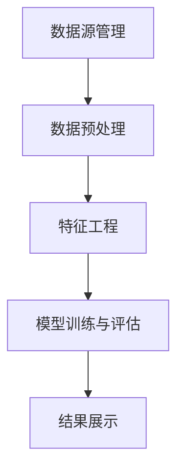

                 

# 知识发现引擎的架构设计与实现

## 1. 背景介绍

在当今数据驱动的世界中，知识发现引擎(Knowledge Discovery Engine, KDE)成为了一个关键技术，它从大量数据中提取出有价值的信息，为决策支持、智能推荐、个性化服务等领域提供坚实的基础。知识发现引擎不仅仅是对数据的简单提取，更是对数据的深度挖掘和分析，它集成了数据预处理、特征工程、模型构建与评估、结果解释等多个环节，形成了一个完整的知识发现系统。

### 1.1 问题由来

随着互联网和信息技术的发展，数据量呈爆炸式增长，海量数据成为了企业宝贵的财富。然而，如何从这些海量数据中提取有价值的信息，成为一个亟待解决的问题。传统的统计分析和人工审核方法已经无法满足现代需求，于是，知识发现引擎应运而生。通过数据挖掘、机器学习等技术，知识发现引擎能够自动分析数据，发现隐藏在数据背后的知识模式和关联，帮助人们做出更准确的决策。

### 1.2 问题核心关键点

知识发现引擎的核心在于能够从数据中提取出有价值的信息。这个过程涉及到以下几个关键点：
1. **数据预处理**：清洗和规范化数据，去除噪声和异常值，确保数据质量。
2. **特征工程**：从原始数据中提取出对目标任务有用的特征，减少模型的复杂度。
3. **模型构建与评估**：选择合适的模型进行训练和评估，最大化模型的预测准确率和泛化能力。
4. **结果解释**：将模型发现的知识转化为可解释的形式，方便用户理解和使用。

知识发现引擎的技术框架通常包括数据源管理、数据预处理、特征工程、模型训练、模型评估、结果展示等多个模块。这些模块之间相互协作，共同完成知识发现的任务。

### 1.3 问题研究意义

知识发现引擎的研究具有重要的理论和实际意义。在理论方面，它推动了数据挖掘、机器学习、统计学等领域的发展，促进了跨学科知识的交流。在实际应用方面，知识发现引擎能够帮助企业从海量数据中发现隐藏的知识和模式，提升决策效率和精准度，推动业务创新和发展。

## 2. 核心概念与联系

### 2.1 核心概念概述

知识发现引擎的核心概念包括数据源、数据预处理、特征工程、模型训练、模型评估和结果展示。下面将详细介绍这些核心概念的原理和架构。

1. **数据源管理**：
   - **定义**：数据源是指提供数据的仓库或平台，包括数据库、数据湖、Web数据、日志等。
   - **原理**：通过接口和API，数据源管理模块从不同的数据源中抽取数据，形成统一的数据集。

2. **数据预处理**：
   - **定义**：数据预处理是指对原始数据进行清洗、转换、规范化等操作，去除噪声和异常值，形成高质量的数据集。
   - **原理**：包括数据清洗、数据转换、数据归一化等技术手段。

3. **特征工程**：
   - **定义**：特征工程是指从原始数据中提取有用的特征，作为模型的输入。
   - **原理**：包括特征选择、特征提取、特征转换等技术手段。

4. **模型训练与评估**：
   - **定义**：模型训练是指使用数据集训练模型，评估是指对训练好的模型进行性能评估。
   - **原理**：包括选择模型、训练模型、评估模型、调优模型等技术手段。

5. **结果展示**：
   - **定义**：结果展示是指将模型发现的知识转化为易于理解和使用的形式，供用户查看和使用。
   - **原理**：包括数据可视化、知识图谱构建、报告生成等技术手段。

这些核心概念之间的联系可以通过以下Mermaid流程图来展示：



这个流程图展示了知识发现引擎各个模块之间的逻辑关系：

1. 数据源管理模块负责从不同数据源中抽取数据，形成统一的数据集。
2. 数据预处理模块对数据进行清洗、转换和规范化，形成高质量的数据集。
3. 特征工程模块从数据中提取有用的特征，作为模型的输入。
4. 模型训练与评估模块使用数据集训练模型，并对训练好的模型进行性能评估。
5. 结果展示模块将模型发现的知识转化为易于理解的形式，供用户查看和使用。

## 3. 核心算法原理 & 具体操作步骤

### 3.1 算法原理概述

知识发现引擎的算法原理主要基于数据挖掘和机器学习的技术，通过从数据中提取模式和关联，生成有价值的知识。以下是几种常见的知识发现算法：

1. **聚类算法(Clustering)**：将数据集中的对象划分为多个簇，使得同一簇内的对象相似度高，不同簇之间的对象相似度低。
2. **分类算法(Classification)**：根据已知的分类结果，将新数据分类到相应的类别中。
3. **关联规则学习(Association Rule Learning)**：从数据集中发现频繁出现的规则，用于商品推荐、市场分析等领域。
4. **序列模式学习(Sequence Pattern Learning)**：从时间序列数据中发现有趣的序列模式，用于预测、异常检测等。
5. **神经网络(Neural Networks)**：通过多层神经网络对数据进行训练和预测，适用于复杂的非线性关系建模。

### 3.2 算法步骤详解

知识发现引擎的实现通常包括以下几个关键步骤：

**Step 1: 数据源管理**
- 选择合适的数据源，通过API或接口抽取数据。
- 数据源进行数据抽取和整合，形成统一的数据集。

**Step 2: 数据预处理**
- 数据清洗：去除噪声和异常值，保证数据质量。
- 数据转换：将数据转换为适合模型处理的格式。
- 数据归一化：将数据进行归一化处理，确保不同特征之间的可比性。

**Step 3: 特征工程**
- 特征选择：从原始数据中选择对目标任务有用的特征。
- 特征提取：使用统计方法或机器学习算法提取特征。
- 特征转换：对特征进行转换，生成新的特征，如多项式特征、交叉特征等。

**Step 4: 模型训练与评估**
- 模型选择：选择合适的机器学习算法和模型结构。
- 模型训练：使用数据集训练模型，最小化预测误差。
- 模型评估：使用测试集评估模型的性能指标，如准确率、召回率、F1分数等。
- 模型调优：调整模型参数，提高模型性能。

**Step 5: 结果展示**
- 数据可视化：将数据可视化，帮助用户理解数据特征和模式。
- 知识图谱构建：构建知识图谱，展示数据之间的关联。
- 报告生成：生成报告，展示模型发现的知识和结果。

### 3.3 算法优缺点

知识发现引擎的算法具有以下优点：
1. **自动化**：能够自动从数据中提取知识，减轻人工干预的负担。
2. **高效性**：能够处理大规模数据集，快速发现有价值的信息。
3. **灵活性**：支持多种算法和模型，适用于不同的应用场景。

同时，这些算法也存在一些缺点：
1. **数据质量要求高**：对数据质量有较高要求，数据预处理环节繁琐。
2. **模型复杂度高**：复杂模型需要大量计算资源和时间，训练和调优难度较大。
3. **结果可解释性不足**：部分算法生成的结果难以解释，用户难以理解。
4. **应用场景限制**：某些算法适用于特定领域或数据类型，应用范围有限。

### 3.4 算法应用领域

知识发现引擎的应用领域非常广泛，包括但不限于以下几个方面：

1. **金融风险管理**：通过分析历史交易数据，发现潜在的风险和机会，帮助金融机构制定投资策略。
2. **市场营销**：分析客户数据，发现客户偏好和购买行为，制定个性化营销策略。
3. **医疗诊断**：通过分析病历数据，发现疾病模式和关联，辅助医生诊断和治疗。
4. **物流优化**：分析运输数据，优化物流路径和配送策略，降低成本提高效率。
5. **推荐系统**：分析用户行为和偏好，推荐个性化的商品或内容，提升用户体验。

## 4. 数学模型和公式 & 详细讲解 & 举例说明

### 4.1 数学模型构建

知识发现引擎的数学模型通常包括数据表示、特征提取、模型训练等几个部分。以下是几个常见的数学模型：

1. **K-Means聚类算法**：
   - **定义**：将数据集划分为K个簇，使得每个簇内的数据点相似度高。
   - **公式**：
   $$
   \min_{\mu_k} \sum_{i=1}^K \sum_{x \in C_k} ||x-\mu_k||^2
   $$
   其中 $\mu_k$ 为簇中心，$C_k$ 为簇内的数据点集合。

2. **决策树分类算法**：
   - **定义**：通过树形结构将数据划分为不同的类别，每个节点表示一个特征或条件。
   - **公式**：
   $$
   \min_{T} \sum_{i=1}^N L(y_i, T)
   $$
   其中 $L$ 为损失函数，$y_i$ 为真实标签，$T$ 为决策树模型。

3. **关联规则学习算法**：
   - **定义**：从数据集中发现频繁出现的规则，如购物篮分析。
   - **公式**：
   $$
   \min_{I} \sum_{t \in I} \frac{count(t)}{\sum_{t \in I} count(t)}
   $$
   其中 $I$ 为频繁项集，$count(t)$ 为项集 $t$ 的计数。

4. **神经网络模型**：
   - **定义**：通过多层神经网络对数据进行训练和预测。
   - **公式**：
   $$
   y=f(Wx+b)
   $$
   其中 $W$ 为权重矩阵，$b$ 为偏置向量，$f$ 为激活函数。

### 4.2 公式推导过程

以下以K-Means聚类算法为例，推导其数学模型和公式。

**K-Means算法**：
1. **初始化**：随机选择K个初始簇中心。
2. **分配**：将每个数据点分配到最近的簇中心。
3. **更新**：计算每个簇的中心点，重新分配数据点。
4. **迭代**：重复步骤2和3，直到收敛。

**公式推导**：
假设数据集 $D=\{x_1,x_2,\ldots,x_n\}$，每个数据点 $x_i$ 的特征向量为 $x_{ij}$，其中 $j$ 表示特征维度。设 $C_k$ 为第 $k$ 个簇的数据点集合，$\mu_k$ 为 $C_k$ 的中心点，则K-Means算法的目标函数为：
$$
\min_{\mu_k} \sum_{i=1}^n \min_{k=1,\ldots,K} ||x_i-\mu_k||^2
$$

通过求解上述目标函数，找到最优的簇中心 $\mu_k$，使得每个簇内的数据点相似度最大化。

### 4.3 案例分析与讲解

**案例1：购物篮分析**
- **背景**：电商网站需要分析用户的购物行为，发现商品之间的关联。
- **模型**：使用Apriori算法进行关联规则学习。
- **步骤**：
  1. 数据预处理：清洗和规范化数据，去除噪声和异常值。
  2. 特征工程：提取商品ID和购买次数作为特征。
  3. 模型训练与评估：使用Apriori算法训练模型，评估频繁项集和关联规则。
  4. 结果展示：将关联规则可视化，供业务部门参考。

**案例2：金融风险管理**
- **背景**：金融机构需要分析交易数据，发现潜在的风险和机会。
- **模型**：使用K-Means聚类算法进行客户分类。
- **步骤**：
  1. 数据预处理：清洗和规范化交易数据，去除异常值和噪声。
  2. 特征工程：提取交易金额、交易频率、交易时间等特征。
  3. 模型训练与评估：使用K-Means聚类算法训练模型，评估聚类结果的准确率。
  4. 结果展示：将聚类结果可视化，帮助制定投资策略。

## 5. 项目实践：代码实例和详细解释说明

### 5.1 开发环境搭建

要进行知识发现引擎的开发，需要以下开发环境：

1. **编程语言**：Python是知识发现引擎开发的主要语言，具有丰富的数据科学库和机器学习库。
2. **数据科学库**：Pandas、NumPy、Scikit-learn等库，用于数据预处理和特征工程。
3. **机器学习库**：TensorFlow、PyTorch、Scikit-learn等库，用于模型训练和评估。
4. **可视化库**：Matplotlib、Seaborn、Plotly等库，用于数据可视化。

**安装步骤**：
1. 安装Anaconda：从官网下载并安装Anaconda，用于创建独立的Python环境。
2. 创建并激活虚拟环境：
   ```bash
   conda create -n kde-env python=3.8 
   conda activate kde-env
   ```
3. 安装数据科学和机器学习库：
   ```bash
   conda install pandas numpy scipy scikit-learn matplotlib seaborn plotly
   ```
4. 安装TensorFlow和PyTorch：
   ```bash
   conda install tensorflow==2.6 pytorch torchvision torchaudio
   ```

完成上述步骤后，即可在`kde-env`环境中开始开发。

### 5.2 源代码详细实现

下面以K-Means聚类算法为例，给出使用Scikit-learn库进行聚类分析的Python代码实现。

```python
from sklearn.cluster import KMeans
import pandas as pd
import matplotlib.pyplot as plt

# 加载数据集
data = pd.read_csv('data.csv')

# 特征工程
X = data[['feature1', 'feature2', 'feature3']]

# 聚类分析
kmeans = KMeans(n_clusters=3, random_state=0)
kmeans.fit(X)

# 可视化结果
plt.scatter(X['feature1'], X['feature2'], c=kmeans.labels_)
plt.title('K-Means Clustering')
plt.show()
```

### 5.3 代码解读与分析

**代码解释**：
1. 加载数据集：使用Pandas库加载数据集，将其存储为DataFrame对象。
2. 特征工程：选择需要的特征，将其存储为特征矩阵X。
3. 聚类分析：使用Scikit-learn库中的KMeans类进行聚类分析，设置簇数为3，随机种子为0。
4. 可视化结果：使用Matplotlib库将聚类结果可视化，通过颜色区分不同的簇。

**分析与优化**：
1. 数据预处理：需要进一步清洗和规范化数据，去除噪声和异常值。
2. 特征选择：需要选择合适的特征，降低特征维度，减少计算量。
3. 模型调优：需要进一步调整模型的参数，如簇数、迭代次数等，提高聚类效果。

## 6. 实际应用场景

### 6.1 智能推荐系统

智能推荐系统是知识发现引擎的一个重要应用场景。通过分析用户的历史行为数据，发现用户偏好和兴趣，从而推荐个性化的商品或内容。

**步骤**：
1. 数据预处理：清洗和规范化用户行为数据，去除噪声和异常值。
2. 特征工程：提取用户ID、商品ID、购买次数等特征。
3. 模型训练与评估：使用协同过滤算法、矩阵分解算法等进行训练和评估。
4. 结果展示：将推荐结果可视化，展示给用户。

### 6.2 金融风险管理

金融机构需要从历史交易数据中发现潜在的风险和机会，制定投资策略。

**步骤**：
1. 数据预处理：清洗和规范化交易数据，去除异常值和噪声。
2. 特征工程：提取交易金额、交易频率、交易时间等特征。
3. 模型训练与评估：使用聚类算法、分类算法等进行训练和评估。
4. 结果展示：将聚类结果可视化，帮助制定投资策略。

### 6.3 医疗诊断

医疗诊断是知识发现引擎的另一个重要应用场景。通过分析病历数据，发现疾病模式和关联，辅助医生诊断和治疗。

**步骤**：
1. 数据预处理：清洗和规范化病历数据，去除噪声和异常值。
2. 特征工程：提取症状、病史、检查结果等特征。
3. 模型训练与评估：使用分类算法、关联规则学习算法等进行训练和评估。
4. 结果展示：将诊断结果可视化，帮助医生制定治疗方案。

## 7. 工具和资源推荐

### 7.1 学习资源推荐

为了帮助开发者系统掌握知识发现引擎的理论基础和实践技巧，这里推荐一些优质的学习资源：

1. **《Python数据科学手册》**：详细介绍了数据科学和机器学习的理论基础和实践技巧，适合初学者入门。
2. **《K-Means算法详解》**：详细讲解了K-Means算法的原理、步骤和应用，适合深入理解算法细节。
3. **《Scikit-learn官方文档》**：提供了丰富的机器学习算法和工具，包括聚类、分类、回归等。
4. **《机器学习实战》**：通过实践案例，介绍了多种机器学习算法和工具的应用，适合动手实践。
5. **《深度学习入门》**：介绍了深度学习的基本概念和实践技巧，适合入门学习。

通过对这些资源的学习实践，相信你一定能够快速掌握知识发现引擎的精髓，并用于解决实际的NLP问题。

### 7.2 开发工具推荐

高效的开发离不开优秀的工具支持。以下是几款用于知识发现引擎开发的常用工具：

1. **Anaconda**：用于创建和管理Python环境，提供丰富的科学计算库和工具。
2. **Jupyter Notebook**：用于数据科学和机器学习项目的开发和共享，支持代码编写、数据可视化、文档记录等。
3. **Matplotlib**：用于数据可视化的Python库，支持绘制各种类型的图表。
4. **Seaborn**：基于Matplotlib的高级数据可视化库，支持更美观、更复杂的图表。
5. **Scikit-learn**：用于机器学习的Python库，提供丰富的算法和工具。

合理利用这些工具，可以显著提升知识发现引擎的开发效率，加快创新迭代的步伐。

### 7.3 相关论文推荐

知识发现引擎的研究源于学界的持续研究。以下是几篇奠基性的相关论文，推荐阅读：

1. **《K-Means聚类算法》**：介绍K-Means算法的原理和应用，是聚类算法领域的经典论文。
2. **《决策树分类算法》**：介绍决策树算法的原理和应用，是分类算法领域的经典论文。
3. **《Apriori算法》**：介绍Apriori算法的原理和应用，是关联规则学习算法领域的经典论文。
4. **《神经网络模型》**：介绍神经网络模型的原理和应用，是深度学习领域的经典论文。

这些论文代表了大语言模型微调技术的发展脉络。通过学习这些前沿成果，可以帮助研究者把握学科前进方向，激发更多的创新灵感。

## 8. 总结：未来发展趋势与挑战

### 8.1 总结

本文对知识发现引擎的架构设计与实现进行了全面系统的介绍。首先阐述了知识发现引擎的研究背景和意义，明确了其核心组件和技术框架。其次，从原理到实践，详细讲解了知识发现引擎的数学模型和操作步骤，给出了代码实现实例。同时，本文还探讨了知识发现引擎在智能推荐、金融风险管理、医疗诊断等多个领域的应用前景，展示了其广阔的应用空间。最后，本文推荐了相关的学习资源、开发工具和研究论文，以供进一步深入学习。

通过本文的系统梳理，可以看到，知识发现引擎在数据科学和机器学习领域具有重要地位，通过自动化地从数据中提取知识，能够极大地提升业务决策的精准度和效率。未来，伴随技术不断演进和应用场景不断拓展，知识发现引擎必将在更多领域发挥重要作用，推动智能社会的持续发展。

### 8.2 未来发展趋势

展望未来，知识发现引擎的发展趋势将呈现以下几个方向：

1. **自动化和智能化**：通过更先进的算法和模型，实现自动化的知识发现和智能化的决策支持。
2. **大规模化和实时化**：处理更大规模的数据集，实现实时化的数据分析和处理。
3. **跨领域和跨模态**：拓展到跨领域和跨模态的数据分析，如多源数据融合、多模态数据融合等。
4. **模型解释和透明化**：通过更可解释的模型和算法，增强知识发现过程的可解释性和透明度。
5. **交互式和自适应**：实现与用户的交互式学习，根据用户反馈动态调整模型和参数。

### 8.3 面临的挑战

尽管知识发现引擎已经取得了一定的成果，但在迈向更加智能化、普适化应用的过程中，它仍面临诸多挑战：

1. **数据质量和数据量**：对数据质量和数据量有较高要求，数据预处理环节繁琐。
2. **算法复杂度**：复杂模型需要大量计算资源和时间，训练和调优难度较大。
3. **结果可解释性**：部分算法生成的结果难以解释，用户难以理解。
4. **应用场景限制**：某些算法适用于特定领域或数据类型，应用范围有限。
5. **隐私和安全**：处理大量敏感数据，隐私和安全问题需得到充分保障。

### 8.4 研究展望

面对知识发现引擎面临的挑战，未来的研究需要在以下几个方面寻求新的突破：

1. **数据增强和数据合成**：通过数据增强和数据合成技术，提高数据质量，增加数据量。
2. **模型压缩和参数高效**：开发更高效、更轻量级的算法和模型，降低计算资源消耗。
3. **可解释和透明化**：引入更可解释的算法和工具，增强知识发现过程的可解释性和透明度。
4. **跨领域和跨模态**：拓展到跨领域和跨模态的数据分析，如多源数据融合、多模态数据融合等。
5. **隐私和安全**：研究隐私保护和数据安全技术，保障用户数据隐私和安全。

这些研究方向将推动知识发现引擎技术的发展，为更多领域提供更强大、更灵活、更安全的知识发现能力。

## 9. 附录：常见问题与解答

**Q1：知识发现引擎和数据挖掘的区别是什么？**

A: 知识发现引擎和数据挖掘都是从数据中提取有用信息的技术，但知识发现引擎更注重自动化地发现知识，而数据挖掘则更注重人工干预。

**Q2：如何选择合适的聚类算法？**

A: 聚类算法的选择取决于数据的特点和应用场景。一般来说，K-Means适用于凸形数据集，DBSCAN适用于任意形状的数据集。需要根据具体任务和数据分布进行选择。

**Q3：数据预处理对知识发现引擎的影响是什么？**

A: 数据预处理是知识发现引擎的关键环节，其质量直接影响最终的结果。通过清洗、归一化和特征选择等手段，可以提高数据质量，减少噪声和异常值，提高模型的准确率和泛化能力。

**Q4：如何提高知识发现引擎的鲁棒性？**

A: 可以通过数据增强、模型集成、对抗训练等技术手段提高知识发现引擎的鲁棒性。此外，还可以引入更多先验知识和领域专家，引导模型学习更普适、鲁棒的知识模式。

**Q5：知识发现引擎的未来发展方向是什么？**

A: 知识发现引擎的未来发展方向包括自动化和智能化、大规模化和实时化、跨领域和跨模态、模型解释和透明化、交互式和自适应等方面。通过这些方向的研究和应用，知识发现引擎将实现更强大、更灵活、更安全的数据分析和知识发现能力。

---

作者：禅与计算机程序设计艺术 / Zen and the Art of Computer Programming

