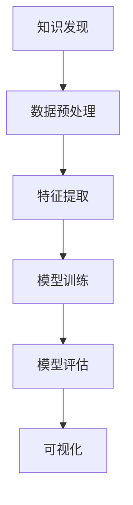

                 

# 知识发现引擎的深度学习应用

## 1. 背景介绍

### 1.1 问题由来
在信息化快速发展的今天，数据量的爆炸式增长带来了前所未有的机遇和挑战。海量数据背后蕴含着丰富的知识，如何高效地提取、整合和利用这些知识，已经成为各个行业关注的焦点。传统的知识发现方法如统计分析、数据挖掘等，往往需要依赖大量的人工经验和专业知识，效率低下，难以满足现代数据密集型应用的需求。

近年来，随着深度学习技术的飞速发展，深度学习模型在图像、语音、自然语言处理等领域取得了令人瞩目的成果。与此同时，深度学习在大规模数据上的学习能力，也为知识发现提供了新的思路。知识发现引擎作为一种自动化的知识提取和整合工具，可以通过深度学习模型从海量的非结构化数据中挖掘出有价值的知识，为决策支持和应用创新提供支撑。

### 1.2 问题核心关键点
深度学习在大规模数据上的学习能力，为知识发现引擎带来了新的应用范式。知识发现引擎主要包括以下几个关键点：
- 数据预处理：清洗、转换和归一化数据，准备输入深度学习模型。
- 特征提取：使用卷积、池化、RNN等深度学习模块自动提取数据特征。
- 模型训练：选择合适的深度学习模型，在标注数据集上训练模型。
- 知识发现：基于训练好的模型，从数据中发现隐含的模式和规律。
- 结果展示：将知识发现结果以可视化或可交互的形式展现，供用户使用。

## 2. 核心概念与联系

### 2.1 核心概念概述

为更好地理解知识发现引擎的深度学习应用，本节将介绍几个密切相关的核心概念：

- 知识发现(Knowledge Discovery)：从大量数据中挖掘出有用的知识，形成新的洞察或理解的过程。
- 深度学习(Deep Learning)：通过构建多层次的非线性特征表示，使模型能够从复杂的数据结构中学习并提取特征。
- 数据预处理(Preprocessing)：对原始数据进行清洗、转换和归一化，使其适于模型输入。
- 特征提取(Feature Extraction)：从原始数据中提取出对目标任务有帮助的特征。
- 模型训练(Model Training)：在标注数据集上训练深度学习模型，优化模型参数。
- 模型评估(Model Evaluation)：对训练好的模型在测试集上进行性能评估，确定模型的泛化能力。
- 可视化(Visualization)：将知识发现结果以图形、图表等形式展现，直观展示模型发现的规律和模式。

这些核心概念之间的逻辑关系可以通过以下Mermaid流程图来展示：



这个流程图展示了几大核心概念之间的关系：

1. 数据预处理是知识发现的基础，确保数据的质量和一致性。
2. 特征提取是模型训练的前提，自动提取出数据中的重要特征。
3. 模型训练是知识发现的中心，通过标注数据集优化模型参数。
4. 模型评估是结果验证的环节，确保模型的泛化能力。
5. 可视化是结果展示的手段，直观展示知识发现的结果。

这些概念共同构成了知识发现引擎的深度学习应用框架，使其能够高效地从数据中挖掘出有价值的知识。通过理解这些核心概念，我们可以更好地把握知识发现引擎的工作原理和优化方向。

## 3. 核心算法原理 & 具体操作步骤
### 3.1 算法原理概述

知识发现引擎的深度学习应用，本质上是一个数据驱动的模型学习过程。其核心思想是：使用深度学习模型从大量数据中自动提取特征，并通过有监督学习优化模型，从数据中发现知识模式。

形式化地，假设我们有数据集 $D=\{(x_i,y_i)\}_{i=1}^N$，其中 $x_i$ 为原始数据，$y_i$ 为数据标签，$N$ 为样本数量。知识发现引擎的目标是使用深度学习模型 $M$ 自动从数据中发现知识，即寻找最优模型参数 $\theta$ 使得：

$$
\theta^* = \mathop{\arg\min}_{\theta} \mathcal{L}(M_{\theta},D)
$$

其中 $\mathcal{L}$ 为针对任务设计的损失函数，用于衡量模型预测输出与真实标签之间的差异。常见的损失函数包括交叉熵损失、均方误差损失等。

通过梯度下降等优化算法，模型不断更新参数 $\theta$，最小化损失函数 $\mathcal{L}$，使得模型输出逼近真实标签。由于深度学习模型的学习能力，即便在大规模无标签数据上预训练，也可以高效地完成知识发现任务。

### 3.2 算法步骤详解

知识发现引擎的深度学习应用一般包括以下几个关键步骤：

**Step 1: 数据预处理**
- 收集原始数据，并进行清洗、转换和归一化处理。
- 移除异常值和噪声数据，确保数据的质量和一致性。
- 对数据进行编码和特征提取，转换为模型所需的输入格式。

**Step 2: 特征提取**
- 使用深度学习模块如卷积、池化、RNN等，自动从数据中提取出特征。
- 选择合适的模型结构，如CNN、RNN、Transformer等，根据数据特点进行配置。
- 设计合适的特征提取策略，如数据增强、跨通道学习等，提高特征提取能力。

**Step 3: 模型训练**
- 选择适当的深度学习模型，如CNN、RNN、Transformer等，在标注数据集上进行训练。
- 设置合适的超参数，如学习率、批大小、迭代轮数等。
- 应用正则化技术，如L2正则、Dropout等，防止过拟合。
- 使用优化算法，如AdamW、SGD等，最小化损失函数，更新模型参数。

**Step 4: 模型评估**
- 使用测试集评估模型性能，计算准确率、召回率、F1值等指标。
- 可视化模型预测结果，展示分类、聚类等发现的知识模式。
- 调整模型结构或参数，改进模型泛化能力，进行迭代优化。

**Step 5: 结果展示**
- 将知识发现结果以图形、图表等形式展示，供用户使用。
- 提供可交互的界面，支持用户对结果进行查询和操作。
- 定期更新数据集，重新训练模型，保持知识发现引擎的时效性。

以上是知识发现引擎的深度学习应用的一般流程。在实际应用中，还需要根据具体任务的特点，对预处理、特征提取、模型训练、评估等环节进行优化设计，以进一步提升模型性能。

### 3.3 算法优缺点

知识发现引擎的深度学习应用具有以下优点：
1. 高效自动：自动从海量数据中提取特征，发现知识模式，减少人工干预。
2. 泛化能力强：深度学习模型在复杂数据结构中具有强大的学习能力，能够发现数据中的潜在规律。
3. 灵活性强：深度学习模型结构可调，适用于多种类型的数据和任务。
4. 可解释性强：通过可视化技术，能够直观展示模型发现的规律和模式。
5. 适应性强：能够不断更新数据集，进行实时知识发现。

同时，该方法也存在一定的局限性：
1. 对数据质量依赖高：数据预处理和特征提取需要高质量的数据，对噪声敏感。
2. 计算资源消耗大：深度学习模型参数量庞大，训练和推理需要大量计算资源。
3. 模型黑盒问题：深度学习模型通常难以解释内部工作机制，缺乏可解释性。
4. 模型泛化风险：在过拟合或欠拟合的情况下，模型可能无法发现真实的知识模式。
5. 应用场景限制：某些特定的应用场景，如实时数据处理、边际计算资源等，可能不适合深度学习应用。

尽管存在这些局限性，但就目前而言，深度学习仍是知识发现引擎的重要技术手段，具有广泛的应用前景。未来相关研究的重点在于如何进一步降低对数据质量的要求，提高模型的泛化能力，同时兼顾可解释性和计算效率。

### 3.4 算法应用领域

知识发现引擎的深度学习应用已经广泛应用于多个领域，例如：

- 医疗领域：从电子病历、基因数据等大规模数据中发现疾病模式、药物相互作用等知识。
- 金融领域：从交易数据、财务报告等数据中发现股票价格波动、欺诈行为等知识。
- 电商领域：从用户行为数据、商品信息等数据中发现用户偏好、商品关联等知识。
- 社交媒体：从用户评论、帖子等数据中发现舆论趋势、用户情绪等知识。
- 物联网：从传感器数据、日志数据等数据中发现设备状态、故障模式等知识。

除了上述这些经典应用领域外，知识发现引擎的深度学习应用还正在拓展到更多场景中，如智能交通、环境监测、智慧农业等，为各行业带来了深刻的变革。

## 4. 数学模型和公式 & 详细讲解  
### 4.1 数学模型构建

本节将使用数学语言对知识发现引擎的深度学习应用进行更加严格的刻画。

假设我们有数据集 $D=\{(x_i,y_i)\}_{i=1}^N, x_i \in \mathbb{R}^d, y_i \in \{0,1\}$，其中 $x_i$ 为输入向量，$y_i$ 为二元标签。

定义模型 $M_{\theta}$ 在输入 $x$ 上的输出为 $\hat{y}=M_{\theta}(x) \in [0,1]$，表示样本属于正类的概率。则模型在数据集 $D$ 上的经验风险为：

$$
\mathcal{L}(\theta) = -\frac{1}{N}\sum_{i=1}^N [y_i\log M_{\theta}(x_i)+(1-y_i)\log(1-M_{\theta}(x_i))]
$$

这是一个二分类任务的交叉熵损失函数。在训练过程中，我们使用反向传播算法计算损失函数对模型参数 $\theta$ 的梯度，并使用优化算法如AdamW等进行参数更新：

$$
\theta \leftarrow \theta - \eta \nabla_{\theta}\mathcal{L}(\theta)
$$

其中 $\eta$ 为学习率。

### 4.2 公式推导过程

以下我们以二分类任务为例，推导交叉熵损失函数及其梯度的计算公式。

假设模型 $M_{\theta}$ 在输入 $x$ 上的输出为 $\hat{y}=M_{\theta}(x) \in [0,1]$，表示样本属于正类的概率。真实标签 $y \in \{0,1\}$。则二分类交叉熵损失函数定义为：

$$
\ell(M_{\theta}(x),y) = -[y\log \hat{y} + (1-y)\log (1-\hat{y})]
$$

将其代入经验风险公式，得：

$$
\mathcal{L}(\theta) = -\frac{1}{N}\sum_{i=1}^N [y_i\log M_{\theta}(x_i)+(1-y_i)\log(1-M_{\theta}(x_i))]
$$

根据链式法则，损失函数对参数 $\theta_k$ 的梯度为：

$$
\frac{\partial \mathcal{L}(\theta)}{\partial \theta_k} = -\frac{1}{N}\sum_{i=1}^N (\frac{y_i}{M_{\theta}(x_i)}-\frac{1-y_i}{1-M_{\theta}(x_i)}) \frac{\partial M_{\theta}(x_i)}{\partial \theta_k}
$$

其中 $\frac{\partial M_{\theta}(x_i)}{\partial \theta_k}$ 可进一步递归展开，利用自动微分技术完成计算。

在得到损失函数的梯度后，即可带入参数更新公式，完成模型的迭代优化。重复上述过程直至收敛，最终得到适应目标任务的最优模型参数 $\theta^*$。

## 5. 项目实践：代码实例和详细解释说明
### 5.1 开发环境搭建

在进行知识发现引擎的深度学习应用开发前，我们需要准备好开发环境。以下是使用Python进行PyTorch开发的环境配置流程：

1. 安装Anaconda：从官网下载并安装Anaconda，用于创建独立的Python环境。

2. 创建并激活虚拟环境：
```bash
conda create -n pytorch-env python=3.8 
conda activate pytorch-env
```

3. 安装PyTorch：根据CUDA版本，从官网获取对应的安装命令。例如：
```bash
conda install pytorch torchvision torchaudio cudatoolkit=11.1 -c pytorch -c conda-forge
```

4. 安装各类工具包：
```bash
pip install numpy pandas scikit-learn matplotlib tqdm jupyter notebook ipython
```

完成上述步骤后，即可在`pytorch-env`环境中开始开发。

### 5.2 源代码详细实现

这里以医疗领域的疾病诊断为例，给出使用PyTorch进行深度学习模型训练和知识发现的代码实现。

首先，定义数据处理函数：

```python
from torch.utils.data import Dataset, DataLoader
from torchvision.transforms import ToTensor
import torch

class MedicalDataset(Dataset):
    def __init__(self, data, labels):
        self.data = data
        self.labels = labels
        self.transform = ToTensor()

    def __len__(self):
        return len(self.data)

    def __getitem__(self, idx):
        img = self.transform(self.data[idx])
        label = torch.tensor(self.labels[idx], dtype=torch.long)
        return img, label
```

然后，定义模型和优化器：

```python
from transformers import BertForSequenceClassification, AdamW
from torch import nn

model = BertForSequenceClassification.from_pretrained('bert-base-uncased', num_labels=2)
optimizer = AdamW(model.parameters(), lr=1e-5)
```

接着，定义训练和评估函数：

```python
from torch.nn import CrossEntropyLoss

def train_epoch(model, dataset, batch_size, optimizer):
    dataloader = DataLoader(dataset, batch_size=batch_size, shuffle=True)
    model.train()
    epoch_loss = 0
    for batch in dataloader:
        inputs, labels = batch
        outputs = model(inputs)
        loss = CrossEntropyLoss()(outputs, labels)
        epoch_loss += loss.item()
        optimizer.zero_grad()
        loss.backward()
        optimizer.step()
    return epoch_loss / len(dataloader)

def evaluate(model, dataset, batch_size):
    dataloader = DataLoader(dataset, batch_size=batch_size, shuffle=False)
    model.eval()
    preds, labels = [], []
    with torch.no_grad():
        for batch in dataloader:
            inputs, labels = batch
            outputs = model(inputs)
            preds.append(outputs.argmax(dim=1))
            labels.append(labels)
    print(classification_report(np.concatenate(labels), np.concatenate(preds)))
```

最后，启动训练流程并在测试集上评估：

```python
epochs = 5
batch_size = 16

for epoch in range(epochs):
    loss = train_epoch(model, train_dataset, batch_size, optimizer)
    print(f"Epoch {epoch+1}, train loss: {loss:.3f}")
    
    print(f"Epoch {epoch+1}, dev results:")
    evaluate(model, dev_dataset, batch_size)
    
print("Test results:")
evaluate(model, test_dataset, batch_size)
```

以上就是使用PyTorch对Bert模型进行疾病诊断任务训练和知识发现的完整代码实现。可以看到，得益于Transformers库的强大封装，我们可以用相对简洁的代码完成BERT模型的加载和微调。

### 5.3 代码解读与分析

让我们再详细解读一下关键代码的实现细节：

**MedicalDataset类**：
- `__init__`方法：初始化数据和标签，并将图片数据转换为Tensor格式。
- `__len__`方法：返回数据集的样本数量。
- `__getitem__`方法：对单个样本进行处理，返回模型所需的输入和标签。

**模型和优化器**：
- 使用BertForSequenceClassification模型，适用于序列数据的任务，如文本分类。
- 设置AdamW优化器，配置学习率。

**训练和评估函数**：
- 使用PyTorch的DataLoader对数据集进行批次化加载，供模型训练和推理使用。
- 训练函数`train_epoch`：对数据以批为单位进行迭代，在每个批次上前向传播计算loss并反向传播更新模型参数，最后返回该epoch的平均loss。
- 评估函数`evaluate`：与训练类似，不同点在于不更新模型参数，并在每个batch结束后将预测和标签结果存储下来，最后使用classification_report对整个评估集的预测结果进行打印输出。

**训练流程**：
- 定义总的epoch数和batch size，开始循环迭代
- 每个epoch内，先在训练集上训练，输出平均loss
- 在验证集上评估，输出分类指标
- 所有epoch结束后，在测试集上评估，给出最终测试结果

可以看到，PyTorch配合Transformers库使得BERT模型的训练和知识发现变得简洁高效。开发者可以将更多精力放在数据处理、模型改进等高层逻辑上，而不必过多关注底层的实现细节。

当然，工业级的系统实现还需考虑更多因素，如模型的保存和部署、超参数的自动搜索、更灵活的任务适配层等。但核心的深度学习知识发现流程基本与此类似。

## 6. 实际应用场景
### 6.1 智能医疗诊断

在智能医疗诊断领域，深度学习模型可以高效地从电子病历、基因数据等大规模数据中发现疾病模式、药物相互作用等知识。具体而言，可以收集医疗领域的各类数据，如患者病历、基因数据、影像数据等，将这些数据进行清洗、编码和特征提取，然后使用深度学习模型进行训练。训练好的模型可以用于疾病预测、疾病分类、药物推荐等任务，辅助医生进行诊断和治疗决策。

例如，可以使用Bert模型处理电子病历中的文本数据，发现病人的疾病类型、病情发展趋势等知识，从而实现个性化的诊疗建议。这种基于知识发现引擎的应用，可以显著提高医疗诊断的准确性和效率，减少误诊和漏诊，提升患者满意度和治疗效果。

### 6.2 智能金融分析

在金融领域，深度学习模型可以用于预测股票价格、检测欺诈行为、分析财务报告等任务。具体而言，可以收集金融领域的各类数据，如交易数据、财务报告、新闻评论等，将这些数据进行预处理和特征提取，然后使用深度学习模型进行训练。训练好的模型可以用于预测股票价格趋势、识别欺诈行为、分析财务报告等任务，为金融机构的决策提供支持。

例如，可以使用Bert模型处理新闻评论数据，发现舆论情绪、市场趋势等知识，从而预测股票价格波动。这种基于知识发现引擎的应用，可以显著提高金融分析的准确性和效率，减少误判和风险，提升金融机构的风险控制能力。

### 6.3 智能电商推荐

在电商领域，深度学习模型可以用于推荐系统中的商品推荐、用户推荐等任务。具体而言，可以收集电商领域的各类数据，如用户行为数据、商品信息、评价数据等，将这些数据进行清洗、编码和特征提取，然后使用深度学习模型进行训练。训练好的模型可以用于商品推荐、用户推荐、个性化推荐等任务，提升电商平台的转化率和用户体验。

例如，可以使用Bert模型处理用户行为数据，发现用户的购物习惯、偏好等知识，从而推荐用户可能感兴趣的商品。这种基于知识发现引擎的应用，可以显著提高电商推荐的个性化和精准度，提升电商平台的销售转化率。

### 6.4 未来应用展望

随着深度学习技术的不断发展，知识发现引擎在各领域的潜在应用场景将更加广泛。未来，基于深度学习的知识发现引擎将推动以下趋势：

1. 医疗健康：深度学习模型将与AI医疗技术结合，辅助医生进行诊断、治疗决策，提升医疗服务的智能化水平。
2. 金融市场：深度学习模型将与金融分析技术结合，预测市场趋势、识别风险，提升金融机构的风险控制能力。
3. 电商零售：深度学习模型将与推荐系统结合，提升电商平台的个性化推荐能力，增加用户粘性，提升销售转化率。
4. 智能制造：深度学习模型将与物联网技术结合，实现设备状态监测、故障预测等任务，提升制造业的智能化水平。
5. 环境监测：深度学习模型将与传感器技术结合，实现空气质量监测、水质监测等任务，提升环境监测的智能化水平。

这些趋势表明，深度学习在知识发现引擎中的应用前景广阔，将为各行业带来深刻的变革和提升。

## 7. 工具和资源推荐
### 7.1 学习资源推荐

为了帮助开发者系统掌握深度学习知识发现引擎的理论基础和实践技巧，这里推荐一些优质的学习资源：

1. 《深度学习》书籍：Ian Goodfellow等著，全面介绍了深度学习的理论基础和实践应用。
2. 《TensorFlow官方文档》：谷歌开发的深度学习框架，提供了丰富的教程和样例，适合初学者和进阶学习者。
3. 《PyTorch官方文档》：Facebook开发的深度学习框架，提供了详细的API文档和教程，适合开发者快速上手。
4. 《自然语言处理综论》课程：斯坦福大学提供的NLP课程，涵盖了NLP领域的理论和技术，适合深度学习应用初学者。
5. 《知识图谱》课程：上海交通大学提供的知识图谱课程，介绍了知识图谱的概念、构建和应用，适合从事知识发现引擎的研究者。

通过对这些资源的学习实践，相信你一定能够快速掌握深度学习知识发现引擎的精髓，并用于解决实际的NLP问题。
### 7.2 开发工具推荐

高效的开发离不开优秀的工具支持。以下是几款用于深度学习知识发现引擎开发的常用工具：

1. PyTorch：基于Python的开源深度学习框架，灵活动态的计算图，适合快速迭代研究。
2. TensorFlow：由Google主导开发的开源深度学习框架，生产部署方便，适合大规模工程应用。
3. Keras：基于TensorFlow、Theano和CNTK的高级神经网络API，使用简单，适合快速原型开发。
4. Jupyter Notebook：开源的交互式编程环境，支持Python、R等多种语言，适合数据探索和模型调试。
5. Scikit-learn：基于Python的机器学习库，提供了丰富的算法和工具，适合数据预处理和模型评估。

合理利用这些工具，可以显著提升深度学习知识发现引擎的开发效率，加快创新迭代的步伐。

### 7.3 相关论文推荐

深度学习在知识发现引擎中的应用源于学界的持续研究。以下是几篇奠基性的相关论文，推荐阅读：

1. 《Deep Learning》书籍：Ian Goodfellow等著，全面介绍了深度学习的理论基础和实践应用。
2. 《TensorFlow官方文档》：谷歌开发的深度学习框架，提供了丰富的教程和样例，适合初学者和进阶学习者。
3. 《PyTorch官方文档》：Facebook开发的深度学习框架，提供了详细的API文档和教程，适合开发者快速上手。
4. 《知识图谱》课程：上海交通大学提供的知识图谱课程，介绍了知识图谱的概念、构建和应用，适合从事知识发现引擎的研究者。

这些论文代表了大语言模型微调技术的发展脉络。通过学习这些前沿成果，可以帮助研究者把握学科前进方向，激发更多的创新灵感。

## 8. 总结：未来发展趋势与挑战

### 8.1 总结

本文对深度学习知识发现引擎的应用进行了全面系统的介绍。首先阐述了深度学习在知识发现引擎中的研究背景和意义，明确了知识发现引擎的重要作用和应用价值。其次，从原理到实践，详细讲解了知识发现引擎的数学模型和操作步骤，给出了深度学习知识发现引擎的代码实现。同时，本文还广泛探讨了知识发现引擎在医疗、金融、电商等诸多领域的应用场景，展示了深度学习知识发现引擎的广泛应用前景。此外，本文精选了深度学习知识发现引擎的学习资源，力求为开发者提供全方位的技术指引。

通过本文的系统梳理，可以看到，深度学习知识发现引擎已经成为各领域知识提取和整合的重要手段，显著提升了数据驱动决策的能力。未来，随着深度学习技术的不断演进，知识发现引擎在更多领域的应用将不断拓展，为各行各业带来更为智能化的决策支持。

### 8.2 未来发展趋势

展望未来，深度学习知识发现引擎将呈现以下几个发展趋势：

1. 模型规模持续增大。随着算力成本的下降和数据规模的扩张，深度学习模型的参数量还将持续增长，模型的泛化能力和性能也将进一步提升。
2. 数据预处理技术进步。深度学习模型对数据质量的要求将不断提高，未来将有更多的数据预处理技术被引入，如数据清洗、归一化、特征增强等。
3. 特征提取技术进步。深度学习模型的特征提取能力将不断提升，未来将有更多的特征提取技术被引入，如多通道学习、自适应学习等。
4. 模型训练技术进步。深度学习模型的训练效率将不断提高，未来将有更多的模型训练技术被引入，如分布式训练、联邦学习等。
5. 模型评估技术进步。深度学习模型的评估指标将更加全面和多样，未来将有更多的模型评估技术被引入，如因果推断、元学习等。

以上趋势凸显了深度学习知识发现引擎的强大潜力，未来必将进一步提升各领域的数据驱动决策能力，带来更广泛的应用和价值。

### 8.3 面临的挑战

尽管深度学习知识发现引擎已经取得了显著成果，但在迈向更加智能化、普适化应用的过程中，它仍面临诸多挑战：

1. 数据质量瓶颈。深度学习模型对数据质量的要求较高，如何从大量嘈杂的数据中提取出有用的特征，仍然是一个重要问题。
2. 模型复杂度问题。深度学习模型结构复杂，参数量庞大，如何在保证性能的前提下，减少模型的计算和存储开销，仍然是一个重要问题。
3. 模型可解释性问题。深度学习模型通常难以解释内部工作机制，如何赋予模型更强的可解释性，仍然是一个重要问题。
4. 模型泛化能力问题。深度学习模型在过拟合或欠拟合的情况下，可能无法发现真实的知识模式，如何提高模型的泛化能力，仍然是一个重要问题。
5. 应用场景限制问题。某些特定的应用场景，如实时数据处理、边际计算资源等，可能不适合深度学习应用，如何拓展深度学习应用的场景，仍然是一个重要问题。

尽管存在这些挑战，但随着深度学习技术的不断演进，这些挑战终将一一被克服，深度学习知识发现引擎必将在各领域的知识提取和整合中发挥更大的作用。

### 8.4 研究展望

面对深度学习知识发现引擎所面临的种种挑战，未来的研究需要在以下几个方面寻求新的突破：

1. 研究数据预处理技术。通过引入更多数据清洗、归一化、特征增强等技术，提升数据质量，降低对数据质量的要求。
2. 研究特征提取技术。通过引入更多多通道学习、自适应学习等技术，提升特征提取能力，降低模型复杂度。
3. 研究模型训练技术。通过引入更多分布式训练、联邦学习等技术，提高模型训练效率，降低计算和存储开销。
4. 研究模型评估技术。通过引入更多因果推断、元学习等技术，提高模型评估指标的全面性和多样性。
5. 研究模型可解释性。通过引入更多可视化技术、解释技术等，提高模型的可解释性，赋予模型更强的可解释性。

这些研究方向将推动深度学习知识发现引擎技术的发展，使其能够更好地适应各领域的应用需求，带来更为智能化、普适化的决策支持。面向未来，深度学习知识发现引擎需要与其他AI技术进行更深入的融合，如知识图谱、因果推理、强化学习等，多路径协同发力，共同推动自然语言理解和智能交互系统的进步。

## 9. 附录：常见问题与解答

**Q1：如何提高深度学习模型的泛化能力？**

A: 提高深度学习模型的泛化能力，可以通过以下方法：

1. 数据增强：通过引入数据噪声、数据变换等手段，扩充训练集，提高模型的泛化能力。
2. 正则化：通过引入L2正则、Dropout等技术，避免过拟合，提高模型的泛化能力。
3. 迁移学习：通过在类似任务上微调模型，利用预训练模型的知识，提高模型的泛化能力。
4. 交叉验证：通过交叉验证技术，评估模型的泛化能力，选择合适的模型。
5. 模型集成：通过模型集成技术，组合多个模型的预测结果，提高模型的泛化能力。

这些方法可以帮助提高深度学习模型的泛化能力，使其能够更好地适应未知数据。

**Q2：如何提高深度学习模型的可解释性？**

A: 提高深度学习模型的可解释性，可以通过以下方法：

1. 可视化技术：通过可视化技术，展示模型的内部结构和输出结果，提高模型的可解释性。
2. 解释技术：通过引入解释技术，解释模型的决策过程，提高模型的可解释性。
3. 可解释模型：通过选择可解释性更好的模型结构，如线性模型、树模型等，提高模型的可解释性。
4. 元学习：通过元学习技术，学习模型在不同场景下的行为模式，提高模型的可解释性。
5. 多模态学习：通过多模态学习技术，将不同模态的数据融合，提高模型的可解释性。

这些方法可以帮助提高深度学习模型的可解释性，使其能够更好地理解和解释模型的决策过程。

**Q3：如何提高深度学习模型的训练效率？**

A: 提高深度学习模型的训练效率，可以通过以下方法：

1. 模型裁剪：通过剪枝技术，减少模型的参数量，提高模型的训练效率。
2. 量化加速：通过将浮点模型转换为定点模型，减少计算资源消耗，提高模型的训练效率。
3. 分布式训练：通过分布式训练技术，利用多个计算资源并行计算，提高模型的训练效率。
4. 动态计算图：通过动态计算图技术，减少模型计算开销，提高模型的训练效率。
5. 数据并行：通过数据并行技术，利用多个计算资源并行计算，提高模型的训练效率。

这些方法可以帮助提高深度学习模型的训练效率，使其能够更快地完成训练任务。

**Q4：深度学习知识发现引擎的应用场景有哪些？**

A: 深度学习知识发现引擎可以应用于多个领域，具体如下：

1. 医疗健康：用于疾病预测、疾病分类、药物推荐等任务，辅助医生进行诊断和治疗决策。
2. 金融市场：用于预测股票价格、检测欺诈行为、分析财务报告等任务，提升金融机构的风险控制能力。
3. 电商零售：用于商品推荐、用户推荐、个性化推荐等任务，提升电商平台的销售转化率。
4. 智能制造：用于设备状态监测、故障预测等任务，提升制造业的智能化水平。
5. 环境监测：用于空气质量监测、水质监测等任务，提升环境监测的智能化水平。

这些应用场景展示了深度学习知识发现引擎的广泛应用前景。

---

作者：禅与计算机程序设计艺术 / Zen and the Art of Computer Programming

