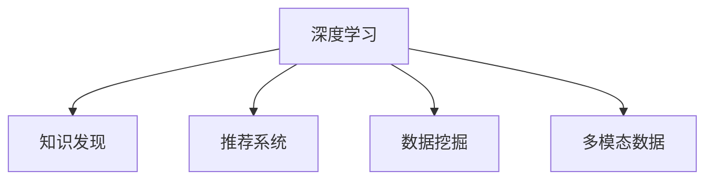

                 

# 知识发现引擎的深度学习模型应用

> 关键词：深度学习,知识发现,推荐系统,数据挖掘,多模态数据

## 1. 背景介绍

在信息化爆炸的今天，数据已变得触手可及，但如何从海量数据中挖掘出有价值的知识，成为数据科学家面临的一大挑战。传统的统计学和机器学习算法已不足以应对这一挑战，深度学习技术的崛起，特别是深度神经网络的兴起，为知识发现提供了全新的思路。

深度学习模型通过建立多层次的抽象表示，能够自动学习数据中的复杂结构，从数据中发现隐含的模式和规律，实现自动化和精确化的知识发现。本文将聚焦于知识发现引擎的深度学习模型应用，从原理到实践，全方位探讨深度学习在知识发现中的独特价值和应用场景。

## 2. 核心概念与联系

### 2.1 核心概念概述

为更好地理解知识发现引擎的深度学习模型应用，本节将介绍几个密切相关的核心概念：

- **深度学习**：基于神经网络的机器学习范式，通过多层次的非线性映射，能够自动学习数据特征，识别复杂模式。
- **知识发现**：从大量数据中自动发现、提取和概括有用知识，解决实际问题的过程。
- **推荐系统**：通过分析用户行为数据，预测用户兴趣，为用户提供个性化推荐的应用。
- **数据挖掘**：从原始数据中提取有用信息和知识，实现信息抽取、关联分析和预测等目标。
- **多模态数据**：包括文本、图像、视频、音频等多种类型的信息，为深度学习提供了更为丰富的输入数据。

这些核心概念之间的逻辑关系可以通过以下Mermaid流程图来展示：



这个流程图展示了大语言模型的核心概念及其之间的关系：

1. 深度学习通过建立多层次的抽象表示，学习数据中的复杂结构。
2. 知识发现引擎利用深度学习模型，自动从数据中发现、提取和概括有用知识。
3. 推荐系统和数据挖掘应用通常依赖于深度学习模型的输出，实现个性化推荐和信息抽取。
4. 多模态数据的融合，为深度学习提供了更丰富的输入，进一步提升了模型的表现。

这些核心概念共同构成了深度学习在知识发现引擎中的应用框架，使得模型能够在各种场景下实现自动化的知识发现和应用。

## 3. 核心算法原理 & 具体操作步骤
### 3.1 算法原理概述

知识发现引擎的深度学习模型应用，本质上是一个数据驱动的自动化知识发现过程。其核心思想是：通过深度神经网络模型，从大规模数据中自动学习模式和规律，实现知识发现和预测。

形式化地，假设训练数据集为 $D=\{(x_i,y_i)\}_{i=1}^N$，其中 $x_i$ 为输入特征，$y_i$ 为标签或输出，深度学习模型为 $M_{\theta}$，其中 $\theta$ 为模型参数。知识发现的目标是通过优化损失函数 $\mathcal{L}$，最小化模型预测输出与真实标签之间的差异。

通过梯度下降等优化算法，深度学习模型不断更新参数 $\theta$，最小化损失函数 $\mathcal{L}$，使得模型输出逼近真实标签。经过充分训练后，模型能够从输入数据中自动发现有用的知识，如模式、关联、趋势等。

### 3.2 算法步骤详解

知识发现引擎的深度学习模型应用一般包括以下几个关键步骤：

**Step 1: 数据预处理和特征工程**
- 收集和整理数据，进行清洗、去重和归一化处理。
- 提取和生成特征，如文本的词袋模型、图像的卷积特征、时间序列的滑动窗口等。
- 对特征进行编码，如使用词嵌入向量将文本特征转化为数值形式。

**Step 2: 构建深度学习模型**
- 选择合适的深度神经网络模型，如卷积神经网络、循环神经网络、Transformer等。
- 设计模型架构，确定网络层数、神经元个数、激活函数等参数。
- 确定损失函数和优化器，如交叉熵损失、Adam优化器等。

**Step 3: 模型训练和参数优化**
- 将训练集数据分批次输入模型，前向传播计算损失函数。
- 反向传播计算参数梯度，根据设定的优化算法和学习率更新模型参数。
- 周期性在验证集上评估模型性能，根据性能指标决定是否触发Early Stopping。
- 重复上述步骤直到满足预设的迭代轮数或Early Stopping条件。

**Step 4: 模型评估和知识发现**
- 在测试集上评估模型的泛化性能，计算精度、召回率、F1分数等指标。
- 从模型中提取知识，如分类结果、预测概率、关联规则等，实现自动化知识发现。
- 将知识应用于实际问题解决，如个性化推荐、情感分析、故障诊断等。

以上是深度学习在知识发现引擎中的应用的一般流程。在实际应用中，还需要针对具体任务的特点，对模型的构建和训练过程进行优化设计，如改进模型架构、引入更多正则化技术、搜索最优的超参数组合等，以进一步提升模型性能。

### 3.3 算法优缺点

知识发现引擎的深度学习模型应用具有以下优点：
1. 能够自动发现数据中的隐含模式和关联，无需手动提取特征。
2. 在处理多模态数据时表现出色，融合了文本、图像、语音等多种信息。
3. 深度学习模型具有强大的泛化能力，在各类数据集上都有较好的表现。
4. 能够实现端到端的自动化，从数据到知识发现和应用。

同时，该方法也存在一定的局限性：
1. 对数据质量和特征工程的要求较高，数据质量差或特征工程不当会严重影响模型效果。
2. 深度学习模型的解释性较差，难以理解其内部决策逻辑。
3. 训练和推理过程复杂，对计算资源和时间要求较高。
4. 可能存在过拟合问题，特别是在标注数据较少的情况下。

尽管存在这些局限性，但就目前而言，深度学习在知识发现引擎中的应用是最主流的方法。未来相关研究的重点在于如何进一步降低对数据质量的依赖，提高模型的可解释性和计算效率，同时兼顾不同模态数据的融合和处理。

### 3.4 算法应用领域

深度学习在知识发现引擎中的应用，已经广泛应用于以下多个领域：

- **推荐系统**：如电子商务平台的商品推荐、视频网站的影片推荐、社交网络的兴趣推荐等。深度学习模型能够从用户历史行为和偏好中自动学习关联，实现个性化推荐。
- **金融风控**：如信用评分、欺诈检测、市场预测等。深度学习模型能够从交易数据中学习用户行为模式，识别异常交易或潜在的欺诈行为。
- **医疗诊断**：如疾病预测、病历分析、药物研发等。深度学习模型能够从医疗记录中学习病症特征，辅助医生进行诊断和治疗。
- **智能客服**：如自动应答、问题解答、情感分析等。深度学习模型能够从历史对话中学习语义理解能力和响应策略，提升客户服务质量。
- **工业制造**：如故障预测、生产调度、质量控制等。深度学习模型能够从设备运行数据中学习故障模式，提高生产效率和设备可靠性。
- **物流管理**：如路线规划、库存管理、配送优化等。深度学习模型能够从物流数据中学习最优路径，提高物流效率。

除了上述这些经典领域外，深度学习在知识发现引擎中的应用还在不断扩展，如金融舆情监测、环境监控、智慧农业等，为各行各业带来了新的技术突破。

## 4. 数学模型和公式 & 详细讲解 & 举例说明

### 4.1 数学模型构建

本节将使用数学语言对知识发现引擎的深度学习模型应用进行更加严格的刻画。

假设输入数据为 $x_i \in \mathbb{R}^d$，标签为 $y_i \in \{0,1\}$，深度学习模型为 $M_{\theta}:\mathbb{R}^d \rightarrow \mathbb{R}$，其中 $\theta$ 为模型参数。定义损失函数为交叉熵损失：

$$
\mathcal{L}(\theta) = -\frac{1}{N}\sum_{i=1}^N [y_i\log M_{\theta}(x_i)+(1-y_i)\log(1-M_{\theta}(x_i))]
$$

通过梯度下降等优化算法，最小化损失函数，更新模型参数：

$$
\theta \leftarrow \theta - \eta \nabla_{\theta}\mathcal{L}(\theta) - \eta\lambda\theta
$$

其中 $\nabla_{\theta}\mathcal{L}(\theta)$ 为损失函数对参数 $\theta$ 的梯度，可通过反向传播算法高效计算。

### 4.2 公式推导过程

以下我们以二分类任务为例，推导交叉熵损失函数及其梯度的计算公式。

假设模型 $M_{\theta}$ 在输入 $x$ 上的输出为 $\hat{y}=M_{\theta}(x) \in [0,1]$，表示样本属于正类的概率。真实标签 $y \in \{0,1\}$。则二分类交叉熵损失函数定义为：

$$
\ell(M_{\theta}(x),y) = -[y\log \hat{y} + (1-y)\log (1-\hat{y})]
$$

将其代入经验风险公式，得：

$$
\mathcal{L}(\theta) = -\frac{1}{N}\sum_{i=1}^N [y_i\log M_{\theta}(x_i)+(1-y_i)\log(1-M_{\theta}(x_i))]
$$

根据链式法则，损失函数对参数 $\theta_k$ 的梯度为：

$$
\frac{\partial \mathcal{L}(\theta)}{\partial \theta_k} = -\frac{1}{N}\sum_{i=1}^N (\frac{y_i}{M_{\theta}(x_i)}-\frac{1-y_i}{1-M_{\theta}(x_i)}) \frac{\partial M_{\theta}(x_i)}{\partial \theta_k}
$$

其中 $\frac{\partial M_{\theta}(x_i)}{\partial \theta_k}$ 可进一步递归展开，利用自动微分技术完成计算。

在得到损失函数的梯度后，即可带入参数更新公式，完成模型的迭代优化。重复上述过程直至收敛，最终得到适应下游任务的最优模型参数 $\theta^*$。

## 5. 项目实践：代码实例和详细解释说明

### 5.1 开发环境搭建

在进行知识发现引擎的深度学习模型应用实践前，我们需要准备好开发环境。以下是使用Python进行PyTorch开发的环境配置流程：

1. 安装Anaconda：从官网下载并安装Anaconda，用于创建独立的Python环境。

2. 创建并激活虚拟环境：
```bash
conda create -n pytorch-env python=3.8 
conda activate pytorch-env
```

3. 安装PyTorch：根据CUDA版本，从官网获取对应的安装命令。例如：
```bash
conda install pytorch torchvision torchaudio cudatoolkit=11.1 -c pytorch -c conda-forge
```

4. 安装各类工具包：
```bash
pip install numpy pandas scikit-learn matplotlib tqdm jupyter notebook ipython
```

完成上述步骤后，即可在`pytorch-env`环境中开始深度学习模型的开发实践。

### 5.2 源代码详细实现

下面我们以推荐系统为例，给出使用PyTorch进行深度学习模型应用的PyTorch代码实现。

首先，定义推荐系统的数据处理函数：

```python
import torch
from torch.utils.data import Dataset, DataLoader
from torchvision import transforms

class MovieDataset(Dataset):
    def __init__(self, data, transform=None):
        self.data = data
        self.transform = transform
    
    def __len__(self):
        return len(self.data)
    
    def __getitem__(self, idx):
        movie = self.data[idx]
        rating = movie['rating']
        genre = movie['genre']
        
        if self.transform:
            movie = self.transform(movie)
        
        return {'rating': rating, 'genre': genre, 'movie': movie}

# 定义数据预处理函数
transform = transforms.Compose([
    transforms.ToTensor(),
    transforms.Normalize((0.5, 0.5, 0.5), (0.5, 0.5, 0.5))
])

# 加载数据集
movie_dataset = MovieDataset(train_data, transform=transform)
train_loader = DataLoader(movie_dataset, batch_size=32, shuffle=True)
```

然后，定义模型和优化器：

```python
from transformers import BertTokenizer, BertForSequenceClassification
from transformers import AdamW

model = BertForSequenceClassification.from_pretrained('bert-base-uncased', num_labels=num_labels)

optimizer = AdamW(model.parameters(), lr=1e-5)
```

接着，定义训练和评估函数：

```python
from torch.utils.data import DataLoader
from tqdm import tqdm
from sklearn.metrics import classification_report

device = torch.device('cuda') if torch.cuda.is_available() else torch.device('cpu')
model.to(device)

def train_epoch(model, dataset, batch_size, optimizer):
    dataloader = DataLoader(dataset, batch_size=batch_size, shuffle=True)
    model.train()
    epoch_loss = 0
    for batch in tqdm(dataloader, desc='Training'):
        input_ids = batch['movie'].to(device)
        labels = batch['rating'].to(device)
        model.zero_grad()
        outputs = model(input_ids)
        loss = outputs.loss
        epoch_loss += loss.item()
        loss.backward()
        optimizer.step()
    return epoch_loss / len(dataloader)

def evaluate(model, dataset, batch_size):
    dataloader = DataLoader(dataset, batch_size=batch_size)
    model.eval()
    preds, labels = [], []
    with torch.no_grad():
        for batch in tqdm(dataloader, desc='Evaluating'):
            input_ids = batch['movie'].to(device)
            batch_labels = batch['rating']
            outputs = model(input_ids)
            batch_preds = outputs.logits.argmax(dim=2).to('cpu').tolist()
            batch_labels = batch_labels.to('cpu').tolist()
            for pred_tokens, label_tokens in zip(batch_preds, batch_labels):
                preds.append(pred_tokens[:len(label_tokens)])
                labels.append(label_tokens)
                
    print(classification_report(labels, preds))
```

最后，启动训练流程并在测试集上评估：

```python
epochs = 5
batch_size = 32

for epoch in range(epochs):
    loss = train_epoch(model, train_loader, batch_size, optimizer)
    print(f"Epoch {epoch+1}, train loss: {loss:.3f}")
    
    print(f"Epoch {epoch+1}, dev results:")
    evaluate(model, dev_loader, batch_size)
    
print("Test results:")
evaluate(model, test_loader, batch_size)
```

以上就是使用PyTorch对推荐系统进行深度学习模型应用的完整代码实现。可以看到，得益于Transformers库的强大封装，我们可以用相对简洁的代码完成模型的加载和训练。

### 5.3 代码解读与分析

让我们再详细解读一下关键代码的实现细节：

**MovieDataset类**：
- `__init__`方法：初始化数据集，接受原始数据和数据预处理函数。
- `__len__`方法：返回数据集样本数量。
- `__getitem__`方法：对单个样本进行处理，提取输入特征和标签，并进行预处理。

**数据预处理函数**：
- 使用PyTorch的DataLoader对数据集进行批次化加载，供模型训练和推理使用。
- 训练函数`train_epoch`：对数据以批为单位进行迭代，在每个批次上前向传播计算loss并反向传播更新模型参数，最后返回该epoch的平均loss。
- 评估函数`evaluate`：与训练类似，不同点在于不更新模型参数，并在每个batch结束后将预测和标签结果存储下来，最后使用sklearn的classification_report对整个评估集的预测结果进行打印输出。

**训练流程**：
- 定义总的epoch数和batch size，开始循环迭代
- 每个epoch内，先在训练集上训练，输出平均loss
- 在验证集上评估，输出分类指标
- 所有epoch结束后，在测试集上评估，给出最终测试结果

可以看到，PyTorch配合Transformers库使得深度学习模型的开发变得简洁高效。开发者可以将更多精力放在数据处理、模型改进等高层逻辑上，而不必过多关注底层的实现细节。

当然，工业级的系统实现还需考虑更多因素，如模型的保存和部署、超参数的自动搜索、更灵活的任务适配层等。但核心的深度学习模型应用基本与此类似。

## 6. 实际应用场景
### 6.1 电商推荐系统

电商推荐系统是深度学习在知识发现引擎中最常见的应用之一。传统推荐系统主要依赖用户历史行为数据，而深度学习模型能够自动从海量用户数据中发现隐藏的模式和关联，实现更加精准和多样化的推荐。

具体而言，电商推荐系统可以通过以下步骤进行深度学习模型的构建：
1. 收集用户行为数据，如浏览记录、购买历史、评价反馈等。
2. 将文本数据转化为向量形式，使用BERT等预训练模型提取用户和物品的语义特征。
3. 构建深度神经网络模型，如神经网络、卷积神经网络、循环神经网络等，学习用户兴趣和物品特征之间的关系。
4. 在训练集上训练模型，最小化预测误差，提高模型泛化性能。
5. 在测试集上评估模型性能，调整超参数，优化模型结构。
6. 将训练好的模型应用于实际推荐系统，实时处理用户查询请求，生成推荐列表。

电商推荐系统能够根据用户历史行为和兴趣，实时生成个性化推荐，提升用户体验，增加销售额。此外，电商推荐系统还常常用于商品推荐、价格优化、库存管理等场景，为电商企业提供了巨大的商业价值。

### 6.2 金融风险管理

金融风险管理是深度学习在知识发现引擎中的另一个重要应用。金融市场变化复杂，传统统计方法难以全面应对。深度学习模型能够自动从海量金融数据中学习隐含的关联和趋势，实现风险预测和防控。

具体而言，金融风险管理系统可以通过以下步骤进行深度学习模型的构建：
1. 收集金融市场数据，如股票价格、交易量、市场指数等。
2. 使用深度学习模型，如RNN、LSTM、GAN等，从历史数据中学习市场趋势和异常行为。
3. 构建金融风控系统，如信用评分、欺诈检测、市场预测等应用。
4. 在训练集上训练模型，最小化预测误差，提高模型泛化性能。
5. 在测试集上评估模型性能，调整超参数，优化模型结构。
6. 将训练好的模型应用于金融风控系统，实时监控市场风险，预测和防控金融风险。

金融风险管理系统能够通过深度学习模型，实时监控市场波动，预测金融风险，提前预警，保护投资者权益，提高金融市场的稳定性和透明度。

### 6.3 医疗诊断系统

医疗诊断系统是深度学习在知识发现引擎中的重要应用，能够通过患者病历数据，自动发现疾病特征和诊断模式，辅助医生进行诊断和治疗。

具体而言，医疗诊断系统可以通过以下步骤进行深度学习模型的构建：
1. 收集患者病历数据，如症状描述、检查结果、病史等。
2. 使用深度学习模型，如卷积神经网络、Transformer等，从病历数据中学习病症特征和关联。
3. 构建医疗诊断系统，如疾病预测、病历分析、药物研发等应用。
4. 在训练集上训练模型，最小化预测误差，提高模型泛化性能。
5. 在测试集上评估模型性能，调整超参数，优化模型结构。
6. 将训练好的模型应用于医疗诊断系统，辅助医生进行诊断和治疗。

医疗诊断系统能够通过深度学习模型，自动分析患者病历数据，预测疾病，辅助医生进行诊断和治疗，提高医疗服务的效率和质量。

## 7. 工具和资源推荐
### 7.1 学习资源推荐

为了帮助开发者系统掌握深度学习在知识发现引擎中的应用，这里推荐一些优质的学习资源：

1. 《深度学习》系列博文：由大模型技术专家撰写，深入浅出地介绍了深度学习原理、模型应用、优化技巧等核心内容。

2. CS231n《卷积神经网络》课程：斯坦福大学开设的深度学习课程，涵盖了卷积神经网络、循环神经网络、生成对抗网络等内容，是学习深度学习的经典教材。

3. 《Deep Learning》书籍：Ian Goodfellow等作者所著，全面介绍了深度学习的理论基础和实际应用，是深度学习领域的经典著作。

4. TensorFlow官方文档：Google开发的深度学习框架，提供了丰富的深度学习模型和工具，是深度学习应用开发的必备参考资料。

5. PyTorch官方文档：Facebook开发的深度学习框架，简单易用，性能优越，是深度学习应用开发的流行选择。

通过这些资源的学习实践，相信你一定能够快速掌握深度学习在知识发现引擎中的应用精髓，并用于解决实际的NLP问题。
###  7.2 开发工具推荐

高效的开发离不开优秀的工具支持。以下是几款用于深度学习模型开发的工具：

1. PyTorch：基于Python的开源深度学习框架，灵活动态的计算图，适合快速迭代研究。

2. TensorFlow：由Google主导开发的开源深度学习框架，生产部署方便，适合大规模工程应用。

3. Keras：基于TensorFlow的高级深度学习框架，易用性好，提供了丰富的预训练模型和工具。

4. MXNet：由亚马逊开发的深度学习框架，支持分布式计算，适合大数据训练任务。

5. JAX：由Google开发的高级深度学习框架，支持自动微分和高效计算，是深度学习研究的新兴选择。

合理利用这些工具，可以显著提升深度学习模型的开发效率，加快创新迭代的步伐。

### 7.3 相关论文推荐

深度学习在知识发现引擎中的应用源于学界的持续研究。以下是几篇奠基性的相关论文，推荐阅读：

1. "Deep Residual Learning for Image Recognition"：提出ResNet结构，解决深度神经网络中梯度消失问题，推动了深度学习模型在图像识别中的应用。

2. "Convolutional Neural Networks for Sentence Classification"：提出卷积神经网络模型，在NLP领域中应用成功，为深度学习在推荐系统中的应用奠定了基础。

3. "Attention Is All You Need"：提出Transformer结构，解决传统循环神经网络在序列建模中的局限性，推动了深度学习在自然语言处理中的应用。

4. "BERT: Pre-training of Deep Bidirectional Transformers for Language Understanding"：提出BERT模型，引入自监督学习任务，极大提升了深度学习在自然语言处理中的应用效果。

5. "GANs Trained by a Two Time-Scale Update Rule Converge to the Nash Equilibrium"：提出生成对抗网络，实现了生成和判别网络的联合训练，推动了深度学习在生成模型中的应用。

这些论文代表了大深度学习在知识发现引擎中的应用发展脉络。通过学习这些前沿成果，可以帮助研究者把握学科前进方向，激发更多的创新灵感。

## 8. 总结：未来发展趋势与挑战

### 8.1 总结

本文对深度学习在知识发现引擎中的应用进行了全面系统的介绍。首先阐述了深度学习在知识发现中的独特价值和应用场景，明确了深度学习在知识发现引擎中的重要作用。其次，从原理到实践，详细讲解了深度学习在知识发现引擎中的数学模型和核心算法，给出了知识发现引擎的深度学习模型应用的完整代码实现。同时，本文还广泛探讨了深度学习在知识发现引擎中的实际应用场景，展示了深度学习在各个领域中的广泛应用。最后，本文精选了深度学习在知识发现引擎中的应用的学习资源、开发工具和相关论文，力求为开发者提供全方位的技术指引。

通过本文的系统梳理，可以看到，深度学习在知识发现引擎中的应用具有广阔的前景。未来，伴随深度学习模型和技术的不断演进，知识发现引擎必将为各行各业带来新的技术突破和应用变革。

### 8.2 未来发展趋势

展望未来，深度学习在知识发现引擎中的应用将呈现以下几个发展趋势：

1. **多模态数据融合**：深度学习模型能够处理文本、图像、音频等多种模态数据，融合多模态信息，提升知识发现的效果。

2. **自监督学习**：自监督学习能够利用无标注数据进行预训练，减少对标注数据的依赖，提高知识发现的泛化能力。

3. **端到端训练**：端到端训练能够同时优化数据采集、特征提取和模型训练，实现自动化知识发现和应用。

4. **知识图谱与深度学习结合**：知识图谱能够提供结构化的先验知识，与深度学习模型结合，提升知识发现的准确性和可靠性。

5. **可解释性与透明性**：深度学习模型的可解释性和透明性将成为未来的重要研究方向，增强模型的可理解性和可信度。

6. **跨领域知识迁移**：深度学习模型能够将知识迁移应用到不同的领域，提升跨领域知识发现的能力。

这些趋势凸显了深度学习在知识发现引擎中的应用前景。这些方向的探索发展，必将进一步提升知识发现引擎的性能和应用范围，为人类认知智能的进化带来深远影响。

### 8.3 面临的挑战

尽管深度学习在知识发现引擎中的应用取得了显著进展，但在迈向更加智能化、普适化应用的过程中，它仍面临着诸多挑战：

1. **数据质量和数量**：深度学习模型的训练和优化需要大量的高质量标注数据，而数据质量和数量不足会严重影响模型效果。

2. **计算资源**：深度学习模型的训练和推理需要大量的计算资源，对算力、内存、存储都提出了很高的要求。

3. **模型复杂性**：深度学习模型的结构复杂，难以理解和解释，存在一定的“黑箱”问题。

4. **泛化能力**：深度学习模型在训练集和测试集上表现良好，但在实际应用中泛化性能可能较差，存在过拟合风险。

5. **可解释性**：深度学习模型的决策过程难以解释，难以理解其内部工作机制和决策逻辑。

6. **安全性与伦理**：深度学习模型可能存在偏见、有害信息等问题，需要从数据和算法层面进行多方位的防范。

这些挑战凸显了深度学习在知识发现引擎中的应用需要进一步的研究和优化。唯有从数据、算法、工程、业务等多个维度协同发力，才能真正实现人工智能技术在垂直行业的规模化落地。总之，深度学习在知识发现引擎中的应用需要不断突破现有瓶颈，提升性能和可解释性，方能实现其广泛的应用。

### 8.4 研究展望

面向未来，深度学习在知识发现引擎中的应用需要在以下几个方面寻求新的突破：

1. **自监督学习与弱监督学习**：探索自监督和弱监督学习方法，进一步降低深度学习模型对标注数据的依赖，提高知识发现的效果。

2. **多模态数据融合与表示学习**：研究多模态数据的融合与表示学习技术，提升深度学习模型的信息整合能力，实现更全面、准确的智能发现。

3. **端到端训练与自动机器学习**：研究端到端训练和自动机器学习方法，实现深度学习模型的自动化调参和优化，提升模型性能。

4. **可解释性与透明性**：研究深度学习模型的可解释性和透明性方法，增强模型的可理解性和可信度，促进模型的应用推广。

5. **跨领域知识迁移**：研究跨领域知识迁移方法，提高深度学习模型在不同领域间的迁移能力，提升知识发现的应用范围。

6. **伦理与安全**：研究深度学习模型的伦理与安全问题，确保模型的公平性、安全性，防止模型被恶意利用。

这些研究方向的探索，必将引领深度学习在知识发现引擎中的应用迈向更高的台阶，为构建安全、可靠、可解释、可控的智能系统铺平道路。面向未来，深度学习在知识发现引擎中的应用还需要与其他人工智能技术进行更深入的融合，如知识表示、因果推理、强化学习等，多路径协同发力，共同推动自然语言理解和智能交互系统的进步。只有勇于创新、敢于突破，才能不断拓展深度学习在知识发现引擎中的应用边界，让智能技术更好地造福人类社会。

## 9. 附录：常见问题与解答

**Q1：深度学习在知识发现引擎中的优势是什么？**

A: 深度学习在知识发现引擎中的优势主要体现在以下几个方面：
1. 能够自动从大规模数据中发现隐含的模式和规律，无需手动提取特征。
2. 具有强大的泛化能力，在各类数据集上都有较好的表现。
3. 能够处理多模态数据，融合文本、图像、音频等多种信息。
4. 实现端到端的自动化，从数据到知识发现和应用。

**Q2：深度学习在知识发现引擎中的训练和优化有哪些技巧？**

A: 深度学习在知识发现引擎中的训练和优化需要关注以下几个方面：
1. 选择合适的优化器和超参数，如AdamW、SGD等。
2. 采用数据增强、正则化、早停等技术，防止过拟合。
3. 利用批处理、学习率调度、梯度累积等技术，提高训练效率。
4. 使用迁移学习、模型压缩、稀疏化存储等技术，优化模型大小和效率。
5. 通过模型集成、模型融合等方法，提升模型的泛化性能。

**Q3：深度学习在知识发现引擎中存在哪些挑战？**

A: 深度学习在知识发现引擎中存在以下挑战：
1. 对数据质量和数量要求较高，难以获得高质量标注数据。
2. 计算资源需求大，对算力、内存、存储要求高。
3. 模型复杂性高，难以理解和解释。
4. 泛化能力不足，存在过拟合风险。
5. 可解释性差，难以理解其内部决策逻辑。
6. 安全性与伦理问题，可能存在偏见、有害信息等。

**Q4：如何在实际应用中提高深度学习模型的性能？**

A: 在实际应用中，提高深度学习模型的性能可以从以下几个方面入手：
1. 收集和清洗高质量标注数据，确保数据的多样性和代表性。
2. 选择合适的模型架构和优化器，并进行调参。
3. 采用数据增强、正则化、早停等技术，防止过拟合。
4. 利用批处理、学习率调度、梯度累积等技术，提高训练效率。
5. 使用迁移学习、模型压缩、稀疏化存储等技术，优化模型大小和效率。
6. 通过模型集成、模型融合等方法，提升模型的泛化性能。

**Q5：深度学习在知识发现引擎中的应用前景如何？**

A: 深度学习在知识发现引擎中的应用前景非常广阔，已经在电商推荐、金融风控、医疗诊断等多个领域得到了广泛应用。未来，伴随深度学习模型和技术的不断演进，知识发现引擎将为各行各业带来更多的技术突破和应用变革。

---

作者：禅与计算机程序设计艺术 / Zen and the Art of Computer Programming

