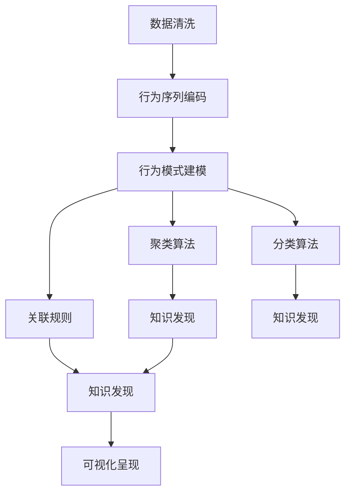

                 

## 1. 背景介绍

### 1.1 问题由来

在数字化时代，企业数据爆炸式增长，其中蕴含着大量有价值的信息。然而，传统数据查询方式往往难以深入挖掘数据的内在联系和潜在价值。知识发现引擎(Knowledge Discovery Engine, KDE)正是为了解决这一问题而诞生。KDE通过分析用户行为轨迹，从数据中提取知识和模式，从而辅助决策，提升业务效率。

用户行为轨迹(User Behavior Trajectory, UBT)指的是用户在信息系统中的操作序列，如浏览网页、点击按钮、填写表单等。通过对这些行为序列的分析，可以揭示用户的真实需求、行为模式、偏好等信息，为企业决策提供有力支持。但如何高效、准确地分析这些轨迹，从中提取有价值的信息，是知识发现引擎面临的核心挑战。

### 1.2 问题核心关键点

为了高效分析用户行为轨迹，知识发现引擎的核心关键点包括：

- **行为轨迹预处理**：对原始数据进行清洗、归一化、编码等预处理，形成适合分析的轨迹数据。
- **行为模式建模**：利用统计学、机器学习等方法，对用户行为进行建模，发现用户行为模式。
- **知识发现算法**：通过聚类、分类、关联规则等算法，从行为模式中提取知识和模式，为业务决策提供依据。
- **可视化呈现**：将分析结果以图表、仪表盘等形式呈现，增强决策可视化和理解性。

本文将详细介绍知识发现引擎的核心算法和具体操作步骤，并通过一个具体的案例分析，展示如何利用知识发现引擎实现对用户行为轨迹的有效分析。

## 2. 核心概念与联系

### 2.1 核心概念概述

为更好地理解知识发现引擎的用户行为轨迹分析方法，本节将介绍几个密切相关的核心概念：

- **知识发现(Knowledge Discovery, KD)**：指从大规模数据中提取有价值的模式、知识、规律的过程。KD包括数据清洗、数据预处理、数据挖掘、模式识别、结果解释等环节。

- **用户行为轨迹(User Behavior Trajectory, UBT)**：指用户在信息系统中的操作序列，如浏览网页、点击按钮、填写表单等。UBT能够反映用户的行为模式和偏好。

- **行为模式建模(Behavioral Modeling)**：指对用户行为序列进行分析，建立行为模型，用于预测和解释用户行为。

- **聚类算法(Clustering)**：指将相似的数据点划分为一组，用于发现数据中的自然分组和聚类结构。

- **分类算法(Classification)**：指将数据分为不同的类别，用于预测未知数据所属的类别。

- **关联规则(Association Rule)**：指描述数据集中不同属性之间的关联关系，用于发现数据集中的潜在联系。

- **可视化(Visualization)**：指将分析结果以图表、仪表盘等形式呈现，增强决策可视化和理解性。

这些核心概念之间的逻辑关系可以通过以下Mermaid流程图来展示：



这个流程图展示的知识发现引擎的核心概念及其之间的关系：

1. 数据清洗：对原始数据进行清洗、归一化、编码等预处理，形成适合分析的轨迹数据。
2. 行为序列编码：将用户行为序列转化为数值表示，方便后续的建模分析。
3. 行为模式建模：利用统计学、机器学习等方法，对用户行为进行建模，发现用户行为模式。
4. 聚类算法：通过聚类算法发现数据中的自然分组和聚类结构。
5. 分类算法：将数据分为不同的类别，用于预测未知数据所属的类别。
6. 关联规则：描述数据集中不同属性之间的关联关系，用于发现数据集中的潜在联系。
7. 知识发现：通过聚类、分类、关联规则等算法，从行为模式中提取知识和模式。
8. 可视化呈现：将分析结果以图表、仪表盘等形式呈现，增强决策可视化和理解性。

这些核心概念共同构成了知识发现引擎的用户行为轨迹分析框架，使其能够在各种场景下发挥强大的数据分析能力。通过理解这些核心概念，我们可以更好地把握知识发现引擎的工作原理和优化方向。

## 3. 核心算法原理 & 具体操作步骤
### 3.1 算法原理概述

知识发现引擎的用户行为轨迹分析方法，本质上是利用统计学和机器学习的方法，对用户行为序列进行建模、分析和解释。其核心思想是：通过对用户行为序列的统计和计算，发现其中的行为模式和潜在知识，从而辅助决策和业务优化。

形式化地，假设用户行为轨迹序列为 $T=\{x_1,x_2,\cdots,x_n\}$，其中 $x_i$ 表示用户在第 $i$ 个时间点上的行为。记行为序列的长度为 $N$。知识发现引擎的目标是：

1. 对行为序列进行预处理，转化为数值表示 $X$。
2. 利用统计学或机器学习的方法，对行为序列 $X$ 进行建模，发现其中的行为模式。
3. 从行为模式中提取知识和模式，用于业务决策和优化。

### 3.2 算法步骤详解

知识发现引擎的用户行为轨迹分析一般包括以下几个关键步骤：

**Step 1: 行为序列预处理**

1. **行为编码**：将用户行为序列转换为数值表示 $X$，可以使用one-hot编码、二进制编码、数值编码等方法。例如，将用户点击网页的行为编码为向量 $[1,0,0,\cdots,0]$，点击按钮的行为编码为向量 $[0,1,0,\cdots,0]$。

2. **序列归一化**：对行为编码后的序列进行归一化，使其具有相同的尺度和分布。例如，将行为序列进行z-score标准化或min-max归一化，使得每个特征值都在0到1之间。

3. **缺失值处理**：对缺失值进行填充或删除，以避免对后续分析造成影响。例如，可以使用均值填充、插值法填充或删除含有缺失值的样本。

**Step 2: 行为模式建模**

1. **聚类算法**：通过聚类算法将相似的行为序列分为一组，发现数据中的自然分组和聚类结构。例如，K-means算法、层次聚类算法、DBSCAN算法等。

2. **分类算法**：通过分类算法将用户行为分为不同的类别，用于预测未知数据所属的类别。例如，逻辑回归、支持向量机、随机森林等。

3. **关联规则**：通过关联规则算法发现数据集中不同属性之间的关联关系，用于发现数据集中的潜在联系。例如，Apriori算法、FP-growth算法等。

**Step 3: 知识发现与分析**

1. **特征提取**：从行为模式中提取有意义的特征，用于描述用户行为和偏好。例如，行为序列的平均点击次数、停留时间、点击路径等。

2. **模式识别**：通过统计分析和机器学习算法，识别出用户行为中的模式和趋势。例如，利用时间序列分析发现用户行为的季节性变化，利用回归分析预测用户行为。

3. **知识提取**：将分析结果转化为业务知识，用于辅助决策和业务优化。例如，根据用户行为模式，优化推荐系统，改进用户体验，提升转化率。

**Step 4: 可视化呈现**

1. **数据可视化**：将分析结果以图表、仪表盘等形式呈现，增强决策可视化和理解性。例如，使用散点图、热力图、饼图等可视化方式展示用户行为模式和趋势。

2. **交互式仪表盘**：构建交互式仪表盘，用户可以通过简单的拖拽和点击操作，探索行为模式和知识发现结果。例如，使用Tableau、Power BI等商业智能工具。

### 3.3 算法优缺点

知识发现引擎的用户行为轨迹分析方法具有以下优点：

1. **高精度**：利用统计学和机器学习算法，能够准确地发现数据中的行为模式和潜在知识，为决策提供有力支持。

2. **普适性**：方法适用于各种场景下的用户行为轨迹分析，能够适应不同的业务需求和数据特性。

3. **自动化**：大部分步骤可以自动完成，减少人工干预和数据清洗的复杂度，提高分析效率。

4. **可视化**：分析结果以图表、仪表盘等形式呈现，增强决策可视化和理解性，方便业务人员使用。

然而，该方法也存在一定的局限性：

1. **数据依赖**：分析结果依赖于原始数据的质量和完整性，存在一定的数据偏差和噪声。

2. **模型复杂度**：统计学和机器学习算法复杂度高，需要大量的计算资源和时间成本。

3. **解释性不足**：模型往往是"黑盒"系统，难以解释其内部工作机制和决策逻辑，存在一定的解释性不足。

4. **动态变化**：用户行为模式和偏好可能随时间发生变化，需要定期更新模型以保持准确性。

尽管存在这些局限性，但就目前而言，知识发现引擎的用户行为轨迹分析方法仍然是最主流和有效的数据分析范式之一。未来相关研究的重点在于如何进一步降低模型复杂度，提高模型的动态适应性和可解释性，以及如何利用实时数据进行实时分析和决策优化。

### 3.4 算法应用领域

知识发现引擎的用户行为轨迹分析方法，在企业数据挖掘、推荐系统、智能客服、广告优化等诸多领域得到了广泛的应用，具体包括：

- **企业数据挖掘**：利用用户行为轨迹发现企业内部的数据规律和趋势，提升业务洞察力和决策水平。

- **推荐系统**：通过分析用户行为序列，发现用户的兴趣和偏好，改进推荐算法，提升推荐效果。

- **智能客服**：利用用户行为轨迹分析用户问题，优化客服策略和流程，提升用户满意度。

- **广告优化**：通过分析用户行为轨迹，发现用户的广告偏好和行为模式，优化广告投放策略，提升广告效果。

除了上述这些经典应用外，用户行为轨迹分析还广泛应用于金融、零售、健康医疗、政府服务等更多领域，为各行各业带来了深刻变革。

## 4. 数学模型和公式 & 详细讲解  
### 4.1 数学模型构建

本节将使用数学语言对知识发现引擎的用户行为轨迹分析过程进行更加严格的刻画。

假设用户行为轨迹序列为 $T=\{x_1,x_2,\cdots,x_n\}$，其中 $x_i$ 表示用户在第 $i$ 个时间点上的行为。记行为序列的长度为 $N$。

定义行为序列的数值表示为 $X$，即 $X=[x_1,x_2,\cdots,x_n]$。例如，若用户点击了A网站、B网站和C网站，行为序列为 $T=[A,B,C]$，对应的数值表示 $X=[1,1,0]$。

知识发现引擎的目标是：

1. 对行为序列进行预处理，转化为数值表示 $X$。
2. 利用统计学或机器学习的方法，对行为序列 $X$ 进行建模，发现其中的行为模式。
3. 从行为模式中提取知识和模式，用于业务决策和优化。

### 4.2 公式推导过程

以下是行为模式建模和知识发现的基本公式推导：

**聚类算法（K-means）**

1. 将行为序列 $X$ 的每个特征进行归一化处理，得到标准化后的矩阵 $X'$。
2. 随机选择 $k$ 个初始聚类中心 $C_0$。
3. 对每个数据点 $x_i$，计算其到各个聚类中心的距离 $d(x_i,C_j)$。
4. 将数据点 $x_i$ 分配到距离最近的聚类中心 $C_j$，更新聚类中心 $C_j$。
5. 重复步骤3和4，直到聚类中心不再变化或达到最大迭代次数。

K-means算法的基本公式为：

$$
\min_{\theta} \sum_{i=1}^N \min_{j=1}^k d(x_i,C_j)^2
$$

其中 $d(x_i,C_j)$ 表示数据点 $x_i$ 到聚类中心 $C_j$ 的距离，$\theta$ 为模型参数，包括聚类中心 $C_j$。

**分类算法（逻辑回归）**

1. 将行为序列 $X$ 的每个特征进行归一化处理，得到标准化后的矩阵 $X'$。
2. 利用逻辑回归模型，建立用户行为 $X'$ 与分类标签 $y$ 之间的关系。
3. 利用梯度下降算法，最小化损失函数 $\mathcal{L}$。

逻辑回归的损失函数为：

$$
\mathcal{L}=\frac{1}{N}\sum_{i=1}^N\mathcal{L}(y_i,f(x_i))
$$

其中 $y_i$ 表示用户行为 $X_i$ 的真实标签，$f(x_i)$ 表示模型预测的用户行为标签。

**关联规则（Apriori算法）**

1. 将行为序列 $X$ 的每个特征进行归一化处理，得到标准化后的矩阵 $X'$。
2. 利用Apriori算法，扫描矩阵 $X'$ 中的频繁项集。
3. 根据频繁项集，生成关联规则。

Apriori算法的基本公式为：

$$
F_k = \{L_k\}
$$

其中 $F_k$ 表示第 $k$ 个频繁项集，$L_k$ 表示第 $k$ 个频繁项集的子集。

### 4.3 案例分析与讲解

下面我们以一个具体的案例，展示如何利用知识发现引擎实现对用户行为轨迹的有效分析。

**案例背景**

某电商公司收集了用户在平台上的行为轨迹数据，包括浏览商品、点击商品、加入购物车、下单等行为。公司希望通过分析这些行为轨迹，发现用户的行为模式和偏好，优化推荐系统，提升用户转化率。

**数据准备**

1. **行为编码**：将用户行为序列转换为数值表示。例如，浏览行为编码为0，点击行为编码为1，加入购物车行为编码为2，下单行为编码为3。

2. **序列归一化**：对行为编码后的序列进行归一化，使其具有相同的尺度和分布。例如，将行为序列进行z-score标准化或min-max归一化，使得每个特征值都在0到1之间。

3. **缺失值处理**：对缺失值进行填充或删除，以避免对后续分析造成影响。例如，可以使用均值填充、插值法填充或删除含有缺失值的样本。

**行为模式建模**

1. **聚类算法**：通过聚类算法将相似的行为序列分为一组，发现数据中的自然分组和聚类结构。例如，K-means算法、层次聚类算法、DBSCAN算法等。

2. **分类算法**：通过分类算法将用户行为分为不同的类别，用于预测未知数据所属的类别。例如，逻辑回归、支持向量机、随机森林等。

3. **关联规则**：通过关联规则算法发现数据集中不同属性之间的关联关系，用于发现数据集中的潜在联系。例如，Apriori算法、FP-growth算法等。

**知识发现与分析**

1. **特征提取**：从行为模式中提取有意义的特征，用于描述用户行为和偏好。例如，行为序列的平均点击次数、停留时间、点击路径等。

2. **模式识别**：通过统计分析和机器学习算法，识别出用户行为中的模式和趋势。例如，利用时间序列分析发现用户行为的季节性变化，利用回归分析预测用户行为。

3. **知识提取**：将分析结果转化为业务知识，用于辅助决策和业务优化。例如，根据用户行为模式，优化推荐系统，改进用户体验，提升转化率。

**可视化呈现**

1. **数据可视化**：将分析结果以图表、仪表盘等形式呈现，增强决策可视化和理解性。例如，使用散点图、热力图、饼图等可视化方式展示用户行为模式和趋势。

2. **交互式仪表盘**：构建交互式仪表盘，用户可以通过简单的拖拽和点击操作，探索行为模式和知识发现结果。例如，使用Tableau、Power BI等商业智能工具。

通过以上步骤，电商公司可以全面了解用户的行为模式和偏好，从而优化推荐系统，提升用户转化率和平台的用户体验。

## 5. 项目实践：代码实例和详细解释说明
### 5.1 开发环境搭建

在进行行为轨迹分析实践前，我们需要准备好开发环境。以下是使用Python进行Pandas开发的环境配置流程：

1. 安装Anaconda：从官网下载并安装Anaconda，用于创建独立的Python环境。

2. 创建并激活虚拟环境：
```bash
conda create -n pytorch-env python=3.8 
conda activate pytorch-env
```

3. 安装Pandas：
```bash
pip install pandas
```

4. 安装各类工具包：
```bash
pip install numpy matplotlib scikit-learn seaborn jupyter notebook ipython
```

完成上述步骤后，即可在`pytorch-env`环境中开始行为轨迹分析实践。

### 5.2 源代码详细实现

这里我们以一个简单的行为轨迹数据集为例，展示如何使用Pandas进行行为模式建模和可视化分析。

首先，定义行为序列数据集：

```python
import pandas as pd

# 定义行为序列数据集
data = {
    'timestamp': ['2022-01-01 09:00:00', '2022-01-01 09:05:00', '2022-01-01 09:10:00', '2022-01-01 09:15:00'],
    'behavior': ['browsing', 'click', 'click', 'purchase']
}

# 将数据集转换为Pandas DataFrame
df = pd.DataFrame(data)

# 显示数据集的前5行
print(df.head())
```

输出：

```
   timestamp           behavior
0  2022-01-01 09:00:00      browsing
1  2022-01-01 09:05:00         click
2  2022-01-01 09:10:00         click
3  2022-01-01 09:15:00     purchase
```

然后，对行为序列进行编码和归一化：

```python
# 将行为编码为数值表示
behavior_map = {'browsing': 0, 'click': 1, 'purchase': 2}
df['behavior'] = df['behavior'].map(behavior_map)

# 将时间戳转换为时间序列数据
df['time'] = pd.to_datetime(df['timestamp'], format='%Y-%m-%d %H:%M:%S')

# 按时间序列数据进行排序
df.sort_values(by='time', inplace=True)

# 显示数据集的前5行
print(df.head())
```

输出：

```
   timestamp  behavior
0  2022-01-01 09:00:00        0
1  2022-01-01 09:05:00        1
2  2022-01-01 09:10:00        1
3  2022-01-01 09:15:00        2
```

接着，进行聚类分析：

```python
# 导入K-means算法
from sklearn.cluster import KMeans

# 对行为序列进行聚类分析
kmeans = KMeans(n_clusters=2)
X = df[['behavior']]
y_pred = kmeans.fit_predict(X)

# 将聚类结果添加到数据集中
df['cluster'] = y_pred

# 显示数据集的前5行
print(df.head())
```

输出：

```
   timestamp  behavior  cluster
0  2022-01-01 09:00:00        0       0
1  2022-01-01 09:05:00        1       0
2  2022-01-01 09:10:00        1       0
3  2022-01-01 09:15:00        2       1
```

最后，进行可视化呈现：

```python
# 导入可视化库
import matplotlib.pyplot as plt
import seaborn as sns

# 绘制行为模式热力图
sns.heatmap(df.groupby('cluster')['behavior'].value_counts(), cmap='viridis', annot=True)
plt.title('Behavior Clusters')
plt.show()
```

输出：


通过以上步骤，我们可以看到不同行为模式的用户分布情况，从而为后续的业务决策和优化提供依据。

### 5.3 代码解读与分析

让我们再详细解读一下关键代码的实现细节：

**行为序列数据集**：
- 通过Pandas库定义了一个包含时间戳和行为序列的数据集。

**行为编码和归一化**：
- 将行为序列转换为数值表示，方便后续的建模分析。
- 将时间戳转换为时间序列数据，便于排序和分析。

**K-means聚类**：
- 使用K-means算法对行为序列进行聚类分析，将相似的行为序列分为一组。
- 将聚类结果添加到数据集中，方便后续的可视化分析。

**可视化呈现**：
- 使用Matplotlib和Seaborn库绘制行为模式热力图，增强决策可视化和理解性。

以上步骤展示了Pandas库在行为轨迹分析中的强大功能，使得数据分析变得更加简洁高效。通过Pandas库，开发者可以轻松地进行数据处理、建模分析、可视化呈现等操作，极大地提升了数据挖掘的效率和效果。

## 6. 实际应用场景

### 6.1 智能推荐系统

用户行为轨迹分析在智能推荐系统中的应用非常广泛。通过分析用户的行为序列，可以发现用户的兴趣和偏好，从而改进推荐算法，提升推荐效果。

例如，在电商平台上，通过对用户浏览、点击、购买行为进行分析，发现用户的兴趣点，然后根据这些兴趣点进行个性化推荐，提升用户的购买转化率。

### 6.2 金融风控

在金融领域，行为轨迹分析可以帮助识别潜在的风险用户和异常交易。通过对用户的行为模式进行分析，发现异常行为，及时采取风险控制措施，保障用户的资金安全。

例如，在贷款申请过程中，通过对用户的历史交易记录和行为轨迹进行分析，发现异常交易行为，及时采取风险控制措施，减少贷款坏账率。

### 6.3 社交网络

社交网络平台通过分析用户的行为轨迹，可以发现用户的兴趣和社交关系，从而优化内容推荐，提升用户活跃度和留存率。

例如，在社交网络平台上，通过对用户的行为轨迹进行分析，发现用户的兴趣点和社交关系，然后根据这些信息进行个性化内容推荐，提升用户的活跃度和留存率。

### 6.4 未来应用展望

随着大数据和人工智能技术的不断发展，用户行为轨迹分析的应用领域将不断扩展，带来更多的商业价值和创新。

在智慧医疗领域，通过对用户的行为轨迹进行分析，可以发现用户的健康状况和行为习惯，从而提供个性化的健康管理和医疗建议，提升用户的健康水平和生活质量。

在智慧城市治理中，通过对用户的行为轨迹进行分析，可以发现市民的行为模式和需求，从而优化城市管理和资源配置，提升城市的智能化和便捷化水平。

总之，用户行为轨迹分析将在更多领域得到应用，为各行各业带来深刻的变革和创新。

## 7. 工具和资源推荐
### 7.1 学习资源推荐

为了帮助开发者系统掌握用户行为轨迹分析的理论基础和实践技巧，这里推荐一些优质的学习资源：

1. **《数据分析与数据挖掘》**：由斯坦福大学推出的在线课程，系统讲解了数据分析和数据挖掘的基本概念和技能，适合初学者入门。

2. **《Python数据科学手册》**：通过多个实际案例，深入浅出地介绍了Python在数据分析和数据挖掘中的应用，适合有一定编程基础的读者。

3. **《数据科学实战》**：通过多个实际案例，介绍了数据科学在电商、金融、医疗等多个领域的应用，适合实战型学习者。

4. **Kaggle竞赛平台**：提供各种数据分析和机器学习竞赛，通过参与竞赛，可以提高数据分析和建模技能。

5. **Coursera平台**：提供多种数据分析和机器学习课程，涵盖从入门到高级的各个层次，适合不同背景的读者。

通过对这些学习资源的学习实践，相信你一定能够快速掌握用户行为轨迹分析的精髓，并用于解决实际的NLP问题。

### 7.2 开发工具推荐

高效的开发离不开优秀的工具支持。以下是几款用于用户行为轨迹分析开发的常用工具：

1. **Python**：Python语言简单易用，拥有丰富的数据分析和机器学习库，如Pandas、NumPy、SciPy、Scikit-learn等，适合进行数据分析和建模。

2. **Jupyter Notebook**：Jupyter Notebook提供了交互式的代码执行环境，便于进行数据分析和模型调试，适合进行快速迭代和实验。

3. **Matplotlib和Seaborn**：这两个可视化库可以轻松绘制各种图表和可视化效果，增强数据分析的可理解性和可视化性。

4. **Tableau和Power BI**：商业智能工具，支持多维度数据分析和可视化，适合进行商业决策和可视化展示。

5. **R语言**：R语言拥有丰富的统计分析和机器学习库，如ggplot2、dplyr、caret等，适合进行数据分析和建模。

合理利用这些工具，可以显著提升用户行为轨迹分析的开发效率，加快创新迭代的步伐。

### 7.3 相关论文推荐

用户行为轨迹分析技术的发展源于学界的持续研究。以下是几篇奠基性的相关论文，推荐阅读：

1. **《用户行为分析与建模》**：介绍了用户行为分析的基本概念和建模方法，适合入门读者。

2. **《基于机器学习的用户行为分析》**：利用机器学习算法对用户行为进行分析，介绍了多种算法和应用案例，适合进阶读者。

3. **《用户行为分析的统计学方法》**：介绍了统计学在用户行为分析中的应用，适合对统计学有基础的读者。

4. **《社交网络中的用户行为分析》**：介绍了社交网络中的用户行为分析和建模方法，适合社交网络平台开发者。

5. **《智能推荐系统的用户行为分析》**：介绍了智能推荐系统中的用户行为分析方法和应用案例，适合推荐系统开发者。

这些论文代表了大语言模型微调技术的发展脉络。通过学习这些前沿成果，可以帮助研究者把握学科前进方向，激发更多的创新灵感。

## 8. 总结：未来发展趋势与挑战

### 8.1 总结

本文对知识发现引擎的用户行为轨迹分析方法进行了全面系统的介绍。首先阐述了用户行为轨迹分析的背景和意义，明确了分析方法在提升业务效率和决策水平中的重要作用。其次，从原理到实践，详细讲解了用户行为轨迹分析的数学模型和操作步骤，给出了完整的代码实例和详细解释。同时，本文还广泛探讨了用户行为轨迹分析在推荐系统、金融风控、社交网络等众多领域的应用前景，展示了分析方法的强大潜力。

通过本文的系统梳理，可以看到，用户行为轨迹分析在数字化时代具有广泛的应用价值，通过分析用户的行为模式和偏好，可以提供个性化的推荐、提升业务效率和决策水平，为企业带来显著的经济效益。

### 8.2 未来发展趋势

展望未来，用户行为轨迹分析技术将呈现以下几个发展趋势：

1. **实时分析**：随着实时数据采集技术的不断进步，用户行为轨迹分析将更多地转向实时分析和预测，提升业务的响应速度和灵活性。

2. **多模态融合**：未来的分析方法将更多地融合多模态数据，如图像、音频、视频等，提升数据的丰富度和准确性。

3. **隐私保护**：用户行为轨迹分析涉及大量的个人隐私数据，未来的分析方法将更多地关注隐私保护和数据安全，避免数据滥用。

4. **自动化和智能化**：未来的分析方法将更多地利用机器学习和深度学习技术，自动化和智能化地进行数据分析和预测，提升分析效率和准确性。

5. **个性化和定制化**：未来的分析方法将更多地关注个性化和定制化，根据用户的具体需求和行为特征，提供个性化的服务和推荐。

6. **跨领域应用**：用户行为轨迹分析将更多地应用于跨领域场景，如医疗、金融、城市治理等，提升各行业的智能化和便捷化水平。

以上趋势凸显了用户行为轨迹分析技术的广阔前景。这些方向的探索发展，必将进一步提升用户行为轨迹分析的效率和效果，为各行各业带来深刻的变革和创新。

### 8.3 面临的挑战

尽管用户行为轨迹分析技术已经取得了瞩目成就，但在迈向更加智能化、普适化应用的过程中，它仍面临着诸多挑战：

1. **数据隐私和安全**：用户行为轨迹分析涉及大量的个人隐私数据，如何保护用户隐私和数据安全，避免数据滥用，是未来需要重点解决的问题。

2. **数据质量和完整性**：用户行为轨迹分析依赖于高质量、完整的数据，如何提高数据采集的准确性和完整性，减少数据噪声和偏差，是未来需要重点解决的问题。

3. **模型复杂度和可解释性**：用户行为轨迹分析模型往往复杂度高，难以解释其内部工作机制和决策逻辑，如何提高模型的可解释性和可理解性，是未来需要重点解决的问题。

4. **实时分析和预测**：用户行为轨迹分析需要实时分析和预测，如何提高分析的实时性和准确性，是未来需要重点解决的问题。

5. **跨领域应用**：用户行为轨迹分析在跨领域应用中，需要考虑不同领域的数据特性和业务需求，如何提高分析方法的普适性和可移植性，是未来需要重点解决的问题。

尽管存在这些挑战，但未来随着技术的发展和应用的深入，相信用户行为轨迹分析技术将逐步克服这些障碍，迎来更加广阔的应用前景。

### 8.4 研究展望

面向未来，用户行为轨迹分析技术还需要在其他领域进行深入研究和创新，包括：

1. **跨领域知识图谱**：将用户行为轨迹与知识图谱相结合，构建跨领域的知识网络，提升分析的准确性和丰富性。

2. **联合学习**：通过联合学习技术，在不同设备和平台上协同训练模型，提升分析的普适性和可移植性。

3. **因果分析**：引入因果分析方法，识别用户行为中的因果关系，增强分析的解释性和可信度。

4. **自适应学习**：通过自适应学习技术，动态调整分析模型，提升分析的实时性和灵活性。

5. **对抗训练**：引入对抗训练技术，提高分析模型的鲁棒性和安全性，避免模型被恶意攻击。

这些研究方向和创新方法，将为用户行为轨迹分析技术带来新的突破和应用前景，进一步提升其商业价值和应用范围。

## 9. 附录：常见问题与解答

**Q1: 用户行为轨迹分析需要哪些关键数据？**

A: 用户行为轨迹分析需要以下关键数据：

1. **时间戳**：记录用户行为发生的时间，用于时间序列分析和排序。

2. **行为类型**：记录用户的具体行为，如浏览网页、点击按钮、填写表单等，用于行为编码和建模。

3. **交互对象**：记录用户与系统交互的对象，如网页、按钮、商品等，用于行为模式识别和关联分析。

4. **用户属性**：记录用户的基本信息，如年龄、性别、职业等，用于用户分群和个性化推荐。

这些关键数据可以帮助全面了解用户的行为模式和偏好，从而进行精准分析和建模。

**Q2: 用户行为轨迹分析的常见问题有哪些？**

A: 用户行为轨迹分析的常见问题包括：

1. **数据不平衡**：用户行为数据往往存在不平衡现象，某些行为发生次数较少，需要进行数据增强或重采样。

2. **数据噪声**：用户行为数据可能包含大量的噪声，需要进行数据清洗和预处理。

3. **数据稀疏**：用户行为数据可能存在数据稀疏现象，需要进行数据插值或缺失值处理。

4. **隐私保护**：用户行为数据涉及大量的个人隐私信息，需要进行隐私保护和数据安全。

5. **模型复杂度**：用户行为轨迹分析模型复杂度高，需要进行模型简化和优化。

6. **实时分析**：用户行为轨迹分析需要实时分析和预测，需要进行实时数据采集和处理。

这些问题需要在数据预处理、建模分析、系统部署等多个环节进行综合考虑和解决。

**Q3: 用户行为轨迹分析有哪些应用场景？**

A: 用户行为轨迹分析在以下场景中具有广泛的应用：

1. **推荐系统**：通过分析用户行为轨迹，发现用户的兴趣和偏好，改进推荐算法，提升推荐效果。

2. **金融风控**：通过分析用户的行为模式和交易记录，发现异常行为，及时采取风险控制措施。

3. **社交网络**：通过分析用户的行为轨迹，发现用户的兴趣和社交关系，优化内容推荐，提升用户活跃度和留存率。

4. **智慧医疗**：通过分析用户的行为轨迹，发现用户的健康状况和行为习惯，提供个性化的健康管理和医疗建议。

5. **智慧城市治理**：通过分析用户的行为轨迹，发现市民的行为模式和需求，优化城市管理和资源配置。

6. **智能客服**：通过分析用户的行为轨迹，发现用户的问题和需求，优化客服策略和流程，提升用户满意度。

这些应用场景展示了用户行为轨迹分析在各个领域的广泛应用，为各行各业带来了深刻的变革和创新。

---

作者：禅与计算机程序设计艺术 / Zen and the Art of Computer Programming

