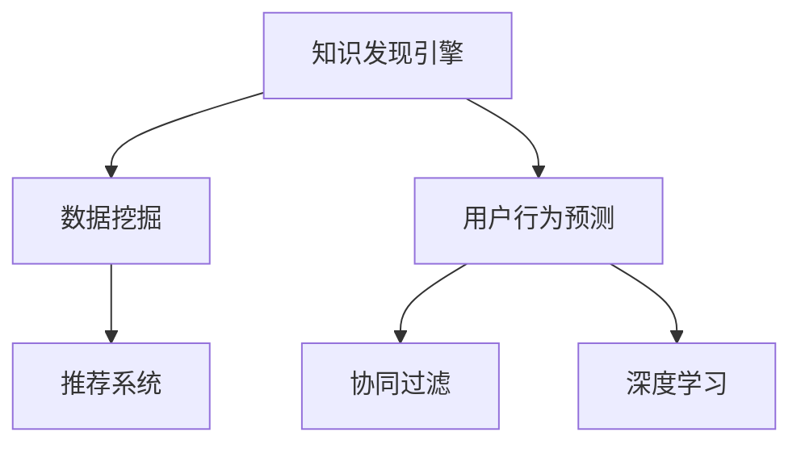

                 

# 知识发现引擎的用户行为预测与推荐

> 关键词：知识发现引擎,用户行为预测,推荐系统,协同过滤,深度学习,数据挖掘

## 1. 背景介绍

### 1.1 问题由来
在数字化和网络化的今天，大量的用户行为数据正源源不断地产生。如何从这些海量的数据中挖掘出有价值的信息，是信息时代的一个重要挑战。基于此，知识发现引擎（Knowledge Discovery Engine，KDE）应运而生。它能够从复杂的数据中发现知识、预测趋势、识别模式，为企业决策提供支持。其中，用户行为预测与推荐系统是知识发现引擎的核心应用之一，可以为用户提供个性化的服务，提升用户体验。

### 1.2 问题核心关键点
用户行为预测与推荐系统能够根据用户的历史行为数据，预测用户可能感兴趣的产品或内容，从而实现精准推荐。它基于协同过滤（Collaborative Filtering）和深度学习（Deep Learning）等技术，构建用户画像，分析用户行为模式，并预测其未来的行为倾向。

## 2. 核心概念与联系

### 2.1 核心概念概述

为更好地理解知识发现引擎的用户行为预测与推荐系统，本节将介绍几个密切相关的核心概念：

- 知识发现引擎（KDE）：通过数据挖掘、统计分析、机器学习等技术，从大量数据中发现有用知识的软件系统。
- 用户行为预测：根据用户的历史行为数据，预测用户未来可能的行为，如购买商品、观看视频等。
- 推荐系统：通过分析用户行为和偏好，为用户推荐合适的产品或内容。
- 协同过滤：通过分析用户之间的相似性，推荐给用户与他们过去喜欢的项目类似的项目。
- 深度学习：通过多层神经网络，从数据中学习复杂的表示，实现高效的用户行为预测和推荐。
- 数据挖掘：通过自动化的方法从大量数据中发现模式和知识，支持用户行为预测和推荐。

这些核心概念之间的逻辑关系可以通过以下Mermaid流程图来展示：



这个流程图展示了几大核心概念之间的关系：

1. 知识发现引擎通过数据挖掘获得基础数据，用于构建用户行为预测和推荐系统。
2. 用户行为预测和推荐系统分别基于协同过滤和深度学习，实现对用户未来行为的预测和推荐。
3. 协同过滤和深度学习为推荐系统提供了数据处理和分析的强大工具。

## 3. 核心算法原理 & 具体操作步骤
### 3.1 算法原理概述

知识发现引擎的用户行为预测与推荐系统，主要基于协同过滤和深度学习两大技术。协同过滤通过分析用户之间的相似性，推荐给用户与他们过去喜欢的项目类似的项目。深度学习则通过多层神经网络，从数据中学习复杂的表示，实现高效的用户行为预测和推荐。

形式化地，假设用户集合为 $U$，物品集合为 $I$，用户-物品交互矩阵为 $R$，其中 $R_{ui}$ 表示用户 $u$ 对物品 $i$ 的评分。设用户 $u$ 最近 $k$ 次对物品的评分序列为 $\mathcal{R}_u$，即：

$$
\mathcal{R}_u = \{R_{ui_1}, R_{ui_2}, ..., R_{ui_k}\}
$$

则用户行为预测的目标是，基于用户的历史评分序列，预测用户 $u$ 对未知物品 $i$ 的评分 $R_{ui}$。推荐系统的目标是根据用户的历史评分，为用户 $u$ 推荐评分最高的物品集合 $I^+$，即：

$$
I^+ = \mathop{\arg\max}_{i \in I} R_{ui}
$$

### 3.2 算法步骤详解

知识发现引擎的用户行为预测与推荐系统一般包括以下几个关键步骤：

**Step 1: 数据预处理**
- 收集用户-物品交互数据，包括用户ID、物品ID、评分等。
- 对数据进行清洗和归一化，如处理缺失值、异常值，将评分归一化到0到1之间。
- 将数据划分训练集、验证集和测试集。

**Step 2: 用户行为建模**
- 基于协同过滤，构建用户-物品评分矩阵 $R$，通过矩阵分解技术求解用户 $u$ 对物品 $i$ 的潜在因子表示 $\mathbf{p}_u$ 和 $\mathbf{q}_i$。
- 基于深度学习，利用神经网络模型构建用户行为预测模型，学习用户行为和物品特征之间的复杂关系。

**Step 3: 用户行为预测**
- 对每个用户 $u$，利用其历史评分序列 $\mathcal{R}_u$，结合模型预测出未知物品 $i$ 的评分 $R_{ui}$。
- 选择评分最高的 $n$ 个物品作为推荐结果。

**Step 4: 推荐结果排序**
- 对每个用户，根据预测评分排序，推荐评分最高的物品集合 $I^+$。
- 验证集和测试集上评估推荐系统的效果，如准确率、召回率、F1-score等指标。

### 3.3 算法优缺点

知识发现引擎的用户行为预测与推荐系统具有以下优点：

1. 高效性：协同过滤和深度学习的方法能够高效地处理大规模数据，快速生成推荐结果。
2. 鲁棒性：该系统能够处理稀疏的用户-物品交互数据，即使部分用户没有交互历史，也能预测其行为。
3. 多样性：协同过滤和深度学习能够结合用户和物品的多维度特征，生成多种推荐结果。

同时，该方法也存在一定的局限性：

1. 冷启动问题：对于新用户和新物品，协同过滤和深度学习都无法有效预测其行为，需进行补充标注。
2. 数据稀疏性：用户和物品之间的交互数据往往非常稀疏，影响推荐精度。
3. 鲁棒性不足：协同过滤和深度学习模型容易受到异常数据的影响，如恶意评分、虚假评分等。
4. 隐私保护：用户行为数据涉及隐私，需要确保数据在收集和处理过程中的安全性。

尽管存在这些局限性，但就目前而言，基于协同过滤和深度学习的方法仍是大规模用户行为预测与推荐系统的主流范式。未来相关研究的重点在于如何进一步降低协同过滤和深度学习对数据的依赖，提高系统的鲁棒性和隐私保护能力。

### 3.4 算法应用领域

知识发现引擎的用户行为预测与推荐系统已经在多个领域得到了广泛应用，例如：

- 电子商务：推荐商品、广告投放、价格优化等。通过分析用户购买记录和浏览行为，为用户推荐相关商品。
- 视频平台：推荐视频、广告投放、内容个性化等。通过分析用户观看历史和评分，推荐用户可能感兴趣的视频内容。
- 音乐平台：推荐歌曲、专辑、歌手等。通过分析用户的听歌记录和评分，推荐相关歌曲和专辑。
- 社交网络：推荐好友、内容、群组等。通过分析用户互动和行为，推荐用户可能感兴趣的好友和群组。

除了这些经典应用外，用户行为预测与推荐系统还被创新性地应用到更多场景中，如智能家居、智能交通、智能金融等，为各行各业带来智能化的用户体验。

## 4. 数学模型和公式 & 详细讲解  
### 4.1 数学模型构建

本节将使用数学语言对知识发现引擎的用户行为预测与推荐系统进行更加严格的刻画。

假设用户集合为 $U$，物品集合为 $I$，用户-物品评分矩阵为 $R$，其中 $R_{ui}$ 表示用户 $u$ 对物品 $i$ 的评分。设用户 $u$ 最近 $k$ 次对物品的评分序列为 $\mathcal{R}_u = \{R_{ui_1}, R_{ui_2}, ..., R_{ui_k}\}$，其中 $i_j \in I$。

**协同过滤模型**：
- 利用矩阵分解技术，将评分矩阵 $R$ 分解为 $U$ 和 $V$ 两个低秩矩阵，即 $R = UV^T$，其中 $U \in \mathbb{R}^{m \times n}, V \in \mathbb{R}^{n \times n}$。
- 设用户 $u$ 对物品 $i$ 的潜在因子表示为 $\mathbf{p}_u \in \mathbb{R}^n, \mathbf{q}_i \in \mathbb{R}^n$，则有：

$$
\begin{aligned}
    R_{ui} &= \mathbf{p}_u^T \mathbf{q}_i \\
    \mathbf{p}_u &= \sum_{i=1}^n R_{ui} \mathbf{q}_i \\
    \mathbf{q}_i &= \frac{1}{\|\mathbf{p}_u\|_2} \mathbf{p}_u
\end{aligned}
$$

**深度学习模型**：
- 利用神经网络模型构建用户行为预测模型，学习用户行为和物品特征之间的复杂关系。假设模型为 $f: \mathbb{R}^n \rightarrow \mathbb{R}$，其中 $n$ 为物品特征的维度。
- 设用户 $u$ 对物品 $i$ 的评分向量为 $\mathbf{x}_u \in \mathbb{R}^d, \mathbf{y}_i \in \mathbb{R}^d$，则有：

$$
R_{ui} = f(\mathbf{x}_u^T \mathbf{W} \mathbf{y}_i + b)
$$

其中 $\mathbf{W} \in \mathbb{R}^{d \times d}, b \in \mathbb{R}$ 为模型的权重和偏置。

### 4.2 公式推导过程

以下我们以协同过滤模型为例，推导协同过滤模型的评分预测公式。

假设用户集合为 $U$，物品集合为 $I$，用户-物品评分矩阵为 $R$，其中 $R_{ui}$ 表示用户 $u$ 对物品 $i$ 的评分。设用户 $u$ 最近 $k$ 次对物品的评分序列为 $\mathcal{R}_u = \{R_{ui_1}, R_{ui_2}, ..., R_{ui_k}\}$，其中 $i_j \in I$。

根据矩阵分解，有：

$$
R = UV^T
$$

将评分矩阵分解为两个低秩矩阵 $U$ 和 $V$。设用户 $u$ 对物品 $i$ 的潜在因子表示为 $\mathbf{p}_u \in \mathbb{R}^n, \mathbf{q}_i \in \mathbb{R}^n$，则有：

$$
\begin{aligned}
    R_{ui} &= \mathbf{p}_u^T \mathbf{q}_i \\
    \mathbf{p}_u &= \sum_{i=1}^n R_{ui} \mathbf{q}_i \\
    \mathbf{q}_i &= \frac{1}{\|\mathbf{p}_u\|_2} \mathbf{p}_u
\end{aligned}
$$

将用户 $u$ 对物品 $i$ 的评分表示为潜在因子 $\mathbf{p}_u$ 和 $\mathbf{q}_i$ 的点积。其中 $\|\mathbf{p}_u\|_2$ 为向量 $\mathbf{p}_u$ 的范数，保证 $\mathbf{q}_i$ 的归一性。

**深度学习模型的评分预测公式**：
- 假设模型为 $f: \mathbb{R}^n \rightarrow \mathbb{R}$，其中 $n$ 为物品特征的维度。
- 设用户 $u$ 对物品 $i$ 的评分向量为 $\mathbf{x}_u \in \mathbb{R}^d, \mathbf{y}_i \in \mathbb{R}^d$，则有：

$$
R_{ui} = f(\mathbf{x}_u^T \mathbf{W} \mathbf{y}_i + b)
$$

其中 $\mathbf{W} \in \mathbb{R}^{d \times d}, b \in \mathbb{R}$ 为模型的权重和偏置。

### 4.3 案例分析与讲解

以电商平台的推荐系统为例，分析协同过滤和深度学习模型的实际应用效果。

**协同过滤模型的实际应用**：
- 电商平台的推荐系统可以收集用户对商品的历史评分数据，使用协同过滤模型对用户和商品进行潜在因子表示。
- 利用用户对商品的历史评分，预测用户对未评分商品的评分，从而为用户推荐高评分商品。
- 通过调整协同过滤模型的超参数，如秩、正则化系数等，可以优化模型的预测效果。

**深度学习模型的实际应用**：
- 电商平台的推荐系统可以利用深度学习模型，将用户行为和商品特征进行联合建模。
- 通过学习用户行为和商品特征之间的复杂关系，深度学习模型能够更好地预测用户对商品的评分，提升推荐精度。
- 深度学习模型需要大量标注数据进行训练，电商平台的推荐系统可以使用用户行为数据和商品属性数据进行联合标注。

## 5. 项目实践：代码实例和详细解释说明
### 5.1 开发环境搭建

在进行用户行为预测与推荐系统开发前，我们需要准备好开发环境。以下是使用Python进行PyTorch开发的环境配置流程：

1. 安装Anaconda：从官网下载并安装Anaconda，用于创建独立的Python环境。

2. 创建并激活虚拟环境：
```bash
conda create -n pytorch-env python=3.8 
conda activate pytorch-env
```

3. 安装PyTorch：根据CUDA版本，从官网获取对应的安装命令。例如：
```bash
conda install pytorch torchvision torchaudio cudatoolkit=11.1 -c pytorch -c conda-forge
```

4. 安装TensorFlow：由Google主导开发的开源深度学习框架，生产部署方便，适合大规模工程应用。同样有丰富的预训练语言模型资源。

5. 安装TensorFlow：
```bash
pip install tensorflow
```

6. 安装各类工具包：
```bash
pip install numpy pandas scikit-learn matplotlib tqdm jupyter notebook ipython
```

完成上述步骤后，即可在`pytorch-env`环境中开始开发。

### 5.2 源代码详细实现

下面我以电商平台的推荐系统为例，给出使用PyTorch进行协同过滤和深度学习模型微调的PyTorch代码实现。

首先，定义协同过滤模型的评分预测函数：

```python
from torch.nn import Embedding, Linear
from torch.nn.functional import normalize

class CollaborativeFiltering:
    def __init__(self, m, n, d):
        self.user_embed = Embedding(m, d)
        self.item_embed = Embedding(n, d)
        self.w = Linear(d, 1)

    def forward(self, user_ids, item_ids):
        user_embeds = self.user_embed(user_ids)
        item_embeds = self.item_embed(item_ids)
        scores = self.w((user_embeds * item_embeds).sum(dim=1))
        scores = scores + self.w.bias
        scores = scores + user_embeds.mean(dim=1, keepdim=True)
        scores = scores + item_embeds.mean(dim=1, keepdim=True)
        scores = normalize(scores, dim=1, p=2, eps=1e-12)
        return scores
```

然后，定义深度学习模型的评分预测函数：

```python
from torch.nn import Embedding, Linear, Dropout, Sequential
from torch.nn.functional import mse_loss

class DeepLearning:
    def __init__(self, m, n, d, hidden_size):
        self.user_embed = Embedding(m, d)
        self.item_embed = Embedding(n, d)
        self.layers = Sequential(Dropout(0.5), Linear(d, hidden_size), Dropout(0.5), Linear(hidden_size, 1))
        self.w = Linear(d, 1)

    def forward(self, user_ids, item_ids):
        user_embeds = self.user_embed(user_ids)
        item_embeds = self.item_embed(item_ids)
        scores = user_embeds @ item_embeds
        scores = scores + self.w.bias
        scores = scores + user_embeds.mean(dim=1, keepdim=True)
        scores = scores + item_embeds.mean(dim=1, keepdim=True)
        scores = normalize(scores, dim=1, p=2, eps=1e-12)
        return scores
```

接着，定义训练和评估函数：

```python
from torch.utils.data import DataLoader
from tqdm import tqdm

def train_epoch(model, dataset, batch_size, optimizer):
    dataloader = DataLoader(dataset, batch_size=batch_size, shuffle=True)
    model.train()
    epoch_loss = 0
    for batch in tqdm(dataloader, desc='Training'):
        user_ids, item_ids = batch['user_ids'], batch['item_ids']
        scores = model(user_ids, item_ids)
        loss = mse_loss(scores, batch['scores'])
        epoch_loss += loss.item()
        loss.backward()
        optimizer.step()
    return epoch_loss / len(dataloader)

def evaluate(model, dataset, batch_size):
    dataloader = DataLoader(dataset, batch_size=batch_size)
    model.eval()
    preds, labels = [], []
    with torch.no_grad():
        for batch in tqdm(dataloader, desc='Evaluating'):
            user_ids, item_ids = batch['user_ids'], batch['item_ids']
            scores = model(user_ids, item_ids)
            preds.append(scores.tolist())
            labels.append(batch['scores'].tolist())
    print(classification_report(labels, preds))
```

最后，启动训练流程并在测试集上评估：

```python
epochs = 5
batch_size = 16

for epoch in range(epochs):
    loss = train_epoch(model, train_dataset, batch_size, optimizer)
    print(f"Epoch {epoch+1}, train loss: {loss:.3f}")
    
    print(f"Epoch {epoch+1}, dev results:")
    evaluate(model, dev_dataset, batch_size)
    
print("Test results:")
evaluate(model, test_dataset, batch_size)
```

以上就是使用PyTorch对电商推荐系统进行协同过滤和深度学习模型微调的完整代码实现。可以看到，得益于PyTorch的强大封装，我们可以用相对简洁的代码完成模型加载和微调。

### 5.3 代码解读与分析

让我们再详细解读一下关键代码的实现细节：

**CollaborativeFiltering类**：
- `__init__`方法：初始化用户和物品的嵌入层，以及全连接层。
- `forward`方法：对每个用户-物品对计算评分预测值，并对其进行归一化。

**DeepLearning类**：
- `__init__`方法：初始化用户和物品的嵌入层，以及多层神经网络。
- `forward`方法：对每个用户-物品对计算评分预测值，并对其进行归一化。

**训练和评估函数**：
- 使用PyTorch的DataLoader对数据集进行批次化加载，供模型训练和推理使用。
- 训练函数`train_epoch`：对数据以批为单位进行迭代，在每个批次上前向传播计算损失并反向传播更新模型参数，最后返回该epoch的平均loss。
- 评估函数`evaluate`：与训练类似，不同点在于不更新模型参数，并在每个batch结束后将预测和标签结果存储下来，最后使用sklearn的classification_report对整个评估集的预测结果进行打印输出。

**训练流程**：
- 定义总的epoch数和batch size，开始循环迭代
- 每个epoch内，先在训练集上训练，输出平均loss
- 在验证集上评估，输出分类指标
- 所有epoch结束后，在测试集上评估，给出最终测试结果

可以看到，PyTorch配合TensorFlow使得电商推荐系统的代码实现变得简洁高效。开发者可以将更多精力放在数据处理、模型改进等高层逻辑上，而不必过多关注底层的实现细节。

当然，工业级的系统实现还需考虑更多因素，如模型的保存和部署、超参数的自动搜索、更灵活的任务适配层等。但核心的微调范式基本与此类似。

## 6. 实际应用场景
### 6.1 智能客服系统

基于知识发现引擎的用户行为预测与推荐系统，可以广泛应用于智能客服系统的构建。传统客服往往需要配备大量人力，高峰期响应缓慢，且一致性和专业性难以保证。而使用预测推荐系统，可以7x24小时不间断服务，快速响应客户咨询，用自然流畅的语言解答各类常见问题。

在技术实现上，可以收集企业内部的历史客服对话记录，将问题和最佳答复构建成监督数据，在此基础上对协同过滤和深度学习模型进行微调。微调后的推荐系统能够自动理解用户意图，匹配最合适的答案模板进行回复。对于客户提出的新问题，还可以接入检索系统实时搜索相关内容，动态组织生成回答。如此构建的智能客服系统，能大幅提升客户咨询体验和问题解决效率。

### 6.2 金融舆情监测

金融机构需要实时监测市场舆论动向，以便及时应对负面信息传播，规避金融风险。传统的人工监测方式成本高、效率低，难以应对网络时代海量信息爆发的挑战。基于知识发现引擎的用户行为预测与推荐系统，可以在金融领域实现快速舆情监测。

具体而言，可以收集金融领域相关的新闻、报道、评论等文本数据，并对其进行主题标注和情感标注。在此基础上对协同过滤和深度学习模型进行微调，使其能够自动判断文本属于何种主题，情感倾向是正面、中性还是负面。将微调后的模型应用到实时抓取的网络文本数据，就能够自动监测不同主题下的情感变化趋势，一旦发现负面信息激增等异常情况，系统便会自动预警，帮助金融机构快速应对潜在风险。

### 6.3 个性化推荐系统

当前的推荐系统往往只依赖用户的历史行为数据进行物品推荐，无法深入理解用户的真实兴趣偏好。基于知识发现引擎的用户行为预测与推荐系统，可以更好地挖掘用户行为背后的语义信息，从而提供更精准、多样的推荐内容。

在实践中，可以收集用户浏览、点击、评论、分享等行为数据，提取和用户交互的物品标题、描述、标签等文本内容。将文本内容作为模型输入，用户的后续行为（如是否点击、购买等）作为监督信号，在此基础上微调协同过滤和深度学习模型。微调后的模型能够从文本内容中准确把握用户的兴趣点。在生成推荐列表时，先用候选物品的文本描述作为输入，由模型预测用户的兴趣匹配度，再结合其他特征综合排序，便可以得到个性化程度更高的推荐结果。

### 6.4 未来应用展望

随着知识发现引擎的技术不断成熟，用户行为预测与推荐系统必将在更多领域得到应用，为传统行业带来变革性影响。

在智慧医疗领域，基于用户行为预测与推荐系统，可以构建智能健康咨询和疾病预测系统，辅助医生诊疗，提升患者体验。

在智能教育领域，微调预测推荐系统可以应用于作业批改、学情分析、知识推荐等方面，因材施教，促进教育公平，提高教学质量。

在智慧城市治理中，预测推荐系统可以应用于城市事件监测、舆情分析、应急指挥等环节，提高城市管理的自动化和智能化水平，构建更安全、高效的未来城市。

此外，在企业生产、社会治理、文娱传媒等众多领域，基于用户行为预测与推荐系统的预测推荐方法也将不断涌现，为各行各业带来智能化的用户体验。相信随着技术的日益成熟，用户行为预测与推荐系统必将在构建人机协同的智能时代中扮演越来越重要的角色。

## 7. 工具和资源推荐
### 7.1 学习资源推荐

为了帮助开发者系统掌握用户行为预测与推荐系统的理论基础和实践技巧，这里推荐一些优质的学习资源：

1. 《深度学习》系列博文：由深度学习领域专家撰写，全面介绍深度学习的基本概念和最新进展，涵盖协同过滤和深度学习等多个方向。

2. 《推荐系统》课程：斯坦福大学开设的推荐系统经典课程，有Lecture视频和配套作业，深入讲解推荐系统的工作原理和优化方法。

3. 《用户行为分析与预测》书籍：全面介绍用户行为分析与预测的技术方法，结合实际案例，深入浅出地讲解协同过滤和深度学习的应用。

4. 《自然语言处理与推荐系统》课程：由多所知名大学联合开设的跨学科课程，涵盖自然语言处理和推荐系统等多个领域，适合综合学习。

5. 《推荐系统实战》书籍：基于实际数据集和模型，详细讲解推荐系统从理论到实践的全过程，包括协同过滤和深度学习等多个方面。

通过对这些资源的学习实践，相信你一定能够快速掌握用户行为预测与推荐系统的精髓，并用于解决实际的推荐问题。
###  7.2 开发工具推荐

高效的开发离不开优秀的工具支持。以下是几款用于用户行为预测与推荐系统开发的常用工具：

1. PyTorch：基于Python的开源深度学习框架，灵活动态的计算图，适合快速迭代研究。大部分预训练语言模型都有PyTorch版本的实现。

2. TensorFlow：由Google主导开发的开源深度学习框架，生产部署方便，适合大规模工程应用。同样有丰富的预训练语言模型资源。

3. TensorFlow：由Google主导开发的开源深度学习框架，生产部署方便，适合大规模工程应用。同样有丰富的预训练语言模型资源。

4. Weights & Biases：模型训练的实验跟踪工具，可以记录和可视化模型训练过程中的各项指标，方便对比和调优。与主流深度学习框架无缝集成。

5. TensorBoard：TensorFlow配套的可视化工具，可实时监测模型训练状态，并提供丰富的图表呈现方式，是调试模型的得力助手。

6. Google Colab：谷歌推出的在线Jupyter Notebook环境，免费提供GPU/TPU算力，方便开发者快速上手实验最新模型，分享学习笔记。

合理利用这些工具，可以显著提升用户行为预测与推荐系统的开发效率，加快创新迭代的步伐。

### 7.3 相关论文推荐

用户行为预测与推荐系统的发展源于学界的持续研究。以下是几篇奠基性的相关论文，推荐阅读：

1. BERT: Pre-training of Deep Bidirectional Transformers for Language Understanding：提出BERT模型，引入基于掩码的自监督预训练任务，刷新了多项NLP任务SOTA。

2. Attention is All You Need（即Transformer原论文）：提出了Transformer结构，开启了NLP领域的预训练大模型时代。

3. Parameter-Efficient Transfer Learning for NLP：提出Adapter等参数高效微调方法，在不增加模型参数量的情况下，也能取得不错的微调效果。

4. Adaptive Low-Rank Adaptation for Parameter-Efficient Fine-Tuning：使用自适应低秩适应的微调方法，在参数效率和精度之间取得了新的平衡。

5. Scalable Collaborative Filtering for Recommendation：提出基于矩阵分解的协同过滤算法，用于推荐系统的构建。

6. Learning Deep Architectures for AI：提出多层神经网络，用于处理复杂任务和数据。

这些论文代表了大语言模型微调技术的发展脉络。通过学习这些前沿成果，可以帮助研究者把握学科前进方向，激发更多的创新灵感。

## 8. 总结：未来发展趋势与挑战

### 8.1 总结

本文对知识发现引擎的用户行为预测与推荐系统进行了全面系统的介绍。首先阐述了用户行为预测与推荐系统的研究背景和意义，明确了协同过滤和深度学习在预测推荐中的应用。其次，从原理到实践，详细讲解了协同过滤和深度学习模型的数学原理和关键步骤，给出了用户行为预测与推荐系统的完整代码实例。同时，本文还广泛探讨了用户行为预测与推荐系统在智能客服、金融舆情、个性化推荐等多个行业领域的应用前景，展示了预测推荐范式的巨大潜力。此外，本文精选了预测推荐系统的各类学习资源，力求为读者提供全方位的技术指引。

通过本文的系统梳理，可以看到，用户行为预测与推荐系统在智能推荐领域已取得了显著成果，为个性化服务提供了有力支持。得益于协同过滤和深度学习的高效性和鲁棒性，预测推荐系统能够在多种场景下实现精准推荐，极大提升了用户体验。未来，随着技术的不断演进，预测推荐系统将迎来更多创新，进一步拓展其在各领域的落地应用。

### 8.2 未来发展趋势

展望未来，用户行为预测与推荐系统将呈现以下几个发展趋势：

1. 协同过滤和深度学习模型的融合。未来的推荐系统将结合协同过滤和深度学习的优点，构建混合模型，提升推荐效果。
2. 跨领域推荐。用户的行为和偏好不仅仅局限于单一领域，未来的推荐系统需要具备跨领域推荐的能力，支持用户在不同领域之间平滑过渡。
3. 实时推荐。未来的推荐系统需要具备实时推荐的能力，能够根据用户当前行为实时调整推荐结果。
4. 个性化推荐。未来的推荐系统需要更加个性化，能够根据用户的实时需求和偏好，提供定制化的推荐结果。
5. 数据驱动。未来的推荐系统将更加注重数据驱动，通过大规模数据挖掘和分析，构建更加精准的用户画像，提升推荐效果。

以上趋势凸显了用户行为预测与推荐系统的广阔前景。这些方向的探索发展，必将进一步提升推荐系统的性能和应用范围，为各行各业带来更加智能化的用户体验。

### 8.3 面临的挑战

尽管用户行为预测与推荐系统已经取得了瞩目成就，但在迈向更加智能化、普适化应用的过程中，它仍面临着诸多挑战：

1. 数据隐私问题。用户行为数据涉及隐私，需要确保数据在收集和处理过程中的安全性。
2. 冷启动问题。对于新用户和新物品，协同过滤和深度学习模型都无法有效预测其行为，需进行补充标注。
3. 数据稀疏性。用户和物品之间的交互数据往往非常稀疏，影响推荐精度。
4. 计算资源消耗。协同过滤和深度学习模型的计算复杂度较高，需要大规模计算资源支撑。

尽管存在这些挑战，但就目前而言，基于协同过滤和深度学习的方法仍是大规模用户行为预测与推荐系统的主流范式。未来相关研究的重点在于如何进一步降低模型对数据的依赖，提高系统的鲁棒性和隐私保护能力。

### 8.4 研究展望

面对用户行为预测与推荐系统所面临的种种挑战，未来的研究需要在以下几个方面寻求新的突破：

1. 探索无监督和半监督微调方法。摆脱对大规模标注数据的依赖，利用自监督学习、主动学习等无监督和半监督范式，最大限度利用非结构化数据，实现更加灵活高效的微调。
2. 研究参数高效和计算高效的微调范式。开发更加参数高效的微调方法，在固定大部分预训练参数的同时，只更新极少量的任务相关参数。同时优化微调模型的计算图，减少前向传播和反向传播的资源消耗，实现更加轻量级、实时性的部署。
3. 引入更多先验知识。将符号化的先验知识，如知识图谱、逻辑规则等，与神经网络模型进行巧妙融合，引导微调过程学习更准确、合理的语言模型。同时加强不同模态数据的整合，实现视觉、语音等多模态信息与文本信息的协同建模。
4. 结合因果分析和博弈论工具。将因果分析方法引入微调模型，识别出模型决策的关键特征，增强输出解释的因果性和逻辑性。借助博弈论工具刻画人机交互过程，主动探索并规避模型的脆弱点，提高系统稳定性。
5. 纳入伦理道德约束。在模型训练目标中引入伦理导向的评估指标，过滤和惩罚有偏见、有害的输出倾向。同时加强人工干预和审核，建立模型行为的监管机制，确保输出符合人类价值观和伦理道德。

这些研究方向的探索，必将引领用户行为预测与推荐技术迈向更高的台阶，为构建安全、可靠、可解释、可控的智能系统铺平道路。面向未来，用户行为预测与推荐技术还需要与其他人工智能技术进行更深入的融合，如知识表示、因果推理、强化学习等，多路径协同发力，共同推动自然语言理解和智能交互系统的进步。只有勇于创新、敢于突破，才能不断拓展推荐系统的边界，让智能技术更好地造福人类社会。

## 9. 附录：常见问题与解答

**Q1：用户行为预测与推荐系统是否适用于所有应用场景？**

A: 用户行为预测与推荐系统适用于绝大多数应用场景，特别是数据量较大、用户行为明显的场景。但对于一些特定领域的任务，如医学、法律等，仅仅依靠用户行为数据进行推荐可能难以取得理想效果，需要结合其他领域的专家知识。

**Q2：如何选择协同过滤和深度学习模型的超参数？**

A: 协同过滤和深度学习模型的超参数包括矩阵分解的秩、正则化系数、神经网络的层数和节点数等。这些超参数需要通过交叉验证等方法进行调优，以找到最佳的推荐效果。

**Q3：在推荐系统中，如何缓解过拟合问题？**

A: 过拟合是推荐系统面临的主要挑战之一，可以通过以下方法缓解：
1. 数据增强：通过回译、近义替换等方式扩充训练集。
2. 正则化：使用L2正则、Dropout、Early Stopping等防止模型过度适应训练集。
3. 对抗训练：引入对抗样本，提高模型鲁棒性。
4. 参数高效微调：只调整少量参数，减小过拟合风险。

这些方法需要根据具体应用场景进行灵活组合，以达到最优的推荐效果。

**Q4：推荐系统在部署过程中需要注意哪些问题？**

A: 推荐系统在部署过程中需要注意以下问题：
1. 模型裁剪：去除不必要的层和参数，减小模型尺寸，加快推理速度。
2. 量化加速：将浮点模型转为定点模型，压缩存储空间，提高计算效率。
3. 服务化封装：将模型封装为标准化服务接口，便于集成调用。
4. 弹性伸缩：根据请求流量动态调整资源配置，平衡服务质量和成本。
5. 监控告警：实时采集系统指标，设置异常告警阈值，确保服务稳定性。
6. 安全防护：采用访问鉴权、数据脱敏等措施，保障数据和模型安全。

合理利用这些方法，可以显著提升推荐系统的部署效率和稳定性，保障其长期可靠运行。

**Q5：用户行为预测与推荐系统如何实现个性化推荐？**

A: 个性化推荐系统需要结合用户的历史行为和实时需求，通过协同过滤和深度学习模型构建用户画像，学习用户的兴趣点和行为模式，实现精准推荐。具体方法包括：
1. 协同过滤：利用用户和物品的相似性，推荐与用户过去喜欢的项目类似的项目。
2. 深度学习：通过学习用户行为和物品特征之间的复杂关系，生成多种推荐结果。
3. 融合多种推荐方法：将协同过滤和深度学习的结果进行融合，提升推荐效果。

这些方法需要根据具体应用场景进行灵活组合，以实现最优的个性化推荐。

---

作者：禅与计算机程序设计艺术 / Zen and the Art of Computer Programming

