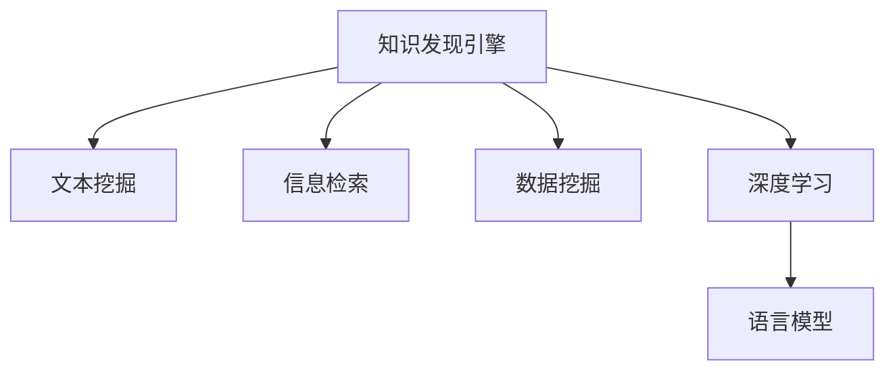

                 

# 知识发现引擎的自然语言处理技术应用

> 关键词：知识发现引擎, 自然语言处理(NLP), 文本挖掘, 信息检索, 数据挖掘, 深度学习

## 1. 背景介绍

在数据爆炸的时代，知识和信息的获取、组织和应用变得日益重要。为了从海量数据中发现有价值的信息和知识，知识发现引擎成为一种不可或缺的工具。知识发现引擎通常包含文本挖掘、信息检索和数据挖掘等核心技术，能够自动化地从大量文本数据中提取出有用信息，并将其转化为结构化的知识。

### 1.1 问题由来

随着信息技术的迅速发展，文本数据量呈指数级增长，如何从中提取有价值的知识成为了一个重要问题。传统的文本处理方式，如关键词提取、词频统计等方法，虽然简单有效，但在处理复杂文本时存在局限性。而新兴的自然语言处理技术，特别是深度学习和人工智能，为文本挖掘和知识发现提供了新的可能。

### 1.2 问题核心关键点

1. **数据质量问题**：知识发现引擎的核心是数据质量，而数据质量的好坏直接决定了最终的发现结果。如何确保数据的准确性、完整性和一致性，是知识发现过程中的一个重要挑战。
2. **语义理解问题**：自然语言处理技术的核心在于对语言的理解，如何准确捕捉文本中的语义信息，是知识发现过程中的另一个关键问题。
3. **知识表示问题**：将从文本中提取出来的知识以何种形式表示，直接影响了知识发现的深度和广度。传统的符号知识表示方法虽然准确，但过于繁琐，而新兴的深度学习模型在知识表示上表现更为灵活。
4. **知识抽取问题**：如何在文本中识别出关键的实体、关系和事件，并将其抽取出来，是知识发现过程中的一个重要环节。
5. **知识集成问题**：如何将不同来源、不同格式的知识进行有效整合，形成结构化的知识库，是知识发现过程中的一个挑战。
6. **知识推理问题**：如何将知识库中的知识进行逻辑推理，生成新的知识，是知识发现过程中的一个重要目标。

## 2. 核心概念与联系

### 2.1 核心概念概述

为更好地理解知识发现引擎在自然语言处理中的应用，本节将介绍几个密切相关的核心概念：

- **知识发现引擎(Knowledge Discovery Engine, KDE)**：一种能够从海量文本数据中自动挖掘、抽取和组织知识的工具，通常包含文本挖掘、信息检索和数据挖掘等核心技术。
- **自然语言处理(Natural Language Processing, NLP)**：涉及计算机处理自然语言的技术，包括文本挖掘、信息检索、情感分析、机器翻译等，旨在从文本中提取有价值的信息和知识。
- **文本挖掘(Text Mining)**：从文本数据中自动抽取信息、发现模式和知识的过程，是知识发现引擎的重要组成部分。
- **信息检索(Information Retrieval, IR)**：根据用户查询从文本集合中快速定位相关信息的过程，通常包括文本向量化、相似度计算等步骤。
- **数据挖掘(Data Mining)**：从大量数据中提取有用信息和知识的过程，涉及分类、聚类、关联规则等技术。
- **深度学习(Deep Learning)**：基于人工神经网络，通过多层次的特征提取和表示学习，实现对复杂数据的深度挖掘和理解。
- **语言模型(Language Model)**：用于预测下一个词或字符的概率模型，是NLP中重要的基础模型。

这些核心概念之间的逻辑关系可以通过以下Mermaid流程图来展示：



这个流程图展示了知识发现引擎的核心组件及其之间的关系：

1. 知识发现引擎通过文本挖掘、信息检索和数据挖掘等技术，从海量文本中提取有用的知识和信息。
2. 深度学习是知识发现引擎的重要技术手段，通过多层神经网络模型，实现对复杂数据的深度挖掘和理解。
3. 语言模型是深度学习的基石，用于预测文本中的下一个词或字符，是文本挖掘和信息检索的基础。

这些核心概念共同构成了知识发现引擎的技术框架，使其能够从文本数据中自动化地提取出有价值的知识。

## 3. 核心算法原理 & 具体操作步骤

### 3.1 算法原理概述

知识发现引擎的算法原理主要基于自然语言处理技术，特别是深度学习技术。其核心思想是：通过文本挖掘和信息检索等技术，从海量文本中提取出有用的信息，并将其转化为结构化的知识。这一过程中，语言模型和深度学习模型起到了关键作用。

知识发现引擎的算法流程通常包括以下几个步骤：

1. **数据预处理**：清洗和规范化原始文本数据，去除噪音和无用信息。
2. **文本向量化**：将文本转化为向量形式，以便机器处理。
3. **特征提取**：从文本向量中提取关键特征，如词频、TF-IDF等。
4. **模型训练**：利用深度学习模型，如循环神经网络(RNN)、卷积神经网络(CNN)等，对文本进行建模。
5. **知识抽取**：通过实体识别、关系抽取等技术，从文本中识别出关键的实体、关系和事件。
6. **知识表示**：将抽取出来的知识以结构化的形式表示，如本体、语义网络等。
7. **知识推理**：通过逻辑推理、统计分析和机器学习等方法，生成新的知识。

### 3.2 算法步骤详解

以下详细介绍知识发现引擎的算法步骤和具体操作步骤：

**Step 1: 数据预处理**

数据预处理是知识发现引擎的重要环节，其目的是清洗和规范化原始文本数据，去除噪音和无用信息。具体步骤包括：

1. **文本清洗**：去除HTML标签、特殊字符等无用信息，保留有效内容。
2. **分词**：将文本分割成单词或短语，以便后续处理。
3. **停用词过滤**：去除常见的停用词，如“的”、“是”等，以减少噪音。
4. **词干提取**：将单词还原为词干形式，如“running”还原为“run”。
5. **词形还原**：将单词还原为原始形态，如“running”还原为“run”。
6. **拼写纠错**：使用拼写检查算法纠正拼写错误。

**Step 2: 文本向量化**

文本向量化是将文本转化为向量形式，以便机器处理。常用的文本向量化方法包括：

1. **词袋模型(Bag of Words, BOW)**：将文本表示为单词的集合，每个单词表示为一个向量，计算单词在文本中的频率。
2. **TF-IDF**：考虑单词在文本中的重要性和在整个语料库中的稀疏度，计算单词的TF-IDF权重。
3. **词嵌入(Word Embedding)**：将单词表示为低维向量，如Word2Vec、GloVe等。

**Step 3: 特征提取**

特征提取是从文本向量中提取关键特征，如词频、TF-IDF等。常用的特征提取方法包括：

1. **词频**：计算单词在文本中出现的次数。
2. **TF-IDF**：计算单词在文本中的重要性和在整个语料库中的稀疏度。
3. **n-gram**：计算连续n个单词的组合，如“Chinese government”。
4. **主题建模**：使用LDA等主题建模算法，从文本中提取出隐含的主题。

**Step 4: 模型训练**

模型训练是知识发现引擎的核心环节，其目的是通过深度学习模型，对文本进行建模。常用的深度学习模型包括：

1. **循环神经网络(RNN)**：通过多层循环结构，处理序列数据，如文本。
2. **卷积神经网络(CNN)**：通过多层卷积和池化操作，提取局部特征。
3. **长短期记忆网络(LSTM)**：通过门控机制，处理长序列数据。
4. **自编码器(Autocoder)**：通过编码器和解码器，学习文本的压缩表示。
5. **注意力机制(Attention Mechanism)**：通过注意力机制，重点关注文本中的重要部分。

**Step 5: 知识抽取**

知识抽取是从文本中识别出关键的实体、关系和事件。常用的知识抽取方法包括：

1. **命名实体识别(NER)**：识别文本中的命名实体，如人名、地名等。
2. **关系抽取(RE)**：识别文本中的实体关系，如“张三喜欢王二”。
3. **事件抽取(EE)**：识别文本中的事件，如“苹果发布了新iPhone”。
4. **意图识别(IR)**：识别文本中的意图，如“订票”。

**Step 6: 知识表示**

知识表示是将抽取出来的知识以结构化的形式表示，如本体、语义网络等。常用的知识表示方法包括：

1. **本体(Ontology)**：使用RDF等语言，表示知识库中的实体、关系和属性。
2. **语义网络(Semantic Network)**：使用图结构，表示知识库中的实体和关系。
3. **知识图谱(Knowledge Graph)**：使用图结构，表示知识库中的实体、关系和属性，并支持推理。

**Step 7: 知识推理**

知识推理是通过逻辑推理、统计分析和机器学习等方法，生成新的知识。常用的知识推理方法包括：

1. **规则推理(Defeasible Reasoning)**：使用规则引擎，进行逻辑推理。
2. **统计推理(Statistical Reasoning)**：使用统计模型，进行概率推理。
3. **机器学习推理(Machine Learning Reasoning)**：使用机器学习算法，生成新的知识。

### 3.3 算法优缺点

知识发现引擎的算法具有以下优点：

1. **自动化**：自动化的文本挖掘和信息检索技术，减少了人工处理的需求，提高了效率。
2. **精度高**：深度学习模型可以捕捉到文本中的复杂语义，提取高精度的特征。
3. **泛化能力强**：深度学习模型具有较强的泛化能力，可以处理不同领域和不同语言的文本。
4. **结构化知识**：通过知识表示技术，将抽取出来的知识转化为结构化的形式，便于后续应用。

但知识发现引擎也存在以下缺点：

1. **依赖数据质量**：数据质量对知识发现结果的影响很大，低质量的数据会导致误发现和漏发现。
2. **计算资源需求高**：深度学习模型需要大量的计算资源，包括GPU、内存等，成本较高。
3. **模型复杂**：深度学习模型的复杂度较高，训练和推理过程较为繁琐。
4. **可解释性差**：深度学习模型的决策过程缺乏可解释性，难以理解模型的内部工作机制。
5. **隐私和安全问题**：知识发现过程中涉及大量个人数据，隐私和安全问题需要特别注意。

尽管存在这些缺点，但知识发现引擎在处理大规模文本数据时，仍具有显著优势。

### 3.4 算法应用领域

知识发现引擎在多个领域得到了广泛应用，包括但不限于：

1. **医疗领域**：通过文本挖掘技术，从病历、文献中提取出有用的医疗知识，如疾病诊断、药物推荐等。
2. **金融领域**：通过信息检索技术，从新闻、报告中提取出有用的金融知识，如股票分析、市场预测等。
3. **社交媒体分析**：通过文本挖掘技术，从社交媒体数据中提取出有用的信息，如舆情分析、用户行为分析等。
4. **法律领域**：通过文本挖掘技术，从法律文件、案例中提取出有用的法律知识，如法律咨询、案件推理等。
5. **市场研究**：通过信息检索技术，从市场报告、新闻中提取出有用的市场知识，如趋势分析、消费者行为分析等。

## 4. 数学模型和公式 & 详细讲解 & 举例说明

### 4.1 数学模型构建

本节将使用数学语言对知识发现引擎的算法过程进行更加严格的刻画。

记原始文本数据集为 $D=\{(x_i,y_i)\}_{i=1}^N$，其中 $x_i$ 表示文本，$y_i$ 表示标签，如命名实体、关系等。定义文本挖掘模型为 $f(x_i,y_i)$，则知识发现引擎的目标是最小化预测误差：

$$
\mathop{\min}_{f} \frac{1}{N}\sum_{i=1}^N \ell(f(x_i),y_i)
$$

其中 $\ell$ 为损失函数，常用的损失函数包括交叉熵损失、均方误差损失等。

### 4.2 公式推导过程

以下我们以文本分类任务为例，推导交叉熵损失函数及其梯度的计算公式。

假设模型 $f(x_i)$ 在输入 $x_i$ 上的输出为 $\hat{y}=M_{\theta}(x_i) \in [0,1]$，表示样本属于正类的概率。真实标签 $y \in \{0,1\}$。则二分类交叉熵损失函数定义为：

$$
\ell(f(x_i),y) = -[y\log \hat{y} + (1-y)\log (1-\hat{y})]
$$

将其代入经验风险公式，得：

$$
\mathcal{L}(\theta) = -\frac{1}{N}\sum_{i=1}^N [y_i\log M_{\theta}(x_i)+(1-y_i)\log(1-M_{\theta}(x_i))]
$$

根据链式法则，损失函数对模型参数 $\theta$ 的梯度为：

$$
\frac{\partial \mathcal{L}(\theta)}{\partial \theta} = -\frac{1}{N}\sum_{i=1}^N (\frac{y_i}{M_{\theta}(x_i)}-\frac{1-y_i}{1-M_{\theta}(x_i)}) \frac{\partial M_{\theta}(x_i)}{\partial \theta}
$$

其中 $\frac{\partial M_{\theta}(x_i)}{\partial \theta}$ 可进一步递归展开，利用自动微分技术完成计算。

### 4.3 案例分析与讲解

在实际应用中，知识发现引擎的算法过程通常涉及多个步骤和多个模型。以下以金融舆情监测任务为例，给出知识发现引擎的详细算法步骤和具体操作。

**Step 1: 数据预处理**

- **文本清洗**：去除HTML标签、特殊字符等无用信息，保留有效内容。
- **分词**：将文本分割成单词或短语，如“股票价格上涨”。
- **停用词过滤**：去除常见的停用词，如“的”、“是”等。
- **词干提取**：将单词还原为词干形式，如“running”还原为“run”。
- **词形还原**：将单词还原为原始形态，如“running”还原为“run”。
- **拼写纠错**：使用拼写检查算法纠正拼写错误，如将“git”纠正为“git”。

**Step 2: 文本向量化**

- **词袋模型(BOW)**：将文本表示为单词的集合，每个单词表示为一个向量，计算单词在文本中的频率。
- **TF-IDF**：计算单词在文本中的重要性和在整个语料库中的稀疏度。

**Step 3: 特征提取**

- **词频**：计算单词在文本中出现的次数。
- **TF-IDF**：计算单词在文本中的重要性和在整个语料库中的稀疏度。
- **n-gram**：计算连续n个单词的组合，如“Chinese government”。
- **主题建模**：使用LDA等主题建模算法，从文本中提取出隐含的主题。

**Step 4: 模型训练**

- **循环神经网络(RNN)**：通过多层循环结构，处理序列数据，如文本。
- **卷积神经网络(CNN)**：通过多层卷积和池化操作，提取局部特征。
- **长短期记忆网络(LSTM)**：通过门控机制，处理长序列数据。
- **自编码器(Autocoder)**：通过编码器和解码器，学习文本的压缩表示。
- **注意力机制(Attention Mechanism)**：通过注意力机制，重点关注文本中的重要部分。

**Step 5: 知识抽取**

- **命名实体识别(NER)**：识别文本中的命名实体，如人名、地名等。
- **关系抽取(RE)**：识别文本中的实体关系，如“张三喜欢王二”。
- **事件抽取(EE)**：识别文本中的事件，如“苹果发布了新iPhone”。
- **意图识别(IR)**：识别文本中的意图，如“订票”。

**Step 6: 知识表示**

- **本体(Ontology)**：使用RDF等语言，表示知识库中的实体、关系和属性。
- **语义网络(Semantic Network)**：使用图结构，表示知识库中的实体和关系。
- **知识图谱(Knowledge Graph)**：使用图结构，表示知识库中的实体、关系和属性，并支持推理。

**Step 7: 知识推理**

- **规则推理(Defeasible Reasoning)**：使用规则引擎，进行逻辑推理。
- **统计推理(Statistical Reasoning)**：使用统计模型，进行概率推理。
- **机器学习推理(Machine Learning Reasoning)**：使用机器学习算法，生成新的知识。

## 5. 项目实践：代码实例和详细解释说明

### 5.1 开发环境搭建

在进行知识发现引擎的实践前，我们需要准备好开发环境。以下是使用Python进行PyTorch开发的环境配置流程：

1. 安装Anaconda：从官网下载并安装Anaconda，用于创建独立的Python环境。

2. 创建并激活虚拟环境：
```bash
conda create -n pytorch-env python=3.8 
conda activate pytorch-env
```

3. 安装PyTorch：根据CUDA版本，从官网获取对应的安装命令。例如：
```bash
conda install pytorch torchvision torchaudio cudatoolkit=11.1 -c pytorch -c conda-forge
```

4. 安装Transformers库：
```bash
pip install transformers
```

5. 安装各类工具包：
```bash
pip install numpy pandas scikit-learn matplotlib tqdm jupyter notebook ipython
```

完成上述步骤后，即可在`pytorch-env`环境中开始知识发现引擎的实践。

### 5.2 源代码详细实现

下面我们以金融舆情监测任务为例，给出使用Transformers库对BERT模型进行知识发现引擎的PyTorch代码实现。

首先，定义金融舆情监测任务的标注数据集：

```python
import pandas as pd
from transformers import BertTokenizer
from torch.utils.data import Dataset

class FinancialSentimentDataset(Dataset):
    def __init__(self, data_path, tokenizer, max_len=128):
        self.data = pd.read_csv(data_path)
        self.tokenizer = tokenizer
        self.max_len = max_len
        
    def __len__(self):
        return len(self.data)
    
    def __getitem__(self, item):
        text = self.data['text'].iloc[item]
        label = self.data['label'].iloc[item]
        
        encoding = self.tokenizer(text, return_tensors='pt', max_length=self.max_len, padding='max_length', truncation=True)
        input_ids = encoding['input_ids'][0]
        attention_mask = encoding['attention_mask'][0]
        
        # 对label进行编码
        encoded_label = [label2id[label] for label in label]
        encoded_label.extend([label2id['O']] * (self.max_len - len(encoded_label)))
        labels = torch.tensor(encoded_label, dtype=torch.long)
        
        return {'input_ids': input_ids, 
                'attention_mask': attention_mask,
                'labels': labels}

# 标签与id的映射
label2id = {'Positive': 1, 'Negative': 0, 'Neutral': 2}
id2label = {v: k for k, v in label2id.items()}

# 创建dataset
tokenizer = BertTokenizer.from_pretrained('bert-base-cased')
train_dataset = FinancialSentimentDataset('train.csv', tokenizer)
dev_dataset = FinancialSentimentDataset('dev.csv', tokenizer)
test_dataset = FinancialSentimentDataset('test.csv', tokenizer)
```

然后，定义模型和优化器：

```python
from transformers import BertForTokenClassification, AdamW

model = BertForTokenClassification.from_pretrained('bert-base-cased', num_labels=len(label2id))

optimizer = AdamW(model.parameters(), lr=2e-5)
```

接着，定义训练和评估函数：

```python
from torch.utils.data import DataLoader
from tqdm import tqdm
from sklearn.metrics import classification_report

device = torch.device('cuda') if torch.cuda.is_available() else torch.device('cpu')
model.to(device)

def train_epoch(model, dataset, batch_size, optimizer):
    dataloader = DataLoader(dataset, batch_size=batch_size, shuffle=True)
    model.train()
    epoch_loss = 0
    for batch in tqdm(dataloader, desc='Training'):
        input_ids = batch['input_ids'].to(device)
        attention_mask = batch['attention_mask'].to(device)
        labels = batch['labels'].to(device)
        model.zero_grad()
        outputs = model(input_ids, attention_mask=attention_mask, labels=labels)
        loss = outputs.loss
        epoch_loss += loss.item()
        loss.backward()
        optimizer.step()
    return epoch_loss / len(dataloader)

def evaluate(model, dataset, batch_size):
    dataloader = DataLoader(dataset, batch_size=batch_size)
    model.eval()
    preds, labels = [], []
    with torch.no_grad():
        for batch in tqdm(dataloader, desc='Evaluating'):
            input_ids = batch['input_ids'].to(device)
            attention_mask = batch['attention_mask'].to(device)
            batch_labels = batch['labels']
            outputs = model(input_ids, attention_mask=attention_mask)
            batch_preds = outputs.logits.argmax(dim=2).to('cpu').tolist()
            batch_labels = batch_labels.to('cpu').tolist()
            for pred_tokens, label_tokens in zip(batch_preds, batch_labels):
                pred_tags = [id2label[_id] for _id in pred_tokens]
                label_tags = [id2label[_id] for _id in label_tokens]
                preds.append(pred_tags[:len(label_tags)])
                labels.append(label_tags)
                
    print(classification_report(labels, preds))
```

最后，启动训练流程并在测试集上评估：

```python
epochs = 5
batch_size = 16

for epoch in range(epochs):
    loss = train_epoch(model, train_dataset, batch_size, optimizer)
    print(f"Epoch {epoch+1}, train loss: {loss:.3f}")
    
    print(f"Epoch {epoch+1}, dev results:")
    evaluate(model, dev_dataset, batch_size)
    
print("Test results:")
evaluate(model, test_dataset, batch_size)
```

以上就是使用PyTorch对BERT模型进行金融舆情监测任务知识发现引擎的完整代码实现。可以看到，得益于Transformers库的强大封装，我们可以用相对简洁的代码完成BERT模型的加载和微调。

### 5.3 代码解读与分析

让我们再详细解读一下关键代码的实现细节：

**FinancialSentimentDataset类**：
- `__init__`方法：初始化文本、标签、分词器等关键组件。
- `__len__`方法：返回数据集的样本数量。
- `__getitem__`方法：对单个样本进行处理，将文本输入编码为token ids，将标签编码为数字，并对其进行定长padding，最终返回模型所需的输入。

**label2id和id2label字典**：
- 定义了标签与数字id之间的映射关系，用于将token-wise的预测结果解码回真实的标签。

**训练和评估函数**：
- 使用PyTorch的DataLoader对数据集进行批次化加载，供模型训练和推理使用。
- 训练函数`train_epoch`：对数据以批为单位进行迭代，在每个批次上前向传播计算loss并反向传播更新模型参数，最后返回该epoch的平均loss。
- 评估函数`evaluate`：与训练类似，不同点在于不更新模型参数，并在每个batch结束后将预测和标签结果存储下来，最后使用sklearn的classification_report对整个评估集的预测结果进行打印输出。

**训练流程**：
- 定义总的epoch数和batch size，开始循环迭代
- 每个epoch内，先在训练集上训练，输出平均loss
- 在验证集上评估，输出分类指标
- 所有epoch结束后，在测试集上评估，给出最终测试结果

可以看到，PyTorch配合Transformers库使得BERT微调的代码实现变得简洁高效。开发者可以将更多精力放在数据处理、模型改进等高层逻辑上，而不必过多关注底层的实现细节。

当然，工业级的系统实现还需考虑更多因素，如模型的保存和部署、超参数的自动搜索、更灵活的任务适配层等。但核心的微调范式基本与此类似。

## 6. 实际应用场景

### 6.1 智能客服系统

基于知识发现引擎的智能客服系统，能够从历史客服数据中自动挖掘和抽取有用的客服知识，如常见问题解答、最佳答复等。系统通过文本挖掘技术，对客服对话进行标注，训练出能够自动理解用户意图和上下文，并给出最佳答复的智能客服模型。通过与数据库或知识库集成，系统能够实时获取最新的客服信息，不断更新和优化知识库，提升客服响应速度和质量。

### 6.2 金融舆情监测

知识发现引擎在金融舆情监测中，能够从海量的金融新闻、报告和社交媒体数据中自动挖掘和抽取有用的舆情信息。系统通过文本挖掘技术，对金融新闻进行情感分析和主题建模，提取出重要的市场动态和风险信号。结合信息检索技术，系统能够实时监测不同市场、不同主题的舆情变化，及时发出预警，帮助投资者和金融机构做出准确的投资决策。

### 6.3 个性化推荐系统

基于知识发现引擎的个性化推荐系统，能够从用户的历史行为数据中自动挖掘和抽取有用的信息，如浏览记录、购买记录等。系统通过文本挖掘技术，对用户评论、评分等文本数据进行情感分析和主题建模，提取出用户的兴趣点。结合信息检索技术和知识推理技术，系统能够为用户推荐个性化的商品或服务，提升用户体验和满意度。

### 6.4 未来应用展望

随着知识发现引擎技术的发展，其在更多领域的应用将不断拓展。

在智慧医疗领域，知识发现引擎能够从医学文献、病历数据中自动挖掘和抽取有用的医疗知识，如疾病诊断、药物推荐等。结合专家知识库和推理技术，系统能够提供更加精准和个性化的医疗服务，辅助医生诊疗，提升医疗水平。

在智能教育领域，知识发现引擎能够从学生的学习记录、作业和反馈中自动挖掘和抽取有用的信息，如学习风格、薄弱环节等。结合推荐系统和推理技术，系统能够为每个学生定制个性化的学习方案，提升学习效果和教学质量。

在智慧城市治理中，知识发现引擎能够从城市事件、舆情数据中自动挖掘和抽取有用的信息，如交通状况、公共服务需求等。结合智能推荐和决策支持技术，系统能够为城市管理部门提供实时的决策支持，提升城市治理的智能化水平。

此外，在企业生产、社会治理、文娱传媒等众多领域，基于知识发现引擎的智能系统也将不断涌现，为各行各业带来变革性影响。相信随着技术的日益成熟，知识发现引擎必将在构建人机协同的智能时代中扮演越来越重要的角色。

## 7. 工具和资源推荐
### 7.1 学习资源推荐

为了帮助开发者系统掌握知识发现引擎的理论基础和实践技巧，这里推荐一些优质的学习资源：

1. 《深度学习》系列博文：由大模型技术专家撰写，深入浅出地介绍了深度学习原理和应用，包括文本挖掘、信息检索等NLP技术。

2. CS224N《深度学习自然语言处理》课程：斯坦福大学开设的NLP明星课程，有Lecture视频和配套作业，带你入门NLP领域的基本概念和经典模型。

3. 《Natural Language Processing with Transformers》书籍：Transformers库的作者所著，全面介绍了如何使用Transformers库进行NLP任务开发，包括文本挖掘在内的诸多范式。

4. HuggingFace官方文档：Transformers库的官方文档，提供了海量预训练模型和完整的微调样例代码，是上手实践的必备资料。

5. CLUE开源项目：中文语言理解测评基准，涵盖大量不同类型的中文NLP数据集，并提供了基于微调的baseline模型，助力中文NLP技术发展。

通过对这些资源的学习实践，相信你一定能够快速掌握知识发现引擎的精髓，并用于解决实际的NLP问题。
###  7.2 开发工具推荐

高效的开发离不开优秀的工具支持。以下是几款用于知识发现引擎开发的常用工具：

1. PyTorch：基于Python的开源深度学习框架，灵活动态的计算图，适合快速迭代研究。大部分预训练语言模型都有PyTorch版本的实现。

2. TensorFlow：由Google主导开发的开源深度学习框架，生产部署方便，适合大规模工程应用。同样有丰富的预训练语言模型资源。

3. Transformers库：HuggingFace开发的NLP工具库，集成了众多SOTA语言模型，支持PyTorch和TensorFlow，是进行文本挖掘任务开发的利器。

4. Weights & Biases：模型训练的实验跟踪工具，可以记录和可视化模型训练过程中的各项指标，方便对比和调优。与主流深度学习框架无缝集成。

5. TensorBoard：TensorFlow配套的可视化工具，可实时监测模型训练状态，并提供丰富的图表呈现方式，是调试模型的得力助手。

6. Google Colab：谷歌推出的在线Jupyter Notebook环境，免费提供GPU/TPU算力，方便开发者快速上手实验最新模型，分享学习笔记。

合理利用这些工具，可以显著提升知识发现引擎的开发效率，加快创新迭代的步伐。

### 7.3 相关论文推荐

知识发现引擎在NLP领域的发展源于学界的持续研究。以下是几篇奠基性的相关论文，推荐阅读：

1. Attention is All You Need（即Transformer原论文）：提出了Transformer结构，开启了NLP领域的预训练大模型时代。

2. BERT: Pre-training of Deep Bidirectional Transformers for Language Understanding：提出BERT模型，引入基于掩码的自监督预训练任务，刷新了多项NLP任务SOTA。

3. Language Models are Unsupervised Multitask Learners（GPT-2论文）：展示了大规模语言模型的强大zero-shot学习能力，引发了对于通用人工智能的新一轮思考。

4. Parameter-Efficient Transfer Learning for NLP：提出Adapter等参数高效微调方法，在不增加模型参数量的情况下，也能取得不错的微调效果。

5. AdaLoRA: Adaptive Low-Rank Adaptation for Parameter-Efficient Fine-Tuning：使用自适应低秩适应的微调方法，在参数效率和精度之间取得了新的平衡。

这些论文代表了大语言模型微调技术的发展脉络。通过学习这些前沿成果，可以帮助研究者把握学科前进方向，激发更多的创新灵感。

## 8. 总结：未来发展趋势与挑战

### 8.1 总结

本文对知识发现引擎在自然语言处理中的应用进行了全面系统的介绍。首先阐述了知识发现引擎的核心概念及其与自然语言处理技术的关系，明确了知识发现引擎在文本挖掘、信息检索和数据挖掘等方面的应用价值。其次，从原理到实践，详细讲解了知识发现引擎的算法过程和操作步骤，给出了知识发现引擎的完整代码实现。同时，本文还广泛探讨了知识发现引擎在多个领域的应用前景，展示了知识发现引擎的巨大潜力。此外，本文精选了知识发现引擎的各类学习资源，力求为读者提供全方位的技术指引。

通过本文的系统梳理，可以看到，知识发现引擎在处理大规模文本数据时，具有显著优势。其在文本挖掘、信息检索和数据挖掘等方面的应用，能够自动从海量文本中提取有用的知识和信息，为各行业的智能化发展提供了新的路径。未来，随着知识发现引擎技术的不断发展，其在更多领域的应用将不断拓展，为各行各业带来变革性影响。

### 8.2 未来发展趋势

展望未来，知识发现引擎技术将呈现以下几个发展趋势：

1. **多模态知识发现**：未来的知识发现引擎将不仅处理文本数据，还将支持图像、视频、音频等多模态数据的挖掘和分析。多模态信息的融合，将显著提升知识发现引擎对现实世界的理解和建模能力。

2. **跨领域知识发现**：知识发现引擎将不仅仅局限于特定领域，而是能够跨领域进行知识挖掘和推理。通过引入领域知识库和推理技术，知识发现引擎将具备更强的泛化能力和适用性。

3. **实时知识发现**：未来的知识发现引擎将支持实时数据流处理，能够快速响应和处理新产生的数据，实现更高效的知识发现。

4. **自适应知识发现**：知识发现引擎将具备自适应学习能力，能够根据新数据自动调整模型参数和知识库结构，提升知识发现的效果和效率。

5. **知识图谱增强**：未来的知识发现引擎将与知识图谱深度融合，通过知识图谱的构建和推理，进一步提升知识发现的深度和广度。

6. **机器学习与知识发现结合**：未来的知识发现引擎将结合机器学习技术，通过深度学习、强化学习等方法，提升知识发现的智能化水平。

这些趋势凸显了知识发现引擎技术的广阔前景。这些方向的探索发展，必将进一步提升知识发现引擎的性能和应用范围，为各行各业提供更高效、智能的知识发现解决方案。

### 8.3 面临的挑战

尽管知识发现引擎在处理大规模文本数据时具有显著优势，但在应用过程中仍面临一些挑战：

1. **数据质量和多样性问题**：知识发现引擎的性能很大程度上取决于数据的质量和多样性。数据噪音、数据不平衡等问题都会影响知识发现的精度。

2. **计算资源需求高**：知识发现引擎通常需要大量的计算资源，包括GPU、内存等，成本较高。

3. **模型复杂度**：知识发现引擎的模型复杂度较高，训练和推理过程较为繁琐，需要大量的开发和维护工作。

4. **可解释性问题**：知识发现引擎的决策过程缺乏可解释性，难以理解模型的内部工作机制和推理逻辑。

5. **隐私和安全问题**：知识发现引擎通常涉及大量个人数据，隐私和安全问题需要特别注意。

6. **知识图谱构建问题**：知识发现引擎需要构建完备的知识图谱，以支持高效的推理和发现。

7. **知识融合问题**：知识发现引擎需要融合多种类型的知识，如文本、图像、音频等，技术难度较大。

尽管存在这些挑战，但知识发现引擎在处理大规模文本数据时，仍具有显著优势。

### 8.4 研究展望

未来的研究需要在以下几个方面寻求新的突破：

1. **数据质量和多样性优化**：研究如何提升数据质量和多样性，减少数据噪音和数据不平衡问题，提高知识发现的精度。

2. **计算资源优化**：研究如何降低计算资源需求，提高知识发现引擎的资源利用效率，降低成本。

3. **模型复杂度降低**：研究如何降低模型复杂度，简化知识发现引擎的训练和推理过程，提高系统的稳定性和可维护性。

4. **可解释性增强**：研究如何增强知识发现引擎的可解释性，提高模型的透明性和可信度，满足用户需求。

5. **隐私和安全保障**：研究如何保障知识发现引擎的数据隐私和安全，防止数据泄露和滥用。

6. **知识图谱自动化构建**：研究如何自动化构建和维护知识图谱，提升知识发现的深度和广度。

7. **知识融合技术**：研究如何融合多种类型的知识，提升知识发现引擎的多模态处理能力。

这些研究方向将推动知识发现引擎技术不断进步，为各行各业提供更高效、智能的知识发现解决方案。

## 9. 附录：常见问题与解答

**Q1：知识发现引擎是否适用于所有文本数据？**

A: 知识发现引擎通常适用于结构化、半结构化和非结构化文本数据。对于非结构化文本数据，如社交媒体、新闻等，知识发现引擎可以自动识别和抽取有用的信息。但对于一些特定领域的文本数据，如医学、法律等，需要进一步预处理和特征工程，才能获得较好的发现效果。

**Q2：知识发现引擎如何处理低质量数据？**

A: 知识发现引擎通常采用多种数据清洗和预处理方法，如去除噪音、补全缺失值等，以提高数据质量。此外，知识发现引擎还通常使用多模态数据融合技术，通过结合多种数据源，提升数据的完整性和多样性。

**Q3：知识发现引擎在训练过程中需要注意哪些问题？**

A: 知识发现引擎在训练过程中需要注意以下几个问题：
1. 模型过拟合：知识发现引擎通常需要大量标注数据，容易过拟合。需要使用正则化技术、Dropout等方法，防止过拟合。
2. 模型泛化能力：知识发现引擎需要在训练集和测试集之间保持较好的泛化能力，避免因数据集偏差而导致的性能下降。
3. 模型复杂度：知识发现引擎的模型复杂度较高，需要合理设置超参数，如学习率、批大小等，以提高训练效率。

**Q4：知识发现引擎在部署过程中需要注意哪些问题？**

A: 知识发现引擎在部署过程中需要注意以下几个问题：
1. 系统扩展性：知识发现引擎需要能够应对大规模数据流，具备良好的扩展性。
2. 系统稳定性：知识发现引擎需要具备良好的鲁棒性和容错能力，能够稳定运行。
3. 系统安全性：知识发现引擎需要具备安全防护措施，防止数据泄露和滥用。
4. 系统可维护性：知识发现引擎需要具备良好的可维护性，便于系统的更新和维护。

知识发现引擎作为自然语言处理的重要技术手段，能够从海量文本数据中自动挖掘和抽取有用的知识和信息，为各行各业提供智能化的解决方案。通过不断优化和提升，知识发现引擎必将在未来的智能化发展中扮演越来越重要的角色。

---

作者：禅与计算机程序设计艺术 / Zen and the Art of Computer Programming

