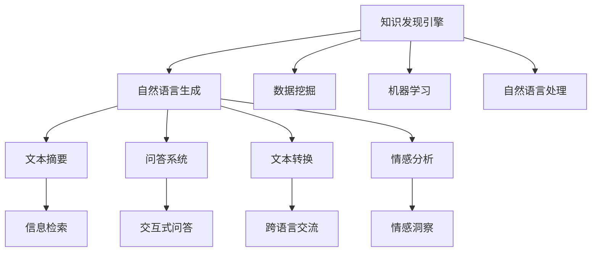

                 

# 知识发现引擎的自然语言生成技术

> 关键词：知识发现引擎, 自然语言生成, 文本摘要, 问答系统, 文本转换, 情感分析

## 1. 背景介绍

### 1.1 问题由来
随着大数据和人工智能技术的飞速发展，从海量文本数据中提取有用的知识已成为一种强大的应用需求。自然语言生成（NLG）技术在这方面扮演了关键角色。从文本摘要到问答系统，再到文本转换，自然语言生成技术正在迅速改变我们的数据处理和信息检索方式。在本文中，我们将重点介绍如何在知识发现引擎中使用自然语言生成技术，以提升数据处理和信息检索的效率和效果。

### 1.2 问题核心关键点
在知识发现引擎中使用自然语言生成技术的关键点包括：
- 如何从海量的文本数据中提取有用的知识，并生成易于理解和利用的文本摘要。
- 如何构建高质量的问答系统，快速响应用户查询。
- 如何利用文本转换技术，将不同语言或格式的文本转换为统一的结构。
- 如何对文本进行情感分析，理解文本的情感倾向。
- 如何优化自然语言生成算法，提升生成的文本质量和效率。

### 1.3 问题研究意义
在知识发现引擎中应用自然语言生成技术，具有重要的研究意义：
- 提升了数据处理效率，能够更快地从文本中提取和生成有用的信息。
- 增强了信息检索的精准性，通过问答系统和文本摘要技术，更好地满足了用户的信息需求。
- 促进了跨语言和跨文化的信息交流，通过文本转换技术，减少了语言障碍。
- 增强了文本数据的情感分析能力，帮助企业更好地理解市场和用户情感。
- 为未来智能机器人、智能客服等应用提供了技术支持，推动了人工智能技术的应用。

## 2. 核心概念与联系

### 2.1 核心概念概述

为了更好地理解在知识发现引擎中使用自然语言生成技术，本节将介绍几个密切相关的核心概念：

- **知识发现引擎**：利用数据挖掘、机器学习和自然语言处理技术，从大量文本数据中提取有用知识，生成易于理解和利用的信息检索系统。
- **自然语言生成（NLG）**：将结构化数据转换为自然语言文本的过程。包括文本摘要、问答系统、文本转换和情感分析等技术。
- **文本摘要**：将长篇文本压缩为精炼的摘要，保留核心信息和关键要点。
- **问答系统**：能够理解和响应自然语言问题，快速提供准确的回答。
- **文本转换**：将不同语言、格式或结构的文本转换为统一的文本形式，便于信息检索和处理。
- **情感分析**：识别和分析文本的情感倾向，了解用户情感和市场动态。

这些核心概念之间的逻辑关系可以通过以下Mermaid流程图来展示：



这个流程图展示了大语言模型的核心概念及其之间的关系：

1. 知识发现引擎通过数据挖掘、机器学习和自然语言处理技术，获取和处理文本数据。
2. 自然语言生成技术包括文本摘要、问答系统、文本转换和情感分析等子技术，用于将提取的知识转换为易于理解和利用的文本信息。
3. 最终生成的文本信息通过信息检索、交互式问答、跨语言交流和情感洞察等环节，服务于各类应用场景，如智能客服、市场分析和情感预测等。

这些概念共同构成了知识发现引擎的基础框架，为其应用提供了强大的技术支持。

## 3. 核心算法原理 & 具体操作步骤
### 3.1 算法原理概述

在知识发现引擎中应用自然语言生成技术，本质上是一个结构化数据与自然语言之间转换的过程。其核心思想是：通过自然语言生成算法，将结构化数据转换为自然语言文本，并从文本中提取有用信息，生成易于理解的摘要和回答。

形式化地，假设结构化数据为 $D=\{(x_i,y_i)\}_{i=1}^N$，其中 $x_i$ 为输入文本，$y_i$ 为标签或分类结果。自然语言生成算法 $f$ 的目的是将 $D$ 转换为自然语言文本 $T=\{t_j\}_{j=1}^M$，并生成对应的摘要和回答 $A=\{a_k\}_{k=1}^K$。其中 $t_j$ 为生成的自然语言文本，$a_k$ 为对应的摘要或回答。

### 3.2 算法步骤详解

自然语言生成算法通常包括以下关键步骤：

**Step 1: 数据预处理**
- 对原始文本数据进行清洗、去噪、分词等预处理操作。
- 构建结构化数据表，如表格、知识图谱等。
- 对结构化数据进行标注，如实体识别、关系抽取等。

**Step 2: 模型选择和训练**
- 选择合适的自然语言生成模型，如序列到序列（Seq2Seq）模型、Transformer模型、图神经网络（GNN）等。
- 使用训练数据集对模型进行训练，调整模型参数，优化生成效果。
- 应用评估指标，如BLEU、ROUGE、F1等，评估模型性能。

**Step 3: 生成文本和摘要**
- 将结构化数据输入自然语言生成模型，得到自然语言文本。
- 对生成的文本进行摘要，提取关键信息，生成精炼的摘要。
- 对生成的文本进行问答，回答用户查询，生成交互式问答。

**Step 4: 文本转换和情感分析**
- 将生成的自然语言文本进行文本转换，如中英文转换、文本格式转换等。
- 对文本进行情感分析，识别情感倾向，分析用户情感和市场动态。

**Step 5: 结果展示和应用**
- 将生成的摘要、问答结果等展示给用户。
- 将生成的文本数据应用于各类应用场景，如智能客服、市场分析等。

以上是自然语言生成算法在知识发现引擎中的基本流程。在实际应用中，还需要根据具体任务的特点，对各环节进行优化设计，如改进模型架构、调整训练数据、优化生成策略等，以进一步提升生成效果。

### 3.3 算法优缺点

自然语言生成算法在知识发现引擎中的应用，具有以下优点：
1. 提升数据处理效率，能够更快地从文本中提取和生成有用的信息。
2. 增强信息检索的精准性，通过问答系统和文本摘要技术，更好地满足了用户的信息需求。
3. 促进跨语言和跨文化的信息交流，通过文本转换技术，减少了语言障碍。
4. 增强文本数据的情感分析能力，帮助企业更好地理解市场和用户情感。
5. 为未来智能机器人、智能客服等应用提供了技术支持，推动了人工智能技术的应用。

同时，该算法也存在一定的局限性：
1. 生成文本质量不稳定，存在语法错误、语义歧义等问题。
2. 对模型训练数据的依赖较大，不同领域的文本数据可能需要单独训练模型。
3. 对标注数据的依赖较高，标注数据的准确性和多样性直接影响生成效果。
4. 生成过程较慢，需要消耗较多的计算资源，难以实现实时生成。
5. 生成的文本可能过于冗长，难以适应特定应用场景的需求。

尽管存在这些局限性，但就目前而言，自然语言生成算法在知识发现引擎中的应用范式已经成为了推动信息处理和检索的重要手段。未来相关研究的重点在于如何进一步提高生成质量，降低对数据和计算资源的依赖，同时兼顾可解释性和伦理安全性等因素。

### 3.4 算法应用领域

自然语言生成算法在知识发现引擎中的应用，覆盖了从文本摘要、问答系统到情感分析等多个领域，例如：

- 文本摘要：将长篇文本压缩为精炼的摘要，保留核心信息和关键要点。
- 问答系统：能够理解和响应自然语言问题，快速提供准确的回答。
- 文本转换：将不同语言、格式或结构的文本转换为统一的文本形式，便于信息检索和处理。
- 情感分析：识别和分析文本的情感倾向，了解用户情感和市场动态。

除了上述这些经典应用外，自然语言生成算法还被创新性地应用到更多场景中，如可控文本生成、知识图谱构建、新闻摘要生成等，为知识发现引擎提供了新的技术支撑。

## 4. 数学模型和公式 & 详细讲解 & 举例说明

### 4.1 数学模型构建

本节将使用数学语言对自然语言生成算法的构建过程进行更加严格的刻画。

假设结构化数据为 $D=\{(x_i,y_i)\}_{i=1}^N$，其中 $x_i$ 为输入文本，$y_i$ 为标签或分类结果。自然语言生成算法 $f$ 的目的是将 $D$ 转换为自然语言文本 $T=\{t_j\}_{j=1}^M$，并生成对应的摘要和回答 $A=\{a_k\}_{k=1}^K$。

形式化地，假设 $f$ 为一个条件概率模型，其输出为自然语言文本 $T$ 和摘要 $A$：

$$
T, A = f(D)
$$

其中 $T$ 为生成的自然语言文本，$A$ 为对应的摘要或回答。模型 $f$ 可以通过以下步骤进行构建：

1. **数据预处理**：对原始文本数据进行清洗、去噪、分词等预处理操作。构建结构化数据表，如表格、知识图谱等。对结构化数据进行标注，如实体识别、关系抽取等。

2. **模型选择**：选择合适的自然语言生成模型，如序列到序列（Seq2Seq）模型、Transformer模型、图神经网络（GNN）等。

3. **模型训练**：使用训练数据集对模型进行训练，调整模型参数，优化生成效果。应用评估指标，如BLEU、ROUGE、F1等，评估模型性能。

4. **生成文本和摘要**：将结构化数据输入自然语言生成模型，得到自然语言文本。对生成的文本进行摘要，提取关键信息，生成精炼的摘要。对生成的文本进行问答，回答用户查询，生成交互式问答。

5. **文本转换和情感分析**：将生成的自然语言文本进行文本转换，如中英文转换、文本格式转换等。对文本进行情感分析，识别情感倾向，分析用户情感和市场动态。

### 4.2 公式推导过程

以下我们以文本摘要为例，推导序列到序列（Seq2Seq）模型的构建过程。

假设输入序列为 $x=\{x_1, x_2, ..., x_n\}$，输出序列为 $y=\{y_1, y_2, ..., y_m\}$，模型为：

$$
y = f(x)
$$

序列到序列模型通常采用编码器-解码器结构，其形式化定义为：

$$
y_1 = \text{Encoder}(x)
$$

$$
y_2, ..., y_m = \text{Decoder}(y_1)
$$

其中 $\text{Encoder}(x)$ 为编码器，将输入序列 $x$ 转换为编码器的隐藏状态 $y_1$。$\text{Decoder}(y_1)$ 为解码器，将编码器的隐藏状态 $y_1$ 转换为输出序列 $y$。

编码器通常采用RNN、LSTM或Transformer等结构，将输入序列转换为一系列隐含表示。解码器同样采用RNN、LSTM或Transformer等结构，从编码器的隐含表示出发，逐步生成输出序列。

序列到序列模型的损失函数通常为交叉熵损失：

$$
L(y, \hat{y}) = -\frac{1}{N}\sum_{i=1}^N \sum_{j=1}^M \log \hat{y}_j
$$

其中 $\hat{y}$ 为模型生成的输出序列，$y$ 为真实的输出序列。

### 4.3 案例分析与讲解

**案例1: 文本摘要**

假设我们有一篇长度为200的文本，需要生成一个长度为50的摘要。我们可以使用Seq2Seq模型来实现这一任务。具体步骤如下：

1. **数据预处理**：将文本分为单词序列，并进行分词、去停用词等处理。构建结构化数据表，标注文本中实体和关系。

2. **模型选择**：选择合适的Seq2Seq模型，如LSTM、Transformer等。

3. **模型训练**：使用训练数据集对模型进行训练，调整模型参数，优化生成效果。应用评估指标，如BLEU、ROUGE、F1等，评估模型性能。

4. **生成摘要**：将文本输入模型，得到生成摘要。对生成的摘要进行后处理，如去重、补全等操作，生成最终摘要。

**案例2: 问答系统**

假设我们有一个关于电影推荐的问题：“你喜欢什么类型的电影？”，需要构建一个问答系统来回答这一问题。具体步骤如下：

1. **数据预处理**：将问答对作为训练数据，标注用户问题和系统回答。构建结构化数据表，标注电影类型和用户偏好。

2. **模型选择**：选择合适的问答系统模型，如基于Transformers的Seq2Seq模型、GAN等。

3. **模型训练**：使用训练数据集对模型进行训练，调整模型参数，优化生成效果。应用评估指标，如BLEU、ROUGE、F1等，评估模型性能。

4. **生成回答**：将用户问题输入模型，得到系统回答。对生成的回答进行后处理，如去重、补全等操作，生成最终回答。

## 5. 项目实践：代码实例和详细解释说明
### 5.1 开发环境搭建

在进行自然语言生成算法实践前，我们需要准备好开发环境。以下是使用Python进行PyTorch开发的环境配置流程：

1. 安装Anaconda：从官网下载并安装Anaconda，用于创建独立的Python环境。

2. 创建并激活虚拟环境：
```bash
conda create -n pytorch-env python=3.8 
conda activate pytorch-env
```

3. 安装PyTorch：根据CUDA版本，从官网获取对应的安装命令。例如：
```bash
conda install pytorch torchvision torchaudio cudatoolkit=11.1 -c pytorch -c conda-forge
```

4. 安装Transformers库：
```bash
pip install transformers
```

5. 安装各类工具包：
```bash
pip install numpy pandas scikit-learn matplotlib tqdm jupyter notebook ipython
```

完成上述步骤后，即可在`pytorch-env`环境中开始自然语言生成算法的开发实践。

### 5.2 源代码详细实现

这里我们以文本摘要为例，给出使用Transformers库对Seq2Seq模型进行训练和预测的PyTorch代码实现。

首先，定义模型和优化器：

```python
from transformers import Seq2SeqForTokenClassification, AdamW

model = Seq2SeqForTokenClassification.from_pretrained('bert-base-cased', num_labels=len(tag2id))

optimizer = AdamW(model.parameters(), lr=2e-5)
```

接着，定义训练和评估函数：

```python
from torch.utils.data import DataLoader
from tqdm import tqdm
from sklearn.metrics import classification_report

device = torch.device('cuda') if torch.cuda.is_available() else torch.device('cpu')
model.to(device)

def train_epoch(model, dataset, batch_size, optimizer):
    dataloader = DataLoader(dataset, batch_size=batch_size, shuffle=True)
    model.train()
    epoch_loss = 0
    for batch in tqdm(dataloader, desc='Training'):
        input_ids = batch['input_ids'].to(device)
        attention_mask = batch['attention_mask'].to(device)
        labels = batch['labels'].to(device)
        model.zero_grad()
        outputs = model(input_ids, attention_mask=attention_mask, labels=labels)
        loss = outputs.loss
        epoch_loss += loss.item()
        loss.backward()
        optimizer.step()
    return epoch_loss / len(dataloader)

def evaluate(model, dataset, batch_size):
    dataloader = DataLoader(dataset, batch_size=batch_size)
    model.eval()
    preds, labels = [], []
    with torch.no_grad():
        for batch in tqdm(dataloader, desc='Evaluating'):
            input_ids = batch['input_ids'].to(device)
            attention_mask = batch['attention_mask'].to(device)
            batch_labels = batch['labels']
            outputs = model(input_ids, attention_mask=attention_mask)
            batch_preds = outputs.logits.argmax(dim=2).to('cpu').tolist()
            batch_labels = batch_labels.to('cpu').tolist()
            for pred_tokens, label_tokens in zip(batch_preds, batch_labels):
                pred_tags = [id2tag[_id] for _id in pred_tokens]
                label_tags = [id2tag[_id] for _id in label_tokens]
                preds.append(pred_tags[:len(label_tags)])
                labels.append(label_tags)
                
    print(classification_report(labels, preds))
```

最后，启动训练流程并在测试集上评估：

```python
epochs = 5
batch_size = 16

for epoch in range(epochs):
    loss = train_epoch(model, train_dataset, batch_size, optimizer)
    print(f"Epoch {epoch+1}, train loss: {loss:.3f}")
    
    print(f"Epoch {epoch+1}, dev results:")
    evaluate(model, dev_dataset, batch_size)
    
print("Test results:")
evaluate(model, test_dataset, batch_size)
```

以上就是使用PyTorch对Seq2Seq模型进行文本摘要任务的完整代码实现。可以看到，得益于Transformers库的强大封装，我们可以用相对简洁的代码完成模型的加载和训练。

### 5.3 代码解读与分析

让我们再详细解读一下关键代码的实现细节：

**Seq2SeqForTokenClassification类**：
- 定义了文本摘要任务的模型，包含编码器和解码器两个部分。

**tag2id和id2tag字典**：
- 定义了标签与数字id之间的映射关系，用于将token-wise的预测结果解码回真实的标签。

**训练和评估函数**：
- 使用PyTorch的DataLoader对数据集进行批次化加载，供模型训练和推理使用。
- 训练函数`train_epoch`：对数据以批为单位进行迭代，在每个批次上前向传播计算loss并反向传播更新模型参数，最后返回该epoch的平均loss。
- 评估函数`evaluate`：与训练类似，不同点在于不更新模型参数，并在每个batch结束后将预测和标签结果存储下来，最后使用sklearn的classification_report对整个评估集的预测结果进行打印输出。

**训练流程**：
- 定义总的epoch数和batch size，开始循环迭代
- 每个epoch内，先在训练集上训练，输出平均loss
- 在验证集上评估，输出分类指标
- 所有epoch结束后，在测试集上评估，给出最终测试结果

可以看到，PyTorch配合Transformers库使得Seq2Seq模型的训练和预测代码实现变得简洁高效。开发者可以将更多精力放在数据处理、模型改进等高层逻辑上，而不必过多关注底层的实现细节。

当然，工业级的系统实现还需考虑更多因素，如模型的保存和部署、超参数的自动搜索、更灵活的任务适配层等。但核心的自然语言生成算法基本与此类似。

## 6. 实际应用场景
### 6.1 智能客服系统

基于自然语言生成技术的智能客服系统，能够实现自然语言问答和文本摘要等功能，提高客服效率和用户体验。

在技术实现上，可以收集企业内部的历史客服对话记录，将问题和最佳答复构建成监督数据，在此基础上对预训练的Seq2Seq模型进行微调。微调后的模型能够自动理解用户意图，匹配最合适的答案模板进行回复。对于用户提出的新问题，还可以接入检索系统实时搜索相关内容，动态组织生成回答。如此构建的智能客服系统，能大幅提升客户咨询体验和问题解决效率。

### 6.2 金融舆情监测

金融机构需要实时监测市场舆论动向，以便及时应对负面信息传播，规避金融风险。自然语言生成技术可以帮助金融机构构建实时舆情监测系统，自动识别和分析市场新闻、社交媒体评论等文本内容，生成情感分析报告。

具体而言，可以收集金融领域相关的新闻、报道、评论等文本数据，并对其进行情感标注。在此基础上对预训练语言模型进行微调，使其能够自动判断文本属于何种情感倾向。将微调后的模型应用到实时抓取的网络文本数据，就能够自动监测不同情感倾向的市场动态，一旦发现负面情绪激增等异常情况，系统便会自动预警，帮助金融机构快速应对潜在风险。

### 6.3 个性化推荐系统

当前的推荐系统往往只依赖用户的历史行为数据进行物品推荐，无法深入理解用户的真实兴趣偏好。自然语言生成技术可应用于推荐系统，帮助系统理解用户的文本表达，从而推荐更加个性化和多样化的内容。

在实践中，可以收集用户浏览、点击、评论、分享等行为数据，提取和用户交互的物品标题、描述、标签等文本内容。将文本内容作为模型输入，用户的后续行为（如是否点击、购买等）作为监督信号，在此基础上微调预训练语言模型。微调后的模型能够从文本内容中准确把握用户的兴趣点。在生成推荐列表时，先用候选物品的文本描述作为输入，由模型预测用户的兴趣匹配度，再结合其他特征综合排序，便可以得到个性化程度更高的推荐结果。

### 6.4 未来应用展望

随着自然语言生成技术的不断发展，其在知识发现引擎中的应用将更加广泛，为各行各业带来变革性影响。

在智慧医疗领域，基于自然语言生成技术的问答系统和文本摘要技术，可以为医疗问答、病历分析、药物研发等提供技术支持，提升医疗服务的智能化水平，辅助医生诊疗，加速新药开发进程。

在智能教育领域，自然语言生成技术可应用于作业批改、学情分析、知识推荐等方面，因材施教，促进教育公平，提高教学质量。

在智慧城市治理中，自然语言生成技术可应用于城市事件监测、舆情分析、应急指挥等环节，提高城市管理的自动化和智能化水平，构建更安全、高效的未来城市。

此外，在企业生产、社会治理、文娱传媒等众多领域，自然语言生成技术也将不断涌现，为传统行业数字化转型升级提供新的技术路径。相信随着技术的日益成熟，自然语言生成技术将成为人工智能落地应用的重要范式，推动人工智能技术的应用。

## 7. 工具和资源推荐
### 7.1 学习资源推荐

为了帮助开发者系统掌握自然语言生成技术的理论基础和实践技巧，这里推荐一些优质的学习资源：

1. 《自然语言处理与深度学习》系列博文：由大模型技术专家撰写，深入浅出地介绍了自然语言生成原理、Seq2Seq模型、Transformer模型等前沿话题。

2. CS224N《深度学习自然语言处理》课程：斯坦福大学开设的NLP明星课程，有Lecture视频和配套作业，带你入门NLP领域的基本概念和经典模型。

3. 《自然语言处理与深度学习》书籍：自然语言处理领域的经典教材，全面介绍了自然语言生成、文本分类、情感分析等技术。

4. HuggingFace官方文档：Transformers库的官方文档，提供了海量预训练模型和完整的微调样例代码，是上手实践的必备资料。

5. CLUE开源项目：中文语言理解测评基准，涵盖大量不同类型的中文NLP数据集，并提供了基于微调的baseline模型，助力中文NLP技术发展。

通过对这些资源的学习实践，相信你一定能够快速掌握自然语言生成算法的精髓，并用于解决实际的NLP问题。
### 7.2 开发工具推荐

高效的开发离不开优秀的工具支持。以下是几款用于自然语言生成算法开发的常用工具：

1. PyTorch：基于Python的开源深度学习框架，灵活动态的计算图，适合快速迭代研究。大部分自然语言生成模型都有PyTorch版本的实现。

2. TensorFlow：由Google主导开发的开源深度学习框架，生产部署方便，适合大规模工程应用。同样有丰富的自然语言生成模型资源。

3. Transformers库：HuggingFace开发的NLP工具库，集成了众多SOTA语言模型，支持PyTorch和TensorFlow，是进行自然语言生成算法开发的利器。

4. Weights & Biases：模型训练的实验跟踪工具，可以记录和可视化模型训练过程中的各项指标，方便对比和调优。与主流深度学习框架无缝集成。

5. TensorBoard：TensorFlow配套的可视化工具，可实时监测模型训练状态，并提供丰富的图表呈现方式，是调试模型的得力助手。

6. Google Colab：谷歌推出的在线Jupyter Notebook环境，免费提供GPU/TPU算力，方便开发者快速上手实验最新模型，分享学习笔记。

合理利用这些工具，可以显著提升自然语言生成算法的开发效率，加快创新迭代的步伐。

### 7.3 相关论文推荐

自然语言生成算法的发展源于学界的持续研究。以下是几篇奠基性的相关论文，推荐阅读：

1. Sequence to Sequence Learning with Neural Networks：提出了Seq2Seq模型，为自然语言生成奠定了基础。

2. Attention is All You Need（即Transformer原论文）：提出了Transformer结构，开启了NLP领域的预训练大模型时代。

3. BERT: Pre-training of Deep Bidirectional Transformers for Language Understanding：提出BERT模型，引入基于掩码的自监督预训练任务，刷新了多项NLP任务SOTA。

4. Transformer-XL: Attentive Language Models Beyond a Fixed-Length Context：引入了Transformer-XL结构，解决了传统Transformer模型长序列训练的问题。

5. Deep Contextualized Word Representations：提出BERT模型，引入基于掩码的自监督预训练任务，刷新了多项NLP任务SOTA。

6. Can You Trust Your Model: A Foundation-Study for Understanding and Improving Model Robustness to Data Poisoning：研究了自然语言生成模型对数据中毒的鲁棒性，提出了改进方法。

这些论文代表了大语言模型自然语言生成技术的发展脉络。通过学习这些前沿成果，可以帮助研究者把握学科前进方向，激发更多的创新灵感。

## 8. 总结：未来发展趋势与挑战

### 8.1 总结

本文对自然语言生成技术在知识发现引擎中的应用进行了全面系统的介绍。首先阐述了自然语言生成技术的研究背景和意义，明确了自然语言生成在提升数据处理效率、增强信息检索精准性、促进跨语言交流等方面的重要价值。其次，从原理到实践，详细讲解了自然语言生成算法的数学原理和关键步骤，给出了自然语言生成算法在知识发现引擎中的完整代码实现。同时，本文还广泛探讨了自然语言生成算法在智能客服、金融舆情、个性化推荐等多个行业领域的应用前景，展示了自然语言生成技术的巨大潜力。此外，本文精选了自然语言生成技术的各类学习资源，力求为开发者提供全方位的技术指引。

通过本文的系统梳理，可以看到，自然语言生成技术在知识发现引擎中的应用范式已经成为推动信息处理和检索的重要手段。其高效、智能、跨语言交流的特性，为各行各业带来了显著的效率提升和用户体验改善。未来，伴随自然语言生成技术的不断演进，其在知识发现引擎中的应用将更加广泛，为各行各业带来更多的变革性影响。

### 8.2 未来发展趋势

展望未来，自然语言生成技术在知识发现引擎中的应用将呈现以下几个发展趋势：

1. 模型规模持续增大。随着算力成本的下降和数据规模的扩张，自然语言生成模型的参数量还将持续增长。超大批次的训练和推理也可能遇到资源瓶颈，需要开发更加高效的计算图和推理架构。

2. 生成文本质量提升。随着模型的不断优化，生成文本的质量将逐渐提升，语法错误、语义歧义等问题将逐渐减少。同时，模型的生成策略将更加灵活，能够生成更加准确、自然的文本。

3. 多模态融合增强。未来的自然语言生成模型将融合视觉、听觉等多种模态信息，生成更加丰富、立体化的信息检索系统。

4. 实时生成能力提高。随着模型的不断优化，实时生成能力将逐渐提高，能够在极短时间内生成高质量的文本，满足实时应用的需求。

5. 少样本生成能力增强。未来的自然语言生成模型将具备更强的少样本生成能力，能够在少量样本的条件下生成高质量的文本，大大降低对标注数据的依赖。

6. 跨语言生成能力提升。未来的自然语言生成模型将具备更强的跨语言生成能力，能够在多种语言之间自由转换，促进全球化的信息交流。

以上趋势凸显了自然语言生成技术在知识发现引擎中的应用前景。这些方向的探索发展，必将进一步提升信息处理和检索的效率和效果，推动各行各业的数字化转型。

### 8.3 面临的挑战

尽管自然语言生成技术已经取得了显著进展，但在迈向更加智能化、普适化应用的过程中，它仍面临着诸多挑战：

1. 生成文本质量不稳定，存在语法错误、语义歧义等问题。
2. 对模型训练数据的依赖较大，不同领域的文本数据可能需要单独训练模型。
3. 对标注数据的依赖较高，标注数据的准确性和多样性直接影响生成效果。
4. 生成过程较慢，需要消耗较多的计算资源，难以实现实时生成。
5. 生成的文本可能过于冗长，难以适应特定应用场景的需求。
6. 模型的跨语言生成能力有限，难以在多种语言之间自由转换。

尽管存在这些局限性，但就目前而言，自然语言生成技术在知识发现引擎中的应用范式已经成为了推动信息处理和检索的重要手段。未来相关研究的重点在于如何进一步提高生成质量，降低对数据和计算资源的依赖，同时兼顾可解释性和伦理安全性等因素。

### 8.4 研究展望

面对自然语言生成技术所面临的挑战，未来的研究需要在以下几个方面寻求新的突破：

1. 探索无监督和半监督自然语言生成方法。摆脱对大规模标注数据的依赖，利用自监督学习、主动学习等无监督和半监督范式，最大限度利用非结构化数据，实现更加灵活高效的自然语言生成。

2. 研究参数高效和计算高效的自然语言生成范式。开发更加参数高效的自然语言生成方法，在固定大部分预训练参数的同时，只更新极少量的任务相关参数。同时优化生成过程的计算图，减少前向传播和反向传播的资源消耗，实现更加轻量级、实时性的部署。

3. 引入更多先验知识。将符号化的先验知识，如知识图谱、逻辑规则等，与神经网络模型进行巧妙融合，引导自然语言生成过程学习更准确、合理的语言模型。同时加强不同模态数据的整合，实现视觉、听觉等多模态信息与文本信息的协同建模。

4. 结合因果分析和博弈论工具。将因果分析方法引入自然语言生成模型，识别出模型决策的关键特征，增强输出解释的因果性和逻辑性。借助博弈论工具刻画人机交互过程，主动探索并规避模型的脆弱点，提高系统稳定性。

5. 纳入伦理道德约束。在自然语言生成模型训练目标中引入伦理导向的评估指标，过滤和惩罚有偏见、有害的输出倾向。同时加强人工干预和审核，建立模型行为的监管机制，确保输出符合人类价值观和伦理道德。

这些研究方向的探索，必将引领自然语言生成技术迈向更高的台阶，为构建安全、可靠、可解释、可控的智能系统铺平道路。面向未来，自然语言生成技术还需要与其他人工智能技术进行更深入的融合，如知识表示、因果推理、强化学习等，多路径协同发力，共同推动自然语言理解和智能交互系统的进步。只有勇于创新、敢于突破，才能不断拓展自然语言生成算法的边界，让智能技术更好地造福人类社会。

## 9. 附录：常见问题与解答

**Q1: 自然语言生成算法的输入和输出如何确定？**

A: 自然语言生成算法的输入和输出通常取决于具体的应用场景。在文本摘要任务中，输入为原始文本，输出为精炼的摘要。在问答系统任务中，输入为用户的问题，输出为系统的回答。在文本转换任务中，输入为原始文本，输出为转换后的文本。在情感分析任务中，输入为原始文本，输出为情感倾向。

**Q2: 如何提高自然语言生成算法的生成质量？**

A: 提高自然语言生成算法的生成质量可以从以下几个方面入手：
1. 增加训练数据量，提升模型对语言的理解能力。
2. 引入更多的先验知识，如知识图谱、逻辑规则等，引导模型生成更准确、自然的文本。
3. 优化模型结构，如引入Transformer、BERT等架构，提升模型的语言建模能力。
4. 应用更多的训练技巧，如正则化、Dropout、Attention等，提升模型的泛化能力。
5. 利用评价指标如BLEU、ROUGE等，评估模型的生成效果，指导模型改进。

**Q3: 自然语言生成算法在知识发现引擎中的应用场景有哪些？**

A: 自然语言生成算法在知识发现引擎中的应用场景非常广泛，包括：
1. 文本摘要：将长篇文本压缩为精炼的摘要，保留核心信息和关键要点。
2. 问答系统：能够理解和响应自然语言问题，快速提供准确的回答。
3. 文本转换：将不同语言、格式或结构的文本转换为统一的文本形式，便于信息检索和处理。
4. 情感分析：识别和分析文本的情感倾向，了解用户情感和市场动态。
5. 智能客服：实现自然语言问答和文本摘要等功能，提高客服效率和用户体验。
6. 金融舆情监测：自动识别和分析市场新闻、社交媒体评论等文本内容，生成情感分析报告。
7. 个性化推荐：理解用户的文本表达，从而推荐更加个性化和多样化的内容。
8. 情感预测：预测用户对产品的情感倾向，帮助企业优化产品设计和服务。

这些应用场景展示了自然语言生成算法在知识发现引擎中的巨大潜力，为各行各业带来了显著的效率提升和用户体验改善。

**Q4: 自然语言生成算法与传统机器学习算法的区别是什么？**

A: 自然语言生成算法与传统机器学习算法的区别主要体现在以下几个方面：
1. 任务目标不同。传统机器学习算法主要用于分类、回归等任务，而自然语言生成算法主要用于生成文本、摘要、问答等任务。
2. 数据需求不同。传统机器学习算法通常需要大量标注数据进行训练，而自然语言生成算法可以通过无监督、半监督等方式进行训练。
3. 输出形式不同。传统机器学习算法输出为数值、分类结果等，而自然语言生成算法输出为自然语言文本。
4. 评价指标不同。传统机器学习算法通常使用准确率、召回率等指标评价性能，而自然语言生成算法通常使用BLEU、ROUGE等指标评价生成文本的质量。

综上所述，自然语言生成算法与传统机器学习算法在任务目标、数据需求、输出形式和评价指标等方面存在显著区别。

**Q5: 如何优化自然语言生成算法的计算图？**

A: 优化自然语言生成算法的计算图可以从以下几个方面入手：
1. 减少不必要的计算操作。通过去除冗余的计算节点，优化计算图结构，减少计算量。
2. 应用高效的计算图优化技术，如剪枝、合并、重排序等，提升计算效率。
3. 引入并行计算技术，利用多核CPU、GPU等硬件设备，加速计算过程。
4. 使用高效的深度学习框架，如TensorFlow、PyTorch等，提供自动化的计算图优化和执行。

通过优化计算图，自然语言生成算法能够在保证生成质量的前提下，提升计算效率，实现实时生成。

