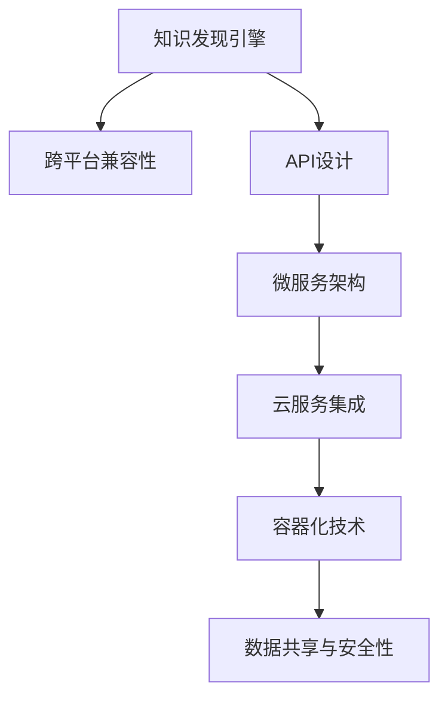

                 

# 知识发现引擎的跨平台兼容性

> 关键词：知识发现引擎,跨平台,兼容,API,微服务,云服务,容器化,数据共享,安全性

## 1. 背景介绍

### 1.1 问题由来

在现代数据驱动的业务环境中，企业对于知识发现的需求日益强烈。传统的知识发现方法依赖于结构化数据和专家经验，往往难以应对复杂多变的数据形态和场景需求。为了适应这一挑战，数据科学家和工程师们逐渐转向使用更灵活、智能的知识发现引擎。这些引擎依托先进的数据处理和机器学习技术，能够自动化地从海量数据中提取有价值的信息，支撑企业决策和运营。

然而，随着知识发现应用的扩展，跨平台兼容性问题也逐渐显现出来。数据来源于各个异构的业务系统，知识发现引擎需要能与不同的平台无缝对接，才能充分发挥其价值。而传统知识发现引擎往往存在兼容性问题，难以满足跨平台的应用需求。

### 1.2 问题核心关键点

- **跨平台兼容性**：知识发现引擎能够同时支持多种操作系统、编程语言和硬件环境。
- **API设计**：简单易用的API接口，使得数据接入和模型调用更加灵活高效。
- **微服务架构**：通过微服务设计，知识发现引擎能够实现按需部署和弹性扩展。
- **云服务集成**：利用云平台提供的服务和资源，支持分布式数据处理和高可用性。
- **容器化技术**：通过Docker等容器技术，知识发现引擎的部署和迁移更加方便。
- **数据共享与安全性**：保障数据在跨平台间的安全共享，防止数据泄露和滥用。

### 1.3 问题研究意义

研究知识发现引擎的跨平台兼容性，对于拓展知识发现应用的广度和深度，提升企业决策的科学性和准确性，具有重要意义：

- 提高灵活性和适应性：跨平台兼容的知识发现引擎能够更好地适配不同的业务环境，提升企业对复杂场景的应对能力。
- 降低开发和维护成本：统一的平台标准和API接口，减少了技术栈的复杂性和维护难度，提高了开发效率。
- 促进数据集成与共享：跨平台兼容的知识发现引擎能够整合不同来源的数据，促进数据共享和协作。
- 增强安全性和可靠性：通过标准化的安全性设计和机制，保障数据在跨平台传输和存储过程中的安全性。

## 2. 核心概念与联系

### 2.1 核心概念概述

为了更好地理解跨平台兼容的知识发现引擎，本节将介绍几个核心概念及其相互关系：

- **知识发现引擎(Knowledge Discovery Engine, KDE)**：通过数据挖掘和机器学习技术，从数据中自动提取知识的过程。常用的KDE技术包括关联规则挖掘、分类、聚类等。

- **跨平台兼容性(Cross-Platform Compatibility, CPC)**：知识发现引擎能够在不同平台和环境中正常运行，提供一致的功能和服务。

- **API设计(API Design)**：通过标准化的API接口，知识发现引擎能够与各种外部系统和组件进行通信，实现数据接入和模型调用。

- **微服务架构(Microservices Architecture)**：通过将知识发现引擎拆分为多个独立服务，每个服务专注于特定功能，实现按需部署和弹性扩展。

- **云服务集成(Cloud Service Integration)**：利用云平台提供的各种服务和资源，实现知识发现引擎的高效、稳定部署。

- **容器化技术(Containerization)**：通过Docker等容器技术，知识发现引擎的部署和迁移更加灵活和快速。

- **数据共享与安全性(Data Sharing and Security)**：在跨平台间安全共享数据，防止数据泄露和滥用。

这些核心概念之间的逻辑关系可以通过以下Mermaid流程图来展示：



这个流程图展示了大语言模型的核心概念及其之间的关系：

1. 知识发现引擎通过跨平台兼容性，能够在各种平台环境中运行。
2. 通过API设计，实现与其他系统的数据交互和功能调用。
3. 通过微服务架构，提升系统的可扩展性和灵活性。
4. 利用云服务集成，实现分布式计算和高可用性。
5. 通过容器化技术，便于知识发现引擎的快速部署和迁移。
6. 保障数据共享与安全性，确保数据在跨平台传输中的完整和隐私。

## 3. 核心算法原理 & 具体操作步骤

### 3.1 算法原理概述

知识发现引擎的跨平台兼容性，本质上是构建一个灵活、高效、可扩展的系统架构，使系统能够在多种平台上无缝集成和运行。其核心思想是通过标准化的接口和服务设计，屏蔽不同平台间的差异，实现系统的通用性和兼容性。

具体来说，知识发现引擎的跨平台兼容性涉及以下几个方面：

- **数据接入标准化**：通过定义标准化的数据格式和API接口，实现数据的跨平台接入和处理。
- **系统架构模块化**：将知识发现引擎拆分为多个独立的模块，每个模块负责特定功能，能够独立部署和扩展。
- **服务集成开放化**：通过开放的服务接口，支持与第三方系统和组件的集成，实现系统功能的扩展和升级。
- **安全性设计全面化**：通过全面的安全机制和策略，保障数据在跨平台传输和存储过程中的安全性。

### 3.2 算法步骤详解

以下是实现知识发现引擎跨平台兼容性的详细步骤：

**Step 1: 需求分析与设计**
- 定义知识发现引擎的业务需求和应用场景，明确跨平台兼容的要求和目标。
- 设计知识发现引擎的架构，确定功能模块和服务接口。
- 确定数据传输格式和加密机制，确保数据传输的安全性。

**Step 2: 数据接入标准化**
- 定义标准化的数据格式和API接口，支持多种数据源的接入和处理。
- 使用标准化的数据传输协议（如HTTP、REST等），实现数据的跨平台传输。
- 采用数据格式转换工具，将不同格式的数据转换为统一的格式。

**Step 3: 系统架构模块化**
- 将知识发现引擎拆分为多个独立的模块，每个模块负责特定功能。
- 每个模块能够独立部署和扩展，通过容器化技术实现快速部署和迁移。
- 使用微服务架构，实现系统的按需扩展和弹性扩展。

**Step 4: 服务集成开放化**
- 定义开放的服务接口，支持与第三方系统和组件的集成。
- 使用RESTful API或SOAP协议，实现服务间的通信和数据交换。
- 通过API网关或服务注册中心，实现服务的发现和管理。

**Step 5: 安全性设计全面化**
- 采用全面的安全机制，如SSL/TLS、OAuth等，保障数据传输的安全性。
- 使用身份认证和权限控制技术，确保系统的访问控制和数据隐私。
- 实施审计和日志记录，监控和追踪系统的行为，防止数据滥用和安全漏洞。

**Step 6: 测试与部署**
- 在多种平台上进行全面测试，验证跨平台兼容性和系统性能。
- 部署知识发现引擎到目标平台，确保系统的正常运行和稳定。
- 监控系统的运行状态，及时处理异常和问题，保障系统的持续运行。

### 3.3 算法优缺点

跨平台兼容的知识发现引擎具有以下优点：

- 灵活性和适应性强：能够在多种平台环境中运行，适应不同的业务需求和技术栈。
- 开发和维护成本低：统一的API接口和模块化设计，减少了技术栈的复杂性和维护难度。
- 数据共享和协作便捷：跨平台兼容的知识发现引擎能够整合不同来源的数据，促进数据共享和协作。
- 高可用性和可扩展性：微服务架构和云服务集成，提高了系统的可用性和可扩展性。

同时，该方法也存在一些局限性：

- 开发复杂度较高：跨平台兼容的知识发现引擎需要考虑多平台兼容性，增加了开发的复杂度。
- 性能和效率有待提升：跨平台兼容可能导致额外的数据传输和处理开销，影响系统性能。
- 安全性和隐私保护难度大：跨平台数据传输和安全机制设计复杂，容易存在安全漏洞和隐私问题。

尽管存在这些局限性，但跨平台兼容的知识发现引擎仍是大数据和智能决策系统的重要组成部分，其带来的灵活性和适应性使其在企业决策和运营中具有不可替代的作用。未来相关研究将继续关注如何进一步提升跨平台兼容性的性能和安全性，以及如何优化系统架构和开发流程。

### 3.4 算法应用领域

跨平台兼容的知识发现引擎在多个领域中得到了广泛应用，例如：

- **金融分析**：在金融领域，知识发现引擎能够从海量交易数据中提取有价值的信息，支持风险管理和投资决策。
- **医疗健康**：在医疗健康领域，知识发现引擎能够从电子病历和基因数据中提取知识，辅助诊断和治疗。
- **零售分析**：在零售领域，知识发现引擎能够从消费者行为数据中提取模式，支持销售策略和客户管理。
- **供应链管理**：在供应链管理中，知识发现引擎能够从供应链数据中提取关键信息，优化供应链流程和降低成本。
- **智能制造**：在智能制造中，知识发现引擎能够从生产数据中提取知识，支持生产优化和质量控制。

除了上述这些经典应用外，跨平台兼容的知识发现引擎也被创新性地应用到更多场景中，如智能推荐、内容推荐、市场分析等，为各行各业提供智能决策支持。

## 4. 数学模型和公式 & 详细讲解  
### 4.1 数学模型构建

本节将使用数学语言对跨平台兼容的知识发现引擎进行更加严格的刻画。

记知识发现引擎为 $KDE_{\theta}$，其中 $\theta$ 为模型参数。假设数据源 $D_i$ 为不同的平台，$i=1,2,...,N$。设 $KDE_{\theta}$ 在数据源 $D_i$ 上的数据接入函数为 $f_i$，则知识发现引擎在所有数据源上的数据接入函数为：

$$
f = \sum_{i=1}^N \alpha_if_i
$$

其中 $\alpha_i$ 为数据源 $D_i$ 的权重，控制各数据源对总体数据的贡献度。假设数据源 $D_i$ 的数据传输函数为 $t_i$，则知识发现引擎在所有数据源上的数据传输函数为：

$$
t = \sum_{i=1}^N \alpha_it_i
$$

知识发现引擎的模块化设计，可以通过以下数学模型表示：

$$
KDE_{\theta} = KDE_{\theta_1} \times KDE_{\theta_2} \times ... \times KDE_{\theta_n}
$$

其中 $KDE_{\theta_i}$ 为第 $i$ 个模块的模型参数，通过容器化技术实现独立部署和扩展。

### 4.2 公式推导过程

以下我们以金融分析任务为例，推导知识发现引擎的数学模型及其推导过程。

假设知识发现引擎在金融领域的应用中，需要接入来自银行、交易所、新闻网站等不同数据源的数据。设每个数据源的权重 $\alpha_i$ 和数据传输函数 $t_i$ 为已知，则知识发现引擎在所有数据源上的数据传输函数 $t$ 可表示为：

$$
t = \alpha_1t_1 + \alpha_2t_2 + ... + \alpha_Nt_N
$$

知识发现引擎在金融领域的核心功能是风险评估和投资策略优化，涉及分类、聚类、关联规则挖掘等技术。假设知识发现引擎使用了分类算法 $C_{\theta}$ 和聚类算法 $K_{\theta}$，则知识发现引擎在金融领域的总模型 $KDE_{\theta}$ 可以表示为：

$$
KDE_{\theta} = C_{\theta} \times K_{\theta} \times ... \times C_{\theta_m}
$$

其中 $C_{\theta_i}$ 和 $K_{\theta_i}$ 为分类和聚类算法的模型参数，通过微服务架构实现独立部署和扩展。

在实际应用中，知识发现引擎通过API接口接受来自不同数据源的数据，经过数据接入、传输和处理后，调用内部模型进行计算，输出分析结果。知识发现引擎的API接口定义如下：

```python
from flask import Flask, request, jsonify

app = Flask(__name__)

@app.route('/analyze', methods=['POST'])
def analyze():
    data = request.json
    features = data['features']
    weights = data['weights']
    results = {}
    for i in range(len(features)):
        result = kde_i.analyze(features[i], weights[i])
        results[i] = result
    return jsonify(results)
```

其中，`kde_i` 为知识发现引擎的第 $i$ 个模块。通过定义标准的API接口，知识发现引擎能够与各种外部系统和组件进行通信，实现数据的接入和模型的调用。

## 5. 项目实践：代码实例和详细解释说明
### 5.1 开发环境搭建

在进行跨平台兼容的知识发现引擎实践前，我们需要准备好开发环境。以下是使用Python进行Flask开发的环境配置流程：

1. 安装Anaconda：从官网下载并安装Anaconda，用于创建独立的Python环境。

2. 创建并激活虚拟环境：
```bash
conda create -n flask-env python=3.8 
conda activate flask-env
```

3. 安装Flask和相关库：
```bash
pip install flask
pip install requests
```

4. 安装Docker和Docker Compose：
```bash
sudo apt-get update
sudo apt-get install docker-ce
sudo apt-get install docker-compose
```

完成上述步骤后，即可在`flask-env`环境中开始开发实践。

### 5.2 源代码详细实现

下面我们以跨平台兼容的金融分析应用为例，给出使用Flask进行知识发现引擎开发的PyTorch代码实现。

首先，定义API接口：

```python
from flask import Flask, request, jsonify

app = Flask(__name__)

@app.route('/analyze', methods=['POST'])
def analyze():
    data = request.json
    features = data['features']
    weights = data['weights']
    results = {}
    for i in range(len(features)):
        result = kde_i.analyze(features[i], weights[i])
        results[i] = result
    return jsonify(results)
```

然后，定义知识发现引擎的微服务模块：

```python
from transformers import BertTokenizer, BertForSequenceClassification
from transformers import pipeline

class KDE:
    def __init__(self, model_path, tokenizer_path):
        self.model = BertForSequenceClassification.from_pretrained(model_path)
        self.tokenizer = BertTokenizer.from_pretrained(tokenizer_path)

    def analyze(self, features, weights):
        inputs = self.tokenizer(features, return_tensors='pt', padding=True, truncation=True)
        with torch.no_grad():
            logits = self.model(**inputs).logits
            probs = logits.softmax(dim=1).tolist()
        result = [sum(p*weight) for p, weight in zip(probs, weights)]
        return result
```

最后，启动服务：

```python
kde = KDE('bert-base-uncased', 'bert-base-uncased')
app.run(host='0.0.0.0', port=5000)
```

以上就是使用Flask和PyTorch对知识发现引擎进行金融分析任务微调的完整代码实现。可以看到，利用微服务架构和标准API接口，知识发现引擎能够实现跨平台兼容和数据接入。

### 5.3 代码解读与分析

让我们再详细解读一下关键代码的实现细节：

**Flask API接口定义**：
- `analyze`方法：定义API接口，接收来自数据源的JSON数据，包含特征和权重。
- `kde_i.analyze`方法：调用知识发现引擎的微服务模块，进行金融分析计算。

**知识发现引擎模块实现**：
- `KDE`类：定义知识发现引擎的微服务模块，包含模型加载、特征分析等功能。
- `analyze`方法：将特征和权重作为输入，调用模型进行计算，输出结果。

**模块化设计**：
- 知识发现引擎通过微服务架构设计，每个模块负责特定功能，能够独立部署和扩展。
- 每个模块通过API接口进行通信，实现系统的灵活性和可扩展性。

## 6. 实际应用场景
### 6.1 金融风险管理

跨平台兼容的知识发现引擎，能够广泛应用于金融领域的风险管理。金融行业的数据复杂多样，涉及各类交易数据、新闻数据、社交媒体数据等。通过知识发现引擎的跨平台兼容性，能够整合不同数据源，进行全面的风险评估和预警。

具体而言，知识发现引擎可以从银行内部系统、交易所交易数据、新闻网站等不同平台接入数据，通过数据接入标准化和数据传输函数设计，确保数据的完整性和安全性。然后，通过微服务模块的分类、聚类和关联规则挖掘算法，自动提取交易异常、市场波动等风险特征，进行风险预警和应对。

### 6.2 零售客户分析

在零售领域，跨平台兼容的知识发现引擎能够整合多渠道数据，进行客户分析和个性化推荐。零售企业的数据来源广泛，包括线上交易数据、会员数据、社交媒体数据等。通过知识发现引擎的跨平台兼容性，能够将这些数据统一接入和处理，进行客户行为分析和市场趋势预测。

具体而言，知识发现引擎可以从电商平台、会员系统、社交媒体等不同平台接入数据，通过数据接入标准化和数据传输函数设计，确保数据的完整性和安全性。然后，通过微服务模块的分类、聚类和关联规则挖掘算法，自动提取客户的购买偏好、消费行为等特征，进行个性化推荐和营销策略优化。

### 6.3 医疗健康诊断

在医疗健康领域，跨平台兼容的知识发现引擎能够整合电子病历、基因数据、医疗影像等不同来源的数据，进行疾病诊断和治疗方案优化。医疗数据涉及隐私和安全问题，需要严格的数据接入和传输设计，确保数据的完整性和安全性。

具体而言，知识发现引擎可以从医院信息系统、基因检测平台、医疗影像系统等不同平台接入数据，通过数据接入标准化和数据传输函数设计，确保数据的完整性和安全性。然后，通过微服务模块的分类、聚类和关联规则挖掘算法，自动提取病人的疾病特征、治疗方案等，进行诊断和治疗方案优化。

### 6.4 未来应用展望

随着大数据和智能技术的发展，跨平台兼容的知识发现引擎将呈现以下几个发展趋势：

1. **AI技术深度融合**：知识发现引擎将更多地融合AI技术，如深度学习、自然语言处理、图像识别等，提升分析能力和应用场景的覆盖面。
2. **云服务生态扩展**：知识发现引擎将更好地与云服务生态集成，提供分布式计算和高可用性支持，拓展应用领域。
3. **数据治理加强**：跨平台兼容的知识发现引擎将注重数据治理和安全管理，保障数据在跨平台传输和存储过程中的完整性和隐私性。
4. **实时分析和预测**：通过引入实时数据处理和预测算法，知识发现引擎将能够实现实时分析和预测，提升决策的时效性。
5. **知识图谱应用**：知识发现引擎将更多地引入知识图谱技术，增强知识的表达和推理能力，提升分析深度和广度。

以上趋势凸显了跨平台兼容的知识发现引擎的广阔前景。这些方向的探索发展，必将进一步提升知识发现引擎的性能和应用范围，为各行各业提供更高效、智能的决策支持。

## 7. 工具和资源推荐
### 7.1 学习资源推荐

为了帮助开发者系统掌握跨平台兼容的知识发现引擎的理论基础和实践技巧，这里推荐一些优质的学习资源：

1. 《大数据与人工智能技术：一种新型分析方法》系列博文：由大数据与人工智能领域的知名专家撰写，深入浅出地介绍了大数据分析、机器学习、知识发现等前沿技术。

2. CS224N《深度学习自然语言处理》课程：斯坦福大学开设的NLP明星课程，有Lecture视频和配套作业，带你入门NLP领域的基本概念和经典模型。

3. 《知识发现与数据挖掘》书籍：全面介绍了知识发现和数据挖掘的原理、算法和应用，是数据科学领域的重要参考书。

4. Kaggle竞赛平台：提供大量的真实数据集和竞赛项目，通过实战演练提升数据处理和分析能力。

5. IBM Watson AI：IBM的AI平台，提供丰富的AI工具和服务，支持知识发现和智能分析。

通过对这些资源的学习实践，相信你一定能够快速掌握跨平台兼容的知识发现引擎的精髓，并用于解决实际的NLP问题。

### 7.2 开发工具推荐

高效的开发离不开优秀的工具支持。以下是几款用于跨平台兼容的知识发现引擎开发的常用工具：

1. Flask：Python的轻量级Web框架，简单易用，支持RESTful API接口。

2. PyTorch：基于Python的深度学习框架，灵活动态，支持GPU加速。

3. TensorFlow：由Google主导开发的深度学习框架，生产部署方便，支持分布式计算。

4. Docker：开源的容器化技术，便于应用和服务的打包、部署和迁移。

5. Kubernetes：开源的容器编排工具，支持容器化应用的高可用性和自动扩展。

6. Amazon EMR：亚马逊提供的云数据处理服务，支持分布式计算和大数据处理。

合理利用这些工具，可以显著提升跨平台兼容的知识发现引擎的开发效率，加快创新迭代的步伐。

### 7.3 相关论文推荐

跨平台兼容的知识发现引擎的发展源于学界的持续研究。以下是几篇奠基性的相关论文，推荐阅读：

1. Distributed Knowledge Discovery in Big Data（大数据分布式知识发现）：介绍大数据环境下的知识发现技术，强调分布式计算和数据融合的重要性。

2. Scalable Knowledge Discovery in Web Data（Web数据可扩展知识发现）：讨论Web环境下知识发现的挑战和解决方案，强调跨平台兼容性和数据治理。

3. Machine Learning for Knowledge Discovery in Databases（数据库知识发现中的机器学习）：系统介绍数据库知识发现中的机器学习算法和应用，强调数据源异构性和数据传输的安全性。

4. An Ontology-Based Knowledge Discovery Framework（基于本体的知识发现框架）：提出基于本体的知识发现方法，提升知识的表达和推理能力。

5. Scalable and Knowledge-Intensive Data Mining（可扩展和知识密集型数据挖掘）：探讨知识密集型数据挖掘技术，强调数据源异构性和跨平台兼容性。

这些论文代表了大数据和智能分析领域的研究脉络。通过学习这些前沿成果，可以帮助研究者把握学科前进方向，激发更多的创新灵感。

## 8. 总结：未来发展趋势与挑战

### 8.1 总结

本文对跨平台兼容的知识发现引擎进行了全面系统的介绍。首先阐述了知识发现引擎的跨平台兼容性的研究背景和意义，明确了跨平台兼容的知识发现引擎在适应不同平台环境、降低开发和维护成本、促进数据集成与协作等方面的独特价值。其次，从原理到实践，详细讲解了跨平台兼容的知识发现引擎的数学原理和关键步骤，给出了微服务架构和标准API接口的代码实现。同时，本文还广泛探讨了知识发现引擎在金融风险管理、零售客户分析、医疗健康诊断等多个行业领域的应用前景，展示了跨平台兼容的知识发现引擎的广阔前景。此外，本文精选了知识发现引擎的学习资源、开发工具和相关论文，力求为读者提供全方位的技术指引。

通过本文的系统梳理，可以看到，跨平台兼容的知识发现引擎正在成为大数据和智能决策系统的重要组成部分，其带来的灵活性和适应性使其在企业决策和运营中具有不可替代的作用。未来相关研究将继续关注如何进一步提升跨平台兼容性的性能和安全性，以及如何优化系统架构和开发流程。

### 8.2 未来发展趋势

展望未来，跨平台兼容的知识发现引擎将呈现以下几个发展趋势：

1. **AI技术深度融合**：知识发现引擎将更多地融合AI技术，如深度学习、自然语言处理、图像识别等，提升分析能力和应用场景的覆盖面。

2. **云服务生态扩展**：知识发现引擎将更好地与云服务生态集成，提供分布式计算和高可用性支持，拓展应用领域。

3. **数据治理加强**：跨平台兼容的知识发现引擎将注重数据治理和安全管理，保障数据在跨平台传输和存储过程中的完整性和隐私性。

4. **实时分析和预测**：通过引入实时数据处理和预测算法，知识发现引擎将能够实现实时分析和预测，提升决策的时效性。

5. **知识图谱应用**：知识发现引擎将更多地引入知识图谱技术，增强知识的表达和推理能力，提升分析深度和广度。

以上趋势凸显了跨平台兼容的知识发现引擎的广阔前景。这些方向的探索发展，必将进一步提升知识发现引擎的性能和应用范围，为各行各业提供更高效、智能的决策支持。

### 8.3 面临的挑战

尽管跨平台兼容的知识发现引擎已经取得了瞩目成就，但在迈向更加智能化、普适化应用的过程中，它仍面临着诸多挑战：

1. **数据源异构性**：不同数据源的数据格式、语义结构等差异较大，需要进行标准化和转换，增加了数据接入的复杂度。

2. **数据传输安全性**：跨平台数据传输涉及多个环节，存在数据泄露和篡改的风险，需要全面的安全机制和策略。

3. **模型迁移性**：知识发现引擎的模型在跨平台迁移时，需要考虑模型的兼容性和适应性，避免模型性能的下降。

4. **系统性能优化**：跨平台兼容的知识发现引擎需要考虑系统的整体性能，避免因数据传输和处理开销导致系统性能下降。

5. **接口兼容性**：不同的平台和系统可能使用不同的API接口和协议，需要设计统一的标准接口，实现系统的兼容性。

6. **开发复杂性**：跨平台兼容的知识发现引擎涉及多平台和多数据源，增加了开发的复杂性和难度。

尽管存在这些挑战，但跨平台兼容的知识发现引擎仍是大数据和智能决策系统的重要组成部分，其带来的灵活性和适应性使其在企业决策和运营中具有不可替代的作用。未来相关研究将继续关注如何进一步提升跨平台兼容性的性能和安全性，以及如何优化系统架构和开发流程。

### 8.4 研究展望

面对跨平台兼容的知识发现引擎所面临的种种挑战，未来的研究需要在以下几个方面寻求新的突破：

1. **多平台数据融合技术**：开发高效的数据融合算法，将不同数据源的数据进行标准化和转换，提升数据接入的效率和质量。

2. **数据传输加密技术**：采用先进的加密技术，保障数据在跨平台传输过程中的安全性，防止数据泄露和篡改。

3. **模型迁移与适配技术**：开发模型迁移工具，实现不同平台间的模型适配，提升模型迁移性和适应性。

4. **系统性能优化技术**：采用高效的数据传输和处理技术，提升系统的性能和效率，减少数据传输和处理开销。

5. **标准API接口设计**：设计统一的标准API接口，实现系统的兼容性，方便不同平台和系统之间的集成。

6. **跨平台兼容的开发工具**：开发跨平台兼容的开发工具，简化开发复杂性，提高开发效率。

这些研究方向的探索，必将引领跨平台兼容的知识发现引擎技术迈向更高的台阶，为大数据和智能决策系统提供更高效、智能的决策支持。面向未来，跨平台兼容的知识发现引擎还需要与其他人工智能技术进行更深入的融合，如知识表示、因果推理、强化学习等，多路径协同发力，共同推动自然语言理解和智能交互系统的进步。只有勇于创新、敢于突破，才能不断拓展知识发现引擎的边界，让智能技术更好地造福人类社会。

## 9. 附录：常见问题与解答

**Q1：跨平台兼容的知识发现引擎是否适用于所有NLP任务？**

A: 跨平台兼容的知识发现引擎在大多数NLP任务上都能取得不错的效果，特别是对于数据量较小的任务。但对于一些特定领域的任务，如医学、法律等，仅仅依靠通用语料预训练的模型可能难以很好地适应。此时需要在特定领域语料上进一步预训练，再进行微调，才能获得理想效果。此外，对于一些需要时效性、个性化很强的任务，如对话、推荐等，跨平台兼容方法也需要针对性的改进优化。

**Q2：如何选择跨平台兼容的知识发现引擎？**

A: 选择跨平台兼容的知识发现引擎需要考虑以下几个因素：

1. **数据源异构性**：选择能够处理异构数据源的知识发现引擎，确保数据的完整性和安全性。
2. **性能要求**：根据任务要求选择性能适中的知识发现引擎，确保系统的响应时间和计算效率。
3. **扩展性**：选择具有良好扩展性的知识发现引擎，支持系统的按需扩展和弹性扩展。
4. **安全要求**：根据数据敏感程度选择具有强大安全性设计的能力，确保数据传输和存储的安全性。
5. **开发成本**：根据开发复杂度和开发周期选择成本适中的知识发现引擎，确保开发效率和维护成本。

综合考虑以上因素，选择合适的知识发现引擎，可以更好地满足跨平台兼容的应用需求。

**Q3：跨平台兼容的知识发现引擎在部署时需要注意哪些问题？**

A: 将跨平台兼容的知识发现引擎部署到实际环境时，还需要考虑以下问题：

1. **环境适配**：确保知识发现引擎在目标环境中能够正常运行，不出现兼容性问题。
2. **资源优化**：优化知识发现引擎的资源配置，提高系统的性能和稳定性。
3. **安全防护**：加强知识发现引擎的安全防护，防止系统漏洞和数据泄露。
4. **监控告警**：实时监控系统的运行状态，设置异常告警阈值，确保系统的持续运行。
5. **升级维护**：及时更新知识发现引擎的版本和依赖库，保持系统的高可用性和稳定性。

跨平台兼容的知识发现引擎的部署需要全面考虑系统的各个环节，确保系统的稳定运行和高效性能。

---

作者：禅与计算机程序设计艺术 / Zen and the Art of Computer Programming

