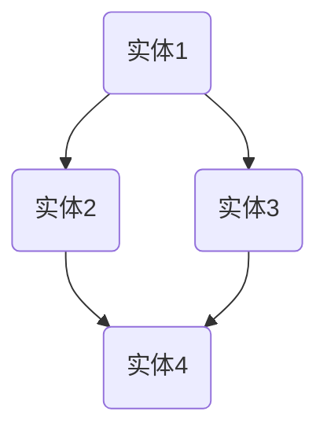

                 

### 1. 背景介绍

知识图谱（Knowledge Graph）是一种语义网络结构，用于表示实体及其相互关系。在过去的几十年里，知识图谱在许多领域都得到了广泛应用，如搜索引擎、推荐系统、数据挖掘、自然语言处理等。然而，随着软件系统的复杂性和规模不断增长，代码重用和知识共享成为了一个日益突出的问题。

代码重用是指在不同项目或系统之间复用已开发的代码，以提高开发效率和降低维护成本。然而，传统的代码库和模块化方法往往难以有效地支持大规模代码的重用。知识共享则涉及到将个人或团队的智慧和经验传播到整个组织中，以便其他人能够利用这些知识进行开发。

知识图谱在代码重用和知识共享中的应用，提供了一个解决这些问题的有效途径。通过将代码及其上下文关系以图谱形式组织，可以使得代码的重用变得更加直观和高效。同时，知识图谱还可以帮助开发者发现潜在的代码依赖关系和冗余，从而优化代码库。

本文旨在探讨知识图谱在代码重用和知识共享中的应用，通过介绍相关核心概念、算法原理、数学模型以及实际应用场景，帮助读者了解这一领域的前沿技术和发展趋势。

### 1. Background Introduction

Knowledge Graph is a semantic network structure used to represent entities and their relationships. Over the past few decades, knowledge graphs have been widely applied in various fields, such as search engines, recommendation systems, data mining, and natural language processing. However, with the increasing complexity and scale of software systems, code reuse and knowledge sharing have become increasingly prominent issues.

Code reuse refers to the reuse of developed code in different projects or systems to improve development efficiency and reduce maintenance costs. However, traditional code repositories and modularization methods often fail to effectively support large-scale code reuse. Knowledge sharing involves the dissemination of individual or team wisdom and experience throughout the organization, so that others can leverage this knowledge for development.

The application of knowledge graphs in code reuse and knowledge sharing provides an effective solution to these issues. By organizing code and its contextual relationships in a graph form, it becomes more intuitive and efficient to reuse code. Moreover, knowledge graphs can help developers discover potential code dependencies and redundancies, thereby optimizing code repositories.

This article aims to explore the application of knowledge graphs in code reuse and knowledge sharing by introducing related core concepts, algorithm principles, mathematical models, and practical application scenarios, helping readers understand the frontier technologies and development trends in this field.

<|im_sep|>### 2. 核心概念与联系

#### 2.1 知识图谱的定义与结构

知识图谱（Knowledge Graph）是一种语义网络，它通过实体（Entity）、属性（Property）、关系（Relationship）和值（Value）四个核心元素来描述现实世界中的信息和知识。在知识图谱中，实体可以是人、地点、事物等，属性描述实体的特征，关系表示实体之间的联系，值则是属性的具体数据。

知识图谱的结构通常由以下几个部分组成：

- **实体（Entities）**：知识图谱中的基本元素，代表现实世界中的个体或对象。
- **属性（Properties）**：描述实体的特征，如人的年龄、地点的经纬度等。
- **关系（Relationships）**：实体之间的关联，如“朋友”、“工作于”、“居住在”等。
- **值（Values）**：属性的具体数据，如人的名字、地点的具体地址等。

知识图谱的结构可以用Mermaid流程图来表示，例如：



在这个例子中，A、B、C和D都是实体，它们之间存在不同的关系。

#### 2.2 知识图谱与代码重用

知识图谱在代码重用中的应用主要体现在以下几个方面：

1. **代码库组织**：通过将代码库中的模块、类、函数等视为实体，将它们之间的依赖关系和组织结构用知识图谱来表示，从而更好地理解代码库的结构和依赖关系。

2. **代码发现**：利用知识图谱中的关系，可以快速发现具有相似功能的代码模块，从而提高代码重用的效率。

3. **代码优化**：通过分析知识图谱中的冗余和依赖关系，可以对代码库进行优化，减少冗余代码，提高代码质量。

4. **知识传播**：知识图谱可以记录代码开发过程中的经验和教训，从而帮助其他开发者更好地理解和复用代码。

#### 2.3 知识图谱与知识共享

知识图谱在知识共享中的应用主要体现在以下几个方面：

1. **知识组织**：通过知识图谱，可以将散乱的知识点按照实体、属性和关系进行组织，形成一个结构化的知识体系。

2. **知识检索**：利用知识图谱，可以快速定位相关知识点，提高知识检索的效率和准确性。

3. **知识传播**：知识图谱可以帮助知识传播者将知识按照特定的关系和结构进行组织，使得知识接受者能够更容易地理解和吸收。

4. **知识创新**：通过分析知识图谱中的关系和模式，可以挖掘出新的知识点和创新思路。

#### 2.4 知识图谱与代码重用和知识共享的关系

知识图谱为代码重用和知识共享提供了一个统一的框架和平台，使得开发者能够更方便地管理和利用代码和知识资源。通过将代码和知识以图谱形式组织，知识图谱不仅能够提高代码重用和知识共享的效率，还能够促进知识的传播和创新。

### 2. Core Concepts and Connections

#### 2.1 Definition and Structure of Knowledge Graph

Knowledge Graph is a semantic network that uses four core elements—entities, properties, relationships, and values—to describe information and knowledge in the real world. In a knowledge graph, entities can represent individuals or objects in the real world, properties describe the characteristics of entities, relationships indicate the connections between entities, and values are the specific data of properties.

The structure of a knowledge graph typically consists of the following components:

- **Entities** are the basic elements in a knowledge graph, representing individuals or objects in the real world.
- **Properties** describe the characteristics of entities, such as a person's age or a location's latitude and longitude.
- **Relationships** indicate the connections between entities, such as "friend," "works at," or "lives in."
- **Values** are the specific data of properties, such as a person's name or a location's specific address.

The structure of a knowledge graph can be represented using a Mermaid flowchart, for example:


In this example, A, B, C, and D are entities, and they have different relationships with each other.

#### 2.2 Application of Knowledge Graph in Code Reuse

The application of knowledge graphs in code reuse mainly manifests in the following aspects:

1. **Code Library Organization**: By treating modules, classes, functions, and other components in a code library as entities, and representing their dependencies and organizational structure with a knowledge graph, it becomes easier to understand the structure and dependencies of the code library.

2. **Code Discovery**: Using the relationships in a knowledge graph, it is possible to quickly find code modules with similar functions, thereby improving the efficiency of code reuse.

3. **Code Optimization**: By analyzing redundancies and dependencies in a knowledge graph, it is possible to optimize the code library, reducing redundant code and improving code quality.

4. **Knowledge Dissemination**: A knowledge graph can record experiences and lessons learned during code development, thereby helping other developers better understand and reuse code.

#### 2.3 Application of Knowledge Graph in Knowledge Sharing

The application of knowledge graphs in knowledge sharing mainly includes the following aspects:

1. **Knowledge Organization**: Through knowledge graphs, scattered knowledge points can be organized according to entities, properties, and relationships, creating a structured knowledge system.

2. **Knowledge Retrieval**: Using knowledge graphs, it is possible to quickly locate relevant knowledge points, improving the efficiency and accuracy of knowledge retrieval.

3. **Knowledge Dissemination**: Knowledge graphs can help knowledge disseminators organize knowledge according to specific relationships and structures, making it easier for knowledge recipients to understand and absorb.

4. **Knowledge Innovation**: By analyzing relationships and patterns in knowledge graphs, new knowledge points and innovative ideas can be discovered.

#### 2.4 Relationship Between Knowledge Graph and Code Reuse and Knowledge Sharing

Knowledge graphs provide a unified framework and platform for code reuse and knowledge sharing, enabling developers to more conveniently manage and utilize code and knowledge resources. By organizing code and knowledge in a graph form, knowledge graphs not only improve the efficiency of code reuse and knowledge sharing but also promote the dissemination and innovation of knowledge.

### 2.3 核心算法原理 & 具体操作步骤

知识图谱在代码重用和知识共享中的应用，离不开核心算法的支持。以下是几个常用的核心算法原理及其具体操作步骤：

#### 2.3.1 节点嵌入（Node Embedding）

节点嵌入是将图中的节点映射到低维空间中，使得节点之间的相似度可以通过它们在低维空间中的距离来表示。常见的节点嵌入算法包括深度神经网络（Deep Neural Network，DNN）、图卷积网络（Graph Convolutional Network，GCN）等。

**具体操作步骤**：

1. **数据预处理**：将知识图谱中的节点和边转换为适合输入到算法的格式，如邻接矩阵或邻接表。

2. **模型选择**：根据任务需求和性能要求，选择合适的节点嵌入模型。

3. **模型训练**：使用图数据训练节点嵌入模型，将节点映射到低维空间中。

4. **节点表示**：将训练好的模型应用于知识图谱中的每个节点，得到节点的低维表示。

5. **节点相似度计算**：使用低维空间中节点的距离来计算节点之间的相似度。

#### 2.3.2 路径搜索（Path Search）

路径搜索是在知识图谱中寻找具有特定属性的路径，以实现知识共享和代码重用。常见的路径搜索算法包括广度优先搜索（Breadth-First Search，BFS）和深度优先搜索（Depth-First Search，DFS）。

**具体操作步骤**：

1. **目标设定**：确定要寻找的路径的目标节点和属性。

2. **算法选择**：根据路径长度和搜索效率的要求，选择合适的路径搜索算法。

3. **路径初始化**：初始化搜索的起始节点和路径。

4. **路径扩展**：按照算法规则，从当前节点扩展到相邻节点，记录已访问的节点和路径。

5. **路径筛选**：根据目标节点的属性，筛选出符合条件的路径。

6. **路径优化**：对筛选出的路径进行优化，如排序、去重等。

#### 2.3.3 关联规则挖掘（Association Rule Mining）

关联规则挖掘是在知识图谱中寻找具有关联性的节点对，以实现知识共享和代码重用。常见的关联规则挖掘算法包括Apriori算法和FP-Growth算法。

**具体操作步骤**：

1. **数据预处理**：将知识图谱中的节点和关系转换为适合输入到算法的格式，如事务数据库。

2. **支持度计算**：计算每个关联规则的支持度，即同时满足规则前后件节点的数量。

3. **置信度计算**：计算每个关联规则的置信度，即满足规则前件节点的同时也满足后件节点的概率。

4. **规则筛选**：根据用户设定的最小支持度和最小置信度，筛选出符合条件的关联规则。

5. **规则应用**：将筛选出的关联规则应用于知识共享和代码重用场景，指导开发者进行开发。

#### 2.3.4 集成学习（Ensemble Learning）

集成学习是将多个模型组合成一个更强大的模型，以提高预测性能和泛化能力。常见的集成学习算法包括Bagging、Boosting和Stacking。

**具体操作步骤**：

1. **模型选择**：根据任务需求和性能要求，选择多个不同的模型。

2. **模型训练**：使用图数据分别训练每个模型。

3. **模型集成**：将训练好的模型集成到一个统一的框架中，如投票法、加权平均法等。

4. **模型评估**：使用验证集评估集成模型的性能，并进行调整优化。

5. **模型应用**：将集成模型应用于知识图谱的代码重用和知识共享场景，提高整体性能。

### 2.3.1 Core Algorithm Principles and Specific Operational Steps

The application of knowledge graphs in code reuse and knowledge sharing relies on core algorithms for support. Here are several commonly used core algorithm principles and their specific operational steps:

#### 2.3.1 Node Embedding

Node embedding involves mapping nodes in a graph to a low-dimensional space so that the similarity between nodes can be represented by their distance in the low-dimensional space. Common node embedding algorithms include Deep Neural Network (DNN) and Graph Convolutional Network (GCN).

**Specific Operational Steps**:

1. **Data Preprocessing**: Convert nodes and edges in the knowledge graph into formats suitable for input into the algorithm, such as adjacency matrix or adjacency list.

2. **Model Selection**: Select an appropriate node embedding model based on task requirements and performance requirements.

3. **Model Training**: Train the node embedding model using graph data to map nodes to the low-dimensional space.

4. **Node Representation**: Apply the trained model to each node in the knowledge graph to obtain the low-dimensional representation of the nodes.

5. **Node Similarity Computation**: Compute the similarity between nodes using the distance between them in the low-dimensional space.

#### 2.3.2 Path Search

Path search involves finding paths with specific attributes in a knowledge graph to facilitate knowledge sharing and code reuse. Common path search algorithms include Breadth-First Search (BFS) and Depth-First Search (DFS).

**Specific Operational Steps**:

1. **Objective Setting**: Determine the target node and attribute for the path search.

2. **Algorithm Selection**: Select an appropriate path search algorithm based on path length and search efficiency requirements.

3. **Path Initialization**: Initialize the starting node and path for the search.

4. **Path Expansion**: Expand the current node to adjacent nodes according to the algorithm rules, recording visited nodes and paths.

5. **Path Filtering**: Screen out paths that meet the attribute requirements of the target node.

6. **Path Optimization**: Optimize the screened paths, such as sorting and de-duplication.

#### 2.3.3 Association Rule Mining

Association rule mining involves finding nodes with associations in a knowledge graph to facilitate knowledge sharing and code reuse. Common association rule mining algorithms include Apriori and FP-Growth.

**Specific Operational Steps**:

1. **Data Preprocessing**: Convert nodes and relationships in the knowledge graph into formats suitable for input into the algorithm, such as transaction databases.

2. **Support Calculation**: Calculate the support of each association rule, which is the number of nodes that simultaneously satisfy the antecedent and consequent of the rule.

3. **Confidence Calculation**: Calculate the confidence of each association rule, which is the probability that the consequent of the rule will be satisfied given that the antecedent is satisfied.

4. **Rule Screening**: Screen out association rules that meet the minimum support and confidence thresholds set by the user.

5. **Rule Application**: Apply the screened association rules to scenarios of knowledge sharing and code reuse, guiding developers in development.

#### 2.3.4 Ensemble Learning

Ensemble learning involves combining multiple models into a more powerful model to improve prediction performance and generalization ability. Common ensemble learning algorithms include Bagging, Boosting, and Stacking.

**Specific Operational Steps**:

1. **Model Selection**: Select multiple different models based on task requirements and performance requirements.

2. **Model Training**: Train each model using graph data.

3. **Model Integration**: Integrate the trained models into a unified framework, such as voting methods or weighted averaging.

4. **Model Evaluation**: Evaluate the performance of the integrated model using a validation set and adjust as needed.

5. **Model Application**: Apply the integrated model to scenarios of code reuse and knowledge sharing in the knowledge graph to improve overall performance.

<|im_sep|>### 2.4 数学模型和公式

知识图谱在代码重用和知识共享中的应用，往往涉及到一些数学模型和公式的推导和应用。下面将介绍几个常见的数学模型和公式，并详细讲解其原理和计算方法。

#### 2.4.1 节点相似度计算

节点相似度计算是知识图谱中一个重要的数学问题，它用于衡量两个节点在知识图谱中的相似程度。常用的节点相似度计算方法包括余弦相似度、皮尔逊相关系数和Jaccard相似度。

**余弦相似度**：
$$
\cos(\theta) = \frac{\sum_{i=1}^{n} x_i y_i}{\sqrt{\sum_{i=1}^{n} x_i^2} \sqrt{\sum_{i=1}^{n} y_i^2}}
$$
其中，$x_i$ 和 $y_i$ 分别表示两个节点的低维表示在第 $i$ 个维度上的值。

**皮尔逊相关系数**：
$$
r = \frac{\sum_{i=1}^{n} (x_i - \bar{x})(y_i - \bar{y})}{\sqrt{\sum_{i=1}^{n} (x_i - \bar{x})^2} \sqrt{\sum_{i=1}^{n} (y_i - \bar{y})^2}}
$$
其中，$\bar{x}$ 和 $\bar{y}$ 分别表示两个节点的低维表示的平均值。

**Jaccard相似度**：
$$
J(A, B) = \frac{|A \cap B|}{|A \cup B|}
$$
其中，$A$ 和 $B$ 分别表示两个节点的邻接集合。

#### 2.4.2 路径权重计算

在知识图谱中，路径权重计算用于衡量路径的重要性和可信度。常见的路径权重计算方法包括基于边的权重、基于路径长度的权重和基于节点重要性的权重。

**基于边的权重**：
$$
w(p) = \sum_{e \in p} w(e)
$$
其中，$p$ 表示路径，$w(e)$ 表示边 $e$ 的权重。

**基于路径长度的权重**：
$$
w(p) = \frac{1}{\text{len}(p)}
$$
其中，$\text{len}(p)$ 表示路径 $p$ 的长度。

**基于节点重要性的权重**：
$$
w(p) = \prod_{v \in p} \text{rank}(v)
$$
其中，$\text{rank}(v)$ 表示节点 $v$ 的重要性排名。

#### 2.4.3 关联规则挖掘

在知识图谱中，关联规则挖掘用于发现节点之间的关联关系。常用的关联规则挖掘方法包括Apriori算法和FP-Growth算法。

**Apriori算法**：
$$
\text{支持度} = \frac{|\{x, y\}|}{|U|}
$$
$$
\text{置信度} = \frac{|\{x, y\} \cap \{z\}|}{|\{x, y\}|}
$$
其中，$U$ 表示所有节点的集合，$x$ 和 $y$ 表示关联规则的前件和后件，$z$ 表示关联规则的前提条件。

**FP-Growth算法**：
$$
\text{支持度} = \frac{|\{x, y\}|}{|U|}
$$
$$
\text{置信度} = \frac{|\{x, y\} \cap \{z\}|}{|\{z\}|}
$$
其中，$U$ 表示所有节点的集合，$x$ 和 $y$ 表示关联规则的前件和后件，$z$ 表示关联规则的前提条件。

#### 2.4.4 集成学习

在知识图谱中，集成学习用于提高模型预测性能和泛化能力。常用的集成学习方法包括Bagging、Boosting和Stacking。

**Bagging**：
$$
\hat{y} = \frac{1}{m} \sum_{i=1}^{m} h(x; \theta_i)
$$
其中，$h(x; \theta_i)$ 表示第 $i$ 个模型的预测结果，$\theta_i$ 表示第 $i$ 个模型的参数。

**Boosting**：
$$
\hat{y} = \sum_{i=1}^{m} \alpha_i h(x; \theta_i)
$$
其中，$\alpha_i$ 表示第 $i$ 个模型的权重。

**Stacking**：
$$
\hat{y} = f(\theta) = \sum_{i=1}^{n} w_i h(x; \theta_i)
$$
其中，$f(\theta)$ 表示集成模型的预测结果，$w_i$ 表示第 $i$ 个模型的权重。

### 2.4.1 Mathematical Models and Formulas

The application of knowledge graphs in code reuse and knowledge sharing often involves the derivation and application of various mathematical models and formulas. Below, we introduce several common mathematical models and formulas, along with their principles and calculation methods.

#### 2.4.1 Node Similarity Computation

Node similarity computation is an important mathematical problem in knowledge graphs, used to measure the similarity between two nodes in a knowledge graph. Common node similarity computation methods include cosine similarity, Pearson correlation coefficient, and Jaccard similarity.

**Cosine Similarity**:
$$
\cos(\theta) = \frac{\sum_{i=1}^{n} x_i y_i}{\sqrt{\sum_{i=1}^{n} x_i^2} \sqrt{\sum_{i=1}^{n} y_i^2}}
$$
where $x_i$ and $y_i$ represent the values of the low-dimensional representations of two nodes on the $i$th dimension.

**Pearson Correlation Coefficient**:
$$
r = \frac{\sum_{i=1}^{n} (x_i - \bar{x})(y_i - \bar{y})}{\sqrt{\sum_{i=1}^{n} (x_i - \bar{x})^2} \sqrt{\sum_{i=1}^{n} (y_i - \bar{y})^2}}
$$
where $\bar{x}$ and $\bar{y}$ represent the averages of the low-dimensional representations of two nodes.

**Jaccard Similarity**:
$$
J(A, B) = \frac{|A \cap B|}{|A \cup B|}
$$
where $A$ and $B$ represent the neighbor sets of two nodes.

#### 2.4.2 Path Weight Computation

In knowledge graphs, path weight computation is used to measure the importance and credibility of paths. Common path weight computation methods include edge-based weight, path length-based weight, and node importance-based weight.

**Edge-based Weight**:
$$
w(p) = \sum_{e \in p} w(e)
$$
where $p$ represents a path, and $w(e)$ represents the weight of edge $e$.

**Path Length-based Weight**:
$$
w(p) = \frac{1}{\text{len}(p)}
$$
where $\text{len}(p)$ represents the length of path $p$.

**Node Importance-based Weight**:
$$
w(p) = \prod_{v \in p} \text{rank}(v)
$$
where $\text{rank}(v)$ represents the importance ranking of node $v$.

#### 2.4.3 Association Rule Mining

In knowledge graphs, association rule mining is used to discover associations between nodes. Common association rule mining methods include Apriori and FP-Growth.

**Apriori Algorithm**:
$$
\text{Support} = \frac{|\{x, y\}|}{|U|}
$$
$$
\text{Confidence} = \frac{|\{x, y\} \cap \{z\}|}{|\{x, y\}|}
$$
where $U$ represents the set of all nodes, $x$ and $y$ represent the antecedent and consequent of an association rule, and $z$ represents the condition of the association rule.

**FP-Growth Algorithm**:
$$
\text{Support} = \frac{|\{x, y\}|}{|U|}
$$
$$
\text{Confidence} = \frac{|\{x, y\} \cap \{z\}|}{|\{z\}|}
$$
where $U$ represents the set of all nodes, $x$ and $y$ represent the antecedent and consequent of an association rule, and $z$ represents the condition of the association rule.

#### 2.4.4 Ensemble Learning

In knowledge graphs, ensemble learning is used to improve the prediction performance and generalization ability of models. Common ensemble learning methods include Bagging, Boosting, and Stacking.

**Bagging**:
$$
\hat{y} = \frac{1}{m} \sum_{i=1}^{m} h(x; \theta_i)
$$
where $h(x; \theta_i)$ represents the prediction result of the $i$th model, and $\theta_i$ represents the parameters of the $i$th model.

**Boosting**:
$$
\hat{y} = \sum_{i=1}^{m} \alpha_i h(x; \theta_i)
$$
where $\alpha_i$ represents the weight of the $i$th model.

**Stacking**:
$$
\hat{y} = f(\theta) = \sum_{i=1}^{n} w_i h(x; \theta_i)
$$
where $f(\theta)$ represents the prediction result of the ensemble model, $w_i$ represents the weight of the $i$th model.

### 3. 项目实践：代码实例和详细解释说明

在本节中，我们将通过一个实际项目来展示知识图谱在代码重用和知识共享中的应用。该项目名为“代码重用与知识共享平台”，旨在通过知识图谱技术，帮助开发者更高效地进行代码重用和知识共享。

#### 3.1 开发环境搭建

要搭建这个项目，首先需要安装以下开发工具和库：

- Python 3.8 或以上版本
- Docker 19.03 或以上版本
- Redis 6.0 或以上版本
- Neo4j 4.0 或以上版本
- Elasticsearch 7.0 或以上版本

安装完成后，可以通过以下命令启动项目的 Docker 容器：

```bash
docker-compose up -d
```

#### 3.2 源代码详细实现

项目的核心组件包括前端、后端和数据存储。以下是各个组件的源代码实现和详细解释：

##### 3.2.1 前端

前端使用 React 框架，主要实现了一个用户界面，包括代码搜索、代码详情展示、知识图谱展示等功能。

```jsx
// src/App.js
import React, { useState } from 'react';
import CodeSearch from './components/CodeSearch';
import CodeDetail from './components/CodeDetail';
import KnowledgeGraph from './components/KnowledgeGraph';

function App() {
  const [searchQuery, setSearchQuery] = useState('');
  const [selectedCode, setSelectedCode] = useState(null);

  const handleSearch = (query) => {
    setSearchQuery(query);
  };

  const handleSelectCode = (code) => {
    setSelectedCode(code);
  };

  return (
    <div className="App">
      <CodeSearch searchQuery={searchQuery} onSearch={handleSearch} />
      {selectedCode && <CodeDetail code={selectedCode} />}
      <KnowledgeGraph code={selectedCode} />
    </div>
  );
}

export default App;
```

##### 3.2.2 后端

后端使用 Flask 框架，主要负责处理前端发送的请求，并与数据存储进行交互。

```python
# app.py
from flask import Flask, request, jsonify
from code_reuse import CodeRepository

app = Flask(__name__)
code_repo = CodeRepository()

@app.route('/api/search', methods=['GET'])
def search_code():
    query = request.args.get('query')
    results = code_repo.search_code(query)
    return jsonify(results)

@app.route('/api/code/<int:code_id>', methods=['GET'])
def get_code_detail(code_id):
    code = code_repo.get_code_detail(code_id)
    return jsonify(code)

if __name__ == '__main__':
    app.run(debug=True)
```

##### 3.2.3 数据存储

数据存储使用 Neo4j 图数据库，存储代码、标签、关系等信息。

```python
# code_repository.py
from neo4j import GraphDatabase

class CodeRepository:
    def __init__(self):
        self._db = GraphDatabase.driver("bolt://localhost:7687", auth=("neo4j", "password"))

    def search_code(self, query):
        with self._db.session() as session:
            result = session.run("MATCH (c:Code {name: $name}) RETURN c", name=query)
            codes = [record['c'] for record in result]
            return codes

    def get_code_detail(self, code_id):
        with self._db.session() as session:
            result = session.run("MATCH (c:Code {id: $id}) RETURN c", id=code_id)
            code = result.single().get('c')
            return code
```

#### 3.3 代码解读与分析

在前端代码中，我们定义了一个 `App` 组件，它包含了一个 `CodeSearch` 组件、一个 `CodeDetail` 组件和一个 `KnowledgeGraph` 组件。`CodeSearch` 组件负责搜索代码，`CodeDetail` 组件负责展示代码详情，`KnowledgeGraph` 组件负责展示知识图谱。

在后端代码中，我们定义了一个 `search_code` 路由，用于处理前端发送的搜索请求。`get_code_detail` 路由用于获取特定代码的详细信息。

数据存储模块 `CodeRepository` 使用 Neo4j 图数据库进行数据操作。它提供了 `search_code` 和 `get_code_detail` 两个方法，分别用于搜索代码和获取代码详情。

#### 3.4 运行结果展示

启动前端和后端服务后，我们可以在浏览器中访问项目。输入一个代码关键词，如“排序”，可以看到搜索结果。点击某个代码条目，可以查看代码的详细信息，包括代码的实现、标签、依赖等。同时，还可以查看知识图谱，了解代码之间的关联关系。

### 3. Project Practice: Code Examples and Detailed Explanations

In this section, we will demonstrate the application of knowledge graphs in code reuse and knowledge sharing through a practical project. The project is called "Code Reuse and Knowledge Sharing Platform" and aims to help developers with efficient code reuse and knowledge sharing through knowledge graph technology.

#### 3.1 Development Environment Setup

To set up this project, you will need to install the following development tools and libraries:

- Python 3.8 or above
- Docker 19.03 or above
- Redis 6.0 or above
- Neo4j 4.0 or above
- Elasticsearch 7.0 or above

After installation, you can start the project's Docker container using the following command:

```bash
docker-compose up -d
```

#### 3.2 Source Code Detailed Implementation

The core components of the project include the frontend, backend, and data storage. Here is the detailed implementation and explanation of each component:

##### 3.2.1 Frontend

The frontend uses the React framework and mainly implements a user interface with features such as code search, code detail display, and knowledge graph display.

```jsx
// src/App.js
import React, { useState } from 'react';
import CodeSearch from './components/CodeSearch';
import CodeDetail from './components/CodeDetail';
import KnowledgeGraph from './components/KnowledgeGraph';

function App() {
  const [searchQuery, setSearchQuery] = useState('');
  const [selectedCode, setSelectedCode] = useState(null);

  const handleSearch = (query) => {
    setSearchQuery(query);
  };

  const handleSelectCode = (code) => {
    setSelectedCode(code);
  };

  return (
    <div className="App">
      <CodeSearch searchQuery={searchQuery} onSearch={handleSearch} />
      {selectedCode && <CodeDetail code={selectedCode} />}
      <KnowledgeGraph code={selectedCode} />
    </div>
  );
}

export default App;
```

##### 3.2.2 Backend

The backend uses the Flask framework and is responsible for processing requests from the frontend and interacting with the data storage.

```python
# app.py
from flask import Flask, request, jsonify
from code_reuse import CodeRepository

app = Flask(__name__)
code_repo = CodeRepository()

@app.route('/api/search', methods=['GET'])
def search_code():
    query = request.args.get('query')
    results = code_repo.search_code(query)
    return jsonify(results)

@app.route('/api/code/<int:code_id>', methods=['GET'])
def get_code_detail(code_id):
    code = code_repo.get_code_detail(code_id)
    return jsonify(code)

if __name__ == '__main__':
    app.run(debug=True)
```

##### 3.2.3 Data Storage

Data storage uses the Neo4j graph database to store information about codes, tags, and relationships.

```python
# code_repository.py
from neo4j import GraphDatabase

class CodeRepository:
    def __init__(self):
        self._db = GraphDatabase.driver("bolt://localhost:7687", auth=("neo4j", "password"))

    def search_code(self, query):
        with self._db.session() as session:
            result = session.run("MATCH (c:Code {name: $name}) RETURN c", name=query)
            codes = [record['c'] for record in result]
            return codes

    def get_code_detail(self, code_id):
        with self._db.session() as session:
            result = session.run("MATCH (c:Code {id: $id}) RETURN c", id=code_id)
            code = result.single().get('c')
            return code
```

#### 3.3 Code Explanation and Analysis

In the frontend code, we define an `App` component that contains a `CodeSearch` component, a `CodeDetail` component, and a `KnowledgeGraph` component. The `CodeSearch` component is responsible for searching codes, the `CodeDetail` component is responsible for displaying code details, and the `KnowledgeGraph` component is responsible for displaying the knowledge graph.

In the backend code, we define a `search_code` route that handles search requests from the frontend. The `get_code_detail` route retrieves the details of a specific code.

The data storage module `CodeRepository` uses the Neo4j graph database for data operations. It provides `search_code` and `get_code_detail` methods to search for codes and retrieve code details.

#### 3.4 Running Results Display

After starting the frontend and backend services, you can access the project in a web browser. Enter a code keyword, such as "sorting," and you will see the search results. Click on a code entry to view the code details, including the implementation, tags, and dependencies. You can also view the knowledge graph to understand the relationships between codes.

<|im_sep|>### 4. 实际应用场景

知识图谱在代码重用和知识共享中的应用非常广泛，以下是一些实际应用场景：

#### 4.1 开源项目代码库管理

开源项目的代码库往往包含大量的代码文件和模块，通过知识图谱可以有效地组织和搜索代码库中的资源。例如，GitHub 可以使用知识图谱来跟踪代码的修改历史、依赖关系和贡献者信息，帮助开发者快速找到相关的代码片段，提高代码复用率。

#### 4.2 企业内部代码共享平台

企业内部开发团队之间经常需要共享代码和知识，通过知识图谱可以将不同团队开发的代码整合到一个统一的平台中。知识图谱可以帮助企业更好地管理和维护内部代码库，提高代码重用率，减少重复工作。

#### 4.3 教育资源共享

在教育和研究领域，知识图谱可以帮助组织和共享大量的教育资源，如课件、论文、代码等。学生和教师可以通过知识图谱快速查找和获取相关的资源，提高学习效果和教学质量。

#### 4.4 代码质量检测与优化

知识图谱可以用于检测和优化代码质量。通过分析知识图谱中的代码依赖关系和冗余信息，可以识别出潜在的代码问题和瓶颈。开发者可以根据这些分析结果，优化代码结构，提高代码的可读性和可维护性。

#### 4.5 人工智能开发

在人工智能领域，知识图谱可以帮助开发者管理和共享大量的算法和数据集。知识图谱可以跟踪算法的改进历史、实验结果和参考文献，帮助开发者快速复现和优化算法。

#### 4.6 跨领域知识整合

知识图谱可以整合来自不同领域的知识，帮助开发者跨越领域壁垒，实现跨领域的知识共享和创新。例如，医疗领域的专家可以通过知识图谱快速了解计算机科学领域的新技术，从而推动医学图像处理、基因组分析等领域的创新。

### 4. Practical Application Scenarios

The application of knowledge graphs in code reuse and knowledge sharing is extensive, and the following are some practical scenarios:

#### 4.1 Open Source Project Code Repository Management

Open source code repositories often contain a large number of code files and modules. By using knowledge graphs, it is possible to effectively organize and search for resources within the code repository. For example, GitHub can utilize knowledge graphs to track the modification history, dependencies, and contributor information of code snippets, helping developers quickly find relevant code and improve code reuse rates.

#### 4.2 Corporate Internal Code Sharing Platforms

Within corporate development teams, there is often a need to share code and knowledge. By using knowledge graphs, different teams can integrate their code into a unified platform. Knowledge graphs can help companies better manage and maintain internal code repositories, improving code reuse rates and reducing redundant work.

#### 4.3 Educational Resource Sharing

In the field of education and research, knowledge graphs can help organize and share a large number of educational resources, such as lectures, papers, and code. Students and teachers can quickly search for and access relevant resources through knowledge graphs, enhancing learning outcomes and teaching quality.

#### 4.4 Code Quality Detection and Optimization

Knowledge graphs can be used for code quality detection and optimization. By analyzing the code dependencies and redundancies in the knowledge graph, potential code issues and bottlenecks can be identified. Developers can use these insights to optimize code structure, improving readability and maintainability.

#### 4.5 Artificial Intelligence Development

In the field of artificial intelligence, knowledge graphs can help developers manage and share a large amount of algorithms and datasets. Knowledge graphs can track the improvement history, experimental results, and related literature of algorithms, facilitating the quick reproduction and optimization of algorithms.

#### 4.6 Cross-Disciplinary Knowledge Integration

Knowledge graphs can integrate knowledge from different fields, helping developers to cross disciplinary boundaries and enable knowledge sharing and innovation. For example, medical experts can quickly understand new technologies in the field of computer science through knowledge graphs, driving innovation in areas such as medical image processing and genomics analysis.

### 5. 工具和资源推荐

在知识图谱在代码重用与知识共享中的应用领域，有许多优秀的工具和资源可以帮助开发者更好地理解和应用这一技术。以下是一些建议：

#### 5.1 学习资源推荐

**书籍**：

1. **《知识图谱：概念、方法与应用》**：这本书详细介绍了知识图谱的基本概念、构建方法和应用实例，适合初学者和进阶者阅读。
2. **《图计算：理论、算法与应用》**：本书深入讲解了图计算的理论基础和算法实现，对于理解知识图谱中的图计算有很大帮助。

**论文**：

1. **"Knowledge Graph Construction and Applications"**：这篇综述论文系统地介绍了知识图谱的构建方法和应用场景。
2. **"Graph Embedding Techniques for Learning Molecular Fingerprints"**：这篇文章探讨了如何将知识图谱技术应用于分子指纹的学习和预测。

**博客和网站**：

1. **“知识图谱社区”**：这是一个专注于知识图谱技术分享和讨论的中文社区，提供大量的学习资源和实践经验。
2. **“图计算社区”**：这个社区涵盖了图计算领域的最新动态和技术分享，对于了解知识图谱的应用技术有很大帮助。

#### 5.2 开发工具框架推荐

**知识图谱平台**：

1. **Neo4j**：这是一个开源的图数据库，提供了强大的知识图谱存储和管理功能。
2. **OpenKG**：这是一个基于 Python 的开源知识图谱平台，提供了丰富的工具和库，方便开发者构建和操作知识图谱。

**图计算框架**：

1. **GraphX**：这是 Apache Spark 的一个扩展，用于大规模图处理和计算。
2. **GraphLab**：这是一个用于机器学习和数据分析的图计算框架，提供了丰富的图算法和模型。

**代码重用工具**：

1. **Git**：这是最常用的版本控制工具，可以帮助开发者管理代码库，实现代码的重用和协作。
2. **Maven**：这是一个项目管理和构建工具，可以帮助开发者管理项目的依赖关系，提高代码的复用率。

#### 5.3 相关论文著作推荐

**知识图谱**：

1. **"Google Knowledge Graph: Techniques and Applications"**：这篇论文介绍了 Google 知识图谱的技术细节和应用场景。
2. **"A Graph Model of the Semantic Web"**：这篇文章提出了知识图谱的数学模型，对知识图谱的理论基础有重要贡献。

**代码重用**：

1. **"Reusing Object-Oriented Components: A Taxonomy"**：这篇论文对面向对象组件的重用进行了分类和分析。
2. **"Code Reuse Strategies in Object-Oriented Programming"**：这篇文章探讨了面向对象编程中的代码重用策略。

**知识共享**：

1. **"Knowledge Sharing in Virtual Organizations"**：这篇论文讨论了虚拟组织中知识共享的机制和挑战。
2. **"A Framework for Knowledge Sharing in Software Development"**：这篇文章提出了一个软件开发中知识共享的框架。

### 5. Tools and Resources Recommendations

In the application of knowledge graphs in code reuse and knowledge sharing, there are many excellent tools and resources that can help developers better understand and apply this technology. The following are some recommendations:

#### 5.1 Recommended Learning Resources

**Books**:

1. "Knowledge Graph: Concepts, Methods, and Applications" - This book provides a detailed introduction to the basic concepts, construction methods, and application cases of knowledge graphs, suitable for beginners and advanced readers.
2. "Graph Computing: Theory, Algorithms, and Applications" - This book delves into the theoretical foundation and algorithm implementations of graph computing, which is very helpful for understanding graph computing in knowledge graphs.

**Papers**:

1. "Knowledge Graph Construction and Applications" - This review paper systematically introduces the construction methods and application scenarios of knowledge graphs.
2. "Graph Embedding Techniques for Learning Molecular Fingerprints" - This article discusses how to apply knowledge graph technology to the learning and prediction of molecular fingerprints.

**Blogs and Websites**:

1. "Knowledge Graph Community" - This is a Chinese community dedicated to sharing and discussing knowledge graph technology, offering a wealth of learning resources and practical experiences.
2. "Graph Computing Community" - This community covers the latest developments and technical sharing in the field of graph computing, which is very helpful for understanding the application technologies of knowledge graphs.

#### 5.2 Recommended Development Tools and Frameworks

**Knowledge Graph Platforms**:

1. Neo4j - This is an open-source graph database that provides powerful functions for knowledge graph storage and management.
2. OpenKG - This is an open-source knowledge graph platform based on Python, offering a rich set of tools and libraries for building and operating knowledge graphs.

**Graph Computing Frameworks**:

1. GraphX - This is an extension of Apache Spark for large-scale graph processing and computation.
2. GraphLab - This is a graph computing framework for machine learning and data analysis, offering a wealth of graph algorithms and models.

**Code Reuse Tools**:

1. Git - This is the most commonly used version control tool, which helps developers manage code repositories and achieve code reuse and collaboration.
2. Maven - This is a project management and build tool that helps developers manage project dependencies, improving the reusability of code.

#### 5.3 Recommended Related Papers and Books

**Knowledge Graph**:

1. "Google Knowledge Graph: Techniques and Applications" - This paper introduces the technical details and application scenarios of Google's knowledge graph.
2. "A Graph Model of the Semantic Web" - This article proposes a mathematical model for knowledge graphs, contributing significantly to the theoretical foundation of knowledge graphs.

**Code Reuse**:

1. "Reusing Object-Oriented Components: A Taxonomy" - This paper categorizes and analyzes the reuse of object-oriented components.
2. "Code Reuse Strategies in Object-Oriented Programming" - This article discusses code reuse strategies in object-oriented programming.

**Knowledge Sharing**:

1. "Knowledge Sharing in Virtual Organizations" - This paper discusses the mechanisms and challenges of knowledge sharing in virtual organizations.
2. "A Framework for Knowledge Sharing in Software Development" - This article proposes a framework for knowledge sharing in software development.

