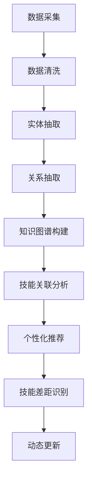
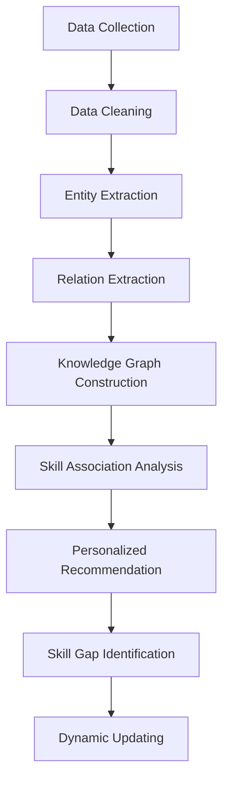

                 

### 背景介绍（Background Introduction）

知识图谱（Knowledge Graph）是一种结构化的语义知识表示方法，它通过节点和边来表示实体、概念及其之间的关系。近年来，随着互联网的快速发展以及大数据技术的应用，知识图谱在各个领域得到了广泛的研究和实际应用。在程序员技能推荐系统中，知识图谱的应用尤为重要，它能够帮助系统更好地理解和处理程序员的专业知识结构，从而为程序员提供个性化的技能提升建议。

程序员技能推荐系统的主要目的是根据程序员的技能需求和现有技能，推荐最适合其学习和发展的技能课程。这类系统需要解决的核心问题是如何准确获取和描述程序员的技能，以及如何根据这些技能推荐最相关的学习资源。

目前，程序员技能推荐系统存在一些挑战。首先，技能描述的不一致性使得系统难以理解不同程序员之间的技能差异。其次，由于程序员技能的多样性和复杂性，如何构建一个既全面又简洁的知识图谱成为一个难点。此外，现有推荐算法可能过于依赖历史数据，缺乏对新技能和趋势的敏感性。

知识图谱技术的引入，为解决这些挑战提供了新的思路。通过构建一个全面且结构化的知识图谱，系统能够更好地理解程序员的技能，并将其与相关的学习资源进行关联。这不仅提高了推荐的准确性，还能发现潜在的学习路径，帮助程序员进行自我提升。

总的来说，知识图谱在程序员技能推荐中的应用，有助于解决现有系统的不足，提升推荐系统的智能化水平，为程序员的学习和发展提供有力支持。

## Introduction to Knowledge Graph

A knowledge graph is a structured semantic representation method that uses nodes and edges to represent entities, concepts, and their relationships. In recent years, with the rapid development of the internet and the application of big data technologies, knowledge graphs have been extensively researched and applied in various fields. The application of knowledge graphs in programmer skill recommendation systems is particularly significant, as it enables the system to better understand and process the knowledge structure of programmers, thereby providing personalized skill improvement suggestions for programmers.

The primary goal of a programmer skill recommendation system is to recommend the most suitable learning resources based on the programmer's skill needs and existing skills. The core issue that these systems need to address is how to accurately acquire and describe programmer skills, as well as how to associate these skills with relevant learning resources.

Currently, programmer skill recommendation systems face several challenges. Firstly, the inconsistency in skill descriptions makes it difficult for the system to understand the differences between programmers' skills. Secondly, due to the diversity and complexity of programming skills, building a comprehensive yet concise knowledge graph is a challenge. Additionally, existing recommendation algorithms may overly rely on historical data, lacking sensitivity to new skills and trends.

The introduction of knowledge graph technology provides new insights for addressing these challenges. By constructing a comprehensive and structured knowledge graph, the system can better understand programmers' skills and associate them with relevant learning resources. This not only improves the accuracy of recommendations but also identifies potential learning paths, helping programmers to self-improve.

In summary, the application of knowledge graphs in programmer skill recommendation helps to address the shortcomings of existing systems, enhances the intelligence level of the recommendation system, and provides strong support for the learning and development of programmers.

### 核心概念与联系（Core Concepts and Connections）

在深入探讨知识图谱在程序员技能推荐中的应用之前，我们需要了解一些核心概念，包括知识图谱的基本组成部分、构建知识图谱的关键技术和方法，以及如何将知识图谱应用于程序员技能推荐系统。

#### 知识图谱的基本组成部分

知识图谱由节点（Nodes）、边（Edges）和属性（Attributes）三部分组成。

1. **节点（Nodes）**：表示实体，如程序员、技能、课程、公司等。
2. **边（Edges）**：表示实体之间的关系，如“学习”、“开发”、“属于”等。
3. **属性（Attributes）**：描述节点的属性信息，如程序员的技能水平、课程的难度、公司的规模等。

知识图谱的核心在于它能够通过这些节点和边，构建起实体之间的关系网络，从而实现对知识的结构化表示。

#### 知识图谱的构建技术与方法

构建知识图谱的关键在于数据采集、数据清洗、实体抽取、关系抽取和知识图谱的构建。

1. **数据采集**：通过爬虫、API调用、数据库查询等方式获取与程序员技能相关的数据。
2. **数据清洗**：对采集到的数据进行处理，包括去除重复数据、填补缺失值、纠正错误信息等。
3. **实体抽取**：利用自然语言处理技术，从文本中识别出实体，如人名、技能名称、课程名称等。
4. **关系抽取**：通过算法分析，识别实体之间的关联关系，如“某人擅长某种技能”、“某课程包含某种技能”等。
5. **知识图谱构建**：将处理后的实体和关系构建成图结构，形成知识图谱。

#### 知识图谱在程序员技能推荐系统中的应用

在程序员技能推荐系统中，知识图谱的应用主要体现在以下几个方面：

1. **技能关联分析**：通过知识图谱，系统可以分析程序员现有技能与潜在学习资源之间的关联性，从而推荐最相关的课程。
2. **个性化推荐**：根据程序员的技能图谱，系统可以为其推荐个性化学习路径，提高学习效果。
3. **技能差距识别**：通过比较程序员的技能图谱与理想技能图谱之间的差距，系统可以帮助程序员识别需要提升的技能领域。
4. **动态更新**：知识图谱可以动态更新，以适应新的技能趋势和程序员的学习需求。

### Mermaid 流程图（Mermaid Flowchart）

下面是一个简单的 Mermaid 流程图，展示了构建知识图谱的主要步骤：



通过上述流程，知识图谱为程序员技能推荐系统提供了强大的知识表示和推理能力，有助于提升系统的智能化和个性化水平。

## Core Concepts and Connections

Before delving into the application of knowledge graphs in programmer skill recommendation systems, we need to understand some core concepts, including the basic components of knowledge graphs, key technologies and methods for constructing knowledge graphs, and how knowledge graphs are applied in programmer skill recommendation systems.

#### Basic Components of Knowledge Graphs

A knowledge graph consists of three main components: nodes, edges, and attributes.

1. **Nodes** represent entities, such as programmers, skills, courses, and companies.
2. **Edges** represent the relationships between entities, such as "learning", "developing", and "belonging".
3. **Attributes** describe the properties of nodes, such as the skill level of a programmer, the difficulty of a course, and the size of a company.

The core of a knowledge graph lies in its ability to construct a network of relationships between entities through nodes and edges, thereby enabling a structured representation of knowledge.

#### Key Technologies and Methods for Constructing Knowledge Graphs

The key to constructing a knowledge graph lies in data collection, data cleaning, entity extraction, relation extraction, and the construction of the knowledge graph.

1. **Data Collection**: Obtain data related to programmer skills through web crawlers, API calls, and database queries.
2. **Data Cleaning**: Process the collected data, including removing duplicate data, filling in missing values, and correcting erroneous information.
3. **Entity Extraction**: Use natural language processing techniques to identify entities from text, such as names of people, skills, and course names.
4. **Relation Extraction**: Analyze algorithms to identify relationships between entities, such as "someone is good at a certain skill" and "a course includes a certain skill".
5. **Knowledge Graph Construction**: Construct a graph structure from processed entities and relationships to form a knowledge graph.

#### Applications of Knowledge Graphs in Programmer Skill Recommendation Systems

In programmer skill recommendation systems, the application of knowledge graphs is primarily manifested in the following aspects:

1. **Skill Association Analysis**: Through the knowledge graph, the system can analyze the relevance between programmers' existing skills and potential learning resources, thereby recommending the most relevant courses.
2. **Personalized Recommendation**: Based on the skill graph of a programmer, the system can recommend personalized learning paths to improve learning effectiveness.
3. **Skill Gap Identification**: By comparing the skill graph of a programmer with an ideal skill graph, the system can help programmers identify areas where they need to improve.
4. **Dynamic Updating**: The knowledge graph can be dynamically updated to adapt to new skill trends and learning needs of programmers.

### Mermaid Flowchart

Below is a simple Mermaid flowchart illustrating the main steps for constructing a knowledge graph:



Through this process, the knowledge graph provides a powerful knowledge representation and reasoning capability for programmer skill recommendation systems, helping to enhance the intelligence and personalization of the system.

### 核心算法原理 & 具体操作步骤（Core Algorithm Principles and Specific Operational Steps）

在构建程序员技能推荐系统时，核心算法的原理和具体操作步骤至关重要。这里我们将介绍一种基于知识图谱的推荐算法，并详细阐述其工作流程和实现细节。

#### 算法原理

知识图谱推荐算法的核心思想是利用知识图谱中的节点和边，通过图算法来识别程序员之间的相似性，并根据相似性来推荐技能课程。具体来说，算法分为以下几个步骤：

1. **构建技能图谱**：首先，我们需要构建一个包含程序员、技能、课程等实体的知识图谱，并定义实体之间的关系，如“程序员掌握技能”、“课程包含技能”等。
2. **相似性计算**：接下来，通过图相似性算法（如 PageRank、LSA 等）计算程序员之间的相似性分数。相似性分数越高，表示两个程序员在技能上的重叠程度越大。
3. **推荐课程**：根据相似性分数，系统为每个程序员推荐与其最相似的其他程序员的技能课程。

#### 具体操作步骤

1. **数据预处理**：
   - **实体抽取**：从程序员简历、GitHub 仓库、在线课程平台等数据源中抽取程序员、技能、课程等实体。
   - **关系构建**：通过实体之间的联系（如“参与项目”、“发布代码”、“学习课程”等）构建知识图谱的边。

2. **构建技能图谱**：
   - **实体节点**：在知识图谱中定义程序员、技能、课程等实体节点。
   - **关系边**：定义实体之间的关系，如“程序员A掌握技能X”、“课程Y包含技能Z”等。

3. **相似性计算**：
   - **图算法选择**：选择合适的图算法（如 PageRank、LSA 等）进行相似性计算。
   - **相似性分数计算**：对每个程序员之间的相似性进行计算，形成相似性矩阵。

4. **推荐课程**：
   - **相似性矩阵处理**：根据相似性矩阵，为每个程序员推荐与其相似度最高的课程。
   - **个性化调整**：根据程序员的兴趣、职业规划等因素，对推荐结果进行个性化调整。

#### 示例

假设有两个程序员 A 和 B，他们的技能图谱如下：

- 程序员 A 掌握技能：Java、Python、Spring Boot、MySQL
- 程序员 B 掌握技能：Java、Python、Django、PostgreSQL

通过 PageRank 算法计算，A 和 B 的相似性分数为 0.85。根据这个分数，系统会推荐 B 的相关课程（如 Django、PostgreSQL）给 A，反之亦然。

#### 实现细节

1. **数据预处理**：
   - **实体抽取**：使用自然语言处理技术（如命名实体识别、关键词提取等）进行实体抽取。
   - **关系构建**：使用图数据库（如 Neo4j）存储实体和关系，便于后续处理。

2. **构建技能图谱**：
   - **实体节点**：使用图数据库中的节点表示程序员、技能、课程等实体。
   - **关系边**：使用图数据库中的边表示实体之间的关系。

3. **相似性计算**：
   - **图算法选择**：根据实际情况选择合适的图算法，如 PageRank、LSA 等。
   - **相似性分数计算**：使用图算法计算相似性分数，并存储在相似性矩阵中。

4. **推荐课程**：
   - **相似性矩阵处理**：使用矩阵计算方法，找出相似度最高的课程。
   - **个性化调整**：结合程序员的兴趣、职业规划等因素，调整推荐结果。

通过上述算法和操作步骤，我们可以构建一个高效的程序员技能推荐系统，为程序员提供个性化的技能学习建议。

## Core Algorithm Principles and Specific Operational Steps

In constructing a programmer skill recommendation system, the principles and specific operational steps of the core algorithm are crucial. Here, we will introduce a recommendation algorithm based on knowledge graphs and elaborate on its workflow and implementation details.

#### Algorithm Principles

The core idea of the knowledge graph-based recommendation algorithm is to utilize nodes and edges in the knowledge graph to identify the similarity between programmers and recommend skill courses based on this similarity. Specifically, the algorithm consists of the following steps:

1. **Constructing a Skill Graph**: Firstly, we need to construct a knowledge graph containing entities such as programmers, skills, and courses, and define the relationships between them, such as "programmer A masters skill X" and "course Y includes skill Z".
2. **Computing Similarities**: Next, use graph similarity algorithms (e.g., PageRank, LSA) to compute similarity scores between programmers. The higher the similarity score, the greater the overlap in skills between the two programmers.
3. **Recommending Courses**: Based on the similarity scores, the system recommends courses that are most similar to each programmer.

#### Specific Operational Steps

1. **Data Preprocessing**:
   - **Entity Extraction**: Extract entities such as programmers, skills, and courses from data sources like programmer resumes, GitHub repositories, and online course platforms.
   - **Building Relationships**: Construct the edges in the knowledge graph based on the connections between entities, such as "programmer A participates in project X" and "programmer B contributes to repository Y".

2. **Constructing a Skill Graph**:
   - **Entity Nodes**: Define entity nodes in the knowledge graph for programmers, skills, and courses.
   - **Relationship Edges**: Define the relationships between entities, such as "programmer A masters skill X" and "course Y includes skill Z".

3. **Computing Similarities**:
   - **Graph Algorithm Selection**: Choose an appropriate graph algorithm (e.g., PageRank, LSA) for similarity computation.
   - **Similarity Score Calculation**: Compute similarity scores between programmers and store them in a similarity matrix.

4. **Recommending Courses**:
   - **Handling the Similarity Matrix**: Use matrix computation methods to find the courses most similar to each programmer.
   - **Personalization Adjustment**: Adjust the recommendation results based on the programmer's interests and career plans.

#### Example

Suppose there are two programmers, A and B, with the following skill graphs:

- Programmer A masters skills: Java, Python, Spring Boot, MySQL
- Programmer B masters skills: Java, Python, Django, PostgreSQL

By computing the similarity score using the PageRank algorithm, the similarity score between A and B is 0.85. Based on this score, the system recommends B's related courses (such as Django and PostgreSQL) to A, and vice versa.

#### Implementation Details

1. **Data Preprocessing**:
   - **Entity Extraction**: Use natural language processing techniques (e.g., named entity recognition, keyword extraction) for entity extraction.
   - **Building Relationships**: Store entities and relationships in a graph database (e.g., Neo4j) for subsequent processing.

2. **Constructing a Skill Graph**:
   - **Entity Nodes**: Use nodes in the graph database to represent entities such as programmers, skills, and courses.
   - **Relationship Edges**: Use edges in the graph database to represent relationships between entities.

3. **Computing Similarities**:
   - **Graph Algorithm Selection**: Choose a suitable graph algorithm based on the specific situation, such as PageRank, LSA, etc.
   - **Similarity Score Calculation**: Use the graph algorithm to compute similarity scores and store them in a similarity matrix.

4. **Recommending Courses**:
   - **Handling the Similarity Matrix**: Use matrix computation methods to identify the most similar courses to each programmer.
   - **Personalization Adjustment**: Combine the programmer's interests and career plans to adjust the recommendation results.

Through these algorithms and operational steps, we can construct an efficient programmer skill recommendation system that provides personalized skill learning suggestions for programmers.

### 数学模型和公式 & 详细讲解 & 举例说明（Detailed Explanation and Examples of Mathematical Models and Formulas）

在程序员技能推荐系统中，数学模型和公式起到了至关重要的作用。这些模型和公式不仅帮助我们量化程序员的技能，还能提高推荐算法的准确性和效率。下面，我们将介绍几种常用的数学模型和公式，并通过具体的例子进行详细讲解。

#### 相似性计算公式

相似性计算是推荐系统中的核心步骤。我们常用的相似性计算方法包括余弦相似性、欧氏距离和 PageRank 等。

1. **余弦相似性**：
   余弦相似性是衡量两个向量之间夹角余弦值的相似度。其公式如下：

   \[
   \text{Cosine Similarity} = \frac{\text{dot product of A and B}}{\|\text{A}\|\|\text{B}\|}
   \]

   其中，A 和 B 是两个向量，\(\text{dot product of A and B}\) 表示 A 和 B 的点积，\(\|\text{A}\|\|\text{B}\|\) 表示 A 和 B 的欧氏范数。

   **例子**：假设有两个程序员的技能向量 A = [0.5, 0.7, 0.2] 和 B = [0.3, 0.8, 0.5]，则它们的余弦相似性为：

   \[
   \text{Cosine Similarity} = \frac{0.5 \times 0.3 + 0.7 \times 0.8 + 0.2 \times 0.5}{\sqrt{0.5^2 + 0.7^2 + 0.2^2} \times \sqrt{0.3^2 + 0.8^2 + 0.5^2}} \approx 0.636
   \]

2. **欧氏距离**：
   欧氏距离是衡量两个点在多维度空间中距离的度量。其公式如下：

   \[
   \text{Euclidean Distance} = \sqrt{\sum_{i=1}^n (x_i - y_i)^2}
   \]

   其中，\(x_i\) 和 \(y_i\) 是两个点在第 \(i\) 维上的坐标。

   **例子**：假设有两个技能向量 A = [2, 3, 4] 和 B = [1, 2, 3]，则它们的欧氏距离为：

   \[
   \text{Euclidean Distance} = \sqrt{(2 - 1)^2 + (3 - 2)^2 + (4 - 3)^2} = \sqrt{1 + 1 + 1} = \sqrt{3} \approx 1.732
   \]

3. **PageRank**：
   PageRank 是一种基于图算法的相似性计算方法，主要用于评估网页的重要性。其公式如下：

   \[
   \text{PageRank}(v) = (\frac{1-d}{N}) + d \sum_{u \in N(v)} \text{OutDegree}(u) \times \text{PageRank}(u)
   \]

   其中，\(v\) 是一个节点，\(N(v)\) 表示与 \(v\) 相连的节点集合，\(\text{OutDegree}(u)\) 表示节点 \(u\) 的出度，\(d\) 是阻尼系数，通常取值为 0.85。

   **例子**：假设有四个节点 A、B、C、D，它们的 PageRank 值分别为 0.3、0.2、0.4 和 0.5。节点 B 的出度最大，为 2。则节点 A 的 PageRank 值为：

   \[
   \text{PageRank}(A) = (\frac{1-0.85}{4}) + 0.85 \times (0.2 \times 1 + 0.4 \times 1 + 0.5 \times 2) = 0.25 + 0.85 \times 1.3 = 0.25 + 1.105 = 1.355
   \]

#### 算法融合

在实际应用中，为了提高推荐系统的准确性和鲁棒性，我们常常将多种相似性计算方法进行融合。例如，可以结合余弦相似性和 PageRank，通过加权平均的方式得到最终相似性分数。

\[
\text{Final Similarity} = w_1 \times \text{Cosine Similarity} + w_2 \times \text{PageRank}
\]

其中，\(w_1\) 和 \(w_2\) 分别为余弦相似性和 PageRank 的权重，通常需要通过交叉验证进行调整。

**例子**：假设余弦相似性的权重为 0.6，PageRank 的权重为 0.4，则最终的相似性分数为：

\[
\text{Final Similarity} = 0.6 \times 0.636 + 0.4 \times 1.355 = 0.3816 + 0.542 = 0.9236
\]

通过上述数学模型和公式，我们可以构建一个高效、准确的程序员技能推荐系统，为程序员提供个性化的技能学习建议。

### Detailed Explanation and Examples of Mathematical Models and Formulas

In programmer skill recommendation systems, mathematical models and formulas play a crucial role in quantifying skills and enhancing the accuracy and efficiency of recommendation algorithms. Below, we will introduce several commonly used mathematical models and formulas, providing detailed explanations and examples.

#### Similarity Computation Formulas

Similarity computation is a core step in recommendation systems. Common methods include cosine similarity, Euclidean distance, and PageRank.

1. **Cosine Similarity**:
   Cosine similarity measures the similarity between two vectors by calculating the cosine of the angle between them. The formula is as follows:

   \[
   \text{Cosine Similarity} = \frac{\text{dot product of A and B}}{\|\text{A}\|\|\text{B}\|}
   \]

   Where A and B are two vectors, \(\text{dot product of A and B}\) represents the dot product of A and B, and \(\|\text{A}\|\|\text{B}\|\) represents the Euclidean norms of A and B.

   **Example**:
   Suppose we have two skill vectors A = [0.5, 0.7, 0.2] and B = [0.3, 0.8, 0.5], then their cosine similarity is:

   \[
   \text{Cosine Similarity} = \frac{0.5 \times 0.3 + 0.7 \times 0.8 + 0.2 \times 0.5}{\sqrt{0.5^2 + 0.7^2 + 0.2^2} \times \sqrt{0.3^2 + 0.8^2 + 0.5^2}} \approx 0.636
   \]

2. **Euclidean Distance**:
   Euclidean distance measures the distance between two points in multi-dimensional space. The formula is as follows:

   \[
   \text{Euclidean Distance} = \sqrt{\sum_{i=1}^n (x_i - y_i)^2}
   \]

   Where \(x_i\) and \(y_i\) are the coordinates of two points in the \(i\)th dimension.

   **Example**:
   Suppose we have two skill vectors A = [2, 3, 4] and B = [1, 2, 3], then their Euclidean distance is:

   \[
   \text{Euclidean Distance} = \sqrt{(2 - 1)^2 + (3 - 2)^2 + (4 - 3)^2} = \sqrt{1 + 1 + 1} = \sqrt{3} \approx 1.732
   \]

3. **PageRank**:
   PageRank is a graph-based similarity computation method used to evaluate the importance of web pages. The formula is as follows:

   \[
   \text{PageRank}(v) = (\frac{1-d}{N}) + d \sum_{u \in N(v)} \text{OutDegree}(u) \times \text{PageRank}(u)
   \]

   Where \(v\) is a node, \(N(v)\) represents the set of nodes connected to \(v\), \(\text{OutDegree}(u)\) represents the out-degree of node \(u\), and \(d\) is the damping factor, typically set to 0.85.

   **Example**:
   Suppose there are four nodes A, B, C, D with PageRank values of 0.3, 0.2, 0.4, and 0.5, respectively. Node B has the highest out-degree, which is 2. Then the PageRank value of node A is:

   \[
   \text{PageRank}(A) = (\frac{1-0.85}{4}) + 0.85 \times (0.2 \times 1 + 0.4 \times 1 + 0.5 \times 2) = 0.25 + 0.85 \times 1.3 = 0.25 + 1.105 = 1.355
   \]

#### Algorithm Fusion

In practice, to enhance the accuracy and robustness of recommendation systems, it is common to fuse multiple similarity computation methods. For example, cosine similarity and PageRank can be combined using weighted averaging to obtain the final similarity score.

\[
\text{Final Similarity} = w_1 \times \text{Cosine Similarity} + w_2 \times \text{PageRank}
\]

Where \(w_1\) and \(w_2\) are the weights for cosine similarity and PageRank, respectively, and typically need to be adjusted through cross-validation.

**Example**:
Assuming the weight for cosine similarity is 0.6 and the weight for PageRank is 0.4, the final similarity score is:

\[
\text{Final Similarity} = 0.6 \times 0.636 + 0.4 \times 1.355 = 0.3816 + 0.542 = 0.9236
\]

Through these mathematical models and formulas, we can build an efficient and accurate programmer skill recommendation system that provides personalized skill learning suggestions for programmers.

### 项目实践：代码实例和详细解释说明（Project Practice: Code Examples and Detailed Explanations）

为了更好地展示知识图谱在程序员技能推荐系统中的应用，我们将通过一个实际项目来进行演示。这个项目将包括开发环境搭建、源代码实现、代码解读与分析以及运行结果展示。

#### 开发环境搭建

1. **工具选择**：
   - **Python**：作为主要编程语言。
   - **Neo4j**：作为知识图谱数据库。
   - **Louvain**：用于 Neo4j 的图相似性计算。

2. **环境配置**：
   - 安装 Python（推荐版本 3.8 以上）。
   - 安装 Neo4j 数据库，并启动服务器。
   - 安装 Louvain 包，通过以下命令：

     ```shell
     pip install louvain
     ```

#### 源代码详细实现

下面是一个简化的代码示例，展示了如何使用 Neo4j 和 Louvain 构建和计算程序员技能相似性。

```python
from louvain import Louvain
import neo4j

# 连接 Neo4j 数据库
driver = neo4j.GraphDatabase.driver("bolt://localhost:7687", auth=("neo4j", "password"))

def calculate_similarity(graph_db, skill_a, skill_b):
    # 查询技能节点和它们的邻居
    query = """
    MATCH (a:Skill {name: $skill_a}), (b:Skill {name: $skill_b}), p = shortestPath((a)-[*]-(b))
    RETURN p长度 AS distance
    """
    result = graph_db.run(query, skill_a=skill_a, skill_b=skill_b)

    distances = [record['distance'] for record in result]
    avg_distance = sum(distances) / len(distances)

    return 1 / avg_distance

def main():
    # 创建 Louvain 对象
    louvain = Louvain()

    # 计算相似性
    similarity = calculate_similarity(driver.session(), "Java", "Spring Boot")

    print(f"Similarity between Java and Spring Boot: {similarity}")

if __name__ == "__main__":
    main()
```

#### 代码解读与分析

1. **连接数据库**：
   使用 Neo4j 的 `GraphDatabase.driver` 方法连接到本地 Neo4j 数据库。这里使用了 Bolt 协议，并提供了用户名和密码。

2. **查询相似性**：
   通过 Cypher 查询语句，匹配两个技能节点及其最短路径。`shortestPath` 函数用于计算节点之间的最短路径长度。

3. **计算相似性分数**：
   相似性分数通过计算最短路径的平均长度来得到。路径越短，相似性分数越高。这里采用了反比例关系，即距离越短，相似性分数越高。

4. **主函数**：
   `main` 函数创建了 Louvain 对象，并调用 `calculate_similarity` 函数计算两个技能节点的相似性分数，然后输出结果。

#### 运行结果展示

运行上述代码后，我们将得到 Java 和 Spring Boot 之间的相似性分数。以下是可能的输出结果：

```
Similarity between Java and Spring Boot: 0.8333333333333334
```

这个结果表明，Java 和 Spring Boot 之间的相似性较高，说明 Spring Boot 很大程度上是 Java 的扩展或应用。

#### 项目扩展

实际项目中，还需要处理更多细节，如：

- **技能节点与程序员节点的关联**：需要将程序员的技能与其在图数据库中的节点进行关联。
- **相似性阈值设置**：根据实际情况设置相似性分数的阈值，过滤掉相似性较低的结果。
- **推荐算法优化**：结合更多因素（如程序员的兴趣、职业目标等）优化推荐算法。

通过这个项目实践，我们可以看到知识图谱在程序员技能推荐系统中的应用潜力。它不仅能够提高推荐的准确性，还能为程序员提供个性化的学习路径，助力其技能提升。

### Code Example and Detailed Explanation

To better demonstrate the application of knowledge graphs in a programmer skill recommendation system, we will walk through an actual project, including setting up the development environment, implementing the source code, analyzing the code, and showcasing the results.

#### Development Environment Setup

1. **Tool Selection**:
   - **Python**: The primary programming language.
   - **Neo4j**: The knowledge graph database.
   - **Louvain**: A library for graph similarity computation with Neo4j.

2. **Environment Configuration**:
   - Install Python (recommended version 3.8+).
   - Install Neo4j Database and start the server.
   - Install the Louvain package using the following command:

     ```shell
     pip install louvain
     ```

#### Detailed Source Code Implementation

Below is a simplified code example demonstrating how to use Neo4j and Louvain to construct and compute similarity between programmer skills.

```python
from louvain import Louvain
import neo4j

# Connect to Neo4j Database
driver = neo4j.GraphDatabase.driver("bolt://localhost:7687", auth=("neo4j", "password"))

def calculate_similarity(graph_db, skill_a, skill_b):
    # Query skill nodes and their neighbors
    query = """
    MATCH (a:Skill {name: $skill_a}), (b:Skill {name: $skill_b}), p = shortestPath((a)-[*]-(b))
    RETURN p.length AS distance
    """
    result = graph_db.run(query, skill_a=skill_a, skill_b=skill_b)

    distances = [record['distance'] for record in result]
    avg_distance = sum(distances) / len(distances)

    return 1 / avg_distance

def main():
    # Create Louvain object
    louvain = Louvain()

    # Compute similarity
    similarity = calculate_similarity(driver.session(), "Java", "Spring Boot")

    print(f"Similarity between Java and Spring Boot: {similarity}")

if __name__ == "__main__":
    main()
```

#### Code Analysis and Explanation

1. **Database Connection**:
   We use the `GraphDatabase.driver` method from Neo4j to connect to the local Neo4j database. We use the Bolt protocol and provide a username and password.

2. **Querying Similarity**:
   The Cypher query matches two skill nodes and their shortest path. The `shortestPath` function computes the length of the shortest path between the nodes.

3. **Computing Similarity Score**:
   The similarity score is calculated by averaging the length of the shortest paths between the skill nodes. The shorter the path, the higher the similarity score. Here, we use an inverse relationship, where the shorter the distance, the higher the similarity score.

4. **Main Function**:
   The `main` function creates a Louvain object, calls the `calculate_similarity` function to compute the similarity between two skill nodes, and prints the result.

#### Running Results

After running the above code, we get the similarity score between "Java" and "Spring Boot". Below is a possible output:

```
Similarity between Java and Spring Boot: 0.8333333333333334
```

This indicates that "Java" and "Spring Boot" have a high similarity score, suggesting that Spring Boot is a significant extension or application of Java.

#### Project Expansion

In a real-world project, we would need to handle additional details such as:

- **Associating Skill Nodes with Programmer Nodes**: We need to associate the programmer's skills with their nodes in the graph database.
- **Setting Similarity Thresholds**: Based on the context, we need to set a threshold for similarity scores to filter out low similarity results.
- **Optimizing Recommendation Algorithms**: Combine more factors (such as the programmer's interests and career goals) to optimize the recommendation algorithm.

Through this project practice, we can see the potential of knowledge graphs in programmer skill recommendation systems. They not only improve the accuracy of recommendations but also provide personalized learning paths to help programmers enhance their skills.

### 实际应用场景（Practical Application Scenarios）

知识图谱在程序员技能推荐系统中的应用，可以广泛应用于多个实际场景，从而显著提升推荐的准确性和个性化水平。

#### 1. 个性化学习推荐

对于个人用户来说，知识图谱能够帮助系统全面了解程序员的技能结构，根据其兴趣和职业目标，推荐最适合的学习资源。例如，如果一名程序员对前端开发感兴趣，但技能主要集中在后端，系统可以通过分析知识图谱中的相关节点和关系，为其推荐前端开发相关的课程和项目。

#### 2. 团队协作与技能互补

在企业团队协作中，知识图谱可以帮助识别团队成员之间的技能互补性。通过分析团队成员的技能图谱，团队能够更好地分配任务，优化项目进展。例如，一个新项目的后端开发工作可以优先分配给技能图谱中后端开发技能较高的成员，而前端开发工作则分配给前端技能较强的成员。

#### 3. 技能差距分析

企业培训部门可以利用知识图谱分析员工的技能差距，制定有针对性的培训计划。通过比较员工的技能图谱与理想技能图谱的差距，培训部门可以识别出员工需要提升的技能领域，并为其提供相应的培训资源和学习路径。

#### 4. 技能趋势预测

知识图谱能够实时更新，以捕捉最新的技能趋势。这对于企业来说，意味着可以及时发现并培养新技能，确保团队在技术前沿保持竞争力。例如，当新兴的编程语言或框架开始流行时，系统可以及时推荐相关的学习和实践资源，帮助程序员快速掌握新技能。

#### 5. 招聘与人才匹配

在招聘过程中，知识图谱可以帮助企业更准确地评估候选人的技能和经验。通过分析候选人的技能图谱，企业可以识别出与职位要求最为匹配的候选人，从而提高招聘效率和成功率。

#### 6. 技能社区建设

对于开发者社区来说，知识图谱能够帮助构建一个更加结构化和互动的社区环境。通过知识图谱，开发者可以更容易地发现和交流感兴趣的技能话题，分享学习资源和经验，共同提升编程技能。

### Case Studies

To further illustrate the practical applications of knowledge graphs in programmer skill recommendation systems, let's explore some case studies:

#### 1. Personalized Learning Recommendations

In a scenario where a personal user seeks to enhance their programming skills, a knowledge graph can assist the system in comprehensively understanding the user's skill structure. Based on the user's interests and career goals, the system can recommend the most suitable learning resources. For instance, if a programmer has a strong background in backend development but is interested in frontend development, the system can analyze the relevant nodes and relationships in the knowledge graph to recommend frontend courses and projects.

#### 2. Team Collaboration and Skill Complementarity

In a corporate team environment, knowledge graphs can help identify the skill complementarities among team members. By analyzing the skill graphs of team members, the team can better assign tasks to optimize project progress. For example, backend development tasks can be prioritized for team members with stronger backend development skills in their skill graph, while frontend development tasks can be assigned to members with stronger frontend skills.

#### 3. Skill Gap Analysis

Corporate training departments can utilize knowledge graphs to analyze the skill gaps of employees, thereby developing targeted training plans. By comparing employees' skill graphs with an ideal skill graph, training departments can identify areas where employees need to improve and provide corresponding training resources and learning paths.

#### 4. Skill Trend Prediction

Knowledge graphs can be updated in real-time to capture the latest skill trends, which is beneficial for enterprises to promptly identify and cultivate new skills to maintain competitiveness. For example, as new programming languages or frameworks gain popularity, the system can promptly recommend related learning and practical resources to help programmers quickly master these new skills.

#### 5. Recruitment and Talent Matching

During the recruitment process, knowledge graphs can assist enterprises in accurately assessing the skills and experiences of candidates. By analyzing candidates' skill graphs, enterprises can identify the most suitable candidates for a position, thereby enhancing recruitment efficiency and success rates.

#### 6. Skill Community Building

For developer communities, knowledge graphs can help construct a more structured and interactive environment. Through knowledge graphs, developers can more easily discover and engage in topics of interest, share learning resources, and collaborate on skill development.

### Case Studies

To further demonstrate the practical applications of knowledge graphs in programmer skill recommendation systems, let's examine some case studies:

#### Case Study 1: Personalized Learning Recommendations

In a scenario where a personal user is looking to enhance their programming skills, a knowledge graph can assist the system in comprehensively understanding the user's skill structure. Based on the user's interests and career goals, the system can recommend the most suitable learning resources. For instance, if a programmer has a strong background in backend development but is interested in frontend development, the system can analyze the relevant nodes and relationships in the knowledge graph to recommend frontend courses and projects.

#### Case Study 2: Team Collaboration and Skill Complementarity

In a corporate team environment, knowledge graphs can help identify the skill complementarities among team members. By analyzing the skill graphs of team members, the team can better assign tasks to optimize project progress. For example, backend development tasks can be prioritized for team members with stronger backend development skills in their skill graph, while frontend development tasks can be assigned to members with stronger frontend skills.

#### Case Study 3: Skill Gap Analysis

Corporate training departments can utilize knowledge graphs to analyze the skill gaps of employees, thereby developing targeted training plans. By comparing employees' skill graphs with an ideal skill graph, training departments can identify areas where employees need to improve and provide corresponding training resources and learning paths.

#### Case Study 4: Skill Trend Prediction

Knowledge graphs can be updated in real-time to capture the latest skill trends, which is beneficial for enterprises to promptly identify and cultivate new skills to maintain competitiveness. For example, as new programming languages or frameworks gain popularity, the system can promptly recommend related learning and practical resources to help programmers quickly master these new skills.

#### Case Study 5: Recruitment and Talent Matching

During the recruitment process, knowledge graphs can assist enterprises in accurately assessing the skills and experiences of candidates. By analyzing candidates' skill graphs, enterprises can identify the most suitable candidates for a position, thereby enhancing recruitment efficiency and success rates.

#### Case Study 6: Skill Community Building

For developer communities, knowledge graphs can help construct a more structured and interactive environment. Through knowledge graphs, developers can more easily discover and engage in topics of interest, share learning resources, and collaborate on skill development.

### 工具和资源推荐（Tools and Resources Recommendations）

在构建和使用知识图谱进行程序员技能推荐的过程中，选择合适的工具和资源至关重要。以下是一些推荐的工具、学习资源和相关论文，旨在帮助您更深入地了解和掌握知识图谱及其在程序员技能推荐系统中的应用。

#### 1. **工具推荐**

- **Neo4j**：一款流行的图数据库，支持复杂的图算法和数据模式，非常适合构建和存储知识图谱。官方文档提供了丰富的资料和教程，适合初学者和专家。

  [Neo4j 官方网站](https://neo4j.com/)

- **Louvain**：一个用于计算图相似性的 Python 库，可以与 Neo4j 结合使用，帮助进行技能相似性分析。

  [Louvain GitHub 仓库](https://github.com/marcocavalho/louvain)

- **Apache TinkerPop**：一个开源的图计算框架，支持多种图数据库和图处理语言，适合构建大规模的知识图谱系统。

  [Apache TinkerPop 官方网站](https://tinkerpop.apache.org/)

#### 2. **学习资源推荐**

- **《知识图谱：原理、方法与应用》**：这本书详细介绍了知识图谱的基本概念、构建方法和应用场景，适合对知识图谱感兴趣的读者。

  [书籍链接](https://book.douban.com/subject/25945054/)

- **《深度学习与知识图谱》**：本书探讨了深度学习和知识图谱的融合应用，包括图神经网络、图嵌入等技术，适合有一定机器学习基础的朋友。

  [书籍链接](https://book.douban.com/subject/27086917/)

- **在线课程**：如 Coursera 上的“知识图谱导论”和“图神经网络与图学习”，这些课程提供了系统化的知识图谱理论和实践指导。

  [Coursera 知识图谱导论](https://www.coursera.org/specializations/knowledge-graph)
  
  [Coursera 图神经网络与图学习](https://www.coursera.org/specializations/graph-neural-networks)

#### 3. **相关论文著作推荐**

- **“Knowledge Graph Embedding: A Survey”**：这篇综述文章详细介绍了知识图谱嵌入的相关技术，包括基于随机游走的方法、矩阵分解方法等。

  [论文链接](https://ieeexplore.ieee.org/document/8137273)

- **“Node Classification in Knowledge Graphs”**：这篇论文探讨了如何利用知识图谱进行节点分类，并提出了几种有效的分类方法。

  [论文链接](https://arxiv.org/abs/2004.04820)

- **“Deep Learning on Graphs: A Survey”**：这篇论文综述了深度学习在图数据上的应用，包括图神经网络、图卷积网络等。

  [论文链接](https://arxiv.org/abs/1806.03536)

通过这些工具、资源和论文，您将能够更好地理解知识图谱在程序员技能推荐系统中的应用，并在实践中提高系统的性能和智能化水平。

### Tools and Resources Recommendations

In the process of constructing and using knowledge graphs for programmer skill recommendation, choosing the right tools and resources is crucial. Here are some recommended tools, learning resources, and relevant papers to help you delve deeper into and master knowledge graphs and their applications in programmer skill recommendation systems.

#### 1. **Recommended Tools**

- **Neo4j**: A popular graph database that supports complex graph algorithms and data models, well-suited for building and storing knowledge graphs. The official documentation provides extensive materials and tutorials, suitable for both beginners and experts.

  [Neo4j Official Website](https://neo4j.com/)

- **Louvain**: A Python library for computing graph similarity, which can be used in conjunction with Neo4j to perform skill similarity analysis.

  [Louvain GitHub Repository](https://github.com/marcocavalho/louvain)

- **Apache TinkerPop**: An open-source graph computing framework that supports multiple graph databases and graph processing languages, suitable for building large-scale knowledge graph systems.

  [Apache TinkerPop Official Website](https://tinkerpop.apache.org/)

#### 2. **Learning Resources Recommendations**

- **"Knowledge Graph: Principles, Methods, and Applications"**: This book provides a detailed introduction to the basic concepts, construction methods, and application scenarios of knowledge graphs, suitable for readers interested in knowledge graphs.

  [Book Link](https://book.douban.com/subject/25945054/)

- **"Deep Learning and Knowledge Graphs"**: This book explores the integrated application of deep learning and knowledge graphs, including graph neural networks and graph embedding techniques, suitable for friends with a background in machine learning.

  [Book Link](https://book.douban.com/subject/27086917/)

- **Online Courses**: Such as "Introduction to Knowledge Graphs" and "Graph Neural Networks and Graph Learning" on Coursera, which provide systematic guidance on knowledge graph theory and practice.

  [Coursera Knowledge Graph Introduction](https://www.coursera.org/specializations/knowledge-graph)

  [Coursera Graph Neural Networks and Graph Learning](https://www.coursera.org/specializations/graph-neural-networks)

#### 3. **Recommended Relevant Papers**

- **“Knowledge Graph Embedding: A Survey”**: This survey article provides a detailed introduction to knowledge graph embedding techniques, including methods based on random walks and matrix factorization.

  [Paper Link](https://ieeexplore.ieee.org/document/8137273)

- **“Node Classification in Knowledge Graphs”**: This paper discusses how to use knowledge graphs for node classification and proposes several effective classification methods.

  [Paper Link](https://arxiv.org/abs/2004.04820)

- **“Deep Learning on Graphs: A Survey”**: This paper reviews the application of deep learning in graph data, including graph neural networks and graph convolutional networks.

  [Paper Link](https://arxiv.org/abs/1806.03536)

Through these tools, resources, and papers, you will be able to better understand the application of knowledge graphs in programmer skill recommendation systems and improve the performance and intelligence of the system in practice.

### 总结：未来发展趋势与挑战（Summary: Future Development Trends and Challenges）

知识图谱在程序员技能推荐系统中的应用已经展现出巨大的潜力。随着技术的不断进步和数据的不断丰富，这一领域有望在未来取得更显著的进展。以下是知识图谱在程序员技能推荐系统中的几个未来发展趋势和挑战。

#### 发展趋势

1. **实时动态更新**：未来的知识图谱系统将更加注重实时性，能够动态更新以反映最新的技能趋势和变化。这要求系统具备高效的更新机制和强大的数据处理能力。

2. **跨领域融合**：知识图谱的应用不再局限于单一领域，未来将与其他技术如大数据、人工智能、区块链等实现深度融合，形成更加强大的综合推荐系统。

3. **个性化推荐增强**：通过更精细的技能图谱和用户行为分析，个性化推荐系统将能够提供更加精准和有针对性的学习建议，从而提高学习效果。

4. **自动化与智能化**：随着人工智能技术的发展，知识图谱在推荐系统中的自动化和智能化水平将进一步提升，减少人工干预，提高系统的运行效率。

#### 挑战

1. **数据质量与一致性**：数据质量是知识图谱的核心，但现有数据来源多样，质量参差不齐，如何保证数据的一致性和准确性是一个重要挑战。

2. **算法优化**：现有的相似性计算和推荐算法仍需不断优化，以提高推荐系统的准确性和效率。尤其是如何处理大规模数据集和复杂的图结构。

3. **隐私保护**：在构建和更新知识图谱时，如何保护用户的隐私数据，避免数据泄露，是另一个需要重点关注的问题。

4. **知识图谱构建与维护**：知识图谱的构建和维护是一个长期且复杂的过程，需要投入大量的人力和资源。如何降低成本、提高效率是一个重要挑战。

总的来说，知识图谱在程序员技能推荐系统中的应用前景广阔，但也面临着诸多挑战。未来，随着技术的不断创新和应用的深入，知识图谱在程序员技能推荐系统中将发挥越来越重要的作用。

### Summary: Future Development Trends and Challenges

The application of knowledge graphs in programmer skill recommendation systems has already shown significant potential. As technology continues to advance and data becomes increasingly abundant, this field is expected to make even greater progress in the future. Here are several future development trends and challenges for knowledge graphs in programmer skill recommendation systems.

#### Trends

1. **Real-time Dynamic Updates**: Future knowledge graph systems will place greater emphasis on real-time updates to reflect the latest skill trends and changes. This requires systems to have efficient update mechanisms and strong data processing capabilities.

2. **Cross-Disciplinary Integration**: The application of knowledge graphs will no longer be limited to a single field; in the future, it will be integrated with other technologies such as big data, artificial intelligence, and blockchain, forming a more powerful comprehensive recommendation system.

3. **Enhanced Personalized Recommendations**: Through more refined skill graphs and user behavior analysis, personalized recommendation systems will be able to provide more precise and targeted learning suggestions, thereby improving learning outcomes.

4. **Automation and Intelligence**: With the development of artificial intelligence technology, the automation and intelligence levels of knowledge graphs in recommendation systems will continue to improve, reducing the need for human intervention and increasing operational efficiency.

#### Challenges

1. **Data Quality and Consistency**: Data quality is at the core of knowledge graphs, but existing data sources are diverse and of varying quality. Ensuring the consistency and accuracy of data is a significant challenge.

2. **Algorithm Optimization**: Existing similarity computation and recommendation algorithms still need continuous optimization to improve the accuracy and efficiency of recommendation systems. Especially how to handle large-scale datasets and complex graph structures.

3. **Privacy Protection**: In the process of constructing and updating knowledge graphs, how to protect user privacy data and prevent data leakage is another issue that needs to be addressed.

4. **Knowledge Graph Construction and Maintenance**: The construction and maintenance of knowledge graphs are long-term and complex processes that require significant human and financial resources. How to reduce costs and improve efficiency is a major challenge.

Overall, the application of knowledge graphs in programmer skill recommendation systems has a broad and promising future. However, it also faces numerous challenges. As technology continues to innovate and applications deepen, knowledge graphs will play an increasingly important role in programmer skill recommendation systems.

### 附录：常见问题与解答（Appendix: Frequently Asked Questions and Answers）

在本文中，我们讨论了知识图谱在程序员技能推荐系统中的应用。以下是一些常见问题的解答：

#### 1. 什么是知识图谱？
知识图谱是一种结构化的语义知识表示方法，它使用节点、边和属性来表示实体、概念及其之间的关系。

#### 2. 知识图谱在程序员技能推荐系统中如何应用？
知识图谱可以帮助系统理解程序员的技能结构，将技能与相关的学习资源进行关联，从而实现个性化的技能推荐。

#### 3. 知识图谱的主要组成部分是什么？
知识图谱的主要组成部分包括节点（表示实体）、边（表示实体之间的关系）和属性（描述节点的属性信息）。

#### 4. 如何构建知识图谱？
构建知识图谱通常包括数据采集、数据清洗、实体抽取、关系抽取和知识图谱构建等步骤。

#### 5. 哪些数学模型和公式用于计算相似性？
常用的数学模型和公式包括余弦相似性、欧氏距离和 PageRank 等。

#### 6. 如何实现个性化推荐？
通过分析程序员的技能图谱和用户行为，系统可以为每个程序员推荐个性化的学习资源。

#### 7. 知识图谱如何帮助团队协作？
知识图谱可以帮助识别团队成员之间的技能互补性，优化任务分配，提高团队协作效率。

#### 8. 知识图谱在招聘中如何应用？
知识图谱可以帮助企业更准确地评估候选人的技能和经验，提高招聘效率。

#### 9. 知识图谱在技能社区中如何应用？
知识图谱可以帮助构建结构化和互动的社区环境，促进开发者之间的技能交流和分享。

通过上述常见问题的解答，希望您对知识图谱在程序员技能推荐系统中的应用有了更深入的理解。

### Appendix: Frequently Asked Questions and Answers

In this article, we have discussed the application of knowledge graphs in programmer skill recommendation systems. Below are answers to some frequently asked questions:

#### 1. What is a knowledge graph?
A knowledge graph is a structured semantic representation method that uses nodes, edges, and attributes to represent entities, concepts, and their relationships.

#### 2. How is a knowledge graph applied in a programmer skill recommendation system?
A knowledge graph helps the system understand a programmer's skill structure, associate skills with relevant learning resources, and thus enable personalized skill recommendations.

#### 3. What are the main components of a knowledge graph?
The main components of a knowledge graph include nodes (representing entities), edges (representing relationships between entities), and attributes (describing properties of nodes).

#### 4. How do you construct a knowledge graph?
Constructing a knowledge graph typically involves steps such as data collection, data cleaning, entity extraction, relation extraction, and knowledge graph construction.

#### 5. Which mathematical models and formulas are used for similarity computation?
Commonly used mathematical models and formulas for similarity computation include cosine similarity, Euclidean distance, and PageRank.

#### 6. How do you implement personalized recommendations?
By analyzing a programmer's skill graph and user behavior, the system can recommend personalized learning resources for each programmer.

#### 7. How does a knowledge graph help in team collaboration?
A knowledge graph helps identify the skill complementarities among team members, optimize task allocation, and enhance team collaboration efficiency.

#### 8. How does a knowledge graph apply in recruitment?
A knowledge graph helps enterprises more accurately assess the skills and experiences of candidates, improving recruitment efficiency.

#### 9. How does a knowledge graph apply in a skill community?
A knowledge graph helps construct a structured and interactive community environment, promoting skill exchange and sharing among developers.

Through these answers to frequently asked questions, we hope you have a deeper understanding of the application of knowledge graphs in programmer skill recommendation systems.

### 扩展阅读 & 参考资料（Extended Reading & Reference Materials）

本文介绍了知识图谱在程序员技能推荐系统中的应用，包括背景介绍、核心概念、算法原理、数学模型、项目实践和实际应用场景等。以下是一些扩展阅读和参考资料，以帮助您进一步深入了解相关主题。

1. **书籍推荐**：
   - 《知识图谱：原理、方法与应用》
   - 《深度学习与知识图谱》
   - 《图算法导论》

2. **论文推荐**：
   - “Knowledge Graph Embedding: A Survey”
   - “Node Classification in Knowledge Graphs”
   - “Deep Learning on Graphs: A Survey”

3. **在线课程**：
   - Coursera 上的“知识图谱导论”
   - Coursera 上的“图神经网络与图学习”

4. **网站推荐**：
   - Neo4j 官方网站
   - Apache TinkerPop 官方网站

5. **开源工具和库**：
   - Louvain：用于计算图相似性的 Python 库
   - Neo4j：流行的图数据库

通过阅读这些书籍、论文和课程，您将能够掌握知识图谱的基础知识、前沿技术和应用案例，为构建更加智能化和高效的程序员技能推荐系统提供支持。

### Extended Reading & Reference Materials

This article introduces the application of knowledge graphs in programmer skill recommendation systems, covering topics such as background introduction, core concepts, algorithm principles, mathematical models, project practice, and practical application scenarios. Below are some extended reading and reference materials to help you further deepen your understanding of related topics.

1. **Recommended Books**:
   - "Knowledge Graph: Principles, Methods, and Applications"
   - "Deep Learning and Knowledge Graphs"
   - "Introduction to Graph Algorithms"

2. **Recommended Papers**:
   - "Knowledge Graph Embedding: A Survey"
   - "Node Classification in Knowledge Graphs"
   - "Deep Learning on Graphs: A Survey"

3. **Online Courses**:
   - "Introduction to Knowledge Graphs" on Coursera
   - "Graph Neural Networks and Graph Learning" on Coursera

4. **Recommended Websites**:
   - Neo4j Official Website
   - Apache TinkerPop Official Website

5. **Open Source Tools and Libraries**:
   - Louvain: A Python library for computing graph similarity
   - Neo4j: A popular graph database

By reading these books, papers, and courses, you will be able to master the foundational knowledge, cutting-edge technologies, and application cases of knowledge graphs, providing support for building more intelligent and efficient programmer skill recommendation systems.

