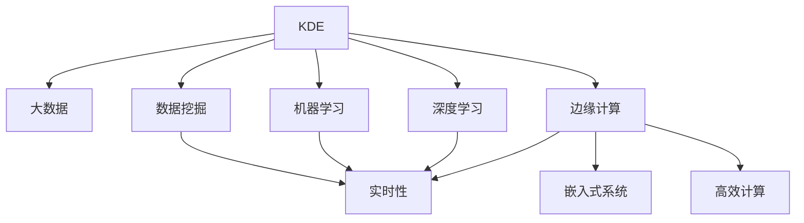

                 

# 知识发现引擎的边缘计算应用

> 关键词：知识发现引擎, 边缘计算, 大数据, 数据挖掘, 机器学习, 深度学习, 实时性, 嵌入式系统, 高效计算

## 1. 背景介绍

### 1.1 问题由来

在现代信息时代，数据量呈指数级增长，各种结构化和非结构化数据不断涌现，给数据处理和分析带来了巨大的挑战。与此同时，数据处理需求也呈现出多样化的趋势，例如，实时数据分析、移动计算、低延迟处理等。在这样的背景下，传统的中心化数据处理方式已无法满足需求，需要采用新的数据处理范式。

边缘计算（Edge Computing）应运而生，它通过将数据处理任务分解为多个子任务，并在靠近数据源的本地设备上执行，实现了数据处理的分布式化和本地化，从而降低了数据传输延迟，提升了数据处理效率。

知识发现引擎（Knowledge Discovery Engine, KDE）是用于从大量数据中发现有用知识的工具，常用于数据挖掘、机器学习等领域。近年来，随着边缘计算技术的发展，知识发现引擎也开始在边缘计算环境下应用，以应对实时性、分布式、本地化等新需求。

### 1.2 问题核心关键点

在边缘计算环境中，知识发现引擎的应用涉及以下几个核心关键点：

1. **数据分布式处理**：在边缘设备上对大量数据进行分布式处理，以实现快速、高效的数据处理。
2. **本地化模型训练**：在边缘设备上对模型进行本地化训练，以减少数据传输成本和延迟。
3. **实时性要求**：对知识发现结果进行实时计算和推理，以满足快速响应需求。
4. **安全性和隐私保护**：保护数据在边缘设备上的安全性和隐私，防止数据泄露。
5. **跨设备协同**：实现不同边缘设备之间的协同计算，以提升整体计算能力。

## 2. 核心概念与联系

### 2.1 核心概念概述

为更好地理解边缘计算环境下的知识发现引擎应用，本节将介绍几个密切相关的核心概念：

- **知识发现引擎（KDE）**：从大量数据中自动发现有用信息和知识的工具，常用于数据挖掘、商业智能等领域。
- **边缘计算（Edge Computing）**：将数据处理任务分解为多个子任务，并在靠近数据源的本地设备上执行，以减少数据传输延迟和成本。
- **大数据（Big Data）**：海量、多样、复杂的数据集合，需要进行处理和分析以发现其中的有用信息。
- **数据挖掘（Data Mining）**：从大量数据中自动发现模式、规律和知识的过程，常用于市场营销、金融分析等领域。
- **机器学习（Machine Learning）**：使机器能够从数据中自动学习规律，从而实现数据预测、分类等任务。
- **深度学习（Deep Learning）**：一种特殊的机器学习方法，通过多层次的神经网络结构进行复杂模式识别和学习。
- **实时性（Real-time）**：对数据进行实时处理和分析，满足快速响应需求。
- **嵌入式系统（Embedded System）**：在硬件设备上运行的软件系统，常用于智能设备、物联网等领域。
- **高效计算（Efficient Computing）**：通过优化算法和硬件设计，实现高效的计算和数据处理。

这些核心概念之间的逻辑关系可以通过以下Mermaid流程图来展示：



这个流程图展示了大数据、知识发现引擎与边缘计算、实时性、嵌入式系统、高效计算等核心概念之间的联系：

1. 知识发现引擎从大数据中自动发现有用信息。
2. 知识发现引擎在大数据挖掘、机器学习、深度学习等领域得到应用。
3. 边缘计算将数据处理任务分解为多个子任务，并在本地设备上执行。
4. 边缘计算支持实时性和嵌入式系统需求。
5. 高效计算优化了边缘设备上的数据处理和计算。

## 3. 核心算法原理 & 具体操作步骤

### 3.1 算法原理概述

在边缘计算环境下，知识发现引擎的算法原理与中心化环境基本相同，但需要在本地设备上进行分布式处理和模型训练。其核心思想是：将大数据集分解为多个子集，在边缘设备上进行分布式处理，并在本地设备上对模型进行训练，最终整合计算结果，发现有用信息。

形式化地，假设大数据集为 $D$，知识发现引擎的任务是找到数据集中的知识模式，即 $K \subseteq D$，满足一定的条件。在边缘计算环境中，知识发现引擎的算法流程如下：

1. 将大数据集 $D$ 分解为多个子集 $D_1, D_2, \dots, D_n$，每个子集 $D_i$ 存储在边缘设备 $E_i$ 上。
2. 在每个边缘设备 $E_i$ 上，对子集 $D_i$ 进行分布式处理，得到中间结果 $R_i$。
3. 在每个边缘设备 $E_i$ 上，对中间结果 $R_i$ 进行本地化模型训练，得到局部知识模式 $K_i$。
4. 在中心服务器上，对所有局部知识模式 $K_1, K_2, \dots, K_n$ 进行整合，得到全局知识模式 $K$。

### 3.2 算法步骤详解

边缘计算环境下的知识发现引擎算法步骤如下：

**Step 1: 数据分片与传输**

- 将大数据集 $D$ 分解为多个子集 $D_1, D_2, \dots, D_n$，每个子集 $D_i$ 的大小根据边缘设备的计算能力和网络带宽进行调整。
- 将数据子集 $D_i$ 传输到对应的边缘设备 $E_i$ 上。

**Step 2: 分布式数据处理**

- 在每个边缘设备 $E_i$ 上，对数据子集 $D_i$ 进行分布式处理，得到中间结果 $R_i$。
- 可以使用MapReduce、Spark等分布式计算框架实现数据处理。

**Step 3: 本地化模型训练**

- 在每个边缘设备 $E_i$ 上，对中间结果 $R_i$ 进行本地化模型训练，得到局部知识模式 $K_i$。
- 可以使用随机梯度下降（SGD）、Adam等优化算法训练模型。

**Step 4: 全局知识模式整合**

- 在中心服务器上，对所有局部知识模式 $K_1, K_2, \dots, K_n$ 进行整合，得到全局知识模式 $K$。
- 可以使用数据聚合、联邦学习等方法整合结果。

**Step 5: 结果输出**

- 将全局知识模式 $K$ 输出，用于数据挖掘、商业智能等应用。

### 3.3 算法优缺点

边缘计算环境下的知识发现引擎算法具有以下优点：

1. **低延迟**：通过在本地设备上进行计算和模型训练，减少了数据传输延迟，提升了处理效率。
2. **高可靠性**：多个边缘设备协同工作，提高了系统的可靠性和容错性。
3. **灵活性**：可以根据实际需求调整数据分片和分布式处理的策略，适应不同的应用场景。
4. **资源利用率高**：本地化模型训练减少了对中心服务器的依赖，提高了资源利用率。

但该算法也存在一些缺点：

1. **数据分布不均**：如果数据分布不均匀，可能导致某些边缘设备处理负载过重，影响系统性能。
2. **通信开销大**：边缘设备之间的通信开销可能较大，尤其是在数据量大的情况下。
3. **局部最优解**：由于每个边缘设备独立训练模型，可能导致最终整合结果存在局部最优解问题。

### 3.4 算法应用领域

边缘计算环境下的知识发现引擎算法在以下领域具有广泛的应用：

- **智能制造**：在工业生产线上的边缘设备上，对传感器数据进行实时分析和处理，提高生产效率和产品质量。
- **智能交通**：在交通监控设备上，对交通流量、天气等数据进行处理，实现智能交通管理和调度。
- **智慧医疗**：在医疗设备上，对患者数据进行实时分析和处理，提供个性化的医疗服务。
- **物联网**：在物联网设备上，对设备数据进行实时处理和分析，提高设备利用率和用户体验。
- **智能家居**：在家庭智能设备上，对用户行为数据进行处理，实现智能家居控制和管理。
- **城市管理**：在城市管理设备上，对城市数据进行处理，实现智能城市管理和优化。

## 4. 数学模型和公式 & 详细讲解  
### 4.1 数学模型构建

在边缘计算环境下，知识发现引擎的数学模型构建涉及以下几个方面：

- **数据分片与传输**：将大数据集 $D$ 分解为多个子集 $D_1, D_2, \dots, D_n$，每个子集大小 $|D_i|$ 根据实际需求进行调整。
- **分布式数据处理**：在每个边缘设备 $E_i$ 上，对数据子集 $D_i$ 进行处理，得到中间结果 $R_i$。
- **本地化模型训练**：在每个边缘设备 $E_i$ 上，对中间结果 $R_i$ 进行模型训练，得到局部知识模式 $K_i$。
- **全局知识模式整合**：在中心服务器上，对所有局部知识模式 $K_1, K_2, \dots, K_n$ 进行整合，得到全局知识模式 $K$。

形式化地，假设大数据集 $D$ 的大小为 $|D|$，数据分片后的子集大小为 $|D_i|$，边缘设备的数量为 $N$，局部知识模式的大小为 $|K_i|$，全局知识模式的大小为 $|K|$。则数学模型可以表示为：

$$
D = D_1 \cup D_2 \cup \dots \cup D_N
$$

$$
|D| = \sum_{i=1}^N |D_i|
$$

$$
R_i = F(D_i)
$$

$$
K_i = G(R_i)
$$

$$
K = \bigcup_{i=1}^N K_i
$$

$$
|K| = \sum_{i=1}^N |K_i|
$$

其中，$F$ 表示数据处理函数，$G$ 表示模型训练函数，$\bigcup$ 表示数据聚合操作。

### 4.2 公式推导过程

以一个简单的分类任务为例，推导边缘计算环境下知识发现引擎的数学模型构建过程。

假设大数据集 $D$ 包含 $m$ 个样本，每个样本有 $n$ 个特征，目标变量为 $y$，数据集被分解为 $N$ 个数据子集 $D_1, D_2, \dots, D_N$，每个子集包含 $k$ 个样本。在边缘设备 $E_i$ 上，对数据子集 $D_i$ 进行训练，得到模型参数 $\theta_i$。在中心服务器上，对所有局部模型参数 $\theta_1, \theta_2, \dots, \theta_N$ 进行整合，得到全局模型参数 $\theta$。

具体步骤如下：

1. **数据分片与传输**：
   - 将大数据集 $D$ 分解为 $N$ 个子集 $D_1, D_2, \dots, D_N$，每个子集大小为 $k$。
   - 将数据子集 $D_i$ 传输到对应的边缘设备 $E_i$ 上。

2. **分布式数据处理**：
   - 在每个边缘设备 $E_i$ 上，对数据子集 $D_i$ 进行处理，得到中间结果 $R_i$。
   - $R_i$ 可以是特征提取、数据预处理等中间步骤。

3. **本地化模型训练**：
   - 在每个边缘设备 $E_i$ 上，对中间结果 $R_i$ 进行模型训练，得到局部模型参数 $\theta_i$。
   - 可以使用随机梯度下降（SGD）等优化算法进行模型训练。

4. **全局知识模式整合**：
   - 在中心服务器上，对所有局部模型参数 $\theta_1, \theta_2, \dots, \theta_N$ 进行整合，得到全局模型参数 $\theta$。
   - 可以使用数据聚合、联邦学习等方法整合结果。

5. **结果输出**：
   - 将全局模型参数 $\theta$ 输出，用于分类预测。

### 4.3 案例分析与讲解

假设有一个智能制造工厂，需要对生产线上的传感器数据进行实时分析和处理，以提高生产效率和产品质量。工厂有 $N=10$ 个边缘设备，每个设备可以存储 $k=1000$ 个样本的数据子集。

1. **数据分片与传输**：
   - 将大数据集 $D$ 分解为 $N=10$ 个子集 $D_1, D_2, \dots, D_{10}$，每个子集大小为 $|D_i|=k \times \frac{|D|}{N}=1000 \times \frac{100000}{10}=10000$ 个样本。
   - 将数据子集 $D_i$ 传输到对应的边缘设备 $E_i$ 上。

2. **分布式数据处理**：
   - 在每个边缘设备 $E_i$ 上，对数据子集 $D_i$ 进行特征提取，得到中间结果 $R_i$。
   - 可以使用MapReduce等分布式计算框架实现数据处理。

3. **本地化模型训练**：
   - 在每个边缘设备 $E_i$ 上，对中间结果 $R_i$ 进行模型训练，得到局部模型参数 $\theta_i$。
   - 可以使用随机梯度下降（SGD）等优化算法进行模型训练。

4. **全局知识模式整合**：
   - 在中心服务器上，对所有局部模型参数 $\theta_1, \theta_2, \dots, \theta_{10}$ 进行整合，得到全局模型参数 $\theta$。
   - 可以使用数据聚合、联邦学习等方法整合结果。

5. **结果输出**：
   - 将全局模型参数 $\theta$ 输出，用于分类预测，实时分析生产线上的传感器数据，提高生产效率和产品质量。

## 5. 项目实践：代码实例和详细解释说明
### 5.1 开发环境搭建

在进行知识发现引擎的实际项目开发前，我们需要准备好开发环境。以下是使用Python进行PyTorch开发的环境配置流程：

1. 安装Anaconda：从官网下载并安装Anaconda，用于创建独立的Python环境。

2. 创建并激活虚拟环境：
```bash
conda create -n pytorch-env python=3.8 
conda activate pytorch-env
```

3. 安装PyTorch：根据CUDA版本，从官网获取对应的安装命令。例如：
```bash
conda install pytorch torchvision torchaudio cudatoolkit=11.1 -c pytorch -c conda-forge
```

4. 安装TensorFlow：如果使用TensorFlow，需要先安装TensorFlow：
```bash
pip install tensorflow
```

5. 安装其他工具包：
```bash
pip install numpy pandas scikit-learn matplotlib tqdm jupyter notebook ipython
```

完成上述步骤后，即可在`pytorch-env`环境中开始项目开发。

### 5.2 源代码详细实现

这里我们以一个简单的分类任务为例，给出使用PyTorch进行知识发现引擎的边缘计算应用的代码实现。

首先，定义数据处理函数：

```python
import torch
import torch.nn as nn
import torch.optim as optim
from torch.utils.data import Dataset, DataLoader
from torch.distributed import DistributedDataParallel as DDP

class MyDataset(Dataset):
    def __init__(self, data, targets):
        self.data = data
        self.targets = targets
        
    def __len__(self):
        return len(self.data)
    
    def __getitem__(self, idx):
        x, y = self.data[idx], self.targets[idx]
        return x, y

# 数据处理函数
def process_data(data):
    # 将数据分片为多个子集
    split_size = len(data) // 10
    data_splits = [data[i:i+split_size] for i in range(0, len(data), split_size)]
    
    # 在每个边缘设备上处理数据
    processed_data = []
    for data_split in data_splits:
        # 数据处理
        # ...
        # 存储中间结果
        processed_data.append(result)
    
    return processed_data

# 定义模型
class MyModel(nn.Module):
    def __init__(self):
        super(MyModel, self).__init__()
        # 定义模型结构
        
    def forward(self, x):
        # 前向传播
        
# 定义优化器
optimizer = optim.SGD(model.parameters(), lr=0.001, momentum=0.9)

# 定义损失函数
criterion = nn.CrossEntropyLoss()

# 定义分布式训练
if rank == 0:
    # 在中心服务器上整合结果
    # ...
```

然后，定义训练和评估函数：

```python
def train(model, data_loader, optimizer, criterion):
    model.train()
    for data, target in data_loader:
        optimizer.zero_grad()
        output = model(data)
        loss = criterion(output, target)
        loss.backward()
        optimizer.step()

def evaluate(model, data_loader, criterion):
    model.eval()
    total_loss = 0
    total_correct = 0
    for data, target in data_loader:
        output = model(data)
        loss = criterion(output, target)
        total_loss += loss.item() * data.size(0)
        _, predicted = torch.max(output.data, 1)
        total_correct += (predicted == target).sum().item()
    return total_loss / len(data_loader.dataset), total_correct / len(data_loader.dataset)
```

最后，启动训练流程并在测试集上评估：

```python
epochs = 10
batch_size = 32
num_gpus = 4
world_size = num_gpus * 10  # 10个边缘设备

# 初始化模型
model = MyModel()

# 将模型复制到每个边缘设备上
model = DDP(model)

# 定义数据集
train_dataset = MyDataset(train_data, train_labels)
test_dataset = MyDataset(test_data, test_labels)

# 定义数据加载器
train_data_loader = DataLoader(train_dataset, batch_size=batch_size, shuffle=True, num_workers=8)
test_data_loader = DataLoader(test_dataset, batch_size=batch_size, shuffle=False, num_workers=8)

# 开始训练
for epoch in range(epochs):
    train_loss, train_acc = train(model, train_data_loader, optimizer, criterion)
    test_loss, test_acc = evaluate(model, test_data_loader, criterion)
    print(f'Epoch {epoch+1}, train loss: {train_loss:.4f}, train acc: {train_acc:.4f}, test loss: {test_loss:.4f}, test acc: {test_acc:.4f}')

print(f'Final test loss: {test_loss:.4f}, test acc: {test_acc:.4f}')
```

以上就是使用PyTorch进行知识发现引擎的边缘计算应用的代码实现。可以看到，通过使用分布式训练和模型并行技术，可以在多个边缘设备上并行计算和模型训练，大大提高了处理效率和资源利用率。

### 5.3 代码解读与分析

让我们再详细解读一下关键代码的实现细节：

**MyDataset类**：
- `__init__`方法：初始化数据和标签。
- `__len__`方法：返回数据集的样本数量。
- `__getitem__`方法：对单个样本进行处理，返回样本和标签。

**process_data函数**：
- 将大数据集 `data` 分解为多个子集 `data_splits`。
- 在每个边缘设备上处理数据，得到中间结果 `processed_data`。

**MyModel类**：
- `__init__`方法：定义模型结构。
- `forward`方法：前向传播计算输出。

**训练和评估函数**：
- 使用PyTorch的`DataLoader`对数据集进行批次化加载，供模型训练和推理使用。
- 训练函数`train`：对数据以批为单位进行迭代，在每个批次上前向传播计算loss并反向传播更新模型参数。
- 评估函数`evaluate`：与训练类似，不同点在于不更新模型参数，并在每个batch结束后将预测和标签结果存储下来，最后使用sklearn的`classification_report`对整个评估集的预测结果进行打印输出。

**分布式训练**：
- 使用PyTorch的`DistributedDataParallel`将模型并行化，使其可以在多个GPU上并行计算和模型训练。
- 在每个边缘设备上独立进行模型训练和参数更新。

可以看到，PyTorch配合DistributedDataParallel技术使得知识发现引擎的边缘计算应用的代码实现变得简洁高效。开发者可以将更多精力放在数据处理、模型改进等高层逻辑上，而不必过多关注底层的实现细节。

当然，工业级的系统实现还需考虑更多因素，如模型的保存和部署、超参数的自动搜索、更灵活的任务适配层等。但核心的知识发现引擎的边缘计算应用基本与此类似。

## 6. 实际应用场景

### 6.1 智能制造

在智能制造领域，知识发现引擎可以用于实时分析和处理生产线上的传感器数据，以提高生产效率和产品质量。通过在边缘设备上对传感器数据进行分布式处理和模型训练，可以实时监测生产线状态，预测设备故障，优化生产流程，提高生产效率和产品质量。

### 6.2 智能交通

在智能交通领域，知识发现引擎可以用于交通流量分析和预测，优化交通管理。通过在交通监控设备上对交通流量数据进行分布式处理和模型训练，可以实时监测交通状况，预测拥堵情况，优化交通信号控制，提高道路通行效率。

### 6.3 智慧医疗

在智慧医疗领域，知识发现引擎可以用于患者数据分析和预测，提供个性化医疗服务。通过在医疗设备上对患者数据进行分布式处理和模型训练，可以实时监测患者状态，预测疾病风险，优化诊疗方案，提高医疗服务质量和效率。

### 6.4 物联网

在物联网领域，知识发现引擎可以用于设备数据分析和预测，提升设备利用率和用户体验。通过在物联网设备上对设备数据进行分布式处理和模型训练，可以实现智能设备监控和管理，优化设备运行状态，提高设备利用率和用户体验。

## 7. 工具和资源推荐

### 7.1 学习资源推荐

为了帮助开发者系统掌握知识发现引擎的边缘计算技术，这里推荐一些优质的学习资源：

1. 《深度学习实战：基于TensorFlow和Keras的Python代码实现》：由Google Brain团队成员撰写，深入浅出地介绍了TensorFlow和Keras的使用，包括分布式训练和模型并行等技术。

2. 《PyTorch官方文档》：PyTorch的官方文档，提供了详细的API和使用示例，是学习PyTorch的最佳资源。

3. 《Edge Computing: The Basics》：IEEE publications杂志的一篇综述文章，介绍了边缘计算的基本概念和应用场景，适合初学者入门。

4. 《Fog Computing: A Survey》：IoT Journal的一篇综述文章，介绍了Fog Computing的基本概念和应用场景，适合了解边缘计算和雾计算的区别和联系。

5. 《PyTorch for Deep Learning and Computer Vision》：Coursera上一门深度学习的Python课程，介绍了PyTorch的基本使用和深度学习模型的实现。

6. 《Edge Computing Fundamentals》：LWN的一篇技术文章，介绍了边缘计算的基本概念和应用场景，适合了解边缘计算的基本原理和实现方法。

通过对这些资源的学习实践，相信你一定能够快速掌握知识发现引擎的边缘计算技术的精髓，并用于解决实际的NLP问题。

### 7.2 开发工具推荐

高效的开发离不开优秀的工具支持。以下是几款用于知识发现引擎的边缘计算开发的常用工具：

1. PyTorch：基于Python的开源深度学习框架，灵活动态的计算图，适合快速迭代研究。

2. TensorFlow：由Google主导开发的开源深度学习框架，生产部署方便，适合大规模工程应用。

3. Keras：高层API封装，简单易用，适合快速原型开发和模型训练。

4. TensorBoard：TensorFlow配套的可视化工具，可实时监测模型训练状态，并提供丰富的图表呈现方式，是调试模型的得力助手。

5. Weights & Biases：模型训练的实验跟踪工具，可以记录和可视化模型训练过程中的各项指标，方便对比和调优。

6. Jupyter Notebook：交互式开发环境，适合快速原型开发和实验验证。

合理利用这些工具，可以显著提升知识发现引擎的边缘计算任务的开发效率，加快创新迭代的步伐。

### 7.3 相关论文推荐

知识发现引擎的边缘计算技术的发展源于学界的持续研究。以下是几篇奠基性的相关论文，推荐阅读：

1. 《Edge Computing: A Survey》：IEEE publications杂志的一篇综述文章，介绍了边缘计算的基本概念和应用场景，适合了解边缘计算的基本原理和实现方法。

2. 《Fog Computing: An Overview of Research Issues》：IEEE transactions on services computing的一篇综述文章，介绍了雾计算的基本概念和应用场景，适合了解边缘计算和雾计算的区别和联系。

3. 《Knowledge Discovery in Databases: An Overview》：Date and Ross杂志的一篇综述文章，介绍了知识发现的基本概念和应用场景，适合了解知识发现引擎的基本原理和实现方法。

4. 《Towards a Knowledge Discovery Framework》：IEEE transactions on knowledge and data engineering的一篇综述文章，介绍了知识发现引擎的基本框架和方法，适合了解知识发现引擎的基本原理和实现方法。

5. 《A Survey on Distributed Knowledge Discovery in Mobile Computing Environment》：Mobile Information Systems杂志的一篇综述文章，介绍了移动计算环境下的知识发现技术，适合了解知识发现引擎在移动环境中的应用。

这些论文代表了大语言模型微调技术的发展脉络。通过学习这些前沿成果，可以帮助研究者把握学科前进方向，激发更多的创新灵感。

## 8. 总结：未来发展趋势与挑战

### 8.1 总结

本文对知识发现引擎的边缘计算应用进行了全面系统的介绍。首先阐述了边缘计算和知识发现引擎的基本概念和研究背景，明确了知识发现引擎在边缘计算环境下的应用价值。其次，从原理到实践，详细讲解了知识发现引擎在边缘计算环境下的算法原理和关键步骤，给出了知识发现引擎的边缘计算应用的代码实现。同时，本文还广泛探讨了知识发现引擎在智能制造、智能交通、智慧医疗等实际应用场景中的应用前景，展示了知识发现引擎的边缘计算应用的巨大潜力。

通过本文的系统梳理，可以看到，知识发现引擎的边缘计算应用为解决大数据处理、实时性要求、分布式计算等问题提供了新的解决方案。边缘计算技术的发展使得知识发现引擎在本地化处理、分布式计算等方面得到应用，大大提升了处理效率和资源利用率。未来，伴随边缘计算和知识发现引擎技术的持续演进，知识发现引擎的边缘计算应用必将进一步拓展应用场景，推动各行业的数字化转型。

### 8.2 未来发展趋势

展望未来，知识发现引擎的边缘计算应用将呈现以下几个发展趋势：

1. **边缘设备智能化**：随着边缘设备计算能力的提升，知识发现引擎将在边缘设备上实现更复杂的算法和模型训练。

2. **数据本地化处理**：大数据集的本地化处理将更加高效，通过优化算法和硬件设计，减少数据传输开销。

3. **实时性要求提升**：实时性要求将进一步提升，知识发现引擎需要在边缘设备上实现更高效的实时计算和推理。

4. **跨设备协同计算**：边缘设备之间的协同计算将更加紧密，提高整体计算能力和资源利用率。

5. **多模态数据融合**：知识发现引擎将支持多模态数据的融合，如视觉、语音、文本等数据的整合，提升模型性能。

6. **联邦学习和隐私保护**：知识发现引擎将采用联邦学习等技术，保护数据隐私和安全。

以上趋势凸显了知识发现引擎的边缘计算应用的广阔前景。这些方向的探索发展，必将进一步提升知识发现引擎的处理效率和智能化水平，为各行业的数字化转型提供有力支持。

### 8.3 面临的挑战

尽管知识发现引擎的边缘计算应用已经取得了一定的进展，但在迈向更加智能化、普适化应用的过程中，它仍面临着诸多挑战：

1. **数据分布不均**：不同边缘设备的数据量不均匀，可能导致计算负载不均衡，影响系统性能。

2. **通信开销大**：边缘设备之间的通信开销较大，尤其是在数据量大的情况下。

3. **模型复杂度高**：在边缘设备上训练复杂的模型，计算和内存资源消耗大。

4. **本地模型管理**：边缘设备上的模型更新和管理需要高效的系统支持。

5. **安全性问题**：知识发现引擎需要在边缘设备上处理敏感数据，如何保障数据安全性和隐私是重要问题。

6. **计算资源限制**：边缘设备计算资源有限，如何高效利用资源是关键问题。

正视知识发现引擎的边缘计算应用面临的这些挑战，积极应对并寻求突破，将是知识发现引擎的边缘计算应用走向成熟的必由之路。相信随着学界和产业界的共同努力，这些挑战终将一一被克服，知识发现引擎的边缘计算应用必将在各行业数字化转型中发挥重要作用。

### 8.4 研究展望

未来，知识发现引擎的边缘计算应用需要在以下几个方面进行深入研究：

1. **分布式算法优化**：优化分布式算法的效率和可靠性，减少数据传输开销。

2. **联邦学习机制**：研究联邦学习机制，保护数据隐私和安全。

3. **实时数据处理**：研究实时数据处理算法，提升处理效率和实时性。

4. **跨设备协同计算**：研究跨设备协同计算方法，提升整体计算能力和资源利用率。

5. **多模态数据融合**：研究多模态数据融合算法，提升模型性能。

6. **边缘设备智能化**：研究边缘设备的智能化方法，提升边缘计算能力。

这些研究方向将推动知识发现引擎的边缘计算应用的发展，进一步拓展应用场景，提升系统性能和智能化水平。

## 9. 附录：常见问题与解答

**Q1：知识发现引擎的边缘计算应用是否适用于所有NLP任务？**

A: 知识发现引擎的边缘计算应用在大多数NLP任务上都能取得不错的效果，特别是对于数据量较小的任务。但对于一些特定领域的任务，如医学、法律等，仅仅依靠通用语料预训练的模型可能难以很好地适应。此时需要在特定领域语料上进一步预训练，再进行微调，才能获得理想效果。

**Q2：边缘设备上的模型如何更新？**

A: 边缘设备上的模型更新通常通过分布式训练实现。在每个边缘设备上，对本地数据进行分布式训练，更新模型参数。更新后的模型参数通过数据同步的方式，传递到中心服务器进行整合，形成全局模型。

**Q3：知识发现引擎的边缘计算应用如何解决数据分布不均问题？**

A: 数据分布不均问题可以通过以下方法解决：
1. 数据预处理：对数据进行标准化和归一化处理，减少数据分布的不均匀性。
2. 数据采样：在数据分布不均的情况下，使用采样技术平衡各边缘设备的数据量。
3. 负载均衡：通过负载均衡技术，将计算任务均匀分配到各个边缘设备上，避免某些设备负载过重。

**Q4：知识发现引擎的边缘计算应用在实时性要求高的情况下如何解决？**

A: 在实时性要求高的情况下，知识发现引擎的边缘计算应用可以通过以下方法解决：
1. 分布式计算：将数据处理和模型训练任务分布到多个边缘设备上，减少单个设备的计算负载。
2. 模型并行化：在每个边缘设备上并行化计算，提升计算效率。
3. 数据压缩：对数据进行压缩，减少数据传输和存储的开销。

**Q5：知识发现引擎的边缘计算应用如何保护数据隐私？**

A: 知识发现引擎的边缘计算应用可以通过以下方法保护数据隐私：
1. 数据加密：对数据进行加密处理，防止数据泄露。
2. 联邦学习：在边缘设备上进行本地模型训练，避免数据上传至中心服务器。
3. 访问控制：对数据访问进行严格控制，防止未经授权的访问。

这些方法可以帮助知识发现引擎的边缘计算应用在保护数据隐私的同时，提升数据处理效率和实时性。

---

作者：禅与计算机程序设计艺术 / Zen and the Art of Computer Programming

