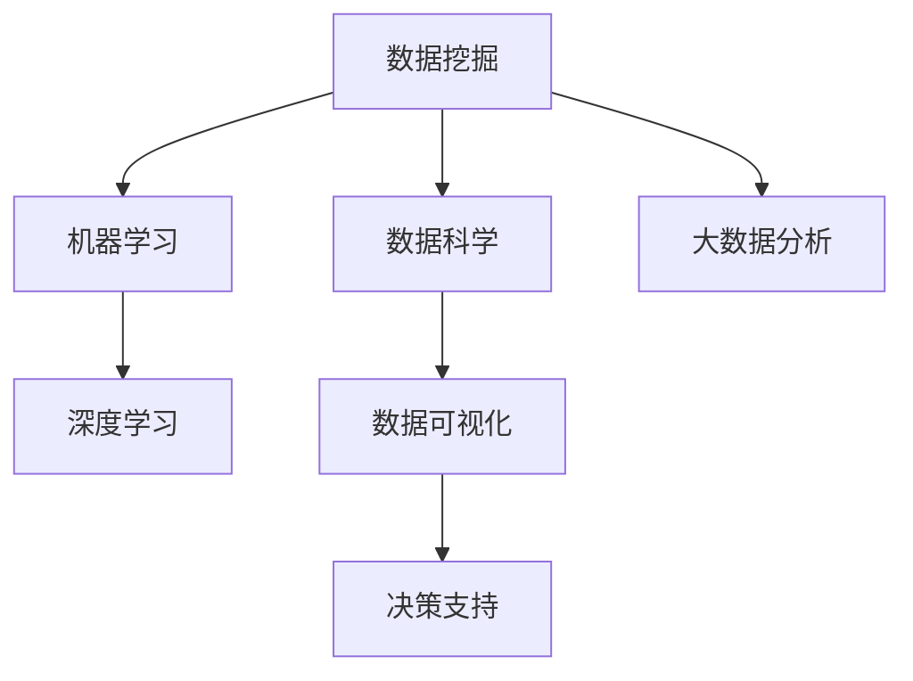

                 

# 知识发现引擎：信息时代的智慧之钥

> 关键词：知识发现引擎, 数据挖掘, 数据科学, 信息提取, 机器学习, 大数据分析, 深度学习

## 1. 背景介绍

### 1.1 问题由来

随着信息时代的到来，人类社会产生的数据量呈指数级增长。这些数据中蕴含着宝贵的信息资源，可以用于商业决策、科学研究、公共服务等多个领域，具有极高的应用价值。然而，数据规模的庞大和数据质量的参差不齐，使得直接从中提取有价值的信息变得困难重重。如何高效、准确地从海量数据中发现有用知识，是数据科学领域的核心挑战之一。

### 1.2 问题核心关键点

知识发现引擎（Knowledge Discovery Engine, KDE）是一种从大规模数据中自动挖掘有用知识和规律的技术。通过智能算法和大数据分析，KDE可以从原始数据中抽取出有用信息，辅助人类做出更准确的决策。当前，KDE已经广泛应用于商业智能、医学诊断、金融分析、社交网络等多个领域，成为信息时代不可或缺的重要工具。

### 1.3 问题研究意义

研究KDE，对于提升数据应用价值，推动信息时代社会进步具有重要意义：

1. 提升决策质量。KDE可以自动从数据中挖掘出有用信息，帮助决策者快速理解数据背景，做出更加精准的决策。
2. 加速科学研究。KDE可以帮助科研人员发现潜在的研究方向，加速科学发现进程。
3. 改善服务质量。KDE可以用于提升商业服务、公共服务的智能化水平，提高用户满意度。
4. 赋能产业升级。KDE可以用于企业数据分析，推动产业数字化转型，提升企业竞争力。
5. 赋能个体优化。KDE可以用于个人数据分析，帮助人们更好地理解自身行为模式，做出更优的个人决策。

## 2. 核心概念与联系

### 2.1 核心概念概述

为了更好地理解KDE的工作原理和优化方向，本节将介绍几个密切相关的核心概念：

- 数据挖掘（Data Mining）：从原始数据中自动发现有用知识和模式的过程，是KDE的重要组成部分。
- 数据科学（Data Science）：涵盖数据收集、数据处理、数据分析、数据可视等多个环节，旨在从数据中提取有用信息。
- 机器学习（Machine Learning）：使用算法和模型自动进行数据学习和预测，是KDE的主要技术支撑。
- 大数据分析（Big Data Analysis）：利用分布式计算和并行处理技术，对大规模数据进行高效分析，是KDE的底层基础。
- 深度学习（Deep Learning）：一种基于神经网络的机器学习技术，具有强大的特征提取和模式识别能力，是KDE中的高级技术手段。
- 数据可视化（Data Visualization）：通过图形化手段，将数据信息直观展示，帮助人类更好地理解数据，是KDE的重要输出形式。

这些核心概念之间的逻辑关系可以通过以下Mermaid流程图来展示：



这个流程图展示了几大核心概念及其之间的关系：

1. 数据挖掘是KDE的核心任务，通过智能算法自动发现数据中的模式和规律。
2. 数据科学涵盖数据处理和分析的各个环节，是KDE的理论基础。
3. 机器学习提供自动学习和预测能力，是KDE的主要技术支撑。
4. 大数据分析利用分布式计算技术，提供高效的数据处理能力，是KDE的底层基础。
5. 深度学习是KDE中的高级技术手段，具有强大的特征提取能力。
6. 数据可视化提供直观的数据展示，帮助人类更好地理解数据和做出决策。

## 3. 核心算法原理 & 具体操作步骤
### 3.1 算法原理概述

KDE的原理主要基于数据挖掘和机器学习。其核心思想是：通过智能算法和大数据分析，自动从原始数据中发现有用知识和规律。具体步骤如下：

1. **数据收集**：从不同渠道收集原始数据，涵盖结构化和非结构化数据。
2. **数据清洗**：对数据进行去重、去噪、缺失值处理等操作，保证数据质量。
3. **数据预处理**：对数据进行归一化、降维、特征工程等操作，以便后续分析。
4. **数据挖掘**：使用智能算法（如关联规则学习、聚类分析、分类算法等）从数据中自动发现模式和规律。
5. **数据可视化**：将挖掘出的结果以图形化形式展示，帮助人类更好地理解数据。
6. **决策支持**：根据挖掘结果，辅助人类做出更准确的决策。

### 3.2 算法步骤详解

以下是KDE的具体操作步骤：

**Step 1: 数据收集与清洗**

1. **数据来源**：从不同渠道收集原始数据，包括数据库、日志文件、网页、社交媒体等。
2. **数据预处理**：对数据进行去重、去噪、缺失值处理、异常值检测等操作，保证数据质量。

**Step 2: 数据预处理与特征工程**

1. **数据归一化**：对数据进行标准化或归一化处理，使其在0到1之间，便于后续分析。
2. **特征选择**：通过特征选择算法（如卡方检验、信息增益等），选择对分析有用的特征。
3. **特征提取**：对文本、图像、音频等非结构化数据进行特征提取，生成高维特征向量。

**Step 3: 数据挖掘与模式发现**

1. **关联规则学习**：使用Apriori、FP-growth等算法发现数据中的关联规则。
2. **聚类分析**：使用K-means、DBSCAN等算法对数据进行聚类分析，发现数据中的群组结构。
3. **分类算法**：使用决策树、随机森林、支持向量机等算法对数据进行分类，发现数据中的类别结构。
4. **序列分析**：使用时间序列分析等方法，对数据中的时间依赖关系进行分析。

**Step 4: 数据可视化与结果展示**

1. **数据可视化**：使用图表、仪表盘等图形化工具，将挖掘结果直观展示。
2. **交互式展示**：开发交互式可视化界面，允许用户动态探索数据。

**Step 5: 决策支持与知识应用**

1. **决策建议**：根据挖掘结果，提出决策建议，辅助人类做出更准确的决策。
2. **知识应用**：将挖掘结果应用于实际场景中，提升业务效率和决策质量。

### 3.3 算法优缺点

KDE具有以下优点：

1. **自动化高效**：通过智能算法自动从数据中发现有用信息，节省大量人力和时间。
2. **应用广泛**：适用于多个领域，包括商业智能、医学诊断、金融分析等。
3. **数据驱动**：基于数据驱动的决策，客观可靠。
4. **技术先进**：结合机器学习和深度学习技术，具有强大的分析和预测能力。

同时，KDE也存在一定的局限性：

1. **数据质量要求高**：KDE对数据质量有较高要求，数据收集和清洗过程复杂耗时。
2. **算法复杂度高**：一些高级算法（如深度学习）对计算资源和算法复杂度要求较高，可能面临技术瓶颈。
3. **结果解释性差**：KDE输出结果通常是黑盒模型，难以解释其内部工作机制和决策逻辑。
4. **依赖数据量**：KDE的效果很大程度上依赖于数据量的大小和质量，数据不足或噪声较大时效果不佳。
5. **结果可重复性差**：不同数据集和算法参数可能会产生不同的结果，结果的稳定性和可重复性较差。

尽管存在这些局限性，但就目前而言，KDE仍是大数据时代最具潜力的数据分析工具之一。未来相关研究的方向在于如何进一步降低对数据质量和计算资源的需求，提高算法的可解释性和可重复性，同时兼顾高效性和实用性。

### 3.4 算法应用领域

KDE已经在多个领域得到了广泛的应用，具体包括：

- 商业智能（Business Intelligence, BI）：通过数据分析挖掘用户行为模式，帮助企业制定营销策略和提升运营效率。
- 医学诊断（Medical Diagnosis）：通过分析患者病历和临床数据，辅助医生诊断疾病和制定治疗方案。
- 金融分析（Financial Analysis）：通过分析市场数据和财务数据，进行风险管理和投资决策。
- 社交网络分析（Social Network Analysis）：通过分析用户社交行为数据，发现网络中的关系和结构。
- 自然语言处理（Natural Language Processing, NLP）：通过分析文本数据，挖掘文本中的情感、主题等信息。
- 图像识别（Image Recognition）：通过分析图像数据，识别图像中的对象和特征。
- 推荐系统（Recommendation System）：通过分析用户行为数据，推荐用户可能感兴趣的产品或内容。

除了上述这些经典应用外，KDE还被创新性地应用到更多场景中，如智能家居、智能交通、智能制造等，为各行各业带来了新的技术突破。随着大数据时代的到来，KDE将会在更多领域得到应用，为各行各业带来更高效、更智能的解决方案。

## 4. 数学模型和公式 & 详细讲解  
### 4.1 数学模型构建

本节将使用数学语言对KDE的工作原理进行更加严格的刻画。

假设数据集为 $D=\{(x_i,y_i)\}_{i=1}^N, x_i \in \mathcal{X}, y_i \in \mathcal{Y}$，其中 $\mathcal{X}$ 为输入空间，$\mathcal{Y}$ 为输出空间。

定义KDE模型的参数为 $\theta$，训练目标为最小化经验风险：

$$
\mathcal{L}(\theta) = \frac{1}{N}\sum_{i=1}^N \ell(f(x_i; \theta),y_i)
$$

其中 $\ell$ 为损失函数，可以是均方误差、交叉熵等。

KDE的核心算法之一是决策树算法，其数学模型构建如下：

$$
f(x_i; \theta) = \begin{cases}
0 & \text{if } x_i \in A_j \\
1 & \text{if } x_i \notin A_j
\end{cases}
$$

其中 $A_j$ 为决策树中的一个叶节点，$x_i$ 属于节点 $A_j$ 的取值为 1，否则为 0。

### 4.2 公式推导过程

以下我们以决策树算法为例，推导其损失函数及梯度计算公式。

假设决策树深度为 $m$，叶节点数为 $n$。对于样本 $(x,y)$，根据决策树结构，计算其预测值：

$$
f(x_i; \theta) = \begin{cases}
0 & \text{if } x_i \in A_j \\
1 & \text{if } x_i \notin A_j
\end{cases}
$$

损失函数 $\ell$ 可以定义如下：

$$
\ell(f(x_i; \theta),y_i) = \begin{cases}
0 & \text{if } f(x_i; \theta) = y_i \\
\infty & \text{otherwise}
\end{cases}
$$

基于上述定义，计算经验风险 $\mathcal{L}(\theta)$：

$$
\mathcal{L}(\theta) = \frac{1}{N}\sum_{i=1}^N \ell(f(x_i; \theta),y_i)
$$

计算损失函数对参数 $\theta$ 的梯度，需要遍历所有叶节点和样本，计算误差贡献：

$$
\frac{\partial \mathcal{L}(\theta)}{\partial \theta_k} = \sum_{i=1}^N \sum_{j=1}^n \frac{1}{N}\Delta_{i,j}
$$

其中 $\Delta_{i,j}$ 为样本 $x_i$ 属于节点 $A_j$ 的误差贡献，可以递归计算得到。

在得到损失函数的梯度后，即可带入优化算法进行参数更新，最小化经验风险。重复上述过程直至收敛，最终得到适应数据的决策树模型。

## 5. 项目实践：代码实例和详细解释说明
### 5.1 开发环境搭建

在进行KDE项目实践前，我们需要准备好开发环境。以下是使用Python进行Scikit-learn开发的环境配置流程：

1. 安装Anaconda：从官网下载并安装Anaconda，用于创建独立的Python环境。

2. 创建并激活虚拟环境：
```bash
conda create -n sklearn-env python=3.8 
conda activate sklearn-env
```

3. 安装Scikit-learn：
```bash
conda install scikit-learn
```

4. 安装各类工具包：
```bash
pip install numpy pandas matplotlib sklearn scikit-learn seaborn jupyter notebook ipython
```

完成上述步骤后，即可在`sklearn-env`环境中开始KDE实践。

### 5.2 源代码详细实现

下面我们以K-means聚类算法为例，给出使用Scikit-learn库对数据进行聚类的PyTorch代码实现。

首先，定义数据处理函数：

```python
from sklearn import datasets
from sklearn.cluster import KMeans
import numpy as np

def load_data():
    data = datasets.load_iris()
    X = data.data
    y = data.target
    return X, y

def preprocess_data(X, y):
    X = X[:, [0, 2]]  # 只取前两个特征
    X = (X - np.mean(X, axis=0)) / np.std(X, axis=0)  # 归一化
    return X, y
```

然后，定义聚类模型和优化器：

```python
from sklearn.cluster import KMeans
from sklearn.metrics import silhouette_score

X, y = load_data()
X, y = preprocess_data(X, y)

model = KMeans(n_clusters=3)
optimizer = None  # K-means不需要优化器
```

接着，定义训练和评估函数：

```python
def train_model(model, X, y):
    model.fit(X)
    return model

def evaluate_model(model, X, y):
    labels = model.predict(X)
    score = silhouette_score(X, labels)
    return score

model = train_model(model, X, y)
print(f'Silhouette score: {evaluate_model(model, X, y)}')
```

最后，启动训练流程并在测试集上评估：

```python
# 评估模型
model = train_model(model, X, y)
print(f'Silhouette score: {evaluate_model(model, X, y)}')
```

以上就是使用Scikit-learn对数据进行K-means聚类的完整代码实现。可以看到，Scikit-learn库提供了方便的封装，使得K-means算法的使用非常简单。

### 5.3 代码解读与分析

让我们再详细解读一下关键代码的实现细节：

**load_data函数**：
- `datasets.load_iris()`：从Scikit-learn自带的鸢尾花数据集中加载数据。
- `X = data.data`：提取特征数据。
- `y = data.target`：提取标签数据。

**preprocess_data函数**：
- `X[:, [0, 2]]`：只取数据的前两个特征。
- `X = (X - np.mean(X, axis=0)) / np.std(X, axis=0)`：对数据进行标准化处理，归一化到0到1之间。

**train_model函数**：
- `model.fit(X)`：对K-means模型进行训练，将数据分为3个簇。

**evaluate_model函数**：
- `model.predict(X)`：对新数据进行聚类预测。
- `silhouette_score(X, labels)`：计算聚类的Silhouette系数，评估聚类效果。

**训练流程**：
- 定义模型和优化器。
- 调用`train_model`函数训练模型。
- 调用`evaluate_model`函数评估模型效果。

可以看到，Scikit-learn库的使用极大简化了K-means算法的代码实现，使得开发者可以将更多精力放在模型设计和参数调优上，而不是底层算法的细节。

当然，工业级的系统实现还需考虑更多因素，如模型的保存和部署、超参数的自动搜索、更灵活的任务适配层等。但核心的聚类过程基本与此类似。

## 6. 实际应用场景
### 6.1 商业智能

KDE在商业智能（BI）领域的应用非常广泛，可以帮助企业更好地理解和利用数据，从而提升运营效率和盈利能力。

例如，KDE可以用于：
- 客户细分：通过分析客户行为数据，将客户分为不同细分市场，制定针对性营销策略。
- 销售预测：通过分析历史销售数据，预测未来销售趋势，优化库存管理。
- 市场分析：通过分析市场数据，发现市场趋势和竞争态势，辅助企业制定市场策略。
- 客户流失预测：通过分析客户行为数据，预测客户流失风险，采取挽留措施。

### 6.2 医学诊断

在医学诊断领域，KDE可以用于分析患者的病历和临床数据，辅助医生进行疾病诊断和治疗决策。

例如，KDE可以用于：
- 疾病分类：通过分析患者的临床数据，发现不同疾病的特征，提高诊断准确率。
- 治疗方案推荐：通过分析患者的病历和基因数据，推荐最适合的治疗方案。
- 预后预测：通过分析患者的病历和治疗数据，预测疾病预后，辅助医生制定治疗计划。

### 6.3 金融分析

在金融分析领域，KDE可以用于分析市场数据和财务数据，进行风险管理和投资决策。

例如，KDE可以用于：
- 风险评估：通过分析市场数据和财务数据，评估金融产品的风险，制定投资策略。
- 股票价格预测：通过分析历史股价数据，预测股票价格走势，辅助投资决策。
- 欺诈检测：通过分析交易数据，发现异常交易行为，预防金融欺诈。

### 6.4 社交网络分析

在社交网络分析领域，KDE可以用于分析用户社交行为数据，发现网络中的关系和结构。

例如，KDE可以用于：
- 社区发现：通过分析用户互动数据，发现不同的社交社区。
- 意见领袖识别：通过分析用户互动数据，识别网络中的意见领袖，辅助舆论引导。
- 社交网络可视化：通过可视化工具，展示社交网络结构，帮助用户理解社交关系。

### 6.5 未来应用展望

随着KDE技术的不断进步，其在更多领域的应用将得到拓展，带来更大的社会和经济价值。

- 智慧医疗：通过分析医疗数据，提高诊疗水平，优化医疗资源配置。
- 智慧交通：通过分析交通数据，优化交通管理，减少拥堵。
- 智能制造：通过分析生产数据，提高生产效率，降低成本。
- 智慧农业：通过分析农业数据，优化农业生产，提升农业产出。
- 智能家居：通过分析用户行为数据，提升家居智能化水平，改善用户体验。

总之，KDE技术将在更多领域发挥重要作用，推动各行各业向智能化、数字化方向发展。未来，KDE的研究方向将更多地关注模型的可解释性、鲁棒性和可扩展性，推动其应用范围和效果进一步提升。

## 7. 工具和资源推荐
### 7.1 学习资源推荐

为了帮助开发者系统掌握KDE的理论基础和实践技巧，这里推荐一些优质的学习资源：

1. 《Data Science for Business》书籍：由Foster Provost和Tom Fawcett所著，系统介绍了数据科学在商业中的应用，涵盖数据挖掘、数据可视化等多个方面。

2. 《Hands-On Data Science with Scikit-Learn and Pandas》书籍：由Roman Yurchak所著，详细介绍了Scikit-learn库的使用，涵盖机器学习、数据处理等多个方面。

3. Kaggle竞赛平台：提供大量数据集和竞赛任务，帮助开发者在实际应用中提升数据挖掘技能。

4. Coursera《数据科学专项》课程：由Duke大学开设，涵盖数据科学基础、数据处理、数据分析等多个环节，适合初学者入门。

5. Udacity《数据科学纳米学位》课程：涵盖数据科学的全流程学习，包括数据收集、数据清洗、数据可视化等多个环节，适合进阶学习。

通过对这些资源的学习实践，相信你一定能够快速掌握KDE的核心技术，并用于解决实际的商业和科研问题。

### 7.2 开发工具推荐

高效的开发离不开优秀的工具支持。以下是几款用于KDE开发的常用工具：

1. Python：通用编程语言，灵活高效，适合开发和应用广泛的数据挖掘算法。

2. Scikit-learn：开源数据挖掘库，提供了丰富的机器学习算法和工具，是KDE开发的主流选择。

3. TensorFlow：开源深度学习框架，支持分布式计算和GPU加速，适合处理大规模数据。

4. PyTorch：开源深度学习框架，灵活高效，适合开发和应用各种机器学习算法。

5. RapidMiner：数据挖掘工具，提供了可视化的界面和丰富的算法库，适合入门和快速开发。

6. WEKA：数据挖掘工具，提供了丰富的算法和可视化界面，适合学术研究和工业应用。

合理利用这些工具，可以显著提升KDE开发效率，加快创新迭代的步伐。

### 7.3 相关论文推荐

KDE的研究历史悠久，涉及的领域广泛，以下是几篇奠基性的相关论文，推荐阅读：

1. 《An Introduction to Statistical Learning》：由Gareth James、Daniela Witten、Trevor Hastie和Robert Tibshirani所著，系统介绍了统计学习方法，涵盖数据预处理、特征选择、模型评估等多个环节。

2. 《The Elements of Statistical Learning》：由Tibshirani、Hastie和Frank指出的《统计学习基础》，详细介绍了统计学习算法，涵盖线性回归、逻辑回归、支持向量机等多个方面。

3. 《Data Science for Business》：由Foster Provost和Tom Fawcett所著，系统介绍了数据科学在商业中的应用，涵盖数据挖掘、数据可视化等多个方面。

4. 《Data Mining and Statistical Learning》：由Michael Steinbach、Jerry Han和Kenneth Ng所著，系统介绍了数据挖掘和统计学习算法，涵盖关联规则学习、聚类分析、分类算法等多个方面。

5. 《The Python Data Science Handbook》：由Jake VanderPlas所著，详细介绍了Python在数据科学中的应用，涵盖数据处理、数据可视化等多个方面。

这些论文代表了大数据挖掘和KDE的发展脉络。通过学习这些前沿成果，可以帮助研究者把握学科前进方向，激发更多的创新灵感。

## 8. 总结：未来发展趋势与挑战

### 8.1 总结

本文对KDE进行了全面系统的介绍。首先阐述了KDE的核心思想和研究背景，明确了其在数据科学领域的核心地位。其次，从原理到实践，详细讲解了KDE的数学模型和核心算法，给出了KDE任务开发的完整代码实例。同时，本文还广泛探讨了KDE在商业智能、医学诊断、金融分析等多个领域的应用前景，展示了KDE技术的巨大潜力。最后，本文精选了KDE学习的优质资源，力求为读者提供全方位的技术指引。

通过本文的系统梳理，可以看到，KDE技术在数据科学领域的应用前景广阔，是挖掘数据价值、提升决策质量的重要手段。未来，KDE的研究方向将更多地关注模型的可解释性、鲁棒性和可扩展性，推动其应用范围和效果进一步提升。

### 8.2 未来发展趋势

展望未来，KDE技术将呈现以下几个发展趋势：

1. 自动化程度提升：随着算法和技术的不断进步，KDE将变得更加自动化和智能化，能够更好地适应复杂多变的数据环境。

2. 算法融合创新：未来KDE将更多地融合机器学习、深度学习、强化学习等前沿技术，提升模型的预测能力和泛化性能。

3. 多模态数据整合：未来KDE将更多地整合视觉、语音、文本等多模态数据，提升模型的全面感知能力。

4. 实时数据处理：未来KDE将更多地应用于实时数据处理场景，如在线推荐、实时监控等，提升数据的实时性。

5. 用户交互优化：未来KDE将更多地支持用户交互，提供更加个性化、智能化的数据分析服务。

6. 跨领域应用拓展：未来KDE将更多地应用于交叉学科领域，如生物医学、环境科学、社会科学等，推动学科融合和交叉发展。

以上趋势凸显了KDE技术的广阔前景。这些方向的探索发展，必将进一步提升KDE的应用效果，推动其成为数据科学领域的重要工具。

### 8.3 面临的挑战

尽管KDE技术已经取得了瞩目成就，但在迈向更加智能化、普适化应用的过程中，它仍面临着诸多挑战：

1. 数据质量瓶颈：KDE对数据质量有较高要求，数据收集和清洗过程复杂耗时。如何在不降低数据质量的前提下，提高数据处理效率，是未来的一大挑战。

2. 算法复杂度提升：随着KDE应用领域的拓展，算法的复杂度将不断提高，计算资源和算法优化成为瓶颈。如何优化算法，提高计算效率，是未来的一个重要课题。

3. 模型可解释性不足：KDE输出结果通常是黑盒模型，难以解释其内部工作机制和决策逻辑。如何提升模型的可解释性，使其更加透明和可信，是未来的重要研究方向。

4. 数据隐私和安全：KDE在处理大规模数据时，如何保护用户隐私和安全，避免数据泄露和滥用，是未来的重要问题。

5. 模型鲁棒性和稳定性：KDE在面对新数据和新场景时，如何保证模型的鲁棒性和稳定性，避免灾难性遗忘和过拟合，是未来的重要课题。

6. 模型可扩展性：KDE在处理大规模数据时，如何保证模型的可扩展性和高效性，避免资源瓶颈和性能瓶颈，是未来的重要研究方向。

这些挑战凸显了KDE技术的发展空间。只有从数据、算法、工程、伦理等多个维度协同发力，才能不断提升KDE的效果和应用范围。

### 8.4 研究展望

面向未来，KDE的研究方向将更多地关注以下几个方面：

1. 自动化和智能化：开发更加自动化和智能化的算法，提升模型的预测能力和泛化性能。

2. 可解释性和透明性：提升模型的可解释性和透明性，使模型决策过程更加可信和透明。

3. 跨模态数据整合：更多地整合视觉、语音、文本等多模态数据，提升模型的全面感知能力。

4. 实时数据处理：更多地应用于实时数据处理场景，提升数据的实时性和互动性。

5. 用户交互优化：支持用户交互，提供更加个性化、智能化的数据分析服务。

6. 跨领域应用拓展：应用于交叉学科领域，推动学科融合和交叉发展。

7. 数据隐私和安全：保护用户隐私和安全，避免数据泄露和滥用。

8. 模型鲁棒性和稳定性：提高模型的鲁棒性和稳定性，避免灾难性遗忘和过拟合。

9. 模型可扩展性：提升模型的可扩展性和高效性，避免资源瓶颈和性能瓶颈。

这些研究方向将推动KDE技术向更加智能化、普适化和安全化方向发展，带来更大的社会和经济价值。

## 9. 附录：常见问题与解答

**Q1：KDE对数据质量要求高，如何提高数据处理效率？**

A: 提高数据处理效率，可以从以下几个方面入手：
1. 数据清洗自动化：使用自动化工具（如ETL工具）进行数据清洗和预处理，减少人工干预。
2. 数据预处理优化：优化数据预处理流程，使用高效的算法和工具进行数据转换和归一化。
3. 并行处理：利用分布式计算和并行处理技术，提升数据处理速度。

**Q2：KDE输出结果通常是黑盒模型，如何提升模型的可解释性？**

A: 提升模型可解释性，可以从以下几个方面入手：
1. 特征选择：选择与输出结果相关性较高的特征，减少模型的复杂度。
2. 可视化工具：使用可视化工具（如t-SNE、UMAP等），展示数据和模型的分布，帮助理解模型行为。
3. 特征重要性分析：分析特征对模型输出的贡献，理解模型的决策过程。
4. 模型解释工具：使用模型解释工具（如SHAP、LIME等），生成模型解释，提供决策依据。

**Q3：KDE面临数据隐私和安全问题，如何保护用户隐私？**

A: 保护用户隐私，可以从以下几个方面入手：
1. 数据匿名化：对数据进行匿名化处理，去除敏感信息。
2. 数据加密：对数据进行加密处理，防止数据泄露。
3. 访问控制：使用访问控制技术，限制数据访问权限。
4. 安全审计：定期进行安全审计，发现和修复安全漏洞。

**Q4：KDE在面对新数据和新场景时，如何保证模型的鲁棒性和稳定性？**

A: 保证模型的鲁棒性和稳定性，可以从以下几个方面入手：
1. 数据增量学习：使用增量学习算法，逐步更新模型，避免模型过拟合。
2. 模型调参：调整模型参数，优化模型结构，提高模型泛化性能。
3. 对抗训练：引入对抗样本，训练鲁棒模型，提高模型抗干扰能力。

**Q5：KDE在处理大规模数据时，如何保证模型的可扩展性和高效性？**

A: 保证模型的可扩展性和高效性，可以从以下几个方面入手：
1. 分布式计算：利用分布式计算技术，提升数据处理速度。
2. 模型压缩：使用模型压缩技术，减小模型大小，提高推理效率。
3. 模型并行：使用模型并行技术，提升计算速度，提高模型可扩展性。

这些问题的解答，展示了KDE在实际应用中面临的挑战和解决方案，为开发者提供了实用的技术指导。

---

作者：禅与计算机程序设计艺术 / Zen and the Art of Computer Programming

