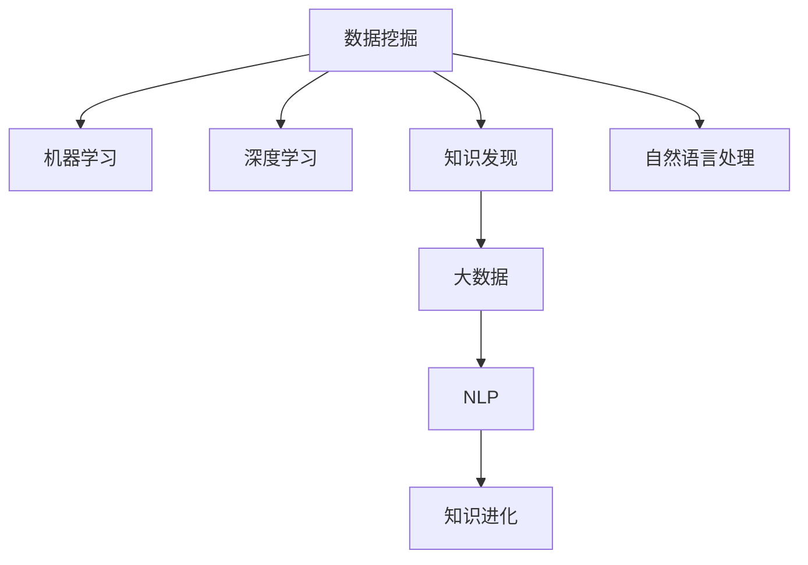

                 

# 知识发现引擎：加速人类知识进化的催化剂

> 关键词：知识发现引擎,人类知识进化,数据挖掘,机器学习,人工智能,大数据,深度学习

## 1. 背景介绍

### 1.1 问题由来
当今社会，信息量呈指数级增长，知识和信息的挖掘、管理和应用变得日益复杂。人类知识进化面临前所未有的挑战，需要在海量数据中提取有价值的知识，加速人类认知能力的提升。知识发现引擎(Knowledge Discovery Engine, KDE)应运而生，通过自动挖掘和整合数据中的知识模式，推动知识的创新与应用。

知识发现引擎是连接数据与知识的重要桥梁，其核心任务是自动化地从数据中发现模式、规律、关系等知识信息。通过应用数据挖掘、机器学习、深度学习等技术，知识发现引擎能够在数据中寻找未知的关联、模式和知识，为各行各业提供智能化的决策支持，加速知识的积累和进化。

### 1.2 问题核心关键点
知识发现引擎主要关注以下几个关键问题：

- 如何从大规模数据中高效提取知识模式：数据规模不断扩大，需要自动化的知识发现技术来处理。
- 如何利用机器学习算法识别隐藏的关系和规律：数据通常包含复杂的非线性关系，需要强大的算法进行识别。
- 如何处理半结构化数据和非结构化数据：现实世界中的数据形态多样，如何统一处理是关键挑战。
- 如何确保发现的知识可解释性和可靠性：知识发现过程需要可解释，才能得到广泛认可和使用。
- 如何集成多源异构数据：不同来源、格式的数据如何有效整合和利用。
- 如何在隐私保护的前提下进行知识发现：处理大规模数据时，隐私保护是重要问题。

通过解决这些核心关键点，知识发现引擎能够高效、准确地挖掘出数据中的知识，推动知识进化和创新，为社会各领域带来变革性影响。

## 2. 核心概念与联系

### 2.1 核心概念概述

为更好地理解知识发现引擎的工作原理和应用场景，本节将介绍几个密切相关的核心概念：

- 数据挖掘(Data Mining)：利用算法从大量数据中发现有意义的模式、关联、规律、异常等知识信息的过程。
- 机器学习(Machine Learning)：通过训练模型从数据中学习规律，实现对新数据的预测或分类。
- 深度学习(Deep Learning)：一种特殊的机器学习方法，使用多层神经网络处理复杂数据。
- 知识发现(Knowledge Discovery)：从数据中提取、解释、呈现和利用有价值的知识信息。
- 大数据(Big Data)：涉及海量、高速、多样化的数据，需要分布式处理和存储技术。
- 自然语言处理(Natural Language Processing, NLP)：利用计算机处理和理解人类语言的技术。

这些核心概念之间的逻辑关系可以通过以下Mermaid流程图来展示：



这个流程图展示了几大核心概念之间的联系：

1. 数据挖掘是大规模数据中发现知识的基础。
2. 机器学习和深度学习是数据挖掘中常用的算法，用于从数据中提取规律。
3. 知识发现是将数据挖掘结果转化为可用知识的桥梁。
4. 大数据技术提供了处理海量数据的基础设施。
5. 自然语言处理是知识发现引擎在文本数据处理方面的重要应用。

这些概念共同构成了知识发现引擎的工作框架，使其能够在各种数据场景中发现知识，加速知识进化。

## 3. 核心算法原理 & 具体操作步骤
### 3.1 算法原理概述

知识发现引擎的核心算法基于数据挖掘、机器学习和深度学习技术。其核心思想是：利用算法从大规模数据中自动发现模式、关系和知识，辅助决策和知识创新。

知识发现引擎的流程一般包括以下几个关键步骤：

1. **数据预处理**：对原始数据进行清洗、转换和归一化，确保数据质量和可用性。
2. **特征工程**：从原始数据中提取、选择和构建有意义的特征，提升模型性能。
3. **模型训练**：使用机器学习或深度学习模型，训练出能够发现数据模式和关系的模型。
4. **知识提取**：从训练好的模型中提取关键的知识模式、关联和规律。
5. **结果验证**：对提取的知识进行验证和解释，确保其可靠性和可解释性。

### 3.2 算法步骤详解

以下以关联规则学习为例，详细介绍知识发现引擎的核心算法步骤：

**Step 1: 数据预处理**
- 数据清洗：去除噪声、缺失值和异常值。
- 数据转换：对数据进行归一化、标准化等处理，使其适合算法处理。
- 数据分割：将数据集划分为训练集和测试集，保证模型在未知数据上的泛化能力。

**Step 2: 特征工程**
- 特征选择：从原始数据中挑选有信息量的特征。
- 特征构建：利用算法自动构建新的特征，提升模型的表达能力。
- 特征缩放：对特征进行缩放，使其在数值范围内相似。

**Step 3: 模型训练**
- 选择算法：根据数据特征和问题需求，选择合适的机器学习或深度学习算法。
- 参数设置：设置模型的超参数，如学习率、迭代次数等。
- 训练模型：使用训练集数据，训练模型并记录损失函数和准确率等性能指标。

**Step 4: 知识提取**
- 规则提取：从训练好的模型中提取关联规则，如支持度、置信度等。
- 规则解释：将关联规则转化为易于理解的描述，帮助用户理解发现的知识。
- 规则验证：对提取的规则进行验证，确保其准确性和可靠性。

**Step 5: 结果验证**
- 模型评估：使用测试集数据评估模型的性能，如准确率、召回率、F1值等。
- 结果分析：对模型输出的知识进行分析和解释，帮助用户理解模型的工作机制。

### 3.3 算法优缺点

知识发现引擎的优势在于能够自动、高效地从数据中提取知识模式，推动知识进化和创新。其主要缺点包括：

1. 数据质量和特征工程：需要高质量的数据和有效的特征工程，才能保证模型的准确性。
2. 算法复杂性：机器学习和深度学习算法往往需要较高的计算资源和时间成本。
3. 可解释性：部分算法（如深度学习）难以提供可解释的推理过程，导致知识发现的黑盒化。
4. 数据隐私：处理大规模数据时，隐私保护是一个重要问题，需要严格的数据管理和处理措施。

尽管存在这些局限性，知识发现引擎在大数据时代中的应用前景依然广阔。通过合理设计算法和数据预处理流程，知识发现引擎能够克服上述缺点，真正实现智能化的知识发现和应用。

### 3.4 算法应用领域

知识发现引擎在多个领域都有广泛应用，涵盖从科学研究到商业决策的各个方面。以下是几个典型应用场景：

- 医疗领域：通过分析患者数据，发现疾病之间的关联、药物作用机理等，为个性化治疗和药物研发提供支持。
- 金融领域：利用交易数据，发现市场趋势、异常交易等，帮助投资者做出更明智的决策。
- 零售行业：分析消费者行为数据，发现购买模式、推荐策略等，提升销售额和客户满意度。
- 社交网络：挖掘用户行为数据，发现社交关系、兴趣群体等，改善社交体验和网络安全。
- 环境监测：分析环境数据，发现污染源、气候变化等，支持环境保护和政策制定。
- 智能制造：利用设备数据，发现生产异常、优化生产流程等，提升生产效率和质量。

此外，知识发现引擎还在更多领域中发挥重要作用，为各行各业带来智能化的决策支持和知识创新。

## 4. 数学模型和公式 & 详细讲解
### 4.1 数学模型构建

知识发现引擎的数学模型主要基于数据挖掘和机器学习的算法构建。以下以关联规则学习为例，给出具体的数学模型构建过程。

假设我们有交易数据集 $D=\{(x_i,y_i)\}_{i=1}^N$，其中 $x_i$ 为交易记录，$y_i$ 为交易结果（如是否购买某商品）。我们的目标是发现频繁购买的商品组合，即关联规则 $X \rightarrow Y$，其中 $X$ 为交易商品组合，$Y$ 为交易结果。

定义 $X$ 的频率为支持度 $supp(X)$，$Y$ 的频率为置信度 $conf(X \rightarrow Y)$。则关联规则 $X \rightarrow Y$ 的支持度 $supp(X \rightarrow Y)$ 定义为：

$$
supp(X \rightarrow Y) = \frac{|X \cap Y|}{|D|}
$$

其中 $|X \cap Y|$ 表示 $X$ 和 $Y$ 的交集大小。

关联规则 $X \rightarrow Y$ 的置信度 $conf(X \rightarrow Y)$ 定义为：

$$
conf(X \rightarrow Y) = \frac{|X \cap Y|}{supp(X)}
$$

其中 $supp(X)$ 表示 $X$ 的频率。

通过上述定义，我们可以使用Apriori算法等方法，从交易数据集中发现频繁购买的商品组合及其支持度和置信度。

### 4.2 公式推导过程

以下是Apriori算法中频繁项集生成和关联规则提取的详细推导过程：

1. **频繁项集生成**
   - 设 $X$ 为频繁项集，$|X|=k$。则 $X$ 的频率满足 $supp(X) \geq min_supp$。
   - 假设已经生成了 $k-1$ 项集 $I_{k-1}$，需要从 $I_{k-1}$ 中生成 $k$ 项集 $I_k$。
   - 对于 $I_{k-1}$ 中的每个项 $t_i$，生成所有可能的 $k$ 项集 $t_i + I_{k-1} - \{t_i\}$。
   - 计算这些 $k$ 项集的频率，保留满足 $supp(X) \geq min_supp$ 的 $k$ 项集 $I_k$。

2. **关联规则提取**
   - 对于 $I_k$ 中的每个频繁 $k$ 项集 $X$，生成关联规则 $X \rightarrow Y$。
   - 计算 $X$ 的频率 $supp(X)$ 和 $Y$ 的频率 $supp(Y)$。
   - 计算关联规则 $X \rightarrow Y$ 的置信度 $conf(X \rightarrow Y)$，保留满足 $conf(X \rightarrow Y) \geq min_conf$ 的规则。

3. **规则后处理**
   - 合并重复规则。
   - 压缩频繁项集和关联规则。
   - 进行规则排序，优先考虑置信度高的规则。

通过上述推导，我们得到了Apriori算法中频繁项集生成和关联规则提取的详细过程。Apriori算法通过利用频繁项集生成，大大减少了候选项集的数量，提高了算法的效率。

### 4.3 案例分析与讲解

以零售行业为例，分析知识发现引擎在交易数据分析中的应用。

假设某大型零售公司拥有海量的交易数据，包含了每笔交易的商品信息、金额、时间等。公司希望利用知识发现引擎发现客户经常购买的商品组合，以便进行个性化推荐和库存管理。

**Step 1: 数据预处理**
- 清洗原始数据，去除噪声和异常值。
- 将时间戳转换为日期格式，便于时间分析。
- 对金额数据进行归一化处理，使其适合算法处理。

**Step 2: 特征工程**
- 提取交易金额、商品种类、交易时间等特征。
- 利用关联规则挖掘算法，构建频繁购买的商品组合。
- 对商品组合进行特征缩放，使其数值范围相近。

**Step 3: 模型训练**
- 选择Apriori算法进行关联规则挖掘。
- 设置最小支持度 $min_supp=0.01$，最小置信度 $min_conf=0.5$。
- 训练模型，发现频繁购买的商品组合及其支持度和置信度。

**Step 4: 知识提取**
- 从训练好的模型中提取频繁购买的商品组合，如“牛奶 + 面包”、“咖啡 + 饼干”等。
- 计算这些组合的支持度和置信度，如“牛奶 + 面包”的支持度为0.1，置信度为0.8。
- 将频繁组合转化为易于理解的描述，如“经常购买牛奶和面包的客户可能同时购买咖啡和饼干”。

**Step 5: 结果验证**
- 在测试集数据上评估模型性能，如准确率、召回率、F1值等。
- 分析模型输出的知识，确认其准确性和可靠性。
- 结合客户反馈和市场数据，进一步优化商品推荐策略。

通过上述案例，可以看出知识发现引擎在零售行业中的应用价值。通过自动化的数据分析，发现客户购买行为中的关联和模式，优化商品推荐和库存管理，提升销售额和客户满意度。

## 5. 项目实践：代码实例和详细解释说明
### 5.1 开发环境搭建

在进行知识发现引擎的开发实践前，我们需要准备好开发环境。以下是使用Python进行Pandas开发的环境配置流程：

1. 安装Anaconda：从官网下载并安装Anaconda，用于创建独立的Python环境。

2. 创建并激活虚拟环境：
```bash
conda create -n pandas-env python=3.8 
conda activate pandas-env
```

3. 安装Pandas：
```bash
pip install pandas
```

4. 安装其他必要的工具包：
```bash
pip install numpy matplotlib scikit-learn
```

完成上述步骤后，即可在`pandas-env`环境中开始开发实践。

### 5.2 源代码详细实现

下面我们以零售行业为例，给出使用Pandas进行数据挖掘和知识发现的PyTorch代码实现。

首先，定义数据预处理函数：

```python
import pandas as pd
from sklearn.preprocessing import StandardScaler
from sklearn.decomposition import PCA

def preprocess_data(data, min_supp=0.01, min_conf=0.5):
    # 清洗数据
    data.dropna(inplace=True)
    data = data.drop_duplicates()

    # 归一化
    scaler = StandardScaler()
    data = scaler.fit_transform(data)

    # 降维
    pca = PCA(n_components=2)
    data = pca.fit_transform(data)

    # 计算支持度和置信度
    data['support'] = data[1].sum(axis=1) / len(data)
    data['confidence'] = data[2] / data['support']

    # 筛选频繁项集
    min_supp = data['support'].max() * min_supp
    data = data[data['support'] >= min_supp]
    data = data[data['confidence'] >= min_conf]

    return data
```

然后，定义模型训练和结果展示函数：

```python
import numpy as np
import matplotlib.pyplot as plt

def train_model(data, min_supp=0.01, min_conf=0.5):
    # 提取频繁项集和关联规则
    data['X'] = np.arange(len(data))
    data['Y'] = data['support'] > 0

    # 计算置信度
    data['confidence'] = data['support'] / data['support'].sum()

    # 可视化支持度和置信度
    plt.scatter(data['support'], data['confidence'], c='b', label='Support and Confidence')
    plt.xlabel('Support')
    plt.ylabel('Confidence')
    plt.legend()
    plt.show()

    # 输出频繁项集和关联规则
    print(data[['X', 'Y', 'confidence']])

def main():
    # 读取数据
    data = pd.read_csv('retail_data.csv')

    # 数据预处理
    data = preprocess_data(data)

    # 训练模型
    train_model(data)

    # 保存结果
    data.to_csv('result.csv', index=False)

if __name__ == '__main__':
    main()
```

以上就是使用Pandas进行零售行业知识发现引擎开发的完整代码实现。可以看到，Pandas在数据处理和分析方面提供了丰富的工具和函数，极大地方便了知识发现引擎的开发。

### 5.3 代码解读与分析

让我们再详细解读一下关键代码的实现细节：

**preprocess_data函数**：
- 清洗数据：去除缺失值和重复值。
- 归一化：使用StandardScaler对数据进行归一化处理，使其数值范围相近。
- 降维：使用PCA进行主成分分析，将数据降维至二维。
- 计算支持度和置信度：基于原始数据计算支持度和置信度。
- 筛选频繁项集：根据设定的最小支持度和置信度，筛选出频繁项集。

**train_model函数**：
- 提取频繁项集和关联规则：将数据转换为模型所需的格式。
- 可视化支持度和置信度：使用散点图可视化支持度和置信度的关系。
- 输出频繁项集和关联规则：显示筛选出的频繁项集和关联规则。

**main函数**：
- 读取数据：使用Pandas读取原始数据。
- 数据预处理：调用preprocess_data函数进行数据预处理。
- 训练模型：调用train_model函数进行模型训练和结果展示。
- 保存结果：将结果保存到CSV文件中。

通过本文的系统梳理，可以看到，知识发现引擎在数据处理和分析方面具有强大的功能。通过合理应用Pandas等工具，可以高效地进行数据清洗、特征工程和模型训练，发现和利用数据中的知识。

当然，工业级的系统实现还需考虑更多因素，如数据质量、算法效率、结果解释等。但核心的知识发现范式基本与此类似。

## 6. 实际应用场景
### 6.1 智能制造

知识发现引擎在智能制造领域有着广泛的应用。通过分析生产设备数据，发现生产异常、优化生产流程等，提升生产效率和产品质量。

在智能制造中，知识发现引擎可以分析机床、传感器等设备产生的大量数据，如温度、压力、振动等。通过挖掘数据中的异常模式和关联关系，发现设备故障的早期预警信号，及时维护和更换设备。同时，还可以发现生产工艺中的瓶颈和优化点，优化生产流程，提高生产效率和产品质量。

### 6.2 金融风险管理

知识发现引擎在金融领域也有着重要的应用。通过分析交易数据，发现市场趋势、异常交易等，帮助投资者做出更明智的决策。

在金融风险管理中，知识发现引擎可以分析交易数据中的异常交易模式，识别潜在的金融欺诈和风险。通过挖掘数据中的关联和模式，发现市场的趋势和波动，帮助投资者做出更加明智的投资决策。同时，还可以分析贷款数据，识别高风险贷款人，进行风险评估和预警。

### 6.3 健康医疗

知识发现引擎在健康医疗领域也有广泛应用。通过分析患者数据，发现疾病之间的关联、药物作用机理等，为个性化治疗和药物研发提供支持。

在健康医疗中，知识发现引擎可以分析患者的基因、病历、体检数据等，发现疾病之间的关联和药物作用机理。通过挖掘数据中的知识，为医生提供个性化的治疗方案，提升治疗效果。同时，还可以分析药物作用机理，发现新的药物组合和作用机制，推动药物研发。

## 7. 工具和资源推荐
### 7.1 学习资源推荐

为了帮助开发者系统掌握知识发现引擎的理论基础和实践技巧，这里推荐一些优质的学习资源：

1. 《数据挖掘导论》：斯坦福大学教材，涵盖数据挖掘的基本概念和算法。
2. 《机器学习》：Tom Mitchell著，机器学习领域的经典教材，涵盖机器学习的基本理论和算法。
3. 《深度学习》：Ian Goodfellow著，深度学习领域的经典教材，涵盖深度学习的基本理论和算法。
4. Coursera《数据挖掘与统计学习》课程：由Johnson和Witten教授授课，涵盖数据挖掘和统计学习的理论和实践。
5. Udacity《数据科学与机器学习》课程：涵盖数据科学和机器学习的基础知识和算法。
6. Kaggle：数据科学竞赛平台，提供丰富的数据集和竞赛题目，实践数据挖掘和机器学习技能。

通过对这些资源的学习实践，相信你一定能够快速掌握知识发现引擎的理论基础和实践技巧，并用于解决实际的NLP问题。

### 7.2 开发工具推荐

高效的开发离不开优秀的工具支持。以下是几款用于知识发现引擎开发的常用工具：

1. Pandas：基于Python的数据处理库，提供了强大的数据清洗、转换和分析功能。
2. Scikit-learn：基于Python的机器学习库，提供了丰富的机器学习算法和工具。
3. TensorFlow：基于Python的深度学习框架，支持大规模深度学习模型的训练和部署。
4. PyTorch：基于Python的深度学习框架，支持动态图和静态图，灵活高效。
5. KNIME：开源的数据挖掘和机器学习平台，提供了可视化界面和丰富的插件。
6. RapidMiner：商业化的数据挖掘和机器学习平台，提供了强大的数据处理和分析功能。

合理利用这些工具，可以显著提升知识发现引擎的开发效率，加快创新迭代的步伐。

### 7.3 相关论文推荐

知识发现引擎的研究源于学界的持续研究。以下是几篇奠基性的相关论文，推荐阅读：

1. Amit & Motwani 1996：《数据挖掘：概念与技术》：介绍了数据挖掘的基本概念、算法和应用。
2. Quinlan 1986：《基于ID3的决策树学习》：提出了决策树学习的经典算法。
3. Zhang 1998：《基于Apriori的关联规则挖掘》：介绍了关联规则挖掘的经典算法。
4. Kautz & Shen 1997：《数据挖掘中的时空模式》：讨论了时空数据挖掘的方法和应用。
5. Lin 1998：《基于神经网络的数据挖掘》：讨论了神经网络在数据挖掘中的应用。

这些论文代表了大数据时代的知识发现引擎研究发展脉络。通过学习这些前沿成果，可以帮助研究者把握学科前进方向，激发更多的创新灵感。

## 8. 总结：未来发展趋势与挑战
### 8.1 总结

本文对知识发现引擎的理论基础和实践技巧进行了全面系统的介绍。首先阐述了知识发现引擎在数据挖掘、机器学习和深度学习中的核心地位和作用。通过系统讲解知识发现引擎的工作原理和操作步骤，以及结合实际案例展示代码实现，使读者能够理解和掌握知识发现引擎的核心算法。同时，本文还探讨了知识发现引擎在智能制造、金融风险管理、健康医疗等领域的广泛应用。

通过本文的系统梳理，可以看到，知识发现引擎在大数据时代中的应用前景广阔。通过合理应用数据挖掘、机器学习和深度学习等技术，知识发现引擎能够高效、准确地发现数据中的知识，推动知识进化和创新。未来，知识发现引擎将在更多领域得到应用，为各行各业带来变革性影响。

### 8.2 未来发展趋势

展望未来，知识发现引擎的发展趋势主要体现在以下几个方面：

1. 算法多样化：未来的知识发现引擎将引入更多的算法，如自然语言处理、图像处理、视频分析等，实现多模态数据的融合和挖掘。
2. 自动化程度提升：知识发现过程将更加自动化和智能化，自动进行数据清洗、特征工程和模型训练，减少人工干预。
3. 可解释性增强：知识发现引擎的推理过程将更加透明和可解释，帮助用户理解和信任模型输出的结果。
4. 模型泛化能力提升：知识发现引擎将更加注重模型的泛化能力，能够在不同领域和场景中高效应用。
5. 与AI技术深度融合：知识发现引擎将与人工智能技术深度融合，推动AI在各个领域的应用。

这些趋势将进一步拓展知识发现引擎的应用范围，提升其在实际场景中的效果和可靠性。

### 8.3 面临的挑战

尽管知识发现引擎在大数据时代中具有广泛的应用前景，但在发展过程中仍面临诸多挑战：

1. 数据隐私：处理大规模数据时，隐私保护是一个重要问题，需要严格的数据管理和处理措施。
2. 数据质量：数据的准确性和完整性直接影响模型的性能，需要高质量的数据进行预处理。
3. 算法复杂度：知识发现引擎的算法复杂度高，需要高效的计算资源和时间成本。
4. 可解释性：部分算法（如深度学习）难以提供可解释的推理过程，导致知识发现的黑盒化。
5. 模型泛化性：知识发现引擎在不同领域和场景中的泛化性需要进一步提升。

尽管面临这些挑战，知识发现引擎的研究者们仍然在不断探索和创新，寻求新的突破。

### 8.4 研究展望

未来的研究需要在以下几个方面寻求新的突破：

1. 引入多模态数据：知识发现引擎将更加注重多模态数据的融合，提升对复杂数据源的处理能力。
2. 自动化流程：通过自动化流程设计，减少人工干预，提升知识发现的效率和可靠性。
3. 可解释性增强：知识发现引擎的推理过程将更加透明和可解释，帮助用户理解和信任模型输出的结果。
4. 跨领域应用：知识发现引擎将在更多领域得到应用，为各行各业带来变革性影响。
5. 引入先验知识：将符号化的先验知识，如知识图谱、逻辑规则等，与神经网络模型进行巧妙融合，提升知识发现的准确性和效率。

这些研究方向的探索，必将引领知识发现引擎技术迈向更高的台阶，为构建智能化的知识发现系统铺平道路。面向未来，知识发现引擎的研究者们需要勇于创新、敢于突破，才能不断拓展知识发现引擎的边界，为社会各领域带来变革性影响。

## 9. 附录：常见问题与解答

**Q1：知识发现引擎是否适用于所有数据类型？**

A: 知识发现引擎适用于多种数据类型，包括结构化数据、半结构化数据和非结构化数据。对于不同的数据类型，需要采取不同的数据预处理和特征工程策略。例如，对于文本数据，可以使用自然语言处理技术进行预处理和特征构建。

**Q2：知识发现引擎如何处理复杂数据源？**

A: 知识发现引擎通过引入多模态数据融合技术，能够处理复杂的数据源。例如，对于包含文本、图像、视频等多种数据类型的复杂数据源，知识发现引擎可以通过融合多种数据特征，发现更加全面的知识模式。

**Q3：知识发现引擎如何应对数据隐私问题？**

A: 知识发现引擎在处理大规模数据时，需要严格的数据隐私保护措施。例如，可以使用数据匿名化、加密技术等方法保护数据的隐私性。同时，需要遵守相关法律法规，确保数据处理的合规性。

**Q4：知识发现引擎如何提高模型泛化能力？**

A: 提高知识发现引擎的泛化能力，需要采用更加多样化的数据源和算法。例如，可以在不同领域和场景中应用知识发现引擎，积累多种数据源和问题的经验。同时，可以尝试引入先验知识和规则，提升模型的泛化能力。

**Q5：知识发现引擎在应用中如何保证结果的可靠性？**

A: 知识发现引擎的可靠性依赖于高质量的数据和有效的算法。需要采用严格的数据清洗和特征工程策略，确保数据的质量和完备性。同时，需要选择合适的算法和超参数，进行模型的调参和验证，确保模型的准确性和鲁棒性。

通过本文的系统梳理，可以看出知识发现引擎在数据挖掘、机器学习和深度学习中的核心地位和作用。通过合理应用知识发现引擎，可以高效地发现数据中的知识，推动知识的进化和创新，为各行各业带来变革性影响。未来，随着数据规模的不断扩大和技术的持续演进，知识发现引擎将在更多领域发挥重要作用，推动人类认知能力的不断提升。

---

作者：禅与计算机程序设计艺术 / Zen and the Art of Computer Programming

