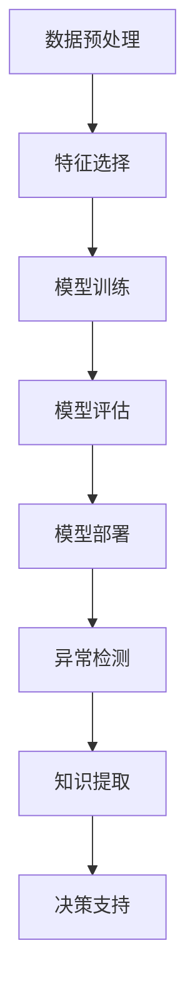

                 

## 1. 背景介绍

### 1.1 问题由来

在大数据时代，企业每天产生的数据量呈爆炸式增长，这些数据蕴含着丰富的商业洞察和决策价值。然而，数据的复杂性和多样性使得传统的业务决策方式难以应对。企业决策者希望通过高效、准确的知识发现引擎，快速从海量数据中提取有用信息，支撑决策。

知识发现引擎(Knowledge Discovery Engine, KDE)，也称为数据挖掘(Data Mining)，是一种利用数据挖掘算法，从海量数据中提取有用信息和知识的技术。知识发现引擎在零售、金融、制造、医疗等多个领域有着广泛的应用。

### 1.2 问题核心关键点

知识发现引擎的核心在于如何从数据中提取有用信息。主要包括以下关键点：

- **数据预处理**：清洗、去重、归一化等处理，以提高数据质量。
- **特征工程**：选择合适的特征，并进行降维、组合等，以提升模型效果。
- **模型选择**：选择合适的算法模型，如分类、聚类、回归等，进行预测或分类。
- **模型训练**：在训练集上训练模型，优化模型参数。
- **模型评估**：在测试集上评估模型性能，选择合适的模型。
- **模型部署**：将模型部署到实际业务中，进行实时预测和决策。

### 1.3 问题研究意义

知识发现引擎的研究意义在于：

1. **提高决策效率**：自动化数据处理和模型训练，降低人工成本，提高决策速度。
2. **提升决策质量**：通过算法优化和数据挖掘，发现数据中的隐藏规律，提供高质量的决策支持。
3. **增强业务洞察**：从海量数据中提取有价值的商业洞察，为企业提供战略决策支持。
4. **促进智能升级**：利用知识发现引擎，推动企业从传统业务向智能业务转型，提升竞争优势。

## 2. 核心概念与联系

### 2.1 核心概念概述

为更好地理解知识发现引擎的原理和应用，本节将介绍几个密切相关的核心概念：

- **数据挖掘**：利用统计学、机器学习等技术，从数据中自动发现知识、规律和信息。
- **特征选择**：从原始数据中选择最具有代表性和相关性的特征，以提高模型效果。
- **模型训练**：通过训练集上的模型参数优化，使模型能够准确预测或分类。
- **模型评估**：在测试集上评估模型性能，确保模型泛化能力。
- **模型部署**：将训练好的模型应用到实际业务中，进行实时预测和决策。
- **异常检测**：识别数据中的异常值，发现潜在问题或异常行为。

这些核心概念之间的逻辑关系可以通过以下Mermaid流程图来展示：



这个流程图展示了一系列数据挖掘的基本流程：

1. 从原始数据开始，先进行清洗和预处理。
2. 选择最相关的特征进行建模。
3. 在训练集上训练模型，优化参数。
4. 在测试集上评估模型性能。
5. 将模型部署到实际业务中。
6. 利用模型进行异常检测，发现潜在问题。
7. 从模型中提取知识，支持决策。

## 3. 核心算法原理 & 具体操作步骤

### 3.1 算法原理概述

知识发现引擎的算法原理可以分为以下几个步骤：

1. **数据预处理**：清洗、归一化、降维等处理，提高数据质量。
2. **特征选择**：从原始数据中选择最具有代表性和相关性的特征。
3. **模型训练**：选择适当的模型，如决策树、支持向量机、神经网络等，在训练集上优化模型参数。
4. **模型评估**：在测试集上评估模型性能，选择合适的模型。
5. **模型部署**：将训练好的模型应用到实际业务中，进行实时预测和决策。

### 3.2 算法步骤详解

**Step 1: 数据预处理**

1. **数据清洗**：去除噪声、缺失值、重复值等，确保数据的质量。
2. **数据归一化**：将不同量纲的数据归一化到同一量纲，便于模型处理。
3. **数据降维**：使用PCA、LDA、t-SNE等算法，减少特征维度，提高模型效率。

**Step 2: 特征选择**

1. **特征提取**：利用技术如PCA、LDA等，提取原始数据中最具代表性和相关性的特征。
2. **特征组合**：将提取出的特征进行组合，形成新的特征。
3. **特征选择**：使用过滤法、包装法等，从原始特征中选择最相关的特征。

**Step 3: 模型训练**

1. **选择模型**：根据任务类型选择适当的模型，如分类、聚类、回归等。
2. **模型训练**：在训练集上训练模型，优化模型参数。
3. **模型保存**：将训练好的模型保存到文件或数据库中，方便后续使用。

**Step 4: 模型评估**

1. **划分数据集**：将数据集划分为训练集、验证集和测试集。
2. **模型评估**：在测试集上评估模型性能，如准确率、召回率、F1分数等。
3. **模型选择**：选择性能最优的模型，进行后续应用。

**Step 5: 模型部署**

1. **模型部署**：将训练好的模型部署到实际业务中，进行实时预测和决策。
2. **模型监控**：实时监控模型的预测结果，确保模型性能稳定。
3. **模型更新**：定期更新模型参数，确保模型与业务需求一致。

### 3.3 算法优缺点

知识发现引擎的优势包括：

- **自动化**：自动进行数据预处理、特征选择和模型训练，降低人工成本。
- **高效性**：利用算法优化，提高模型训练和预测的效率。
- **灵活性**：适用于各种类型的业务决策问题。
- **可解释性**：提供详细的模型解释，帮助理解决策过程。

缺点包括：

- **数据依赖**：模型的效果高度依赖于数据的质量和数量。
- **模型复杂性**：复杂的模型可能需要更长的训练时间。
- **过拟合风险**：模型可能过度拟合训练集，导致泛化能力不足。

### 3.4 算法应用领域

知识发现引擎在多个领域有着广泛的应用，例如：

- **零售业**：通过数据挖掘，发现消费者购买行为和偏好，制定个性化营销策略。
- **金融业**：利用异常检测和关联规则分析，发现潜在的金融风险和欺诈行为。
- **制造业**：通过数据挖掘，优化生产流程，提高生产效率和产品质量。
- **医疗行业**：利用数据挖掘，分析患者病历，提供精准的诊疗方案。
- **物流行业**：通过数据挖掘，优化物流路线，降低运输成本，提高配送效率。

## 4. 数学模型和公式 & 详细讲解  
### 4.1 数学模型构建

知识发现引擎的数学模型构建主要包括以下几个部分：

- **数据预处理**：使用数学方法对原始数据进行处理。
- **特征选择**：选择合适的特征，并进行降维处理。
- **模型训练**：选择合适的算法，优化模型参数。
- **模型评估**：使用数学方法评估模型性能。

### 4.2 公式推导过程

以下以分类任务为例，推导常用的逻辑回归模型的公式：

设样本 $(x_i, y_i)$，其中 $x_i \in \mathbb{R}^n$ 为特征向量，$y_i \in \{0, 1\}$ 为标签。逻辑回归模型假设样本属于正类的概率为 $p(y=1|x)$，则有：

$$
p(y=1|x) = \sigma(\theta^T x)
$$

其中 $\theta \in \mathbb{R}^n$ 为模型参数，$\sigma(z) = \frac{1}{1+e^{-z}}$ 为Sigmoid函数。

根据逻辑回归模型的假设，可以使用交叉熵损失函数进行训练：

$$
L(\theta) = -\frac{1}{N}\sum_{i=1}^N [y_i \log \sigma(\theta^T x_i) + (1-y_i) \log (1-\sigma(\theta^T x_i))]
$$

通过梯度下降等优化算法，最小化损失函数，更新模型参数：

$$
\theta \leftarrow \theta - \eta \nabla_{\theta}L(\theta)
$$

其中 $\eta$ 为学习率，$\nabla_{\theta}L(\theta)$ 为损失函数对模型参数的梯度。

### 4.3 案例分析与讲解

以零售业的客户流失预测为例，展示知识发现引擎的实际应用。

假设某零售企业有客户流失数据 $(x_i, y_i)$，其中 $x_i$ 为历史购买记录、促销活动、投诉记录等特征，$y_i$ 为流失与否（0或1）。

**Step 1: 数据预处理**

对原始数据进行清洗和归一化处理：

```python
import pandas as pd
from sklearn.preprocessing import StandardScaler

# 读取数据
data = pd.read_csv('customer_churn.csv')

# 数据清洗
data = data.dropna()

# 数据归一化
scaler = StandardScaler()
data['features'] = scaler.fit_transform(data[['feature1', 'feature2', 'feature3']])
```

**Step 2: 特征选择**

使用相关性分析，选择最相关的特征：

```python
from sklearn.feature_selection import SelectKBest, f_regression

# 特征选择
selector = SelectKBest(score_func=f_regression, k=5)
selected_features = selector.fit_transform(data[['features']], data['target'])
```

**Step 3: 模型训练**

使用逻辑回归模型进行训练：

```python
from sklearn.linear_model import LogisticRegression

# 模型训练
model = LogisticRegression()
model.fit(selected_features, data['target'])
```

**Step 4: 模型评估**

使用交叉验证方法评估模型性能：

```python
from sklearn.model_selection import cross_val_score

# 模型评估
scores = cross_val_score(model, selected_features, data['target'], cv=5)
mean_score = scores.mean()
```

**Step 5: 模型部署**

将训练好的模型应用到实时数据中进行预测：

```python
# 模型部署
new_data = pd.read_csv('new_customer_churn.csv')
new_data['features'] = scaler.transform(new_data[['feature1', 'feature2', 'feature3']])
predictions = model.predict(new_data['features'])
```

通过上述步骤，知识发现引擎能够帮助零售企业实时预测客户流失风险，优化客户管理策略，降低客户流失率，提升业务价值。

## 5. 项目实践：代码实例和详细解释说明
### 5.1 开发环境搭建

在进行知识发现引擎的实践前，需要准备好开发环境。以下是使用Python进行项目开发的环境配置流程：

1. 安装Anaconda：从官网下载并安装Anaconda，用于创建独立的Python环境。

2. 创建并激活虚拟环境：
```bash
conda create -n kde-env python=3.8 
conda activate kde-env
```

3. 安装PyTorch：根据CUDA版本，从官网获取对应的安装命令。例如：
```bash
conda install pytorch torchvision torchaudio cudatoolkit=11.1 -c pytorch -c conda-forge
```

4. 安装相关库：
```bash
pip install pandas numpy matplotlib scikit-learn xgboost lightgbm catboost
```

5. 安装Jupyter Notebook：
```bash
pip install jupyter notebook
```

完成上述步骤后，即可在`kde-env`环境中开始项目实践。

### 5.2 源代码详细实现

下面我们以零售业的客户流失预测任务为例，给出使用Python进行知识发现引擎的完整代码实现。

首先，定义数据处理函数：

```python
import pandas as pd
from sklearn.preprocessing import StandardScaler

def load_data(filename):
    data = pd.read_csv(filename)
    data = data.dropna()
    features = ['feature1', 'feature2', 'feature3']
    target = 'target'
    features = scaler.fit_transform(data[features])
    return features, target, data
```

然后，定义模型训练和评估函数：

```python
from sklearn.linear_model import LogisticRegression
from sklearn.model_selection import train_test_split, cross_val_score

def train_model(X, y, kfold=5):
    features, target, data = X
    features_train, features_test, target_train, target_test = train_test_split(features, target, test_size=0.2, random_state=42)
    model = LogisticRegression()
    model.fit(features_train, target_train)
    scores = cross_val_score(model, features_test, target_test, cv=kfold)
    return model, scores.mean()
```

接着，启动数据预处理和模型训练流程：

```python
features, target, data = load_data('customer_churn.csv')
model, score = train_model(features, target)

# 打印模型和评估得分
print('Model:', model)
print('Accuracy:', score)
```

最后，展示模型部署和预测结果：

```python
# 加载新的测试数据
new_data = pd.read_csv('new_customer_churn.csv')
new_features = scaler.transform(new_data[['feature1', 'feature2', 'feature3']])
predictions = model.predict(new_features)

# 打印预测结果
print('Predictions:', predictions)
```

以上就是使用Python进行知识发现引擎的完整代码实现。可以看到，通过简单的数据预处理、特征选择、模型训练和评估，便能够快速构建一个初步的知识发现引擎系统。

### 5.3 代码解读与分析

让我们再详细解读一下关键代码的实现细节：

**load_data函数**：
- 读取数据集。
- 清洗数据，去除缺失值。
- 归一化特征。

**train_model函数**：
- 划分训练集和测试集。
- 训练逻辑回归模型。
- 使用交叉验证评估模型性能。

**数据预处理和模型训练流程**：
- 加载数据集。
- 进行数据预处理。
- 训练模型并评估。

**模型部署和预测结果**：
- 加载新的测试数据。
- 使用模型进行预测。

可以看到，知识发现引擎的代码实现相对简洁，但包含了很多关键步骤。项目实践中需要针对具体问题进行优化和调整，以获得更优的性能和效果。

## 6. 实际应用场景

### 6.1 零售业

零售业是知识发现引擎应用最为广泛的领域之一。通过分析顾客购买记录、促销活动、投诉记录等数据，零售企业可以预测顾客流失风险，制定个性化营销策略，提升顾客满意度，增加销售额。

例如，某电商平台利用知识发现引擎，分析用户的历史购买记录和行为数据，发现用户流失的预警信号，并及时进行客户关怀和优惠活动，显著提升了用户留存率。

### 6.2 金融业

金融业利用知识发现引擎，进行风险控制和欺诈检测。通过分析客户的交易记录、信用记录、行为数据等，金融机构可以预测客户的违约风险和欺诈行为，及时采取措施，降低金融风险。

例如，某银行利用知识发现引擎，分析客户的交易数据，识别异常交易行为，并及时进行风险预警，成功阻止了多起潜在欺诈行为，显著提升了金融安全水平。

### 6.3 医疗行业

医疗行业利用知识发现引擎，进行疾病预测和诊疗决策。通过分析患者的病历数据、治疗记录、生理指标等，医疗机构可以预测患者的疾病风险，制定个性化诊疗方案，提高诊疗效果。

例如，某医院利用知识发现引擎，分析患者的病历数据，预测患者可能出现的并发症，并及时进行干预，显著提高了患者的治愈率和满意度。

## 7. 工具和资源推荐

### 7.1 学习资源推荐

为了帮助开发者系统掌握知识发现引擎的理论基础和实践技巧，这里推荐一些优质的学习资源：

1. 《机器学习实战》系列书籍：适合入门，详细介绍了机器学习的基本概念和算法。
2. 《Python数据科学手册》：涵盖数据处理、数据可视化、机器学习等Python数据科学工具和技巧。
3. Coursera《数据科学专业》课程：由世界顶尖大学开设，涵盖数据挖掘、机器学习、统计学等核心课程。
4. Kaggle竞赛平台：参与数据挖掘竞赛，提升实战能力和数据分析技能。
5. Hugging Face官方文档：提供了丰富的知识发现引擎模型和算法，适合实战开发。

通过对这些资源的学习实践，相信你一定能够快速掌握知识发现引擎的精髓，并用于解决实际的商业问题。

### 7.2 开发工具推荐

高效的开发离不开优秀的工具支持。以下是几款用于知识发现引擎开发的常用工具：

1. Jupyter Notebook：交互式开发环境，支持Python、R等语言，适合数据处理和模型训练。
2. PyCharm：强大的IDE，支持数据科学和机器学习工具，方便代码开发和调试。
3. Scikit-learn：Python机器学习库，提供丰富的算法和工具，适合快速原型开发。
4. TensorFlow：谷歌开源的深度学习框架，支持分布式计算和GPU加速，适合大规模数据处理。
5. Apache Spark：分布式计算框架，适合大规模数据处理和机器学习应用。

合理利用这些工具，可以显著提升知识发现引擎的开发效率，加快创新迭代的步伐。

### 7.3 相关论文推荐

知识发现引擎的研究源于学界的持续研究。以下是几篇奠基性的相关论文，推荐阅读：

1. "Data Mining: Concepts and Techniques"（《数据挖掘：概念和技术》）：由Jerry Kearl等专家合著的经典教材，详细介绍了数据挖掘的基本概念和算法。
2. "Hands-On Machine Learning with Scikit-Learn, Keras, and TensorFlow"（《动手学深度学习》）：由谷歌大脑科学家合著的入门书籍，涵盖深度学习和机器学习的基本概念和实践技巧。
3. "The Elements of Statistical Learning"（《统计学习方法》）：由Tibshirani等专家合著的经典教材，详细介绍了统计学习的基本方法和算法。
4. "An Introduction to Statistical Learning"（《机器学习实战》）：由Gareth James等专家合著的入门书籍，涵盖机器学习的基本概念和算法实现。
5. "Pattern Recognition and Machine Learning"（《模式识别与机器学习》）：由Christopher Bishop合著的经典教材，详细介绍了模式识别和机器学习的基本方法。

这些论文代表了大规模数据挖掘和机器学习的发展脉络。通过学习这些前沿成果，可以帮助研究者把握学科前进方向，激发更多的创新灵感。

## 8. 总结：未来发展趋势与挑战

### 8.1 总结

本文对知识发现引擎的理论基础和实践应用进行了全面系统的介绍。首先阐述了知识发现引擎的研究背景和意义，明确了数据挖掘在企业决策中的重要价值。其次，从原理到实践，详细讲解了知识发现引擎的数学原理和操作步骤，给出了知识发现引擎项目开发的完整代码实例。同时，本文还广泛探讨了知识发现引擎在零售、金融、医疗等多个行业领域的应用前景，展示了其广阔的商业价值。

通过本文的系统梳理，可以看到，知识发现引擎在商业决策中的应用已经日益广泛，对企业的数字化转型和智能化升级起到了重要的推动作用。未来，伴随技术的不懈探索和实践的不断优化，知识发现引擎必将在更多的行业领域发挥更加重要的作用。

### 8.2 未来发展趋势

展望未来，知识发现引擎的发展趋势包括：

1. **自动化程度提升**：利用自动化工具和算法，进一步简化数据处理和模型训练过程。
2. **模型性能优化**：采用更先进的算法和模型，提升预测和分类的准确性。
3. **多模态融合**：结合文本、图像、音频等多种数据源，提高知识发现引擎的全面性和多样性。
4. **实时处理能力增强**：提高数据处理和模型训练的实时性，支持实时决策。
5. **数据隐私保护**：加强数据隐私保护，确保数据安全和合规。
6. **知识图谱融合**：将知识图谱与知识发现引擎结合，提高知识提取的全面性和精准性。

这些趋势凸显了知识发现引擎的广泛应用前景，未来必将为企业决策提供更加强大和智能的支持。

### 8.3 面临的挑战

尽管知识发现引擎已经取得了瞩目成就，但在迈向更加智能化、普适化应用的过程中，它仍面临诸多挑战：

1. **数据质量问题**：数据清洗、去重、归一化等预处理过程耗时耗力，数据质量难以保证。
2. **模型复杂性**：复杂的模型需要更多的计算资源和时间，难以实现实时处理。
3. **算法透明性**：知识发现引擎的内部决策过程难以解释，导致业务人员难以理解和接受。
4. **数据隐私保护**：数据采集和处理过程中涉及隐私问题，如何保护用户隐私成为重要挑战。
5. **跨领域应用难度**：不同行业的数据特征和业务需求差异较大，知识发现引擎的泛化能力有限。

### 8.4 研究展望

面向未来，知识发现引擎的研究需要在以下几个方面寻求新的突破：

1. **自动化技术**：利用自动化工具和算法，简化数据处理和模型训练过程。
2. **模型优化**：采用更先进的算法和模型，提升预测和分类的准确性。
3. **实时处理**：提高数据处理和模型训练的实时性，支持实时决策。
4. **隐私保护**：加强数据隐私保护，确保数据安全和合规。
5. **跨领域应用**：研发适用于不同行业领域的知识发现引擎，提高模型泛化能力。
6. **智能决策**：结合人工智能技术，提升知识发现引擎的智能决策能力。

这些研究方向的探索，必将引领知识发现引擎技术迈向更高的台阶，为企业的决策提供更加强大和智能的支持。

## 9. 附录：常见问题与解答

**Q1：知识发现引擎是否适用于所有业务决策问题？**

A: 知识发现引擎适用于大多数业务决策问题，特别是那些有明确目标和相关数据的场景。但对于一些需要人类判断和直觉的场景，如创意决策、伦理判断等，知识发现引擎可能无法提供完全准确的支持。

**Q2：如何选择合适的特征？**

A: 选择合适的特征是知识发现引擎的核心。通常需要结合业务问题和数据特征，进行特征提取和选择。常用的特征选择方法包括过滤法、包装法等。同时，利用可视化工具进行特征重要性的分析，有助于选择合适的特征。

**Q3：模型训练过程中如何选择学习率？**

A: 学习率的选择通常需要通过实验确定。一般建议从较小的值开始，如0.01，逐步增加，直到出现模型过拟合或性能下降。常用的学习率调优方法包括网格搜索、学习率衰减等。

**Q4：如何避免模型过拟合？**

A: 避免模型过拟合可以通过以下方法：
1. 增加数据量，提升数据质量。
2. 使用正则化技术，如L1、L2正则。
3. 进行交叉验证，评估模型泛化能力。
4. 调整模型复杂度，避免过度拟合。

**Q5：模型部署过程中需要注意哪些问题？**

A: 模型部署过程中需要注意以下问题：
1. 模型裁剪，去除不必要的层和参数，减小模型尺寸。
2. 模型压缩，采用混合精度训练等方法，减少内存消耗。
3. 模型集成，将多个模型进行集成，提高预测准确性。
4. 模型监控，实时监控模型预测结果，确保模型性能稳定。

**Q6：知识发现引擎在跨领域应用中存在哪些挑战？**

A: 知识发现引擎在跨领域应用中面临的主要挑战包括：
1. 数据特征差异较大，难以直接应用。
2. 业务需求不同，模型泛化能力有限。
3. 领域知识和规则需要整合，提高模型全面性。

通过本文的系统梳理，可以看到，知识发现引擎在商业决策中的应用已经日益广泛，对企业的数字化转型和智能化升级起到了重要的推动作用。未来，伴随技术的不懈探索和实践的不断优化，知识发现引擎必将在更多的行业领域发挥更加重要的作用。

