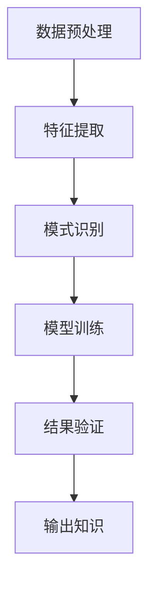

                 

# 知识发现引擎：发掘知识中的规律与联系

## 1. 背景介绍

在现代社会，知识无处不在，如何高效、准确地从海量数据中发现和提取有价值的信息，已成为信息化社会的一大挑战。随着大数据、人工智能技术的飞速发展，知识发现引擎（Knowledge Discovery Engine, KDE）逐渐成为解决这一问题的有效工具。

### 1.1 问题由来
知识发现是一种从数据中挖掘有价值信息的复杂过程，涉及到数据预处理、特征提取、模式识别、模型构建、结果验证等多个环节。传统的知识发现方法依赖人工参与，效率低、成本高，难以应对日益增长的数据量。

为了应对这一挑战，研究者们提出了知识发现引擎的概念。KDE通过自动化的方法，从大规模数据集中高效挖掘和提取知识，生成可解释、可应用的模型和规则，为决策、预测、推荐等提供数据支持。

### 1.2 问题核心关键点
知识发现引擎的核心目标是从数据中发现知识，挖掘潜在的规律和联系。这通常通过数据预处理、特征工程、模型训练、结果验证等步骤实现。

具体而言，KDE的关键点包括：
- 数据预处理：清洗、归一化、降维等步骤，将原始数据转化为适合模型训练的形式。
- 特征提取：从原始数据中提取出最有信息的特征，用于训练模型。
- 模式识别：通过统计、分类、聚类、关联规则等方法，发现数据中的模式和规律。
- 模型训练：利用机器学习算法，对提取出的特征进行建模，生成知识表示。
- 结果验证：评估模型准确性和泛化能力，确保知识发现结果的可靠性和有效性。

### 1.3 问题研究意义
构建知识发现引擎，对于提升数据驱动决策的科学性和准确性，推动数据科学在各行各业的广泛应用，具有重要意义。

- 提升决策质量：基于数据的知识发现可以提供客观、量化的决策依据，减少主观偏差，提升决策的科学性和准确性。
- 降低成本时间：自动化处理和分析大量数据，极大地降低了人力成本和时间成本，提高了工作效率。
- 促进跨学科应用：知识发现引擎可以应用于多个领域，如金融、医疗、社交网络、电子商务等，推动各学科的交叉融合和创新。
- 发现新规律：通过数据驱动的方法，可以揭示数据中未知的模式和规律，推动科学发现和创新。

## 2. 核心概念与联系

### 2.1 核心概念概述

知识发现引擎的核心概念包括以下几个方面：

- **数据预处理**：清洗、归一化、降维等步骤，将原始数据转化为适合模型训练的形式。
- **特征提取**：从原始数据中提取出最有信息的特征，用于训练模型。
- **模式识别**：通过统计、分类、聚类、关联规则等方法，发现数据中的模式和规律。
- **模型训练**：利用机器学习算法，对提取出的特征进行建模，生成知识表示。
- **结果验证**：评估模型准确性和泛化能力，确保知识发现结果的可靠性和有效性。

### 2.2 核心概念原理和架构的 Mermaid 流程图



这个流程图展示了知识发现引擎的核心流程和架构：

1. 数据预处理：清洗和准备数据，将其转化为适合模型训练的形式。
2. 特征提取：从数据中提取出最有信息的特征，用于模型训练。
3. 模式识别：通过各种统计和分析方法，发现数据中的模式和规律。
4. 模型训练：利用机器学习算法，构建知识表示模型。
5. 结果验证：评估模型性能，确保知识发现的准确性和泛化能力。
6. 输出知识：生成可解释、可应用的规则和模型，为决策提供依据。

## 3. 核心算法原理 & 具体操作步骤

### 3.1 算法原理概述

知识发现引擎的核心算法原理基于数据挖掘和机器学习技术，通过自动化的方法从数据中挖掘出有价值的信息。

具体而言，KDE包括以下几个主要步骤：

1. **数据预处理**：清洗和准备数据，包括缺失值处理、异常值检测、特征归一化等。
2. **特征提取**：从数据中提取出最有信息的特征，如文本中的TF-IDF特征、图像中的颜色直方图特征等。
3. **模式识别**：通过统计、分类、聚类、关联规则等方法，发现数据中的模式和规律。
4. **模型训练**：利用机器学习算法，对提取出的特征进行建模，生成知识表示。
5. **结果验证**：评估模型准确性和泛化能力，确保知识发现结果的可靠性和有效性。

### 3.2 算法步骤详解

知识发现引擎的具体操作步骤如下：

**Step 1: 数据收集和预处理**

1. 收集待处理的数据，包括结构化数据和非结构化数据。
2. 清洗数据，删除重复、缺失、异常值。
3. 数据归一化，将不同范围的数据转化为适合模型训练的形式。
4. 特征提取，从原始数据中提取出最有信息的特征，如文本中的TF-IDF特征、图像中的颜色直方图特征等。

**Step 2: 模式识别和特征选择**

1. 统计分析，计算数据的基本统计量，如均值、方差、相关性等。
2. 分类分析，使用决策树、随机森林等分类算法，识别数据中的分类模式。
3. 聚类分析，使用K-means、层次聚类等聚类算法，发现数据中的簇结构。
4. 关联规则，使用Apriori、FP-Growth等算法，发现数据中的关联规则。

**Step 3: 模型训练和知识表示**

1. 选择合适的机器学习算法，如回归、分类、聚类、神经网络等。
2. 训练模型，使用训练数据集拟合模型参数。
3. 生成知识表示，将模型输出的结果转化为可解释、可应用的规则和模型。

**Step 4: 结果验证和应用**

1. 评估模型性能，使用测试数据集验证模型的泛化能力。
2. 应用知识，将发现的知识用于决策、预测、推荐等实际应用中。

### 3.3 算法优缺点

知识发现引擎的优点包括：

1. 自动化处理：通过自动化的方法，大大提高了数据处理的效率和准确性。
2. 发现新模式：通过数据驱动的方法，可以发现数据中未知的模式和规律。
3. 结果可解释：生成的知识表示通常具有可解释性，易于理解和应用。
4. 适应性强：可以处理多种类型的数据，如结构化、非结构化、多模态数据。

同时，知识发现引擎也存在一些缺点：

1. 数据质量要求高：数据预处理环节对数据质量要求较高，容易受噪声和缺失值影响。
2. 算法复杂度高：模式识别和特征选择的算法复杂度较高，需要较长的计算时间和较高的计算资源。
3. 结果解释性有限：尽管生成的知识表示具有可解释性，但仍难以完全解释复杂的决策过程。
4. 过度拟合风险：算法过度拟合训练数据，可能影响模型的泛化能力。

### 3.4 算法应用领域

知识发现引擎已经广泛应用于多个领域，例如：

- **金融领域**：用于股票预测、信用风险评估、市场分析等。
- **医疗领域**：用于疾病诊断、药物发现、患者分群等。
- **电商领域**：用于推荐系统、欺诈检测、客户分析等。
- **社交网络**：用于社交关系分析、用户行为预测、社区发现等。
- **自然语言处理**：用于文本分类、情感分析、信息抽取等。

这些应用领域展示了知识发现引擎的广泛适用性和高效性。

## 4. 数学模型和公式 & 详细讲解 & 举例说明

### 4.1 数学模型构建

知识发现引擎的数学模型构建涉及多个步骤，包括数据预处理、特征提取、模式识别、模型训练等。这里以回归模型为例，展示数学模型的构建过程。

**数据预处理**：

- 缺失值处理：使用均值、中位数、插值等方法填补缺失值。
- 异常值检测：使用箱线图、Z-score等方法检测并处理异常值。
- 特征归一化：使用标准化、归一化等方法将数据转化为标准形式。

**特征提取**：

- TF-IDF特征：计算文本中单词的TF-IDF值，用于文本分类和情感分析。
- 颜色直方图特征：计算图像中每个像素的颜色值，用于图像分类和目标检测。

**模式识别**：

- 回归模型：使用线性回归、多项式回归、决策树回归等算法，对数据进行建模。

**模型训练**：

- 损失函数：选择均方误差、交叉熵等损失函数，衡量模型预测值与真实值之间的差异。
- 优化算法：使用梯度下降、随机梯度下降等优化算法，最小化损失函数。

**结果验证**：

- 测试集验证：使用测试集评估模型的泛化能力，计算准确率、召回率、F1值等指标。

### 4.2 公式推导过程

以线性回归模型为例，推导其最小二乘法求解过程：

设训练集为 $(x_i, y_i)$，$i=1,2,\ldots,N$。线性回归模型为：

$$
y = \theta_0 + \theta_1 x + \epsilon
$$

其中，$\theta_0, \theta_1$ 为模型参数，$\epsilon$ 为误差项。

最小二乘法目标函数为：

$$
\mathcal{L}(\theta) = \frac{1}{2N}\sum_{i=1}^N (y_i - \hat{y}_i)^2
$$

其中，$\hat{y}_i = \theta_0 + \theta_1 x_i$。

对 $\theta$ 求偏导，得：

$$
\frac{\partial \mathcal{L}(\theta)}{\partial \theta} = -\frac{1}{N}\sum_{i=1}^N (y_i - \hat{y}_i) x_i
$$

令偏导数为零，解得：

$$
\hat{\theta} = \left(\frac{1}{N} \sum_{i=1}^N x_i x_i\right)^{-1} \left(\frac{1}{N} \sum_{i=1}^N x_i y_i\right)
$$

$$
\hat{\theta}_0 = \bar{y} - \hat{\theta}_1 \bar{x}
$$

其中，$\bar{x} = \frac{1}{N} \sum_{i=1}^N x_i$，$\bar{y} = \frac{1}{N} \sum_{i=1}^N y_i$。

### 4.3 案例分析与讲解

假设有一个房屋价格预测任务，收集了历史房屋价格和相关特征，如房屋面积、房龄、位置等。数据预处理和特征提取如下：

**数据预处理**：

- 缺失值处理：删除缺失值。
- 异常值检测：使用箱线图检测并处理异常值。
- 特征归一化：将房屋面积、房龄、位置等特征标准化。

**特征提取**：

- 房屋面积、房龄、位置等作为特征 $x$。

**模式识别**：

- 回归模型：使用线性回归算法对数据进行建模。

**模型训练**：

- 损失函数：选择均方误差损失函数。
- 优化算法：使用梯度下降算法最小化损失函数。

**结果验证**：

- 使用测试集评估模型的泛化能力，计算准确率、召回率、F1值等指标。

最终，可以生成一个可解释的线性回归模型，用于预测新房屋的价格。

## 5. 项目实践：代码实例和详细解释说明

### 5.1 开发环境搭建

在进行知识发现引擎的开发前，我们需要准备好开发环境。以下是使用Python进行KDE开发的常见环境配置流程：

1. 安装Anaconda：从官网下载并安装Anaconda，用于创建独立的Python环境。

2. 创建并激活虚拟环境：
```bash
conda create -n kde-env python=3.8 
conda activate kde-env
```

3. 安装必要的Python包：
```bash
pip install numpy pandas scikit-learn matplotlib seaborn scikit-learn
```

完成上述步骤后，即可在`kde-env`环境中开始KDE开发。

### 5.2 源代码详细实现

这里我们以线性回归为例，展示如何使用Python和Scikit-learn进行知识发现引擎的开发。

```python
import numpy as np
from sklearn.linear_model import LinearRegression
from sklearn.metrics import mean_squared_error
from sklearn.model_selection import train_test_split

# 加载数据
X = np.loadtxt('data/x.txt', delimiter=',')
y = np.loadtxt('data/y.txt', delimiter=',')

# 划分训练集和测试集
X_train, X_test, y_train, y_test = train_test_split(X, y, test_size=0.2, random_state=42)

# 数据预处理
X_train = (X_train - np.mean(X_train, axis=0)) / np.std(X_train, axis=0)
X_test = (X_test - np.mean(X_test, axis=0)) / np.std(X_test, axis=0)

# 特征提取
X_train = X_train[:, :5]  # 取前5个特征
X_test = X_test[:, :5]    # 取前5个特征

# 模式识别
reg = LinearRegression()
reg.fit(X_train, y_train)

# 模型训练
y_pred = reg.predict(X_test)

# 结果验证
mse = mean_squared_error(y_test, y_pred)
print(f"Mean Squared Error: {mse:.2f}")
```

### 5.3 代码解读与分析

以上代码展示了知识发现引擎中线性回归模型的开发过程：

- 数据预处理：通过标准化处理，将数据转化为标准形式。
- 特征提取：只取前5个特征用于训练和测试。
- 模式识别：使用线性回归模型拟合数据。
- 模型训练：通过训练数据拟合模型参数。
- 结果验证：计算测试集的均方误差。

## 6. 实际应用场景

### 6.1 智能推荐系统

知识发现引擎在智能推荐系统中得到了广泛应用。通过分析用户历史行为数据和物品属性，发现用户的兴趣偏好，生成个性化推荐列表，提升用户满意度。

在实践中，可以使用知识发现引擎对用户和物品特征进行建模，使用关联规则发现用户和物品之间的关联关系，最终生成推荐结果。推荐系统可以应用于电商、音乐、视频等多个领域，提升用户体验。

### 6.2 金融风险控制

金融领域需要实时监测市场风险，及时预警潜在风险。知识发现引擎可以通过分析市场数据，发现价格波动、交易异常等风险信号，实现风险预测和控制。

具体而言，可以收集金融市场数据，包括股票价格、交易量、新闻报道等，使用知识发现引擎发现市场中的异常波动，生成风险预警信号。金融机构可以根据预警信号及时采取应对措施，降低风险损失。

### 6.3 医疗诊断系统

医疗领域需要快速、准确地诊断疾病，知识发现引擎可以通过分析医疗数据，发现疾病的早期征兆和潜在风险，生成诊断建议。

具体而言，可以收集病人的病历数据、症状数据、实验室检测结果等，使用知识发现引擎发现疾病的潜在征兆，生成诊断建议。医疗诊断系统可以应用于各种疾病诊断，提升医疗服务的质量和效率。

### 6.4 未来应用展望

随着知识发现引擎技术的不断发展，未来将在更多领域得到应用，为各行各业带来变革性影响。

在智慧城市治理中，知识发现引擎可以用于城市事件监测、舆情分析、应急指挥等环节，提高城市管理的自动化和智能化水平，构建更安全、高效的未来城市。

在智慧医疗领域，知识发现引擎可以用于疾病诊断、药物发现、患者分群等，提升医疗服务的智能化水平，加速新药开发进程。

在智慧教育领域，知识发现引擎可以用于学生行为分析、学情预测、智能辅导等，因材施教，促进教育公平，提高教学质量。

此外，在企业生产、社交网络、电子商务等众多领域，知识发现引擎也将不断涌现，为传统行业数字化转型升级提供新的技术路径。

## 7. 工具和资源推荐

### 7.1 学习资源推荐

为了帮助开发者系统掌握知识发现引擎的理论基础和实践技巧，这里推荐一些优质的学习资源：

1. 《机器学习实战》系列书籍：详细介绍了机器学习算法和实践应用，涵盖数据预处理、特征工程、模型训练、结果验证等多个环节。

2. 《数据科学实战》课程：由知名教育平台开设，涵盖数据挖掘、机器学习、数据可视化等多个领域，适合初学者入门。

3. 《Python数据分析实战》书籍：通过实例讲解Python数据分析技术，展示知识发现引擎的开发流程。

4. Kaggle竞赛平台：提供大量开源数据集和算法竞赛，帮助开发者实践知识发现引擎的开发应用。

5. UCI机器学习库：提供大量公开数据集，方便开发者进行模型训练和验证。

通过对这些资源的学习实践，相信你一定能够快速掌握知识发现引擎的精髓，并用于解决实际的NLP问题。

### 7.2 开发工具推荐

高效的开发离不开优秀的工具支持。以下是几款用于知识发现引擎开发的常用工具：

1. Python：通用编程语言，易于学习和使用，广泛应用于数据科学和机器学习领域。

2. Scikit-learn：Python机器学习库，提供了丰富的算法和工具，方便开发知识发现引擎。

3. R语言：数据科学和统计分析领域的主流语言，提供了丰富的统计和机器学习工具。

4. Jupyter Notebook：交互式编程环境，支持Python、R等语言，方便进行数据探索和模型验证。

5. Hadoop和Spark：大数据处理平台，支持大规模数据处理和分布式计算，适合处理大规模数据集。

6. TensorFlow和PyTorch：深度学习框架，支持多种算法和模型，适合进行复杂模型的训练和推理。

合理利用这些工具，可以显著提升知识发现引擎的开发效率，加快创新迭代的步伐。

### 7.3 相关论文推荐

知识发现引擎的研究源于学界的持续研究。以下是几篇奠基性的相关论文，推荐阅读：

1. KDD Cup竞赛论文：展示了基于数据挖掘和机器学习技术，解决实际问题的成功案例。

2. Google Scholar论文：详细介绍了知识发现引擎的算法和应用，展示最新的研究成果。

3. Journal of Data Mining and Knowledge Discovery：发表了大量关于数据挖掘和知识发现的学术论文，涵盖多种算法和技术。

4. SIGKDD论文：是数据挖掘领域的重要会议，发表了大量前沿论文和技术成果。

这些论文代表了大数据、人工智能领域的研究进展，通过学习这些前沿成果，可以帮助研究者把握学科前进方向，激发更多的创新灵感。

## 8. 总结：未来发展趋势与挑战

### 8.1 总结

本文对知识发现引擎的理论基础和实践应用进行了全面系统的介绍。首先阐述了知识发现引擎的研究背景和意义，明确了其在大数据时代的重要性。其次，从原理到实践，详细讲解了知识发现引擎的数学模型和关键步骤，给出了知识发现引擎的完整代码实例。同时，本文还广泛探讨了知识发现引擎在智能推荐、金融风险控制、医疗诊断等多个领域的应用前景，展示了知识发现引擎的广阔前景。

通过本文的系统梳理，可以看到，知识发现引擎正在成为数据科学领域的重要工具，极大地拓展了数据驱动决策的科学性和准确性，推动了数据科学在各行各业的广泛应用。未来，伴随大数据、人工智能技术的持续发展，知识发现引擎必将在更多领域大放异彩，深刻影响人类的生产生活方式。

### 8.2 未来发展趋势

展望未来，知识发现引擎将呈现以下几个发展趋势：

1. 自动化程度提高：知识发现引擎将逐渐实现自动化，自动化处理数据预处理、特征工程、模型训练等环节，减少人工干预。

2. 模型多样化：知识发现引擎将不再局限于传统的统计模型和机器学习模型，引入更多新型模型，如深度学习、强化学习、因果推理等。

3. 实时性增强：知识发现引擎将实时处理数据，快速发现数据中的新模式和规律，提升决策效率。

4. 多模态融合：知识发现引擎将支持多模态数据处理，如文本、图像、语音等，实现不同类型数据的协同建模。

5. 可解释性加强：知识发现引擎将更加注重模型的可解释性，通过可视化工具展示模型内部机制，提升系统的透明性。

6. 跨领域应用广泛：知识发现引擎将广泛应用于更多领域，如医疗、金融、智慧城市、智慧教育等，推动各行各业的数字化转型。

以上趋势凸显了知识发现引擎的广阔前景。这些方向的探索发展，必将进一步提升知识发现引擎的性能和应用范围，为人类认知智能的进化带来深远影响。

### 8.3 面临的挑战

尽管知识发现引擎已经取得了瞩目成就，但在迈向更加智能化、普适化应用的过程中，它仍面临着诸多挑战：

1. 数据质量瓶颈：数据预处理环节对数据质量要求较高，容易受噪声和缺失值影响。如何提高数据质量，优化数据预处理流程，将是一大难题。

2. 算法复杂度高：模式识别和特征选择的算法复杂度较高，需要较长的计算时间和较高的计算资源。如何优化算法，提升计算效率，还需要更多理论和实践的积累。

3. 结果解释性有限：尽管生成的知识表示具有可解释性，但仍难以完全解释复杂的决策过程。如何赋予知识发现引擎更强的可解释性，将是亟待攻克的难题。

4. 过度拟合风险：算法过度拟合训练数据，可能影响模型的泛化能力。如何优化模型训练策略，提高模型泛化能力，还需要更多研究和实践。

5. 安全性有待保障：知识发现引擎可能学习到有害信息和偏见，产生误导性、歧视性的输出，给实际应用带来安全隐患。如何从数据和算法层面消除模型偏见，确保输出的安全性，也将是重要的研究课题。

6. 持续学习机制：知识发现引擎需要不断学习和适应新的数据分布，避免过时和失效。如何构建持续学习机制，实现模型的动态更新，还需要更多理论和实践的积累。

正视知识发现引擎面临的这些挑战，积极应对并寻求突破，将是知识发现引擎迈向成熟的必由之路。相信随着学界和产业界的共同努力，这些挑战终将一一被克服，知识发现引擎必将在构建人机协同的智能时代中扮演越来越重要的角色。

### 8.4 研究展望

面对知识发现引擎所面临的种种挑战，未来的研究需要在以下几个方面寻求新的突破：

1. 探索无监督和半监督知识发现方法：摆脱对大规模标注数据的依赖，利用自监督学习、主动学习等无监督和半监督范式，最大限度利用非结构化数据，实现更加灵活高效的微调。

2. 研究高效特征提取和数据预处理方法：开发更加高效的数据预处理和特征提取技术，如降维、特征选择、异常值检测等，提升知识发现引擎的性能和效率。

3. 融合因果分析和博弈论工具：将因果分析方法引入知识发现引擎，识别出知识发现过程中的关键特征，增强知识发现引擎的稳定性和鲁棒性。

4. 引入更多先验知识：将符号化的先验知识，如知识图谱、逻辑规则等，与知识发现引擎进行融合，增强模型的知识表示能力。

5. 构建多模态知识发现引擎：将文本、图像、语音等多模态数据进行协同建模，实现跨模态的知识发现和应用。

6. 纳入伦理道德约束：在知识发现引擎的训练目标中引入伦理导向的评估指标，过滤和惩罚有偏见、有害的输出倾向，确保输出的道德性和安全性。

这些研究方向的探索，必将引领知识发现引擎技术迈向更高的台阶，为构建安全、可靠、可解释、可控的智能系统铺平道路。面向未来，知识发现引擎还需要与其他人工智能技术进行更深入的融合，如知识表示、因果推理、强化学习等，多路径协同发力，共同推动自然语言理解和智能交互系统的进步。只有勇于创新、敢于突破，才能不断拓展知识发现引擎的边界，让智能技术更好地造福人类社会。

## 9. 附录：常见问题与解答

**Q1：知识发现引擎是否适用于所有数据类型？**

A: 知识发现引擎适用于多种数据类型，包括结构化数据和非结构化数据。对于结构化数据，可以直接进行数据处理和建模；对于非结构化数据，需要进行特征提取和编码，转化为适合模型训练的形式。

**Q2：知识发现引擎是否需要大规模数据？**

A: 知识发现引擎通常需要大规模数据进行训练和验证，数据量越大，模型的泛化能力越强。但数据量不足时，也可以采用数据增强、迁移学习等方法，提升知识发现引擎的性能。

**Q3：知识发现引擎如何应对数据不平衡问题？**

A: 数据不平衡问题在知识发现中较为常见，可以采用重采样、过采样、欠采样等方法处理。另外，也可以引入代价敏感学习算法，调整不同类别样本的损失权重，提升模型对少数类别的预测能力。

**Q4：知识发现引擎是否可以处理多模态数据？**

A: 知识发现引擎可以处理多模态数据，如文本、图像、语音等。通常情况下，需要采用联合特征提取和建模的方法，将不同模态的数据进行协同建模，生成更全面的知识表示。

**Q5：知识发现引擎的计算资源需求如何？**

A: 知识发现引擎的计算资源需求较高，特别是在处理大规模数据和高维特征时。可以通过分布式计算、模型压缩、特征降维等方法，优化计算资源的使用，提升知识发现引擎的效率。

通过本文的系统梳理，可以看到，知识发现引擎正在成为数据科学领域的重要工具，极大地拓展了数据驱动决策的科学性和准确性，推动了数据科学在各行各业的广泛应用。未来，伴随大数据、人工智能技术的持续发展，知识发现引擎必将在更多领域大放异彩，深刻影响人类的生产生活方式。

---
作者：禅与计算机程序设计艺术 / Zen and the Art of Computer Programming

