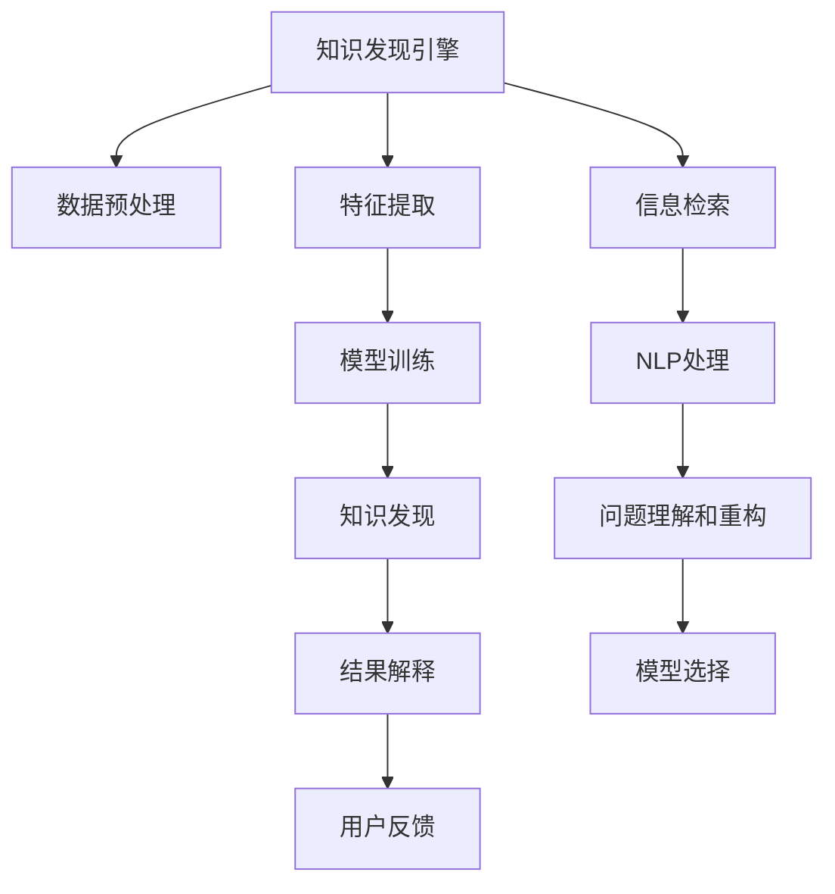

                 

# 知识发现引擎：在信息海洋中导航的灯塔

## 1. 背景介绍

在信息爆炸的时代，人类面对的是一个前所未有的信息海洋。每天都在产生海量的数据，而如何从中提取有价值的信息，进行有效的知识发现和利用，成为了现代社会的一项重要任务。知识发现引擎（Knowledge Discovery Engine, KDE）正是这样一种能够帮助用户在信息海洋中导航的灯塔，通过挖掘数据中的隐含知识，辅助用户进行决策和行动。

### 1.1 问题由来
知识发现作为数据挖掘的一部分，旨在从大规模数据集中提取有价值的知识。传统的数据挖掘方法，如分类、聚类、关联规则等，更多关注的是数据本身，而非其中的知识。而知识发现引擎则是一种更加高级的数据挖掘技术，能够自动地从数据中发现深层次的、潜在的知识，并辅助用户进行决策。

知识发现引擎在医疗、金融、零售、社交媒体等多个领域都有广泛应用，能够显著提升决策的效率和准确性。例如，在医疗领域，知识发现引擎可以通过分析电子病历数据，发现新的疾病关联模式，辅助医生进行诊断和治疗；在金融领域，知识发现引擎能够从交易数据中发现潜在的风险信号，进行风险预警和控制；在零售领域，知识发现引擎能够分析销售数据，发现消费者的购买偏好，进行个性化推荐和营销策略优化。

### 1.2 问题核心关键点
知识发现引擎的核心在于通过数据分析和机器学习算法，从数据中提取出隐含的知识，并转化为对用户的决策建议。这个过程可以分为两个主要步骤：

1. **数据预处理和特征提取**：通过清洗、归一化、降维等技术手段，将原始数据转化为机器学习算法可用的特征表示。
2. **模型训练和知识发现**：基于提取出的特征，选择合适的机器学习模型进行训练，从而发现数据中的潜在知识。

其中，数据预处理和特征提取是知识发现引擎的关键前置步骤，直接影响了最终模型的性能。模型训练和知识发现则通过优化算法和模型结构，提取数据中的隐含知识，生成对用户的决策建议。

## 2. 核心概念与联系

### 2.1 核心概念概述

为了更好地理解知识发现引擎，下面将介绍几个密切相关的核心概念：

- **知识发现（Knowledge Discovery）**：从大规模数据集中挖掘隐含知识的过程。通常包括以下几个步骤：数据预处理、特征提取、模型选择和训练、结果解释和验证。

- **数据挖掘（Data Mining）**：从数据中提取有用信息和知识的过程。包括分类、聚类、关联规则等传统数据挖掘方法。

- **机器学习（Machine Learning）**：通过数据训练机器模型，以自动地完成某些任务。与知识发现密切相关，可以视为知识发现引擎的基础算法。

- **信息检索（Information Retrieval）**：从大规模文本集合中查找相关信息的过程。知识发现引擎的查询部分通常使用信息检索技术。

- **自然语言处理（Natural Language Processing, NLP）**：处理和分析人类语言的技术。在知识发现引擎中，NLP技术用于处理和理解用户输入的自然语言问题。

### 2.2 核心概念原理和架构的 Mermaid 流程图



这个流程图展示了知识发现引擎的核心工作流程：

1. **数据预处理（B）**：清洗、归一化、降维等预处理步骤。
2. **特征提取（C）**：将原始数据转化为机器学习算法可用的特征表示。
3. **模型训练（D）**：基于提取出的特征，选择合适的机器学习模型进行训练。
4. **知识发现（E）**：通过优化算法和模型结构，提取数据中的隐含知识。
5. **结果解释（F）**：对知识发现结果进行解释，转化为对用户的决策建议。
6. **信息检索（H）**：用于处理和理解用户输入的自然语言问题。
7. **NLP处理（I）**：处理和分析用户输入的自然语言，进行问题理解和重构。
8. **模型选择（K）**：根据问题类型和数据特点，选择合适的机器学习模型。

这些概念和步骤共同构成了知识发现引擎的核心工作框架，使其能够从大规模数据中挖掘出有价值的知识，辅助用户进行决策。

## 3. 核心算法原理 & 具体操作步骤
### 3.1 算法原理概述

知识发现引擎的原理在于通过数据分析和机器学习算法，从数据中提取出隐含的知识，并转化为对用户的决策建议。其核心算法包括数据预处理、特征提取、模型训练和知识发现等步骤。

具体来说，知识发现引擎的算法原理包括以下几个方面：

1. **数据预处理**：通过清洗、归一化、降维等技术手段，将原始数据转化为机器学习算法可用的特征表示。
2. **特征提取**：选择合适的特征提取方法，从数据中提取出有用的特征，供后续模型训练使用。
3. **模型训练**：选择合适的机器学习模型，通过训练数据进行模型拟合，从而获得对数据的理解。
4. **知识发现**：通过优化算法和模型结构，从训练好的模型中发现数据中的潜在知识。
5. **结果解释**：对知识发现结果进行解释，转化为对用户的决策建议。

### 3.2 算法步骤详解

下面是知识发现引擎的具体操作步骤：

**Step 1: 数据收集和预处理**
- 收集原始数据，包括文本、图像、音频等各类数据。
- 进行数据清洗和预处理，如去除噪音、缺失值处理、异常值检测等。
- 对数据进行归一化和降维处理，以降低数据维度和提升模型训练效率。

**Step 2: 特征提取**
- 选择合适的特征提取方法，如词袋模型、TF-IDF、主题模型等。
- 提取文本、图像、音频等不同类型数据的特征。
- 将提取的特征向量作为后续模型训练的输入。

**Step 3: 模型训练**
- 选择合适的机器学习模型，如分类、聚类、关联规则等。
- 使用训练数据进行模型训练，优化模型参数，以提高模型泛化能力。
- 在训练过程中，需要注意过拟合问题，进行适当的正则化和交叉验证。

**Step 4: 知识发现**
- 对训练好的模型进行知识发现，发现数据中的潜在知识。
- 通过优化算法和模型结构，提高知识发现的准确性和可解释性。
- 可以使用特征选择、特征重要性评估等技术，提高知识发现的效率和效果。

**Step 5: 结果解释**
- 对知识发现结果进行解释，转化为对用户的决策建议。
- 可以使用可视化和解释技术，帮助用户理解模型的决策逻辑和知识发现结果。
- 需要根据具体应用场景，选择合适的方式进行结果展示。

### 3.3 算法优缺点

知识发现引擎的优点包括：

1. **自动化程度高**：能够自动地从数据中发现潜在知识，减少人工干预。
2. **泛化能力强**：通过大规模数据的训练，发现具有普遍意义的知识。
3. **用户友好**：将知识发现结果转化为对用户的决策建议，易于理解和应用。

然而，知识发现引擎也存在一些局限性：

1. **数据质量依赖**：需要高质量、完整的数据集，否则知识发现的结果可能不准确。
2. **模型复杂度**：模型训练和知识发现的过程复杂，需要较高的计算资源。
3. **结果解释困难**：某些复杂模型的结果可能难以解释，需要进一步的研究。

尽管存在这些局限性，但知识发现引擎仍然是一个强大的工具，能够帮助用户在信息海洋中发现隐藏的宝贵知识。

### 3.4 算法应用领域

知识发现引擎在多个领域都有广泛的应用，例如：

- **医疗领域**：通过分析电子病历数据，发现新的疾病关联模式，辅助医生进行诊断和治疗。
- **金融领域**：从交易数据中发现潜在的风险信号，进行风险预警和控制。
- **零售领域**：分析销售数据，发现消费者的购买偏好，进行个性化推荐和营销策略优化。
- **社交媒体**：分析用户行为数据，发现社交网络中的隐藏关系和趋势，进行舆情分析和用户行为预测。
- **智能制造**：分析生产数据，发现设备运行异常和生产瓶颈，进行优化和故障预测。

## 4. 数学模型和公式 & 详细讲解 & 举例说明

### 4.1 数学模型构建

知识发现引擎的数学模型构建通常包括以下几个步骤：

1. **数据表示**：将原始数据转化为机器学习算法可用的特征表示。
2. **模型训练**：选择合适的机器学习模型，通过训练数据进行模型拟合。
3. **知识发现**：通过优化算法和模型结构，提取数据中的潜在知识。

### 4.2 公式推导过程

以分类问题为例，知识发现引擎的数学模型构建过程如下：

1. **数据表示**
   - 假设数据集为 $D = \{(x_i, y_i)\}_{i=1}^N$，其中 $x_i$ 为输入特征， $y_i$ 为标签。
   - 将原始数据转化为特征向量 $\vec{x}_i = [x_{i1}, x_{i2}, ..., x_{im}]$，其中 $x_{ij}$ 为特征 $x_i$ 的第 $j$ 个维度。

2. **模型训练**
   - 假设模型为 $f(\vec{x}; \theta) = W\vec{x} + b$，其中 $W$ 为权重矩阵， $b$ 为偏置向量， $\theta = (W, b)$。
   - 模型训练的目标是最小化损失函数 $L(\theta) = \frac{1}{N}\sum_{i=1}^N L(y_i, f(\vec{x}_i; \theta))$，其中 $L$ 为损失函数，如交叉熵损失。
   - 通过梯度下降等优化算法，更新模型参数 $\theta$，使模型更好地拟合训练数据。

3. **知识发现**
   - 假设训练好的模型为 $f(\vec{x}; \theta^*)$，其中 $\theta^*$ 为最优参数。
   - 使用测试数据集 $D_{test}$ 进行模型测试，计算准确率、召回率等指标，评估模型性能。
   - 通过特征重要性评估、可视化技术等，发现数据中的潜在知识。

### 4.3 案例分析与讲解

假设我们有一组关于客户购买行为的特征数据，包括年龄、性别、购买频率、购买金额等。我们可以使用逻辑回归模型进行分类，以判断客户是否会再次购买。

1. **数据预处理**：清洗数据，去除缺失值和异常值，对数据进行归一化处理。
2. **特征提取**：选择年龄、性别、购买频率等特征，将其转化为数值型特征向量。
3. **模型训练**：使用逻辑回归模型，通过训练数据进行模型拟合，优化模型参数。
4. **知识发现**：使用测试数据集进行模型测试，评估模型性能。
5. **结果解释**：通过可视化技术，发现影响客户购买行为的关键特征，提供决策建议。

## 5. 项目实践：代码实例和详细解释说明

### 5.1 开发环境搭建

在进行知识发现引擎的开发实践前，我们需要准备好开发环境。以下是使用Python进行Scikit-Learn开发的开发环境配置流程：

1. 安装Anaconda：从官网下载并安装Anaconda，用于创建独立的Python环境。

2. 创建并激活虚拟环境：
```bash
conda create -n kde-env python=3.8 
conda activate kde-env
```

3. 安装Scikit-Learn：
```bash
conda install scikit-learn
```

4. 安装Pandas：
```bash
conda install pandas
```

5. 安装Matplotlib：
```bash
conda install matplotlib
```

6. 安装Seaborn：
```bash
conda install seaborn
```

完成上述步骤后，即可在`kde-env`环境中开始知识发现引擎的开发实践。

### 5.2 源代码详细实现

下面以客户购买行为分类为例，给出使用Scikit-Learn库进行逻辑回归模型训练的Python代码实现。

首先，定义数据集：

```python
import pandas as pd
from sklearn.model_selection import train_test_split

data = pd.read_csv('customer_data.csv')
X = data[['age', 'gender', 'purchase_frequency', 'purchase_amount']]
y = data['repeated_purchase']

X_train, X_test, y_train, y_test = train_test_split(X, y, test_size=0.2, random_state=42)
```

然后，定义逻辑回归模型：

```python
from sklearn.linear_model import LogisticRegression

model = LogisticRegression(max_iter=1000)
```

接着，进行模型训练和评估：

```python
model.fit(X_train, y_train)

y_pred = model.predict(X_test)
accuracy = model.score(X_test, y_test)

print(f"Accuracy: {accuracy:.2f}")
```

最后，进行结果解释：

```python
import matplotlib.pyplot as plt
import seaborn as sns

sns.pairplot(data, hue='repeated_purchase')
plt.show()
```

以上就是使用Scikit-Learn库进行逻辑回归模型训练的完整代码实现。可以看到，使用Scikit-Learn进行知识发现引擎的开发，可以大大简化模型训练和评估的过程，降低开发难度。

### 5.3 代码解读与分析

让我们再详细解读一下关键代码的实现细节：

**数据集定义**：
- 使用pandas库读取原始数据，进行特征选择和数据划分。
- 将数据集分为训练集和测试集，用于模型训练和评估。

**逻辑回归模型定义**：
- 使用Scikit-Learn库中的LogisticRegression模型，设置最大迭代次数。
- 在模型训练过程中，需要注意最大迭代次数和正则化参数等超参数的选择，以提高模型泛化能力。

**模型训练和评估**：
- 使用训练数据对模型进行拟合，得到最优参数。
- 在测试数据上对模型进行评估，输出模型的准确率等指标。
- 可以使用可视化技术，分析模型预测结果，发现模型表现不佳的原因。

**结果解释**：
- 使用seaborn库进行数据可视化，发现数据中的潜在关系和模式。
- 需要根据具体应用场景，选择合适的可视化方式，帮助用户理解模型的决策逻辑和知识发现结果。

## 6. 实际应用场景

### 6.1 医疗领域

知识发现引擎在医疗领域有着广泛的应用，例如：

- **疾病预测和诊断**：通过分析电子病历数据，发现新的疾病关联模式，辅助医生进行诊断和治疗。
- **药物研发**：从大规模生物数据中发现潜在的药物靶点，加速新药开发进程。
- **健康管理**：分析患者健康数据，发现疾病趋势和风险因素，提供个性化的健康管理方案。

### 6.2 金融领域

金融领域也是知识发现引擎的重要应用场景，例如：

- **风险预警和控制**：从交易数据中发现潜在的风险信号，进行风险预警和控制。
- **投资决策支持**：分析市场数据，发现投资趋势和机会，支持投资决策。
- **欺诈检测**：分析交易数据，发现异常交易行为，进行欺诈检测和防范。

### 6.3 零售领域

在零售领域，知识发现引擎可以用于：

- **销售预测**：分析销售数据，发现消费者购买偏好和趋势，进行销售预测和库存管理。
- **个性化推荐**：分析用户行为数据，发现消费者的购买偏好，进行个性化推荐和营销策略优化。
- **库存优化**：分析销售数据，发现商品销售趋势，优化库存管理。

### 6.4 未来应用展望

随着知识发现引擎技术的不断发展，未来的应用场景将会更加广泛，为各行各业带来新的变革。

- **智能制造**：分析生产数据，发现设备运行异常和生产瓶颈，进行优化和故障预测。
- **智慧城市**：分析城市运行数据，发现交通拥堵、环境污染等问题，提供智能化的城市管理方案。
- **农业科技**：分析农业数据，发现农作物生长趋势和病虫害情况，提供智能化的农业管理方案。
- **社交媒体**：分析用户行为数据，发现社交网络中的隐藏关系和趋势，进行舆情分析和用户行为预测。

## 7. 工具和资源推荐

### 7.1 学习资源推荐

为了帮助开发者系统掌握知识发现引擎的理论基础和实践技巧，这里推荐一些优质的学习资源：

1. 《数据挖掘导论》系列书籍：由数据挖掘领域专家撰写，系统介绍了数据挖掘的各个方面，包括分类、聚类、关联规则等。
2. 《机器学习实战》系列书籍：由机器学习领域专家撰写，提供了丰富的实践案例和代码实现。
3. Kaggle：全球最大的数据科学竞赛平台，提供了大量真实的数据集和竞赛项目，可以帮助开发者进行实战练习。
4. Coursera和edX：提供多门机器学习和数据挖掘课程，涵盖从基础到高级的各种知识点。
5. UCI机器学习库：提供了大量公开的数据集和机器学习算法实现，可以帮助开发者进行模型训练和测试。

通过对这些资源的学习实践，相信你一定能够快速掌握知识发现引擎的精髓，并用于解决实际的NLP问题。

### 7.2 开发工具推荐

高效的开发离不开优秀的工具支持。以下是几款用于知识发现引擎开发的常用工具：

1. Python：作为数据科学和机器学习的主流语言，Python具有丰富的第三方库和工具支持，适合快速迭代研究。
2. Scikit-Learn：提供了丰富的机器学习算法和工具，适合快速构建和训练模型。
3. TensorFlow和PyTorch：用于深度学习和模型训练，适合处理大规模数据和复杂模型。
4. Weights & Biases：模型训练的实验跟踪工具，可以记录和可视化模型训练过程中的各项指标，方便对比和调优。
5. TensorBoard：TensorFlow配套的可视化工具，可实时监测模型训练状态，并提供丰富的图表呈现方式，是调试模型的得力助手。

合理利用这些工具，可以显著提升知识发现引擎的开发效率，加快创新迭代的步伐。

### 7.3 相关论文推荐

知识发现引擎的研究源于学界的持续研究。以下是几篇奠基性的相关论文，推荐阅读：

1. "Knowledge Discovery in Databases"：书籍，介绍了数据挖掘和知识发现的基本概念和方法。
2. "A Survey of Knowledge Discovery and Data Mining Techniques"：综述论文，总结了数据挖掘和知识发现的各种技术和应用。
3. "The Hidden Wiener: A Biased Regressor"：论文，提出了一种基于隐含Wiener过程的知识发现方法，具有一定的创新性。
4. "Knowledge Discovery in Databases"（KDD）：国际会议，是数据挖掘和知识发现领域的顶级会议，每年都会发布大量前沿研究成果。
5. "Knowledge Discovery in Databases: Mining and Statistical Analysis of Databases"：书籍，由数据挖掘领域的权威专家编写，涵盖了数据挖掘的各个方面。

这些论文代表了大数据和知识发现领域的研究方向，通过学习这些前沿成果，可以帮助研究者把握学科前进方向，激发更多的创新灵感。

## 8. 总结：未来发展趋势与挑战

### 8.1 研究成果总结

本文对知识发现引擎进行了全面系统的介绍。首先阐述了知识发现引擎的研究背景和意义，明确了知识发现引擎在数据挖掘和决策支持中的重要价值。其次，从原理到实践，详细讲解了知识发现引擎的数学原理和关键步骤，给出了知识发现引擎开发的全流程代码实例。同时，本文还广泛探讨了知识发现引擎在多个领域的应用前景，展示了知识发现引擎的巨大潜力。

### 8.2 未来发展趋势

展望未来，知识发现引擎将呈现以下几个发展趋势：

1. **自动化程度提升**：随着机器学习算法的不断发展，知识发现引擎的自动化程度将进一步提升，能够自动识别数据中的潜在知识。
2. **多模态融合**：未来知识发现引擎将融合多种数据类型，如图像、语音、文本等，实现多模态数据的协同分析。
3. **实时性增强**：知识发现引擎将通过分布式计算和流式处理技术，实现实时数据处理和分析，提高决策的及时性。
4. **用户交互优化**：未来知识发现引擎将更加注重用户交互体验，提供更加直观和交互式的界面和工具，帮助用户更高效地进行知识发现和决策。
5. **可解释性增强**：知识发现引擎将更加注重结果的可解释性，提供更加详细和易于理解的知识发现结果，帮助用户理解模型的决策逻辑。

以上趋势凸显了知识发现引擎技术的广阔前景。这些方向的探索发展，必将进一步提升知识发现引擎的性能和应用范围，为人类决策提供更可靠、更智能的支持。

### 8.3 面临的挑战

尽管知识发现引擎已经取得了瞩目成就，但在迈向更加智能化、普适化应用的过程中，它仍面临着诸多挑战：

1. **数据质量问题**：知识发现引擎需要高质量、完整的数据集，否则结果可能不准确。如何获取和处理大规模高质量数据，是一个重要的研究方向。
2. **模型复杂度问题**：知识发现引擎的模型训练和知识发现过程复杂，需要较高的计算资源。如何提高模型的计算效率，是一个重要的研究方向。
3. **结果可解释性问题**：某些复杂模型的结果可能难以解释，需要进一步的研究。如何提高模型的可解释性，是一个重要的研究方向。
4. **用户交互问题**：知识发现引擎需要提供更加直观和交互式的界面和工具，帮助用户更高效地进行知识发现和决策。如何设计更好的用户交互界面，是一个重要的研究方向。
5. **多模态融合问题**：知识发现引擎将融合多种数据类型，如图像、语音、文本等，实现多模态数据的协同分析。如何有效融合多种数据类型，是一个重要的研究方向。

### 8.4 研究展望

面对知识发现引擎所面临的挑战，未来的研究需要在以下几个方面寻求新的突破：

1. **自动化数据预处理**：研究如何自动清洗、归一化和降维数据，提高数据预处理的效率和准确性。
2. **高效模型训练**：研究如何提高模型训练的效率和准确性，减少计算资源消耗。
3. **可解释性增强**：研究如何提高模型的可解释性，提供更加详细和易于理解的知识发现结果。
4. **用户交互优化**：研究如何设计更好的用户交互界面，帮助用户更高效地进行知识发现和决策。
5. **多模态融合技术**：研究如何有效融合多种数据类型，实现多模态数据的协同分析。

这些研究方向的探索，必将引领知识发现引擎技术迈向更高的台阶，为构建安全、可靠、可解释、可控的智能系统铺平道路。面向未来，知识发现引擎需要与其他人工智能技术进行更深入的融合，如知识表示、因果推理、强化学习等，多路径协同发力，共同推动知识发现和智能交互系统的进步。只有勇于创新、敢于突破，才能不断拓展知识发现引擎的边界，让智能技术更好地造福人类社会。

## 9. 附录：常见问题与解答

**Q1：知识发现引擎是否可以处理文本数据？**

A: 是的，知识发现引擎可以处理文本数据，并进行自然语言处理。文本数据经过预处理和特征提取后，可以输入到模型中进行训练和分析，发现其中的隐含知识。

**Q2：知识发现引擎如何处理大规模数据集？**

A: 知识发现引擎通常使用分布式计算和流式处理技术，如Spark、Flink等，处理大规模数据集。这些技术可以并行化数据处理过程，提高计算效率和处理速度。

**Q3：知识发现引擎的模型训练和结果解释是否需要人工干预？**

A: 知识发现引擎的模型训练和结果解释通常需要人工干预。模型训练时需要选择合适的超参数，进行适当的正则化和交叉验证。结果解释时，需要根据具体应用场景，选择合适的可视化方式，帮助用户理解模型的决策逻辑和知识发现结果。

**Q4：知识发现引擎在医疗领域的应用前景如何？**

A: 知识发现引擎在医疗领域有着广泛的应用前景。通过分析电子病历数据，发现新的疾病关联模式，辅助医生进行诊断和治疗。同时，知识发现引擎还可以从生物数据中发现潜在的药物靶点，加速新药开发进程，进行健康管理和疾病预测等。

**Q5：知识发现引擎在金融领域的应用前景如何？**

A: 知识发现引擎在金融领域也有着广泛的应用前景。从交易数据中发现潜在的风险信号，进行风险预警和控制。同时，知识发现引擎还可以分析市场数据，发现投资趋势和机会，进行投资决策，进行欺诈检测和防范等。

总之，知识发现引擎作为数据挖掘和决策支持的重要工具，能够从大规模数据中挖掘出有价值的知识，辅助用户进行决策和行动。尽管面临一些挑战，但随着技术的发展和应用的深入，知识发现引擎将会在更多领域得到广泛应用，为社会进步和人类发展提供新的动力。

---

作者：禅与计算机程序设计艺术 / Zen and the Art of Computer Programming

