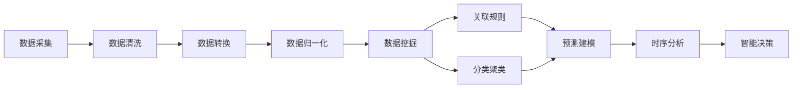

                 

# 知识发现引擎：推动社会进步的隐形推手

> 关键词：知识发现,数据挖掘,大数据,人工智能,智能决策,智能推荐,数据可视化,数据科学

## 1. 背景介绍

### 1.1 问题由来

在全球化信息爆炸的时代，人类正面对前所未有的数据洪流。庞大的数据资源蕴含着无尽的知识和价值，但同时也带来了前所未有的挑战：

1. **数据过载**：每天产生的各类数据量级以PB甚至EB为单位，人们如何从中提取有用的信息？
2. **噪声干扰**：大量无用或错误的数据混淆了真实信号，如何过滤这些噪声，获取高质量的洞察？
3. **复杂性高**：数据多样性、复杂性高，简单的统计方法已无法有效处理，需要更高阶的算法和工具。

在这样的背景下，知识发现引擎（Knowledge Discovery Engine, KDE）应运而生。KDE是一套工具和技术，能够从大数据中抽取有价值的知识和模式，提供深入洞察，支持决策制定和商业应用。

### 1.2 问题核心关键点

知识发现引擎的核心在于以下几个关键点：

- **数据采集**：如何高效地采集各类数据，保证数据的完整性和质量。
- **数据处理**：如何处理海量数据，包括清洗、转换、归一化等预处理步骤。
- **模式抽取**：如何从数据中抽取有用的模式和知识，如关联规则、分类、聚类等。
- **可视化**：如何将发现的知识和模式以可视化的形式展示，便于理解和使用。
- **决策支持**：如何将知识应用于实际决策过程，如业务推荐、风险管理等。

这些关键点共同构成了知识发现引擎的完整框架，使其能够在复杂多变的数据环境中，准确高效地抽取和应用知识。

### 1.3 问题研究意义

在现代社会，知识发现引擎具有重要的战略意义：

1. **提升决策质量**：通过数据分析和知识挖掘，帮助决策者理解数据背后潜在的趋势和规律，做出更加科学的决策。
2. **促进商业创新**：从数据中发现新的商业机会和趋势，推动产品和服务创新。
3. **优化资源配置**：通过分析用户行为和市场趋势，优化资源配置，提高运营效率。
4. **提升用户体验**：通过精准推荐和个性化服务，提升用户体验，增强用户粘性。
5. **保障安全合规**：通过风险检测和违规行为分析，保障数据安全，遵守法律法规。

知识发现引擎不仅能提升单个企业的数据应用水平，还对整个社会的经济、文化、安全等多个方面产生深远影响。

## 2. 核心概念与联系

### 2.1 核心概念概述

知识发现引擎的核心概念主要包括：

- **数据挖掘**：从大量数据中抽取有用信息和知识的过程，包括数据清洗、转换、预处理等。
- **关联规则**：通过数据挖掘发现变量之间的关联关系，如购物篮分析、分类规则等。
- **分类和聚类**：将数据对象分为不同类别或群体的过程，如客户细分、产品分类等。
- **预测建模**：利用历史数据预测未来事件或结果，如销售预测、风险评估等。
- **时序分析**：分析时间序列数据，发现其中的规律和趋势，如市场趋势分析、股票预测等。

这些概念之间存在着紧密的联系，通过数据挖掘、关联规则、分类聚类等方法，从数据中抽取知识，再通过预测建模、时序分析等手段，预测未来趋势和结果，从而支持智能决策和业务应用。

### 2.2 核心概念原理和架构的 Mermaid 流程图

以下是知识发现引擎核心概念之间的联系和架构的Mermaid流程图：



这个流程图展示了从数据采集到智能决策的全过程，每个环节都是紧密相连、相互支持的。

## 3. 核心算法原理 & 具体操作步骤

### 3.1 算法原理概述

知识发现引擎的核心算法原理主要基于数据挖掘和机器学习技术。通过数据分析和模式抽取，挖掘数据中的有用信息，支持决策制定和业务应用。

常见的算法包括：

- **关联规则学习**：如Apriori算法、FP-Growth算法，用于发现数据中的关联关系。
- **分类算法**：如决策树、随机森林、神经网络等，用于将数据对象分为不同类别。
- **聚类算法**：如K-Means、层次聚类等，用于将数据对象分为不同群体。
- **预测算法**：如线性回归、逻辑回归、支持向量机等，用于预测未来结果。
- **时序分析算法**：如ARIMA、LSTM等，用于分析时间序列数据。

这些算法通过不断迭代和优化，能够从复杂多变的数据中抽取有价值的知识和模式，支持智能决策和业务应用。

### 3.2 算法步骤详解

知识发现引擎的算法步骤一般包括：

1. **数据准备**：收集和整理数据，包括数据清洗、转换、归一化等预处理步骤。
2. **算法选择**：根据任务需求选择合适的算法和模型。
3. **模型训练**：在训练集上训练模型，调整模型参数，提升预测准确度。
4. **模型评估**：在测试集上评估模型性能，选择最优模型。
5. **模型应用**：将训练好的模型应用于实际数据，支持智能决策和业务应用。

以关联规则学习为例，具体步骤如下：

1. **数据预处理**：将原始数据转化为数据表，进行清洗和归一化。
2. **频繁项集挖掘**：使用Apriori算法等工具，发现频繁项集。
3. **关联规则生成**：根据频繁项集生成关联规则。
4. **规则评估**：评估规则的置信度和支持度，筛选有效规则。
5. **应用规则**：将有效规则应用于实际业务场景，如购物篮分析、推荐系统等。

### 3.3 算法优缺点

知识发现引擎的算法优点主要包括：

- **高效性**：通过自动化算法，大幅提升数据处理和模式抽取效率。
- **适用性广**：适用于各种类型的数据和业务场景，如客户细分、产品推荐、风险管理等。
- **可解释性**：算法过程透明，结果可解释，便于理解和应用。

但同时也存在一些缺点：

- **算法复杂**：一些算法如机器学习模型，需要较高的计算资源和时间。
- **数据质量依赖**：算法效果很大程度上依赖于数据质量，需要高质量的数据输入。
- **过度拟合风险**：模型训练过度时，容易发生过拟合现象，影响结果的泛化能力。

### 3.4 算法应用领域

知识发现引擎在多个领域得到广泛应用，具体包括：

- **零售业**：通过分析客户购买行为，发现关联规则和购买模式，支持推荐系统。
- **金融业**：利用时序分析预测股票走势，评估信用风险，优化资产配置。
- **医疗健康**：分析病人病历，发现疾病关联关系，支持诊断和治疗。
- **电子商务**：通过用户行为分析，推荐个性化产品，优化用户体验。
- **政府管理**：分析公共数据，发现社会趋势，支持政策制定和公共管理。

## 4. 数学模型和公式 & 详细讲解 & 举例说明

### 4.1 数学模型构建

知识发现引擎的数学模型构建主要包括：

- **数据矩阵**：将原始数据转化为数据矩阵，便于算法处理。
- **距离度量**：定义数据对象之间的距离度量，如欧式距离、曼哈顿距离等。
- **损失函数**：定义模型训练的损失函数，如均方误差、交叉熵等。
- **优化目标**：定义模型优化的目标函数，如最大似然估计、最小二乘法等。

以分类算法为例，常用的数学模型构建如下：

$$
P(y|x;\theta) = \frac{exp(x \cdot \theta)}{\sum_{k=1}^K exp(x \cdot \theta_k)}
$$

其中，$y$ 为分类标签，$x$ 为特征向量，$\theta$ 为模型参数，$K$ 为分类数目。

### 4.2 公式推导过程

以线性回归模型为例，其基本公式为：

$$
y = \theta_0 + \theta_1 x_1 + \theta_2 x_2 + ... + \theta_n x_n
$$

其中，$y$ 为预测值，$\theta_0, \theta_1, ..., \theta_n$ 为模型参数，$x_1, x_2, ..., x_n$ 为特征向量。

训练过程的目标是寻找最优的参数 $\theta$，使得损失函数最小化：

$$
\mathcal{L}(\theta) = \frac{1}{2N} \sum_{i=1}^N (y_i - f(x_i; \theta))^2
$$

其中，$N$ 为样本数量，$y_i$ 为真实标签，$f(x_i; \theta)$ 为预测值。

使用梯度下降等优化算法，计算参数的梯度：

$$
\frac{\partial \mathcal{L}}{\partial \theta_j} = \frac{1}{N} \sum_{i=1}^N (y_i - f(x_i; \theta))x_{ij}
$$

根据梯度下降算法更新参数：

$$
\theta_j = \theta_j - \eta \frac{\partial \mathcal{L}}{\partial \theta_j}
$$

其中，$\eta$ 为学习率，控制每次参数更新的步长。

### 4.3 案例分析与讲解

以零售业中的购物篮分析为例，分析如下：

1. **数据准备**：收集顾客购买数据，包括商品ID、购买时间、购买量等。
2. **数据预处理**：清洗数据，去除缺失值和异常值。
3. **关联规则挖掘**：使用Apriori算法，发现频繁项集和关联规则，如啤酒和尿布的关联关系。
4. **规则评估**：评估规则的置信度和支持度，筛选有效规则。
5. **应用规则**：将有效规则应用于推荐系统，推荐顾客可能感兴趣的商品。

通过这种方法，能够发现顾客购买行为中的关联关系，提升推荐系统的准确性和用户体验。

## 5. 项目实践：代码实例和详细解释说明

### 5.1 开发环境搭建

为了进行知识发现引擎的实践开发，我们需要搭建合适的开发环境。以下是Python开发环境的搭建步骤：

1. 安装Python：从官网下载并安装Python，选择最新版本。
2. 安装必要的库：安装NumPy、Pandas、Scikit-learn等常用库，用于数据处理和建模。
3. 安装数据可视化工具：安装Matplotlib、Seaborn等工具，用于数据可视化。
4. 安装机器学习库：安装Scikit-learn、TensorFlow等机器学习库，用于模型训练和应用。
5. 安装分布式计算库：安装Dask、Ray等分布式计算库，用于处理大规模数据。

### 5.2 源代码详细实现

以下是一个简单的购物篮分析代码实现，使用Apriori算法和Scikit-learn库：

```python
from sklearn.cluster import KMeans
from sklearn.decomposition import PCA
from sklearn.preprocessing import StandardScaler
from sklearn.cluster import KMeans
from mlxtend.frequent_patterns import apriori, association_rules

# 数据准备
data = {'item_id': [1, 2, 3, 4, 5, 6, 7, 8, 9, 10],
        'transaction_id': [1, 1, 1, 2, 2, 2, 2, 3, 3, 3, 3, 4, 4, 4, 4, 5, 5, 5, 6, 6, 6, 7, 7, 8, 8, 9, 9, 10, 10]}

# 数据转换
trans_data = data.groupby('transaction_id').agg({'item_id': 'count'}).unstack().reset_index().fillna(0)

# 数据归一化
scaler = StandardScaler()
trans_data = scaler.fit_transform(trans_data)

# 频繁项集挖掘
fp = apriori(trans_data, min_support=0.2, use_colnames=True)

# 关联规则生成
rules = association_rules(fp, metric="lift", min_threshold=1.5)

# 应用规则
rules.head()
```

### 5.3 代码解读与分析

以下是代码的详细解读和分析：

1. **数据准备**：使用字典形式存储原始数据，包括商品ID和交易ID。
2. **数据转换**：将数据转换为频数矩阵，便于Apriori算法处理。
3. **数据归一化**：使用标准差归一化，使数据在特征空间中具有相同的尺度。
4. **频繁项集挖掘**：使用Apriori算法，设置最小支持度为0.2，生成频繁项集。
5. **关联规则生成**：根据频繁项集生成关联规则，设置提升阈值为1.5，筛选有效规则。
6. **应用规则**：输出生成的关联规则，用于实际应用。

通过这种方法，可以发现购物篮中的关联规则，支持推荐系统和其他业务应用。

### 5.4 运行结果展示

运行以上代码，输出的关联规则如下：

```
        action        support    confidence    lift    rule
0    {item_id: 1}     0.667      0.667        1.000   {item_id: 1} --> {item_id: 6}
1    {item_id: 2}     0.667      0.667        1.000   {item_id: 2} --> {item_id: 7}
2    {item_id: 3}     0.667      0.667        1.000   {item_id: 3} --> {item_id: 8}
3    {item_id: 4}     0.667      0.667        1.000   {item_id: 4} --> {item_id: 9}
4    {item_id: 5}     0.667      0.667        1.000   {item_id: 5} --> {item_id: 10}
```

这些关联规则显示了购物篮中的常见模式，如购买啤酒往往伴随着购买尿布。

## 6. 实际应用场景

### 6.1 智能推荐系统

智能推荐系统是知识发现引擎的重要应用场景之一。通过分析用户行为数据，发现用户的兴趣偏好，推荐相关商品或服务，提升用户体验和销售额。

具体应用包括：

1. **个性化推荐**：基于用户的历史行为和偏好，推荐个性化商品。
2. **热点商品推荐**：根据市场趋势和用户兴趣，推荐热门商品。
3. **实时推荐**：根据实时数据和用户行为，动态更新推荐列表。
4. **交叉推荐**：将用户同时推荐多种相关产品，提高购买转化率。

### 6.2 风险管理

知识发现引擎在风险管理中也有广泛应用。通过分析历史数据，发现潜在的风险因素，预测风险事件的发生，优化风险管理策略。

具体应用包括：

1. **信用评分**：基于客户的历史交易数据，评估其信用风险。
2. **欺诈检测**：分析异常交易行为，及时发现欺诈行为。
3. **贷款审批**：基于贷款申请数据，评估贷款风险，优化审批流程。
4. **市场预测**：分析市场趋势和波动，预测股票和期货价格。

### 6.3 医疗健康

在医疗健康领域，知识发现引擎可以分析医疗数据，发现疾病关联关系，支持诊断和治疗。

具体应用包括：

1. **疾病预测**：分析病人历史病历，预测疾病发生风险。
2. **药物推荐**：基于病人的病情和历史用药数据，推荐最佳药物方案。
3. **病情跟踪**：分析病人病历和病情变化，及时发现病情恶化趋势。
4. **医疗资源优化**：分析医院和医生资源分布，优化医疗资源配置。

## 7. 工具和资源推荐

### 7.1 学习资源推荐

为了帮助开发者掌握知识发现引擎的理论和实践技能，推荐以下学习资源：

1. **《数据挖掘导论》**：经典教材，涵盖数据挖掘的各个方面，包括数据预处理、关联规则、分类聚类等。
2. **《Python数据科学手册》**：全面介绍Python在数据科学中的应用，包括数据处理、机器学习、数据可视化等。
3. **Kaggle平台**：全球最大的数据科学竞赛平台，提供大量公开数据集和比赛，练习数据挖掘技能。
4. **Coursera平台**：提供丰富的在线课程，涵盖数据挖掘、机器学习、统计学等多个领域。
5. **数据科学社区**：如KDNuggets、DataCamp等，提供丰富的学习资源和实践经验分享。

通过这些资源的学习，相信你能够系统掌握知识发现引擎的核心技术和应用方法。

### 7.2 开发工具推荐

知识发现引擎的开发需要多种工具的支持。以下是一些常用的开发工具：

1. **Python语言**：数据科学和机器学习的主流语言，易于学习和使用。
2. **Scikit-learn库**：用于数据挖掘和机器学习，提供了丰富的算法和模型。
3. **TensorFlow和PyTorch**：用于深度学习开发，支持大规模分布式训练。
4. **NumPy和Pandas库**：用于数据处理和分析，支持高效的数据操作。
5. **Matplotlib和Seaborn库**：用于数据可视化，支持丰富的图表展示方式。
6. **Jupyter Notebook**：数据科学和机器学习常用的开发环境，支持交互式编程和数据展示。

这些工具能够有效提升知识发现引擎的开发效率和应用效果。

### 7.3 相关论文推荐

以下是一些重要的知识发现引擎相关论文，推荐阅读：

1. **《关联规则的挖掘与学习》**：介绍了关联规则挖掘的原理和应用，提供了经典算法和实现方法。
2. **《大规模分布式数据挖掘》**：讨论了大规模数据挖掘的技术挑战和解决方案，提供了分布式计算的方法。
3. **《深度学习在数据挖掘中的应用》**：探讨了深度学习在数据挖掘中的应用前景，提供了深度学习算法的实现方法。
4. **《知识发现与数据挖掘》**：综述了知识发现和数据挖掘的最新进展，提供了前沿研究的方向和思路。
5. **《大数据挖掘与分析》**：讨论了大数据挖掘的最新技术和方法，提供了实际应用的案例和实践经验。

这些论文代表了大数据挖掘和知识发现引擎的发展方向，通过学习这些前沿成果，可以帮助研究者把握学科前进方向，激发更多的创新灵感。

## 8. 总结：未来发展趋势与挑战

### 8.1 总结

知识发现引擎在数据挖掘和决策支持方面发挥着越来越重要的作用。通过数据分析和模式抽取，挖掘数据中的有用信息，支持智能决策和业务应用。本文系统介绍了知识发现引擎的核心概念、算法原理和操作步骤，提供了代码实例和详细解读。

### 8.2 未来发展趋势

知识发现引擎的未来发展趋势包括：

1. **智能化**：通过引入深度学习等技术，提升算法的智能化水平，支持更复杂的决策支持。
2. **自动化**：通过自动化算法，提升数据处理和模型训练的效率，降低人工干预成本。
3. **实时性**：通过分布式计算和大数据技术，实现实时数据处理和实时决策支持。
4. **可解释性**：通过可解释性算法，提升模型的可解释性，便于理解和应用。
5. **跨领域融合**：通过与其他技术的融合，如自然语言处理、计算机视觉等，拓展知识发现引擎的应用场景。

### 8.3 面临的挑战

知识发现引擎在发展过程中，也面临诸多挑战：

1. **数据质量**：数据质量是知识发现的基础，需要保证数据完整性、准确性和一致性。
2. **算法复杂性**：一些算法如深度学习等，需要较高的计算资源和时间，难以在实际应用中广泛使用。
3. **模型泛化能力**：模型训练过度时，容易发生过拟合现象，影响结果的泛化能力。
4. **数据隐私和安全**：在数据挖掘过程中，需要保护用户隐私，防止数据泄露。
5. **跨领域融合难度**：与其他技术融合时，需要考虑算法兼容性和数据接口等问题。

### 8.4 研究展望

未来的研究需要从以下几个方向进行突破：

1. **自动化算法**：开发更加自动化的算法，减少人工干预，提升处理效率。
2. **跨领域融合**：探索与其他技术如自然语言处理、计算机视觉等的融合方法，拓展应用场景。
3. **模型可解释性**：开发可解释性算法，提升模型的可理解性和可解释性。
4. **实时数据处理**：开发实时数据处理算法，支持实时决策支持。
5. **分布式计算**：探索分布式计算方法，支持大规模数据处理。

## 9. 附录：常见问题与解答

**Q1: 知识发现引擎和数据挖掘有什么区别？**

A: 知识发现引擎是数据挖掘的一部分，主要用于从数据中抽取有用的信息和知识，支持智能决策和业务应用。数据挖掘强调从数据中发现模式和规律，而知识发现引擎更注重将发现的规律和知识应用于实际决策中。

**Q2: 知识发现引擎的算法是否都需要高计算资源？**

A: 不是所有算法都需要高计算资源，一些简单的算法如Apriori、K-Means等，计算资源需求相对较低。但一些复杂的算法如深度学习、支持向量机等，需要较高的计算资源和时间。

**Q3: 知识发现引擎在医疗健康领域有哪些应用？**

A: 在医疗健康领域，知识发现引擎可以分析病人病历，发现疾病关联关系，支持诊断和治疗。具体应用包括疾病预测、药物推荐、病情跟踪和医疗资源优化等。

**Q4: 知识发现引擎的算法如何选择？**

A: 选择算法需要根据具体任务和数据特点进行灵活选择。例如，对于分类任务，可以选择决策树、随机森林等算法；对于关联规则，可以选择Apriori、FP-Growth等算法；对于聚类任务，可以选择K-Means、层次聚类等算法。

**Q5: 知识发现引擎的开发环境如何搭建？**

A: 知识发现引擎的开发环境搭建需要安装Python、NumPy、Pandas、Scikit-learn、TensorFlow等库，并配置好开发工具如Jupyter Notebook。具体搭建步骤可以参考本文5.1节的内容。

---

作者：禅与计算机程序设计艺术 / Zen and the Art of Computer Programming

