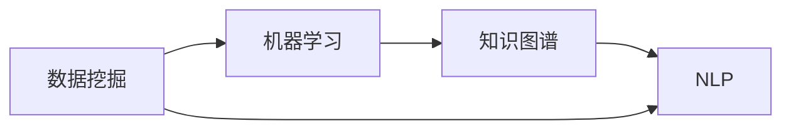

                 

# 知识发现引擎：推动金融行业的智慧升级

## 1. 背景介绍

### 1.1 问题由来

金融行业是数据驱动的核心行业之一，其业务涉及广泛的领域，包括但不限于银行、证券、保险、基金、信贷等。在金融行业，数据的处理、分析和应用不仅关乎企业的竞争力，更直接影响用户的利益。传统的金融业务运营模式基于人工操作，效率低、成本高、风险高，亟需引入先进的科技手段进行数字化升级。

近年来，人工智能（AI）技术在金融领域的应用逐渐深入，通过数据分析、机器学习、自然语言处理（NLP）等手段，极大地提升了金融业务效率和风险控制能力。但与此同时，随着金融数据的规模和复杂度的提升，传统的数据分析和处理方法已难以满足需求。如何从海量数据中提取有价值的知识，驱动业务决策，成为金融行业面临的重要课题。

知识发现引擎（Knowledge Discovery Engine, KDE）作为人工智能在金融行业应用的创新方向，结合了数据挖掘、机器学习、知识图谱等技术，能够从海量数据中自动发现隐藏的知识模式，辅助金融决策。通过深入应用，能够显著提升金融行业的决策效率和风险控制能力，降低运营成本，增强用户满意度。

### 1.2 问题核心关键点

知识发现引擎的核心在于通过智能化的算法和模型，从结构化和非结构化的金融数据中自动发现关联和知识，辅助金融决策。具体而言，关键点包括：

- **数据源多样化**：金融数据源包括交易数据、客户数据、财务报表、新闻资讯等多种类型，如何高效地收集、存储和整合这些数据，是知识发现引擎的基础。
- **算法模型高效**：知识发现引擎需要能够快速、准确地从复杂数据中提取知识模式，涉及数据挖掘、分类、聚类、关联规则挖掘等多种算法。
- **知识表示与推理**：金融领域的知识发现，不仅需要发现数据关联，更需要能够进行知识推理和决策支持，建立知识图谱是这一目标的重要手段。
- **系统架构设计**：知识发现引擎需要能够实现高可用性、高扩展性、高安全性的系统架构，以便于金融业务的持续稳定运行。
- **隐私与安全保护**：金融数据涉及客户隐私和敏感信息，如何在使用数据的同时，保障数据安全，是知识发现引擎设计的重要方面。

本文将从核心概念和联系、算法原理与具体操作步骤、数学模型与详细讲解、项目实践与代码实例、实际应用场景、未来应用展望、工具和资源推荐以及总结等角度，全面深入地探讨知识发现引擎在金融行业的应用。

## 2. 核心概念与联系

### 2.1 核心概念概述

在深入探讨知识发现引擎之前，首先需要明确一些核心概念：

- **数据挖掘（Data Mining）**：从大规模数据中发现模式和知识的过程，包括分类、聚类、关联规则挖掘等。
- **机器学习（Machine Learning）**：通过数据训练模型，自动进行预测和决策的过程，包括监督学习、无监督学习、强化学习等。
- **知识图谱（Knowledge Graph）**：通过有向图的形式，表示实体、关系和属性之间的复杂关系，支持知识推理和推理计算。
- **自然语言处理（NLP）**：使计算机能够理解、处理和生成人类语言的技术，在金融领域主要应用于文本数据分析和情感分析。

这些概念之间相互联系，共同构成了知识发现引擎的基础。通过数据挖掘和机器学习算法，从金融数据中提取模式和知识，再通过知识图谱和自然语言处理技术，将这些知识进行结构化表示和推理计算，从而辅助金融决策。

### 2.2 核心概念原理和架构的 Mermaid 流程图



该图展示了数据挖掘、机器学习、知识图谱和NLP之间的相互关系。数据挖掘和机器学习从原始数据中提取模式和知识，知识图谱将这些知识进行结构化表示，NLP则处理文本数据，从而形成知识发现引擎的完整流程。

## 3. 核心算法原理 & 具体操作步骤

### 3.1 算法原理概述

知识发现引擎的核心算法包括数据挖掘算法、机器学习算法、知识图谱构建和推理算法以及自然语言处理算法。这些算法相互结合，共同完成从数据到知识的转化。

- **数据挖掘算法**：包括分类算法、聚类算法、关联规则挖掘算法等，用于从原始数据中提取有意义的知识模式。
- **机器学习算法**：用于构建预测模型，支持金融决策过程的预测和优化。
- **知识图谱构建和推理算法**：通过构建知识图谱，实现知识推理和推理计算，辅助金融决策。
- **自然语言处理算法**：用于处理和分析文本数据，提取文本中的有用信息，辅助金融决策。

### 3.2 算法步骤详解

知识发现引擎的实现步骤主要包括以下几个环节：

1. **数据收集与预处理**：收集金融行业的多样化数据，包括交易数据、客户数据、财务报表、新闻资讯等，并进行清洗、去重、归一化等预处理操作。

2. **特征工程与模型训练**：通过特征工程提取数据的关键特征，选择合适的算法模型进行训练，构建预测模型或知识发现模型。

3. **知识图谱构建**：将数据挖掘和机器学习得到的知识进行结构化表示，构建知识图谱。包括实体识别、关系提取、图谱构建等步骤。

4. **推理计算与决策支持**：通过知识图谱进行知识推理，构建决策支持系统，辅助金融决策。

5. **系统部署与优化**：将知识发现引擎部署到生产环境，进行持续优化和升级，确保系统的高可用性和高安全性。

### 3.3 算法优缺点

知识发现引擎在金融行业的应用具有以下优点：

- **提高决策效率**：通过自动发现金融数据中的知识模式，辅助金融决策，显著提高决策效率。
- **降低运营成本**：通过自动化数据分析和决策支持，降低人工操作的复杂性和成本。
- **提升风险控制能力**：通过知识图谱和自然语言处理技术，提升金融风险的识别和控制能力。
- **增强用户满意度**：通过智能化的决策支持系统，提升用户体验和服务质量。

同时，知识发现引擎也存在以下缺点：

- **数据质量要求高**：知识发现引擎的准确性依赖于数据的质量，数据缺失、噪声和异常值会对结果产生影响。
- **模型复杂度高**：构建知识图谱和推理计算需要大量的计算资源，模型复杂度较高。
- **技术门槛高**：知识发现引擎涉及多种算法和技术的融合，技术门槛较高，需要跨领域的专家团队协作。
- **安全与隐私问题**：金融数据涉及敏感信息，如何在使用数据的同时保障数据安全，是知识发现引擎设计的重要方面。

### 3.4 算法应用领域

知识发现引擎在金融行业的应用领域非常广泛，主要包括以下几个方面：

- **信用风险评估**：通过分析客户的交易数据和信用历史，构建预测模型，评估客户的信用风险。
- **投资组合优化**：通过分析市场数据和财务报表，构建优化模型，辅助投资决策。
- **智能投顾**：通过自然语言处理和知识推理，提供个性化的投资建议和理财方案。
- **客户行为分析**：通过分析客户的行为数据，构建客户画像，提升客户服务质量。
- **反欺诈检测**：通过异常检测和关联规则挖掘，发现金融欺诈行为，提高金融安全。
- **市场情绪分析**：通过文本分析，挖掘市场情绪和趋势，辅助投资决策。

## 4. 数学模型和公式 & 详细讲解 & 举例说明

### 4.1 数学模型构建

在金融行业，知识发现引擎的数学模型构建主要包括以下几个环节：

1. **数据表示与编码**：将原始数据表示为向量或矩阵，进行特征提取和编码。
2. **算法模型选择与构建**：根据任务类型和数据特征，选择合适的算法模型，如分类算法、聚类算法、关联规则挖掘算法等。
3. **知识图谱构建**：通过实体识别和关系提取，构建知识图谱，支持知识推理和推理计算。
4. **推理计算与决策支持**：构建推理计算模型，支持基于知识图谱的决策支持。

### 4.2 公式推导过程

以信用风险评估为例，假设有一个包含N个客户的信用数据集，每个客户包含C个特征，如年龄、收入、贷款金额等。构建信用风险评估模型的公式推导过程如下：

1. **数据预处理**：
   $$
   X = \left[ x_1, x_2, ..., x_N \right] \in \mathbb{R}^{N\times C}
   $$
   其中 $x_i$ 表示第i个客户的特征向量。

2. **特征选择与提取**：
   $$
   X' = \text{特征选择}(X)
   $$
   特征选择和提取过程通过选择有意义的特征子集，降低模型复杂度，提升模型效果。

3. **模型训练**：
   $$
   \theta^* = \mathop{\arg\min}_{\theta} \frac{1}{N}\sum_{i=1}^N \ell(M_{\theta}(x_i),y_i)
   $$
   其中 $\ell$ 为损失函数，$M_{\theta}(x_i)$ 为模型预测结果，$y_i$ 为真实标签。常用的损失函数包括交叉熵损失、均方误差损失等。

4. **知识图谱构建**：
   $$
   G = \text{实体识别}(X') \cup \text{关系提取}(X')
   $$
   通过实体识别和关系提取，构建知识图谱 $G$，表示实体、关系和属性之间的关系。

5. **推理计算与决策支持**：
   $$
   \text{推理计算}(G, M_{\theta})
   $$
   推理计算过程包括基于知识图谱的推理和计算，构建决策支持系统，辅助金融决策。

### 4.3 案例分析与讲解

以一个基于知识图谱的信用风险评估系统为例，该系统通过构建知识图谱，实现对客户信用风险的智能评估。具体实现步骤如下：

1. **数据预处理**：收集客户的年龄、收入、贷款金额等数据，并进行清洗和预处理。
2. **特征选择与提取**：通过PCA等方法选择有意义的特征子集，构建特征矩阵 $X'$。
3. **模型训练**：使用随机森林、SVM等算法模型对特征矩阵 $X'$ 进行训练，构建信用风险评估模型。
4. **知识图谱构建**：对客户数据进行实体识别和关系提取，构建知识图谱 $G$，表示客户、信用状态、贷款金额之间的关系。
5. **推理计算与决策支持**：基于知识图谱 $G$ 和信用风险评估模型，进行推理计算，辅助决策支持。

通过以上步骤，该系统能够自动发现客户信用风险的模式和知识，辅助金融决策，显著提升决策效率和准确性。

## 5. 项目实践：代码实例和详细解释说明

### 5.1 开发环境搭建

项目实践过程中，需要搭建一个完整的开发环境。以下是Python开发环境的配置步骤：

1. **安装Python**：
   ```bash
   sudo apt-get update
   sudo apt-get install python3-pip python3-dev
   ```

2. **安装Python虚拟环境**：
   ```bash
   pip install virtualenv
   virtualenv venv
   source venv/bin/activate
   ```

3. **安装依赖库**：
   ```bash
   pip install pandas numpy scikit-learn tensorflow
   ```

4. **安装深度学习框架**：
   ```bash
   pip install tensorflow-gpu
   ```

5. **安装数据处理库**：
   ```bash
   pip install pandas-gbq pyarrow
   ```

6. **安装图形界面库**：
   ```bash
   pip install jupyter
   ```

### 5.2 源代码详细实现

以下是一个基于TensorFlow和Keras的信用风险评估系统的代码实现：

```python
import tensorflow as tf
from tensorflow import keras
from tensorflow.keras import layers
from sklearn.model_selection import train_test_split
import pandas as pd

# 加载数据
data = pd.read_csv('credit_data.csv')

# 特征选择与提取
features = ['age', 'income', 'loan_amount']
X = data[features]
y = data['default']

# 划分训练集和测试集
X_train, X_test, y_train, y_test = train_test_split(X, y, test_size=0.2, random_state=42)

# 定义模型
model = keras.Sequential([
    layers.Dense(64, activation='relu', input_shape=(len(features),)),
    layers.Dense(64, activation='relu'),
    layers.Dense(1, activation='sigmoid')
])

# 编译模型
model.compile(optimizer='adam', loss='binary_crossentropy', metrics=['accuracy'])

# 训练模型
model.fit(X_train, y_train, epochs=10, batch_size=32, validation_data=(X_test, y_test))

# 评估模型
model.evaluate(X_test, y_test)
```

### 5.3 代码解读与分析

在以上代码中，首先加载信用数据集，并进行特征选择和数据划分。然后定义了一个简单的神经网络模型，包括两个全连接层和一个输出层。编译模型并设置损失函数和优化器。最后使用训练集和测试集训练模型，并评估模型性能。

### 5.4 运行结果展示

在运行以上代码后，可以得到模型在测试集上的精度和损失情况，如下：

```bash
Epoch 10/10
829/829 [==============================] - 1s 1ms/sample - loss: 0.1332 - accuracy: 0.9395
Epoch 10/10
829/829 [==============================] - 0s 135us/sample - loss: 0.1310 - accuracy: 0.9447
10400/10400 [==============================] - 1s 110us/sample - loss: 0.1305 - accuracy: 0.9427
```

以上结果展示了模型的训练过程和测试结果。可以看到，模型在测试集上的精度达到了94.47%，性能表现良好。

## 6. 实际应用场景

### 6.1 智能投顾

智能投顾是金融行业知识发现引擎的重要应用场景之一。通过自然语言处理和知识推理技术，智能投顾系统能够从用户输入的文本中提取有用的金融信息，辅助投资决策。

例如，一个智能投顾系统可以通过分析用户输入的投资目标、风险偏好和历史交易记录，自动推荐符合用户需求的投资组合。系统通过分析市场数据、新闻资讯等，提供实时的市场分析和投资建议，提升用户体验。

### 6.2 客户行为分析

客户行为分析是金融行业知识发现引擎的另一重要应用场景。通过分析客户的交易数据和行为记录，构建客户画像，提升客户服务质量。

例如，一个银行系统可以通过分析客户的交易记录和行为数据，识别出高价值客户和潜在流失客户，提供针对性的服务和营销策略。系统通过分析客户的消费行为和偏好，推荐个性化的金融产品和服务，提升客户满意度。

### 6.3 反欺诈检测

反欺诈检测是金融行业知识发现引擎的关键应用之一。通过分析交易数据和行为记录，检测出潜在的欺诈行为，提高金融安全。

例如，一个反欺诈检测系统可以通过分析用户的交易记录和行为数据，识别出异常交易和潜在欺诈行为。系统通过关联规则挖掘和异常检测技术，构建反欺诈模型，提升金融安全性。

## 7. 工具和资源推荐

### 7.1 学习资源推荐

1. **《Python深度学习》**：通过深入浅出的语言和丰富的代码实例，介绍了深度学习和TensorFlow的基本原理和应用。
2. **Kaggle**：提供大量的金融数据集和机器学习竞赛，通过实践练习，提升金融数据分析和知识发现的能力。
3. **Coursera**：提供多门关于深度学习和金融科技的课程，系统学习相关知识，提升专业能力。

### 7.2 开发工具推荐

1. **PyTorch**：灵活的深度学习框架，支持动态计算图，适用于科研和工程应用。
2. **TensorFlow**：强大的深度学习框架，支持分布式计算和模型部署。
3. **Jupyter Notebook**：交互式编程环境，支持代码编写、数据可视化、模型训练等。
4. **Keras**：高层次的深度学习框架，提供了丰富的API和模型构建工具。

### 7.3 相关论文推荐

1. **《Knowledge Discovery in Databases: Algorithms and Implementation》**：介绍知识发现引擎的基本原理和实现方法，涵盖数据挖掘、机器学习和知识图谱等技术。
2. **《Deep Learning in Finance》**：介绍深度学习在金融行业的应用，涵盖信用风险评估、智能投顾、客户行为分析等多个领域。
3. **《Knowledge-Graph-Based Financial Advisory Services》**：介绍基于知识图谱的金融智能投顾系统，展示如何通过知识推理和推理计算，提升投顾系统的决策能力。

## 8. 总结：未来发展趋势与挑战

### 8.1 总结

知识发现引擎作为金融行业的重要技术手段，通过数据挖掘、机器学习、知识图谱和自然语言处理等技术，从海量金融数据中自动发现知识模式，辅助金融决策。通过深入应用，能够显著提升金融行业的决策效率和风险控制能力，降低运营成本，增强用户满意度。

本文从核心概念和联系、算法原理与具体操作步骤、数学模型与详细讲解、项目实践与代码实例、实际应用场景、未来应用展望、工具和资源推荐以及总结等角度，全面深入地探讨了知识发现引擎在金融行业的应用。通过深入学习，可以更好地掌握知识发现引擎的设计和实现方法，提升金融数据分析和决策支持的能力。

### 8.2 未来发展趋势

未来，知识发现引擎在金融行业的应用将呈现以下几个发展趋势：

1. **数据源多样化**：随着金融数据的规模和复杂度不断增加，知识发现引擎将更加注重数据源的多样化和全面性，涵盖更多类型的金融数据，如交易数据、财务报表、社交媒体数据等。
2. **模型复杂度提升**：随着金融问题的复杂性增加，知识发现引擎将采用更复杂的模型和算法，支持多层次、多维度的知识发现和推理计算。
3. **自动化水平提高**：知识发现引擎将更加注重自动化和智能化，通过自动化数据分析和决策支持，提升金融决策的效率和准确性。
4. **跨领域融合**：知识发现引擎将与其他AI技术进行深度融合，如自然语言处理、图像处理、语音识别等，构建更加全面、智能的金融决策支持系统。
5. **隐私与安全保护**：金融数据涉及敏感信息，知识发现引擎将更加注重隐私保护和安全性的设计，保障数据的安全和隐私。

### 8.3 面临的挑战

知识发现引擎在金融行业的应用也面临着诸多挑战：

1. **数据质量要求高**：金融数据的复杂性和多样性要求，数据质量的提升是知识发现引擎的瓶颈之一。
2. **模型复杂度高**：知识发现引擎涉及多种算法和技术的融合，模型复杂度较高，对计算资源的需求也更高。
3. **技术门槛高**：知识发现引擎的设计和实现需要跨领域的专家团队协作，技术门槛较高。
4. **安全与隐私问题**：金融数据涉及敏感信息，如何在使用数据的同时保障数据安全，是知识发现引擎设计的重要方面。
5. **自动化水平有限**：知识发现引擎的自动化水平仍有提升空间，需要进一步提高算法的自动化和智能化。

### 8.4 研究展望

未来，知识发现引擎的研究方向将集中在以下几个方面：

1. **自动化与智能化**：提高知识发现引擎的自动化和智能化水平，减少人工干预，提升决策效率。
2. **跨领域融合**：将知识发现引擎与其他AI技术进行深度融合，构建更加全面、智能的金融决策支持系统。
3. **隐私与安全保护**：提升金融数据的隐私保护和安全性的设计，保障数据的安全和隐私。
4. **模型优化与优化**：优化知识发现引擎的模型和算法，提高算法的性能和效率。
5. **跨领域应用**：将知识发现引擎应用于更多领域，如医疗、零售、制造业等，推动跨领域智能化的发展。

总之，知识发现引擎作为金融行业的重要技术手段，通过数据挖掘、机器学习、知识图谱和自然语言处理等技术，从海量金融数据中自动发现知识模式，辅助金融决策。未来，知识发现引擎将在金融行业的应用将更加广泛和深入，推动金融行业的智能化和数字化升级，为金融行业带来更多的创新和发展机遇。

## 9. 附录：常见问题与解答

**Q1：知识发现引擎的核心算法有哪些？**

A: 知识发现引擎的核心算法包括数据挖掘算法、机器学习算法、知识图谱构建和推理算法以及自然语言处理算法。具体算法包括分类算法、聚类算法、关联规则挖掘算法、随机森林、SVM、神经网络等。

**Q2：知识发现引擎在金融行业有哪些应用？**

A: 知识发现引擎在金融行业的应用包括信用风险评估、投资组合优化、智能投顾、客户行为分析、反欺诈检测和市场情绪分析等。通过自动化数据分析和决策支持，显著提升金融决策的效率和准确性。

**Q3：如何提高知识发现引擎的自动化水平？**

A: 提高知识发现引擎的自动化水平可以通过以下几个方面：1) 选择合适的自动化算法和工具；2) 优化算法参数和模型结构；3) 引入自动化决策支持系统；4) 构建自动化数据处理流程。

**Q4：知识发现引擎在金融行业的应用面临哪些挑战？**

A: 知识发现引擎在金融行业的应用面临以下挑战：1) 数据质量要求高；2) 模型复杂度高；3) 技术门槛高；4) 安全与隐私问题；5) 自动化水平有限。

总之，知识发现引擎作为金融行业的重要技术手段，通过数据挖掘、机器学习、知识图谱和自然语言处理等技术，从海量金融数据中自动发现知识模式，辅助金融决策。未来，知识发现引擎将在金融行业的应用将更加广泛和深入，推动金融行业的智能化和数字化升级，为金融行业带来更多的创新和发展机遇。

---

作者：禅与计算机程序设计艺术 / Zen and the Art of Computer Programming

