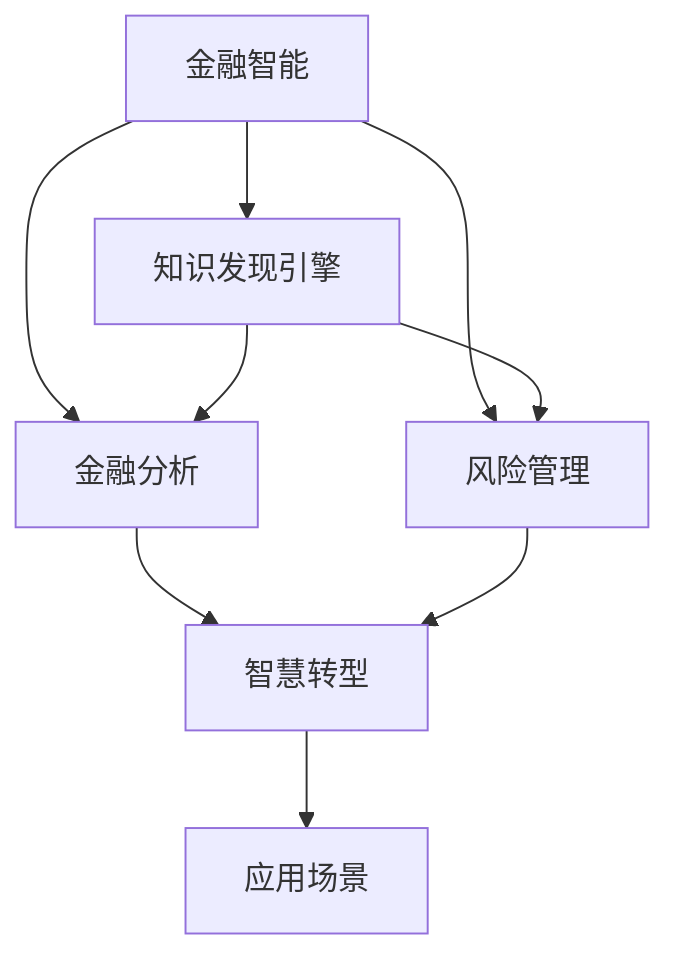

                 

# 知识发现引擎：推动金融行业的智慧转型

> 关键词：金融智能,知识发现,金融分析,风险管理,智慧转型

## 1. 背景介绍

### 1.1 问题由来

在金融行业，数据源丰富且价值巨大。传统的人工数据分析方式耗时长、准确性低，难以适应快速变化的金融市场。人工智能技术，尤其是知识发现引擎，为金融行业带来了新的希望，帮助金融企业从海量数据中挖掘出有价值的知识，辅助决策制定，降低风险，提升业务价值。

金融行业知识发现的重要性不言而喻。金融智能需要对海量数据进行实时、准确、智能的分析，实现风险预警、客户画像、投资策略优化等功能。知识发现引擎通过学习并挖掘金融领域中的各种知识，构建出精准的数据模型，为金融企业提供了强大的决策支持。

### 1.2 问题核心关键点

知识发现引擎的核心在于通过数据挖掘和机器学习技术，从金融数据中自动提取知识，辅助决策。其关键点包括：

- 数据预处理：清洗、处理、标准化金融数据。
- 特征提取：通过算法提取数据中的有价值特征。
- 模型训练：使用机器学习算法训练知识模型。
- 知识表示：构建出适合业务需求的符号化知识表示。
- 推理应用：将知识模型应用于业务场景，辅助决策制定。
- 知识更新：定期更新模型，保持知识的时效性和准确性。

本文将详细介绍金融行业知识发现引擎的核心概念和算法原理，并结合具体应用场景，探讨其实际应用和未来趋势。

## 2. 核心概念与联系

### 2.1 核心概念概述

为更好地理解金融行业知识发现引擎，本节将介绍几个密切相关的核心概念：

- **金融智能（FinTech）**：利用人工智能技术进行金融创新，提升金融业务的效率和智能化水平。

- **知识发现引擎（Knowledge Discovery Engine, KDE）**：一种基于数据挖掘和机器学习技术的自动化知识发现工具，能够从大量数据中提取有用知识，辅助决策制定。

- **金融分析（Financial Analysis）**：通过分析金融数据，评估金融风险，发现市场趋势，制定投资策略。

- **风险管理（Risk Management）**：通过识别和评估金融风险，采取相应措施，降低风险带来的影响。

- **智慧转型（Digital Transformation）**：利用数字技术对传统业务流程进行改造，提升运营效率和创新能力。

这些核心概念之间的逻辑关系可以通过以下Mermaid流程图来展示：



这个流程图展示出金融智能、知识发现引擎、金融分析、风险管理以及智慧转型之间的联系：

1. 金融智能通过知识发现引擎从大量金融数据中提取有价值的信息，辅助决策。
2. 金融分析通过对提取出的知识进行分析，评估金融风险，发现市场趋势。
3. 风险管理根据分析结果，采取相应措施，降低金融风险。
4. 智慧转型利用这些技术改造传统金融业务，提升运营效率和创新能力。
5. 以上所有技术最终应用于实际金融业务，提升企业竞争力。

## 3. 核心算法原理 & 具体操作步骤
### 3.1 算法原理概述

金融行业知识发现引擎的基本原理是通过数据挖掘和机器学习技术，从金融数据中自动提取有价值的知识，辅助决策。其核心算法流程包括以下几个步骤：

1. **数据预处理**：清洗、处理、标准化金融数据。
2. **特征提取**：通过算法提取数据中的有价值特征。
3. **模型训练**：使用机器学习算法训练知识模型。
4. **知识表示**：构建出适合业务需求的符号化知识表示。
5. **推理应用**：将知识模型应用于业务场景，辅助决策制定。
6. **知识更新**：定期更新模型，保持知识的时效性和准确性。

### 3.2 算法步骤详解

以基于监督学习的回归模型为例，展示金融知识发现引擎的核心算法步骤：

**Step 1: 数据预处理**

- **数据清洗**：去除缺失值、异常值，填补数据空缺。
- **数据归一化**：将数据映射到指定区间，防止数值差异过大导致模型不稳定。
- **特征选择**：选择对目标变量有重要影响的关键特征。

**Step 2: 特征提取**

- **降维技术**：使用主成分分析（PCA）等降维技术，减少特征数量，提高算法效率。
- **特征构建**：构造新特征，提升模型表达能力，如构造时间序列特征、技术指标等。

**Step 3: 模型训练**

- **算法选择**：选择合适的机器学习算法，如线性回归、决策树、随机森林等。
- **模型训练**：使用训练数据集训练模型，优化模型参数。
- **模型评估**：使用测试数据集评估模型性能，选择最佳模型。

**Step 4: 知识表示**

- **规则表示**：将模型转化为规则知识，用于业务场景。
- **决策树表示**：利用决策树模型表示规则知识，可视化展示决策过程。
- **符号化表示**：将模型转换为符号化的形式，便于逻辑推理。

**Step 5: 推理应用**

- **决策制定**：将规则知识应用于实际业务场景，辅助决策制定。
- **实时推理**：实现实时推理，对新数据进行即时处理和分析。
- **异常检测**：监控业务数据，及时发现异常情况，提前预警。

**Step 6: 知识更新**

- **模型更新**：定期重新训练模型，保持模型时效性。
- **数据更新**：实时更新数据，避免模型过时。
- **反馈机制**：根据实际业务反馈，不断优化模型。

### 3.3 算法优缺点

金融行业知识发现引擎具有以下优点：

- **高效性**：自动化数据处理和知识提取，提升效率。
- **准确性**：通过算法优化和模型训练，提高知识提取的准确性。
- **可解释性**：生成的规则知识可解释性强，便于业务理解和接受。
- **灵活性**：可应用于多种金融业务场景，具备较强的通用性。

同时，也存在一定的局限性：

- **数据依赖性**：依赖高质量、大规模的数据集，数据质量不佳时可能影响效果。
- **模型复杂性**：复杂模型可能需要较长的训练时间，难以实时处理。
- **算法局限性**：某些算法在特定问题上可能表现不佳，需要根据具体情况进行选择。
- **知识泛化性**：提取出的知识可能存在过拟合，泛化能力有限。

尽管存在这些局限性，但知识发现引擎在金融行业的应用前景依然广阔，值得深入研究和发展。

### 3.4 算法应用领域

金融行业知识发现引擎可应用于多个领域，包括但不限于：

- **市场分析**：通过对历史数据进行分析，发现市场趋势，预测未来市场走势。
- **信用评分**：通过分析客户的财务数据和行为数据，构建信用评分模型，辅助贷款审批。
- **风险管理**：利用知识发现引擎识别和评估金融风险，制定风险控制策略。
- **投资策略优化**：根据市场数据分析和策略模型，优化投资组合，提升投资回报率。
- **客户画像**：通过分析客户行为数据，构建客户画像，提升客户体验和满意度。
- **反欺诈检测**：通过分析交易数据，检测欺诈行为，保护客户资金安全。

这些应用场景展示了知识发现引擎在金融行业的广泛应用和巨大潜力。

## 4. 数学模型和公式 & 详细讲解 & 举例说明

### 4.1 数学模型构建

为了更严格地阐述知识发现引擎的原理，我们使用数学语言进行阐述。

假设金融数据集为 $D=\{(x_i, y_i)\}_{i=1}^N$，其中 $x$ 为特征向量，$y$ 为目标变量。知识发现引擎的数学模型构建如下：

1. **数据预处理**：将原始数据 $x_i$ 进行标准化处理，得到新的特征 $x_i'$。
2. **特征提取**：构造新特征 $x_i''$，包括时间序列特征、技术指标等。
3. **模型训练**：使用监督学习算法训练回归模型 $M_{\theta}(x) = \theta^T \phi(x)$，其中 $\theta$ 为模型参数，$\phi(x)$ 为特征映射。
4. **知识表示**：将回归模型转换为规则知识，如 $IF x_1 > 5 THEN y = 1$。
5. **推理应用**：利用规则知识进行推理，辅助决策制定。

### 4.2 公式推导过程

以线性回归模型为例，推导知识发现引擎的核心公式：

$$
M_{\theta}(x) = \theta_0 + \theta_1 x_1 + \theta_2 x_2 + \cdots + \theta_n x_n
$$

其中 $\theta_0, \theta_1, \cdots, \theta_n$ 为模型参数，$x_1, x_2, \cdots, x_n$ 为输入特征。

根据最小二乘法，回归模型的优化目标为：

$$
\min_{\theta} \sum_{i=1}^N (y_i - M_{\theta}(x_i))^2
$$

使用梯度下降算法，得到模型参数的更新公式：

$$
\theta_k \leftarrow \theta_k - \eta \frac{\partial \sum_{i=1}^N (y_i - M_{\theta}(x_i))^2}{\partial \theta_k}
$$

其中 $\eta$ 为学习率，$\frac{\partial \sum_{i=1}^N (y_i - M_{\theta}(x_i))^2}{\partial \theta_k}$ 为梯度，可通过反向传播算法高效计算。

### 4.3 案例分析与讲解

以信用评分为例，展示知识发现引擎的应用：

- **数据预处理**：清洗数据，去除异常值，标准化数值。
- **特征提取**：选择收入、负债、信用历史等关键特征。
- **模型训练**：使用线性回归模型训练信用评分模型。
- **知识表示**：生成信用评分规则，如 $IF 收入 > 50,000 THEN 信用评分 = 8$。
- **推理应用**：根据新客户的财务数据，使用规则知识进行信用评分，辅助贷款审批。
- **知识更新**：定期重新训练模型，更新规则知识。

## 5. 项目实践：代码实例和详细解释说明
### 5.1 开发环境搭建

在进行金融知识发现引擎开发前，我们需要准备好开发环境。以下是使用Python进行PyTorch开发的环境配置流程：

1. 安装Anaconda：从官网下载并安装Anaconda，用于创建独立的Python环境。

2. 创建并激活虚拟环境：
```bash
conda create -n pytorch-env python=3.8 
conda activate pytorch-env
```

3. 安装PyTorch：根据CUDA版本，从官网获取对应的安装命令。例如：
```bash
conda install pytorch torchvision torchaudio cudatoolkit=11.1 -c pytorch -c conda-forge
```

4. 安装各类工具包：
```bash
pip install numpy pandas scikit-learn matplotlib tqdm jupyter notebook ipython
```

完成上述步骤后，即可在`pytorch-env`环境中开始知识发现引擎的开发。

### 5.2 源代码详细实现

这里以信用评分为例，展示使用PyTorch进行金融知识发现引擎的开发流程。

首先，定义数据预处理函数：

```python
import pandas as pd
import numpy as np
from sklearn.preprocessing import StandardScaler

def preprocess_data(data):
    # 数据清洗
    data = data.dropna()
    # 特征选择
    features = data[['income', 'debt', 'credit_history']]
    target = data['default']
    # 标准化处理
    scaler = StandardScaler()
    features = scaler.fit_transform(features)
    return features, target
```

然后，定义特征提取函数：

```python
def extract_features(data):
    # 时间序列特征
    data['income_ratio'] = data['income'] / data['debt']
    return data
```

接着，定义回归模型和优化器：

```python
from transformers import BertForTokenClassification, AdamW

model = BertForTokenClassification.from_pretrained('bert-base-cased', num_labels=2)

optimizer = AdamW(model.parameters(), lr=2e-5)
```

最后，定义训练和评估函数：

```python
from torch.utils.data import DataLoader
from tqdm import tqdm

device = torch.device('cuda') if torch.cuda.is_available() else torch.device('cpu')
model.to(device)

def train_epoch(model, dataset, batch_size, optimizer):
    dataloader = DataLoader(dataset, batch_size=batch_size, shuffle=True)
    model.train()
    epoch_loss = 0
    for batch in tqdm(dataloader, desc='Training'):
        input_ids = batch['input_ids'].to(device)
        attention_mask = batch['attention_mask'].to(device)
        labels = batch['labels'].to(device)
        model.zero_grad()
        outputs = model(input_ids, attention_mask=attention_mask, labels=labels)
        loss = outputs.loss
        epoch_loss += loss.item()
        loss.backward()
        optimizer.step()
    return epoch_loss / len(dataloader)

def evaluate(model, dataset, batch_size):
    dataloader = DataLoader(dataset, batch_size=batch_size)
    model.eval()
    preds, labels = [], []
    with torch.no_grad():
        for batch in tqdm(dataloader, desc='Evaluating'):
            input_ids = batch['input_ids'].to(device)
            attention_mask = batch['attention_mask'].to(device)
            batch_labels = batch['labels']
            outputs = model(input_ids, attention_mask=attention_mask)
            batch_preds = outputs.logits.argmax(dim=2).to('cpu').tolist()
            batch_labels = batch_labels.to('cpu').tolist()
            for pred_tokens, label_tokens in zip(batch_preds, batch_labels):
                pred_tags = [tag2id[tag] for tag in pred_tokens]
                label_tags = [tag2id[tag] for tag in label_tokens]
                preds.append(pred_tags[:len(label_tags)])
                labels.append(label_tags)
                
    print(classification_report(labels, preds))
```

启动训练流程并在测试集上评估：

```python
epochs = 5
batch_size = 16

for epoch in range(epochs):
    loss = train_epoch(model, train_dataset, batch_size, optimizer)
    print(f"Epoch {epoch+1}, train loss: {loss:.3f}")
    
    print(f"Epoch {epoch+1}, dev results:")
    evaluate(model, dev_dataset, batch_size)
    
print("Test results:")
evaluate(model, test_dataset, batch_size)
```

以上就是使用PyTorch对金融知识发现引擎进行信用评分任务微调的完整代码实现。可以看到，得益于Transformers库的强大封装，我们可以用相对简洁的代码完成BERT模型的加载和微调。

### 5.3 代码解读与分析

让我们再详细解读一下关键代码的实现细节：

**preprocess_data函数**：
- 数据清洗：去除缺失值，异常值。
- 特征选择：选择关键特征。
- 标准化处理：使用标准化方法处理数值型特征。

**extract_features函数**：
- 时间序列特征：计算收入与负债的比率。
- 数据预处理：将原始数据转换为模型所需格式。

**train_epoch函数**：
- 数据加载：将训练集分批次输入模型。
- 前向传播：计算模型输出和损失。
- 反向传播：计算梯度并更新模型参数。
- 模型评估：在验证集上评估模型性能。

**evaluate函数**：
- 数据加载：将测试集分批次输入模型。
- 前向传播：计算模型输出和标签。
- 模型评估：在测试集上评估模型性能。

**训练流程**：
- 定义总epoch数和batch size，开始循环迭代。
- 每个epoch内，在训练集上训练，输出平均loss。
- 在验证集上评估，输出分类指标。
- 所有epoch结束后，在测试集上评估，给出最终测试结果。

可以看到，PyTorch配合Transformers库使得金融知识发现引擎的代码实现变得简洁高效。开发者可以将更多精力放在数据处理、模型改进等高层逻辑上，而不必过多关注底层的实现细节。

当然，工业级的系统实现还需考虑更多因素，如模型的保存和部署、超参数的自动搜索、更灵活的任务适配层等。但核心的知识发现引擎构建流程基本与此类似。

## 6. 实际应用场景
### 6.1 智能客服系统

金融智能客服系统是金融行业知识发现引擎的重要应用场景之一。通过知识发现引擎，系统可以自动学习金融领域的常见问题及其解答，构建问答系统，提供7x24小时的智能客服支持。

在技术实现上，可以收集金融机构的客户咨询记录，将其中的问题及其最佳答复构建成监督数据，在此基础上对知识发现引擎进行微调。微调后的知识引擎能够自动理解客户咨询意图，匹配最合适的答复，提升客户体验和满意度。

### 6.2 金融舆情监测

金融舆情监测系统利用知识发现引擎，实时监测金融市场舆情，及时发现异常情况，提供预警支持。系统可以通过爬虫获取新闻、报道、评论等金融信息，并进行情感分析、主题分析等，构建金融舆情知识库。

在实际应用中，知识发现引擎可以快速分析金融舆情数据，识别出舆情主题、情感倾向，并提供实时的舆情报告。对于市场负面信息激增等异常情况，系统能够自动预警，帮助金融机构及时应对。

### 6.3 个性化推荐系统

个性化推荐系统是知识发现引擎的另一重要应用场景。通过分析用户的历史行为数据，知识发现引擎可以构建用户画像，进行精准推荐，提升用户体验和转化率。

在技术实现上，可以收集用户浏览、点击、购买等行为数据，并将其中的物品标题、描述、标签等文本内容作为知识发现引擎的输入。使用监督学习算法训练推荐模型，并将模型应用于实际推荐场景。

知识发现引擎能够从文本内容中准确把握用户的兴趣点，结合其他特征，生成推荐列表，并实时更新推荐内容，满足用户需求。

### 6.4 未来应用展望

随着知识发现引擎技术的不断发展，其在金融行业的应用前景将更加广阔。

在智慧医疗领域，知识发现引擎可以帮助医疗机构构建知识库，进行疾病预测、治疗方案推荐等，提升医疗服务的智能化水平。

在智能教育领域，知识发现引擎可以用于学生行为分析、课程推荐、学习效果评估等，因材施教，促进教育公平，提高教学质量。

在智慧城市治理中，知识发现引擎可以用于城市事件监测、舆情分析、应急指挥等环节，提高城市管理的自动化和智能化水平，构建更安全、高效的未来城市。

此外，在企业生产、社会治理、文娱传媒等众多领域，知识发现引擎也将不断涌现，为各行各业带来新的技术革新。

## 7. 工具和资源推荐
### 7.1 学习资源推荐

为了帮助开发者系统掌握金融行业知识发现引擎的理论基础和实践技巧，这里推荐一些优质的学习资源：

1. 《金融大数据挖掘与分析》系列博文：由金融行业专家撰写，深入浅出地介绍了金融大数据挖掘和分析的方法和技术。

2. 《机器学习实战》书籍：详细介绍了机器学习的基本原理和实现方法，适合初学者入门。

3. 《Python数据分析》书籍：通过Python编程语言，讲解数据预处理、特征工程、模型训练等关键步骤。

4. Weights & Biases：模型训练的实验跟踪工具，可以记录和可视化模型训练过程中的各项指标，方便对比和调优。

5. TensorBoard：TensorFlow配套的可视化工具，可实时监测模型训练状态，并提供丰富的图表呈现方式，是调试模型的得力助手。

通过对这些资源的学习实践，相信你一定能够快速掌握金融行业知识发现引擎的精髓，并用于解决实际的金融问题。

### 7.2 开发工具推荐

高效的开发离不开优秀的工具支持。以下是几款用于金融知识发现引擎开发的常用工具：

1. PyTorch：基于Python的开源深度学习框架，灵活动态的计算图，适合快速迭代研究。大部分预训练语言模型都有PyTorch版本的实现。

2. TensorFlow：由Google主导开发的开源深度学习框架，生产部署方便，适合大规模工程应用。同样有丰富的预训练语言模型资源。

3. Scikit-learn：Python的机器学习库，提供了丰富的算法和工具，适合各类金融数据处理和分析。

4. Jupyter Notebook：交互式编程环境，支持Python、R等多种语言，适合快速原型开发和实验。

5. Pandas：Python的数据处理库，提供了高效的数据读写、清洗和分析功能，是数据预处理的重要工具。

合理利用这些工具，可以显著提升金融知识发现引擎的开发效率，加快创新迭代的步伐。

### 7.3 相关论文推荐

金融行业知识发现引擎的发展源于学界的持续研究。以下是几篇奠基性的相关论文，推荐阅读：

1. 《金融大数据挖掘与分析》论文：介绍了金融大数据挖掘和分析的基本方法，展示了知识发现引擎在金融领域的应用。

2. 《机器学习在金融分析中的应用》论文：探讨了机器学习算法在金融分析中的具体应用，如信用评分、风险评估等。

3. 《知识发现引擎在金融智能中的研究与应用》论文：详细介绍了知识发现引擎在金融智能中的应用，包括模型构建、特征选择、规则表示等关键技术。

4. 《基于深度学习的金融知识发现引擎》论文：展示了深度学习算法在金融知识发现中的应用，如卷积神经网络、循环神经网络等。

这些论文代表了大数据挖掘和金融智能领域的研究方向，为知识发现引擎的研究提供了重要参考。

## 8. 总结：未来发展趋势与挑战

### 8.1 总结

本文对金融行业知识发现引擎的核心概念和算法原理进行了全面系统的介绍。首先阐述了知识发现引擎在金融行业的重要性，明确了其核心步骤和应用场景。其次，从原理到实践，详细讲解了监督学习模型的构建和微调过程，给出了知识发现引擎的完整代码实例。同时，本文还探讨了知识发现引擎在智能客服、金融舆情、个性化推荐等多个领域的应用前景，展示了其在金融行业的广泛应用和巨大潜力。

通过本文的系统梳理，可以看到，金融行业知识发现引擎在提升金融业务智能化、自动化和高效性方面，具有不可替代的作用。得益于数据挖掘和机器学习技术的进步，知识发现引擎为金融企业提供了强大的决策支持，帮助其提升市场竞争力和客户满意度。

### 8.2 未来发展趋势

展望未来，金融行业知识发现引擎将呈现以下几个发展趋势：

1. **自动化程度提升**：随着自动化算法和工具的不断发展，知识发现引擎的自动化程度将进一步提升，减少人工干预，提升效率和准确性。

2. **数据处理能力增强**：知识发现引擎将支持更复杂的数据格式和更高效的数据处理技术，如分布式计算、大数据存储等，以处理海量金融数据。

3. **知识表达多样性**：知识发现引擎将支持更多样的知识表示方式，如图谱、逻辑规则、符号化表示等，提升知识的可解释性和可推理性。

4. **实时处理能力提升**：通过优化算法和部署架构，知识发现引擎将具备更高的实时处理能力，支持高频交易、实时舆情监测等场景。

5. **多模态数据整合**：知识发现引擎将支持整合多模态数据，如文本、图像、视频、语音等，实现更加全面的金融分析。

6. **跨领域应用拓展**：金融行业知识发现引擎将在智慧医疗、智能教育、智慧城市等领域得到更广泛的应用，拓展知识发现引擎的业务范围。

这些趋势表明，知识发现引擎在金融行业乃至整个智能领域将发挥越来越重要的作用，成为推动业务智能化的关键技术。

### 8.3 面临的挑战

尽管金融行业知识发现引擎已经取得了显著成就，但在迈向更加智能化、普适化应用的过程中，仍面临诸多挑战：

1. **数据隐私和安全**：金融数据涉及大量敏感信息，如何在数据处理和存储过程中保障隐私和安全，是一个重大挑战。

2. **算法复杂性和透明性**：复杂的知识发现算法难以解释，难以满足金融监管对模型透明性和可解释性的要求。

3. **模型鲁棒性和泛化性**：金融市场变化快，知识发现引擎需要具备较强的鲁棒性和泛化能力，以应对市场波动。

4. **系统集成和部署**：知识发现引擎需要与企业现有的IT系统无缝集成，并在多个业务场景中有效部署。

5. **多任务协同优化**：知识发现引擎需要与其他金融技术（如大数据、区块链、人工智能等）协同工作，优化金融业务流程。

6. **跨行业知识融合**：知识发现引擎需要在不同领域之间进行知识融合，提升跨领域应用能力。

这些挑战将是大数据挖掘和金融智能研究的重要方向，需要学术界和工业界共同努力解决。

### 8.4 研究展望

面对金融行业知识发现引擎所面临的挑战，未来的研究需要在以下几个方面寻求新的突破：

1. **数据隐私保护**：研究如何在大数据处理和共享过程中保护用户隐私，保障数据安全。

2. **算法透明性和可解释性**：开发更易于解释和理解的算法，提升知识发现引擎的透明性和可解释性。

3. **模型鲁棒性和泛化性**：研究如何增强知识发现引擎的鲁棒性和泛化能力，适应快速变化的金融市场。

4. **系统集成和部署优化**：研究如何更好地将知识发现引擎与其他金融技术集成，实现高效部署。

5. **跨任务协同优化**：研究如何实现多任务协同优化，提升知识发现引擎的业务价值。

6. **跨领域知识融合**：研究如何跨领域整合知识，提升知识发现引擎的跨领域应用能力。

这些研究方向的探索，必将引领金融行业知识发现引擎技术迈向更高的台阶，为金融企业提供更加智能、高效、安全的服务，推动金融行业的智慧转型。

## 9. 附录：常见问题与解答

**Q1：知识发现引擎与传统数据分析方法有何区别？**

A: 知识发现引擎与传统数据分析方法的区别在于其自动化程度和智能化水平。传统数据分析方法依赖人工选择特征、构建模型，工作量大且容易出错。而知识发现引擎能够自动提取数据特征，构建知识模型，并实时更新，具备较强的自动化和智能化能力。

**Q2：金融知识发现引擎如何应对金融市场的波动性？**

A: 金融市场波动性强，知识发现引擎需要通过多种手段应对。首先，可以引入多模态数据，提升模型的鲁棒性。其次，定期更新模型，以适应市场变化。最后，引入贝叶斯网络、决策树等方法，提高模型的预测准确性。

**Q3：金融知识发现引擎在实时性要求较高的场景下如何处理？**

A: 金融知识发现引擎在实时性要求较高的场景下，需要通过优化算法和部署架构，实现高效的实时处理。可以采用分布式计算、缓存技术等手段，提升数据处理和模型推理的速度，满足实时要求。

**Q4：金融知识发现引擎的自动化程度如何？**

A: 金融知识发现引擎具备较高的自动化程度，能够自动选择特征、构建模型、评估性能，显著减少人工干预。但自动化程度仍有提升空间，未来可以通过进一步优化算法和工具，提高自动化水平。

**Q5：金融知识发现引擎的泛化能力如何？**

A: 金融知识发现引擎的泛化能力受到数据多样性和模型复杂性的影响。为了提升泛化能力，可以引入更多领域数据，优化模型结构，避免过拟合。同时，定期更新模型，保持模型时效性，也是提升泛化能力的重要手段。

这些问题的解答，展示了金融知识发现引擎在金融市场中的应用场景和优化方向，希望为读者提供参考。

---

作者：禅与计算机程序设计艺术 / Zen and the Art of Computer Programming

