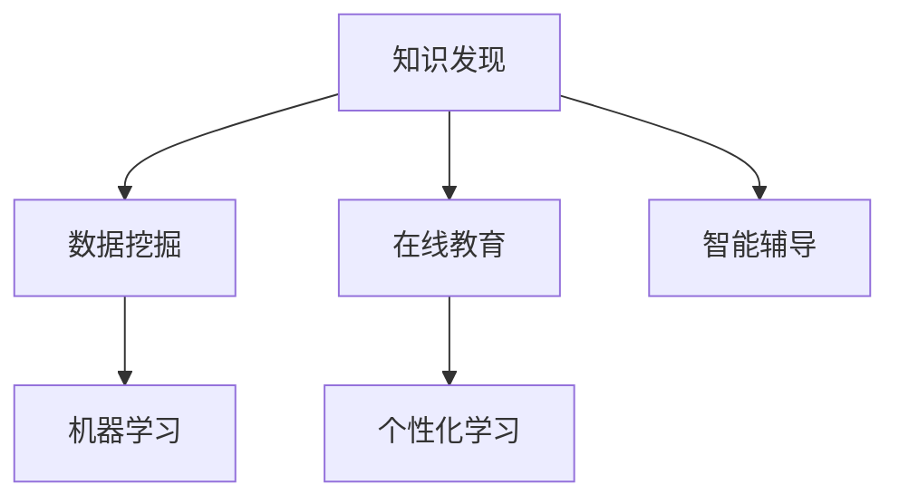

                 

# 知识发现引擎：教育领域的创新引擎

> 关键词：知识发现引擎,教育技术创新,个性化学习,智能辅导,数据驱动教育

## 1. 背景介绍

### 1.1 问题由来

随着信息技术的迅猛发展，教育领域正经历着一场革命性的变革。传统的教学模式正逐渐被基于互联网的在线教育所取代，在线学习平台和数字化教学资源日益普及。然而，在线教育的弊端也逐渐显现：教学质量参差不齐、学习效果难以衡量、个性化需求难以满足等问题困扰着许多教育机构和学生。

在此背景下，知识发现引擎（Knowledge Discovery Engine, KDE）应运而生。KDE通过对大量学习数据进行深入分析，能够发现知识结构、学习规律和个性化需求，从而为教育机构和教师提供有力的决策支持，帮助学生制定更加个性化、高效的学习计划。

### 1.2 问题核心关键点

知识发现引擎的核心在于其利用先进的数据挖掘和机器学习技术，从庞大的学习数据中提取有价值的知识模式。具体来说，KDE需要解决以下几个关键问题：

- 如何高效地处理大规模教育数据？
- 如何在保证学习数据隐私的前提下，挖掘有用的知识模式？
- 如何根据学生的个性化需求，制定推荐的学习计划？
- 如何实时监控学生的学习状态，并及时调整教学策略？

### 1.3 问题研究意义

KDE在教育领域的应用，具有深远的意义：

- 提高教学质量。通过对学生学习数据深入分析，KDE能够帮助教师优化教学内容，提高教学质量。
- 个性化学习。KDE可以发现学生的学习偏好和知识盲点，制定个性化的学习计划，满足学生的个性化需求。
- 提升学习效果。通过智能推荐系统，KDE能够帮助学生更高效地学习，提升学习效果。
- 数据驱动决策。KDE提供的洞察力能够帮助教育机构和教师进行数据驱动的决策，优化教育资源配置。

## 2. 核心概念与联系

### 2.1 核心概念概述

KDE的核心概念包括以下几个方面：

- **知识发现（Knowledge Discovery）**：指从大量数据中自动提取和呈现有价值的信息和知识模式的过程。KDE通过挖掘教育数据，发现学习规律和知识结构。

- **数据挖掘（Data Mining）**：指利用统计学、机器学习等技术，从数据中发现模式和知识的过程。KDE主要使用数据挖掘技术来实现知识发现。

- **机器学习（Machine Learning）**：指通过学习数据，使计算机能够自主地进行预测、分类、聚类等任务。KDE使用各种机器学习算法进行知识发现。

- **在线教育（Online Education）**：指利用互联网技术和平台，进行线上课程学习的过程。KDE应用于在线教育平台，提升学习效果。

- **个性化学习（Personalized Learning）**：指根据学生的兴趣和能力，提供定制化的学习方案。KDE通过分析学习数据，实现个性化推荐。

- **智能辅导（Intelligent Tutoring）**：指利用人工智能技术，提供实时、个性化的辅导和学习支持。KDE能够根据学生的学习状态，实时调整教学策略。

这些概念之间存在着密切的联系，共同构成了KDE的基础框架。

### 2.2 核心概念原理和架构的 Mermaid 流程图



这个流程图展示了KDE的核心概念及其相互关系：

- 知识发现是KDE的基础，通过数据挖掘和机器学习技术实现。
- 在线教育是KDE的应用场景，KDE通过数据挖掘和机器学习技术提升在线教育的质量和效果。
- 个性化学习是KDE的核心应用之一，通过对学生学习数据的深入分析，实现个性化的推荐。
- 智能辅导是KDE的高级应用，通过实时监控和调整教学策略，提供个性化的辅导支持。

## 3. 核心算法原理 & 具体操作步骤

### 3.1 算法原理概述

KDE的算法原理主要基于数据挖掘和机器学习的技术。其核心流程包括数据预处理、特征工程、模型训练和结果解释四个步骤。

1. **数据预处理**：将原始教育数据进行清洗、去噪、归一化等处理，确保数据质量。
2. **特征工程**：根据业务需求和模型特性，选择合适的特征，构建特征向量。
3. **模型训练**：选择合适的机器学习算法，如分类、聚类、回归等，在训练数据上训练模型。
4. **结果解释**：通过模型对测试数据进行预测，并解释预测结果，提供有价值的洞察。

### 3.2 算法步骤详解

以下详细讲解KDE的具体操作流程：

#### 3.2.1 数据预处理

KDE的数据预处理主要包括以下几个步骤：

1. **数据清洗**：去除缺失值、重复值、异常值等噪音数据。
2. **数据归一化**：将不同量级的特征进行归一化，确保特征在同一尺度上。
3. **数据划分**：将数据划分为训练集、验证集和测试集。
4. **数据标注**：对标注数据进行预标注，用于模型的训练和评估。

#### 3.2.2 特征工程

特征工程是KDE的重要环节，主要包括以下几个步骤：

1. **特征选择**：根据业务需求和模型特性，选择合适的特征。
2. **特征提取**：从原始数据中提取特征向量。
3. **特征转换**：对特征进行转换，提高模型的表达能力。
4. **特征降维**：对高维特征进行降维，减少计算量和内存消耗。

#### 3.2.3 模型训练

KDE的模型训练主要包括以下几个步骤：

1. **模型选择**：根据任务需求，选择合适的机器学习算法。
2. **模型训练**：在训练数据上训练模型，优化模型参数。
3. **模型评估**：在验证集上评估模型性能，选择最优模型。
4. **模型优化**：对模型进行调优，提高模型泛化能力。

#### 3.2.4 结果解释

KDE的结果解释主要包括以下几个步骤：

1. **模型预测**：在测试数据上使用模型进行预测。
2. **结果可视化**：将预测结果可视化，帮助用户理解模型。
3. **结果解释**：解释预测结果的逻辑和依据，提供有价值的洞察。

### 3.3 算法优缺点

KDE的优点包括：

- 能够高效处理大规模教育数据。
- 能够发现有用的知识模式，提供有价值的洞察。
- 能够实现个性化推荐，提升学习效果。
- 能够实时监控学习状态，调整教学策略。

KDE的缺点包括：

- 对数据质量依赖较高，需要大量标注数据。
- 模型复杂，计算量较大。
- 对算法调优要求较高，需要一定的专业技能。
- 数据隐私和安全问题需要特别关注。

### 3.4 算法应用领域

KDE主要应用于以下几个领域：

- **在线教育平台**：通过对学生学习数据的分析，实现个性化推荐和智能辅导。
- **智能学习系统**：根据学生的学习状态，实时调整教学策略，提升学习效果。
- **教育数据分析**：通过挖掘学习数据，发现知识结构和规律，支持教育决策。
- **智慧校园**：通过知识发现，优化校园资源配置，提高校园管理效率。

## 4. 数学模型和公式 & 详细讲解 & 举例说明

### 4.1 数学模型构建

KDE的数学模型主要基于机器学习算法，如分类、聚类、回归等。以下以分类模型为例，介绍KDE的数学模型构建过程。

设训练集为$D=\{(x_i, y_i)\}_{i=1}^N$，其中$x_i \in \mathcal{X}$为输入特征，$y_i \in \{0, 1\}$为输出标签。假设选择二元分类算法，如逻辑回归、支持向量机等，目标是最小化损失函数$\mathcal{L}$。

$$
\mathcal{L} = \frac{1}{N}\sum_{i=1}^N \ell(y_i, \hat{y_i})
$$

其中$\ell$为损失函数，如交叉熵损失函数。

### 4.2 公式推导过程

以逻辑回归为例，其数学推导过程如下：

设训练集为$D=\{(x_i, y_i)\}_{i=1}^N$，目标是最小化交叉熵损失函数：

$$
\mathcal{L} = -\frac{1}{N}\sum_{i=1}^N y_i\log\sigma(\mathbf{w}\cdot\mathbf{x}_i + b)
$$

其中$\sigma$为Sigmoid函数，$\mathbf{w}$和$b$为模型的权重和偏置。

求梯度：

$$
\nabla_{\mathbf{w}, b} \mathcal{L} = -\frac{1}{N}\sum_{i=1}^N [y_i - \sigma(\mathbf{w}\cdot\mathbf{x}_i + b)] \mathbf{x}_i
$$

使用随机梯度下降(SGD)算法更新模型参数：

$$
\mathbf{w} \leftarrow \mathbf{w} - \eta \nabla_{\mathbf{w}} \mathcal{L}
$$

$$
b \leftarrow b - \eta \nabla_{b} \mathcal{L}
$$

其中$\eta$为学习率。

### 4.3 案例分析与讲解

以推荐系统为例，介绍KDE在个性化学习中的应用。

假设推荐系统已收集到用户的历史浏览行为数据，包括用户ID、商品ID、浏览时间等。设$X$为特征集，$Y$为标签集。

1. **数据预处理**：清洗数据，去除缺失值和异常值。
2. **特征工程**：选择用户ID、浏览时间等特征，提取用户行为特征向量。
3. **模型训练**：选择决策树、随机森林等算法，训练模型。
4. **结果解释**：对用户的新行为数据进行预测，解释推荐结果的依据。

## 5. 项目实践：代码实例和详细解释说明

### 5.1 开发环境搭建

以下介绍KDE的开发环境搭建流程：

1. **环境准备**：安装Python、PyTorch、NumPy等基础库。
2. **数据集准备**：准备教育数据集，划分为训练集、验证集和测试集。
3. **工具准备**：安装Scikit-learn、Pandas等机器学习库。

### 5.2 源代码详细实现

以下给出KDE的代码实现示例：

```python
from sklearn.ensemble import RandomForestClassifier
from sklearn.model_selection import train_test_split
import pandas as pd

# 准备数据集
data = pd.read_csv('data.csv')
X = data[['特征1', '特征2', '特征3']]
y = data['标签']
X_train, X_test, y_train, y_test = train_test_split(X, y, test_size=0.2, random_state=42)

# 训练模型
model = RandomForestClassifier()
model.fit(X_train, y_train)

# 测试模型
y_pred = model.predict(X_test)
print(classification_report(y_test, y_pred))
```

### 5.3 代码解读与分析

1. **数据准备**：使用Pandas库读取数据集，并划分为训练集和测试集。
2. **特征选择**：选择需要的特征，构建特征向量。
3. **模型训练**：使用随机森林算法训练模型。
4. **结果测试**：在测试集上测试模型，输出分类报告。

## 6. 实际应用场景

### 6.1 智能推荐系统

KDE在智能推荐系统中有着广泛应用。通过分析用户的历史行为数据，KDE能够发现用户的兴趣和偏好，实现个性化推荐。

具体来说，KDE可以通过以下步骤实现个性化推荐：

1. **数据收集**：收集用户的历史浏览记录、购买记录等数据。
2. **特征提取**：提取用户行为特征，如浏览时间、浏览频率等。
3. **模型训练**：训练推荐模型，如协同过滤、内容过滤等。
4. **结果推荐**：根据用户行为预测其可能感兴趣的商品，提供推荐列表。

### 6.2 学习分析平台

KDE在学习分析平台中也有重要应用。通过分析学生的学习数据，KDE能够发现学生的学习规律和知识盲点，实现个性化学习推荐。

具体来说，KDE可以通过以下步骤实现个性化学习推荐：

1. **数据收集**：收集学生的学习记录、考试成绩等数据。
2. **特征提取**：提取学生的学习特征，如学习时间、学习频率等。
3. **模型训练**：训练学习模型，如聚类、分类等。
4. **结果推荐**：根据学生的学习状态，推荐适合的学习资源和计划。

### 6.3 教育数据分析

KDE在教育数据分析中也有重要应用。通过分析大规模教育数据，KDE能够发现教育规律和知识结构，支持教育决策。

具体来说，KDE可以通过以下步骤进行教育数据分析：

1. **数据收集**：收集教育机构的教学数据、学生成绩数据等。
2. **数据预处理**：清洗数据，去除噪音和异常值。
3. **特征工程**：选择需要的特征，如教学时间、教学内容等。
4. **模型训练**：训练分析模型，如回归、聚类等。
5. **结果解释**：解释分析结果，提供教育决策支持。

## 7. 工具和资源推荐

### 7.1 学习资源推荐

为了帮助开发者系统掌握KDE的理论基础和实践技巧，这里推荐一些优质的学习资源：

1. **《数据挖掘导论》**：介绍数据挖掘的基本概念、方法和应用，是KDE的入门必读书籍。
2. **《机器学习实战》**：介绍机器学习的基本算法、原理和实现方法，是KDE的实用指南。
3. **Kaggle竞赛**：通过参加Kaggle数据挖掘竞赛，实战练习KDE的算法实现。
4. **Coursera课程**：斯坦福大学、密歇根大学等知名高校开设的数据挖掘课程，系统学习KDE的理论和方法。
5. **GitHub项目**：通过阅读和参考开源数据挖掘项目，了解KDE的实际应用和优化方法。

### 7.2 开发工具推荐

为了提高KDE的开发效率，以下推荐一些常用的开发工具：

1. **Jupyter Notebook**：支持Python编程和数据可视化，适合KDE的开发和调试。
2. **PyCharm**：支持Python编程，具备丰富的开发和调试工具，适合KDE的开发和部署。
3. **TensorBoard**：支持TensorFlow模型的可视化，帮助KDE调试和监控模型。
4. **Weights & Biases**：支持模型训练和实验跟踪，帮助KDE监控和优化模型性能。
5. **NLTK**：支持自然语言处理，适合KDE的特征提取和文本分析。

### 7.3 相关论文推荐

KDE的研究领域非常广泛，以下是几篇代表性的相关论文，推荐阅读：

1. **《数据挖掘导论》**：介绍数据挖掘的基本概念、方法和应用。
2. **《机器学习实战》**：介绍机器学习的基本算法、原理和实现方法。
3. **《知识发现与数据挖掘》**：介绍知识发现和数据挖掘的理论基础和应用案例。
4. **《教育数据分析》**：介绍教育数据分析的方法和技术，支持教育决策。
5. **《个性化推荐系统》**：介绍个性化推荐系统的原理和应用，支持个性化学习推荐。

## 8. 总结：未来发展趋势与挑战

### 8.1 总结

本文对KDE的原理和应用进行了全面系统的介绍。通过系统梳理KDE的核心概念、算法原理和实践技巧，希望能为教育领域的技术创新提供有力支持。KDE通过深入挖掘教育数据，能够发现有用的知识模式，支持教育决策和个性化学习推荐，具有重要的应用价值。

### 8.2 未来发展趋势

展望未来，KDE的发展趋势如下：

1. **数据源多样化**：KDE将从单一的数据源扩展到多样化的数据源，如社交媒体、智能设备等。
2. **技术手段多样化**：KDE将引入更多先进的技术手段，如深度学习、强化学习等，提高数据挖掘的精度和效率。
3. **应用场景多样化**：KDE将应用于更多领域，如医疗、金融、交通等，支持多领域的决策和个性化推荐。
4. **隐私保护加强**：KDE将更加注重数据隐私和安全性，采用差分隐私、联邦学习等技术保护用户隐私。
5. **算法优化创新**：KDE将不断优化和创新算法，提高算法的精度和效率，降低计算复杂度。

### 8.3 面临的挑战

尽管KDE在教育领域的应用前景广阔，但仍面临以下挑战：

1. **数据质量和多样性**：KDE对数据质量和多样性要求较高，需要收集和处理大量的教育数据。
2. **模型复杂性**：KDE的算法模型较为复杂，需要大量的计算资源和时间。
3. **数据隐私和安全**：KDE需要保护用户隐私和数据安全，防止数据泄露和滥用。
4. **算法可解释性**：KDE的算法模型较为复杂，难以解释模型的决策过程和结果。
5. **应用落地难**：KDE的实际应用落地较为复杂，需要多部门协同合作，难度较大。

### 8.4 研究展望

未来，KDE的研究方向如下：

1. **跨领域融合**：将KDE与其他技术手段，如自然语言处理、深度学习等，进行多领域融合，提升KDE的泛化能力和应用范围。
2. **数据隐私保护**：研究差分隐私、联邦学习等技术，保护用户隐私和数据安全。
3. **算法优化创新**：研究新的算法模型，提高算法的精度和效率，降低计算复杂度。
4. **应用场景拓展**：研究KDE在更多领域的应用，提升其在多领域的适用性和效果。
5. **智能辅导系统**：研究智能辅导系统，提高个性化学习推荐的精度和效果。

总之，KDE作为教育领域的技术创新引擎，其未来的发展前景广阔。通过持续创新和优化，KDE必将在教育领域发挥更加重要的作用，推动教育技术的全面升级和创新。

## 9. 附录：常见问题与解答

**Q1: KDE如何进行数据预处理？**

A: KDE的数据预处理主要包括以下几个步骤：

1. 数据清洗：去除缺失值、重复值、异常值等噪音数据。
2. 数据归一化：将不同量级的特征进行归一化，确保特征在同一尺度上。
3. 数据划分：将数据划分为训练集、验证集和测试集。
4. 数据标注：对标注数据进行预标注，用于模型的训练和评估。

**Q2: KDE如何实现特征工程？**

A: KDE的特征工程主要包括以下几个步骤：

1. 特征选择：根据业务需求和模型特性，选择合适的特征。
2. 特征提取：从原始数据中提取特征向量。
3. 特征转换：对特征进行转换，提高模型的表达能力。
4. 特征降维：对高维特征进行降维，减少计算量和内存消耗。

**Q3: KDE如何进行模型训练？**

A: KDE的模型训练主要包括以下几个步骤：

1. 模型选择：根据任务需求，选择合适的机器学习算法。
2. 模型训练：在训练数据上训练模型，优化模型参数。
3. 模型评估：在验证集上评估模型性能，选择最优模型。
4. 模型优化：对模型进行调优，提高模型泛化能力。

**Q4: KDE如何进行结果解释？**

A: KDE的结果解释主要包括以下几个步骤：

1. 模型预测：在测试数据上使用模型进行预测。
2. 结果可视化：将预测结果可视化，帮助用户理解模型。
3. 结果解释：解释预测结果的逻辑和依据，提供有价值的洞察。

---

作者：禅与计算机程序设计艺术 / Zen and the Art of Computer Programming

