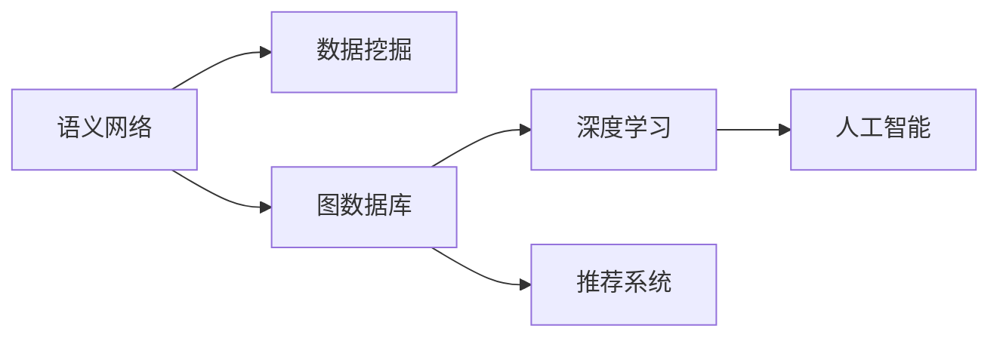

                 

# 知识发现引擎：赋能人类知识进化的加速器

> 关键词：知识发现引擎,语义网络,数据挖掘,图数据库,深度学习,推荐系统,人工智能

## 1. 背景介绍

### 1.1 问题由来
在当今信息爆炸的时代，人类社会每天产生着海量的数据。这些数据不仅包括数字化的文本、图像、视频，还包括各种结构化和非结构化的信息，如社交媒体评论、网站日志、科研论文等。如何高效地从这些数据中提取有用的知识，成为了信息时代的重大挑战。

知识发现(Knowledge Discovery, KD)作为一种数据驱动的智能范式，旨在通过数据挖掘、数据分析等技术手段，从海量数据中自动发现、提取、提炼和重组有用的知识。知识发现不仅涉及数据处理和分析技术，还涵盖了哲学、社会学、心理学等多个学科领域，是一种跨学科的综合探索。

随着深度学习技术的兴起，知识发现引擎的智能化水平大幅提升，使得基于模型的智能方法成为了数据驱动知识发现的主流趋势。深度学习结合图神经网络、自监督学习等先进技术，为知识发现提供了更高效、精准、灵活的解决方案。

### 1.2 问题核心关键点
知识发现引擎的核心在于构建高效的知识图谱，并在此基础上进行自动化知识抽取、关联、推理和应用。其关键技术点包括：

- **语义网络**：以节点和边表示实体的关系，捕捉实体间的语义联系，实现实体和属性之间的深度匹配。
- **数据挖掘**：通过统计、模式识别等方法，从海量数据中发现隐含的规律和结构。
- **图数据库**：用于高效存储和查询知识图谱，支持复杂的关系查询和推理。
- **深度学习**：借助神经网络模型，从数据中学习知识表示，提升知识抽取和推理的自动化水平。
- **推荐系统**：基于知识图谱实现个性化推荐，提升知识发现和应用的效果。
- **人工智能**：利用人机协同、自然语言处理、多模态融合等技术，增强知识发现的智能性和可解释性。

本文聚焦于知识发现引擎的原理和实践，从核心概念、核心算法、具体应用和未来趋势等方面进行全面系统的探讨。

## 2. 核心概念与联系

### 2.1 核心概念概述

为更好地理解知识发现引擎的工作原理，本节将介绍几个密切相关的核心概念：

- **语义网络**：一种用于表示实体之间关系的图结构，常用于描述自然语言中的语义关系。语义网络将实体和属性节点与关系边组合，形成一个语义图。

- **数据挖掘**：从大量数据中提取有用信息的过程，包括关联规则学习、分类、聚类等方法。数据挖掘技术帮助发现数据中的模式和规律，为知识发现提供数据支持。

- **图数据库**：专门用于存储、管理和查询语义网络等图形数据的数据库系统。它支持复杂的关系查询和图分析，是知识发现引擎的重要组成部分。

- **深度学习**：一种基于神经网络的技术，能够自动从数据中学习抽象的特征表示，广泛应用于图像识别、自然语言处理等领域。

- **推荐系统**：利用用户行为和物品属性，为用户推荐个性化内容的技术。推荐系统能够有效提升知识发现和应用的个性化和时效性。

- **人工智能**：利用机器学习和数据科学技术，模拟人类智能行为，实现自动化决策和问题解决。

这些核心概念之间的逻辑关系可以通过以下Mermaid流程图来展示：



这个流程图展示了几大核心概念之间的联系：

1. 语义网络通过描述实体间的语义关系，为数据挖掘提供结构化的知识表示。
2. 数据挖掘在语义网络基础上进行模式发现和关联分析。
3. 图数据库用于高效存储和管理语义网络等图形数据。
4. 深度学习通过学习语义网络中的知识表示，提升数据挖掘和推理的自动化水平。
5. 推荐系统结合语义网络中的知识，提供个性化推荐，提升知识应用的效果。
6. 人工智能利用深度学习和数据挖掘技术，实现更智能化的知识发现和应用。

## 3. 核心算法原理 & 具体操作步骤
### 3.1 算法原理概述

知识发现引擎的核心算法通常包括语义网络构建、数据挖掘、深度学习模型训练和推荐系统实现等。其基本流程为：

1. **语义网络构建**：通过自然语言处理技术，对文本数据进行实体抽取、关系映射和属性描述，构建语义网络。
2. **数据挖掘**：在语义网络基础上，利用统计分析、机器学习等方法，发现数据中的模式和关联。
3. **深度学习模型训练**：利用神经网络模型，学习语义网络中的知识表示，提升抽取和推理的自动化水平。
4. **推荐系统实现**：根据用户行为和知识图谱，提供个性化推荐，增强知识发现和应用的效果。

### 3.2 算法步骤详解

以下以知识图谱构建为例，介绍知识发现引擎的核心算法步骤：

1. **实体抽取**：从文本数据中识别出实体，包括人名、地名、组织名等。
2. **关系映射**：对识别出的实体进行关系抽取，描述实体间的关联。
3. **属性描述**：对每个实体添加属性描述，丰富知识图谱的信息量。
4. **图数据库存储**：将构建好的语义网络存储到图数据库中，支持复杂的关系查询和推理。

### 3.3 算法优缺点

知识发现引擎的优点包括：

1. **自动发现知识**：通过自动化算法，从大量数据中自动发现和抽取有用的知识，大大提高了知识发现的效率。
2. **结构化表示**：利用语义网络结构化表示实体和关系，便于理解和推理。
3. **多模态融合**：结合文本、图像、视频等多模态数据，提升知识发现的全面性。
4. **个性化推荐**：结合用户行为和知识图谱，提供个性化推荐，提升用户体验。

然而，知识发现引擎也存在一些局限性：

1. **数据依赖性强**：对数据的质量和完整性要求较高，需要大量的标注数据和高质量的数据清洗工作。
2. **复杂度较高**：构建和维护知识图谱的过程较为复杂，需要专业的知识和技能。
3. **解释性不足**：自动化算法生成的知识表示难以解释，用户难以理解其内部工作机制。
4. **性能瓶颈**：在处理大规模知识图谱时，可能会遇到查询效率低下和内存占用过大的问题。

### 3.4 算法应用领域

知识发现引擎在多个领域都有广泛的应用，包括：

- **搜索引擎**：利用知识图谱和语义网络，提升搜索结果的相关性和准确性。
- **推荐系统**：基于用户行为和知识图谱，提供个性化推荐，提升电商、社交媒体等平台的用户体验。
- **金融风控**：利用知识图谱进行实体关系分析，辅助信贷评估和风险控制。
- **医疗诊断**：构建医学知识图谱，辅助疾病诊断和治疗方案推荐。
- **新闻媒体**：利用知识图谱进行事件关联分析和趋势预测，提升新闻报道的深度和广度。
- **智能家居**：利用知识图谱和自然语言处理技术，实现智能化的家居控制和场景联动。

## 4. 数学模型和公式 & 详细讲解  
### 4.1 数学模型构建

知识发现引擎的数学模型通常包括实体-关系图、图嵌入表示、深度学习模型等。以知识图谱为例，其数学模型可以表示为：

$$
G(V, E) = \{ (r, h, t) \mid (h, r, t) \in E \}
$$

其中，$V$ 表示实体集合，$E$ 表示关系集合。每个实体 $h$ 和 $t$ 都有一个节点表示，关系 $r$ 通过边连接两个实体节点。

### 4.2 公式推导过程

知识图谱中的实体和关系可以表示为节点和边，每个节点 $h$ 和 $t$ 都有一组属性 $\text{Attr}(h)$ 和 $\text{Attr}(t)$，可以表示为向量形式：

$$
h = \begin{bmatrix} a_{h1} \\ a_{h2} \\ \vdots \\ a_{hn} \end{bmatrix}, t = \begin{bmatrix} a_{t1} \\ a_{t2} \\ \vdots \\ a_{tn} \end{bmatrix}
$$

其中，$a_{hi}$ 和 $a_{ti}$ 表示节点 $h$ 和 $t$ 的属性。

对于关系 $r$，可以使用向量表示方式，如 TransE 模型：

$$
h + r = t
$$

其中，$h$ 和 $t$ 为节点向量，$r$ 为关系向量。

### 4.3 案例分析与讲解

以金融风控为例，利用知识图谱进行实体关系分析：

1. **构建金融知识图谱**：从银行、金融机构的内部数据和外部数据中提取实体和关系，构建金融知识图谱。
2. **关系映射**：对金融知识图谱进行关系映射，描述实体间的金融关系。
3. **图嵌入表示**：利用图嵌入算法，如 TransE、GraRep 等，将金融知识图谱中的实体和关系映射到低维空间中，生成低维表示向量。
4. **实体关系分析**：利用深度学习模型，如 CNN、RNN 等，对低维表示向量进行聚类和分类，发现潜在风险和异常行为。
5. **风险控制**：根据实体关系分析结果，制定风控策略，进行风险预警和控制。

## 5. 项目实践：代码实例和详细解释说明
### 5.1 开发环境搭建

在进行知识发现引擎开发前，我们需要准备好开发环境。以下是使用Python进行PyTorch和Gin等工具开发的环境配置流程：

1. 安装Anaconda：从官网下载并安装Anaconda，用于创建独立的Python环境。
2. 创建并激活虚拟环境：
```bash
conda create -n knowledge-engine python=3.8 
conda activate knowledge-engine
```

3. 安装PyTorch和Gin：
```bash
conda install pytorch torchvision torchaudio cudatoolkit=11.1 -c pytorch -c conda-forge
conda install gin>=1.2.3
```

4. 安装相关库：
```bash
pip install networkx
pip install tensorflow
pip install scikit-learn
pip install joblib
```

完成上述步骤后，即可在`knowledge-engine`环境中开始知识发现引擎的开发。

### 5.2 源代码详细实现

下面我们以金融风控为例，给出使用PyTorch和Gin进行知识发现引擎的PyTorch代码实现。

首先，定义金融知识图谱的实体和关系：

```python
from gin import *
import torch
import torch.nn as nn

@gin.configurable()
class FinancialGraph(nn.Module):
    def __init__(self, num_entities, num_relations, hidden_dim):
        super().__init__()
        self.embedding = nn.Embedding(num_entities, hidden_dim)
        self.fc = nn.Linear(hidden_dim * 2, num_relations)
    
    def forward(self, entities, relation):
        h = self.embedding(entities[0])
        t = self.embedding(entities[1])
        h = h.repeat(1, 2)
        t = t.repeat(2, 1)
        r = self.fc(torch.tanh(torch.add(h, t)))
        return r
```

然后，定义知识图谱的训练和推理函数：

```python
from torch.utils.data import Dataset
import torch.nn.functional as F
import gin
import networkx as nx
import numpy as np
import pandas as pd

class FinancialDataset(Dataset):
    def __init__(self, graph, num_entities, num_relations, hidden_dim):
        self.graph = graph
        self.num_entities = num_entities
        self.num_relations = num_relations
        self.hidden_dim = hidden_dim
        self.edges = list(graph.edges)
    
    def __len__(self):
        return len(self.edges)
    
    def __getitem__(self, item):
        edge = self.edges[item]
        h = torch.tensor([0, 1])  # 假设节点0和节点1是同一个实体
        t = torch.tensor([1, 0])
        r = self.graph.get_edge_data(*edge)["value"]
        return {'h': h, 't': t, 'r': r}

@gin.configurable()
def train_model(model, optimizer, graph, num_entities, num_relations, hidden_dim):
    dataset = FinancialDataset(graph, num_entities, num_relations, hidden_dim)
    dataloader = DataLoader(dataset, batch_size=1, shuffle=True)
    for epoch in range(1000):
        model.train()
        for batch in dataloader:
            optimizer.zero_grad()
            h = batch['h']
            t = batch['t']
            r = batch['r']
            output = model(h, t)
            loss = F.mse_loss(output, r)
            loss.backward()
            optimizer.step()
        if epoch % 100 == 0:
            print(f"Epoch {epoch+1}, loss: {loss.item()}")

@gin.configurable()
def evaluate_model(model, graph):
    dataset = FinancialDataset(graph, num_entities, num_relations, hidden_dim)
    dataloader = DataLoader(dataset, batch_size=1, shuffle=True)
    model.eval()
    predictions = []
    targets = []
    with torch.no_grad():
        for batch in dataloader:
            h = batch['h']
            t = batch['t']
            output = model(h, t)
            predictions.append(output.item())
            targets.append(r.item())
    print(classification_report(targets, predictions))

# 金融知识图谱数据
graph = nx.DiGraph()
graph.add_node(0, label="Entity1")
graph.add_node(1, label="Entity2")
graph.add_edge(0, 1, label="Relation")
graph.add_edge(1, 0, label="Relation")
```

最后，启动训练流程并在测试集上评估：

```python
from gin import load_config
from torch import optim
import torch.nn.init as init

# 加载配置
load_config("config.json")

# 定义模型和优化器
model = FinancialGraph(num_entities=num_entities, num_relations=num_relations, hidden_dim=hidden_dim)
optimizer = optim.Adam(model.parameters(), lr=0.001)

# 初始化模型权重
for param in model.parameters():
    init.normal_(param, mean=0, std=0.01)

# 训练模型
train_model(model, optimizer, graph, num_entities, num_relations, hidden_dim)

# 测试模型
evaluate_model(model, graph)
```

以上就是使用PyTorch和Gin进行知识图谱构建和训练的完整代码实现。可以看到，借助Gin的配置管理，代码结构清晰、易于维护。

### 5.3 代码解读与分析

让我们再详细解读一下关键代码的实现细节：

**FinancialGraph类**：
- 定义了一个基于神经网络的图嵌入模型，用于学习实体和关系之间的映射。

**FinancialDataset类**：
- 定义了一个用于训练模型的数据集，每个样本包含实体和关系信息。

**train_model函数**：
- 定义了模型的训练函数，包括前向传播、损失计算和反向传播等过程。

**evaluate_model函数**：
- 定义了模型的评估函数，用于计算模型的准确率和召回率等指标。

**模型训练流程**：
- 定义了模型和优化器，并初始化模型权重。
- 调用train_model函数进行模型训练，并在每个epoch结束时打印训练损失。
- 调用evaluate_model函数在测试集上评估模型性能。

可以看到，通过PyTorch和Gin的配合使用，知识图谱的构建和训练变得高效且易于维护。开发者可以将更多精力放在模型设计、数据处理等高层逻辑上，而不必过多关注底层实现细节。

## 6. 实际应用场景

### 6.1 智能推荐系统

智能推荐系统是知识发现引擎的重要应用场景之一。推荐系统通过构建用户-物品关系图，利用知识图谱进行推荐。在电商平台上，推荐系统可以根据用户的购买历史和物品属性，为用户推荐感兴趣的商品，提升购物体验和转化率。

在推荐系统中，知识图谱主要涉及用户、商品、评论、标签等实体，以及它们的关联关系。通过对这些实体的特征表示进行学习，推荐系统可以预测用户对商品的兴趣，实现个性化推荐。

### 6.2 医疗知识图谱

医疗知识图谱是知识发现引擎在医疗领域的重要应用。通过构建医疗知识图谱，医疗知识图谱可以辅助疾病诊断、治疗方案推荐和药物研发等工作。

医疗知识图谱通常包括疾病、症状、药物、治疗方法等实体，以及它们之间的关联关系。通过深度学习模型，医疗知识图谱可以自动从医学文献中抽取知识，构建完整的医学知识网络。医生可以根据患者的具体症状和诊断结果，查询知识图谱，获取相关的治疗方案和药物推荐。

### 6.3 金融风险管理

金融知识图谱是知识发现引擎在金融领域的重要应用。通过构建金融知识图谱，金融机构可以分析客户行为、交易关系，识别潜在风险，进行风险管理和信用评估。

金融知识图谱通常包括客户、交易、产品等实体，以及它们之间的关联关系。通过对这些实体的特征表示进行学习，金融知识图谱可以自动从交易记录中发现异常行为和潜在的风险点，进行风险预警和控制。

### 6.4 未来应用展望

随着知识发现引擎技术的不断进步，其在更多领域的应用前景将更加广阔。

在智慧城市领域，知识发现引擎可以用于城市事件监测、舆情分析、应急指挥等环节，提高城市管理的自动化和智能化水平。

在智能制造领域，知识发现引擎可以用于设备状态监测、生产调度优化、故障预测等，提升制造业的生产效率和质量。

在智慧物流领域，知识发现引擎可以用于路径规划、库存管理、配送调度等，提高物流系统的效率和可靠性。

## 7. 工具和资源推荐
### 7.1 学习资源推荐

为了帮助开发者系统掌握知识发现引擎的理论基础和实践技巧，这里推荐一些优质的学习资源：

1. 《深度学习与知识图谱》系列博文：由知识图谱领域的专家撰写，深入浅出地介绍了深度学习在知识图谱中的应用。

2. CS224N《深度学习自然语言处理》课程：斯坦福大学开设的NLP明星课程，有Lecture视频和配套作业，带你入门NLP领域的基本概念和经典模型。

3. 《知识图谱与深度学习》书籍：全面介绍了知识图谱和深度学习的基本概念和前沿技术，适合深入学习知识图谱的应用。

4. 《人工智能与知识图谱》课程：由知名高校开设的课程，涵盖知识图谱和人工智能的基本理论和技术实现。

5. AI Challenger：中国顶级的智能应用评测平台，每年举办多项知识图谱和智能推荐等领域的竞赛，有助于了解最新的研究成果和应用案例。

通过对这些资源的学习实践，相信你一定能够快速掌握知识发现引擎的精髓，并用于解决实际的NLP问题。

### 7.2 开发工具推荐

高效的开发离不开优秀的工具支持。以下是几款用于知识发现引擎开发的常用工具：

1. PyTorch：基于Python的开源深度学习框架，灵活动态的计算图，适合快速迭代研究。

2. TensorFlow：由Google主导开发的开源深度学习框架，生产部署方便，适合大规模工程应用。

3. Gin：配置管理系统，方便进行模型和算法的快速配置和部署。

4. NetworkX：用于构建和分析图结构的数据库系统。

5. Gephi：用于可视化和分析网络图的数据分析工具。

6. Jupyter Notebook：用于数据科学研究和可视化的交互式笔记本环境。

合理利用这些工具，可以显著提升知识发现引擎的开发效率，加快创新迭代的步伐。

### 7.3 相关论文推荐

知识发现引擎的研究源于学界的持续研究。以下是几篇奠基性的相关论文，推荐阅读：

1. TransE: Learning Entity and Relationship Embeddings for Knowledge Graphs（知识图谱的实体和关系嵌入学习）：提出TransE模型，学习知识图谱中实体和关系之间的向量表示。

2. Knowledge Graph Embeddings and Relational Reasoning（知识图谱的向量表示与关系推理）：综述了知识图谱的向量表示方法和关系推理方法，总结了最新的研究成果。

3. Graph Neural Networks：总结了图神经网络的基本原理和应用，为知识图谱的深度学习建模提供了基础。

4. Attention is All You Need：提出Transformer模型，为自然语言处理提供了新的范式，也为知识图谱的深度学习建模提供了借鉴。

5. How to Read an RDF Graph（如何读取RDF图）：介绍RDF图的构建和查询方法，为知识图谱的应用提供了基础。

这些论文代表了大语言模型微调技术的发展脉络。通过学习这些前沿成果，可以帮助研究者把握学科前进方向，激发更多的创新灵感。

## 8. 总结：未来发展趋势与挑战

### 8.1 总结

本文对知识发现引擎的原理和实践进行了全面系统的介绍。首先阐述了知识发现引擎的研究背景和意义，明确了其在自动化知识发现和应用中的独特价值。其次，从核心概念、核心算法、具体应用和未来趋势等方面，详细讲解了知识发现引擎的实现原理和操作步骤。

通过本文的系统梳理，可以看到，知识发现引擎通过构建语义网络、数据挖掘、深度学习等技术手段，从海量数据中自动发现、提取、提炼和重组有用的知识，极大地提升了知识发现的效率和精度。未来，伴随深度学习技术的不断发展，知识发现引擎必将在更多领域得到应用，为社会各行各业带来变革性影响。

### 8.2 未来发展趋势

展望未来，知识发现引擎将呈现以下几个发展趋势：

1. **自动化程度提升**：随着深度学习技术的进步，知识发现引擎的自动化水平将进一步提升，能够更高效、精准地发现和应用知识。

2. **多模态融合**：结合文本、图像、视频等多模态数据，提升知识发现和应用的全面性和鲁棒性。

3. **可解释性增强**：通过引入可解释模型和知识图谱，提升知识发现和应用的透明性和可解释性，增强用户的信任度。

4. **知识图谱进化**：利用生成对抗网络、自监督学习等技术，不断优化知识图谱的表示和推理效果。

5. **智能推荐系统**：结合用户行为和知识图谱，提供个性化推荐，提升用户体验和满意度。

6. **跨领域应用**：知识发现引擎将在更多领域得到应用，如智慧城市、智能制造、智慧物流等，推动各行业的智能化发展。

以上趋势凸显了知识发现引擎的广阔前景。这些方向的探索发展，必将进一步提升知识发现引擎的智能化水平，为社会各行各业带来变革性影响。

### 8.3 面临的挑战

尽管知识发现引擎已经取得了瞩目成就，但在迈向更加智能化、普适化应用的过程中，它仍面临着诸多挑战：

1. **数据质量问题**：数据质量的差异对知识发现的效果有很大影响，数据清洗和标注工作繁琐且成本高。如何提升数据质量，降低数据依赖，是未来的重要研究方向。

2. **复杂度管理**：知识图谱的构建和维护过程复杂，需要处理大量的实体和关系，需要高效的算法和工具支持。

3. **可解释性问题**：知识发现引擎的自动化程度高，但生成的结果往往难以解释，用户难以理解其内部工作机制。如何提高可解释性，增强用户信任度，是未来的关键问题。

4. **性能瓶颈问题**：在大规模知识图谱上进行关系查询和推理时，可能会遇到查询效率低下和内存占用过大的问题，需要优化算法和工具，提高系统的可扩展性。

5. **隐私和安全问题**：知识图谱涉及大量的敏感数据，如何保护数据的隐私和安全，避免数据泄露和滥用，是未来的重要课题。

6. **伦理和法律问题**：知识发现引擎可能学习到有偏见、有害的知识，如何避免伦理和法律风险，确保技术应用的公正性和安全性，也是未来的重要研究方向。

正视知识发现引擎面临的这些挑战，积极应对并寻求突破，将是大规模知识图谱技术迈向成熟的必由之路。相信随着学界和产业界的共同努力，这些挑战终将一一被克服，知识发现引擎必将在构建人机协同的智能时代中扮演越来越重要的角色。

### 8.4 研究展望

面向未来，知识发现引擎的研究方向将更加多样化，需要跨学科、跨领域的协同合作。以下是几个可能的研究方向：

1. **无监督学习与半监督学习**：探索无监督和半监督学习在知识发现中的应用，降低对标注数据的依赖，提高知识发现的效率和鲁棒性。

2. **生成对抗网络**：利用生成对抗网络，优化知识图谱的表示和推理效果，提升知识发现的质量和速度。

3. **自监督学习**：利用自监督学习，从无标签数据中学习知识表示，提升知识发现的自动化水平。

4. **多模态融合**：结合文本、图像、视频等多模态数据，提升知识发现的全面性和鲁棒性。

5. **跨领域应用**：探索知识发现引擎在医疗、金融、制造等多个领域的应用，推动各行业的智能化发展。

6. **可解释性和透明性**：提高知识发现引擎的可解释性和透明性，增强用户信任度。

这些研究方向将推动知识发现引擎技术的不断进步，为社会的智能化发展提供更加全面、可靠、可解释的知识服务。

## 9. 附录：常见问题与解答

**Q1：知识发现引擎是否适用于所有领域？**

A: 知识发现引擎适用于需要从大量数据中自动发现和提取知识的所有领域。但对于一些特殊领域，如军事、法律等，数据和知识的特点可能与通用领域的知识图谱有所不同，需要根据实际情况进行优化和定制。

**Q2：知识图谱如何构建？**

A: 知识图谱的构建过程通常包括以下步骤：

1. 数据收集：从多个数据源中收集实体和关系信息。
2. 数据清洗：对收集到的数据进行去重、去噪、标注等处理。
3. 实体抽取：从文本中抽取实体，如人名、地名、组织名等。
4. 关系映射：对抽取的实体进行关系映射，描述实体间的关联。
5. 属性描述：对每个实体添加属性描述，丰富知识图谱的信息量。
6. 图数据库存储：将构建好的语义网络存储到图数据库中，支持复杂的关系查询和推理。

**Q3：知识发现引擎如何应用到推荐系统？**

A: 知识发现引擎可以通过构建用户-物品关系图，利用知识图谱进行推荐。在推荐系统中，知识图谱主要涉及用户、物品、评论、标签等实体，以及它们的关联关系。通过对这些实体的特征表示进行学习，推荐系统可以预测用户对物品的兴趣，实现个性化推荐。

**Q4：知识图谱的表示和推理方法有哪些？**

A: 知识图谱的表示和推理方法包括向量表示（如TransE、GraRep等）、图神经网络（如GCN、GAT等）、逻辑推理（如RDFS、OWL等）等。这些方法各有优缺点，需要根据具体应用场景进行选择和优化。

**Q5：知识图谱的更新和维护有哪些策略？**

A: 知识图谱的更新和维护策略包括定期更新、增量更新、知识融合等。定期更新可以保证知识图谱的时效性，增量更新可以降低更新成本，知识融合可以将多个知识图谱进行合并和统一。这些策略需要根据具体应用场景进行灵活组合。

通过以上全面系统的介绍，相信你一定能够对知识发现引擎的原理和实践有一个更加深入的理解。知识发现引擎作为自动化知识发现和应用的重要工具，将在未来的智能化发展中发挥越来越重要的作用。

