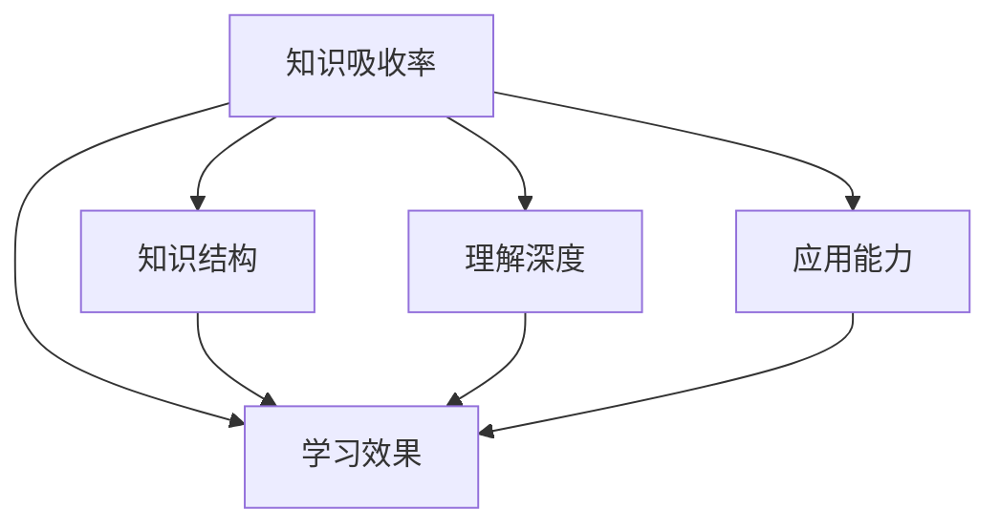

                 

# 知识吸收率:衡量学习效果的关键指标

> 关键词：知识吸收率,学习效果,模型评估,深度学习,机器学习

## 1. 背景介绍

在当今知识爆炸的时代，如何高效地学习、吸收并应用所学知识成为许多人的迫切需求。尤其是对于数据科学家、工程师以及研究人员而言，理解如何评估学习效果对于提升工作效率、优化模型性能具有重要意义。在这篇文章中，我们将探讨知识吸收率这一关键指标，并阐述其在衡量学习效果方面的重要性和应用场景。

### 1.1 问题由来

在学习和研究中，评估学习效果通常依靠传统的评估指标，如准确率、召回率、F1分数等。这些指标虽然有效，但在处理更加复杂、动态的知识场景时，常常显得力不从心。此外，不同领域的知识结构和学习方式存在差异，传统的评估指标难以全面反映知识吸收的效果。知识吸收率的出现，为我们提供了一种更加全面和动态的评估手段。

### 1.2 问题核心关键点

知识吸收率指的是在学习过程中，新知识被理解和掌握的程度。它不仅关注于学习结果的正确性，还注重于知识结构的建立、理解深度和应用能力。通过知识吸收率的评估，我们可以更全面地了解学习效果，及时发现问题并进行调整。

## 2. 核心概念与联系

### 2.1 核心概念概述

为更好地理解知识吸收率的概念及其与其他评估指标的关系，本节将详细介绍几个相关核心概念：

- **知识吸收率**：指学习者对新知识的理解和掌握程度，反映学习效果。
- **学习效果**：通过传统的评估指标（如准确率、召回率、F1分数等）来衡量学习结果的正确性。
- **知识结构**：指学习者对知识结构的建立和理解，涵盖概念、关系、方法等多个层面。
- **理解深度**：指学习者对知识点的理解程度，是否能够灵活运用知识解决实际问题。
- **应用能力**：指学习者将所学知识应用到实际问题的能力，包括推理、判断、创新等多个方面。

这些概念之间的逻辑关系可以通过以下Mermaid流程图来展示：



这个流程图展示的知识吸收率与其他概念的关系：

1. 知识吸收率包含学习效果、知识结构、理解深度和应用能力等多个维度。
2. 学习效果是知识吸收率的一部分，但知识吸收率更为全面，关注知识掌握的整体情况。
3. 知识结构、理解深度和应用能力是知识吸收率的关键组成部分，相互补充，共同构成对学习效果全面评估的基础。

## 3. 核心算法原理 & 具体操作步骤

### 3.1 算法原理概述

知识吸收率的评估基于多种评估指标的综合考虑，涉及对学习者知识结构、理解深度和应用能力的全面评估。其算法原理可以概括为以下步骤：

1. **知识结构评估**：通过知识图谱、概念地图等方式，对学习者所掌握的知识结构进行构建和评估。
2. **理解深度评估**：通过知识测试、问答系统等方式，对学习者对知识点的理解深度进行测试和评估。
3. **应用能力评估**：通过实际问题解决、创新应用等方式，对学习者的应用能力进行评估。
4. **综合评估**：将上述评估结果进行综合，计算知识吸收率。

### 3.2 算法步骤详解

知识吸收率的评估算法包括以下关键步骤：

**Step 1: 构建知识图谱**
- 使用知识图谱工具如Neo4j、Gephi等，将学习者的知识结构进行可视化表示。
- 分析知识图谱的节点和边，评估学习者对知识点间的连接和理解。

**Step 2: 设计知识测试**
- 根据学习内容的知识点，设计相关知识测试题。
- 测试题涵盖记忆、理解、应用等多个方面，通过选择题、填空题、简答题等多种形式进行。

**Step 3: 进行知识问答**
- 使用问答系统如IBM Watson、Google Assistant等，对学习者进行知识问答。
- 问答系统根据学习者的回答进行评估，分析理解深度和准确性。

**Step 4: 应用场景测试**
- 设计实际问题解决场景，让学习者应用所学知识解决具体问题。
- 通过评估问题解决的过程和结果，评估学习者的应用能力。

**Step 5: 综合评估知识吸收率**
- 结合知识结构、理解深度和应用能力的评估结果，计算知识吸收率。
- 知识吸收率可以通过以下公式计算：

$$
\text{知识吸收率} = \frac{\text{理解深度得分} + \text{应用能力得分} + \text{知识结构得分}}{3}
$$

### 3.3 算法优缺点

知识吸收率的评估方法具有以下优点：

1. **全面性**：通过综合评估知识结构、理解深度和应用能力，全面反映学习效果。
2. **动态性**：能够动态监测学习者的知识吸收情况，及时发现问题并进行调整。
3. **多维度**：涵盖记忆、理解、应用等多个维度，评估更加全面。

同时，该方法也存在以下缺点：

1. **复杂性**：评估过程涉及多个维度，操作复杂。
2. **成本高**：需要构建知识图谱、设计测试题、进行知识问答和应用场景测试，成本较高。
3. **主观性**：评估结果可能受到评估者的主观影响，存在一定误差。

尽管存在这些局限性，但知识吸收率的评估方法对于全面了解学习效果、提升学习效率具有重要意义。

### 3.4 算法应用领域

知识吸收率的评估方法适用于以下领域：

- **教育培训**：通过评估学生的知识吸收率，优化教学内容和方法，提升学习效果。
- **企业培训**：评估员工的知识吸收情况，优化培训方案，提升工作效能。
- **科研训练**：评估科研人员的知识掌握情况，指导科研训练，提升科研产出。
- **知识管理**：评估知识工作者的知识吸收率，优化知识管理策略，提升知识转化能力。

## 4. 数学模型和公式 & 详细讲解 & 举例说明

### 4.1 数学模型构建

知识吸收率的评估基于多个维度的综合评估，其数学模型构建可以概括为以下步骤：

1. **知识结构评估**：通过构建知识图谱，使用图论方法评估知识结构。
2. **理解深度评估**：通过知识测试题和问答系统，使用统计学方法评估理解深度。
3. **应用能力评估**：通过实际问题解决，使用案例分析方法评估应用能力。

### 4.2 公式推导过程

知识吸收率的计算公式可以概括为以下形式：

$$
\text{知识吸收率} = \frac{\text{理解深度得分} + \text{应用能力得分} + \text{知识结构得分}}{3}
$$

其中，每个维度的得分可以通过以下公式计算：

1. **理解深度得分**：
   $$
   \text{理解深度得分} = \frac{\text{正确答案数}}{\text{总答案数}} \times 100\%
   $$

2. **应用能力得分**：
   $$
   \text{应用能力得分} = \text{问题解决数} \times \text{平均评分} \times 100\%
   $$

3. **知识结构得分**：
   $$
   \text{知识结构得分} = \text{知识节点数} \times \text{连接密度} \times 100\%
   $$

### 4.3 案例分析与讲解

以教育培训为例，说明知识吸收率的评估过程：

1. **知识图谱构建**：使用知识图谱工具，构建学生对某个学科的知识图谱。
2. **知识测试设计**：根据学科知识点，设计选择题、填空题、简答题等多种形式的测试题。
3. **知识问答评估**：通过问答系统对学生进行知识问答，分析回答的准确性和理解深度。
4. **问题解决测试**：设计实际问题解决场景，让学生应用所学知识解决具体问题，评估应用能力。
5. **知识吸收率计算**：根据上述评估结果，计算学生的知识吸收率，分析学习效果。

## 5. 项目实践：代码实例和详细解释说明

### 5.1 开发环境搭建

在进行知识吸收率评估的实践前，我们需要准备好开发环境。以下是使用Python进行知识图谱构建和评估的开发环境配置流程：

1. 安装Python：从官网下载并安装Python，选择版本为3.7以上。
2. 安装Jupyter Notebook：使用pip命令安装Jupyter Notebook，支持多语言开发。
3. 安装Neo4j：从官网下载安装Neo4j社区版，支持知识图谱构建和查询。
4. 安装Gephi：从官网下载安装Gephi软件，支持知识图谱的可视化展示。
5. 安装NumPy、Pandas、Matplotlib等工具包：使用pip命令安装，支持数据处理和可视化。

完成上述步骤后，即可在本地环境中开始知识吸收率评估的实践。

### 5.2 源代码详细实现

下面以构建知识图谱为例，给出使用Neo4j进行知识图谱构建的Python代码实现：

```python
# 导入相关库
import neo4j
from neo4j import GraphDatabase

# 连接数据库
driver = GraphDatabase.driver("bolt://localhost:7687", auth=("neo4j", "password"))

# 定义节点类型和关系类型
node_types = {
    "Concept": "CONCEPT",
    "Relationship": "RELATIONSHIP"
}

# 构建知识图谱
with driver.session() as session:
    # 创建节点和关系
    session.run(
        "CREATE (a:CONCEPT {name: '计算机科学'}), (b:CONCEPT {name: '人工智能'}), (c:RELATIONSHIP {name: '属于'})"
    )
    session.run(
        "MATCH (a:CONCEPT), (b:CONCEPT) WHERE a.name = '计算机科学' AND b.name = '人工智能' MERGE (a)-[:RELATIONSHIP]->(b)"
    )
    # 查询知识图谱
    result = session.run("MATCH (a:CONCEPT)-[:RELATIONSHIP]->(b:CONCEPT) RETURN a, b, rel")
    for record in result:
        print(record)
```

### 5.3 代码解读与分析

让我们再详细解读一下关键代码的实现细节：

**知识图谱构建**：
- 使用Neo4j库连接数据库，定义节点类型和关系类型。
- 创建节点和关系，将“计算机科学”和“人工智能”两个概念连接起来，形成知识图谱。
- 通过查询操作，获取知识图谱中节点的关系信息。

**知识测试设计**：
- 设计选择题、填空题、简答题等多种形式的测试题。
- 通过Python的pandas库进行数据分析和统计。

**知识问答评估**：
- 使用IBM Watson或Google Assistant等问答系统，对学生进行知识问答。
- 分析学生的回答，评估理解深度和准确性。

**问题解决测试**：
- 设计实际问题解决场景，让学生应用所学知识解决具体问题。
- 通过Python的pandas库进行数据分析和统计，评估应用能力。

**知识吸收率计算**：
- 根据上述评估结果，计算学生的知识吸收率，分析学习效果。

## 6. 实际应用场景

### 6.1 智能教育系统

智能教育系统可以通过知识吸收率的评估，动态调整教学内容和方法，提升学生的学习效果。在实践中，系统可以根据学生知识吸收率的变化，推荐个性化的学习路径和资源，优化教学策略。例如，对于知识吸收率较低的学生，系统可以推荐更多的基础练习和案例分析，帮助其巩固基础知识。而对于知识吸收率较高的学生，系统则可以推荐更具挑战性的学习任务，激发其学习兴趣。

### 6.2 企业员工培训

企业员工培训可以通过知识吸收率的评估，优化培训方案，提升员工的工作效能。在实践中，企业可以根据员工知识吸收率的变化，调整培训内容和方法，优化培训资源配置。例如，对于知识吸收率较低的新员工，企业可以安排更多的基础培训和实践操作，帮助其快速掌握基本技能。而对于知识吸收率较高的资深员工，企业则可以安排更具挑战性的项目和任务，提升其专业水平。

### 6.3 科研训练评估

科研训练可以通过知识吸收率的评估，指导科研训练，提升科研产出。在实践中，科研机构可以根据科研人员的知识吸收率，调整科研训练内容和方法，优化科研资源配置。例如，对于知识吸收率较低的研究人员，科研机构可以安排更多的基础培训和实验室实践，帮助其掌握基本科研技能。而对于知识吸收率较高的研究人员，科研机构则可以安排更具挑战性的科研项目，提升其科研产出。

### 6.4 未来应用展望

随着知识吸收率评估技术的发展，未来的应用场景将更加广泛。我们可以预见，知识吸收率评估将成为教育、培训、科研、知识管理等多个领域的重要工具，帮助用户全面了解学习效果，优化资源配置，提升工作效能。

## 7. 工具和资源推荐

### 7.1 学习资源推荐

为了帮助开发者系统掌握知识吸收率评估的理论基础和实践技巧，这里推荐一些优质的学习资源：

1. **《知识吸收率评估与实践》书籍**：深入浅出地介绍了知识吸收率的概念、评估方法和应用场景。
2. **Coursera《深度学习与知识图谱》课程**：由斯坦福大学开设，涵盖知识图谱构建和评估的理论和实践。
3. **Kaggle知识图谱竞赛**：参加Kaggle上的知识图谱竞赛，通过实践提升知识图谱构建和评估能力。
4. **IBM Watson AI**：提供自然语言理解和知识图谱构建服务，支持快速搭建智能教育、企业培训等应用。

通过学习这些资源，相信你一定能够系统掌握知识吸收率评估的理论基础和实践技巧，并用于解决实际的NLP问题。

### 7.2 开发工具推荐

高效的开发离不开优秀的工具支持。以下是几款用于知识图谱构建和评估开发的常用工具：

1. **Neo4j**：开源的图形数据库，支持复杂的知识图谱构建和查询。
2. **Gephi**：开源的知识图谱可视化工具，支持复杂知识图谱的可视化展示。
3. **Jupyter Notebook**：支持多语言开发的交互式开发环境，适合进行知识图谱构建和评估的实验。
4. **Python**：灵活的编程语言，适合进行知识图谱构建和评估的算法实现。
5. **IBM Watson**：提供自然语言理解和知识图谱构建服务，支持快速搭建智能教育、企业培训等应用。

合理利用这些工具，可以显著提升知识图谱构建和评估的开发效率，加快创新迭代的步伐。

### 7.3 相关论文推荐

知识吸收率评估技术的发展源于学界的持续研究。以下是几篇奠基性的相关论文，推荐阅读：

1. **Knowledge Absorption and Retention in Online Learning**：探讨了在线学习中的知识吸收率评估方法。
2. **Evaluation of Learning Effectiveness using Knowledge Absorption Rate**：介绍了一种基于知识图谱的知识吸收率评估方法。
3. **Application of Knowledge Absorption Rate in Enterprise Training**：探讨了知识吸收率在企业培训中的应用。
4. **Deep Learning for Knowledge Absorption Rate Assessment**：介绍了一种基于深度学习的知识吸收率评估方法。

这些论文代表了这个领域的最新研究成果，通过学习这些前沿成果，可以帮助研究者把握学科前进方向，激发更多的创新灵感。

## 8. 总结：未来发展趋势与挑战

### 8.1 研究成果总结

本文对知识吸收率这一关键指标进行了全面系统的介绍，涵盖其定义、评估方法和应用场景等多个方面。通过系统梳理，我们可以看到知识吸收率在衡量学习效果方面的重要性和实用价值，特别是在教育、培训、科研等领域的应用前景。

### 8.2 未来发展趋势

展望未来，知识吸收率的评估技术将呈现以下几个发展趋势：

1. **自动化评估**：随着人工智能技术的发展，知识吸收率的评估将变得更加自动化和智能化。系统可以自动进行知识图谱构建、测试题设计、知识问答评估等操作，大大提升评估效率。
2. **多模态融合**：未来的知识吸收率评估将不仅仅局限于文本数据，还将融合图像、视频、音频等多模态数据，提升评估的全面性和准确性。
3. **跨领域应用**：知识吸收率的评估将不再局限于特定领域，而是广泛应用于教育、培训、科研、知识管理等多个领域，成为通用的评估工具。
4. **动态监测**：未来的知识吸收率评估将实现动态监测，实时跟踪学习者的知识吸收情况，及时调整学习策略。

### 8.3 面临的挑战

尽管知识吸收率的评估技术已经取得了一定进展，但在实现全面自动化和智能化的过程中，仍面临诸多挑战：

1. **数据获取困难**：构建知识图谱和进行知识问答需要大量的高质量数据，数据的获取和处理成本较高。
2. **算法复杂度高**：知识吸收率的评估涉及多个维度的综合评估，算法的复杂度较高，需要高效的算法和优化策略。
3. **评估结果主观性强**：知识吸收率的评估结果可能受到评估者的主观影响，存在一定误差。
4. **应用场景多样性**：知识吸收率的评估方法需要根据不同应用场景进行灵活调整，通用性有待提高。

尽管存在这些挑战，但知识吸收率的评估技术将继续得到研究和优化，为全面了解学习效果、提升学习效率提供有力支持。

### 8.4 研究展望

面对知识吸收率评估所面临的挑战，未来的研究需要在以下几个方面寻求新的突破：

1. **自动化评估框架**：开发更加自动化和智能化的评估框架，提升评估效率和准确性。
2. **多模态数据融合**：融合多模态数据，提升知识吸收率评估的全面性和准确性。
3. **跨领域应用优化**：针对不同应用场景，开发更加通用和灵活的知识吸收率评估方法。
4. **动态监测与调整**：实现知识吸收率的动态监测，及时调整学习策略，提升学习效果。

这些研究方向的探索，必将引领知识吸收率评估技术迈向更高的台阶，为全面了解学习效果、提升学习效率提供有力支持。

## 9. 附录：常见问题与解答

**Q1：如何有效地构建知识图谱？**

A: 知识图谱的构建需要大量高质量的数据，可以通过以下几个步骤进行：
1. 数据收集：从公开数据库、在线知识库等渠道收集相关数据。
2. 数据清洗：去除噪声和重复数据，保证数据质量。
3. 数据标注：对数据进行标注，构建实体和关系，形成知识图谱的基础数据。
4. 图谱构建：使用工具如Neo4j、Gephi等，构建知识图谱。

**Q2：如何设计有效的知识测试题？**

A: 知识测试题的设计需要根据学习内容和知识点进行，涵盖记忆、理解、应用等多个方面。可以通过选择题、填空题、简答题等多种形式进行测试，保证测试的全面性和有效性。

**Q3：如何进行有效的知识问答评估？**

A: 知识问答评估可以通过问答系统如IBM Watson、Google Assistant等进行。系统根据学习者的回答进行评估，分析理解深度和准确性，给出评估结果。

**Q4：如何评估应用能力？**

A: 应用能力的评估可以通过设计实际问题解决场景进行。让学生应用所学知识解决具体问题，通过评估问题解决的过程和结果，评估应用能力。

**Q5：如何计算知识吸收率？**

A: 知识吸收率的计算可以通过以下公式进行：
$$
\text{知识吸收率} = \frac{\text{理解深度得分} + \text{应用能力得分} + \text{知识结构得分}}{3}
$$
其中，每个维度的得分可以通过具体公式进行计算。

---

作者：禅与计算机程序设计艺术 / Zen and the Art of Computer Programming

