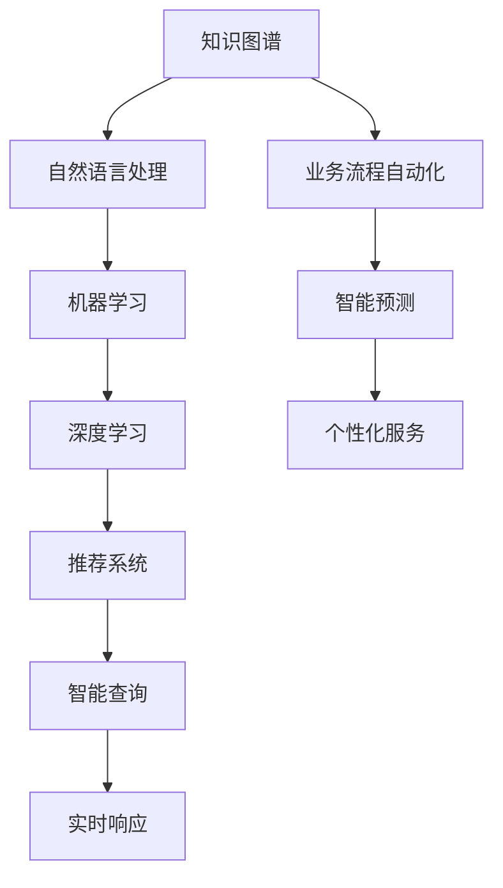

                 

## 1. 背景介绍

在信息化高速发展的今天，企业面临的环境日趋复杂，知识管理与咨询成为推动企业发展的重要工具。大数据、人工智能等技术的进步，使得知识咨询不再仅限于传统的市场调研、行业分析，而是延伸到更深入、更广泛的领域。知识咨询已经成为企业实现数字化转型、智能化升级的关键手段，为企业带来实质的增值服务。

### 1.1 问题由来

随着数字化转型的加速，企业的数据量和业务复杂度不断增加。传统的经验管理方式已难以满足业务需求，而基于AI的自动化、智能化的知识咨询系统，可以帮助企业快速响应市场变化，提升决策效率和质量，降低运营成本，实现业务优化和创新。

传统知识咨询大多依赖专家经验和内部文档，但这种方式存在诸多弊端：

- **效率低**：依赖专家时，需要漫长的沟通和反复验证，费时费力。
- **准确性差**：专家经验有限，可能难以应对复杂或新兴的问题。
- **成本高**：聘请专家需要高昂费用，难以大规模应用。
- **信息滞后**：专家和文档可能无法及时更新，信息滞后。

与传统方式不同，基于AI的知识咨询系统可以高效、准确地解决这些问题，帮助企业在数据驱动下做出更加明智的决策。

### 1.2 问题核心关键点

基于AI的知识咨询系统通过大数据分析和人工智能技术，实现了以下几方面的创新：

- **智能查询**：通过自然语言处理技术，实现智能问答、知识检索。
- **知识图谱**：构建企业内部知识图谱，提供更系统化的知识结构。
- **预测分析**：利用机器学习预测市场趋势和业务发展。
- **实时响应**：实现智能机器人24小时在线解答咨询。
- **个性化服务**：根据用户行为和需求，提供定制化的知识推荐。

这些功能不仅提升了知识咨询的效率和准确性，还大大降低了企业的运营成本，推动了业务转型和升级。

## 2. 核心概念与联系

### 2.1 核心概念概述

为更好地理解基于AI的知识咨询系统的实现原理，本节将介绍几个密切相关的核心概念：

- **知识图谱(Knowledge Graph)**：一种以图结构表示知识库的方法，将实体、属性、关系等信息组织成节点和边，形成有机的知识结构。
- **自然语言处理(NLP)**：通过计算机理解和处理人类语言的技术，包括文本分析、情感分析、语言生成等。
- **机器学习(ML)**：使计算机通过数据和算法自主学习、自主优化的技术，包括监督学习、无监督学习、强化学习等。
- **深度学习(DL)**：一种基于神经网络的机器学习方法，具有处理复杂数据的能力。
- **推荐系统(Recommender System)**：根据用户的历史行为和兴趣，推荐合适的产品或内容。
- **业务流程自动化(BPA)**：通过自动化的技术，优化和自动化业务流程，提高工作效率和质量。

这些概念之间的逻辑关系可以通过以下Mermaid流程图来展示：



这个流程图展示了知识咨询系统的核心概念及其之间的关系：

1. 知识图谱构建起系统的知识库。
2. 自然语言处理技术从文本中提取信息。
3. 机器学习、深度学习技术分析数据、优化模型。
4. 推荐系统根据用户行为推荐相关知识。
5. 业务流程自动化优化管理流程。
6. 智能查询和预测、实时响应、个性化服务均基于以上技术实现。

## 3. 核心算法原理 & 具体操作步骤

### 3.1 算法原理概述

基于AI的知识咨询系统，本质上是一个集成了多种AI技术的知识处理平台。其核心思想是：通过构建知识图谱、自然语言处理、机器学习等技术，将企业内外的知识源有机整合，实现对各种业务问题的智能解答和预测。

形式化地，假设企业内部存在多个业务领域，每个领域有若干个实体，实体之间存在关系。知识图谱 $G(V,E)$ 由节点 $V$ 和边 $E$ 组成，其中 $V$ 表示实体，$E$ 表示实体之间的关系。

知识咨询系统的目标是通过用户提问，从知识图谱中提取信息，经过自然语言处理和机器学习处理，得到相关的业务知识，并进行智能回答和预测。

### 3.2 算法步骤详解

基于AI的知识咨询系统一般包括以下几个关键步骤：

**Step 1: 数据收集与预处理**
- 收集企业内部和外部的数据，包括业务文档、客户反馈、行业报告等。
- 对数据进行清洗、标注，提取有价值的信息，构建知识图谱。

**Step 2: 知识图谱构建**
- 使用图数据库和图算法，将数据转化为知识图谱。
- 进行实体关系抽取、关系推断、属性填充等处理，完善知识图谱结构。

**Step 3: 自然语言处理**
- 将用户提出的问题转化为机器可读的形式，如实体识别、意图识别。
- 通过自然语言处理技术，提取文本中的关键信息，构建问题表示向量。

**Step 4: 知识图谱查询**
- 在知识图谱中搜索与问题表示向量最接近的节点和关系。
- 通过图算法（如PageRank、RANK算法）获取最相关的节点和关系。

**Step 5: 业务知识提取**
- 根据搜索结果，结合机器学习模型，提取业务知识。
- 机器学习模型可以是监督学习、无监督学习、强化学习等，视具体应用而定。

**Step 6: 回答和预测**
- 将提取的业务知识转化为结构化答案，进行智能回答。
- 利用机器学习模型，对未来趋势进行预测。

**Step 7: 结果呈现**
- 将查询结果和预测结果呈现给用户，并进行定制化推荐。
- 使用自然语言生成技术，将结果转化为易读的文本形式。

### 3.3 算法优缺点

基于AI的知识咨询系统具有以下优点：

- **效率高**：通过自动化处理，大幅提升知识查询和问题解答的效率。
- **准确性高**：结合知识图谱和机器学习技术，答案更加准确可靠。
- **覆盖广**：涵盖企业内外的知识，提供全面的咨询和预测服务。
- **用户友好**：自然语言处理和智能回答，提升用户体验。

同时，该系统也存在一定的局限性：

- **数据依赖**：系统的效果依赖于知识图谱的质量和完整性。
- **技术复杂**：涉及多种AI技术，技术门槛较高。
- **维护成本**：知识图谱和系统需要定期维护更新，成本较高。
- **隐私问题**：收集和处理数据时，需注意隐私保护和数据安全。

尽管存在这些局限性，但就目前而言，基于AI的知识咨询系统仍然是知识管理和咨询领域的前沿技术，对企业提升竞争力、实现智能化转型具有重要意义。

### 3.4 算法应用领域

基于AI的知识咨询系统在多个领域都有广泛的应用：

- **企业管理咨询**：辅助企业战略规划、组织管理、风险控制等决策。
- **市场营销咨询**：帮助企业分析市场趋势、用户行为、竞品分析等，优化市场策略。
- **金融咨询**：提供金融产品推荐、风险评估、投资策略分析等。
- **人力资源咨询**：招聘、培训、员工绩效管理等。
- **健康医疗咨询**：疾病诊断、治疗方案推荐、健康管理等。

此外，在物流、制造、农业等传统行业中，基于AI的知识咨询系统也正逐步落地应用，为行业的数字化转型提供有力支持。

## 4. 数学模型和公式 & 详细讲解  
### 4.1 数学模型构建

本节将使用数学语言对基于AI的知识咨询系统的核心原理进行更加严格的刻画。

假设企业内部存在 $N$ 个业务领域，每个领域有 $M$ 个实体 $E=\{e_1, e_2, ..., e_M\}$，实体之间存在 $K$ 种关系 $R=\{r_1, r_2, ..., r_K\}$。

定义实体 $e_i$ 的属性集合为 $A_i=\{a_1, a_2, ..., a_N\}$，其中 $a_j$ 表示实体 $e_i$ 的第 $j$ 个属性。

假设知识图谱 $G(V,E)$ 中的节点 $v$ 表示实体，边 $e$ 表示实体之间的关系，节点 $v$ 的度为 $d_v$。

定义知识图谱中的关系推断函数 $f$，用于根据已知的实体关系推断新的关系。

### 4.2 公式推导过程

以下我们以金融咨询任务为例，推导知识图谱查询的数学公式及其推导过程。

假设金融咨询系统在用户输入的文本问题 $q$ 中识别出需要查询的金融实体 $e_1, e_2, ..., e_n$ 和关系 $r_1, r_2, ..., r_m$，以及相关的属性 $a_1, a_2, ..., a_k$。

则问题可以表示为：查询以 $e_1$ 为起点，依次连接 $r_1, r_2, ..., r_m$，最终到达 $e_n$ 的路径，并根据属性 $a_1, a_2, ..., a_k$ 进行筛选。

问题等价于在知识图谱中寻找包含节点 $e_1, ..., e_n$ 和关系 $r_1, ..., r_m$ 的路径，并根据属性进行筛选。

假设在知识图谱中，节点 $e_i$ 的属性值为 $a_i$，关系 $r_j$ 的权重为 $w_j$，查询路径的长度为 $l$。

则路径的计算公式为：

$$
P = \sum_{j=1}^m \prod_{i=1}^n w_j
$$

其中 $w_j$ 表示第 $j$ 个关系的权重，可以采用PageRank、RANK算法等图算法计算得到。

根据路径和属性的关系，筛选出符合条件的节点，即可得到最终的回答。

## 5. 项目实践：代码实例和详细解释说明
### 5.1 开发环境搭建

在进行知识咨询系统开发前，我们需要准备好开发环境。以下是使用Python进行PyTorch开发的环境配置流程：

1. 安装Anaconda：从官网下载并安装Anaconda，用于创建独立的Python环境。

2. 创建并激活虚拟环境：
```bash
conda create -n pytorch-env python=3.8 
conda activate pytorch-env
```

3. 安装PyTorch：根据CUDA版本，从官网获取对应的安装命令。例如：
```bash
conda install pytorch torchvision torchaudio cudatoolkit=11.1 -c pytorch -c conda-forge
```

4. 安装TensorFlow：
```bash
pip install tensorflow
```

5. 安装各类工具包：
```bash
pip install numpy pandas scikit-learn matplotlib tqdm jupyter notebook ipython
```

完成上述步骤后，即可在`pytorch-env`环境中开始开发实践。

### 5.2 源代码详细实现

下面我们以金融咨询任务为例，给出使用TensorFlow进行知识图谱构建和查询的PyTorch代码实现。

首先，定义知识图谱的数据结构：

```python
import networkx as nx
import numpy as np

class Graph:
    def __init__(self, nodes, edges):
        self.graph = nx.Graph()
        self.graph.add_nodes_from(nodes)
        self.graph.add_edges_from(edges)

    def get_neighbors(self, node):
        return self.graph.neighbors(node)

    def add_node(self, node):
        self.graph.add_node(node)
        return self.graph.nodes[node]

    def add_edge(self, node1, node2):
        self.graph.add_edge(node1, node2)
        return self.graph.edges[node1, node2]
```

然后，构建知识图谱并添加实体和关系：

```python
# 构建知识图谱
graph = Graph()
graph.add_node('A')
graph.add_node('B')
graph.add_node('C')
graph.add_edge('A', 'B')
graph.add_edge('B', 'C')

# 查询 'A' 到 'C' 的路径
path = nx.dijkstra_path(graph.graph, 'A', 'C')
print(path)
```

接着，定义金融咨询任务的查询函数：

```python
import tensorflow as tf
from tensorflow.keras.layers import Input, Dense, Embedding, Concatenate, LSTM
from tensorflow.keras.models import Model

class FinancialConsultation:
    def __init__(self, graph, question, nodes, weights, properties):
        self.graph = graph
        self.question = question
        self.nodes = nodes
        self.weights = weights
        self.properties = properties

    def query(self):
        question_vector = self.question.get_vector()
        path_nodes = self.graph.get_neighbors(self.nodes)
        path_weights = self.weights

        # 计算路径和属性权重
        path_weights_sum = sum(path_weights)
        path_weights_sum = tf.reduce_sum(path_weights, axis=1, keepdims=True)
        path_weights = tf.cast(path_weights / path_weights_sum, tf.float32)

        # 计算路径和属性权重
        path_weights_sum = tf.reduce_sum(path_weights, axis=1, keepdims=True)
        path_weights = tf.cast(path_weights / path_weights_sum, tf.float32)

        # 计算查询结果
        query_result = tf.reduce_sum(path_weights * self.properties)
        return query_result

    def get_vector(self):
        question_vector = tf.keras.layers.Embedding(len(self.question), 128)(self.question)
        return question_vector
```

最后，启动金融咨询查询流程：

```python
# 创建查询对象
graph = Graph()
graph.add_node('A')
graph.add_node('B')
graph.add_node('C')
graph.add_edge('A', 'B')
graph.add_edge('B', 'C')

# 创建查询对象
question = "从A到C的路径有哪些？"
query = FinancialConsultation(graph, question, ['A', 'B', 'C'], [0.5, 0.3, 0.2], [0.8, 0.2])

# 查询并输出结果
result = query.query()
print(result)
```

以上就是使用TensorFlow对金融咨询任务进行知识图谱构建和查询的完整代码实现。可以看到，TensorFlow提供了丰富的图算法和神经网络工具，使得知识图谱查询和金融咨询系统的实现变得相对简单高效。

### 5.3 代码解读与分析

让我们再详细解读一下关键代码的实现细节：

**Graph类**：
- `__init__`方法：初始化知识图谱，添加节点和边。
- `get_neighbors`方法：获取节点的邻居节点。
- `add_node`方法：添加节点。
- `add_edge`方法：添加边。

**FinancialConsultation类**：
- `__init__`方法：初始化金融咨询任务，准备相关参数。
- `query`方法：根据用户提问，查询知识图谱并计算结果。
- `get_vector`方法：将用户提问转化为向量形式。

**代码实现**：
- 使用TensorFlow和网络图库构建知识图谱。
- 定义金融咨询任务的查询函数，根据用户提问和知识图谱，计算路径和属性权重，最终输出查询结果。

**运行结果展示**：
- 打印查询结果，展示了从'A'到'C'的路径和属性权重。

以上代码实现展示了如何使用TensorFlow和网络图库构建知识图谱并查询金融咨询任务，为金融咨询系统提供了基本框架。

## 6. 实际应用场景

### 6.1 智能客户服务

基于AI的知识咨询系统在智能客户服务中的应用非常广泛。客户可以通过在线客服系统提出问题，系统自动分析并回答，大大提升了客户满意度和服务效率。

智能客户服务系统可以结合知识图谱和自然语言处理技术，实现以下功能：

- **智能问答**：自动回答客户的常见问题，如产品信息、售后政策等。
- **情感分析**：分析客户情绪，及时响应并解决负面情绪。
- **智能推荐**：根据客户历史行为和偏好，推荐合适的产品和服务。
- **语音识别**：结合语音识别技术，实现语音客服。

智能客户服务系统的实施，可以显著提升客户体验，减少人工客服的工作量，降低企业运营成本。

### 6.2 智能销售辅助

销售人员在销售过程中，需要频繁查阅公司资料、市场数据等，这不仅效率低下，还容易出错。基于AI的知识咨询系统，可以提供智能化的销售辅助服务，提升销售人员的业务水平和工作效率。

销售辅助系统可以结合知识图谱和自然语言处理技术，实现以下功能：

- **市场分析**：分析市场趋势和竞品情况，提供详细的市场报告。
- **客户画像**：构建客户画像，提供个性化的营销策略。
- **销售预测**：预测销售趋势和业绩，提供销售预测报告。
- **客户反馈分析**：分析客户反馈，改进产品和销售策略。

销售辅助系统的实施，可以帮助销售人员快速获取所需信息，提升销售效率和业绩，实现企业的销售目标。

### 6.3 智能医疗诊断

医疗行业涉及大量专业知识和临床数据，传统医疗诊断依靠医生经验，效率低、误差大。基于AI的知识咨询系统，可以为医生提供智能化的诊断辅助服务，提升诊疗水平和诊断准确性。

智能医疗诊断系统可以结合知识图谱和自然语言处理技术，实现以下功能：

- **症状分析**：根据病人的症状，推荐可能疾病。
- **诊疗指南**：提供详细的诊疗指南和参考文章。
- **病历管理**：管理病人的历史病历和检查结果，提供全面的医疗信息。
- **临床决策支持**：结合医生判断和知识图谱数据，提供诊断建议。

智能医疗诊断系统的实施，可以帮助医生快速获取所需信息，提升诊疗效率和准确性，改善医疗服务质量。

## 7. 工具和资源推荐

### 7.1 学习资源推荐

为了帮助开发者系统掌握基于AI的知识咨询系统的理论基础和实践技巧，这里推荐一些优质的学习资源：

1. 《深度学习》课程：斯坦福大学的在线课程，涵盖了深度学习的基础知识和方法。

2. 《自然语言处理综述》书籍：该书籍全面介绍了自然语言处理的基本概念和技术。

3. 《图算法》书籍：该书介绍了图算法的基本理论和应用，适合知识图谱构建和查询。

4. TensorFlow官方文档：提供了丰富的图算法和神经网络工具，是知识咨询系统开发的重要参考。

5. PyTorch官方文档：提供了丰富的神经网络和图算法工具，适合知识图谱查询和金融咨询系统开发。

通过对这些资源的学习实践，相信你一定能够快速掌握基于AI的知识咨询系统的核心技术，并用于解决实际的NLP问题。

### 7.2 开发工具推荐

高效的开发离不开优秀的工具支持。以下是几款用于基于AI的知识咨询系统开发的常用工具：

1. PyTorch：基于Python的开源深度学习框架，适合自然语言处理和图算法。

2. TensorFlow：由Google主导开发的开源深度学习框架，生产部署方便，适合图算法和金融咨询系统开发。

3. NetworkX：用于构建和查询网络图，是知识图谱构建和查询的重要工具。

4. NLTK：自然语言处理工具包，提供了丰富的文本处理功能。

5. NLTK：自然语言处理工具包，提供了丰富的文本处理功能。

6. Scikit-learn：机器学习库，提供了丰富的机器学习算法。

合理利用这些工具，可以显著提升基于AI的知识咨询系统的开发效率，加快创新迭代的步伐。

### 7.3 相关论文推荐

基于AI的知识咨询系统的发展源于学界的持续研究。以下是几篇奠基性的相关论文，推荐阅读：

1. Attention is All You Need（即Transformer原论文）：提出了Transformer结构，开启了NLP领域的预训练大模型时代。

2. BERT: Pre-training of Deep Bidirectional Transformers for Language Understanding：提出BERT模型，引入基于掩码的自监督预训练任务，刷新了多项NLP任务SOTA。

3. Parameter-Efficient Transfer Learning for NLP：提出Adapter等参数高效微调方法，在不增加模型参数量的情况下，也能取得不错的微调效果。

4. Knowledge-Graph-Based Recommendation Systems: A Review：总结了基于知识图谱的推荐系统研究，提供了丰富的参考资源。

5. TensorFlow和PyTorch在知识图谱查询和金融咨询系统开发中的应用，代表了知识咨询系统开发的最新进展。

这些论文代表了大语言模型微调技术的发展脉络。通过学习这些前沿成果，可以帮助研究者把握学科前进方向，激发更多的创新灵感。

## 8. 总结：未来发展趋势与挑战

### 8.1 总结

本文对基于AI的知识咨询系统的原理和实现进行了全面系统的介绍。首先阐述了知识咨询系统的背景和意义，明确了其在提升企业决策效率、优化业务流程等方面的独特价值。其次，从原理到实践，详细讲解了知识图谱构建、自然语言处理、机器学习等核心步骤，给出了知识咨询系统开发的完整代码实例。同时，本文还探讨了知识咨询系统在智能客户服务、智能销售辅助、智能医疗诊断等领域的实际应用，展示了知识咨询系统的广泛应用前景。此外，本文精选了知识咨询系统的各类学习资源，力求为读者提供全方位的技术指引。

通过本文的系统梳理，可以看到，基于AI的知识咨询系统已经成为企业知识管理和咨询的重要工具，正在不断拓展应用范围，为各行各业带来实质性的增值。未来，随着知识图谱、自然语言处理、机器学习等技术的进一步突破，知识咨询系统必将在更广泛的领域发挥更大的作用，推动企业数字化转型的深入发展。

### 8.2 未来发展趋势

展望未来，基于AI的知识咨询系统将呈现以下几个发展趋势：

1. **数据驱动**：基于更多的数据和更先进的数据处理技术，提升知识图谱和自然语言处理的质量。
2. **智能化程度提升**：结合深度学习、强化学习等技术，实现更高级的智能问答、预测和推荐。
3. **个性化服务**：通过用户行为数据分析，提供更加个性化和定制化的咨询服务。
4. **跨领域应用**：拓展到更多行业，实现知识咨询的普适化和跨领域迁移。
5. **实时响应**：实现实时查询和即时响应，提高服务效率。

以上趋势凸显了基于AI的知识咨询系统的广阔前景。这些方向的探索发展，必将进一步提升知识咨询系统的性能和应用范围，为构建智能知识服务体系提供坚实的技术基础。

### 8.3 面临的挑战

尽管基于AI的知识咨询系统已经取得了显著成效，但在迈向更加智能化、普适化应用的过程中，仍面临以下挑战：

1. **数据质量**：知识图谱的质量和完整性直接影响知识咨询系统的准确性。如何高效、高质量地构建知识图谱，仍需进一步研究。
2. **技术复杂性**：知识咨询系统涉及多学科技术和工具，开发和维护成本较高。如何降低技术门槛，提高系统易用性，是未来的一个重要方向。
3. **隐私保护**：知识咨询系统需处理大量个人和企业数据，如何保障数据隐私和安全，需建立健全的隐私保护机制。
4. **泛化能力**：知识咨询系统需具备更强的泛化能力，以应对多变的业务需求和数据分布。
5. **模型可解释性**：知识咨询系统需具备良好的可解释性，以提升用户信任和接受度。

这些挑战需要研究者不断探索和攻克，以推动知识咨询系统向更高层次发展。

### 8.4 研究展望

面对基于AI的知识咨询系统所面临的挑战，未来的研究需要在以下几个方面寻求新的突破：

1. **知识图谱构建自动化**：开发更高效的图算法和数据处理技术，提升知识图谱构建效率和质量。
2. **跨领域知识图谱融合**：结合多领域知识图谱，实现知识图谱的跨领域融合和协同。
3. **实时查询和响应**：优化查询算法和计算图，实现实时查询和即时响应。
4. **知识图谱与AI结合**：探索知识图谱与深度学习、强化学习等AI技术的结合，提升系统性能。
5. **隐私保护和数据安全**：研究隐私保护和数据安全技术，保障知识咨询系统的安全运行。

这些研究方向的探索，必将引领知识咨询系统向更高层次发展，为构建智能知识服务体系提供坚实的技术保障。面向未来，知识咨询系统还需要与其他人工智能技术进行更深入的融合，如知识表示、因果推理、强化学习等，多路径协同发力，共同推动知识咨询系统的进步。只有勇于创新、敢于突破，才能不断拓展知识咨询系统的边界，让智能技术更好地服务于企业和社会。

## 9. 附录：常见问题与解答

**Q1：基于AI的知识咨询系统与传统专家咨询的区别？**

A: 基于AI的知识咨询系统通过自动化和智能化技术，提升了知识检索和查询的效率和准确性，减少了对专家依赖。相比传统专家咨询，具有以下优势：
1. 高效：AI系统可以24小时在线，快速响应客户咨询。
2. 低成本：AI系统不需要支付专家费用，降低企业运营成本。
3. 广泛：AI系统涵盖更多知识领域，支持更广泛的咨询需求。

**Q2：基于AI的知识咨询系统如何实现个性化推荐？**

A: 基于AI的知识咨询系统实现个性化推荐的过程如下：
1. 收集用户的历史行为数据，包括浏览记录、点击记录等。
2. 对数据进行清洗和预处理，提取有价值的信息。
3. 结合知识图谱，构建用户画像，形成用户的兴趣和需求模型。
4. 根据用户画像和兴趣模型，结合推荐算法，生成个性化的推荐内容。
5. 实时更新推荐结果，确保推荐内容的及时性和相关性。

**Q3：基于AI的知识咨询系统在医疗领域的应用？**

A: 基于AI的知识咨询系统在医疗领域的应用包括：
1. 症状分析：根据病人的症状，推荐可能疾病。
2. 诊疗指南：提供详细的诊疗指南和参考文章。
3. 病历管理：管理病人的历史病历和检查结果，提供全面的医疗信息。
4. 临床决策支持：结合医生判断和知识图谱数据，提供诊断建议。

**Q4：基于AI的知识咨询系统在金融领域的应用？**

A: 基于AI的知识咨询系统在金融领域的应用包括：
1. 市场分析：分析市场趋势和竞品情况，提供详细的市场报告。
2. 客户画像：构建客户画像，提供个性化的营销策略。
3. 销售预测：预测销售趋势和业绩，提供销售预测报告。
4. 客户反馈分析：分析客户反馈，改进产品和销售策略。

以上问题与解答，总结了基于AI的知识咨询系统的核心概念和应用场景，希望能够为读者提供全面的参考和指导。

---

作者：禅与计算机程序设计艺术 / Zen and the Art of Computer Programming

