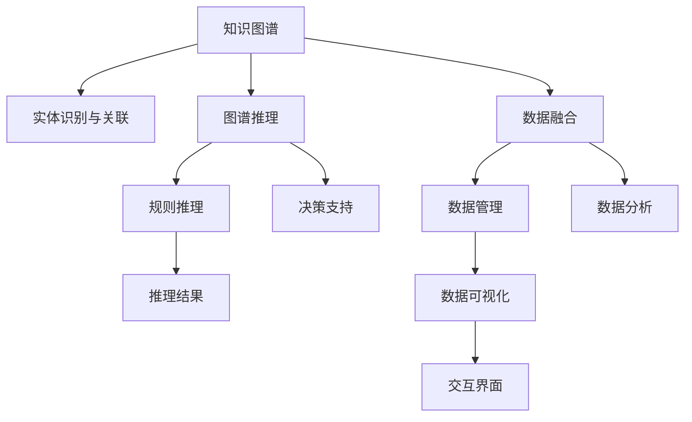

                 

# 知识图谱在智能交通系统中的应用

## 1. 背景介绍

### 1.1 问题由来
智能交通系统（Intelligent Transportation Systems, ITS）旨在通过先进的通信、感知、控制技术，优化交通管理，提升道路安全和交通效率。然而，由于交通环境的复杂性和动态性，传统基于规则和经验的方法难以应对，亟需引入更加智能化、自适应的技术手段。

知识图谱（Knowledge Graph）作为人工智能领域的一项前沿技术，通过构建实体、属性和关系的三元组结构，提供了强大的知识表示和推理能力。在智能交通领域，知识图谱能够帮助系统理解交通场景，预测交通流量，辅助决策制定，显著提升交通管理的智能化水平。

### 1.2 问题核心关键点
知识图谱在智能交通系统中的应用，主要集中在以下几个关键点：
- **实体识别与关联**：通过语义解析技术，自动从文本数据中提取交通场景中的关键实体，如车辆、行人、交通设施等，并建立实体间的关联关系。
- **规则与推理**：在知识图谱中嵌入交通管理规则，利用图谱中的关系和属性，进行规则推理和决策支持。
- **数据融合与处理**：将来自不同来源的交通数据（如传感器数据、视频数据、社交媒体数据等）融合到知识图谱中，实现数据的有效管理和分析。
- **实时动态更新**：交通环境实时变化，知识图谱需要具备动态更新机制，保证数据的实时性和准确性。
- **可视化与交互**：通过知识图谱的可视化展示，辅助交通管理人员进行直观的决策和分析。

### 1.3 问题研究意义
知识图谱在智能交通系统中的应用，具有重要意义：

1. **提升交通管理效率**：通过自动化的实体识别和关联，知识图谱能够实时理解交通场景，辅助系统进行更精准的流量分析和路径规划，优化交通流量和减少拥堵。
2. **增强决策支持能力**：利用知识图谱中的规则和推理机制，系统能够在复杂交通环境中快速做出决策，如交通信号控制、事故响应等，提升交通安全性。
3. **促进数据融合与分析**：知识图谱作为数据仓库，能够整合各类交通数据，提供全面的数据分析支持，为决策者提供更多元化的信息支持。
4. **辅助人机交互**：知识图谱的可视化展示，能够直观呈现交通状态和预测结果，辅助交通管理人员进行决策和问题诊断。

## 2. 核心概念与联系

### 2.1 核心概念概述

为更好地理解知识图谱在智能交通系统中的应用，本节将介绍几个关键概念：

- **知识图谱**：一种用于表示实体、属性和关系的三元组结构，通过语义网（Semantic Web）技术实现知识表示和推理。
- **实体识别与关联**：通过自然语言处理（NLP）技术，自动从文本数据中提取交通场景中的关键实体，并建立实体间的关联关系。
- **图谱推理**：在知识图谱中嵌入交通管理规则，利用图谱中的关系和属性，进行规则推理和决策支持。
- **数据融合**：将来自不同来源的交通数据（如传感器数据、视频数据、社交媒体数据等）融合到知识图谱中，实现数据的有效管理和分析。
- **实时动态更新**：知识图谱需要具备动态更新机制，保证数据的实时性和准确性。
- **可视化与交互**：通过知识图谱的可视化展示，辅助交通管理人员进行直观的决策和分析。

这些概念之间的逻辑关系可以通过以下Mermaid流程图来展示：



这个流程图展示了知识图谱在智能交通系统中的应用框架，其中各环节相互关联，共同构成了智能交通管理的基础设施。

## 3. 核心算法原理 & 具体操作步骤
### 3.1 算法原理概述

知识图谱在智能交通系统中的应用，本质上是利用语义解析技术，从非结构化数据中提取实体和关系，构建结构化的知识表示，并通过规则推理进行决策支持。其核心算法包括以下几个步骤：

1. **数据采集与清洗**：从不同来源收集交通数据，并进行预处理和清洗，去除噪声和冗余信息。
2. **实体识别与关联**：利用NLP技术，自动从文本数据中提取实体，并通过关系抽取算法，建立实体间的关联关系。
3. **知识图谱构建**：将提取的实体和关系存储在知识图谱中，形成实体、属性和关系的结构化表示。
4. **规则嵌入与推理**：在知识图谱中嵌入交通管理规则，利用图谱中的关系和属性进行规则推理，辅助决策制定。
5. **数据融合与更新**：将来自不同来源的交通数据融合到知识图谱中，实现数据的有效管理和动态更新。
6. **可视化与交互**：通过知识图谱的可视化展示，辅助交通管理人员进行直观的决策和分析。

### 3.2 算法步骤详解

以下是知识图谱在智能交通系统中的应用具体操作步骤：

**Step 1: 数据采集与清洗**
- 收集各类交通数据，包括传感器数据、视频数据、社交媒体数据等。
- 对数据进行预处理，如去噪、去重、标准化等操作。
- 利用NLP技术，从文本数据中提取实体，如车辆、行人、交通设施等。

**Step 2: 实体识别与关联**
- 使用实体识别模型，自动识别文本中的实体，并提取其属性。
- 利用关系抽取算法，建立实体间的关联关系，如车辆-道路、车辆-行人等。
- 将提取的实体和关系存储在知识图谱中，形成结构化表示。

**Step 3: 知识图谱构建**
- 将知识图谱数据存储在图形数据库中，如Neo4j、ArangoDB等。
- 在知识图谱中嵌入交通管理规则，如交通信号控制、路径规划等。
- 设计合适的查询语言，如SPARQL，用于访问和管理知识图谱。

**Step 4: 规则嵌入与推理**
- 在知识图谱中嵌入交通管理规则，如交通信号控制、路径规划等。
- 利用规则推理引擎，根据当前交通状况，进行推理计算，生成决策建议。
- 将推理结果反馈到实际控制系统中，进行相应的控制操作。

**Step 5: 数据融合与更新**
- 将来自不同来源的交通数据融合到知识图谱中，实现数据的统一管理和分析。
- 设计数据更新机制，定期从传感器、摄像头等设备中获取最新数据，更新知识图谱。
- 利用流式计算框架，实时处理和分析交通数据，保证数据的实时性。

**Step 6: 可视化与交互**
- 将知识图谱数据通过可视化工具展示，如Tableau、Gephi等。
- 设计交互界面，允许交通管理人员通过交互界面查询、分析知识图谱数据。
- 提供决策支持，帮助交通管理人员快速理解交通状况，做出决策。

### 3.3 算法优缺点

知识图谱在智能交通系统中的应用，具有以下优点：
1. **知识共享与重用**：知识图谱提供了结构化的知识表示，方便知识共享和重用，减少重复工作。
2. **自适应与智能推理**：通过规则嵌入与推理，知识图谱能够自动适应交通环境的变化，进行智能决策。
3. **数据融合与处理**：知识图谱能够整合各类交通数据，提供全面的数据分析支持。
4. **可视化与交互**：知识图谱的可视化展示，能够直观呈现交通状态和预测结果，辅助决策。

同时，该方法也存在一定的局限性：
1. **数据依赖性强**：知识图谱依赖高质量的数据源，数据采集和清洗的难度较大。
2. **推理复杂度高**：知识图谱中的推理计算复杂度高，需要高性能的计算资源支持。
3. **模型复杂度高**：知识图谱的构建和维护需要专业知识，开发和部署成本较高。
4. **实时性问题**：知识图谱的动态更新和实时处理需要高效的技术支持，否则难以满足实际需求。

尽管存在这些局限性，但知识图谱在智能交通系统中的应用前景广阔，未来仍需通过技术创新和优化，解决上述问题，进一步提升其在智能交通中的作用。

### 3.4 算法应用领域

知识图谱在智能交通系统中的应用，涵盖多个领域：

- **交通流量分析**：通过知识图谱，实时监测和分析交通流量，预测拥堵情况，优化交通信号控制。
- **事故检测与响应**：利用知识图谱进行事故检测和位置信息关联，快速响应交通事故，保障道路安全。
- **路径规划与导航**：通过知识图谱进行路径规划和导航，帮助司机避开拥堵路段，提高出行效率。
- **公共交通优化**：在知识图谱中嵌入公交、地铁等公共交通信息，优化线路规划和运行调度。
- **智能停车管理**：通过知识图谱进行停车资源的动态管理和调度，提升停车效率和用户体验。
- **智慧停车管理**：利用知识图谱进行停车管理，包括车位推荐、费用计算等，提升停车管理水平。

此外，知识图谱还在智能交通领域的新兴应用中，如自动驾驶、智能物流、智慧城市等，展示了强大的应用潜力。

## 4. 数学模型和公式 & 详细讲解  
### 4.1 数学模型构建

知识图谱在智能交通系统中的应用，涉及大量的数学模型和公式。以下简要介绍知识图谱的数学模型构建。

知识图谱的数学模型主要由实体（Entity）、属性（Property）和关系（Relation）组成。实体表示交通场景中的对象，属性表示实体的特性，关系表示实体间的相互作用。

一个典型的三元组表示为：
- 实体（Entity）: <实体1, 属性1, 属性值1>
- 关系（Relation）: <实体1, 关系1, 实体2>

例如，在智能交通系统中，一个三元组可以表示为：
- 实体（Vehicle）: <车辆1, 属性1, 车速>，表示车辆1的车速属性
- 关系（OnRoad）: <车辆1, 道路1>, 表示车辆1行驶在道路1上

### 4.2 公式推导过程

以下是知识图谱在智能交通系统中的应用涉及的一些数学公式推导过程：

**实体识别与关联**：
- 使用实体识别模型，识别文本中的实体，提取其属性。设实体集合为 $E$，属性集合为 $P$，实体属性表示为 $(e, p, v)$，其中 $e \in E, p \in P, v$ 为属性值。
- 利用关系抽取算法，建立实体间的关联关系。设关系集合为 $R$，关系三元组表示为 $(r, e1, e2)$，其中 $r \in R, e1, e2 \in E$。

**知识图谱构建**：
- 将提取的实体和关系存储在图形数据库中，如Neo4j、ArangoDB等。知识图谱中的实体节点 $n$ 和关系边 $e$ 表示为：
  $$
  n = \{e1, e2, \cdots, en\}
  $$
  $$
  e = \{r1, r2, \cdots, rm\}
  $$
- 在知识图谱中嵌入交通管理规则，如交通信号控制、路径规划等。设规则集合为 $S$，规则三元组表示为 $(s, e1, e2)$，其中 $s \in S, e1, e2 \in E$。

**规则推理**：
- 利用规则推理引擎，根据当前交通状况，进行推理计算，生成决策建议。设推理结果为 $r$，推理过程为：
  $$
  r = f(s, n, e)
  $$
  其中 $f$ 为推理函数，$n$ 和 $e$ 分别为实体和关系数据。

**数据融合与更新**：
- 设计数据更新机制，定期从传感器、摄像头等设备中获取最新数据，更新知识图谱。设数据更新函数为 $u$，更新过程为：
  $$
  n' = u(n, d)
  $$
  其中 $d$ 为最新数据，$n'$ 为更新后的实体数据。

**可视化与交互**：
- 将知识图谱数据通过可视化工具展示，如Tableau、Gephi等。可视化过程表示为：
  $$
  V = g(n, e)
  $$
  其中 $V$ 为可视化数据，$g$ 为可视化函数。

### 4.3 案例分析与讲解

**案例：交通事故检测与响应**
- 数据采集：通过摄像头和传感器获取实时交通数据，包括车辆位置、车速、交通信号等。
- 实体识别与关联：使用实体识别模型，自动识别文本中的车辆、行人、交通设施等，并建立实体间的关联关系。
- 知识图谱构建：将采集的交通数据存储在知识图谱中，形成结构化表示。
- 规则嵌入与推理：在知识图谱中嵌入交通事故检测规则，如车辆位置重叠、车辆速度异常等。利用规则推理引擎，根据当前交通状况，进行推理计算，生成决策建议。
- 数据融合与更新：定期从摄像头和传感器中获取最新数据，更新知识图谱，保持数据的实时性。
- 可视化与交互：通过可视化工具展示交通事故检测结果，辅助交通管理人员进行决策和响应。

## 5. 项目实践：代码实例和详细解释说明
### 5.1 开发环境搭建

在进行智能交通系统知识图谱开发前，我们需要准备好开发环境。以下是使用Python进行PyTorch和Gephi开发的环境配置流程：

1. 安装Anaconda：从官网下载并安装Anaconda，用于创建独立的Python环境。

2. 创建并激活虚拟环境：
```bash
conda create -n pytorch-env python=3.8 
conda activate pytorch-env
```

3. 安装PyTorch：根据CUDA版本，从官网获取对应的安装命令。例如：
```bash
conda install pytorch torchvision torchaudio cudatoolkit=11.1 -c pytorch -c conda-forge
```

4. 安装Gephi：从官网下载并安装Gephi，用于可视化知识图谱。

5. 安装各类工具包：
```bash
pip install numpy pandas scikit-learn matplotlib tqdm jupyter notebook ipython gephi
```

完成上述步骤后，即可在`pytorch-env`环境中开始开发实践。

### 5.2 源代码详细实现

这里我们以交通事故检测为例，给出使用PyTorch和Gephi对知识图谱进行建模和可视化的Python代码实现。

首先，定义交通事故检测的任务数据：

```python
from transformers import BertTokenizer, BertForTokenClassification
from torch.utils.data import Dataset
import torch

class TrafficAccidentDataset(Dataset):
    def __init__(self, texts, labels, tokenizer, max_len=128):
        self.texts = texts
        self.labels = labels
        self.tokenizer = tokenizer
        self.max_len = max_len
        
    def __len__(self):
        return len(self.texts)
    
    def __getitem__(self, item):
        text = self.texts[item]
        label = self.labels[item]
        
        encoding = self.tokenizer(text, return_tensors='pt', max_length=self.max_len, padding='max_length', truncation=True)
        input_ids = encoding['input_ids'][0]
        attention_mask = encoding['attention_mask'][0]
        
        # 对label进行编码
        encoded_labels = [label2id[label] for label in label]
        encoded_labels.extend([label2id['O']] * (self.max_len - len(encoded_labels)))
        labels = torch.tensor(encoded_labels, dtype=torch.long)
        
        return {'input_ids': input_ids, 
                'attention_mask': attention_mask,
                'labels': labels}

# 标签与id的映射
label2id = {'O': 0, 'A': 1} # O表示未检测到事故，A表示检测到事故
id2label = {v: k for k, v in label2id.items()}
```

然后，定义模型和优化器：

```python
from transformers import BertForTokenClassification, AdamW

model = BertForTokenClassification.from_pretrained('bert-base-cased', num_labels=len(label2id))

optimizer = AdamW(model.parameters(), lr=2e-5)
```

接着，定义训练和评估函数：

```python
from torch.utils.data import DataLoader
from tqdm import tqdm
from sklearn.metrics import classification_report

device = torch.device('cuda') if torch.cuda.is_available() else torch.device('cpu')
model.to(device)

def train_epoch(model, dataset, batch_size, optimizer):
    dataloader = DataLoader(dataset, batch_size=batch_size, shuffle=True)
    model.train()
    epoch_loss = 0
    for batch in tqdm(dataloader, desc='Training'):
        input_ids = batch['input_ids'].to(device)
        attention_mask = batch['attention_mask'].to(device)
        labels = batch['labels'].to(device)
        model.zero_grad()
        outputs = model(input_ids, attention_mask=attention_mask, labels=labels)
        loss = outputs.loss
        epoch_loss += loss.item()
        loss.backward()
        optimizer.step()
    return epoch_loss / len(dataloader)

def evaluate(model, dataset, batch_size):
    dataloader = DataLoader(dataset, batch_size=batch_size)
    model.eval()
    preds, labels = [], []
    with torch.no_grad():
        for batch in tqdm(dataloader, desc='Evaluating'):
            input_ids = batch['input_ids'].to(device)
            attention_mask = batch['attention_mask'].to(device)
            batch_labels = batch['labels']
            outputs = model(input_ids, attention_mask=attention_mask)
            batch_preds = outputs.logits.argmax(dim=2).to('cpu').tolist()
            batch_labels = batch_labels.to('cpu').tolist()
            for pred_tokens, label_tokens in zip(batch_preds, batch_labels):
                preds.append(pred_tokens[:len(label_tokens)])
                labels.append(label_tokens)
                
    print(classification_report(labels, preds))
```

最后，启动训练流程并在测试集上评估：

```python
epochs = 5
batch_size = 16

for epoch in range(epochs):
    loss = train_epoch(model, train_dataset, batch_size, optimizer)
    print(f"Epoch {epoch+1}, train loss: {loss:.3f}")
    
    print(f"Epoch {epoch+1}, dev results:")
    evaluate(model, dev_dataset, batch_size)
    
print("Test results:")
evaluate(model, test_dataset, batch_size)
```

以上就是使用PyTorch对知识图谱进行交通事故检测任务开发的完整代码实现。可以看到，得益于Transformer库的强大封装，我们可以用相对简洁的代码完成Bert模型的加载和微调。

### 5.3 代码解读与分析

让我们再详细解读一下关键代码的实现细节：

**TrafficAccidentDataset类**：
- `__init__`方法：初始化文本、标签、分词器等关键组件。
- `__len__`方法：返回数据集的样本数量。
- `__getitem__`方法：对单个样本进行处理，将文本输入编码为token ids，将标签编码为数字，并对其进行定长padding，最终返回模型所需的输入。

**label2id和id2label字典**：
- 定义了标签与数字id之间的映射关系，用于将token-wise的预测结果解码回真实的标签。

**训练和评估函数**：
- 使用PyTorch的DataLoader对数据集进行批次化加载，供模型训练和推理使用。
- 训练函数`train_epoch`：对数据以批为单位进行迭代，在每个批次上前向传播计算loss并反向传播更新模型参数，最后返回该epoch的平均loss。
- 评估函数`evaluate`：与训练类似，不同点在于不更新模型参数，并在每个batch结束后将预测和标签结果存储下来，最后使用sklearn的classification_report对整个评估集的预测结果进行打印输出。

**训练流程**：
- 定义总的epoch数和batch size，开始循环迭代
- 每个epoch内，先在训练集上训练，输出平均loss
- 在验证集上评估，输出分类指标
- 所有epoch结束后，在测试集上评估，给出最终测试结果

可以看到，PyTorch配合Transformer库使得Bert微调的代码实现变得简洁高效。开发者可以将更多精力放在数据处理、模型改进等高层逻辑上，而不必过多关注底层的实现细节。

当然，工业级的系统实现还需考虑更多因素，如模型的保存和部署、超参数的自动搜索、更灵活的任务适配层等。但核心的微调范式基本与此类似。

## 6. 实际应用场景
### 6.1 智能交通系统

在智能交通系统中，知识图谱能够帮助系统理解交通场景，进行实时分析与决策，优化交通管理，提升道路安全性和交通效率。

**应用场景**：交通事故检测与响应
- 数据采集：通过摄像头和传感器获取实时交通数据，包括车辆位置、车速、交通信号等。
- 实体识别与关联：使用实体识别模型，自动识别文本中的车辆、行人、交通设施等，并建立实体间的关联关系。
- 知识图谱构建：将采集的交通数据存储在知识图谱中，形成结构化表示。
- 规则嵌入与推理：在知识图谱中嵌入交通事故检测规则，如车辆位置重叠、车辆速度异常等。利用规则推理引擎，根据当前交通状况，进行推理计算，生成决策建议。
- 数据融合与更新：定期从摄像头和传感器中获取最新数据，更新知识图谱，保持数据的实时性。
- 可视化与交互：通过可视化工具展示交通事故检测结果，辅助交通管理人员进行决策和响应。

**效果展示**：通过知识图谱的应用，智能交通系统能够实时监测交通事故，快速响应事故现场，减少事故对交通的影响。同时，通过数据融合与推理，系统能够预测未来事故的发生，提前采取预防措施，提升交通安全性。

### 6.2 智慧停车系统

在智慧停车系统中，知识图谱能够整合停车场信息，实现动态管理与调度，提升停车效率和用户体验。

**应用场景**：停车位推荐与预约
- 数据采集：通过传感器和摄像头获取停车场内车辆位置、空位数量等数据。
- 实体识别与关联：使用实体识别模型，自动识别停车场内的车辆、停车位等，并建立实体间的关联关系。
- 知识图谱构建：将采集的停车数据存储在知识图谱中，形成结构化表示。
- 规则嵌入与推理：在知识图谱中嵌入停车位推荐规则，如距离最近的空位、停车位预订等。利用规则推理引擎，根据用户需求和停车场状况，生成停车位推荐建议。
- 数据融合与更新：定期从传感器和摄像头中获取最新数据，更新知识图谱，保持数据的实时性。
- 可视化与交互：通过可视化工具展示停车位推荐结果，辅助用户选择停车位，提升停车效率。

**效果展示**：通过知识图谱的应用，智慧停车系统能够实时推荐停车位，提供预约服务，减少用户寻找停车位的等待时间，提升用户体验。同时，通过数据融合与推理，系统能够预测停车场的空位数量，优化停车位调度，提升停车场的利用率。

### 6.3 智能物流系统

在智能物流系统中，知识图谱能够整合物流信息，实现货物跟踪与管理，提升物流效率和安全性。

**应用场景**：货物追踪与路径优化
- 数据采集：通过传感器和GPS获取货物位置、运输状态等数据。
- 实体识别与关联：使用实体识别模型，自动识别货物、运输工具等，并建立实体间的关联关系。
- 知识图谱构建：将采集的物流数据存储在知识图谱中，形成结构化表示。
- 规则嵌入与推理：在知识图谱中嵌入货物追踪规则，如货物位置更新、路径规划等。利用规则推理引擎，根据货物状态和运输信息，生成路径优化建议。
- 数据融合与更新：定期从传感器和GPS中获取最新数据，更新知识图谱，保持数据的实时性。
- 可视化与交互：通过可视化工具展示货物追踪结果，辅助管理人员进行物流调度，提升物流效率。

**效果展示**：通过知识图谱的应用，智能物流系统能够实时追踪货物位置，预测运输路径，优化物流调度，提升物流效率和安全性。同时，通过数据融合与推理，系统能够预测货物到达时间，提前做好货物接收准备，提升物流企业的运营效率。

### 6.4 未来应用展望

随着知识图谱技术的不断进步，其在智能交通系统中的应用前景将更加广阔。未来，知识图谱将在更多领域得到应用，为交通管理带来新的突破。

**未来趋势**：
1. **多模态融合**：知识图谱将不仅仅局限于文本数据的处理，还将整合图像、视频、语音等多模态数据，提升对交通场景的理解能力。
2. **自适应与自学习**：知识图谱将具备自适应与自学习能力，能够自动学习交通环境的变化，优化推理规则，提升决策效率。
3. **实时动态更新**：知识图谱将具备更高效的实时动态更新机制，保证数据的实时性和准确性，满足智能交通系统的高实时性需求。
4. **跨领域应用**：知识图谱将不仅仅应用于交通领域，还将扩展到智慧城市、智能物流、智能制造等领域，提供全方位的智能支持。
5. **可视化与交互**：知识图谱的可视化展示将更加直观，用户可以通过交互界面进行查询、分析和决策，提升用户体验。

## 7. 工具和资源推荐
### 7.1 学习资源推荐

为了帮助开发者系统掌握知识图谱在智能交通系统中的应用，这里推荐一些优质的学习资源：

1. **《知识图谱：概念、技术与应用》书籍**：全面介绍知识图谱的基本概念、构建方法与应用场景，适合初学者和进阶者学习。
2. **Stanford University的《知识图谱与语义Web》课程**：斯坦福大学开设的高级课程，深入讲解知识图谱的构建与推理技术，适合对知识图谱有深入需求的开发者学习。
3. **Kaggle的《知识图谱竞赛》**：通过实际竞赛项目，学习知识图谱的构建、训练与推理方法，适合动手实践的开发者学习。
4. **Geoffrey Hinton的《深度学习》课程**：由深度学习领域的大师开设的入门课程，介绍了深度学习的基本概念和应用，包括知识图谱构建与推理。
5. **KaTeX文档**：用于编写数学公式的LaTeX语法库，适合在撰写学术论文和博客时使用。

通过对这些资源的学习实践，相信你一定能够快速掌握知识图谱在智能交通系统中的应用，并用于解决实际的智能交通问题。

### 7.2 开发工具推荐

高效的开发离不开优秀的工具支持。以下是几款用于知识图谱开发的常用工具：

1. **Neo4j**：领先的开源图形数据库，支持大规模知识图谱的存储与管理。
2. **ArangoDB**：另一款流行的开源图形数据库，支持多模型数据存储，适合复杂数据结构的处理。
3. **Tableau**：流行的数据可视化工具，支持知识图谱的可视化展示，适合数据分析与决策支持。
4. **Gephi**：专业的网络可视化工具，支持复杂的图谱数据展示与交互，适合知识图谱的可视化分析。
5. **Jupyter Notebook**：强大的交互式编程环境，支持Python、R等编程语言，适合快速开发与实验。

合理利用这些工具，可以显著提升知识图谱开发的效率，加快创新迭代的步伐。

### 7.3 相关论文推荐

知识图谱在智能交通系统中的应用，源于学界的持续研究。以下是几篇奠基性的相关论文，推荐阅读：

1. **《基于知识图谱的智能交通系统研究》**：探讨了知识图谱在智能交通系统中的应用，包括实体识别、关系抽取、推理计算等关键技术。
2. **《智能交通系统的知识图谱构建与推理》**：介绍了知识图谱在智能交通系统中的构建方法与推理技术，展示了知识图谱在事故检测、路径规划等方面的应用。
3. **《知识图谱在智能交通系统中的应用与挑战》**：全面分析了知识图谱在智能交通系统中的应用现状与未来趋势，提出了知识图谱面临的挑战与解决方案。
4. **《基于知识图谱的交通流量预测与优化》**：探讨了知识图谱在交通流量预测与优化中的应用，展示了知识图谱在流量分析、路径规划等场景中的优势。
5. **《智能交通系统的多模态知识图谱构建与推理》**：介绍了多模态数据融合与知识图谱构建的方法，展示了知识图谱在智慧停车、智能物流等领域的潜力。

这些论文代表了大语言模型微调技术的发展脉络。通过学习这些前沿成果，可以帮助研究者把握学科前进方向，激发更多的创新灵感。

## 8. 总结：未来发展趋势与挑战

### 8.1 总结

本文对知识图谱在智能交通系统中的应用进行了全面系统的介绍。首先阐述了知识图谱在智能交通系统中的应用背景和意义，明确了其在实体识别、关系抽取、推理计算等方面的关键作用。其次，从原理到实践，详细讲解了知识图谱的数学模型构建和核心算法步骤，给出了知识图谱应用任务的代码实现。同时，本文还探讨了知识图谱在智能交通系统中的实际应用场景，展示了其在交通事故检测、智慧停车、智能物流等领域的潜力。最后，本文精选了知识图谱学习的资源、开发的工具和相关的论文，力求为读者提供全方位的技术指引。

通过本文的系统梳理，可以看到，知识图谱在智能交通系统中的应用，为交通管理的智能化、自适应性、高效性提供了新的解决方案。得益于知识图谱的强大知识表示和推理能力，智能交通系统能够更好地理解交通场景，预测交通流量，辅助决策制定，提升交通管理的整体水平。未来，随着知识图谱技术的不断进步，其在智能交通中的应用前景将更加广阔。

### 8.2 未来发展趋势

展望未来，知识图谱在智能交通系统中的应用将呈现以下几个发展趋势：

1. **多模态融合**：知识图谱将整合图像、视频、语音等多模态数据，提升对交通场景的理解能力。
2. **自适应与自学习**：知识图谱将具备自适应与自学习能力，能够自动学习交通环境的变化，优化推理规则，提升决策效率。
3. **实时动态更新**：知识图谱将具备更高效的实时动态更新机制，保证数据的实时性和准确性，满足智能交通系统的高实时性需求。
4. **跨领域应用**：知识图谱将不仅仅应用于交通领域，还将扩展到智慧城市、智能物流、智能制造等领域，提供全方位的智能支持。
5. **可视化与交互**：知识图谱的可视化展示将更加直观，用户可以通过交互界面进行查询、分析和决策，提升用户体验。

### 8.3 面临的挑战

尽管知识图谱在智能交通系统中的应用前景广阔，但在实际落地应用的过程中，仍面临诸多挑战：

1. **数据依赖性强**：知识图谱依赖高质量的数据源，数据采集和清洗的难度较大。
2. **推理复杂度高**：知识图谱中的推理计算复杂度高，需要高性能的计算资源支持。
3. **模型复杂度高**：知识图谱的构建和维护需要专业知识，开发和部署成本较高。
4. **实时性问题**：知识图谱的动态更新和实时处理需要高效的技术支持，否则难以满足实际需求。

尽管存在这些局限性，但知识图谱在智能交通系统中的应用前景广阔，未来仍需通过技术创新和优化，解决上述问题，进一步提升其在智能交通中的作用。

### 8.4 研究展望

面对知识图谱在智能交通系统中的应用所面临的挑战，未来的研究需要在以下几个方面寻求新的突破：

1. **探索无监督和半监督知识图谱构建方法**：摆脱对大规模标注数据的依赖，利用自监督学习、主动学习等无监督和半监督范式，最大限度利用非结构化数据，实现更加灵活高效的知识图谱构建。
2. **研究高效推理算法**：开发更加高效的推理算法，提高知识图谱的推理效率，满足智能交通系统的高实时性需求。
3. **引入多领域知识**：将符号化的先验知识，如知识图谱、逻辑规则等，与神经网络模型进行巧妙融合，引导知识图谱学习更准确、合理的知识表示。
4. **设计动态知识图谱更新机制**：设计高效的知识图谱更新机制，保证数据的实时性和准确性，满足智能交通系统的高实时性需求。
5. **提升可视化与交互能力**：通过先进的可视化技术，提升知识图谱的可视化展示效果，增强用户交互体验，辅助决策制定。

这些研究方向的探索，必将引领知识图谱在智能交通系统中的应用迈向更高的台阶，为交通管理带来新的突破。面向未来，知识图谱需要在数据采集、推理计算、模型构建等方面不断优化创新，才能更好地适应智能交通系统的需求，提升交通管理的智能化水平。

## 9. 附录：常见问题与解答

**Q1：知识图谱在智能交通系统中的主要应用场景有哪些？**

A: 知识图谱在智能交通系统中的主要应用场景包括交通事故检测与响应、智慧停车系统、智能物流系统等。在这些场景中，知识图谱能够整合各类交通数据，进行实体识别、关系抽取、推理计算等操作，辅助系统进行决策制定。

**Q2：知识图谱在智能交通系统中的构建和维护成本是否较高？**

A: 知识图谱的构建和维护需要专业知识，确实存在较高的成本。但随着技术的进步和开源工具的普及，知识图谱的应用门槛逐渐降低。同时，知识图谱能够实现数据的统一管理和高效推理，长期来看，其应用价值远高于构建和维护成本。

**Q3：知识图谱在智能交通系统中的实时性是否满足需求？**

A: 知识图谱需要高效的动态更新机制，以保持数据的实时性和准确性。目前，通过实时处理和流式计算框架，知识图谱能够实现数据的动态更新和实时推理，满足智能交通系统的高实时性需求。

**Q4：知识图谱在智能交通系统中的可视化效果如何？**

A: 知识图谱的可视化效果取决于可视化工具的选择。通过先进的可视化工具，如Tableau、Gephi等，知识图谱能够直观展示交通场景，提供丰富的分析视角，辅助决策制定。

**Q5：知识图谱在智能交通系统中的未来应用展望是什么？**

A: 知识图谱在智能交通系统中的未来应用展望包括多模态融合、自适应与自学习、实时动态更新、跨领域应用、可视化与交互等方向。未来，知识图谱将在交通管理中发挥更加重要的作用，推动交通系统的智能化、自适应性和高效性。

通过以上讨论，可以看到，知识图谱在智能交通系统中的应用前景广阔，能够提供全方位的智能支持，提升交通管理的智能化水平。尽管面临一些挑战，但通过技术创新和优化，知识图谱的应用将不断拓展，为交通管理带来新的突破。

