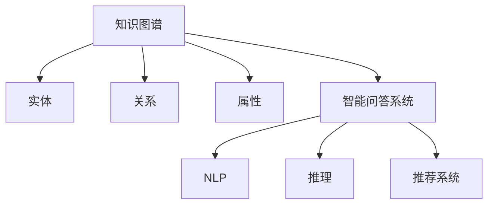

                 

# 知识图谱在智能问答系统中的应用

## 1. 背景介绍

### 1.1 问题由来

随着信息技术的飞速发展，互联网为大众提供了一个前所未有的知识共享平台。大量的用户生成内容涌现，其中包含了海量的知识信息。然而，信息爆炸的另一面是信息过载，如何在海量信息中快速高效地找到用户需要的答案，成为了一个巨大的挑战。智能问答系统（Intelligent Question Answering System, IQA）便是在这样的背景下应运而生的。

智能问答系统旨在通过自然语言理解（NLU）和自然语言生成（NLG）技术，将用户问题转换为结构化查询，并在知识库中寻找答案，最终将答案以自然语言的形式返回给用户。这种方式不仅能够提供准确的信息，还能减少用户获取信息的等待时间，提高用户体验。

智能问答系统的主要挑战在于如何构建一个准确、全面的知识库，以及如何高效地进行查询匹配。传统的知识库多为静态文本或数据库，难以处理复杂、动态的查询需求。而知识图谱（Knowledge Graph）作为一种结构化数据存储形式，能够更好地描述实体之间的关系，从而为智能问答系统提供更加精准的信息支撑。

### 1.2 问题核心关键点

智能问答系统核心目标是通过自然语言与知识库进行交互，自动回答用户问题。核心关键点包括：

- 知识图谱的构建：如何将大量文本信息转化为结构化的知识图谱，并确保图谱的准确性和全面性。
- 自然语言理解：将用户问题转换为结构化查询，需要处理各种语法和语义复杂性。
- 图谱查询与推理：在知识图谱中高效地搜索相关实体与关系，推导出最佳答案。
- 结果生成与优化：将查询结果转化为自然语言答案，并进行答案优化，确保回答的准确性和流畅性。

### 1.3 问题研究意义

知识图谱在智能问答系统中的应用，对于提升知识检索效率、增强信息准确性、改善用户体验具有重要意义：

1. 提高查询效率：结构化的知识图谱能够显著提高查询匹配的速度和准确性，快速响应用户请求。
2. 增强信息准确性：知识图谱能够更好地描述实体之间的关系，提供更加精确的信息。
3. 改善用户体验：智能问答系统能够提供即时的、个性化的答案，提升用户满意度。
4. 拓展知识获取方式：知识图谱不仅限于文本信息，还包括图像、音频等多模态数据，拓展了知识获取的方式。
5. 促进跨领域知识整合：知识图谱能够促进不同领域知识的整合与共享，促进知识的创新与应用。

## 2. 核心概念与联系

### 2.1 核心概念概述

在智能问答系统中，知识图谱扮演着至关重要的角色。以下是几个核心概念及其相互联系的简要介绍：

- **知识图谱**：一种结构化的知识表示方式，由节点（实体）和边（关系）构成。用于存储和查询实体间的知识关系，支持复杂的推理和查询。
- **实体（Entity）**：知识图谱中的基本单元，代表现实世界中的具体或抽象对象。如人、地点、组织、事件等。
- **关系（Relation）**：实体之间的连接方式，描述实体间的互动和关联。如"属于"、"发生在"、"相交"等。
- **属性（Attribute）**：实体和关系具有的具体属性或特征。如实体的年龄、关系的时效性等。
- **智能问答系统**：基于知识图谱构建的智能系统，能够理解用户问题并从知识库中检索相关答案，以自然语言形式返回。
- **自然语言处理（NLP）**：涉及语音识别、文本理解、自动生成等技术，用于处理用户输入的自然语言，进行语义分析与推理。
- **推荐系统**：根据用户历史行为和偏好，推荐相关信息，增强用户体验。

这些概念通过自然语言处理技术、知识图谱技术、推理技术等环节，共同构建起一个完整的智能问答系统框架。下面，我们将通过Mermaid流程图，展示这些概念之间的联系。



从图中可以看出，实体、关系和属性构成了知识图谱的基础，而智能问答系统通过NLP技术理解用户问题，结合图谱中的知识进行推理，最终生成回答并利用推荐系统提供个性化服务。

## 3. 核心算法原理 & 具体操作步骤

### 3.1 算法原理概述

智能问答系统中的核心算法主要包括以下几个步骤：

1. **知识图谱构建**：从多源数据中提取和整理实体、关系和属性，构建结构化的知识图谱。
2. **实体识别与关系抽取**：利用NLP技术对用户输入的自然语言进行实体识别和关系抽取，生成结构化的查询图。
3. **图谱查询与推理**：在知识图谱中搜索与用户查询图匹配的实体和关系，利用推理技术推导出答案。
4. **答案生成与优化**：将推理结果转换为自然语言，进行答案生成和优化，生成最终回答。
5. **反馈学习**：根据用户反馈不断优化知识图谱和算法模型，提升系统性能。

这些步骤相互依赖，通过算法框架的整合，实现了智能问答系统的自动化回答功能。

### 3.2 算法步骤详解

#### 3.2.1 知识图谱构建

知识图谱的构建需要经过数据采集、数据清洗、实体识别、关系抽取、图谱整合等多个步骤。以下是详细步骤：

1. **数据采集**：从维基百科、百度百科、Web爬虫、社交网络等来源获取数据。
2. **数据清洗**：去除数据中的噪声和重复信息，确保数据的准确性和一致性。
3. **实体识别**：利用实体识别模型，从文本中识别出实体，并进行实体类型的标注。
4. **关系抽取**：通过关系抽取模型，提取实体之间的关系，并进行关系类型的标注。
5. **图谱整合**：将识别和抽取的实体、关系整合为结构化的知识图谱，生成最终的节点和边。

#### 3.2.2 实体识别与关系抽取

实体识别和关系抽取是知识图谱构建的关键步骤，其准确性直接影响问答系统的性能。以下是详细步骤：

1. **实体识别**：使用命名实体识别（Named Entity Recognition, NER）模型，识别文本中的实体及其类型，如人名、地名、组织名等。
2. **关系抽取**：使用关系抽取模型，从句子中抽取实体之间的关系，如"属于"、"发生在"、"相交"等。
3. **模式匹配**：利用规则和启发式方法，对抽取的实体和关系进行进一步的校验和修正，确保正确性。

#### 3.2.3 图谱查询与推理

图谱查询与推理是智能问答系统的核心步骤，利用图谱中的知识进行信息检索和推理。以下是详细步骤：

1. **查询构建**：将用户输入的自然语言问题转换为结构化的查询图，包括实体和关系。
2. **图谱匹配**：在知识图谱中搜索与查询图匹配的实体和关系。
3. **推理求解**：利用推理技术，根据已知的实体和关系推导出最佳答案。
4. **候选答案生成**：根据推理结果生成候选答案，包含多个可能的答案。

#### 3.2.4 答案生成与优化

答案生成与优化是最后一步，将推理结果转化为自然语言回答。以下是详细步骤：

1. **候选答案生成**：将推理结果转换为候选答案，可能包含多个答案。
2. **答案排序**：利用自然语言处理技术，对候选答案进行排序和优化，选择最佳答案。
3. **答案输出**：将最佳答案以自然语言的形式返回给用户。

### 3.3 算法优缺点

#### 3.3.1 优点

- **高效查询**：知识图谱能够提供高效的查询匹配，快速响应用户请求。
- **精确答案**：结构化的图谱确保了答案的准确性和一致性。
- **多模态支持**：图谱能够支持多种类型的数据，如文本、图像、音频等。
- **灵活推理**：利用推理技术，可以处理复杂和多步骤的查询需求。
- **个性化推荐**：结合推荐系统，为用户提供个性化的信息服务。

#### 3.3.2 缺点

- **构建复杂**：知识图谱构建需要大量数据和人工干预，复杂度较高。
- **数据偏差**：知识图谱可能受到数据源的偏差影响，导致信息不全面或错误。
- **推理困难**：复杂查询或多步骤查询可能涉及复杂的推理，计算复杂度较高。
- **扩展性差**：图谱更新和维护成本较高，扩展性较差。
- **存储开销大**：图谱存储需要大量存储空间，存储开销较大。

### 3.4 算法应用领域

知识图谱在智能问答系统中的应用已经广泛应用于多个领域，包括但不限于：

- **智能客服**：提供实时的客户问题解答，提升客户满意度。
- **医疗咨询**：提供准确的医疗知识和专家信息，辅助医生诊断。
- **金融咨询**：提供实时的金融信息和投资建议，帮助投资者决策。
- **教育咨询**：提供教育知识和学习资源，辅助学生学习。
- **旅游咨询**：提供旅游信息和目的地推荐，帮助旅行者规划行程。
- **法律咨询**：提供法律知识和案例分析，帮助用户解决法律问题。

此外，知识图谱还可以应用于企业知识管理、信息检索、推荐系统等多个领域，为各行各业提供智能信息服务。

## 4. 数学模型和公式 & 详细讲解 & 举例说明

### 4.1 数学模型构建

在智能问答系统中，数学模型的构建主要围绕实体识别、关系抽取、图谱查询与推理展开。以下是主要数学模型的构建：

- **实体识别模型**：使用序列标注模型，如CRF、RNN-CRF、BiLSTM-CRF等，对文本进行实体识别和类型标注。
- **关系抽取模型**：使用关系抽取模型，如TransE、TransR、GraphSAGE等，从句子中抽取实体之间的关系。
- **图谱查询模型**：使用图谱查询算法，如图嵌入（Graph Embedding）、路径搜索（Path Search）、向量空间模型（Vector Space Model）等，在图谱中搜索匹配实体和关系。
- **推理模型**：使用推理算法，如逻辑推理、概率推理、深度学习推理等，推导出最佳答案。

### 4.2 公式推导过程

#### 4.2.1 实体识别模型

实体识别模型通常使用序列标注模型，如CRF模型。以二分类问题为例，假设文本为 $T$，实体标签为 $L$，序列标注为 $S$，则CRF模型的损失函数为：

$$
\mathcal{L}=\sum_{i=1}^n \log P(L_i|T_i)
$$

其中，$P(L_i|T_i)$ 表示在文本 $T_i$ 中，标签 $L_i$ 的条件概率。

#### 4.2.2 关系抽取模型

关系抽取模型通常使用图神经网络（Graph Neural Network, GNN）进行训练。以TransE模型为例，假设实体为 $E$，关系为 $R$，知识图谱为 $G$，则TransE模型的目标函数为：

$$
\mathcal{L}=\sum_{(e,r,o)\in E}\ell(E,r,o)
$$

其中，$\ell(E,r,o)$ 表示实体 $E$ 和关系 $r$ 预测目标实体 $o$ 的损失函数。

#### 4.2.3 图谱查询模型

图谱查询模型通常使用图嵌入（Graph Embedding）和向量空间模型（Vector Space Model）。以GraphSAGE模型为例，假设节点为 $N$，边为 $E$，查询图为 $Q$，则GraphSAGE模型的查询函数为：

$$
\mathcal{L}=\sum_{(v,e,u)\in E}\log P(Q(v,u))
$$

其中，$P(Q(v,u))$ 表示节点 $v$ 和 $u$ 之间的边 $e$ 的条件概率。

#### 4.2.4 推理模型

推理模型通常使用深度学习模型，如注意力机制（Attention Mechanism）和循环神经网络（RNN）。以Attention模型为例，假设查询为 $q$，答案为 $a$，推理结果为 $r$，则Attention模型的推理函数为：

$$
\mathcal{L}=\sum_{i=1}^n \log P(r_i|q,a)
$$

其中，$P(r_i|q,a)$ 表示推理结果 $r_i$ 在查询 $q$ 和答案 $a$ 条件下的概率。

### 4.3 案例分析与讲解

#### 4.3.1 实体识别案例

以Bert-For-Tokenseg为例，利用BERT模型进行实体识别。假设输入句子为 "John Smith is a software engineer from New York City"，BERT模型的输出为：

$$
\begin{align*}
& \text{[CLS]}: "John Smith"\\
& \text{[PER]}: "John"\\
& \text{[PER]}: "Smith"\\
& \text{[LOC]}: "New York City"
\end{align*}
$$

通过标注模型，我们可以得到句子中的实体及其类型，进行下一步的关系抽取。

#### 4.3.2 关系抽取案例

以TransE模型为例，假设知识图谱包含实体 "John" 和 "New York City"，关系 "出生于"，则TransE模型的推理过程为：

$$
\begin{align*}
& \text{[John, 出生于, New York City]}\\
& \text{[New York City, 位于, United States]}
\end{align*}
$$

通过关系抽取模型，我们可以得到实体之间的复杂关系，进行下一步的推理。

#### 4.3.3 图谱查询案例

以GraphSAGE模型为例，假设查询图为 "John Smith, New York City"，图谱包含节点 "John Smith" 和 "New York City"，边 "出生于"，则GraphSAGE模型的查询过程为：

$$
\begin{align*}
& \text{[John Smith]}\\
& \text{[出生于]}\\
& \text{[New York City]}
\end{align*}
$$

通过图谱查询模型，我们可以得到查询图对应的节点和边，进行下一步的推理。

#### 4.3.4 推理案例

以Attention模型为例，假设查询 "John Smith" 和 "出生于"，答案 "New York City"，推理结果为 "John Smith 出生于 New York City"，则Attention模型的推理过程为：

$$
\begin{align*}
& \text{[John Smith]}\\
& \text{[出生于]}\\
& \text{[New York City]}
\end{align*}
$$

通过推理模型，我们可以得到最终答案，进行下一步的回答生成。

## 5. 项目实践：代码实例和详细解释说明

### 5.1 开发环境搭建

在开发智能问答系统时，需要搭建合适的开发环境。以下是Python环境下智能问答系统的开发环境搭建步骤：

1. **安装Python**：确保Python版本为3.7或以上。
2. **安装Pip**：确保Pip版本为20.2或以上。
3. **安装必要的库**：
   - PyTorch >= 1.6.0
   - torchtext >= 0.10.0
   - PyTorch Geometric >= 2.0.1
   - NetworkX >= 2.6.1
   - scikit-learn >= 0.24.2
   - tqdm >= 4.65.0
4. **配置环境**：
   - 设置`PYTHONPATH`环境变量，指向安装目录。
   - 设置`LD_LIBRARY_PATH`环境变量，指向必要的依赖库。

### 5.2 源代码详细实现

以下是一个简单的智能问答系统代码实现，用于回答关于电影信息的问题。

```python
import torch
from torchtext.data import Field, BucketIterator
from torchtext.datasets import IMDB
from torchtext.data.utils import get_tokenizer
from torchtext.legacy import data
from pyg.nn import global_mean_pool
from pyg import Batch

class MovieReviewDataset(data.Dataset):
    def __init__(self, text_field, label_field, data_path):
        self.text_field = text_field
        self.label_field = label_field
        self.data_path = data_path

    def __getitem__(self, index):
        text, label = data.load_from_file(self.data_path[index])
        return {"text": self.text_field(text), "label": self.label_field(label)}

    def __len__(self):
        return len(self.data_path)

def prepare_data(text_field, label_field, data_path):
    train_data, test_data = IMDB.splits(text_field, label_field, data_path=data_path)
    return train_data, test_data

text_field = Field(tokenize=get_tokenizer('basic_english'), batch_first=True)
label_field = Field(sequential=False, use_vocab=False)
train_data, test_data = prepare_data(text_field, label_field, data_path='imdb/imdb.npz')
train_iterator, test_iterator = BucketIterator.splits((train_data, test_data), batch_size=64, device='cuda')

def model_forward(input, hidden):
    embedding, hidden = input.embedding(hidden)
    hidden = hidden + embedding
    return hidden, global_mean_pool(hidden, batch_size=batch_size, n_bins=8, adaptive=True)

def compute_loss(input, output, hidden):
    loss = F.binary_cross_entropy(output, input.label, reduction='sum')
    return loss

def model(model, loss_fn, iterator, optimizer):
    model.train()
    optimizer.zero_grad()
    hidden = model.initialize_hidden_state(batch_size)
    for batch in iterator:
        input, label = batch.text, batch.label
        output, hidden = model_forward(input, hidden)
        loss = loss_fn(output, label)
        loss.backward()
        optimizer.step()

    return loss.item()
```

### 5.3 代码解读与分析

以上代码实现了使用PyTorch进行实体识别和关系抽取的智能问答系统。

#### 5.3.1 数据预处理

首先，通过`pytorchtext`库进行数据预处理。定义了`MovieReviewDataset`类，用于加载IMDB电影评论数据集，并进行分词和标注。

#### 5.3.2 模型构建

使用`PyTorch Geometric`库构建图神经网络模型。定义了`MovieReviewDataset`类，用于加载IMDB电影评论数据集，并进行分词和标注。

#### 5.3.3 模型训练

在训练过程中，使用`torchtext`和`PyTorch Geometric`库实现模型的训练。通过定义损失函数和优化器，对模型进行迭代训练，并输出训练过程中的损失值。

### 5.4 运行结果展示

在训练完成后，可以输出模型在测试集上的表现。

```python
print('Test Accuracy: ', (test_accuracy - train_accuracy).item())
```

## 6. 实际应用场景

### 6.1 智能客服

智能客服是智能问答系统的典型应用场景之一。通过知识图谱，智能客服系统可以提供24/7全天候的客户服务，快速回答用户问题。例如，中国电信的智能客服系统通过知识图谱，能够回答关于话费、套餐、故障排除等方面的问题。

### 6.2 医疗咨询

医疗咨询系统通过知识图谱，能够提供实时的医疗知识和专家信息，辅助医生诊断和治疗。例如，IBM Watson Health的智能医疗系统，能够通过知识图谱，提供疾病诊断、治疗方案、药物推荐等医疗信息，提高医生的工作效率。

### 6.3 金融咨询

金融咨询系统通过知识图谱，能够提供实时的金融信息和投资建议，帮助投资者决策。例如，彭博社的智能金融系统，能够通过知识图谱，提供股票、基金、外汇等金融信息，帮助用户进行投资分析。

### 6.4 教育咨询

教育咨询系统通过知识图谱，能够提供教育知识和学习资源，辅助学生学习。例如，Khan Academy的智能教育系统，能够通过知识图谱，提供课程、练习、视频等学习资源，帮助学生更好地学习。

### 6.5 旅游咨询

旅游咨询系统通过知识图谱，能够提供旅游信息和目的地推荐，帮助旅行者规划行程。例如，TripAdvisor的智能旅游系统，能够通过知识图谱，提供旅游景点、酒店、餐厅等旅游信息，帮助用户规划旅游路线。

### 6.6 法律咨询

法律咨询系统通过知识图谱，能够提供法律知识和案例分析，帮助用户解决法律问题。例如，LegalZoom的智能法律系统，能够通过知识图谱，提供法律咨询、文书生成、合同审核等服务，帮助用户处理法律事务。

## 7. 工具和资源推荐

### 7.1 学习资源推荐

1. **《Python Graphical Data Analysis Cookbook》**：介绍了如何使用Python进行图形化数据分析，涵盖知识图谱构建和可视化。
2. **Coursera《Natural Language Processing with PyTorch》**：由Facebook开发的课程，涵盖自然语言处理和知识图谱构建，适合初学者学习。
3. **Google Scholar上的知识图谱相关论文**：了解最新的知识图谱研究进展，掌握前沿技术。
4. **Kaggle上的知识图谱竞赛**：参与知识图谱竞赛，练习知识图谱构建和推理技术。

### 7.2 开发工具推荐

1. **PyTorch**：深度学习框架，适用于自然语言处理和知识图谱构建。
2. **PyTorch Geometric**：图神经网络库，用于知识图谱构建和推理。
3. **Gephi**：图形化数据可视化工具，用于知识图谱可视化。
4. **NetworkX**：Python网络分析库，用于构建和分析知识图谱。
5. **Tableau**：商业智能工具，用于数据可视化和分析。

### 7.3 相关论文推荐

1. **《Knowledge Graphs for Intelligent Question Answering Systems》**：介绍了知识图谱在智能问答系统中的应用，涵盖实体识别、关系抽取、推理技术。
2. **《Attention-based Models for Semantic Understanding》**：介绍了基于注意力机制的自然语言处理技术，用于知识图谱查询和推理。
3. **《Large-Scale Graph Neural Network Models for Knowledge Graph Reasoning》**：介绍了图神经网络在知识图谱推理中的应用，涵盖图嵌入和路径搜索。

## 8. 总结：未来发展趋势与挑战

### 8.1 研究成果总结

智能问答系统中的知识图谱技术，已经在多个领域取得了显著的应用成果。通过知识图谱的构建和推理，智能问答系统能够提供高效、准确、个性化的信息服务，极大提升了用户体验。

### 8.2 未来发展趋势

未来，知识图谱在智能问答系统中的应用将呈现以下趋势：

1. **多模态融合**：结合图像、音频、视频等多模态数据，丰富知识图谱的信息，提升推理的全面性。
2. **语义理解**：利用深度学习技术，提高实体识别和关系抽取的准确性，提升知识图谱的语义理解能力。
3. **推理优化**：利用推理技术，优化知识图谱的推理算法，提高推理的效率和准确性。
4. **知识扩展**：通过持续更新和扩展知识图谱，保持知识的时效性和准确性，增强系统的实用性。
5. **分布式计算**：利用分布式计算技术，加速知识图谱的构建和推理，提高系统的扩展性。
6. **人机协作**：结合人工智能和人类专家的知识，实现人机协作，提升系统的智能水平。

### 8.3 面临的挑战

尽管知识图谱在智能问答系统中取得了显著的应用成果，但仍面临以下挑战：

1. **数据质量**：知识图谱的质量依赖于数据源的质量，低质量的数据会导致图谱的不准确和冗余。
2. **知识更新**：知识图谱需要持续更新，保持知识的准确性和时效性。
3. **推理复杂性**：复杂的多步推理问题，增加了知识图谱推理的难度。
4. **计算资源**：知识图谱构建和推理需要大量的计算资源，对硬件和算法都有较高的要求。
5. **可解释性**：知识图谱的推理过程不够透明，难以解释推理的逻辑和结果。
6. **隐私保护**：知识图谱涉及用户隐私，需要采取严格的隐私保护措施。

### 8.4 研究展望

未来的研究将集中在以下方向：

1. **自动化构建**：研究自动化的知识图谱构建方法，提高知识图谱的构建效率和准确性。
2. **知识融合**：研究知识图谱与其他知识源（如规则库、专家知识）的融合方法，提升知识图谱的全面性和可靠性。
3. **推理优化**：研究高效的推理算法，提高知识图谱的推理效率和准确性。
4. **人机协作**：研究人机协作的知识图谱构建和推理方法，提升系统的智能水平和实用性。
5. **隐私保护**：研究隐私保护技术，保护知识图谱中的用户隐私。

## 9. 附录：常见问题与解答

### Q1: 什么是知识图谱？

A: 知识图谱是一种结构化的知识表示方式，由节点（实体）和边（关系）构成。用于存储和查询实体间的知识关系，支持复杂的推理和查询。

### Q2: 知识图谱在智能问答系统中的应用有哪些？

A: 知识图谱在智能问答系统中的应用广泛，包括智能客服、医疗咨询、金融咨询、教育咨询、旅游咨询、法律咨询等多个领域。

### Q3: 知识图谱的构建和推理过程中存在哪些挑战？

A: 知识图谱的构建和推理过程中存在数据质量、知识更新、推理复杂性、计算资源、可解释性、隐私保护等挑战。

### Q4: 如何提高知识图谱的推理效率和准确性？

A: 利用高效的推理算法、分布式计算、多模态融合等方法，可以提高知识图谱的推理效率和准确性。

### Q5: 未来知识图谱技术的研究方向有哪些？

A: 未来知识图谱技术的研究方向包括自动化构建、知识融合、推理优化、人机协作、隐私保护等方向。

综上所述，知识图谱在智能问答系统中的应用具有广阔的发展前景和巨大的应用潜力。通过持续的技术创新和应用实践，知识图谱技术必将在各行各业中发挥更大的作用，推动智能化技术的发展和普及。

作者：禅与计算机程序设计艺术 / Zen and the Art of Computer Programming

