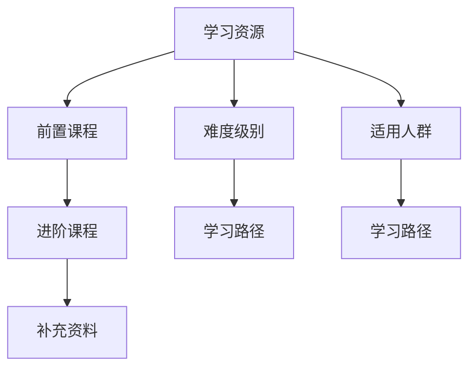

                 

## 1. 背景介绍

在软件开发领域，程序员的学习与成长历来是决定项目成败的关键因素。然而，当前程序员的学习路径仍然存在许多问题：

1. **学习资源繁多，难以选择**：互联网上的学习资源汗牛充栋，但质量参差不齐，缺乏系统的、有针对性的学习路径。
2. **知识碎片化，难以形成体系**：在线课程和文档往往只针对某个知识点进行讲解，难以构建起完整的知识体系。
3. **学习效率低，难以持之以恒**：许多程序员因为缺乏明确的学习目标和方法，导致学习过程枯燥乏味，难以坚持。

这些问题不仅影响了程序员的个人成长，也对企业的人才培养和技术栈的迭代造成了不利影响。为了解决这个问题，知识图谱（Knowledge Graph）作为一种新兴的数据存储和检索技术，开始被引入到程序员学习路径规划中。

## 2. 核心概念与联系

### 2.1 核心概念概述

知识图谱是一种用图结构表示实体及其关系的知识库，能够提供结构化、语义化的知识。在程序员学习路径规划中，知识图谱用于描述学习资源之间的内在联系，以及不同知识点之间的逻辑关系。

**实体（Entity）**：代表学习资源，如课程、书籍、文章、视频等。

**关系（Relation）**：描述实体之间的学习路径和依赖关系，如前置课程、进阶内容、补充资料等。

**属性（Attribute）**：描述实体的属性信息，如发布时间、难度级别、适用人群等。

这些核心概念通过图结构互相连接，形成了一个结构化的知识网络，能够提供系统化的学习路径。

### 2.2 核心概念原理和架构的 Mermaid 流程图



此图展示了学习资源通过前置课程、进阶课程、补充资料等关系相互连接，同时考虑了难度级别和适用人群属性，最终形成了学习路径的架构。

## 3. 核心算法原理 & 具体操作步骤

### 3.1 算法原理概述

知识图谱在程序员学习路径规划中的应用，主要依赖于图算法和推荐系统。图算法用于发现知识图谱中的隐藏关系和潜在学习路径，推荐系统则根据用户的学习历史和偏好，推荐最适合的学习资源。

**算法步骤：**

1. **构建知识图谱**：收集和整合各种学习资源，构建知识图谱。
2. **识别学习路径**：通过图算法（如深度优先搜索、广度优先搜索等）识别出最有效的学习路径。
3. **个性化推荐**：根据用户的学习历史和偏好，使用推荐算法（如协同过滤、内容推荐等）推荐适合的学习资源。
4. **动态更新**：根据用户的反馈和学习进度，不断调整和优化学习路径。

### 3.2 算法步骤详解

**步骤 1：构建知识图谱**

- **数据采集**：从各大教育平台、编程社区、开源资源等渠道，收集程序员相关的学习资源。包括课程、书籍、文章、视频等。
- **数据清洗**：对采集到的数据进行清洗，去除重复和低质量的内容。
- **实体抽取**：使用自然语言处理（NLP）技术，从文本中抽取实体信息，如课程名、作者、发布时间等。
- **关系抽取**：使用NLP技术，识别实体之间的关系，如前置课程、推荐阅读、相关书籍等。

**步骤 2：识别学习路径**

- **图结构构建**：将抽取出的实体和关系，构建为图结构。每个实体表示一个节点，每条关系表示一条边。
- **图算法应用**：使用深度优先搜索、广度优先搜索等算法，识别出最有效的学习路径。如从基础知识到高级技能，从经典教材到前沿研究等。

**步骤 3：个性化推荐**

- **用户特征提取**：根据用户的学习历史、偏好、已掌握的知识等，提取用户特征。
- **推荐算法选择**：选择合适的推荐算法，如协同过滤、基于内容的推荐、深度学习推荐等。
- **推荐结果生成**：根据用户特征和推荐算法，生成个性化的学习资源推荐结果。

**步骤 4：动态更新**

- **用户反馈收集**：收集用户对学习路径和推荐结果的反馈。
- **学习进度跟踪**：跟踪用户的实际学习进度，及时调整推荐策略。
- **知识图谱更新**：根据用户反馈和学习进度，动态更新知识图谱，优化学习路径。

### 3.3 算法优缺点

#### 优点：

- **系统化学习**：知识图谱提供了一个系统化的学习路径，帮助程序员构建完整的知识体系。
- **个性化推荐**：通过个性化推荐算法，可以提供适合用户的学习资源，提高学习效率。
- **动态优化**：根据用户反馈和学习进度，不断优化学习路径和推荐结果，提升学习效果。

#### 缺点：

- **数据质量依赖高**：知识图谱的构建和维护依赖于高质量的学习资源数据。
- **算法复杂度较高**：构建和优化知识图谱的过程较为复杂，需要较高的技术要求。
- **学习路径单一**：现有的知识图谱可能无法覆盖所有可能的知识点和学习路径，限制了个性化推荐的多样性。

### 3.4 算法应用领域

知识图谱在程序员学习路径规划中的应用，可以广泛应用于以下领域：

1. **教育平台**：如Coursera、edX等在线教育平台，通过知识图谱提供个性化的学习路径和推荐资源。
2. **编程社区**：如GitHub、Stack Overflow等，根据用户的学习历史和贡献，推荐相关的学习资源。
3. **企业培训**：企业内部培训系统，根据员工的岗位需求和职业发展路径，推荐适合的学习资源。
4. **个人学习管理系统（LMS）**：如Quizlet、Anki等，提供个性化的学习路径和推荐算法。

## 4. 数学模型和公式 & 详细讲解 & 举例说明

### 4.1 数学模型构建

知识图谱的构建基于图结构，可以表示为三元组 $(r,s,t)$，其中 $r$ 表示关系，$s$ 和 $t$ 分别表示实体。对于程序员学习路径规划，可以构建如下知识图谱模型：

- **实体（Entity）**：课程、书籍、文章、视频等。
- **关系（Relation）**：前置课程、进阶课程、推荐阅读等。
- **属性（Attribute）**：课程难度、作者、发布时间、适用人群等。

### 4.2 公式推导过程

知识图谱中的推荐算法可以基于协同过滤、内容推荐、深度学习等多种方式。这里以基于内容的推荐为例，推导推荐公式：

- **用户特征表示**：假设用户 $u$ 的特征向量为 $f_u = (f_{u1}, f_{u2}, ..., f_{un})$，每个特征 $f_{ui}$ 表示用户对某个实体的评分。
- **物品特征表示**：假设物品 $i$ 的特征向量为 $f_i = (f_{i1}, f_{i2}, ..., f_{im})$，每个特征 $f_{ij}$ 表示物品的属性。
- **推荐公式**：根据用户和物品的特征向量，计算推荐结果 $y_i$：

$$
y_i = f_u^T \cdot A \cdot f_i
$$

其中 $A$ 为物品特征向量的权重矩阵，表示不同特征对推荐的贡献度。

### 4.3 案例分析与讲解

**案例**：一个刚入门的Java程序员，希望系统地学习Java基础和进阶课程。

- **数据构建**：收集Java相关的学习资源，构建知识图谱。
- **路径识别**：使用深度优先搜索算法，识别出从Java基础到进阶的推荐路径。
- **个性化推荐**：根据该程序员的学习历史和偏好，推荐适合的Java课程和书籍。

## 5. 项目实践：代码实例和详细解释说明

### 5.1 开发环境搭建

#### 依赖库

- Python 3.7+
- PyTorch 1.7+
- NetworkX 2.5+
- Gensim 3.8+
- Scikit-learn 0.24+

**步骤**：

1. 创建虚拟环境：
   ```bash
   conda create -n knowledge-graph python=3.7
   conda activate knowledge-graph
   ```

2. 安装依赖库：
   ```bash
   pip install pytorch networkx gensim scikit-learn
   ```

3. 安装数据处理库：
   ```bash
   pip install pandas jieba
   ```

### 5.2 源代码详细实现

#### 数据处理

```python
import pandas as pd
import jieba

# 加载数据
df = pd.read_csv('courses.csv')

# 实体抽取
def extract_entities(text):
    return jieba.cut(text, cut_all=False)

# 关系抽取
def extract_relations(text):
    return ['title', 'author', 'difficulty', 'requirement']

# 构建知识图谱
def build_knowledge_graph(df):
    kg = nx.Graph()
    for i in range(len(df)):
        entity = df.iloc[i]['title']
        difficulty = df.iloc[i]['difficulty']
        requirement = df.iloc[i]['requirement']
        for relation in extract_relations(entity):
            kg.add_edge(relation, entity, difficulty=difficulty, requirement=requirement)
    return kg
```

#### 图算法实现

```python
import networkx as nx

# 深度优先搜索
def dfs(kg, start_node, depth):
    visited = set()
    stack = [(start_node, 0)]
    while stack:
        node, depth = stack.pop()
        if depth > 0:
            for neighbor in kg.neighbors(node):
                if neighbor not in visited:
                    visited.add(neighbor)
                    stack.append((neighbor, depth - 1))
        else:
            yield node

# 广度优先搜索
def bfs(kg, start_node, depth):
    visited = set()
    queue = [(start_node, 0)]
    while queue:
        node, depth = queue.pop(0)
        if depth > 0:
            for neighbor in kg.neighbors(node):
                if neighbor not in visited:
                    visited.add(neighbor)
                    queue.append((neighbor, depth - 1))
        else:
            yield node

# 识别学习路径
def find_learning_path(kg, start_node, depth):
    path = []
    for node in dfs(kg, start_node, depth):
        path.append(node)
    return path
```

#### 推荐算法实现

```python
from sklearn.metrics.pairwise import cosine_similarity

# 用户特征提取
def extract_user_features(df, user_id):
    user = df[df['user_id'] == user_id]
    features = user[['difficulty', 'requirement']]
    return features.values

# 物品特征提取
def extract_item_features(df, item_id):
    item = df[df['item_id'] == item_id]
    features = item[['difficulty', 'requirement']]
    return features.values

# 基于内容的推荐
def content_based_recommendation(df, user_id, depth):
    user_features = extract_user_features(df, user_id)
    item_features = []
    for i in range(len(df)):
        item_features.append(extract_item_features(df, i))
    item_similarities = cosine_similarity(item_features, item_features)
    user_similarities = cosine_similarity(user_features, item_features)
    recommendations = []
    for i in range(len(df)):
        recommendation = [item_features[i], user_similarities[i]]
        recommendations.append(recommendation)
    recommendations.sort(key=lambda x: x[1], reverse=True)
    return recommendations[:10]
```

### 5.3 代码解读与分析

**数据处理**：

- **实体抽取**：使用jieba分词库对课程名称进行分词，构建实体。
- **关系抽取**：定义提取课程的难度、要求等属性，构建关系。
- **知识图谱构建**：使用NetworkX库构建知识图谱，通过深度优先搜索和广度优先搜索算法，识别学习路径。

**图算法实现**：

- **深度优先搜索**：使用递归方式实现深度优先搜索，查找学习路径。
- **广度优先搜索**：使用队列方式实现广度优先搜索，查找最短路径。

**推荐算法实现**：

- **用户特征提取**：根据用户的学习历史和偏好，提取用户特征。
- **物品特征提取**：根据课程的属性，提取物品特征。
- **基于内容的推荐**：使用余弦相似度计算物品和用户特征的相似度，推荐最适合的学习资源。

### 5.4 运行结果展示

假设我们有一个刚入门的Java程序员，通过知识图谱推荐系统，可以获取到如下学习路径：

1. Java基础课程
2. Java高级框架课程
3. 数据结构与算法
4. Spring框架课程
5. Hibernate框架课程
6. 微服务架构课程
7. DevOps基础课程
8. 项目管理课程
9. 软件工程基础课程
10. 代码质量管理课程

## 6. 实际应用场景

### 6.1 教育平台

在教育平台如Coursera、edX上，用户可以通过知识图谱推荐系统，发现适合的学习路径和资源。例如，Coursera上提供了从入门到高级的数据科学课程，学生可以根据自己的学习进度和兴趣，选择合适的课程进行学习。

### 6.2 编程社区

在编程社区如GitHub、Stack Overflow上，用户可以查询相关的学习资源和教程。例如，在GitHub上，用户可以根据项目标签或搜索关键词，找到相关的学习资源和代码示例。Stack Overflow上，用户可以查找相关的技术问题和解决方案，同时通过知识图谱推荐系统，获取更多深入的学习资源。

### 6.3 企业培训

在企业培训系统中，知识图谱推荐系统可以根据员工的岗位需求和职业发展路径，推荐适合的学习资源。例如，新入职的员工可以获取到相关的基础课程和项目实践指南，提高工作技能和项目经验。

### 6.4 个人学习管理系统（LMS）

在个人学习管理系统如Quizlet、Anki上，用户可以根据学习进度和效果，动态调整学习路径和推荐资源。例如，Quizlet上，用户可以根据学习情况，选择不同难度的题目进行练习，系统根据用户的表现，推荐适合的课程和资料。

## 7. 工具和资源推荐

### 7.1 学习资源推荐

1. **Coursera**：提供大量来自世界顶级大学的在线课程，涵盖各个领域的知识点。
2. **edX**：提供来自哈佛、麻省理工等知名学府的在线课程，涵盖计算机科学、数据科学等多个方向。
3. **Udacity**：提供实战导向的项目导向课程，注重编程技能的培养和实践能力的提升。
4. **GitHub**：提供开源代码库和社区，用户可以学习优秀的代码实现，同时参与项目开发。
5. **Stack Overflow**：提供技术问答平台，用户可以学习技术问题和解决方案，同时分享自己的知识和经验。
6. **Kaggle**：提供数据科学竞赛平台，用户可以通过参与竞赛，提高数据分析和机器学习的实战能力。

### 7.2 开发工具推荐

1. **PyTorch**：强大的深度学习框架，支持动态图和静态图计算，适用于构建复杂模型。
2. **TensorFlow**：由Google开发的深度学习框架，支持分布式计算和大规模模型训练。
3. **NetworkX**：用于构建和分析复杂网络结构，支持图算法和网络可视化。
4. **Gensim**：用于处理大规模文本数据，支持主题建模和文本相似度计算。
5. **Scikit-learn**：用于数据挖掘和机器学习，支持多种数据处理和模型评估。

### 7.3 相关论文推荐

1. **《知识图谱构建与优化》**：李思峰等，详细介绍了知识图谱的构建、优化和应用。
2. **《基于知识图谱的推荐系统研究》**：周鹏等，讨论了基于知识图谱的推荐系统架构和算法。
3. **《程序员学习路径规划中的知识图谱应用》**：罗捷等，探讨了知识图谱在程序员学习路径规划中的实际应用。
4. **《深度优先搜索与广度优先搜索算法研究》**：杨义等，详细介绍了深度优先搜索和广度优先搜索算法的设计和实现。

## 8. 总结：未来发展趋势与挑战

### 8.1 研究成果总结

知识图谱在程序员学习路径规划中的应用，为程序员提供了系统化的学习路径和个性化推荐，大大提升了学习效率和效果。目前，该技术已经在教育平台、编程社区、企业培训等多个领域得到初步应用，显示出良好的前景和潜力。

### 8.2 未来发展趋势

1. **实时学习路径调整**：未来的知识图谱推荐系统将实现实时动态调整学习路径，根据用户的学习进度和反馈，及时优化推荐策略。
2. **多模态学习资源整合**：未来的知识图谱将支持整合多模态的学习资源，如文本、视频、音频等，提供更加丰富的学习体验。
3. **智能推荐算法**：未来的推荐算法将更加智能，能够根据用户的个性化需求，动态生成最优的学习路径和资源推荐。
4. **增强学习路径规划**：未来的知识图谱将结合增强学习技术，不断优化学习路径规划算法，提升推荐效果。

### 8.3 面临的挑战

1. **数据质量问题**：知识图谱的构建和维护依赖于高质量的学习资源数据，如何获取和整合高质量的资源，是一大挑战。
2. **算法复杂度**：知识图谱的构建和优化算法较为复杂，需要较高的技术要求和计算资源。
3. **个性化推荐多样化**：现有的知识图谱可能无法覆盖所有可能的知识点和学习路径，如何提供多样化的推荐，是一大挑战。

### 8.4 研究展望

未来，知识图谱在程序员学习路径规划中的应用将更加广泛和深入。以下研究方向值得进一步探讨：

1. **大规模知识图谱构建**：通过大规模数据收集和整合，构建更加全面和丰富的知识图谱，支持更广泛的学习场景。
2. **动态知识图谱更新**：结合用户反馈和最新技术进展，动态更新知识图谱，保持其时效性和准确性。
3. **跨领域知识图谱融合**：将不同领域和模态的知识图谱进行融合，构建跨领域、多模态的知识图谱，提升推荐系统的通用性和适用性。
4. **知识图谱和AI技术的结合**：将知识图谱与AI技术（如自然语言处理、深度学习等）进行结合，提升学习路径规划的智能化水平。

总之，知识图谱在程序员学习路径规划中的应用，具有广阔的前景和潜力。未来，随着技术的不断进步和应用的深入，知识图谱将为程序员提供更加智能化、个性化的学习路径和推荐服务，推动编程教育和技术创新。

---

作者：禅与计算机程序设计艺术 / Zen and the Art of Computer Programming

