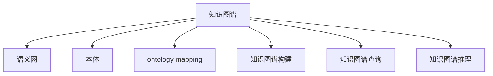
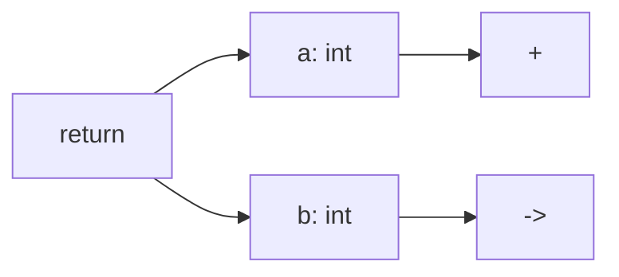

                 

## 1. 背景介绍

### 1.1 问题由来
在软件开发过程中，程序员需要不断学习新的编程语言、框架、工具和算法。这不仅要求程序员具备较强的学习能力，还需要管理好自身庞大的知识体系，以避免知识碎片化和遗忘。传统的信息管理和知识管理工具难以满足程序员对个性化、结构化、关联化知识的管理需求，尤其是在代码审查、项目协作、知识共享等方面。

近年来，随着知识图谱技术的快速发展，通过构建程序员的知识图谱，可以为程序员提供结构化的知识管理解决方案。知识图谱能够刻画程序员知识网络中的实体、关系和属性，通过查询和推理，能够高效地获取、整合和利用知识，提高编程效率和质量。

### 1.2 问题核心关键点
本文聚焦于知识图谱在程序员知识管理中的应用。知识图谱的应用可以包括以下几个方面：

- **代码知识管理**：构建程序员的代码库知识图谱，记录代码片段、注释、功能描述、API信息等，并通过图谱查询获取代码实现、功能调用、API文档等信息。
- **项目协作管理**：构建团队的知识图谱，记录项目设计、架构、文档、代码变更等信息，促进团队成员之间的知识共享和协作。
- **知识搜索与推荐**：基于程序员的知识图谱，提供代码搜索、知识推荐、问题解答等智能服务，帮助程序员解决编程问题，提高工作效率。

本文旨在介绍知识图谱在程序员知识管理中的应用，通过构建、查询和推理等关键技术，探讨如何为程序员提供更好的知识管理解决方案。

## 2. 核心概念与联系

### 2.1 核心概念概述

为了更好地理解知识图谱在程序员知识管理中的应用，本节将介绍几个密切相关的核心概念：

- **知识图谱**：通过语义网络的方式表示实体、属性和关系，将知识表示为节点和边，并利用图谱算法进行知识推理和检索。
- **语义网**：将传统网页搜索引擎发展到更加智能的语义理解水平，能够理解网页中的语义信息，并通过推理得出相关知识。
- **本体**：定义了领域内的实体、属性、关系等概念，并定义了概念之间的语义关系。
- ** ontology mapping**：将不同本体中的实体、属性和关系进行映射，实现不同数据源之间的知识融合。
- **知识图谱构建**：从结构化数据（如代码库、文档、项目架构等）中提取实体、属性和关系，并构建知识图谱。
- **知识图谱查询**：基于知识图谱，查询特定实体的信息、属性和关系，以获取需要的知识。
- **知识图谱推理**：通过对知识图谱进行推理，获取新的知识、发现潜在的关联和异常，提供更深层次的洞察。

这些核心概念之间的逻辑关系可以通过以下Mermaid流程图来展示：



这个流程图展示了几大核心概念之间的关系：

1. 知识图谱是构建在语义网的基础上，能够理解和表示实体、属性和关系。
2. 本体定义了领域内的概念及其语义关系，是知识图谱的重要组成部分。
3. ontology mapping实现了不同数据源之间的知识融合，扩大了知识图谱的应用范围。
4. 知识图谱构建从结构化数据中提取知识，为知识图谱查询和推理提供数据基础。
5. 知识图谱查询和推理能够获取和发现新的知识，为知识管理提供智能支持。

这些核心概念共同构成了知识图谱在程序员知识管理中的应用框架，使其能够有效地管理、查询和推理程序员的知识网络。

## 3. 核心算法原理 & 具体操作步骤
### 3.1 算法原理概述

知识图谱在程序员知识管理中的应用，主要依赖于知识图谱的构建、查询和推理三大核心技术。这些技术通过将程序员的知识表示为语义网络，实现对知识的高效管理和智能检索。

知识图谱构建（KG construction）是指从程序员的知识来源（如代码库、文档、项目架构等）中提取实体、属性和关系，并构建知识图谱的过程。知识图谱查询（KG query）是指基于知识图谱，查询特定实体的信息、属性和关系，以获取需要的知识。知识图谱推理（KG reasoning）是指通过对知识图谱进行推理，获取新的知识、发现潜在的关联和异常，提供更深层次的洞察。

### 3.2 算法步骤详解

知识图谱在程序员知识管理中的应用主要分为以下步骤：

**Step 1: 构建知识图谱**
- 收集程序员的知识来源，如代码库、文档、项目架构等，进行结构化处理。
- 使用ontology定义实体、属性和关系，如代码片段、注释、函数调用、API信息等。
- 利用知识图谱构建工具，从结构化数据中提取知识，并构建知识图谱。

**Step 2: 构建查询接口**
- 根据程序员的需求，定义查询接口，支持代码搜索、API文档查找、问题解答等功能。
- 设计查询语言，如SPARQL或Prolog等，提供自然语言查询功能。

**Step 3: 进行知识推理**
- 使用知识图谱推理工具，对知识图谱进行推理，发现新的知识、异常或潜在的关系。
- 设计推理规则，如规则本体、逻辑推理器等，用于挖掘知识图谱中的深层关系。

**Step 4: 实现智能知识服务**
- 集成查询和推理接口，提供知识搜索、推荐、问题解答等智能服务。
- 设计用户界面，便于程序员使用知识图谱系统。

**Step 5: 反馈与优化**
- 收集程序员的使用反馈，优化知识图谱的构建、查询和推理算法。
- 根据反馈，不断改进知识图谱的质量和应用效果。

### 3.3 算法优缺点

知识图谱在程序员知识管理中的应用具有以下优点：

1. **结构化管理**：知识图谱能够将程序员的知识以结构化方式管理，便于检索和利用。
2. **关联化表示**：知识图谱能够表示实体之间的关联关系，提供更深入的知识洞察。
3. **智能检索**：通过知识图谱的查询和推理，能够实现高效的智能检索和知识推荐。
4. **协同学习**：知识图谱能够促进团队成员之间的知识共享和协作，提高团队效率。

同时，知识图谱也存在一定的局限性：

1. **构建成本高**：知识图谱的构建需要大量的人工干预和处理，成本较高。
2. **知识复杂性**：程序员的知识体系复杂多样，构建知识图谱需要处理海量数据。
3. **推理难度大**：知识图谱的推理需要处理大量的逻辑关系，复杂度较高。
4. **数据更新难度大**：程序员的知识体系不断变化，知识图谱需要定期更新以保持其时效性。

尽管存在这些局限性，但知识图谱在程序员知识管理中的应用仍然具有重要的价值，能够提供高效、智能的知识管理解决方案。

### 3.4 算法应用领域

知识图谱在程序员知识管理中的应用已经广泛应用于以下几个领域：

- **代码知识管理**：构建程序员的代码库知识图谱，记录代码片段、注释、功能描述、API信息等，并通过图谱查询获取代码实现、功能调用、API文档等信息。
- **项目协作管理**：构建团队的知识图谱，记录项目设计、架构、文档、代码变更等信息，促进团队成员之间的知识共享和协作。
- **知识搜索与推荐**：基于程序员的知识图谱，提供代码搜索、知识推荐、问题解答等智能服务，帮助程序员解决编程问题，提高工作效率。
- **知识可视化**：通过知识图谱将程序员的知识可视化，帮助程序员发现知识网络中的盲点，优化知识体系。

## 4. 数学模型和公式 & 详细讲解 & 举例说明
### 4.1 数学模型构建

知识图谱的数学模型主要通过节点、边和属性来表示实体、关系和属性。本节将使用数学语言对知识图谱的构建过程进行更加严格的刻画。

知识图谱通常表示为一个三元组集合 $G=(E, R, T)$，其中 $E$ 表示实体集合，$R$ 表示关系集合，$T$ 表示属性集合。每个实体 $e_i \in E$ 可以有一个或多个属性 $t_j \in T$，且每个属性 $t_j$ 具有一个属性值 $v_{ij}$。

记知识图谱中实体的集合为 $\mathcal{E}$，关系的集合为 $\mathcal{R}$，属性的集合为 $\mathcal{T}$。则知识图谱可以表示为 $\mathcal{G}=(\mathcal{E}, \mathcal{R}, \mathcal{T})$。

### 4.2 公式推导过程

知识图谱的构建过程包括实体识别、关系抽取和属性填充三个步骤。

**实体识别**：从程序员的知识来源中，识别出实体的文本描述，并将其映射到知识图谱中的实体节点。例如，在代码片段中识别出函数名、变量名等。

**关系抽取**：抽取实体之间的关系，如函数调用关系、属性关系等，并将其映射到知识图谱中的边。例如，在代码片段中识别出函数调用关系、变量赋值关系等。

**属性填充**：为每个实体添加属性，并为其赋予属性值。例如，在代码片段中为函数添加参数类型、返回类型等属性。

这些步骤可以表示为以下数学公式：

$$
e_i = \text{ExtractEntity}(x_i)
$$

$$
(r_j, e_i, e_k) = \text{ExtractRelation}(x_i, x_j, x_k)
$$

$$
(t_j, e_i, v_{ij}) = \text{ExtractAttribute}(x_i, x_j, x_k)
$$

其中 $\text{ExtractEntity}$ 表示实体识别函数，$\text{ExtractRelation}$ 表示关系抽取函数，$\text{ExtractAttribute}$ 表示属性填充函数。

### 4.3 案例分析与讲解

以下是一个简单的知识图谱构建案例，假设程序员有如下代码片段：

```python
def add(a: int, b: int) -> int:
    return a + b
```

通过对这段代码进行实体识别和关系抽取，可以得到如下知识图谱：



其中，节点 $A$ 表示函数名，节点 $B$ 和 $C$ 分别表示参数类型和返回类型，节点 $D$ 和 $E$ 分别表示参数变量和返回值变量。通过这个知识图谱，可以查询函数的参数和返回值类型，进行代码搜索和问题解答。

## 5. 项目实践：代码实例和详细解释说明
### 5.1 开发环境搭建

在进行知识图谱构建的实践前，我们需要准备好开发环境。以下是使用Python进行知识图谱开发的环境配置流程：

1. 安装Anaconda：从官网下载并安装Anaconda，用于创建独立的Python环境。

2. 创建并激活虚拟环境：
```bash
conda create -n kg-env python=3.8 
conda activate kg-env
```

3. 安装PyTorch、TensorFlow和Keras：
```bash
conda install pytorch torchvision torchaudio cudatoolkit=11.1 -c pytorch -c conda-forge
conda install tensorflow=2.5 keras=2.5 -c conda-forge
```

4. 安装知识图谱构建工具：
```bash
pip install geopython eloquent-python owl2xml OWL library
```

5. 安装知识图谱查询和推理工具：
```bash
pip install py2neo
```

完成上述步骤后，即可在`kg-env`环境中开始知识图谱的构建和应用。

### 5.2 源代码详细实现

下面我们以构建程序员的代码库知识图谱为例，给出使用Python和OWL库进行知识图谱构建的代码实现。

首先，定义知识图谱的实体、关系和属性：

```python
from owl2xml import OWLReady
from py2neo import Graph

# 定义实体、关系和属性
entity1 = OWLReady(OWLReady.ENUM_CLASS, 'Function')
entity2 = OWLReady(OWLReady.ENUM_CLASS, 'Variable')
relation1 = OWLReady(OWLReady.OBJECT_PROPERTY, 'Parameter')
relation2 = OWLReady(OWLReady.OBJECT_PROPERTY, 'Return')
attribute1 = OWLReady(OWLReady.DATATYPE_PROPERTY, 'Type')
```

然后，构建知识图谱的OWL文件：

```python
# 构建OWL文件
owl_file = OWLReady(OWLReady.OBJECT_CLASS, 'add')
owl_file.add_inverse_of(entity1)
owl_file.add_inverse_of(entity2)
owl_file.add_relation(relation1)
owl_file.add_relation(relation2)
owl_file.add_attribute(attribute1)

# 将OWL文件保存为文件
with open('add.owl', 'w') as f:
    owl_file.write(f)
```

接着，使用py2neo将OWL文件转换为GraphDB中的知识图谱：

```python
# 连接到GraphDB
graph = Graph('http://localhost:7474/db/data/', user='neo', password='password')

# 将OWL文件转换为GraphDB中的知识图谱
owl_file = OWLReady(OWLReady.OBJECT_CLASS, 'add')
owl_file.add_inverse_of(entity1)
owl_file.add_inverse_of(entity2)
owl_file.add_relation(relation1)
owl_file.add_relation(relation2)
owl_file.add_attribute(attribute1)

# 保存知识图谱
graph.add_node(owl_file)
```

最后，进行知识图谱的查询和推理：

```python
# 查询函数参数类型
query = '''
MATCH (n:Function)
RETURN n.parameter
'''
result = graph.run(query)
print(result)

# 查询函数返回值类型
query = '''
MATCH (n:Function)
RETURN n.return
'''
result = graph.run(query)
print(result)
```

以上就是使用Python和OWL库构建程序员代码库知识图谱的完整代码实现。可以看到，通过定义实体、关系和属性，并利用OWL库和py2neo工具，我们可以轻松构建和查询程序员的知识图谱。

### 5.3 代码解读与分析

让我们再详细解读一下关键代码的实现细节：

**OWLReady类**：
- 定义了实体、关系和属性的类和方法，用于构建OWL文件。

**GraphDB**：
- 使用py2neo连接GraphDB，将OWL文件转换为GraphDB中的知识图谱。

**查询函数**：
- 使用PyNeo的SPARQL查询语言，查询知识图谱中的节点和关系，获取所需信息。

通过这些关键代码的实现，我们能够将程序员的知识表示为语义网络，构建知识图谱，并进行高效的查询和推理。

## 6. 实际应用场景
### 6.1 智能代码审查

在智能代码审查过程中，知识图谱可以用于代码搜索、API文档查找和问题解答。程序员可以通过查询知识图谱，快速找到需要的代码片段、函数调用关系和API文档，提高代码审查的效率和准确性。

例如，在审查一段代码时，程序员可以查询代码片段中的函数调用关系，获取相关的API文档和注释信息，快速了解代码的实现和功能。

### 6.2 代码生成

在代码生成过程中，知识图谱可以用于知识推荐和模板生成。程序员可以通过查询知识图谱，获取相关的函数模板和API调用示例，快速生成新的代码片段。

例如，在编写一个新的函数时，程序员可以查询知识图谱中的相似函数模板，并利用API调用示例，快速生成代码。

### 6.3 项目协作

在项目协作过程中，知识图谱可以用于知识共享和协作。程序员可以通过查询知识图谱，获取项目的架构设计、文档和代码变更信息，促进团队成员之间的知识共享和协作。

例如，在协作开发中，程序员可以查询项目的架构设计和API文档，快速了解项目的技术栈和规范，提高团队协作的效率。

### 6.4 未来应用展望

随着知识图谱技术的不断发展，基于知识图谱的程序员知识管理将具有更广阔的应用前景。未来，知识图谱的应用将更加深入，涵盖代码生成、智能测试、项目规划等多个方面，为程序员提供更智能、更高效的知识管理解决方案。

知识图谱的应用将更加普及，成为程序员知识管理的重要工具。同时，知识图谱与自然语言处理、机器学习等技术的结合，将进一步提升其智能水平，为程序员提供更深入的知识洞察和智能服务。

## 7. 工具和资源推荐
### 7.1 学习资源推荐

为了帮助开发者系统掌握知识图谱在程序员知识管理中的应用，这里推荐一些优质的学习资源：

1. **《Knowledge Graph: Concepts, Principles and Implementation》**：介绍知识图谱的基本概念、原理和实现方法，适合初学者入门。
2. **OWLReady文档**：OWLReady库的官方文档，提供了详细的API和用法说明，适合深入学习和实践。
3. **Py2neo文档**：Py2neo库的官方文档，介绍了GraphDB与Python的连接方式和基本操作，适合实践和调试。
4. **OWL范式和本体设计**：介绍OWL范式和本体设计的基本原理和方法，适合构建领域知识图谱。
5. **PyNeo实战教程**：PyNeo的实战教程，提供多个案例和代码示例，适合实践和应用。

通过对这些资源的学习实践，相信你一定能够系统掌握知识图谱在程序员知识管理中的应用，并用于解决实际的NLP问题。

### 7.2 开发工具推荐

高效的开发离不开优秀的工具支持。以下是几款用于知识图谱构建和应用的常用工具：

1. **OWLReady**：用于构建OWL文件和本体模型的库，适合构建知识图谱的基础设施。
2. **Py2neo**：用于连接GraphDB并操作知识图谱的库，适合进行知识图谱的查询和推理。
3. **Jena**：用于构建和查询知识图谱的开源框架，支持多种数据源和查询语言。
4. **RDF4J**：用于连接和操作RDF数据集的库，适合进行知识图谱的查询和导出。
5. **ELK**：用于构建和查询知识图谱的框架，支持多种数据源和查询语言。

合理利用这些工具，可以显著提升知识图谱构建和应用的开发效率，加快创新迭代的步伐。

### 7.3 相关论文推荐

知识图谱在程序员知识管理中的应用是一个新兴领域，已经引起了学界和工业界的广泛关注。以下是几篇奠基性的相关论文，推荐阅读：

1. **《Knowledge Graphs for Software Engineers》**：探讨了知识图谱在程序员知识管理中的应用，介绍了知识图谱构建和查询的基本方法。
2. **《Knowledge Mining and Discovery in Software Development》**：介绍了在软件开发中应用知识图谱的挑战和机遇，探讨了知识图谱在代码审查、代码生成和项目协作中的应用。
3. **《Knowledge Graphs in Software Engineering》**：探讨了知识图谱在软件工程中的应用，介绍了知识图谱的构建和应用方法，并提供了多个案例分析。

这些论文代表了大语言模型微调技术的发展脉络。通过学习这些前沿成果，可以帮助研究者把握学科前进方向，激发更多的创新灵感。

## 8. 总结：未来发展趋势与挑战
### 8.1 总结

本文对知识图谱在程序员知识管理中的应用进行了全面系统的介绍。首先阐述了知识图谱在程序员知识管理中的重要性和应用前景，明确了知识图谱在代码知识管理、项目协作管理、知识搜索与推荐等领域的价值。其次，从原理到实践，详细讲解了知识图谱的构建、查询和推理三大核心技术，给出了知识图谱构建的完整代码实例。同时，本文还广泛探讨了知识图谱在智能代码审查、代码生成、项目协作等多个场景中的应用，展示了知识图谱的巨大潜力。最后，本文精选了知识图谱相关的学习资源、开发工具和研究论文，力求为读者提供全方位的技术指引。

通过本文的系统梳理，可以看到，知识图谱在程序员知识管理中的应用正在成为NLP领域的重要方向，极大地拓展了程序员知识管理的边界，为软件开发和项目协作带来了全新的智能解决方案。未来，伴随知识图谱技术的不断发展，基于知识图谱的程序员知识管理必将在更广阔的应用领域大放异彩。

### 8.2 未来发展趋势

展望未来，知识图谱在程序员知识管理中的应用将呈现以下几个发展趋势：

1. **深度学习与知识图谱的融合**：知识图谱与深度学习技术的结合，将进一步提升其智能水平，实现更高效的查询和推理。
2. **实时更新与知识图谱的融合**：知识图谱将实时更新程序员的知识体系，提高其时效性和实用性。
3. **多模态知识图谱**：知识图谱将融合视觉、音频等多模态信息，提供更丰富的知识表达和检索能力。
4. **知识图谱的标准化**：知识图谱将逐渐标准化，成为程序员知识管理的标准工具。
5. **知识图谱的自动化构建**：知识图谱的构建将逐渐自动化，减少人工干预，提高效率。

以上趋势凸显了知识图谱在程序员知识管理中的应用前景。这些方向的探索发展，必将进一步提升知识图谱的应用效果，为程序员提供更高效、智能的知识管理解决方案。

### 8.3 面临的挑战

尽管知识图谱在程序员知识管理中的应用已经取得了一定的进展，但在迈向更加智能化、普适化应用的过程中，它仍面临着诸多挑战：

1. **数据质量与完整性**：知识图谱的构建需要高质量、完整的数据，而程序员的知识体系复杂多样，数据获取和处理成本较高。
2. **推理复杂性**：知识图谱的推理需要处理大量的逻辑关系，复杂度较高，需要更高效的推理算法和优化策略。
3. **用户接口友好性**：知识图谱的查询和推理接口需要更友好、易用，以提高用户的接受度和使用效率。
4. **知识图谱的演化**：程序员的知识体系不断变化，知识图谱需要定期更新以保持其时效性，更新过程复杂且成本高。

尽管存在这些挑战，但知识图谱在程序员知识管理中的应用仍然具有重要的价值，能够提供高效、智能的知识管理解决方案。

### 8.4 研究展望

面向未来，知识图谱在程序员知识管理中的应用需要在以下几个方面进行深入研究：

1. **数据质量的提升**：提高知识图谱数据的质量和完整性，确保其可靠性和实用性。
2. **推理算法的优化**：开发更高效的推理算法，减少推理复杂度，提高推理速度。
3. **用户接口的改进**：设计更友好、易用的用户接口，提升知识图谱的应用效果。
4. **知识图谱的演化管理**：研究知识图谱的演化管理方法，确保其能够及时更新和维护。

这些研究方向的探索，必将引领知识图谱在程序员知识管理中的应用走向成熟，为程序员提供更高效、智能的知识管理解决方案。总之，知识图谱在程序员知识管理中的应用将是一个不断演进和优化的过程，需要学术界和工业界的共同努力。

## 9. 附录：常见问题与解答

**Q1：知识图谱在程序员知识管理中的应用是否适用于所有NLP任务？**

A: 知识图谱在程序员知识管理中的应用主要针对代码知识管理、项目协作管理、知识搜索与推荐等特定领域，而传统的NLP任务如问答系统、情感分析等则适用性较低。因此，知识图谱在程序员知识管理中的应用是特定的，需要根据具体任务和需求进行选择。

**Q2：知识图谱的构建成本是否较高？**

A: 知识图谱的构建需要大量的人工干预和处理，成本较高。但是，一旦构建完成，知识图谱的应用可以大幅提升程序员的效率，节省大量的学习和查找时间。因此，知识图谱的构建成本是值得的。

**Q3：知识图谱的推理复杂度是否较高？**

A: 知识图谱的推理确实存在较高的复杂度，需要处理大量的逻辑关系。但是，随着知识图谱推理算法的不断发展，推理复杂度正在逐步降低。未来，知识图谱的推理将更加高效和智能化。

**Q4：知识图谱的演化管理是否困难？**

A: 知识图谱的演化管理确实是一个复杂的过程，需要定期更新和维护。但是，随着知识图谱技术的不断进步，知识图谱的演化管理将变得更加自动化和高效。未来，知识图谱的演化管理将成为一个重要的研究方向。

**Q5：知识图谱在程序员知识管理中的应用是否只适用于开发领域？**

A: 知识图谱在程序员知识管理中的应用不仅适用于开发领域，还适用于其他领域如测试、运维等。知识图谱的构建和查询方法具有通用性，可以应用于各种场景的知识管理。

通过本文的系统梳理，可以看到，知识图谱在程序员知识管理中的应用正在成为NLP领域的重要方向，极大地拓展了程序员知识管理的边界，为软件开发和项目协作带来了全新的智能解决方案。未来，伴随知识图谱技术的不断发展，基于知识图谱的程序员知识管理必将在更广阔的应用领域大放异彩。相信随着学界和产业界的共同努力，知识图谱在程序员知识管理中的应用必将不断进步和完善，为程序员提供更高效、智能的知识管理解决方案。

