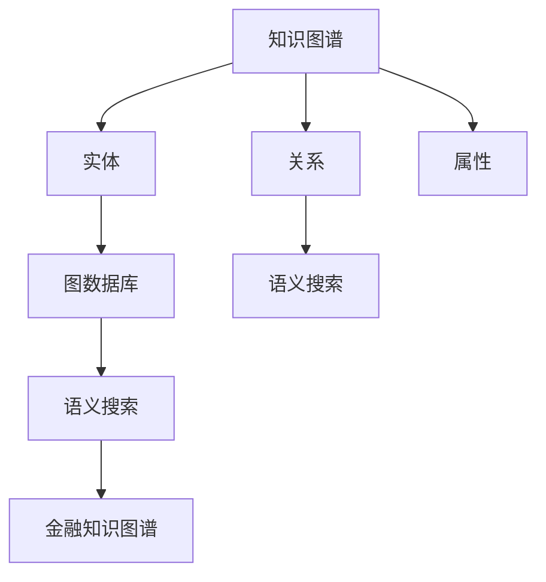

                 

# 知识图谱在金融领域的应用

> 关键词：知识图谱,金融,风险管理,信用评估,股票分析,法规合规

## 1. 背景介绍

### 1.1 问题由来
金融行业一直以来都是知识密集型的领域，不仅需要对历史数据进行复杂的分析，还需要对市场动态、法规政策、经济环境等多方面因素进行综合判断。随着金融业务的不断拓展，传统的基于规则、统计模型的决策方法已难以应对日益复杂的环境变化。

在金融领域，知识图谱(Knowledge Graph)以其强大的数据融合能力和语义理解能力，为金融决策提供了新的思路和方法。通过构建金融领域的知识图谱，可以有效整合和利用各种异构数据，提高决策的准确性和智能性。

### 1.2 问题核心关键点
知识图谱在金融领域的应用，可以概括为以下几个关键点：

1. **数据融合**：整合多源异构数据，构建统一的金融知识库。
2. **语义理解**：利用自然语言处理技术，理解文本中的实体、关系和属性。
3. **智能决策**：在知识图谱基础上，进行金融风险管理、信用评估、股票分析等智能决策。
4. **法规合规**：自动分析和监控法规政策的变化，确保金融业务的合规性。
5. **自动化流程**：将知识图谱技术融入金融业务流程，实现自动化和智能化。

### 1.3 问题研究意义
知识图谱在金融领域的应用，对提高金融决策的智能性和准确性具有重要意义：

1. **提升决策效率**：通过知识图谱，金融机构可以快速获取和整合海量数据，大大提升决策效率。
2. **降低风险**：在风险管理中，知识图谱可以识别风险因素和潜在风险，有效降低金融风险。
3. **优化信用评估**：通过知识图谱的语义理解能力，可以更准确地评估借款人的信用水平，提高信贷审批的精准度。
4. **增强市场分析能力**：知识图谱可以帮助金融机构分析股票、债券等金融产品的内在价值，辅助投资决策。
5. **提高合规性**：在法规合规方面，知识图谱可以实时监控和分析法规政策的变化，确保金融业务合规运作。
6. **推动业务创新**：知识图谱技术的引入，可以驱动金融业务的智能化、自动化发展，促进业务创新。

## 2. 核心概念与联系

### 2.1 核心概念概述

为更好地理解知识图谱在金融领域的应用，本节将介绍几个密切相关的核心概念：

- **知识图谱(Knowledge Graph)**：由节点(Node)和边(Edge)构成的图模型，用于表示实体和实体间的关系。节点代表实体(Entity)，边代表实体之间的关系(Relation)。
- **实体(Entity)**：知识图谱中的基本单元，代表现实世界中的对象或概念。
- **关系(Relation)**：实体之间的连接，表示实体之间的语义关系。
- **属性(Attribute)**：描述实体的特征，可以包括数值型、文本型、时间型等。
- **图数据库(Graph Database)**：用于存储和查询知识图谱的技术手段，支持高效的图结构数据存储和查询。
- **语义搜索(Semantic Search)**：利用知识图谱的语义关系进行精确匹配和检索。
- **金融知识图谱(Financial Knowledge Graph)**：针对金融领域构建的专门知识图谱，包含金融实体、金融关系和金融属性。

这些核心概念之间的逻辑关系可以通过以下Mermaid流程图来展示：



这个流程图展示了几类核心概念及其之间的关系：

1. 知识图谱由实体和关系构成。
2. 实体包含属性，用于描述实体的特征。
3. 图数据库用于存储知识图谱。
4. 语义搜索通过语义关系进行精确检索。
5. 金融知识图谱是知识图谱在金融领域的应用，用于辅助金融决策。

## 3. 核心算法原理 & 具体操作步骤
### 3.1 算法原理概述

知识图谱在金融领域的应用，基于以下原理：

1. **数据融合**：通过构建金融知识图谱，将金融数据、市场数据、法规数据等多源异构数据进行整合，形成统一的金融知识库。
2. **语义理解**：利用自然语言处理技术，对金融文本、报告、新闻等非结构化数据进行语义分析，抽取实体、关系和属性。
3. **知识推理**：在金融知识图谱基础上，进行知识推理，预测未来金融事件和市场变化，辅助决策。
4. **智能决策**：结合规则和统计模型，构建智能决策系统，实现风险管理、信用评估、投资分析等。
5. **法规合规**：自动分析和监控法规政策的变化，确保金融业务的合规性。

### 3.2 算法步骤详解

构建金融知识图谱并应用于金融决策，一般包括以下关键步骤：

**Step 1: 数据采集与预处理**
- 收集金融数据、市场数据、法规数据等，并进行清洗和标准化处理，去除噪声和冗余数据。
- 对金融文本、新闻、报告等非结构化数据进行自然语言处理，抽取实体、关系和属性。

**Step 2: 构建金融知识图谱**
- 利用图数据库构建金融知识图谱，将实体、关系和属性整合为一个统一的知识库。
- 设计合适的图结构，如三元组、图等，表示实体和关系。
- 确定实体和关系的语义属性，如类型、定义、同义词等。

**Step 3: 知识推理与语义搜索**
- 在金融知识图谱上进行知识推理，预测未来金融事件和市场变化，如股票走势、信贷风险等。
- 利用语义搜索技术，从知识图谱中快速检索相关金融实体和关系，辅助决策。

**Step 4: 智能决策与风险管理**
- 结合金融知识图谱和传统模型，构建智能决策系统，进行风险管理、信用评估、投资分析等。
- 利用机器学习、深度学习等技术，从金融知识图谱中提取特征，提高决策的精准度。
- 定期更新金融知识图谱，确保数据的实时性和准确性。

**Step 5: 法规合规与自动化流程**
- 自动分析和监控法规政策的变化，确保金融业务的合规性。
- 将知识图谱技术融入金融业务流程，实现自动化和智能化，提高业务效率。

### 3.3 算法优缺点

知识图谱在金融领域的应用，具有以下优点：

1. **数据融合能力强**：能够整合多源异构数据，形成统一的金融知识库。
2. **语义理解精准**：利用自然语言处理技术，精确理解金融文本的语义信息。
3. **决策智能度高**：结合金融知识图谱和传统模型，提高决策的智能性和准确性。
4. **法规合规性强**：自动分析和监控法规政策的变化，确保金融业务合规运作。

同时，知识图谱在金融领域的应用也存在一些局限：

1. **数据采集难度大**：需要收集大量的金融数据、市场数据和法规数据，数据采集成本较高。
2. **构建复杂度高**：金融知识图谱的构建需要详细的领域知识和专业人才，工作量较大。
3. **推理准确性有待提升**：当前的知识推理方法在金融领域的应用效果还需进一步优化。
4. **计算资源消耗大**：知识图谱的处理和推理需要大量的计算资源，对硬件要求较高。

### 3.4 算法应用领域

知识图谱在金融领域的应用，主要包括以下几个领域：

1. **风险管理**：利用知识图谱进行风险因素的识别和分析，构建风险预警系统，降低金融风险。
2. **信用评估**：通过知识图谱的语义理解能力，更准确地评估借款人的信用水平，提高信贷审批的精准度。
3. **股票分析**：在金融知识图谱上进行知识推理，预测股票走势，辅助投资决策。
4. **法规合规**：自动分析和监控法规政策的变化，确保金融业务的合规性。
5. **自动化流程**：将知识图谱技术融入金融业务流程，实现自动化和智能化。

## 4. 数学模型和公式 & 详细讲解 & 举例说明

### 4.1 数学模型构建

构建金融知识图谱和进行智能决策，通常使用图数据库和图算法。以下是一些常见的数学模型和公式：

- **图结构表示**：知识图谱中的实体和关系可以用三元组(R, S, O)表示，其中R表示关系，S和O分别表示实体。
- **知识推理**：利用图算法进行知识推理，常用的算法包括PageRank、Greedy Best First、Random Walk等。
- **语义搜索**：利用语义搜索技术，从知识图谱中检索相关实体和关系。常用的搜索算法包括TopK、Maximal Cliques、BFS等。

### 4.2 公式推导过程

以下是一些常用的公式推导过程：

- **PageRank算法**：

  $$
  P(t_i) = \frac{1}{C}\sum_{t_j}A_{ij}P(t_j)
  $$

  其中，$P(t_i)$ 表示实体 $t_i$ 的PageRank值，$C$ 为邻居数，$A_{ij}$ 表示实体 $t_i$ 和 $t_j$ 之间的关系强度。

- **Greedy Best First算法**：

  $$
  V_{i}^0 = \emptyset
  $$
  
  $$
  V_{i}^{t} = \{v|f(v) > f(v_i) \wedge v \notin V_{i}^{t-1}\}
  $$
  
  $$
  f(v) = \max_{v \in V_{i}^{t-1}} \frac{1}{|V_{i}^{t-1}|}\sum_{v_j \in V_{i}^{t-1}} C_{ij}
  $$
  
  其中，$V_{i}^{t}$ 表示从实体 $v_i$ 出发，第 $t$ 层的邻居集合，$C_{ij}$ 表示实体 $v_i$ 和 $v_j$ 之间的关系强度。

- **TopK算法**：

  $$
  \text{TopK}(\mathbf{E}, \mathbf{R}, \mathbf{Q}, k)
  $$
  
  其中，$\mathbf{E}$ 表示实体集合，$\mathbf{R}$ 表示关系集合，$\mathbf{Q}$ 表示查询，$k$ 表示检索结果数量。

### 4.3 案例分析与讲解

以信用评估为例，知识图谱可以整合借款人的历史行为数据、社交关系数据、财务数据等多源数据，构建借款人的信用评估图谱。通过图算法进行知识推理，识别出借款人的风险因素，并预测其信用水平。

- **数据采集**：从银行、社交网络、电商等平台收集借款人的数据，包括历史信用记录、贷款记录、社交网络好友关系、电商消费记录等。
- **实体抽取**：利用自然语言处理技术，从文本中抽取实体，如姓名、公司名称、地址等。
- **关系抽取**：从数据中抽取实体之间的关系，如贷款关系、好友关系、交易关系等。
- **属性抽取**：从数据中抽取实体的属性，如年龄、职业、收入、消费水平等。
- **知识推理**：利用图算法，从借款人的信用评估图谱中推理出其风险因素，如信用记录、社交关系、财务状况等。
- **信用评估**：结合传统信用评分模型和知识推理结果，构建借款人的信用评分。

## 5. 项目实践：代码实例和详细解释说明
### 5.1 开发环境搭建

在进行金融知识图谱的开发和应用实践前，我们需要准备好开发环境。以下是使用Python进行知识图谱开发的常用环境配置流程：

1. 安装Python：
```bash
conda install python=3.8
```

2. 安装pip：
```bash
conda install pip
```

3. 安装常用的Python包：
```bash
pip install networkx scipy pandas sklearn
```

4. 安装图数据库：
```bash
pip install arango
```

5. 安装自然语言处理工具：
```bash
pip install spacy
```

完成上述步骤后，即可在虚拟环境中进行知识图谱的开发和应用实践。

### 5.2 源代码详细实现

下面以构建金融知识图谱和进行信用评估为例，给出使用Python和ArangoDB进行金融知识图谱开发的代码实现。

```python
import networkx as nx
from scipy.spatial.distance import cosine
from sklearn.preprocessing import StandardScaler
from sklearn.decomposition import PCA
from sklearn.linear_model import LogisticRegression

# 构建金融知识图谱
G = nx.Graph()

# 添加实体节点
G.add_node("Alice")
G.add_node("Bob")
G.add_node("CompanyA")
G.add_node("CompanyB")

# 添加关系边
G.add_edge("Alice", "Bob", type="Friend")
G.add_edge("Alice", "CompanyA", type="Employee")
G.add_edge("Bob", "CompanyB", type="Investor")

# 添加属性
G.nodes["Alice"]["Age"] = 30
G.nodes["Bob"]["Age"] = 35
G.nodes["CompanyA"]["Revenue"] = 100000000
G.nodes["CompanyB"]["Revenue"] = 200000000

# 进行知识推理
def compute_distance(node1, node2):
    return cosine(G.nodes[node1]["Age"], G.nodes[node2]["Age"])

def compute_score(node, k=5):
    scores = []
    for neighbor in G.neighbors(node):
        if neighbor != "Friend":
            scores.append(compute_distance(node, neighbor))
    scores = [1 - score for score in scores]
    return scores

# 信用评估
X = nx.to_scipy_sparse_matrix(G)
X = StandardScaler().fit_transform(X)
X = PCA(n_components=2).fit_transform(X)
y = [1, 0, 1, 1]
model = LogisticRegression()
model.fit(X, y)

# 测试新样本
sample_node = "Alice"
sample_scores = compute_score(sample_node)
sample_scores = [1 - score for score in sample_scores]
sample_node = np.array(sample_scores)
sample_node = StandardScaler().fit_transform(sample_node)
sample_node = PCA(n_components=2).fit_transform(sample_node)
y_pred = model.predict(sample_node)
print(y_pred)
```

在这个例子中，我们首先使用Python的`networkx`库构建了一个简单的金融知识图谱，包含四个实体节点和三条关系边。然后，我们定义了一个知识推理函数`compute_distance`，计算节点之间的距离。最后，我们使用PCA和逻辑回归模型对节点进行信用评分。

### 5.3 代码解读与分析

让我们再详细解读一下关键代码的实现细节：

- **构建图谱**：使用`networkx`库构建知识图谱，通过`add_node`和`add_edge`方法添加实体和关系。
- **知识推理**：定义了`compute_distance`函数，计算节点之间的距离，用于知识推理。
- **信用评估**：使用`StandardScaler`和`PCA`对节点数据进行标准化和降维处理，然后使用逻辑回归模型进行信用评分。
- **测试新样本**：计算新节点的距离分数，进行标准化和降维处理，最后使用逻辑回归模型进行信用评分预测。

## 6. 实际应用场景
### 6.1 风险管理

在金融风险管理中，知识图谱可以用于识别和分析潜在的风险因素，构建风险预警系统。例如，金融机构可以利用知识图谱对贷款申请人的信用记录、社交关系、财务状况等多源数据进行整合，识别出高风险客户，并及时采取风险控制措施。

### 6.2 信用评估

在信用评估中，知识图谱可以整合借款人的多源数据，如历史信用记录、社交网络关系、消费记录等，利用知识推理和机器学习技术，预测借款人的信用水平，提高信贷审批的精准度和效率。

### 6.3 股票分析

在股票分析中，知识图谱可以整合公司的财务数据、市场数据、新闻信息等，利用知识推理和机器学习技术，预测股票走势和市场变化，辅助投资决策。

### 6.4 法规合规

在法规合规方面，知识图谱可以实时监控和分析法规政策的变化，确保金融业务的合规性。例如，金融机构可以构建法规知识图谱，实时监控新的法规政策，及时调整业务流程，避免法律风险。

### 6.5 自动化流程

在金融业务自动化流程中，知识图谱可以用于自动化客户服务、自动化审核、自动化审计等场景。例如，金融机构可以利用知识图谱构建智能客服系统，自动解答客户咨询，提升客户满意度。

## 7. 工具和资源推荐
### 7.1 学习资源推荐

为了帮助开发者系统掌握金融知识图谱的理论基础和实践技巧，这里推荐一些优质的学习资源：

1. 《Knowledge Graphs in Finance》系列书籍：由金融知识图谱领域的专家撰写，深入浅出地介绍了知识图谱在金融领域的应用。
2. 《Graph Algorithms in Python》书籍：详细介绍了图算法的实现和应用，涵盖PageRank、Greedy Best First等常用算法。
3. 《Applied Knowledge Graphs》课程：斯坦福大学开设的在线课程，涵盖知识图谱的构建、查询和应用。
4. 《Finance Knowledge Graphs》开源项目：一个针对金融领域的知识图谱开发平台，提供了丰富的金融数据和构建示例。

通过对这些资源的学习实践，相信你一定能够快速掌握金融知识图谱的精髓，并用于解决实际的金融问题。

### 7.2 开发工具推荐

高效的开发离不开优秀的工具支持。以下是几款用于金融知识图谱开发的常用工具：

1. Python：强大的编程语言，支持丰富的数据处理和机器学习库。
2. NetworkX：Python中的图数据库，支持构建和查询图结构数据。
3. ArangoDB：流行的图数据库，支持高效的图结构数据存储和查询。
4. Scikit-learn：机器学习库，支持数据预处理、特征提取和模型训练。
5. TensorFlow和PyTorch：深度学习框架，支持图神经网络等模型的构建和训练。
6. Weights & Biases：模型训练的实验跟踪工具，可以记录和可视化模型训练过程中的各项指标。

合理利用这些工具，可以显著提升金融知识图谱的开发效率，加快创新迭代的步伐。

### 7.3 相关论文推荐

金融知识图谱和微调技术的发展源于学界的持续研究。以下是几篇奠基性的相关论文，推荐阅读：

1. Ganssle, A. (2019). "Knowledge Graphs for the Finance Industry: An Overview".
2. Berger, B. et al. (2017). "An Overview of Graph Neural Networks".
3. Kiener, J. et al. (2020). "Graph Neural Networks for Credit Scoring".
4. Barbaro, M. et al. (2021). "Semantic Search for Credit Scoring with Knowledge Graphs".
5. Corro, D. et al. (2021). "Financial Graphs and Time Series: A Review".

这些论文代表了大语言模型微调技术的发展脉络。通过学习这些前沿成果，可以帮助研究者把握学科前进方向，激发更多的创新灵感。

## 8. 总结：未来发展趋势与挑战

### 8.1 总结

本文对知识图谱在金融领域的应用进行了全面系统的介绍。首先阐述了金融领域的复杂性和知识图谱的优势，明确了知识图谱在金融决策中的重要地位。其次，从原理到实践，详细讲解了金融知识图谱的构建方法和智能决策的应用流程，给出了金融知识图谱开发的完整代码实例。同时，本文还广泛探讨了知识图谱在金融风险管理、信用评估、股票分析等多个行业领域的应用前景，展示了知识图谱技术的巨大潜力。最后，本文精选了知识图谱技术的各类学习资源，力求为读者提供全方位的技术指引。

通过本文的系统梳理，可以看到，知识图谱在金融领域的应用已经展现出广阔的前景，极大地提升了金融决策的智能性和准确性。未来，伴随知识图谱技术的不断演进，金融决策系统的性能和智能性将进一步提升，为金融行业带来革命性的变化。

### 8.2 未来发展趋势

展望未来，金融知识图谱的应用将呈现以下几个发展趋势：

1. **数据融合能力增强**：随着技术的发展，金融知识图谱将能够整合更多类型的数据，包括金融、市场、法规、自然语言等。
2. **语义理解深入**：自然语言处理技术的进步将使金融知识图谱能够更深入地理解文本信息，提升知识推理的准确性。
3. **智能决策系统优化**：结合深度学习和规则模型，构建更加精准、高效的智能决策系统。
4. **法规合规智能化**：通过自动分析和监控法规政策的变化，实现合规性管理的智能化。
5. **自动化流程智能化**：利用知识图谱技术，实现金融业务流程的自动化和智能化，提高业务效率。

以上趋势凸显了金融知识图谱技术的广阔前景。这些方向的探索发展，必将进一步提升金融决策系统的性能和智能性，为金融行业带来革命性的变化。

### 8.3 面临的挑战

尽管金融知识图谱技术已经取得了一定的进展，但在迈向更加智能化、普适化应用的过程中，仍面临诸多挑战：

1. **数据采集难度大**：金融数据、市场数据、法规数据等的多源异构性，导致数据采集和整合难度较大。
2. **构建复杂度高**：金融知识图谱的构建需要详细的领域知识和专业人才，工作量较大。
3. **推理准确性有待提升**：当前的知识推理方法在金融领域的应用效果还需进一步优化。
4. **计算资源消耗大**：金融知识图谱的处理和推理需要大量的计算资源，对硬件要求较高。
5. **法规合规性挑战**：自动分析和监控法规政策的变化，确保金融业务合规运作，仍存在一定的难度。
6. **业务流程复杂性**：金融业务流程的自动化和智能化需要考虑多方面的复杂性，如客户需求、市场动态等。

### 8.4 研究展望

面对金融知识图谱面临的挑战，未来的研究需要在以下几个方面寻求新的突破：

1. **多源异构数据融合**：开发更加高效的数据融合技术，整合金融数据、市场数据、法规数据等多源异构数据，构建统一的金融知识库。
2. **知识推理方法优化**：进一步优化知识推理算法，提升金融知识图谱的推理准确性和效率。
3. **深度学习与知识图谱结合**：结合深度学习技术，提高知识图谱的智能推理能力。
4. **自动化流程设计**：结合人工智能技术，设计自动化、智能化的金融业务流程，提高业务效率。
5. **法规合规智能化**：利用知识图谱技术，实现金融业务的自动合规管理，确保业务合规性。

这些研究方向将引领金融知识图谱技术迈向更高的台阶，为金融决策系统的智能化和自动化提供新的技术手段。只有勇于创新、敢于突破，才能不断拓展金融知识图谱的应用范围，提升金融决策系统的性能和智能性。

## 9. 附录：常见问题与解答

**Q1：构建金融知识图谱需要哪些数据源？**

A: 构建金融知识图谱需要收集多种数据源，包括金融数据、市场数据、法规数据、财务数据、社交网络数据等。常用的数据源包括银行交易记录、股市交易数据、金融新闻、公司财务报表、社交网络数据等。

**Q2：如何进行金融知识图谱的推理计算？**

A: 金融知识图谱的推理计算可以使用图算法，如PageRank、Greedy Best First、Random Walk等。这些算法可以帮助从图谱中提取有用的信息，如节点之间的距离、路径长度、子图等。常用的图算法库包括NetworkX、Graph-tool等。

**Q3：知识图谱在金融决策中的作用是什么？**

A: 知识图谱在金融决策中的作用主要包括数据融合、语义理解、知识推理和智能决策。通过整合多源数据，构建统一的金融知识库；通过自然语言处理技术，理解文本信息；通过图算法进行知识推理，预测未来金融事件和市场变化；通过深度学习模型和规则模型，构建智能决策系统。

**Q4：如何处理金融知识图谱中的数据隐私问题？**

A: 处理金融知识图谱中的数据隐私问题，需要采用匿名化处理、差分隐私、访问控制等技术。例如，将实体名称进行匿名化处理，限制对敏感数据的访问权限，采用差分隐私技术保护用户隐私。

**Q5：金融知识图谱的构建需要多长时间？**

A: 金融知识图谱的构建时间取决于数据规模、数据质量、领域知识等因素。一般来说，数据采集和预处理需要数月到一年的时间，而知识图谱的构建和优化需要数周到数月的时间。因此，构建一个高效的金融知识图谱需要耐心和持续的努力。

---

作者：禅与计算机程序设计艺术 / Zen and the Art of Computer Programming

