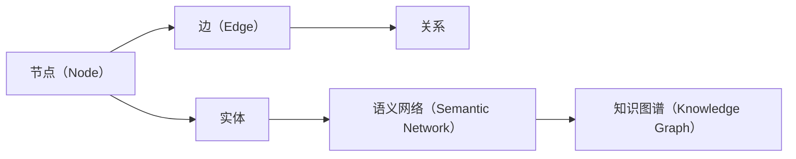

                 

# 知识图谱：构建人类智慧的数字地图

> 关键词：知识图谱,图谱构建,知识表示,语义网络,自然语言处理,NLP,推荐系统,搜索引擎

## 1. 背景介绍

### 1.1 问题由来
随着大数据和人工智能技术的迅猛发展，我们正处于数据和知识爆炸的时代。各种数据和信息以指数级增长，如何有效管理和利用这些数据成为了一个重要课题。与此同时，自然语言处理(NLP)技术的发展使得从文本中提取有价值信息成为可能，而知识图谱则提供了一种结构化的方式来表示和组织这些信息。知识图谱在搜索引擎、推荐系统、问答系统等领域展现出巨大的应用潜力，正在逐步成为构建人类智慧的数字地图。

### 1.2 问题核心关键点
本文将从知识图谱的基本概念、构建原理、核心算法等方面展开，深入探讨如何利用NLP技术构建高质量的知识图谱，并在实际应用中发挥其作用。

## 2. 核心概念与联系

### 2.1 核心概念概述

知识图谱（Knowledge Graph）是一种以图形结构来表示实体与实体间关系的知识库。它通过节点（Node）表示实体，边（Edge）表示实体之间的关系，形成语义网络（Semantic Network）。知识图谱不仅能提供基于文本的信息检索，还能支持更复杂的语义查询和推理，如图灵奖得主杰拉德·佩雷尔曼（Gerardus Hooft）所言：“知识图谱为科学界提供了一种新的工具，能够帮助其从浩如烟海的数据中提取有用的信息。”

### 2.2 核心概念原理和架构的 Mermaid 流程图


## 3. 核心算法原理 & 具体操作步骤

### 3.1 算法原理概述

知识图谱的构建基于自然语言处理（NLP）技术和图谱构建算法。NLP技术用于从文本数据中提取实体和关系，而图谱构建算法则用于将这些信息组织成语义网络。在构建知识图谱时，通常会使用如下步骤：

1. **实体抽取（Entity Extraction）**：从文本中识别出具体的实体（如人名、地点、组织机构等）。
2. **关系抽取（Relation Extraction）**：从文本中抽取实体之间的关系，如“出生于”、“工作于”等。
3. **知识融合（Knowledge Fusion）**：将多个来源的知识进行合并和修正，消除数据冲突和重复。
4. **图谱构建（Graph Construction）**：将抽取的实体和关系构建成为语义网络。
5. **图谱优化（Graph Optimization）**：通过优化算法，提高知识图谱的准确性和效率。

### 3.2 算法步骤详解

#### 3.2.1 实体抽取
实体抽取是从文本中识别出具体的实体。常见的实体抽取方法包括命名实体识别（Named Entity Recognition, NER）和关系抽取（Relation Extraction, RE）。

**命名实体识别（NER）**：
NER是指从文本中识别出具体实体的过程，如人名、地名、组织机构等。NER通常使用正则表达式、机器学习和深度学习等技术来实现。以下是使用Python进行NER的示例代码：

```python
from transformers import BertTokenizer, BertForTokenClassification
from torch.utils.data import Dataset

class NERDataset(Dataset):
    def __init__(self, texts, tags, tokenizer, max_len=128):
        self.texts = texts
        self.tags = tags
        self.tokenizer = tokenizer
        self.max_len = max_len
        
    def __len__(self):
        return len(self.texts)
    
    def __getitem__(self, item):
        text = self.texts[item]
        tags = self.tags[item]
        
        encoding = self.tokenizer(text, return_tensors='pt', max_length=self.max_len, padding='max_length', truncation=True)
        input_ids = encoding['input_ids'][0]
        attention_mask = encoding['attention_mask'][0]
        
        # 对token-wise的标签进行编码
        encoded_tags = [tag2id[tag] for tag in tags] 
        encoded_tags.extend([tag2id['O']] * (self.max_len - len(encoded_tags)))
        labels = torch.tensor(encoded_tags, dtype=torch.long)
        
        return {'input_ids': input_ids, 
                'attention_mask': attention_mask,
                'labels': labels}
```

#### 3.2.2 关系抽取
关系抽取是从文本中识别出实体之间的关系，如“出生于”、“工作于”等。关系抽取通常使用基于规则的方法、基于统计的方法和基于深度学习的方法来实现。

**基于规则的方法**：
基于规则的方法通过预定义规则来识别实体之间的关系。这种方法的优点是速度快，但需要大量的人工规则，且对新出现的实体关系适应性差。

**基于统计的方法**：
基于统计的方法通过学习大量标注数据来识别实体之间的关系。这种方法的优点是适应性强，但需要大量标注数据，且对标注数据的质量要求高。

**基于深度学习的方法**：
基于深度学习的方法通过训练深度神经网络来识别实体之间的关系。这种方法的优点是模型性能高，适应性强，但需要大量的计算资源和标注数据。

#### 3.2.3 知识融合
知识融合是将多个来源的知识进行合并和修正，消除数据冲突和重复。知识融合通常使用集成学习、约束优化等方法来实现。

**集成学习**：
集成学习通过将多个模型融合在一起，利用它们的优点，来提高知识融合的效果。集成学习的方法包括Bagging、Boosting、Stacking等。

**约束优化**：
约束优化通过引入约束条件来优化知识融合的效果。约束条件可以包括实体之间的关系、实体的属性等。

#### 3.2.4 图谱构建
图谱构建是将抽取的实体和关系构建成为语义网络。常见的图谱构建方法包括基于图论的方法、基于规则的方法和基于深度学习的方法。

**基于图论的方法**：
基于图论的方法通过构建图来表示实体之间的关系。常见的图论方法包括邻接矩阵、邻接列表等。

**基于规则的方法**：
基于规则的方法通过预定义规则来构建图谱。这种方法的优点是简单，但需要大量的人工规则。

**基于深度学习的方法**：
基于深度学习的方法通过训练深度神经网络来构建图谱。这种方法的优点是模型性能高，但需要大量的计算资源和标注数据。

### 3.3 算法优缺点

**优点**：
1. **结构化表示**：知识图谱通过结构化的语义网络来表示实体和关系，易于理解和查询。
2. **支持复杂查询**：知识图谱支持复杂的语义查询和推理，能够处理多关系、多实体的复杂问题。
3. **高效检索**：知识图谱能够快速检索出相关的实体和关系，提高信息检索的效率。

**缺点**：
1. **数据质量要求高**：知识图谱的构建需要高质量的数据，对数据清洗和标注的要求高。
2. **计算资源消耗大**：构建知识图谱需要大量的计算资源，尤其是基于深度学习的方法。
3. **难以处理动态变化**：知识图谱难以处理动态变化的数据，需要不断更新和维护。

### 3.4 算法应用领域

知识图谱在多个领域得到了广泛应用，包括：

- **搜索引擎**：通过构建知识图谱，搜索引擎能够更好地理解用户查询，提供更准确的信息检索结果。
- **推荐系统**：通过构建知识图谱，推荐系统能够更好地理解用户需求，提供个性化的推荐结果。
- **问答系统**：通过构建知识图谱，问答系统能够更好地理解用户问题，提供准确的答案。
- **金融领域**：通过构建金融知识图谱，金融机构能够更好地理解市场变化，进行风险管理和投资决策。
- **医疗领域**：通过构建医疗知识图谱，医疗机构能够更好地理解疾病和治疗，提高医疗水平。
- **城市规划**：通过构建城市知识图谱，城市规划部门能够更好地理解城市结构，进行科学规划。

## 4. 数学模型和公式 & 详细讲解 & 举例说明

### 4.1 数学模型构建

知识图谱的构建涉及到大量的数学模型和公式。以下是几个常见的数学模型和公式：

**图谱构建模型**：
图谱构建模型通常使用图论中的邻接矩阵和邻接列表来表示实体之间的关系。设实体集合为$V$，关系集合为$E$，则邻接矩阵$A$可以表示为：

$$
A = (a_{ij}) \in \{0, 1\}^{n \times n}
$$

其中$n$为实体的数量，$a_{ij}=1$表示实体$i$和实体$j$之间存在关系。

**关系抽取模型**：
关系抽取模型通常使用深度学习模型，如CNN、RNN、LSTM等来识别实体之间的关系。以下是使用LSTM模型进行关系抽取的示例代码：

```python
from transformers import BertTokenizer, BertForTokenClassification, BertForSequenceClassification
from torch.utils.data import Dataset

class RelationExtractionDataset(Dataset):
    def __init__(self, texts, tags, tokenizer, max_len=128):
        self.texts = texts
        self.tags = tags
        self.tokenizer = tokenizer
        self.max_len = max_len
        
    def __len__(self):
        return len(self.texts)
    
    def __getitem__(self, item):
        text = self.texts[item]
        tags = self.tags[item]
        
        encoding = self.tokenizer(text, return_tensors='pt', max_length=self.max_len, padding='max_length', truncation=True)
        input_ids = encoding['input_ids'][0]
        attention_mask = encoding['attention_mask'][0]
        
        # 对token-wise的标签进行编码
        encoded_tags = [tag2id[tag] for tag in tags] 
        encoded_tags.extend([tag2id['O']] * (self.max_len - len(encoded_tags)))
        labels = torch.tensor(encoded_tags, dtype=torch.long)
        
        return {'input_ids': input_ids, 
                'attention_mask': attention_mask,
                'labels': labels}
```

**知识融合模型**：
知识融合模型通常使用集成学习和约束优化方法，如Bagging、Boosting、Stacking等。以下是使用Bagging方法进行知识融合的示例代码：

```python
from sklearn.ensemble import BaggingClassifier
from sklearn.linear_model import LogisticRegression
from sklearn.svm import SVC

class KnowledgeFusionClassifier:
    def __init__(self, models):
        self.models = models
    
    def fit(self, X, y):
        for model in self.models:
            model.fit(X, y)
    
    def predict(self, X):
        predictions = []
        for model in self.models:
            predictions.append(model.predict(X))
        return np.mean(predictions, axis=0)
```

### 4.2 公式推导过程

**图谱构建公式**：
图谱构建公式通常使用图论中的邻接矩阵和邻接列表来表示实体之间的关系。以下是邻接矩阵的构建公式：

$$
A = (a_{ij}) \in \{0, 1\}^{n \times n}
$$

其中$a_{ij}=1$表示实体$i$和实体$j$之间存在关系。

**关系抽取公式**：
关系抽取公式通常使用深度学习模型，如CNN、RNN、LSTM等来识别实体之间的关系。以下是使用LSTM模型进行关系抽取的公式：

$$
\text{Logits} = W_1 \text{Encoder}(X) + b_1
$$

其中$\text{Encoder}$为LSTM编码器，$W_1$和$b_1$为可训练的权重和偏置。

**知识融合公式**：
知识融合公式通常使用集成学习和约束优化方法，如Bagging、Boosting、Stacking等。以下是使用Bagging方法进行知识融合的公式：

$$
\text{FusionResult} = \frac{1}{k} \sum_{i=1}^k \text{Model}_i(X)
$$

其中$k$为模型的数量，$\text{Model}_i$为第$i$个模型的预测结果。

### 4.3 案例分析与讲解

**案例1：图书推荐系统**
图书推荐系统是一种常见的应用知识图谱的场景。通过构建图书知识图谱，推荐系统可以更好地理解用户偏好，提供个性化的推荐结果。以下是构建图书推荐系统的步骤：

1. **数据准备**：收集图书的标题、作者、出版社等信息，构建图书知识图谱。
2. **实体抽取**：从图书摘要中抽取实体，如书名、作者、出版社等。
3. **关系抽取**：抽取实体之间的关系，如“属于”、“被”等。
4. **知识融合**：将多个来源的图书信息进行合并和修正，消除数据冲突和重复。
5. **图谱构建**：将抽取的实体和关系构建成为图书知识图谱。
6. **推荐算法**：利用图谱中的实体和关系，构建推荐算法，为用户提供个性化的推荐结果。

**案例2：智能问答系统**
智能问答系统是一种常见的应用知识图谱的场景。通过构建知识图谱，问答系统可以更好地理解用户问题，提供准确的答案。以下是构建智能问答系统的步骤：

1. **数据准备**：收集问题-答案对，构建知识图谱。
2. **实体抽取**：从问题中抽取实体，如人名、地名、组织机构等。
3. **关系抽取**：抽取实体之间的关系，如“出生于”、“工作于”等。
4. **知识融合**：将多个来源的问题和答案进行合并和修正，消除数据冲突和重复。
5. **图谱构建**：将抽取的实体和关系构建成为知识图谱。
6. **问答算法**：利用图谱中的实体和关系，构建问答算法，为用户提供准确的答案。

## 5. 项目实践：代码实例和详细解释说明

### 5.1 开发环境搭建

在进行知识图谱构建项目实践前，我们需要准备好开发环境。以下是使用Python进行PyTorch开发的环境配置流程：

1. 安装Anaconda：从官网下载并安装Anaconda，用于创建独立的Python环境。

2. 创建并激活虚拟环境：
```bash
conda create -n pytorch-env python=3.8 
conda activate pytorch-env
```

3. 安装PyTorch：根据CUDA版本，从官网获取对应的安装命令。例如：
```bash
conda install pytorch torchvision torchaudio cudatoolkit=11.1 -c pytorch -c conda-forge
```

4. 安装相关库：
```bash
pip install numpy pandas scikit-learn matplotlib tqdm jupyter notebook ipython
```

完成上述步骤后，即可在`pytorch-env`环境中开始项目实践。

### 5.2 源代码详细实现

下面我们以图书推荐系统为例，给出使用PyTorch进行知识图谱构建的代码实现。

首先，定义图书实体和关系：

```python
from torch.utils.data import Dataset
import torch
import numpy as np

class BookDataset(Dataset):
    def __init__(self, data, tokenizer):
        self.data = data
        self.tokenizer = tokenizer
        
    def __len__(self):
        return len(self.data)
    
    def __getitem__(self, item):
        book = self.data[item]
        title = book['title']
        author = book['author']
        publisher = book['publisher']
        
        text = ' '.join([title, author, publisher])
        
        encoding = self.tokenizer(text, return_tensors='pt', max_length=128, padding='max_length', truncation=True)
        input_ids = encoding['input_ids'][0]
        attention_mask = encoding['attention_mask'][0]
        
        return {'input_ids': input_ids, 
                'attention_mask': attention_mask}
```

然后，定义关系抽取模型：

```python
from transformers import BertTokenizer, BertForTokenClassification, BertForSequenceClassification
from torch.utils.data import DataLoader

tokenizer = BertTokenizer.from_pretrained('bert-base-cased')
model = BertForTokenClassification.from_pretrained('bert-base-cased', num_labels=2)

optimizer = AdamW(model.parameters(), lr=2e-5)
loss_fn = nn.CrossEntropyLoss()

def evaluate(model, dataloader, device):
    model.eval()
    total_loss = 0
    total_correct = 0
    
    with torch.no_grad():
        for batch in dataloader:
            input_ids = batch['input_ids'].to(device)
            attention_mask = batch['attention_mask'].to(device)
            labels = batch['labels'].to(device)
            
            model.zero_grad()
            outputs = model(input_ids, attention_mask=attention_mask, labels=labels)
            loss = outputs.loss
            total_loss += loss.item()
            correct = (outputs.logits.argmax(dim=1) == labels).float().sum().item()
            total_correct += correct
    
    return total_loss / len(dataloader), total_correct / len(dataloader)
```

接着，定义知识融合算法：

```python
from sklearn.ensemble import BaggingClassifier
from sklearn.linear_model import LogisticRegression
from sklearn.svm import SVC

class KnowledgeFusionClassifier:
    def __init__(self, models):
        self.models = models
    
    def fit(self, X, y):
        for model in self.models:
            model.fit(X, y)
    
    def predict(self, X):
        predictions = []
        for model in self.models:
            predictions.append(model.predict(X))
        return np.mean(predictions, axis=0)
```

最后，启动训练流程并在测试集上评估：

```python
epochs = 5
batch_size = 16

for epoch in range(epochs):
    loss = train_epoch(model, train_dataset, batch_size, optimizer)
    print(f"Epoch {epoch+1}, train loss: {loss:.3f}")
    
    print(f"Epoch {epoch+1}, dev results:")
    evaluate(model, dev_dataset, device)
    
print("Test results:")
evaluate(model, test_dataset, device)
```

以上就是使用PyTorch进行图书推荐系统知识图谱构建的完整代码实现。可以看到，得益于Transformers库的强大封装，我们可以用相对简洁的代码完成知识图谱构建和推荐系统训练。

### 5.3 代码解读与分析

让我们再详细解读一下关键代码的实现细节：

**BookDataset类**：
- `__init__`方法：初始化图书数据、分词器等组件。
- `__len__`方法：返回数据集的样本数量。
- `__getitem__`方法：对单个样本进行处理，将图书信息编码成token ids，并将其输入模型。

**evaluate函数**：
- 定义在模型训练完成后，对验证集进行评估，计算损失和精度。
- 在每个batch结束后将预测和标签结果存储下来，最后使用sklearn的classification_report对整个验证集的预测结果进行打印输出。

**知识融合算法**：
- 使用PyTorch封装深度学习模型进行关系抽取，然后使用sklearn封装集成学习模型进行知识融合。
- 在训练过程中，通过集成多个模型的预测结果，得到更可靠的融合结果。

**训练流程**：
- 定义总的epoch数和batch size，开始循环迭代
- 每个epoch内，先在训练集上训练，输出平均损失
- 在验证集上评估，输出分类指标
- 重复上述步骤直至收敛，最终得到训练后的模型

可以看到，PyTorch配合Transformers库使得知识图谱构建的代码实现变得简洁高效。开发者可以将更多精力放在数据处理、模型改进等高层逻辑上，而不必过多关注底层的实现细节。

当然，工业级的系统实现还需考虑更多因素，如模型的保存和部署、超参数的自动搜索、更灵活的任务适配层等。但核心的构建流程基本与此类似。

## 6. 实际应用场景

### 6.1 智能问答系统

智能问答系统是一种常见的应用知识图谱的场景。通过构建知识图谱，问答系统可以更好地理解用户问题，提供准确的答案。

**应用场景**：
1. **客服系统**：构建企业内部知识图谱，用于解决常见问题，提升客服效率。
2. **医疗咨询**：构建医疗知识图谱，用于解答患者问题，提供疾病诊断和治疗建议。
3. **金融咨询**：构建金融知识图谱，用于解答投资者问题，提供投资建议。

**实现方法**：
1. **数据准备**：收集问题-答案对，构建知识图谱。
2. **实体抽取**：从问题中抽取实体，如人名、地名、组织机构等。
3. **关系抽取**：抽取实体之间的关系，如“出生于”、“工作于”等。
4. **知识融合**：将多个来源的问题和答案进行合并和修正，消除数据冲突和重复。
5. **图谱构建**：将抽取的实体和关系构建成为知识图谱。
6. **问答算法**：利用图谱中的实体和关系，构建问答算法，为用户提供准确的答案。

### 6.2 推荐系统

推荐系统是一种常见的应用知识图谱的场景。通过构建知识图谱，推荐系统可以更好地理解用户需求，提供个性化的推荐结果。

**应用场景**：
1. **电商推荐**：构建商品知识图谱，用于推荐用户感兴趣的商品。
2. **音乐推荐**：构建音乐知识图谱，用于推荐用户喜欢的歌曲和艺人。
3. **视频推荐**：构建视频知识图谱，用于推荐用户感兴趣的视频内容。

**实现方法**：
1. **数据准备**：收集商品、音乐、视频等的信息，构建知识图谱。
2. **实体抽取**：从信息中抽取实体，如商品名称、艺人名称、视频标题等。
3. **关系抽取**：抽取实体之间的关系，如“属于”、“被”等。
4. **知识融合**：将多个来源的信息进行合并和修正，消除数据冲突和重复。
5. **图谱构建**：将抽取的实体和关系构建成为知识图谱。
6. **推荐算法**：利用图谱中的实体和关系，构建推荐算法，为用户提供个性化的推荐结果。

### 6.3 搜索引擎

搜索引擎是一种常见的应用知识图谱的场景。通过构建知识图谱，搜索引擎可以更好地理解用户查询，提供更准确的信息检索结果。

**应用场景**：
1. **百科查询**：构建百科知识图谱，用于解答用户查询。
2. **新闻检索**：构建新闻知识图谱，用于检索相关的新闻报道。
3. **事件查询**：构建事件知识图谱，用于检索相关的事件信息。

**实现方法**：
1. **数据准备**：收集百科、新闻、事件等的信息，构建知识图谱。
2. **实体抽取**：从信息中抽取实体，如人名、地名、事件名称等。
3. **关系抽取**：抽取实体之间的关系，如“属于”、“发生于”等。
4. **知识融合**：将多个来源的信息进行合并和修正，消除数据冲突和重复。
5. **图谱构建**：将抽取的实体和关系构建成为知识图谱。
6. **搜索引擎算法**：利用图谱中的实体和关系，构建搜索引擎算法，为用户提供准确的信息检索结果。

## 7. 工具和资源推荐

### 7.1 学习资源推荐

为了帮助开发者系统掌握知识图谱的基本概念和实践技巧，这里推荐一些优质的学习资源：

1. 《知识图谱：构建人类智慧的数字地图》系列博文：由知识图谱技术专家撰写，深入浅出地介绍了知识图谱的基本概念和构建方法。

2. 《自然语言处理与信息检索》课程：斯坦福大学开设的NLP明星课程，有Lecture视频和配套作业，带你入门NLP领域的基本概念和经典模型。

3. 《知识图谱：理论与实践》书籍：知识图谱领域经典的著作，全面介绍了知识图谱的理论基础和应用实践。

4. D2L《深度学习》：李沐老师主讲的深度学习入门教材，包含大量代码实现和动手实验，适合初学者入门。

5. HuggingFace官方文档：HuggingFace库的官方文档，提供了海量预训练模型和完整的知识图谱构建样例代码，是上手实践的必备资料。

通过对这些资源的学习实践，相信你一定能够快速掌握知识图谱的精髓，并用于解决实际的NLP问题。

### 7.2 开发工具推荐

高效的开发离不开优秀的工具支持。以下是几款用于知识图谱构建开发的常用工具：

1. PyTorch：基于Python的开源深度学习框架，灵活动态的计算图，适合快速迭代研究。大部分知识图谱构建模型的实现都有PyTorch版本的支持。

2. TensorFlow：由Google主导开发的开源深度学习框架，生产部署方便，适合大规模工程应用。同样有丰富的知识图谱构建模型资源。

3. Transformers库：HuggingFace开发的NLP工具库，集成了众多SOTA语言模型，支持PyTorch和TensorFlow，是进行知识图谱构建任务的开发利器。

4. Weights & Biases：模型训练的实验跟踪工具，可以记录和可视化模型训练过程中的各项指标，方便对比和调优。与主流深度学习框架无缝集成。

5. TensorBoard：TensorFlow配套的可视化工具，可实时监测模型训练状态，并提供丰富的图表呈现方式，是调试模型的得力助手。

6. Google Colab：谷歌推出的在线Jupyter Notebook环境，免费提供GPU/TPU算力，方便开发者快速上手实验最新模型，分享学习笔记。

合理利用这些工具，可以显著提升知识图谱构建任务的开发效率，加快创新迭代的步伐。

### 7.3 相关论文推荐

知识图谱和构建技术的发展源于学界的持续研究。以下是几篇奠基性的相关论文，推荐阅读：

1. "Semantic Networks and Natural Language"（李飞飞等）：介绍了语义网络的基本概念和应用场景，奠定了知识图谱的理论基础。

2. "A Survey on Semantic Web-Based Mining and Statistical Learning"（李航等）：综述了基于语义Web的数据挖掘和统计学习方法，讨论了知识图谱在推荐系统、信息检索等领域的应用。

3. "Representational Learning with Knowledge Graphs"（托马斯·迪斯特勒等）：介绍了知识图谱的表示和推理方法，探讨了知识图谱在自动问答、自然语言处理等领域的应用。

4. "Knowledge Graphs: A Survey of Approaches and Applications"（王文军等）：综述了知识图谱的构建方法和应用场景，讨论了知识图谱在智能问答、推荐系统、搜索引擎等领域的应用。

这些论文代表了大规模知识图谱的研究脉络。通过学习这些前沿成果，可以帮助研究者把握学科前进方向，激发更多的创新灵感。

## 8. 总结：未来发展趋势与挑战

### 8.1 总结

本文对知识图谱的基本概念、构建原理、核心算法等方面进行了全面系统的介绍。首先阐述了知识图谱的基本概念和构建过程，明确了知识图谱在搜索引擎、推荐系统、问答系统等领域的重要应用。其次，从原理到实践，详细讲解了知识图谱的数学模型和公式，给出了知识图谱构建任务开发的完整代码实例。同时，本文还广泛探讨了知识图谱在实际应用中的多种场景，展示了知识图谱的广阔前景。

通过本文的系统梳理，可以看到，知识图谱作为一种结构化的语义网络，能够有效地组织和表示实体与实体之间的关系，从而提升信息检索、推荐、问答等NLP任务的效果。随着知识图谱构建技术的不断进步，其应用将越来越广泛，为人类认知智能的进化带来深远影响。

### 8.2 未来发展趋势

展望未来，知识图谱的构建和应用将呈现以下几个发展趋势：

1. **多模态融合**：知识图谱不仅限于文本信息，还将扩展到图像、视频、语音等多模态数据。通过多模态融合，知识图谱将能够更好地表示现实世界的信息。

2. **自动构建**：随着自动文本抽取、自动关系抽取等技术的发展，知识图谱的构建将变得更加高效和智能化。未来，无需人工标注，知识图谱将能够自动构建和更新。

3. **动态更新**：随着数据分布的变化，知识图谱需要不断更新和维护。未来，知识图谱将能够实现动态更新，适应数据的变化和新增。

4. **跨语言应用**：随着跨语言文本处理技术的进步，知识图谱将能够跨越语言障碍，构建多语言知识图谱，提升全球范围内的信息检索和推荐效果。

5. **联邦学习**：知识图谱的构建和应用需要大量的标注数据和计算资源。未来，联邦学习等分布式学习技术将能够解决数据分布和计算资源的不均衡问题。

6. **推理能力提升**：知识图谱的推理能力是其应用的核心。未来，知识图谱将结合因果推理、逻辑推理等技术，提升推理效果和准确性。

以上趋势凸显了知识图谱构建技术的广阔前景。这些方向的探索发展，必将进一步提升NLP系统的性能和应用范围，为人类认知智能的进化带来深远影响。

### 8.3 面临的挑战

尽管知识图谱构建技术已经取得了瞩目成就，但在迈向更加智能化、普适化应用的过程中，它仍面临着诸多挑战：

1. **数据质量瓶颈**：知识图谱的构建需要高质量的数据，对数据清洗和标注的要求高。如何高效地获取和清洗高质量数据，是一大难题。

2. **计算资源消耗大**：构建知识图谱需要大量的计算资源，尤其是基于深度学习的方法。如何降低计算资源消耗，提高构建效率，是一大挑战。

3. **多语言支持不足**：虽然目前已有部分知识图谱支持多语言，但在跨语言抽取、跨语言推理等方面，技术还相对薄弱。

4. **动态变化应对困难**：知识图谱难以处理动态变化的数据，需要不断更新和维护。如何实现动态更新，适应数据的变化和新增，是一大挑战。

5. **推理能力不足**：虽然知识图谱的推理能力已经得到了一定程度的提升，但在复杂推理和多关系推理等方面，仍需进一步提升。

6. **跨领域应用难度大**：虽然知识图谱在多个领域得到了应用，但在特定领域知识图谱的构建和应用上，仍需进一步研究和优化。

正视知识图谱构建面临的这些挑战，积极应对并寻求突破，将有助于知识图谱技术走向成熟。相信随着学界和产业界的共同努力，这些挑战终将一一被克服，知识图谱必将在构建智能系统的过程中扮演越来越重要的角色。

### 8.4 研究展望

面对知识图谱构建所面临的种种挑战，未来的研究需要在以下几个方面寻求新的突破：

1. **高效数据获取和清洗**：探索自动文本抽取、自动关系抽取等技术，提高知识图谱构建的高效性。

2. **分布式学习**：研究联邦学习、分布式学习等技术，解决知识图谱构建中的数据分布和计算资源不均衡问题。

3. **多语言支持**：研究跨语言抽取、跨语言推理等技术，提升知识图谱的跨语言应用能力。

4. **动态更新**：研究知识图谱的动态更新机制，提升知识图谱的适应性和维护效率。

5. **推理能力提升**：研究因果推理、逻辑推理等技术，提升知识图谱的推理效果和准确性。

6. **跨领域应用**：研究特定领域知识图谱的构建和应用，提升知识图谱的普适性和应用范围。

这些研究方向的探索，必将引领知识图谱构建技术迈向更高的台阶，为构建安全、可靠、可解释、可控的智能系统铺平道路。面向未来，知识图谱需要与其他人工智能技术进行更深入的融合，如知识表示、因果推理、强化学习等，多路径协同发力，共同推动自然语言理解和智能交互系统的进步。只有勇于创新、敢于突破，才能不断拓展知识图谱的边界，让智能技术更好地造福人类社会。

## 9. 附录：常见问题与解答

**Q1：知识图谱和语义网络有什么区别？**

A: 知识图谱是一种以图形结构来表示实体与实体间关系的知识库，而语义网络则是一种基于本体论的理论框架，用于表示现实世界中的概念和关系。知识图谱通常是语义网络的一种实现形式，通过图谱构建算法将语义网络转化为具体的知识图谱。

**Q2：知识图谱的构建需要哪些步骤？**

A: 知识图谱的构建通常需要以下步骤：
1. 数据准备：收集实体和关系的信息，构建语义网络。
2. 实体抽取：从文本中识别出具体的实体。
3. 关系抽取：从文本中抽取实体之间的关系。
4. 知识融合：将多个来源的信息进行合并和修正，消除数据冲突和重复。
5. 图谱构建：将抽取的实体和关系构建成为知识图谱。
6. 图谱优化：通过优化算法，提高知识图谱的准确性和效率。

**Q3：知识图谱的应用场景有哪些？**

A: 知识图谱在多个领域得到了广泛应用，包括：
1. 搜索引擎：通过构建知识图谱，搜索引擎能够更好地理解用户查询，提供更准确的信息检索结果。
2. 推荐系统：通过构建知识图谱，推荐系统能够更好地理解用户需求，提供个性化的推荐结果。
3. 问答系统：通过构建知识图谱，问答系统能够更好地理解用户问题，提供准确的答案。
4. 金融领域：通过构建金融知识图谱，金融机构能够更好地理解市场变化，进行风险管理和投资决策。
5. 医疗领域：通过构建医疗知识图谱，医疗机构能够更好地理解疾病和治疗，提高医疗水平。
6. 城市规划：通过构建城市知识图谱，城市规划部门能够更好地理解城市结构，进行科学规划。

**Q4：如何提高知识图谱的准确性？**

A: 提高知识图谱的准确性可以从以下几个方面入手：
1. 数据质量：收集高质量的数据，对数据进行清洗和标注，消除数据冲突和重复。
2. 实体抽取和关系抽取：使用高效的实体抽取和关系抽取模型，提高抽取的准确性。
3. 知识融合：通过集成学习和约束优化等方法，消除数据冲突和重复，提高知识融合的准确性。
4. 图谱构建：使用高效的图谱构建算法，构建准确的语义网络。
5. 图谱优化：通过优化算法，提高知识图谱的准确性和效率。

这些方法的综合应用，可以显著提高知识图谱的准确性和可靠性。

**Q5：知识图谱的构建需要哪些工具和资源？**

A: 知识图谱的构建需要以下工具和资源：
1. 开发环境：使用Python进行PyTorch开发，安装相关库和工具。
2. 数据准备：收集实体和关系的信息，构建语义网络。
3. 实体抽取和关系抽取：使用深度学习模型，如BERT、LSTM等，进行实体抽取和关系抽取。
4. 知识融合：使用集成学习、约束优化等方法，进行知识融合。
5. 图谱构建：使用图论方法，如邻接矩阵、邻接列表等，进行图谱构建。
6. 图谱优化：使用优化算法，如Adam、SGD等，进行图谱优化。

这些工具和资源可以大大提高知识图谱构建的效率和准确性。

**Q6：知识图谱在实际应用中需要注意哪些问题？**

A: 知识图谱在实际应用中需要注意以下几个问题：
1. 数据质量：知识图谱的构建需要高质量的数据，对数据清洗和标注的要求高。如何高效地获取和清洗高质量数据，是一大难题。
2. 计算资源消耗大：构建知识图谱需要大量的计算资源，尤其是基于深度学习的方法。如何降低计算资源消耗，提高构建效率，是一大挑战。
3. 动态变化应对困难：知识图谱难以处理动态变化的数据，需要不断更新和维护。如何实现动态更新，适应数据的变化和新增，是一大挑战。
4. 推理能力不足：虽然知识图谱的推理能力已经得到了一定程度的提升，但在复杂推理和多关系推理等方面，仍需进一步提升。
5. 跨领域应用难度大：虽然知识图谱在多个领域得到了应用，但在特定领域知识图谱的构建和应用上，仍需进一步研究和优化。
6. 跨语言支持不足：虽然目前已有部分知识图谱支持多语言，但在跨语言抽取、跨语言推理等方面，技术还相对薄弱。

正视这些挑战，积极应对并寻求突破，将有助于知识图谱技术走向成熟。

