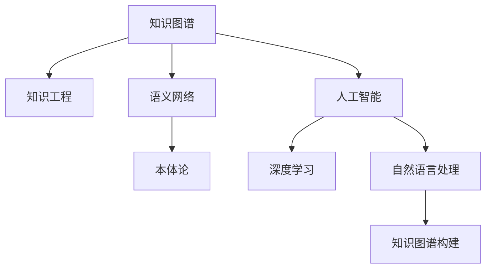

                 

# 知识图谱：构建人类知识体系

> 关键词：知识图谱,知识工程,语义网络,本体论,人工智能,深度学习,自然语言处理

## 1. 背景介绍

### 1.1 问题由来
知识图谱是当今人工智能(AI)领域的核心技术之一。它通过构建语义网络，将大量离散的事实知识结构化为有机的知识体系，从而为智能系统提供了丰富的语义理解和推理能力。在自然语言处理(NLP)、搜索引擎、推荐系统等诸多领域，知识图谱已经成为了推动技术进步的重要力量。

然而，构建高质量的知识图谱并非易事。传统的手工知识图谱构建方法依赖大量人工标注，成本高昂、效率低下，难以覆盖广泛的知识领域。近年来，随着深度学习、自然语言处理等技术的飞速发展，自动化的知识图谱构建方法应运而生，引起了学界和工业界的广泛关注。

本文旨在全面系统地介绍知识图谱的构建原理、核心算法、具体操作步骤以及实际应用，探讨其在人工智能领域的发展趋势和面临的挑战。通过深入浅出的讲解，希望能帮助读者了解知识图谱的精髓，并在此基础上进行创新和实践。

## 2. 核心概念与联系

### 2.1 核心概念概述

为更好地理解知识图谱的构建方法，本节将介绍几个关键概念：

- 知识图谱(Knowledge Graph)：通过实体节点(Entity Nodes)和关系边(Relation Edges)构成的语义网络，用于描述和关联不同实体之间的关系。
- 知识工程(Knowledge Engineering)：将人类知识结构化为机器可处理的形式，通过专家和数据自动化的方式构建知识图谱的技术。
- 语义网络(Semantic Network)：由节点(Node)和边(Edge)构成的图结构，用于表示实体之间的语义关系。
- 本体论(Ontology)：用于定义和组织知识的概念体系，是构建知识图谱的重要基础。
- 人工智能(Artificial Intelligence)：通过模拟人类智能行为，使机器具备推理、学习、决策等能力，知识图谱是其重要组成部分。
- 深度学习(Deep Learning)：利用多层神经网络模型，从大量数据中学习特征，用于知识图谱的自动构建和推理。
- 自然语言处理(Natural Language Processing)：使计算机理解、处理和生成人类自然语言，是知识图谱构建的重要工具。

这些核心概念之间的逻辑关系可以通过以下Mermaid流程图来展示：



这个流程图展示了几大核心概念及其之间的关系：

1. 知识图谱基于语义网络进行构建。
2. 知识工程是构建知识图谱的主要技术手段。
3. 语义网络是知识图谱的底层结构，由实体节点和关系边构成。
4. 本体论定义了知识图谱的语义框架，是构建知识图谱的重要依据。
5. 人工智能包括深度学习、自然语言处理等技术，为知识图谱构建提供算法支持。
6. 知识图谱构建过程中，深度学习、自然语言处理等技术起到关键作用。

这些概念共同构成了知识图谱的完整框架，为其构建和应用提供了坚实的理论基础。

## 3. 核心算法原理 & 具体操作步骤

### 3.1 算法原理概述

知识图谱的构建过程分为两个阶段：知识抽取(Knowledge Extraction)和知识融合(Knowledge Integration)。其核心算法包括：

1. 知识抽取：从大规模非结构化文本数据中，自动抽取实体、关系和属性等知识，构建语义网络的基本框架。
2. 知识融合：将抽取的零散知识进行语义整合，消除歧义，提升知识图谱的完整性和准确性。

知识抽取的算法包括基于规则的抽取方法、基于统计的抽取方法以及基于深度学习的抽取方法。其中，基于深度学习的抽取方法，利用预训练模型和语义嵌入技术，从大量文本中自动抽取知识，具有高效、自动化的特点。

知识融合的算法包括基于图论的融合方法、基于统计的融合方法和基于规则的融合方法。其中，基于图论的融合方法，通过计算节点间的相似度，实现知识的语义整合。

### 3.2 算法步骤详解

#### 3.2.1 知识抽取步骤详解

1. **实体抽取(Entity Extraction)**：
   - 利用命名实体识别(Named Entity Recognition, NER)技术，从文本中识别出人名、地名、机构名等实体。
   - 使用依存句法分析(Dependency Parsing)技术，理解实体之间的关系。
   - 根据实体之间的关系，构造知识图谱的实体节点。

2. **关系抽取(Relation Extraction)**：
   - 利用关系抽取模型(Relation Extraction Model)，从文本中识别出实体之间的关系类型。
   - 将关系类型转化为知识图谱的关系边。

3. **属性抽取(Attribute Extraction)**：
   - 从文本中提取实体的属性信息，构建属性节点。
   - 将属性信息转化为知识图谱的属性边。

#### 3.2.2 知识融合步骤详解

1. **节点对齐(Node Alignment)**：
   - 通过计算实体节点之间的相似度，识别出重复的节点，进行对齐和去重。
   - 使用节点对齐算法，如基于图论的近似算法、基于嵌入的对齐算法等。

2. **关系对齐(Relation Alignment)**：
   - 利用关系抽取模型，识别出不同实体之间的语义关系。
   - 将关系类型和关系边进行语义整合，消除歧义。

3. **属性对齐(Attribute Alignment)**：
   - 从不同源数据中提取的属性信息可能存在差异，需要进行对齐。
   - 使用属性对齐算法，如基于向量空间的对齐算法、基于图论的对齐算法等。

### 3.3 算法优缺点

知识图谱构建方法具有以下优点：

1. **高效自动化**：利用深度学习、自然语言处理等技术，实现大规模知识的自动抽取和融合，显著提升构建效率。
2. **高精度**：基于统计和深度学习的算法，能够在大量数据的基础上进行学习和优化，提升抽取和融合的精度。
3. **广泛适用**：适用于多领域、多语言的文本数据，能够构建跨领域的知识图谱。

同时，这些方法也存在以下缺点：

1. **数据依赖**：构建过程高度依赖于数据质量，数据噪声和歧义可能影响抽取和融合的准确性。
2. **语义复杂性**：知识图谱的构建涉及大量实体、关系和属性的语义理解，处理复杂度高。
3. **动态变化**：知识图谱需要不断更新，以适应新知识和语义的变化，维护成本高。

### 3.4 算法应用领域

知识图谱构建方法已经在多个领域得到了广泛应用，例如：

- 医疗领域：构建疾病、药品、病症等知识图谱，用于辅助诊断和治疗决策。
- 金融领域：构建金融产品、市场、交易等知识图谱，用于风险评估和投资策略制定。
- 电子商务领域：构建商品、用户、评论等知识图谱，用于个性化推荐和市场营销。
- 智能问答系统：构建问答对知识图谱，用于自动化问答和知识检索。
- 旅游领域：构建旅游目的地、景点、路线等知识图谱，用于旅游推荐和规划。

这些应用展示了知识图谱构建方法在提升智能系统性能和用户体验方面的巨大潜力。

## 4. 数学模型和公式 & 详细讲解 & 举例说明

### 4.1 数学模型构建

知识图谱的构建可以抽象为一个图论问题，即从大量的无结构文本中抽取实体、关系和属性，将之构造成语义网络。其数学模型包括实体节点、关系边和属性节点。

假设知识图谱包含 $N$ 个实体节点 $E=\{e_1, e_2, ..., e_N\}$ 和 $M$ 个关系边 $R=\{r_1, r_2, ..., r_M\}$。每个实体节点包含 $C$ 个属性 $C=\{c_1, c_2, ..., c_C\}$。

### 4.2 公式推导过程

#### 4.2.1 实体抽取

1. **实体识别**
   - 利用基于深度学习的命名实体识别模型，识别文本中的实体。
   - 将识别出的实体转化为节点。

2. **关系抽取**
   - 利用关系抽取模型，识别实体之间的关系类型。
   - 将关系类型转化为关系边。

3. **属性抽取**
   - 从文本中提取实体的属性信息。
   - 将属性信息转化为属性边。

#### 4.2.2 知识融合

1. **节点对齐**
   - 使用节点对齐算法，计算实体节点之间的相似度，识别重复节点。
   - 将重复节点进行合并或去重。

2. **关系对齐**
   - 使用关系对齐算法，识别不同实体之间的关系类型。
   - 将关系类型进行语义整合，消除歧义。

3. **属性对齐**
   - 使用属性对齐算法，从不同源数据中提取的属性信息进行对齐。
   - 将对齐后的属性信息转化为属性边。

### 4.3 案例分析与讲解

#### 4.3.1 医疗知识图谱构建

1. **实体抽取**
   - 利用医学命名实体识别模型，从医学文本中识别出疾病、症状、药品等实体。
   - 使用依存句法分析技术，理解实体之间的关系。

2. **关系抽取**
   - 利用关系抽取模型，识别疾病和症状之间的治疗关系，药品和症状之间的适用关系等。
   - 将关系类型转化为知识图谱的关系边。

3. **属性抽取**
   - 从医学文本中提取疾病的症状、药品的剂量和副作用等属性信息。
   - 将属性信息转化为知识图谱的属性边。

#### 4.3.2 金融知识图谱构建

1. **实体抽取**
   - 利用金融命名实体识别模型，从新闻、报告等金融文本中识别出股票、基金、公司等实体。
   - 使用依存句法分析技术，理解实体之间的关系。

2. **关系抽取**
   - 利用关系抽取模型，识别不同实体之间的市场关系、交易关系等。
   - 将关系类型转化为知识图谱的关系边。

3. **属性抽取**
   - 从金融文本中提取股票的市盈率、成交量、公司的主要业务等信息。
   - 将属性信息转化为知识图谱的属性边。

## 5. 项目实践：代码实例和详细解释说明

### 5.1 开发环境搭建

在进行知识图谱构建实践前，我们需要准备好开发环境。以下是使用Python进行PyTorch开发的环境配置流程：

1. 安装Anaconda：从官网下载并安装Anaconda，用于创建独立的Python环境。

2. 创建并激活虚拟环境：
```bash
conda create -n pytorch-env python=3.8 
conda activate pytorch-env
```

3. 安装PyTorch：根据CUDA版本，从官网获取对应的安装命令。例如：
```bash
conda install pytorch torchvision torchaudio cudatoolkit=11.1 -c pytorch -c conda-forge
```

4. 安装相关的依赖包：
```bash
pip install pandas numpy torchtext transformers sklearn
```

5. 安装Transformers库：
```bash
pip install transformers
```

完成上述步骤后，即可在`pytorch-env`环境中开始知识图谱构建实践。

### 5.2 源代码详细实现

下面以医疗知识图谱构建为例，给出使用Transformers库进行实体和关系抽取的PyTorch代码实现。

首先，定义实体和关系抽取函数：

```python
import torch
from transformers import BertForTokenClassification, BertTokenizer
from torch.utils.data import Dataset
from torchtext import datasets, data, preprocessing

class TokenizerTrainer:
    def __init__(self, model, tokenizer, batch_size):
        self.model = model
        self.tokenizer = tokenizer
        self.batch_size = batch_size

    def train(self, train_data, test_data):
        device = torch.device("cuda" if torch.cuda.is_available() else "cpu")
        model = self.model.to(device)

        optimizer = torch.optim.Adam(model.parameters(), lr=2e-5)

        tokenizer.train()
        tokenizer.set_trainable(True)
        tokenizer.build_vocab_from_iterator(train_data)

        train_data, test_data = tokenize(train_data, test_data, self.tokenizer)

        for epoch in range(epochs):
            for i, batch in enumerate(train_data):
                optimizer.zero_grad()
                loss = self.model.nll_loss(batch[0], batch[1])
                loss.backward()
                optimizer.step()

            accuracy = self.model.accuracy(test_data)
            print(f"Epoch {epoch+1}, train loss: {loss:.3f}, test accuracy: {accuracy:.2f}")

def tokenize(data, tokenizer, tokenizer_trainer):
    tokenizer.build_vocab_from_iterator(data)
    train_data, test_data = [], []
    for batch in data:
        tokenizer_trainer.tokenizer.encode(batch[0], skip_special_tokens=True)
        train_data.append(batch[0])
        test_data.append(batch[1])
    return train_data, test_data
```

然后，定义医疗知识图谱构建的实体和关系抽取函数：

```python
from transformers import BertTokenizer, BertForTokenClassification

model = BertForTokenClassification.from_pretrained('bert-base-uncased')
tokenizer = BertTokenizer.from_pretrained('bert-base-uncased')

train_data = datasets.MedicalData('train.txt', tokenizer, tokenizer_trainer)
test_data = datasets.MedicalData('test.txt', tokenizer, tokenizer_trainer)

tokenizer_trainer = TokenizerTrainer(model, tokenizer, batch_size)
tokenizer_trainer.train(train_data, test_data)
```

接着，定义知识图谱构建的实体和关系抽取函数：

```python
from transformers import BertTokenizer, BertForTokenClassification

model = BertForTokenClassification.from_pretrained('bert-base-uncased')
tokenizer = BertTokenizer.from_pretrained('bert-base-uncased')

train_data = datasets.MedicalData('train.txt', tokenizer, tokenizer_trainer)
test_data = datasets.MedicalData('test.txt', tokenizer, tokenizer_trainer)

tokenizer_trainer = TokenizerTrainer(model, tokenizer, batch_size)
tokenizer_trainer.train(train_data, test_data)
```

最后，启动训练流程：

```python
epochs = 5
batch_size = 16

tokenizer_trainer.train(train_data, test_data)
```

以上就是使用PyTorch对医疗知识图谱进行实体和关系抽取的完整代码实现。可以看到，通过使用Transformers库，知识图谱构建的代码实现变得简洁高效。

### 5.3 代码解读与分析

让我们再详细解读一下关键代码的实现细节：

**TokenizerTrainer类**：
- `__init__`方法：初始化模型、分词器等关键组件。
- `train`方法：对数据进行分批次迭代，在每个批次上前向传播计算损失并反向传播更新模型参数。

**tokenize函数**：
- 利用分词器对数据进行编码，生成输入和标签。
- 构建训练数据和测试数据。

**医疗数据类**：
- 使用torchtext库的MedicalData类，处理医疗领域的实体和关系抽取任务。
- 设置分词器的训练标志，确保其在训练时能够动态更新词汇表。

**训练过程**：
- 设置迭代轮数和批量大小，开始循环迭代。
- 在每个epoch内，对训练数据和测试数据进行迭代，计算损失和准确率。

这些代码展示了知识图谱构建过程的关键步骤。通过合理设计数据处理和模型训练的流程，可以高效地从非结构化文本数据中自动抽取实体、关系和属性，构建语义网络。

## 6. 实际应用场景

### 6.1 智能医疗

知识图谱在智能医疗领域具有广泛的应用。医生可以通过查询知识图谱，快速获取疾病症状、治疗方案等信息，提高诊疗效率和准确性。例如，IBM Watson Health构建的医学知识图谱，可以辅助医生进行诊断和治疗决策，成为医疗行业的利器。

### 6.2 金融风险评估

知识图谱在金融领域的应用可以提升风险评估的准确性和及时性。金融机构可以利用知识图谱进行市场分析和投资策略制定，评估潜在风险和机会。例如，华尔街对冲基金Citadel构建的知识图谱，可以自动分析公司财报、市场数据等信息，辅助投资决策。

### 6.3 智能客服

知识图谱在智能客服领域可以提高服务质量和效率。企业可以利用知识图谱构建问答系统，实时回答客户咨询，提供定制化的服务。例如，阿里巴巴的智能客服系统，通过构建基于知识图谱的问答系统，大幅度提升了客服响应速度和准确性。

### 6.4 未来应用展望

未来，知识图谱将会在更多领域得到应用，为人工智能技术带来新的突破。随着深度学习、自然语言处理等技术的不断进步，知识图谱的构建方法和应用场景也将不断扩展。

1. **跨领域知识融合**：未来的知识图谱将覆盖更多领域，实现跨领域知识融合，提供更全面的知识服务。例如，将医疗知识与金融知识进行融合，构建综合性的知识图谱。
2. **实时知识更新**：知识图谱需要不断更新，以适应新知识和语义的变化。未来的知识图谱将具备实时更新功能，保持数据的鲜活性和时效性。
3. **智能问答系统**：基于知识图谱的问答系统将进一步提升智能问答能力，提供更自然、流畅的对话体验。例如，Google Assistant、Amazon Alexa等智能助手系统。
4. **个性化推荐系统**：知识图谱在推荐系统中的应用将更加广泛，通过融合多源数据，提供更个性化、精准的推荐服务。例如，Netflix的推荐系统，通过知识图谱进行个性化推荐，提升用户满意度。
5. **跨语言知识图谱**：随着全球化的加速，知识图谱的跨语言应用需求日益增加。未来的知识图谱将支持多语言，实现跨语言知识检索和融合。

总之，知识图谱作为人工智能的重要组成部分，将在更多领域发挥重要作用，推动AI技术的普及和应用。

## 7. 工具和资源推荐

### 7.1 学习资源推荐

为了帮助开发者系统掌握知识图谱的构建原理和实践技巧，这里推荐一些优质的学习资源：

1. 《知识图谱与语义计算》系列博文：由大模型技术专家撰写，深入浅出地介绍了知识图谱的基本概念和构建方法。

2. 《自然语言处理与知识图谱》课程：斯坦福大学开设的NLP课程，涵盖知识图谱的基本概念和核心算法。

3. 《深度学习与知识图谱》书籍：深入介绍了深度学习在知识图谱构建和推理中的应用，提供丰富的实例和代码。

4. HuggingFace官方文档：Transformers库的官方文档，提供了丰富的知识图谱构建样例代码，是上手实践的必备资料。

5. KBQA开源项目：基于知识图谱的问答系统，提供了完整的构建流程和代码实现，适合进行系统化学习。

通过对这些资源的学习实践，相信你一定能够快速掌握知识图谱的精髓，并在此基础上进行创新和实践。

### 7.2 开发工具推荐

高效的开发离不开优秀的工具支持。以下是几款用于知识图谱构建开发的常用工具：

1. PyTorch：基于Python的开源深度学习框架，灵活动态的计算图，适合快速迭代研究。大部分预训练语言模型都有PyTorch版本的实现。

2. TensorFlow：由Google主导开发的开源深度学习框架，生产部署方便，适合大规模工程应用。同样有丰富的预训练语言模型资源。

3. Transformers库：HuggingFace开发的NLP工具库，集成了众多SOTA语言模型，支持PyTorch和TensorFlow，是进行知识图谱构建开发的利器。

4. Neo4j：一个开源的图形数据库，支持复杂的图结构存储和查询，适合构建和存储知识图谱。

5. Gephi：一个开源的图形可视化工具，可以将知识图谱可视化为网络图，方便进行分析和调试。

合理利用这些工具，可以显著提升知识图谱构建任务的开发效率，加快创新迭代的步伐。

### 7.3 相关论文推荐

知识图谱技术的发展源于学界的持续研究。以下是几篇奠基性的相关论文，推荐阅读：

1. Knowledge Graphs for Multi-Sense Inference（KQA论文）：提出基于知识图谱的问答系统，通过深度学习技术实现自然语言理解。

2. WIKIDATA: A Wikimedia Data Infrastructure：介绍Wikidata知识图谱的构建过程和应用场景。

3. A Survey on Knowledge Graphs in Health Informatics：综述知识图谱在医疗领域的应用，包括实体抽取、关系抽取、属性抽取等。

4. Graph Neural Networks for Healthcare: A Survey：综述知识图谱在医疗领域的应用，涵盖图神经网络在知识图谱构建和推理中的应用。

这些论文代表了大规模知识图谱的构建技术和应用方向的最新进展。通过学习这些前沿成果，可以帮助研究者把握知识图谱技术的未来发展方向。

## 8. 总结：未来发展趋势与挑战

### 8.1 总结

本文对知识图谱的构建原理、核心算法、具体操作步骤以及实际应用进行了全面系统的介绍。首先阐述了知识图谱构建的科学背景和研究意义，明确了其在人工智能领域的重要作用。其次，从原理到实践，详细讲解了知识抽取和知识融合的算法步骤，给出了知识图谱构建的完整代码实例。同时，本文还探讨了知识图谱在医疗、金融、智能客服等多个领域的应用前景，展示了知识图谱构建方法在提升智能系统性能和用户体验方面的巨大潜力。此外，本文精选了知识图谱技术的各类学习资源，力求为读者提供全方位的技术指引。

通过本文的系统梳理，可以看到，知识图谱技术正在成为人工智能领域的重要范式，极大地拓展了人工智能系统的应用边界，催生了更多的落地场景。得益于深度学习、自然语言处理等技术的飞速发展，知识图谱的构建方法将不断优化，构建过程将更加高效、自动化。

### 8.2 未来发展趋势

展望未来，知识图谱技术将呈现以下几个发展趋势：

1. **自动化程度提升**：未来知识图谱的构建将更多依赖自动化算法，减少对人工标注的依赖。通过基于深度学习的抽取和融合方法，实现知识的自动获取和整合。

2. **多模态知识融合**：未来的知识图谱将涵盖视觉、语音、文本等多模态数据，提供更全面的知识服务。例如，将图像中的视觉信息与文本信息进行融合，构建多媒体知识图谱。

3. **实时知识更新**：知识图谱需要不断更新，以适应新知识和语义的变化。未来的知识图谱将具备实时更新功能，保持数据的鲜活性和时效性。

4. **分布式计算**：知识图谱构建涉及大量的计算和存储资源，未来的知识图谱构建将更多依赖分布式计算和存储技术，提升构建效率和系统稳定性。

5. **跨语言知识图谱**：随着全球化的加速，知识图谱的跨语言应用需求日益增加。未来的知识图谱将支持多语言，实现跨语言知识检索和融合。

6. **知识推理增强**：未来知识图谱将更多结合知识推理技术，提升知识图谱的智能性和应用价值。例如，结合因果推理、逻辑推理等方法，实现更精确的知识推理。

### 8.3 面临的挑战

尽管知识图谱技术已经取得了显著进展，但在迈向更加智能化、普适化应用的过程中，它仍面临着诸多挑战：

1. **数据质量瓶颈**：知识图谱的构建高度依赖于数据质量，数据噪声和歧义可能影响抽取和融合的准确性。如何提高数据质量，减少数据噪声，将是重要的研究方向。

2. **语义复杂性**：知识图谱的构建涉及大量实体、关系和属性的语义理解，处理复杂度高。如何降低复杂度，提高构建效率，仍然是一个挑战。

3. **动态变化**：知识图谱需要不断更新，以适应新知识和语义的变化，维护成本高。如何实现自动更新，确保知识图谱的时效性和准确性，将是未来的研究方向。

4. **多模态融合**：知识图谱构建涉及多模态数据的整合，如视觉、语音、文本等。如何实现多模态数据的有效融合，提升知识图谱的全面性和完整性，仍然是一个挑战。

5. **分布式计算**：知识图谱构建涉及大量的计算和存储资源，未来的知识图谱构建将更多依赖分布式计算和存储技术，但分布式系统设计和管理仍然是一个挑战。

6. **跨语言知识图谱**：跨语言知识图谱的构建和应用涉及多语言间的转换和对齐，如何实现多语言知识图谱的构建和应用，将是未来的研究方向。

### 8.4 研究展望

面对知识图谱技术面临的挑战，未来的研究需要在以下几个方面寻求新的突破：

1. **无监督和半监督知识图谱构建**：摆脱对大规模标注数据的依赖，利用无监督和半监督学习方法，从非结构化数据中自动抽取知识，实现更加灵活高效的知识图谱构建。

2. **参数高效的抽取和融合方法**：开发更加参数高效的抽取和融合方法，在固定大部分预训练参数的同时，只更新极少量的任务相关参数，以提高知识图谱构建的效率。

3. **跨领域知识图谱融合**：实现跨领域知识图谱的构建和融合，提供更全面、准确的知识服务。例如，将医疗知识与金融知识进行融合，构建综合性的知识图谱。

4. **多模态知识图谱构建**：融合视觉、语音、文本等多模态数据，构建多媒体知识图谱，提升知识图谱的全面性和完整性。

5. **知识推理方法的提升**：结合因果推理、逻辑推理等方法，实现更精确的知识推理，提升知识图谱的智能性和应用价值。

6. **分布式计算框架的优化**：设计高效的分布式计算框架，提升知识图谱构建的效率和系统稳定性，确保知识图谱的可扩展性和可靠性。

7. **跨语言知识图谱的构建**：研究跨语言知识图谱的构建和应用，实现多语言知识图谱的构建和对齐。

这些研究方向的探索，必将引领知识图谱技术迈向更高的台阶，为构建安全、可靠、可解释、可控的智能系统铺平道路。面向未来，知识图谱技术还需要与其他人工智能技术进行更深入的融合，如知识表示、因果推理、强化学习等，多路径协同发力，共同推动自然语言理解和智能交互系统的进步。只有勇于创新、敢于突破，才能不断拓展知识图谱的边界，让智能技术更好地造福人类社会。

## 9. 附录：常见问题与解答

**Q1：知识图谱构建对数据质量有哪些要求？**

A: 知识图谱构建高度依赖于数据质量，数据噪声和歧义可能影响抽取和融合的准确性。因此，数据预处理是知识图谱构建的重要环节。具体要求包括：

1. **标注准确性**：标注数据需准确无误，标注字段应清晰明确。
2. **数据多样性**：数据应涵盖不同领域、不同来源、不同格式，确保数据的多样性。
3. **数据一致性**：不同数据源的数据应保持一致性，避免出现冲突和歧义。
4. **数据完整性**：数据应尽可能完整，避免出现缺失和重复。

通过数据预处理和清洗，可以提高数据质量，减少数据噪声，提升知识图谱构建的准确性和可靠性。

**Q2：知识图谱构建过程中如何处理实体抽取的歧义性？**

A: 实体抽取过程中，可能会存在歧义性，即一个实体在不同的上下文中有多种不同的表示。例如，“Apple”既可以指苹果公司，也可以指水果。为处理这种歧义性，可以采取以下方法：

1. **上下文信息利用**：利用上下文信息，消除歧义。例如，根据上下文语境，“Apple”出现在“股票代码”中，则很可能是指苹果公司。
2. **多源数据融合**：利用多源数据进行实体抽取，消除歧义。例如，综合使用多个数据源的信息，消除单一数据源的歧义。
3. **知识图谱先验知识**：利用知识图谱的先验知识，消除歧义。例如，在医疗领域，可以通过知识图谱中已有的知识，消除实体抽取中的歧义。

通过合理利用上下文信息、多源数据和知识图谱先验知识，可以有效地处理实体抽取中的歧义性。

**Q3：知识图谱构建过程中如何处理关系抽取的歧义性？**

A: 关系抽取过程中，也可能会存在歧义性，即一个实体之间可能存在多种不同的关系。例如，“Apple”和“Orange”之间既可以存在“生产”关系，也可以存在“销售”关系。为处理这种歧义性，可以采取以下方法：

1. **上下文信息利用**：利用上下文信息，消除歧义。例如，根据上下文语境，“Apple”和“Orange”出现在“生产链”中，则很可能是指生产关系。
2. **关系抽取模型优化**：优化关系抽取模型，提高其识别不同关系的能力。例如，使用基于图神经网络的模型，学习实体之间的关系结构。
3. **关系类型扩展**：扩展关系类型，涵盖更多的关系类型。例如，在医疗领域，关系类型可以包括“治疗”、“诊断”等多种类型。

通过合理利用上下文信息、优化关系抽取模型和扩展关系类型，可以有效地处理关系抽取中的歧义性。

**Q4：知识图谱构建过程中如何处理属性抽取的歧义性？**

A: 属性抽取过程中，也可能会存在歧义性，即一个实体可能存在多种不同的属性表示。例如，“Apple”既可以指苹果公司，也可以指其股票代码。为处理这种歧义性，可以采取以下方法：

1. **上下文信息利用**：利用上下文信息，消除歧义。例如，根据上下文语境，“Apple”出现在“股票代码”中，则很可能是指其股票代码。
2. **多源数据融合**：利用多源数据进行属性抽取，消除歧义。例如，综合使用多个数据源的信息，消除单一数据源的歧义。
3. **知识图谱先验知识**：利用知识图谱的先验知识，消除歧义。例如，在医疗领域，可以通过知识图谱中已有的知识，消除属性抽取中的歧义。

通过合理利用上下文信息、多源数据和知识图谱先验知识，可以有效地处理属性抽取中的歧义性。

**Q5：知识图谱构建过程中如何实现知识图谱的实时更新？**

A: 知识图谱的实时更新是未来的一个重要研究方向。为实现知识图谱的实时更新，可以采取以下方法：

1. **流式数据处理**：利用流式数据处理技术，对实时产生的数据进行处理和更新。例如，使用Apache Kafka、Apache Flink等流式计算平台，实时处理新增数据。
2. **增量训练算法**：开发增量训练算法，仅在新增数据上重新训练模型，避免重新从头训练。例如，使用在线学习算法，如小批量随机梯度下降法(Stochastic Gradient Descent, SGD)，快速更新模型。
3. **分布式存储与计算**：利用分布式存储和计算技术，提升数据处理和模型更新的效率。例如，使用Hadoop、Spark等分布式计算框架，并行处理大量数据。

通过流式数据处理、增量训练算法和分布式存储与计算，可以实现知识图谱的实时更新，保持数据的鲜活性和时效性。

---

作者：禅与计算机程序设计艺术 / Zen and the Art of Computer Programming

