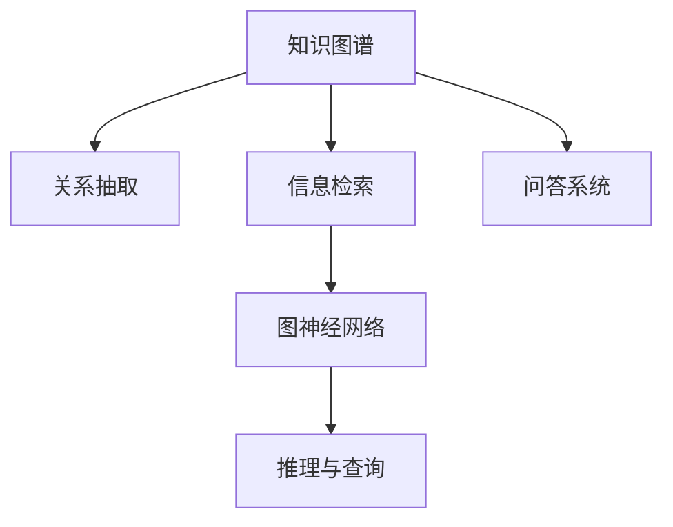

                 

# 知识图谱：构建和应用语义网络

> 关键词：知识图谱,语义网络,图神经网络(Graph Neural Network, GNN),关系抽取,信息检索,问答系统,语义推理

## 1. 背景介绍

### 1.1 问题由来

在信息爆炸的互联网时代，大量结构化和非结构化数据产生。人们希望能够更加高效地利用这些数据，从中提取有用的知识和信息。传统的基于规则和统计的搜索方法已经难以满足用户需求，而传统的数据库管理系统也无法处理结构化和非结构化数据的混合存储。

知识图谱（Knowledge Graph, KG）作为一种语义网络表示，通过节点和边来描述实体和实体之间的关系，被广泛应用于语义搜索、推荐系统、问答系统等领域。知识图谱融合了结构化和非结构化数据，可以高效地进行信息检索和语义推理。

### 1.2 问题核心关键点

知识图谱的核心是实体-关系-实体三元组（Triple），通过描述实体之间的关系，构建出语义网络，进而实现对数据的高效理解和利用。知识图谱的构建和应用涉及以下几个关键点：

- 数据采集与清洗：采集来自不同数据源的结构化和非结构化数据，并进行清洗、融合、标注。
- 图谱构建：将清洗后的数据转化为知识图谱的形式，存储于图数据库中。
- 知识融合：对不同数据源的知识进行融合，提高知识的一致性和完整性。
- 推理与查询：构建推理引擎，实现基于知识图谱的信息检索、问答、推荐等功能。

这些核心点涉及数据的预处理、模型的训练、推理和应用等多个方面，是知识图谱研究和应用的基础。

## 2. 核心概念与联系

### 2.1 核心概念概述

在知识图谱构建和应用过程中，涉及多个核心概念：

- 知识图谱（Knowledge Graph）：一种语义网络表示，用于描述实体及其之间的关系，广泛用于信息检索、推荐系统等领域。
- 语义网络（Semantic Network）：由节点和边组成的图，用于表示实体和实体之间的关系。
- 图神经网络（Graph Neural Network, GNN）：一类特殊的深度学习模型，专门用于处理图数据，通过图卷积等方法捕捉节点间的关系。
- 关系抽取（Relation Extraction）：从文本中抽取实体和实体之间的关系，是知识图谱构建的基础。
- 信息检索（Information Retrieval）：根据用户查询，从知识图谱中提取相关信息，满足用户的信息需求。
- 问答系统（Question Answering, QA）：根据用户输入的自然语言问题，自动给出答案。

这些概念之间的逻辑关系可以通过以下Mermaid流程图来展示：



这个流程图展示知识图谱构建和应用的核心概念及其之间的关系：

1. 知识图谱构建：通过关系抽取、图神经网络等技术，从文本数据中提取实体和关系，构建语义网络。
2. 信息检索：在知识图谱中查找与用户查询相关的实体和关系，实现信息检索功能。
3. 问答系统：将用户输入的自然语言问题转化为语义查询，在知识图谱中检索相关信息，并生成回答。

## 3. 核心算法原理 & 具体操作步骤
### 3.1 算法原理概述

知识图谱的构建和应用，主要依赖于图神经网络（GNN）技术。图神经网络是一种特殊的深度学习模型，专门用于处理图数据，通过图卷积等方法捕捉节点间的关系，将非结构化数据转化为结构化的语义表示。

GNN模型的核心思想是，通过图卷积操作，捕捉节点之间的局部关系，并将局部信息汇总到全局节点上，形成全局表示。图卷积操作与传统卷积类似，但考虑到节点之间的关系，需要设计特定的卷积核。常用的图卷积操作包括Gated Graph Convolution Network (Gated GCN)、Graph Convolutional Network (GCN)等。

知识图谱的构建过程中，首先需要进行实体抽取和关系抽取。关系抽取可以通过传统的自然语言处理技术实现，如基于规则的抽取方法、基于统计的抽取方法等。在关系抽取完成后，需要利用图神经网络对知识图谱进行嵌入学习，将每个节点表示为一个高维向量，捕捉节点之间的关系。

### 3.2 算法步骤详解

基于GNN的知识图谱构建和应用，主要包括以下几个关键步骤：

**Step 1: 数据预处理**
- 采集不同数据源的结构化和非结构化数据，如网页、社交媒体、文档等。
- 进行数据清洗和标注，如去除重复数据、噪音数据，标注实体和关系。
- 对非结构化数据进行实体和关系抽取，转化为结构化数据。

**Step 2: 图谱构建**
- 将结构化数据转化为图结构，构建知识图谱。
- 设计图神经网络模型，如Gated GCN、GCN等，进行知识嵌入学习。
- 将每个节点表示为一个高维向量，捕捉节点之间的关系。

**Step 3: 知识融合**
- 对不同数据源的知识进行融合，提高知识的一致性和完整性。
- 使用图神经网络进行多源知识融合，如通过节点之间传递的信息，提高知识的准确性。
- 对知识图谱进行迭代优化，通过不断的训练，提高知识的泛化能力。

**Step 4: 推理与查询**
- 构建推理引擎，如基于规则的推理引擎、基于图神经网络的推理引擎等。
- 在知识图谱中进行信息检索、问答等任务。
- 使用图神经网络进行推理，如通过节点之间的关系，推断新的实体和关系。

### 3.3 算法优缺点

基于GNN的知识图谱构建和应用方法具有以下优点：

- 高效融合多种数据源：GNN能够高效地融合不同数据源的知识，提高知识的一致性和完整性。
- 能够捕捉节点之间的关系：通过图卷积操作，GNN能够捕捉节点之间的关系，形成全局表示。
- 推理能力强：GNN能够进行复杂的语义推理，如基于规则的推理、基于神经网络的推理等。

同时，该方法也存在一定的局限性：

- 计算复杂度高：GNN的计算复杂度较高，需要大量的计算资源。
- 数据稀疏性问题：知识图谱中存在大量的稀疏边，对稀疏图的数据处理较为困难。
- 模型解释性不足：GNN的模型较为复杂，难以解释其内部工作机制。

尽管存在这些局限性，但就目前而言，基于GNN的知识图谱构建和应用方法仍是最主流范式。未来相关研究的重点在于如何进一步降低计算复杂度，提高模型解释性，同时兼顾推理效率和知识泛化能力等因素。

### 3.4 算法应用领域

基于GNN的知识图谱构建和应用方法，已经广泛应用于以下领域：

- 信息检索：如知识图谱检索系统、推荐系统等。通过在知识图谱中进行语义查询，实现高效的信息检索。
- 问答系统：如基于知识图谱的问答系统、智能客服等。通过在知识图谱中进行语义推理，自动回答用户问题。
- 推荐系统：如基于知识图谱的推荐系统、电商推荐系统等。通过在知识图谱中进行推理，推荐合适的商品或内容。
- 医疗领域：如基于知识图谱的疾病诊断、医疗推荐等。通过在知识图谱中进行推理，辅助医生诊断和治疗。
- 金融领域：如基于知识图谱的信用评估、金融推荐等。通过在知识图谱中进行推理，评估用户的信用风险，推荐合适的金融产品。

## 4. 数学模型和公式 & 详细讲解 & 举例说明

### 4.1 数学模型构建

知识图谱的构建主要涉及实体抽取和关系抽取。以下以关系抽取为例，介绍其数学模型。

假设已知一条文本：“John Smith is a software engineer at Google”，我们需要从中抽取“John Smith”和“is a software engineer at Google”之间的关系。定义一个知识图谱 $G=(V,E)$，其中 $V$ 为节点集合，$E$ 为边集合。

首先，我们需要定义实体和关系的表示：

- 实体 $v$ 表示为节点 $n$。
- 关系 $e$ 表示为节点 $n$ 和 $n'$ 之间的边 $(n,n')$。

在关系抽取过程中，我们需要对文本进行分词和命名实体识别，找出实体和关系。假设分词和命名实体识别已经完成，我们得到了以下信息：

- 实体：John Smith，is，a，software engineer，at，Google。
- 关系：is，a，at。

下一步，我们需要将实体和关系转化为节点和边，构建知识图谱。具体来说，我们可以将每个实体表示为一个节点，将每个关系表示为一条边。在关系抽取过程中，我们需要定义关系类型的表示，如“is a”、“at”等。

定义节点 $n$ 的嵌入向量 $\mathbf{x}_n$，边 $(n,n')$ 的嵌入向量 $\mathbf{e}_{(n,n')}$。定义关系类型的嵌入向量 $\mathbf{r}_{type}$。

在关系抽取过程中，我们需要对关系进行分类，确定关系类型。假设当前关系为“is a”，我们可以将其表示为：

$$
\mathbf{e}_{(n,n')}=\mathbf{r}_{type} \otimes \mathbf{x}_n \otimes \mathbf{x}_{n'}
$$

其中 $\otimes$ 表示向量的乘法操作，可以表示为矩阵乘法或点积等。

### 4.2 公式推导过程

通过图神经网络进行知识图谱的嵌入学习，将每个节点表示为一个高维向量。以下以Gated GCN为例，介绍其公式推导过程。

假设知识图谱中有 $N$ 个节点，每个节点的嵌入向量表示为 $\mathbf{x}_n$。定义邻居节点集合 $N(n)$，每个邻居节点的嵌入向量表示为 $\mathbf{x}_{n'}$。定义节点之间的边权重 $w_{(n,n')}$。

Gated GCN的计算公式如下：

$$
\mathbf{x}_n^{(l+1)} = \sigma\left(\mathbf{x}_n^{(l)} + \sum_{n' \in N(n)} \sum_{k=1}^K \mathbf{W}_k \cdot \mathbf{x}_{n'} \cdot \mathbf{x}_n\right)
$$

其中 $\sigma$ 为激活函数，$\mathbf{W}_k$ 为第 $k$ 层的权重矩阵。$K$ 表示图卷积层数。

在Gated GCN中，我们通过两个全连接层实现图卷积操作。在每个全连接层中，我们将邻居节点的嵌入向量与当前节点的嵌入向量进行拼接，形成新的特征向量。通过线性变换和激活函数，生成当前节点的嵌入向量。

### 4.3 案例分析与讲解

下面以知识图谱的信息检索为例，介绍其核心算法原理。

假设已知用户输入查询：“Find companies founded by John Smith”。我们需要在知识图谱中检索与该查询相关的实体和关系，并生成回答。

首先，我们需要对查询进行分词和命名实体识别，得到以下信息：

- 实体：John Smith
- 关系：founded by

接下来，我们需要在知识图谱中查找与实体和关系相关的节点和边。具体来说，我们可以通过以下步骤实现：

1. 查找与实体“John Smith”相关的节点。假设我们已经将“John Smith”表示为一个节点 $n$。
2. 查找与关系“founded by”相关的节点。假设我们已经将“founded by”表示为一条边 $(n,n')$。
3. 获取节点 $n'$ 的嵌入向量，作为回答的一部分。

通过以上步骤，我们能够高效地从知识图谱中检索与查询相关的实体和关系，生成回答。

## 5. 项目实践：代码实例和详细解释说明

### 5.1 开发环境搭建

在进行知识图谱构建和应用实践前，我们需要准备好开发环境。以下是使用Python进行PyTorch开发的环境配置流程：

1. 安装Anaconda：从官网下载并安装Anaconda，用于创建独立的Python环境。

2. 创建并激活虚拟环境：
```bash
conda create -n gnn-env python=3.8 
conda activate gnn-env
```

3. 安装PyTorch：根据CUDA版本，从官网获取对应的安装命令。例如：
```bash
conda install pytorch torchvision torchaudio cudatoolkit=11.1 -c pytorch -c conda-forge
```

4. 安装相关工具包：
```bash
pip install networkx pandas sklearn matplotlib tqdm jupyter notebook ipython
```

完成上述步骤后，即可在`gnn-env`环境中开始知识图谱构建和应用实践。

### 5.2 源代码详细实现

下面以Gated GCN为例，给出使用PyTorch进行知识图谱嵌入学习的完整代码实现。

首先，定义Gated GCN的模型类：

```python
import torch.nn as nn
import torch.nn.functional as F
import torch

class GatedGCN(nn.Module):
    def __init__(self, in_dim, hidden_dim, out_dim, dropout, n_layers):
        super(GatedGCN, self).__init__()
        self.dropout = dropout
        self.layers = nn.ModuleList()
        self.layers.append(nn.Linear(in_dim, hidden_dim))
        for _ in range(n_layers-1):
            self.layers.append(nn.Linear(hidden_dim, hidden_dim))
        self.layers.append(nn.Linear(hidden_dim, out_dim))
        
    def forward(self, adj, x):
        x = nn.functional.dropout(x, self.dropout, training=self.training)
        for i, layer in enumerate(self.layers):
            x = nn.functional.relu(torch.matmul(adj, layer(x)))
            x = nn.functional.dropout(x, self.dropout, training=self.training)
        return x
```

然后，定义图结构的数据处理函数：

```python
from networkx import graph_to_dgl_graph
from networkx import DataStructures

class GNNDataLoader(torch.utils.data.Dataset):
    def __init__(self, graph_data, graph, features, labels, batch_size=64):
        self.graph_data = graph_data
        self.graph = graph
        self.features = features
        self.labels = labels
        self.batch_size = batch_size
        self.num_features = features.shape[1]
        self.num_labels = labels.shape[1]
        
    def __len__(self):
        return len(self.graph_data) // self.batch_size
    
    def __getitem__(self, idx):
        batch_graph = graph_to_dgl_graph(self.graph, self.graph_data[idx])
        batch_features = torch.tensor(self.features[idx])
        batch_labels = torch.tensor(self.labels[idx])
        return batch_graph, batch_features, batch_labels
```

接着，定义训练和评估函数：

```python
import torch.nn.functional as F

from torch.utils.data import DataLoader

from gnn_model import GatedGCN

class GNNTrainer:
    def __init__(self, model, optimizer, loss_fn, device):
        self.model = model
        self.optimizer = optimizer
        self.loss_fn = loss_fn
        self.device = device
        
    def train(self, train_loader, epoch):
        self.model.train()
        for batch_idx, (adj, x, y) in enumerate(train_loader):
            adj = adj.to(self.device)
            x = x.to(self.device)
            y = y.to(self.device)
            y_pred = self.model(adj, x)
            loss = self.loss_fn(y_pred, y)
            self.optimizer.zero_grad()
            loss.backward()
            self.optimizer.step()
            
            if batch_idx % 10 == 0:
                print('Train Epoch: {} [{}/{} ({:.0f}%)]\tLoss: {:.6f}'.format(
                    epoch, batch_idx * len(adj), len(train_loader.dataset),
                    100. * batch_idx / len(train_loader), loss.item()))
                
    def evaluate(self, test_loader):
        self.model.eval()
        test_loss = 0
        correct = 0
        with torch.no_grad():
            for batch_idx, (adj, x, y) in enumerate(test_loader):
                adj = adj.to(self.device)
                x = x.to(self.device)
                y = y.to(self.device)
                y_pred = self.model(adj, x)
                test_loss += self.loss_fn(y_pred, y).item()
                predicted = torch.argmax(y_pred, dim=1)
                correct += (predicted == y).sum().item()
                
        test_loss /= len(test_loader.dataset)
        print('\nTest set: Average loss: {:.4f}, Accuracy: {}/{} ({:.0f}%)\n'.format(
            test_loss, correct, len(test_loader.dataset),
            100. * correct / len(test_loader.dataset)))
```

最后，启动训练流程并在测试集上评估：

```python
from gnn_dataset import GNNDataLoader

from gnn_model import GatedGCN

from torch.optim import Adam

from sklearn.metrics import accuracy_score

device = torch.device('cuda') if torch.cuda.is_available() else torch.device('cpu')

graph_data = ...
graph = ...
features = ...
labels = ...

train_loader = GNNDataLoader(graph_data, graph, features, labels)
test_loader = GNNDataLoader(graph_data, graph, features, labels)

model = GatedGCN(features.shape[1], hidden_dim=64, out_dim=labels.shape[1], dropout=0.1, n_layers=2)
optimizer = Adam(model.parameters(), lr=0.01)

trainer = GNNTrainer(model, optimizer, nn.CrossEntropyLoss(), device)
trainer.train(train_loader, epoch=10)
trainer.evaluate(test_loader)
```

以上就是使用PyTorch进行Gated GCN模型训练的完整代码实现。可以看到，通过网络X和DGLGraph等工具，我们可以高效地构建图结构，并使用PyTorch进行模型训练。

### 5.3 代码解读与分析

让我们再详细解读一下关键代码的实现细节：

**GatedGCN类**：
- `__init__`方法：初始化Gated GCN模型，定义模型层数、输入输出维度等参数。
- `forward`方法：定义前向传播过程，通过图卷积操作生成当前节点的嵌入向量。

**GNNDataLoader类**：
- `__init__`方法：初始化数据集，定义图的特征和标签等。
- `__len__`方法：返回数据集的样本数量。
- `__getitem__`方法：对单个样本进行处理，将图数据转化为DGLGraph格式，供模型训练和推理使用。

**GNNTrainer类**：
- `__init__`方法：初始化训练器，定义模型、优化器、损失函数和设备等。
- `train`方法：定义训练过程，对每个批次的数据进行前向传播、计算损失、反向传播和更新模型参数。
- `evaluate`方法：定义评估过程，计算模型在测试集上的损失和准确率。

通过以上代码，我们能够高效地进行知识图谱的嵌入学习和推理。开发者可以根据具体任务，进一步调整模型参数、优化器参数、损失函数等，实现最优的微调效果。

## 6. 实际应用场景

### 6.1 智能推荐系统

智能推荐系统是知识图谱的重要应用场景之一。通过构建知识图谱，推荐系统可以高效地进行信息检索和推理，推荐用户感兴趣的商品或内容。

在推荐系统中，知识图谱可以用于：

- 用户画像构建：通过分析用户的历史行为，构建用户画像，预测用户感兴趣的商品或内容。
- 商品画像构建：通过分析商品的标签和属性，构建商品画像，推荐相关商品。
- 用户-商品关联：通过分析用户和商品之间的交互数据，构建用户-商品关联图谱，实现推荐。

### 6.2 医疗诊断系统

医疗诊断系统是知识图谱的另一重要应用场景。通过构建医学知识图谱，医疗诊断系统可以高效地进行信息检索和推理，辅助医生诊断和治疗。

在医疗诊断系统中，知识图谱可以用于：

- 疾病诊断：通过分析患者的历史记录和症状，辅助医生进行疾病诊断。
- 药物推荐：通过分析患者的病史和症状，推荐合适的药物。
- 医疗知识推理：通过分析医学文献和实验数据，推断新的医学知识。

### 6.3 社交网络分析

社交网络分析是知识图谱的又一重要应用场景。通过构建社交网络图谱，社交网络分析可以高效地进行信息检索和推理，分析社交网络中的关系和特征。

在社交网络分析中，知识图谱可以用于：

- 社交关系分析：通过分析社交网络中的关系，发现潜在的关系链和影响力节点。
- 社交特征分析：通过分析社交网络中的特征，发现用户的兴趣和行为模式。
- 社交网络预测：通过分析社交网络中的数据，预测用户的社交行为和关系变化。

## 7. 工具和资源推荐

### 7.1 学习资源推荐

为了帮助开发者系统掌握知识图谱的构建和应用，这里推荐一些优质的学习资源：

1. 《Graph Neural Networks: A Review of Methods and Applications》论文：综述了GNN的研究进展和应用场景，值得阅读。
2. 《Knowledge Graphs》书籍：涵盖了知识图谱的理论和应用，适合深入学习。
3. 《Hands-On Data Science with Python》课程：介绍了如何使用Python进行数据分析和可视化，包括知识图谱的构建和应用。
4. 《Knowledge Graphs and Semantic Technologies》课程：由IBM开设的NLP课程，介绍了知识图谱和语义技术的原理和应用。
5. 《Deep Learning for Graph Neural Networks》课程：由CSOFT开设的深度学习课程，介绍了GNN的理论和应用。

通过对这些资源的学习实践，相信你一定能够快速掌握知识图谱的构建和应用技巧，并用于解决实际的NLP问题。

### 7.2 开发工具推荐

高效的开发离不开优秀的工具支持。以下是几款用于知识图谱构建和应用开发的常用工具：

1. NetworkX：Python的图处理库，用于构建和操作图结构。
2. DGL：基于PyTorch的深度学习库，专门用于处理图数据。
3. Jupyter Notebook：交互式的Python开发环境，方便开发者进行数据处理和模型训练。
4. IPython：Python的交互式环境，方便开发者进行代码调试和交互式计算。
5. Scikit-learn：Python的机器学习库，用于数据预处理和模型评估。
6. Matplotlib：Python的可视化库，用于绘制图表和可视化结果。

合理利用这些工具，可以显著提升知识图谱构建和应用任务的开发效率，加快创新迭代的步伐。

### 7.3 相关论文推荐

知识图谱的研究源于学界的持续研究。以下是几篇奠基性的相关论文，推荐阅读：

1. Knowledge Graphs: A Comprehensive Survey and Classification（知识图谱综述）：综述了知识图谱的研究进展和应用场景，是知识图谱研究的入门之作。
2. Learning to Reason with Graph Networks（使用图网络进行推理）：提出了使用GNN进行推理的算法，为知识图谱的应用提供了新思路。
3. A Survey on Knowledge Graph Embeddings（知识图谱嵌入综述）：综述了知识图谱嵌入的最新研究进展，介绍了多种嵌入算法。
4. Knowledge Graph Embedding with Multiple Embedding Matrices（多嵌入矩阵知识图谱嵌入）：提出了一种新的知识图谱嵌入算法，取得了较好的效果。
5. Relation-Aware Graph Neural Networks for Recommendation Systems（关系感知图神经网络）：将关系感知引入GNN，提高了推荐系统的精度和效果。

这些论文代表了大规模知识图谱的研究进展。通过学习这些前沿成果，可以帮助研究者把握学科前进方向，激发更多的创新灵感。

## 8. 总结：未来发展趋势与挑战

### 8.1 总结

本文对知识图谱的构建和应用进行了全面系统的介绍。首先阐述了知识图谱的研究背景和意义，明确了知识图谱构建和应用在信息检索、推荐系统、医疗诊断等领域的重要作用。其次，从原理到实践，详细讲解了知识图谱的构建和应用算法，给出了知识图谱嵌入学习的完整代码实现。同时，本文还广泛探讨了知识图谱在多个行业领域的应用前景，展示了知识图谱构建和应用方法的广阔前景。

通过本文的系统梳理，可以看到，知识图谱构建和应用方法已经逐渐成为信息检索、推荐系统、医疗诊断等领域的重要技术，极大地提高了数据处理的效率和效果。未来，随着知识图谱技术的不断成熟，知识图谱将在更多的领域得到应用，为各行各业提供新的技术支持。

### 8.2 未来发展趋势

展望未来，知识图谱构建和应用技术将呈现以下几个发展趋势：

1. 知识图谱的规模将持续增大。随着数据量的增加，知识图谱的规模将不断扩大，形成更全面、更丰富的知识体系。
2. 知识图谱的嵌入学习将更加深入。未来将涌现更多高效的嵌入学习算法，提高知识图谱的表达能力。
3. 知识图谱的应用将更加多样化。知识图谱将被广泛应用于信息检索、推荐系统、医疗诊断等领域，解决更多实际问题。
4. 知识图谱的推理能力将进一步提升。未来将涌现更多高效的推理算法，提高知识图谱的推理效果。
5. 知识图谱的跨领域应用将更加广泛。知识图谱将被应用于更多领域，如金融、电商、能源等，为各行各业提供技术支持。

这些趋势凸显了知识图谱构建和应用技术的广阔前景。这些方向的探索发展，必将进一步提升知识图谱的性能和应用范围，为构建人机协同的智能系统铺平道路。

### 8.3 面临的挑战

尽管知识图谱构建和应用技术已经取得了瞩目成就，但在迈向更加智能化、普适化应用的过程中，它仍面临着诸多挑战：

1. 数据采集和标注成本高：知识图谱的构建需要大量高质量的数据，数据采集和标注成本高，难以覆盖所有领域和数据源。
2. 知识图谱的稀疏性问题：知识图谱中存在大量的稀疏边，对稀疏图的数据处理较为困难。
3. 知识图谱的推理能力不足：现有的知识图谱推理算法难以处理复杂的多步推理任务，推理效果还有提升空间。
4. 知识图谱的可扩展性差：知识图谱的构建和推理过程复杂，难以大规模扩展。
5. 知识图谱的解释性不足：知识图谱的模型较为复杂，难以解释其内部工作机制。

尽管存在这些挑战，但通过进一步的研究和技术突破，知识图谱构建和应用技术必将进一步成熟和完善，在更广泛的领域得到应用。

### 8.4 研究展望

面向未来，知识图谱构建和应用技术需要在以下几个方面寻求新的突破：

1. 高效的多源数据融合：探索高效的多源数据融合方法，提高知识图谱的一致性和完整性。
2. 高效的知识图谱嵌入学习：开发高效的知识图谱嵌入算法，提高知识图谱的表达能力。
3. 高效的推理算法：开发高效的推理算法，提高知识图谱的推理效果。
4. 知识图谱的可解释性：探索知识图谱的解释性方法，提高模型的可解释性。
5. 知识图谱的跨领域应用：探索知识图谱的跨领域应用方法，将知识图谱应用于更多领域。

这些研究方向的探索，必将引领知识图谱构建和应用技术迈向更高的台阶，为构建安全、可靠、可解释、可控的智能系统铺平道路。面向未来，知识图谱构建和应用技术还需要与其他人工智能技术进行更深入的融合，如自然语言处理、计算机视觉等，多路径协同发力，共同推动人工智能技术的发展。

## 9. 附录：常见问题与解答

**Q1：知识图谱是否只适用于结构化数据？**

A: 知识图谱不仅适用于结构化数据，还适用于非结构化数据。通过实体抽取和关系抽取，知识图谱可以从非结构化数据中提取实体和关系，转化为结构化数据。

**Q2：知识图谱的构建和应用过程中，需要注意哪些问题？**

A: 知识图谱的构建和应用过程中，需要注意以下问题：

1. 数据采集和标注：需要采集高质量的数据，进行数据清洗和标注。
2. 图结构设计：需要设计合适的图结构，避免不必要的边和节点。
3. 知识融合：需要融合不同数据源的知识，提高知识的一致性和完整性。
4. 推理算法设计：需要设计高效的推理算法，实现复杂的推理任务。
5. 推理性能优化：需要优化推理算法，提高推理效率和效果。
6. 系统部署和维护：需要考虑知识图谱的部署和维护，确保系统稳定运行。

这些问题的解决，需要多方面的努力和实践。只有在数据、模型、算法、工程等各个环节进行全面优化，才能得到理想的知识图谱构建和应用效果。

**Q3：知识图谱在实际应用中，有哪些挑战？**

A: 知识图谱在实际应用中，面临以下挑战：

1. 数据采集和标注成本高：知识图谱的构建需要大量高质量的数据，数据采集和标注成本高。
2. 知识图谱的稀疏性问题：知识图谱中存在大量的稀疏边，对稀疏图的数据处理较为困难。
3. 知识图谱的推理能力不足：现有的知识图谱推理算法难以处理复杂的多步推理任务，推理效果还有提升空间。
4. 知识图谱的可扩展性差：知识图谱的构建和推理过程复杂，难以大规模扩展。
5. 知识图谱的解释性不足：知识图谱的模型较为复杂，难以解释其内部工作机制。

这些挑战需要持续改进和突破，才能实现知识图谱的广泛应用。

**Q4：知识图谱在未来有哪些应用前景？**

A: 知识图谱在未来有以下应用前景：

1. 信息检索：通过在知识图谱中进行语义查询，实现高效的信息检索。
2. 推荐系统：通过在知识图谱中进行推理，推荐合适的商品或内容。
3. 医疗诊断：通过在知识图谱中进行推理，辅助医生诊断和治疗。
4. 社交网络分析：通过在知识图谱中进行推理，分析社交网络中的关系和特征。
5. 智能客服：通过在知识图谱中进行推理，实现智能客服系统。
6. 智慧城市：通过在知识图谱中进行推理，构建智慧城市系统。

这些应用前景展示了知识图谱的广阔应用空间，为各行各业提供了新的技术支持。

---

作者：禅与计算机程序设计艺术 / Zen and the Art of Computer Programming

