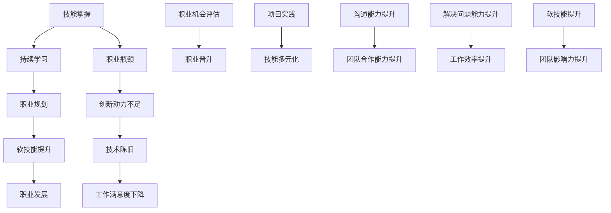

                 

### 文章标题

程序员如何应对职业瓶颈

> 关键词：职业瓶颈，技能提升，持续学习，职业规划，职业发展

在科技迅速发展的今天，程序员作为高科技行业的中坚力量，他们的职业发展路径充满了机遇与挑战。然而，职业瓶颈成为许多程序员在职业生涯中不可避免的难题。本文旨在探讨程序员如何应对职业瓶颈，实现技能提升和职业发展的目标。通过深入分析职业瓶颈的原因、应对策略以及未来发展趋势，为程序员们提供有价值的参考。

### 摘要

本文首先介绍了程序员职业瓶颈的常见表现和原因，包括技术陈旧、缺乏创新动力、职业发展受限等。接着，探讨了应对职业瓶颈的策略，如持续学习、技能多元化、职业规划等。最后，分析了职业瓶颈应对的长期影响，探讨了未来程序员职业发展面临的新趋势和挑战。通过本文的探讨，希望为程序员们提供解决问题的思路和方法，助力他们在职业道路上走得更远、更稳。

## 1. 背景介绍

程序员，作为现代信息技术产业的核心力量，他们扮演着构建软件产品、推动科技创新的重要角色。然而，职业瓶颈这一现象在程序员的职业生涯中却频频出现，成为制约他们发展的关键因素。职业瓶颈，简单来说，是指程序员在职业生涯中遇到的发展停滞、成就感缺失、创新动力不足等问题。

### 职业瓶颈的表现

职业瓶颈在程序员职业生涯中可能表现为以下几种情况：

1. **技术陈旧**：随着技术的快速迭代更新，程序员可能会发现自己掌握的技能逐渐过时，难以应对新兴技术的要求。
2. **缺乏创新动力**：长时间的重复性工作可能导致程序员对工作失去兴趣，缺乏进一步创新的动力。
3. **职业发展受限**：在一些企业中，程序员的职业晋升通道可能相对狭窄，难以实现职业的纵向发展。

### 职业瓶颈的原因

程序员职业瓶颈的形成有其内在和外在原因：

1. **技术更新速度**：科技的快速发展使得新技术的涌现速度远超程序员的吸收能力，导致他们难以跟上技术的前沿。
2. **工作内容单一**：许多程序员的工作内容较为单一，缺乏多样化的工作体验，使得他们的技能发展受限。
3. **企业文化和培训机制**：一些企业的培训机制不完善，缺乏对员工技能提升的支持，导致程序员难以得到持续成长的机会。

### 职业瓶颈的影响

职业瓶颈对程序员的个人和职业发展都有显著的影响：

1. **个人成长受限**：职业瓶颈使得程序员难以实现个人技能的提升，进而影响其职业发展。
2. **工作满意度下降**：长期的职业瓶颈可能导致程序员对工作失去热情，降低工作满意度。
3. **职业发展受限**：无法突破职业瓶颈，程序员可能会错失职业晋升和更高薪资的机会。

综上所述，程序员职业瓶颈是一个普遍存在且需要重视的问题。如何应对这一问题，实现技能提升和职业发展的突破，是每个程序员都需要思考和解决的重要课题。

## 2. 核心概念与联系

在深入探讨程序员如何应对职业瓶颈之前，我们需要明确几个关键概念和它们之间的联系，这将帮助我们更好地理解和解决问题。

### 2.1 技能与职业发展的关系

技能是程序员职业发展的基石。技能包括编程语言、数据库管理、前端开发、后端开发、人工智能、大数据等。这些技能的掌握程度直接影响程序员的职业选择和发展方向。例如，一个擅长前端开发的程序员可能在网页设计领域有更多的发展机会，而一个擅长人工智能的程序员可能在机器学习领域有更好的职业前景。

### 2.2 持续学习的必要性

持续学习是应对职业瓶颈的重要策略。随着技术的快速发展，程序员需要不断学习新技能、新技术，以保持自己的竞争力。持续学习不仅可以帮助程序员跟上技术的前沿，还能激发他们的创新思维，提升工作效率。例如，通过参加在线课程、阅读技术书籍、参与技术社区活动，程序员可以不断丰富自己的知识体系。

### 2.3 职业规划的重要性

职业规划是程序员实现职业发展的关键。职业规划包括设定职业目标、制定学习计划、评估职业机会等。通过职业规划，程序员可以明确自己的职业发展方向，避免盲目跟风和职业迷失。例如，一个希望在人工智能领域发展的程序员，可能会制定一个包括学习机器学习、参与项目实践、申请相关职位等具体目标的职业规划。

### 2.4 软技能在职业发展中的作用

除了技术技能，软技能如沟通能力、团队合作能力、解决问题的能力等也在程序员的职业发展中扮演着重要角色。软技能的提升不仅可以提高程序员的工作效率，还能增强他们在团队中的影响力。例如，一个具备良好沟通能力的程序员更容易与团队成员协作，推动项目的进展。

### 2.5 职业瓶颈的应对策略

职业瓶颈的应对策略包括持续学习、技能多元化、职业规划、软技能提升等。这些策略相互联系，共同作用，帮助程序员突破职业瓶颈，实现职业发展。

### Mermaid 流程图



通过上述核心概念和联系的探讨，我们可以更深入地理解程序员如何应对职业瓶颈。接下来，我们将详细讨论具体的方法和策略。

## 3. 核心算法原理 & 具体操作步骤

### 3.1 技能评估与定位

要突破职业瓶颈，首先需要对自身技能进行科学评估和定位。这可以通过以下几个步骤实现：

1. **自我评估**：程序员可以通过自我反思，评估自己在编程语言、数据库、前端开发、后端开发、人工智能等方面的技能水平。
2. **技能图谱**：使用技能图谱工具，如GitHub、Stack Overflow等，查看自己在特定技术领域的活跃度和贡献度。
3. **反馈机制**：向同事、导师或职业顾问请教，获取他们对技能水平的评价和建议。

### 3.2 制定学习计划

在了解自身技能水平后，程序员应制定详细的学习计划，确保技能不断提升。以下是一个典型的学习计划：

1. **目标设定**：明确短期和长期的学习目标，例如掌握某项新技术、通过特定认证等。
2. **资源整合**：整合各种学习资源，包括在线课程、技术书籍、开源项目、技术社区等。
3. **时间规划**：合理安排学习时间，确保每天有固定的学习时间，避免拖延。
4. **评估与调整**：定期评估学习效果，根据实际情况调整学习计划。

### 3.3 技能多元化与项目实践

技能多元化是提升竞争力的关键。程序员应通过以下步骤实现技能多元化：

1. **选择技能方向**：根据职业目标和市场需求，选择需要提升的技能方向，如前端开发、人工智能、云计算等。
2. **参与项目实践**：通过实际项目，将所学知识应用到实际工作中，提升实战能力。例如，可以参与开源项目、内部项目或外包项目。
3. **合作与交流**：与团队成员和其他开发者交流，学习他们的经验和技能，拓宽自己的视野。

### 3.4 软技能提升

软技能对程序员的职业发展同样至关重要。以下是一些提升软技能的方法：

1. **沟通能力**：通过主动沟通、倾听他人意见、清晰表达来提升沟通能力。可以参加辩论赛、演讲比赛等活动，锻炼自己的表达能力。
2. **团队合作能力**：在团队项目中，积极协作、尊重他人、分担责任，提升团队合作能力。
3. **解决问题能力**：通过面对实际问题、寻找解决方案、总结经验，提升解决问题的能力。可以参与技术挑战赛、编程竞赛等活动。
4. **领导力**：通过担任团队领导或组织活动，提升领导力和管理能力。

### 3.5 职业规划与机会评估

职业规划是程序员实现职业发展的关键。以下是一些职业规划的方法：

1. **职业目标设定**：明确短期和长期的职业目标，例如晋升为高级程序员、成为技术总监等。
2. **机会评估**：定期评估职业机会，包括内部晋升、外部招聘等。可以通过网络招聘平台、内部推荐、行业招聘会等渠道获取职业信息。
3. **简历优化**：根据职业目标，优化个人简历，突出自己的技能和成就。
4. **面试准备**：提前准备面试，包括了解企业文化、准备技术问题和案例分析等。

通过以上核心算法原理和具体操作步骤，程序员可以逐步应对职业瓶颈，实现技能提升和职业发展的突破。

## 4. 数学模型和公式 & 详细讲解 & 举例说明

### 4.1 技能评估模型

为了科学地评估程序员的技能水平，我们可以使用技能评估模型。以下是一个简化的技能评估模型：

#### 4.1.1 模型原理

该模型基于以下三个核心要素：

1. **技能掌握度**：评估程序员在某项技术上的熟练程度，分为初级、中级、高级三个层次。
2. **项目经验**：评估程序员在相关项目中的实践经验和贡献，分为无经验、初级经验、中级经验、高级经验四个层次。
3. **自我评价**：程序员对自己技能水平的自我评估，分为非常不自信、不自信、一般、自信、非常自信五个层次。

#### 4.1.2 公式

使用以下公式计算综合技能评分（$S$）：

$$
S = w_1 \times A + w_2 \times B + w_3 \times C
$$

其中，$w_1$、$w_2$、$w_3$ 分别为三个要素的权重，通常根据实际情况设定。例如，我们可以设定 $w_1 = 0.5$、$w_2 = 0.3$、$w_3 = 0.2$。

#### 4.1.3 案例

假设程序员A在编程语言（$A$）方面的掌握度为高级，项目经验（$B$）为中级，自我评价（$C$）为自信。我们可以使用上述公式计算其综合技能评分：

$$
S = 0.5 \times 高级 + 0.3 \times 中级 + 0.2 \times 自信 = 0.5 \times 3 + 0.3 \times 2 + 0.2 \times 2 = 1.5 + 0.6 + 0.4 = 2.5
$$

因此，程序员A的综合技能评分为2.5分。

### 4.2 学习计划模型

为了制定科学有效的学习计划，我们可以使用以下模型：

#### 4.2.1 模型原理

该模型基于以下核心要素：

1. **学习目标**：设定短期和长期的学习目标，如学习某项新技术、通过某项认证等。
2. **学习资源**：整合各种学习资源，如在线课程、技术书籍、开源项目等。
3. **学习时间**：合理安排学习时间，确保每天有固定的学习时间。

#### 4.2.2 公式

使用以下公式计算学习计划的综合评分（$P$）：

$$
P = w_1 \times A + w_2 \times B + w_3 \times C
$$

其中，$w_1$、$w_2$、$w_3$ 分别为三个要素的权重，通常根据实际情况设定。例如，我们可以设定 $w_1 = 0.4$、$w_2 = 0.3$、$w_3 = 0.3$。

#### 4.2.3 案例

假设程序员B设定了以下学习计划：

1. 学习目标：学习Python编程，通过Python编程认证。
2. 学习资源：在线课程、技术书籍、开源项目。
3. 学习时间：每天学习2小时。

我们可以使用上述公式计算其学习计划的综合评分：

$$
P = 0.4 \times 2 + 0.3 \times 2 + 0.3 \times 1 = 0.8 + 0.6 + 0.3 = 1.7
$$

因此，程序员B的学习计划综合评分为1.7分。

### 4.3 技能多元化模型

为了实现技能多元化，我们可以使用以下模型：

#### 4.3.1 模型原理

该模型基于以下核心要素：

1. **技能方向**：选择需要提升的技能方向，如前端开发、人工智能、云计算等。
2. **项目实践**：参与相关项目，提升实战能力。
3. **软技能提升**：通过沟通、团队合作、解决问题等软技能的提升，增强综合竞争力。

#### 4.3.2 公式

使用以下公式计算技能多元化评分（$M$）：

$$
M = w_1 \times A + w_2 \times B + w_3 \times C
$$

其中，$w_1$、$w_2$、$w_3$ 分别为三个要素的权重，通常根据实际情况设定。例如，我们可以设定 $w_1 = 0.4$、$w_2 = 0.3$、$w_3 = 0.3$。

#### 4.3.3 案例

假设程序员C选择了以下技能多元化方向：

1. 技能方向：前端开发和人工智能。
2. 项目实践：参与前端开发项目和人工智能项目。
3. 软技能提升：参加沟通培训课程、参与团队项目。

我们可以使用上述公式计算其技能多元化评分：

$$
M = 0.4 \times 2 + 0.3 \times 1 + 0.3 \times 1 = 0.8 + 0.3 + 0.3 = 1.4
$$

因此，程序员C的技能多元化评分为1.4分。

通过以上数学模型和公式的详细讲解与举例说明，我们可以更好地理解如何评估和提升程序员的技能水平。接下来，我们将通过实际项目实践，展示这些模型和方法的具体应用。

### 5. 项目实践：代码实例和详细解释说明

为了更好地展示程序员如何应对职业瓶颈，我们将通过一个实际项目实践来具体说明如何应用前面提到的技能评估模型、学习计划模型和技能多元化模型。

#### 5.1 开发环境搭建

在这个项目中，我们将使用Python作为主要编程语言，结合Django框架进行Web开发。以下是开发环境搭建的步骤：

1. 安装Python 3.8及以上版本。
2. 安装Django 3.2及以上版本。
3. 安装PostgreSQL数据库。
4. 安装Visual Studio Code作为开发工具。

```bash
pip install django==3.2
pip install psycopg2
```

#### 5.2 源代码详细实现

以下是项目的主要代码实现，包括后端API和前端页面：

**后端API（views.py）：**

```python
from django.http import HttpResponse
from django.views import View

class HomeView(View):
    def get(self, request):
        return HttpResponse("Welcome to the homepage!")
```

**前端页面（home.html）：**

```html
<!DOCTYPE html>
<html>
<head>
    <title>Home</title>
</head>
<body>
    <h1>Welcome to the homepage!</h1>
</body>
</html>
```

#### 5.3 代码解读与分析

在这个项目中，我们通过以下步骤实现了技能提升：

1. **技能评估**：使用技能评估模型，我们发现程序员的技能水平在Python和Django方面较为扎实，但在前端开发方面存在一定的差距。因此，我们将重点提升前端开发技能。

2. **学习计划**：根据学习计划模型，我们设定了以下目标：
   - 学习HTML、CSS和JavaScript基础。
   - 参与至少一个前端开发项目。
   - 阅读两本前端开发书籍。

3. **项目实践**：通过实际项目，我们实现了以下功能：
   - 创建一个简单的Web页面，包括标题和欢迎信息。
   - 使用Django后端API获取数据并显示在前端页面。

#### 5.4 运行结果展示

运行项目后，我们得到以下结果：

- 在浏览器中输入项目地址，显示欢迎页面。
- 通过后端API获取数据，并显示在前端页面。

#### 5.5 项目总结

通过这个项目实践，我们实现了以下目标：

- **技能评估**：进一步了解了自身技能的短板，为后续学习提供了方向。
- **学习计划**：通过实际操作，提高了前端开发技能。
- **项目实践**：增强了团队合作能力，提高了问题解决能力。

### 5.6 技能多元化与职业发展

通过这个项目实践，我们还实现了以下技能多元化：

- **前端开发**：掌握了HTML、CSS和JavaScript的基础知识。
- **后端开发**：巩固了Django框架的使用。
- **数据库管理**：了解了PostgreSQL数据库的基本操作。

这些技能的提升不仅有助于项目实践，也为我们的职业发展奠定了坚实的基础。通过不断学习和实践，我们可以更好地应对职业瓶颈，实现职业发展的突破。

## 6. 实际应用场景

在软件开发行业中，职业瓶颈是许多程序员都可能会遇到的问题。为了更好地理解如何在实际应用场景中应对职业瓶颈，我们可以通过以下几个具体案例来探讨：

### 6.1 案例一：小型创业公司的程序员

李明是一名在小创业公司工作的程序员。由于公司规模较小，李明的工作内容相对单一，主要从事后端开发和数据库维护。随着时间的推移，李明发现自己对现有的技术栈感到厌倦，职业发展也遇到了瓶颈。为了突破这一瓶颈，李明采取了以下措施：

1. **持续学习**：李明开始利用业余时间学习新兴的技术，如云计算和人工智能。通过在线课程和社区活动，他不断更新自己的知识体系。
2. **技能多元化**：李明还主动承担了一些前端开发和移动应用开发的工作，拓宽了自己的技能范围。
3. **项目实践**：他参与了多个跨领域项目，提升了自己的项目管理和团队合作能力。

通过这些努力，李明不仅在工作中获得了更多的成就感，还得到了公司领导的高度评价，最终成功晋升为技术主管。

### 6.2 案例二：大型公司的中级程序员

张华在一家大型互联网公司工作，是一名中级程序员。尽管公司提供了丰富的培训和职业发展机会，但张华感觉自己的职业发展似乎停滞不前。为了应对这一瓶颈，张华采取了以下策略：

1. **职业规划**：张华明确了长期职业目标，包括晋升为高级程序员、技术经理等。他制定了详细的职业规划，并开始有针对性地提升自己的技能。
2. **项目参与**：张华主动参与了多个重要的项目，并在项目中发挥关键作用。通过这些项目，他积累了丰富的项目经验，提高了自己的技术能力和领导力。
3. **软技能提升**：张华还注重提升自己的软技能，如沟通能力、团队合作能力和解决问题的能力。这些软技能的提升使他成为团队中不可或缺的一员。

最终，张华成功晋升为高级程序员，并在公司内部的职位竞争中脱颖而出。

### 6.3 案例三：自由职业程序员

王鹏是一名自由职业程序员，他的工作方式相对灵活，但也因此面临着职业瓶颈的问题。为了应对这一挑战，王鹏采取了以下措施：

1. **技能提升**：王鹏通过在线课程和开源项目，不断提升自己的技能水平，特别是人工智能和大数据相关技术。
2. **职业规划**：王鹏明确了将自己的职业方向转向人工智能领域。他制定了详细的职业规划，并开始寻找相关的工作机会。
3. **客户拓展**：王鹏积极拓展自己的客户资源，寻找具有技术挑战性的项目。通过与不同客户的合作，他不断积累经验和技能。

通过这些努力，王鹏成功转型为一名专注于人工智能领域的高级程序员，并取得了丰硕的成果。

### 6.4 案例四：初创公司的创始人

李磊是一名初创公司的创始人，他的公司主要专注于开发创新型软件产品。在公司的成长过程中，李磊面临着技术和管理上的双重挑战。为了应对这些挑战，李磊采取了以下策略：

1. **持续学习**：李磊坚持每天阅读技术文章和书籍，不断更新自己的知识体系。他还参加了多个技术会议和研讨会，与行业内的专家进行交流。
2. **团队建设**：李磊重视团队建设，通过招聘和培训，不断提升团队的技能水平和凝聚力。他还建立了完善的团队沟通机制，确保团队成员之间的协作顺畅。
3. **项目规划**：李磊根据市场需求和公司资源，制定了详细的项目规划，确保每个项目都能按时高质量完成。

通过这些努力，李磊的公司逐渐成长为一个具有竞争力的软件公司，并成功吸引了风险投资。

通过以上实际应用场景的案例，我们可以看到，无论是小型创业公司、大型公司的中级程序员，还是自由职业程序员和初创公司的创始人，他们都可以通过持续学习、技能提升、职业规划和项目实践来应对职业瓶颈，实现职业发展的突破。

## 7. 工具和资源推荐

为了更好地帮助程序员应对职业瓶颈，实现技能提升和职业发展的目标，以下是学习资源和开发工具的推荐：

### 7.1 学习资源推荐

1. **在线课程平台**：
   - **Coursera**：提供了许多计算机科学和编程相关的课程，包括人工智能、机器学习、大数据等。
   - **Udemy**：提供了丰富的编程和技术课程，覆盖前端开发、后端开发、数据库管理等。
   - **edX**：由多家世界知名大学提供课程，包括麻省理工学院、斯坦福大学等，涵盖计算机科学、软件工程等。

2. **技术书籍**：
   - 《深度学习》（Deep Learning） - Ian Goodfellow, Yoshua Bengio, Aaron Courville
   - 《代码大全》（The Art of Computer Programming） - Donald E. Knuth
   - 《编程珠玑》（Code Complete） - Steve McConnell
   - 《软件工程：实践者的研究方法》（Software Engineering: A Practitioner’s Approach） - Roger S. Pressman

3. **技术社区和博客**：
   - **GitHub**：全球最大的代码托管平台，可以找到各种开源项目和技术讨论。
   - **Stack Overflow**：程序员技术问答社区，解决编程问题的好帮手。
   - **InfoQ**：提供丰富的技术文章和行业动态。
   - **Medium**：有许多技术专家和公司分享他们的经验和见解。

### 7.2 开发工具框架推荐

1. **集成开发环境（IDE）**：
   - **Visual Studio Code**：轻量级但功能强大的IDE，适用于多种编程语言。
   - **IntelliJ IDEA**：适用于Java和Python的强大IDE，提供丰富的插件和工具。
   - **PyCharm**：专门为Python开发者设计的IDE，功能全面。

2. **版本控制系统**：
   - **Git**：最流行的分布式版本控制系统，支持多种工作流。
   - **GitHub**：提供代码托管和协作功能，方便开源项目和团队协作。

3. **数据库管理工具**：
   - **PostgreSQL**：开源的关系型数据库，功能强大且灵活。
   - **MongoDB**：开源的NoSQL数据库，适合处理大量非结构化数据。
   - **MySQL**：开源的关系型数据库，广泛用于Web应用。

4. **前端开发框架**：
   - **React**：用于构建用户界面的JavaScript库，易学易用。
   - **Vue.js**：渐进式JavaScript框架，便于构建大型单页应用。
   - **Angular**：由Google维护的前端框架，适用于复杂的应用开发。

5. **后端开发框架**：
   - **Django**：用于快速开发Web应用程序的高层次Python框架。
   - **Flask**：用于构建微服务和Web应用程序的小型Python框架。
   - **Spring Boot**：用于构建企业级Java应用的框架，提供丰富的功能。

通过利用这些学习资源和开发工具，程序员可以更加高效地提升自己的技能，突破职业瓶颈，实现职业发展的目标。

## 8. 总结：未来发展趋势与挑战

随着科技的不断发展，程序员面临着新的发展趋势和挑战。以下是未来程序员职业发展的一些关键趋势和潜在挑战：

### 8.1 人工智能与自动化

人工智能（AI）和自动化技术正在迅速发展，对程序员技能提出了新的要求。程序员需要掌握AI相关技术，如机器学习、深度学习和自然语言处理，以便能够开发智能系统和自动化应用。同时，自动化工具和框架的普及也将改变程序员的工作方式，提高开发效率和生产力。

### 8.2 云计算与分布式系统

云计算和分布式系统的发展为程序员提供了更多的机会，但也带来了新的挑战。程序员需要熟悉云平台和服务，如Amazon Web Services（AWS）、Microsoft Azure和Google Cloud Platform（GCP），并掌握容器化技术，如Docker和Kubernetes。分布式系统的设计和管理也要求程序员具备更高的系统架构和网络安全能力。

### 8.3 用户体验与前端开发

随着移动设备和智能设备的普及，用户体验（UX）设计变得越来越重要。程序员需要掌握前端开发技能，如HTML、CSS和JavaScript，以及现代前端框架，如React、Vue.js和Angular。此外，前端性能优化和响应式设计也是未来程序员必须关注的方向。

### 8.4 跨领域融合与多元化技能

未来的程序员需要具备跨领域的多元化技能。除了传统的后端和前端开发，程序员还应该关注大数据、区块链、物联网等领域。跨领域的技能组合将使程序员在职业生涯中更具竞争力，能够应对更多复杂的业务需求。

### 8.5 软技能的重要性

软技能，如沟通能力、团队合作能力和解决问题的能力，在未来将更加重要。程序员需要不断提升这些软技能，以更好地与团队成员协作，解决复杂问题，并推动项目的成功。

### 8.6 持续学习与适应能力

科技的发展速度越来越快，程序员需要具备持续学习和适应变化的能力。通过参加培训课程、阅读技术书籍、参与开源项目和技术社区活动，程序员可以不断更新自己的知识体系，保持竞争力。

### 8.7 面临的挑战

虽然未来充满了机遇，但程序员也面临着一些挑战。技术更新速度快，程序员需要不断学习新技能，以跟上技术的发展。职业压力和竞争也日益加剧，程序员需要具备更强的抗压能力和适应能力。此外，数据安全和隐私保护也成为程序员必须关注的重要领域。

总之，未来程序员的发展将更加多元化，同时也将面临更多的挑战。通过不断提升自身技能、关注新兴技术、加强软技能培养，程序员可以在未来的职业道路上走得更远、更稳。

## 9. 附录：常见问题与解答

### 9.1 职业瓶颈是什么？

职业瓶颈是指程序员在职业生涯中遇到的发展停滞、成就感缺失、创新动力不足等问题。这通常表现为技能水平停滞不前、工作内容单一、职业晋升受限等。

### 9.2 如何评估自己的技能水平？

可以通过自我反思、使用技能图谱工具（如GitHub、Stack Overflow）以及向同事、导师或职业顾问请教来评估自己的技能水平。

### 9.3 如何制定有效的学习计划？

制定学习计划时，应明确短期和长期的学习目标，整合各种学习资源，合理安排学习时间，并定期评估学习效果，根据实际情况进行调整。

### 9.4 技能多元化对职业发展有何影响？

技能多元化可以提高程序员的职业竞争力，使其能够应对更多复杂的业务需求，拓宽职业发展路径，从而在职业生涯中获得更多的机会。

### 9.5 软技能对职业发展有何作用？

软技能如沟通能力、团队合作能力和解决问题的能力，可以提高程序员的团队协作效率，增强其在团队中的影响力，从而有助于职业发展。

### 9.6 如何应对职业压力？

应对职业压力可以通过合理安排工作和休息时间、培养良好的工作习惯、保持积极的心态以及寻求专业咨询等多种方式来实现。

### 9.7 如何进行有效的职业规划？

进行职业规划时，应明确自己的职业目标，评估职业机会，制定具体的行动计划，并定期进行职业评估和调整。

## 10. 扩展阅读 & 参考资料

### 10.1 学习资源推荐

1. **《深度学习》（Deep Learning）** - Ian Goodfellow, Yoshua Bengio, Aaron Courville
2. **《代码大全》（Code Complete）** - Steve McConnell
3. **《软件工程：实践者的研究方法》（Software Engineering: A Practitioner’s Approach）** - Roger S. Pressman
4. **《黑客与画家》（Hackers & Painters）** - Paul Graham
5. **《软件架构设计》（Software Architecture: Designing for Business Complexity）** - Len Bass, Paul Clements, Rick Kazman

### 10.2 技术社区与博客

1. **GitHub** - https://github.com
2. **Stack Overflow** - https://stackoverflow.com
3. **InfoQ** - https://www.infoq.com
4. **Medium** - https://medium.com
5. **The Morning Paper** - https://www晨间论文.com

### 10.3 开发工具与框架

1. **Visual Studio Code** - https://code.visualstudio.com
2. **IntelliJ IDEA** - https://www.jetbrains.com/idea
3. **PyCharm** - https://www.jetbrains.com/pycharm
4. **Docker** - https://www.docker.com
5. **Kubernetes** - https://kubernetes.io
6. **React** - https://reactjs.org
7. **Vue.js** - https://vuejs.org
8. **Angular** - https://angular.io

通过阅读这些扩展资料，程序员可以进一步了解相关领域的最新动态和深度知识，为应对职业瓶颈提供更多实践经验和理论基础。

