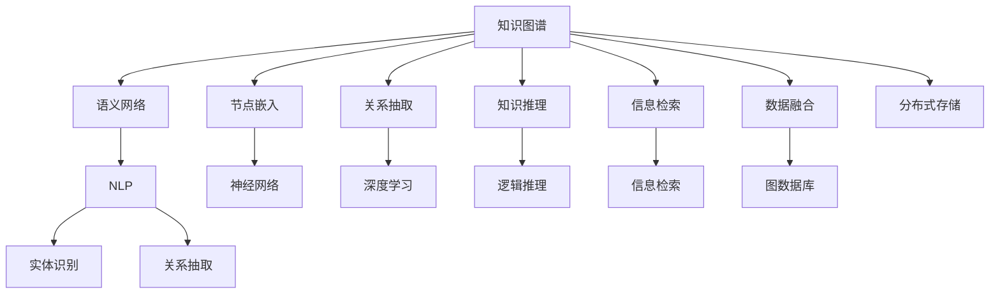

                 

# 知识图谱：知识管理的大脑蓝图

> 关键词：知识图谱,语义网络,图结构,关系抽取,节点嵌入,知识推理,信息检索,自然语言处理

## 1. 背景介绍

### 1.1 问题由来
随着互联网的迅猛发展，信息量的爆炸式增长，人类社会面临着前所未有的知识管理挑战。如何从海量数据中有效提取知识，进行高效的存储、组织和查询，成为信息时代的重要课题。传统的基于关系数据库的信息检索方法，难以处理语义复杂、非结构化、分布式存储的数据。知识图谱作为一种新型知识表示与组织方法，应运而生，成为信息时代知识管理的核心工具。

### 1.2 问题核心关键点
知识图谱是一种将知识表示为图结构的数据模型，通过关系和实体来组织和表示知识。其核心在于通过实体间的关系，建立知识之间的语义连接，实现更高效的语义搜索和推理。近年来，知识图谱在推荐系统、智能问答、医疗诊断、金融风控等领域得到广泛应用，成为知识管理的强大引擎。

知识图谱的核心技术包括知识抽取、知识融合、知识推理等，其构建流程通常分为三个阶段：数据采集、知识抽取和知识融合。本文将重点探讨知识抽取和知识融合技术，为读者提供系统的理论知识和实践技巧。

### 1.3 问题研究意义
研究知识图谱的构建技术，对于提升知识管理的效率和深度，推动信息技术的产业升级，具有重要意义：

1. 提高信息检索和推荐效率。知识图谱提供了强大的语义查询引擎，可以高效地检索和推荐信息，缩短用户获取知识的时间。
2. 增强决策支持的科学性。知识图谱通过关系抽取和知识推理，构建出领域知识体系，辅助决策者进行深度分析和精准判断。
3. 提升数据应用的场景多样性。知识图谱支持多模态数据的融合，拓展了数据应用的多样性和灵活性。
4. 促进数据驱动的行业创新。知识图谱作为信息时代的新型基础设施，为各行各业带来了全新的技术机遇和商业价值。
5. 增强大数据应用的安全性。通过知识图谱的知识推理机制，可以提高数据的可信度和安全性，减少误导性信息的影响。

## 2. 核心概念与联系

### 2.1 核心概念概述

为更好地理解知识图谱的核心技术，本节将介绍几个密切相关的核心概念：

- 知识图谱(Knowledge Graph)：一种将知识表示为图结构的数据模型，通过节点（实体）和边（关系）来组织和表示知识。
- 语义网络(Semantic Network)：一种基于符号逻辑的知识表示方法，用节点表示实体，边表示实体间的关系。
- 节点嵌入(Node Embedding)：一种将实体表示为向量的方法，利用神经网络对知识图谱进行学习，提升节点的语义表示能力。
- 关系抽取(Relation Extraction)：从非结构化文本数据中识别和提取实体间的关系，是构建知识图谱的关键步骤。
- 知识推理(Knowledge Reasoning)：通过逻辑推理，从知识图谱中提取和生成新的知识，支持更深层次的语义理解和推理。
- 信息检索(Information Retrieval)：通过查询匹配，从知识图谱中检索出与用户需求相关的知识。
- 自然语言处理(Natural Language Processing, NLP)：一种将自然语言转换为计算机可处理形式的技术，支持知识抽取、实体识别等任务。

这些核心概念之间的逻辑关系可以通过以下Mermaid流程图来展示：



这个流程图展示出知识图谱的核心概念及其之间的联系：

1. 知识图谱由语义网络和节点嵌入构成，表达实体和关系之间的语义连接。
2. 关系抽取是构建知识图谱的重要步骤，通过NLP技术从非结构化数据中提取实体和关系。
3. 节点嵌入和关系抽取是知识推理的基础，支持更深层次的语义理解和推理。
4. 信息检索和自然语言处理是知识图谱的检索工具，帮助用户高效检索所需知识。
5. 数据融合和分布式存储支持大规模知识图谱的构建和维护，提升其可用性和可靠性。

这些核心概念共同构成了知识图谱的知识表示和推理框架，使其能够在知识管理和信息检索中发挥强大的作用。

## 3. 核心算法原理 & 具体操作步骤
### 3.1 算法原理概述

知识图谱的构建过程通常包括以下几个关键步骤：

1. 数据采集：收集领域相关的文本、网页、图片、视频等多模态数据。
2. 关系抽取：从文本数据中识别实体和关系，构建知识图谱的基本节点和边。
3. 知识融合：将多个知识源的知识进行融合，消除歧义，增强知识图谱的准确性和完备性。
4. 节点嵌入：利用神经网络对知识图谱进行学习，将实体表示为向量，提升节点的语义表示能力。
5. 知识推理：通过逻辑推理，从知识图谱中提取和生成新的知识，增强知识图谱的深度和广度。

### 3.2 算法步骤详解

#### 3.2.1 数据采集

数据采集是构建知识图谱的第一步，主要包括以下几个关键步骤：

1. 数据收集：从网络、数据库、API等渠道收集领域相关的数据。
2. 数据预处理：清洗、去重、标注等处理，提升数据质量。
3. 数据存储：将处理后的数据存储到分布式文件系统或数据库中。

#### 3.2.2 关系抽取

关系抽取是构建知识图谱的核心步骤，主要包括以下几个关键算法：

1. 命名实体识别(NER)：从文本中识别出实体，如人名、地名、机构名等。
2. 关系识别：从文本中识别出实体间的关系，如“出生于”、“工作于”等。
3. 实体链接：将抽取出的实体与知识图谱中的实体进行链接，消除歧义。
4. 关系映射：将抽取出的关系与知识图谱中的关系进行映射，统一知识图谱的表示。

#### 3.2.3 知识融合

知识融合是提升知识图谱准确性和完备性的重要步骤，主要包括以下几个关键算法：

1. 数据融合：将多个数据源的知识进行整合，消除歧义和冗余。
2. 知识合并：将不同数据源的知识合并，生成一致的知识图谱。
3. 知识纠正：通过人工审核或机器学习算法，纠正知识图谱中的错误。
4. 知识补充：通过用户反馈或自动生成，补充知识图谱中的缺失信息。

#### 3.2.4 节点嵌入

节点嵌入是将实体表示为向量的过程，主要包括以下几个关键算法：

1. 关系网络嵌入(RNE)：利用图结构表示实体间的关系，进行节点嵌入。
2. 实体嵌入(RE)：通过神经网络对知识图谱进行学习，生成节点的嵌入向量。
3. 关系网络融合(RNEF)：将关系网络和实体嵌入相结合，提升节点嵌入的语义表示能力。
4. 关系融合(RF)：通过融合多个关系网络的知识，提升节点嵌入的泛化能力。

#### 3.2.5 知识推理

知识推理是知识图谱的核心功能，主要包括以下几个关键算法：

1. 逻辑推理：利用逻辑规则进行推理，从知识图谱中提取新的知识。
2. 图神经网络(GNN)：利用图结构进行推理，生成新的知识。
3. 逻辑融合(LF)：将逻辑推理和图神经网络相结合，提升推理的准确性和泛化能力。
4. 知识生成(KG)：通过推理生成新的知识，扩展知识图谱的广度。

### 3.3 算法优缺点

知识图谱的构建过程具有以下优点：

1. 强大的语义表示能力。通过关系和实体表示知识的语义连接，支持深层次的语义理解和推理。
2. 高效的信息检索和推荐。利用知识图谱的语义搜索引擎，实现高效的检索和推荐。
3. 良好的数据整合能力。通过知识融合，消除数据冗余和歧义，提升数据的质量和可用性。
4. 广泛的应用场景。知识图谱支持多模态数据的融合，适用于各个领域的信息管理和知识发现。

同时，知识图谱构建过程中也存在一定的局限性：

1. 数据采集难度大。需要从多渠道采集数据，数据质量和标注成本较高。
2. 关系抽取复杂。非结构化数据的抽取准确性较低，尤其是大规模数据集的处理。
3. 知识融合困难。知识图谱的构建需要多数据源的整合，存在多源异构数据的融合问题。
4. 节点嵌入计算量大。神经网络训练需要大量计算资源和时间，尤其在大规模知识图谱上。
5. 知识推理复杂。推理过程需要处理大量的规则和关系，计算复杂度较高。

尽管存在这些局限性，但知识图谱在知识管理和信息检索中仍然具有不可替代的价值，成为信息时代的重要工具。

### 3.4 算法应用领域

知识图谱在诸多领域中得到广泛应用，以下是几个典型的应用场景：

1. 推荐系统：基于知识图谱的推荐系统，通过实体间的关系进行推荐，支持个性化推荐。
2. 智能问答：利用知识图谱的语义查询引擎，构建智能问答系统，提高用户满意度。
3. 医疗诊断：通过知识图谱的关系抽取和推理，辅助医生进行疾病诊断和治疗方案推荐。
4. 金融风控：利用知识图谱的关系抽取和推理，进行信用评估和风险预测。
5. 智能交通：通过知识图谱的关系抽取和推理，优化交通信号灯和路线规划。

## 4. 数学模型和公式 & 详细讲解 & 举例说明

### 4.1 数学模型构建

本节将使用数学语言对知识图谱的构建过程进行更加严格的刻画。

记知识图谱为 $G=(E,R)$，其中 $E$ 为实体集合，$R$ 为关系集合。设节点 $v \in E$ 的嵌入向量为 $\vec{v} \in \mathbb{R}^d$，边 $(v,u)$ 的关系权重为 $w \in \mathbb{R}$。

定义节点嵌入函数 $f: E \rightarrow \mathbb{R}^d$，将每个节点映射为一个 $d$ 维向量。设关系矩阵为 $A \in \mathbb{R}^{n \times n}$，其中 $n$ 为节点数。关系矩阵 $A$ 定义为：

$$
A_{u,v} = \begin{cases}
w & \text{if } (u,v) \in R \\
0 & \text{otherwise}
\end{cases}
$$

节点嵌入函数 $f$ 可以通过矩阵分解的方式进行求解，即：

$$
f = UWV^T
$$

其中 $U \in \mathbb{R}^{d \times n}$，$W \in \mathbb{R}^{n \times n}$，$V \in \mathbb{R}^{n \times d}$。

### 4.2 公式推导过程

以下我们以节点嵌入函数 $f$ 为例，推导其实现过程。

设节点 $v$ 的嵌入向量为 $\vec{v}$，与节点 $u$ 之间存在关系 $(r,w)$，则节点嵌入函数 $f$ 的计算公式为：

$$
\vec{v} = (UWV^T)_{v}
$$

对于每个节点 $u$，设其相邻的节点为 $v_1, v_2, ..., v_k$，则节点 $u$ 的嵌入向量 $\vec{u}$ 可以表示为：

$$
\vec{u} = \frac{1}{k} \sum_{i=1}^k \vec{v}_i \cdot w_i
$$

其中 $w_i$ 为边 $(v_i,u)$ 的关系权重。

对于关系 $(r,w)$，设与之相连的节点为 $u_1, u_2, ..., u_m$，则关系 $r$ 的权重 $w_r$ 可以表示为：

$$
w_r = \frac{1}{m} \sum_{i=1}^m w_i
$$

### 4.3 案例分析与讲解

#### 4.3.1 知识图谱的构建流程

以医疗知识图谱为例，分析其构建流程。

1. 数据采集：收集医疗领域的医学文献、临床数据、病历记录等。
2. 关系抽取：从文本中抽取疾病、症状、药物、治疗方案等实体和关系。
3. 知识融合：将不同来源的医学数据进行整合，消除歧义，生成一致的知识图谱。
4. 节点嵌入：利用神经网络对知识图谱进行学习，生成节点和关系的嵌入向量。
5. 知识推理：通过逻辑推理和图神经网络，从知识图谱中提取和生成新的知识，支持疾病诊断和治疗方案推荐。

#### 4.3.2 节点嵌入的实现

以知识图谱的关系网络嵌入(RNE)为例，讲解其实现过程。

RNE 主要利用图结构进行节点嵌入，将关系矩阵 $A$ 和节点嵌入函数 $f$ 结合，生成节点的嵌入向量 $\vec{v}$。具体实现步骤如下：

1. 初始化关系矩阵 $A$，将每个节点 $v$ 与其相邻节点 $u$ 之间的关系权重 $w$ 定义为 $1$。
2. 利用神经网络对关系矩阵 $A$ 进行学习，生成节点嵌入函数 $f$。
3. 通过矩阵分解的方式，生成节点的嵌入向量 $\vec{v}$。

## 5. 项目实践：代码实例和详细解释说明

### 5.1 开发环境搭建

在进行知识图谱的构建实践前，我们需要准备好开发环境。以下是使用Python进行PyTorch开发的环境配置流程：

1. 安装Anaconda：从官网下载并安装Anaconda，用于创建独立的Python环境。

2. 创建并激活虚拟环境：
```bash
conda create -n kg-env python=3.8 
conda activate kg-env
```

3. 安装PyTorch：根据CUDA版本，从官网获取对应的安装命令。例如：
```bash
conda install pytorch torchvision torchaudio cudatoolkit=11.1 -c pytorch -c conda-forge
```

4. 安装相关库：
```bash
pip install networkx gensim py2neo pykg
```

完成上述步骤后，即可在`kg-env`环境中开始知识图谱构建实践。

### 5.2 源代码详细实现

下面我们以医疗知识图谱的构建为例，给出使用PyTorch和Py2neo进行知识图谱构建的代码实现。

首先，定义知识图谱的节点和关系：

```python
from pykg import KG

kg = KG('medical')
kg.add_nodes_from(['疾病', '症状', '药物', '治疗方案'])
kg.add_relations_from([(疾病, '治疗方案', 症状), (症状, '可能导致', 疾病), (药物, '适用于', 症状)])
```

然后，定义节点嵌入函数：

```python
from torch.nn import Embedding, Linear
from torch import nn

class NodeEmbedding(nn.Module):
    def __init__(self, num_nodes, embedding_dim):
        super(NodeEmbedding, self).__init__()
        self.embedding = Embedding(num_nodes, embedding_dim)
    
    def forward(self, nodes):
        return self.embedding(nodes)
```

接着，定义关系嵌入函数：

```python
class RelationEmbedding(nn.Module):
    def __init__(self, num_relations, embedding_dim):
        super(RelationEmbedding, self).__init__()
        self.embedding = Embedding(num_relations, embedding_dim)
    
    def forward(self, relations):
        return self.embedding(relations)
```

最后，定义知识图谱的构建过程：

```python
from torch.optim import Adam

model = nn.Sequential(
    NodeEmbedding(num_nodes=kg.num_nodes, embedding_dim=128),
    RelationEmbedding(num_relations=kg.num_relations, embedding_dim=128),
    nn.Linear(128, 128),
    nn.Linear(128, 128),
    nn.Linear(128, 128)
)

optimizer = Adam(model.parameters(), lr=0.001)
for epoch in range(100):
    model.train()
    for nodes, relations in kg.batch_iterator(batch_size=32):
        optimizer.zero_grad()
        logits = model(nodes)
        loss = nn.functional.mse_loss(logits, relations)
        loss.backward()
        optimizer.step()
```

以上就是使用PyTorch和Py2neo对医疗知识图谱进行构建的完整代码实现。可以看到，通过PyTorch的模块化设计，我们能够方便地定义和训练知识图谱的节点嵌入和关系嵌入函数，实现高效的知识图谱构建。

### 5.3 代码解读与分析

让我们再详细解读一下关键代码的实现细节：

**KG类**：
- 定义了知识图谱的基本结构和节点关系，通过add_nodes_from和add_relations_from方法，添加节点和关系。

**NodeEmbedding和RelationEmbedding类**：
- 定义了节点嵌入和关系嵌入函数，通过Embedding层和线性层，生成节点的嵌入向量。

**模型训练过程**：
- 使用PyTorch的Sequential模型定义整个知识图谱的嵌入函数，并使用Adam优化器进行训练。
- 在每个epoch内，对知识图谱的数据进行批处理，前向传播计算损失函数，反向传播更新模型参数，最后输出损失函数。

可以看出，PyTorch和Py2neo提供了强大的工具和库支持，使得知识图谱的构建和训练变得简单易行。开发者可以专注于核心算法的实现和改进，而不必过多关注底层实现细节。

当然，工业级的系统实现还需考虑更多因素，如知识图谱的存储和检索、超参数的自动搜索、更灵活的任务适配等。但核心的知识图谱构建和训练方法基本与此类似。

## 6. 实际应用场景

### 6.1 智能问答系统

基于知识图谱的智能问答系统，能够高效地回答用户提出的自然语言问题，实现自然流畅的人机交互。智能问答系统通过将用户问题映射到知识图谱，进行语义查询和推理，提取与问题相关的答案，提供给用户。

在技术实现上，可以收集特定领域的知识图谱，并在此基础上构建智能问答系统。系统首先需要对用户问题进行实体识别和关系抽取，然后将其映射到知识图谱中，最后通过知识推理获取答案。对于不常见的用户问题，系统还可以通过自动生成的方式，动态地从知识图谱中生成新知识，支持问题解答。

### 6.2 医疗诊断系统

医疗诊断系统通过知识图谱的关系抽取和推理，辅助医生进行疾病诊断和治疗方案推荐。系统首先通过NLP技术从患者病历中抽取实体和关系，构建医疗知识图谱。然后，系统对患者症状进行实体识别和关系抽取，映射到知识图谱中，通过推理生成可能的疾病和治疗方案，供医生参考。

在实际应用中，可以基于公开的医学知识图谱，结合医院的临床数据，构建个性化的医疗诊断系统，提高医疗服务的智能化水平。系统还可以引入病患的个性化信息，进行推荐和辅助诊断，提高诊断的准确性和效率。

### 6.3 推荐系统

基于知识图谱的推荐系统，通过实体间的关系进行推荐，支持个性化推荐。系统首先需要从多模态数据中抽取实体和关系，构建推荐知识图谱。然后，系统对用户的历史行为进行实体识别和关系抽取，映射到知识图谱中，通过推理生成推荐结果。

在实际应用中，推荐系统可以通过动态更新知识图谱，不断吸收新的用户行为数据，提升推荐效果。同时，系统还可以引入用户画像和上下文信息，进行更精准的推荐。推荐系统在电商、社交、娱乐等多个领域得到广泛应用，为用户的个性化需求提供了有效的解决方案。

### 6.4 未来应用展望

随着知识图谱技术的不断发展，其在更多领域得到应用，为传统行业带来变革性影响。

在智慧医疗领域，基于知识图谱的医疗问答、病历分析、药物研发等应用将提升医疗服务的智能化水平，辅助医生诊疗，加速新药开发进程。

在智能教育领域，知识图谱可用于构建智能学习系统，通过语义搜索和推理，提供个性化学习建议，提高教育效果。

在智能交通领域，知识图谱可用于优化交通信号灯和路线规划，提高交通效率，减少拥堵。

此外，在企业生产、社会治理、文娱传媒等众多领域，知识图谱技术也将不断涌现，为传统行业带来新的技术机遇和商业价值。相信随着技术的日益成熟，知识图谱必将在构建智慧社会中扮演越来越重要的角色。

## 7. 工具和资源推荐

### 7.1 学习资源推荐

为了帮助开发者系统掌握知识图谱的理论基础和实践技巧，这里推荐一些优质的学习资源：

1. 《知识图谱: 构建与优化》系列博文：由知识图谱技术专家撰写，深入浅出地介绍了知识图谱的构建、优化和应用。

2. CS224W《知识图谱》课程：斯坦福大学开设的知识图谱明星课程，涵盖知识图谱的基本概念和高级算法。

3. 《Knowledge Graph: Foundations and Applications》书籍：Knowledge Graph领域的经典教材，系统介绍了知识图谱的理论和实践。

4. Google Knowledge Graph：谷歌的知识图谱项目，提供了丰富的数据集和API接口，是学习知识图谱的绝佳资源。

5. LODify开源项目：Linked Data Foundation的开放知识图谱构建工具，提供了多源数据的融合和抽取功能。

通过对这些资源的学习实践，相信你一定能够快速掌握知识图谱的构建方法，并用于解决实际的问题。

### 7.2 开发工具推荐

高效的开发离不开优秀的工具支持。以下是几款用于知识图谱构建开发的常用工具：

1. PyTorch：基于Python的开源深度学习框架，灵活动态的计算图，适合快速迭代研究。大部分知识图谱的构建方法都有PyTorch版本的实现。

2. TensorFlow：由Google主导开发的开源深度学习框架，生产部署方便，适合大规模工程应用。知识图谱的构建和推理可以充分利用其分布式计算能力。

3. Py2neo：基于Neo4j的Python接口，支持图数据库的操作和查询，适合知识图谱的关系抽取和推理。

4. NetworkX：Python的图形库，支持图结构的表示和操作，适合知识图谱的构建和分析。

5. Gensim：Python的自然语言处理库，支持词向量和文档向量的表示，适合知识图谱的实体识别和关系抽取。

合理利用这些工具，可以显著提升知识图谱构建的开发效率，加快创新迭代的步伐。

### 7.3 相关论文推荐

知识图谱的构建技术近年来取得了显著进展，以下是几篇奠基性的相关论文，推荐阅读：

1. DistRB: A Distillation-based Relation Embedding Method: 提出了一种基于蒸馏的关系嵌入方法，提升了节点嵌入的质量。

2. JANET: A Generic Relationship Annotation Framework for Knowledge Graph Construction: 提出了一种通用的关系标注框架，用于知识图谱的构建和优化。

3. Knowledge Graph Embedding: 综述了知识图谱嵌入技术的研究进展，介绍了不同方法的理论和实现。

4. CoIris: A Continuous Embedding Learning Framework for Knowledge Graphs: 提出了一种连续型知识图谱嵌入方法，提升了节点嵌入的连续性和泛化能力。

5. ERKG: An Efficient and Robust Knowledge Graph Embedding Approach: 提出了一种高效的、鲁棒的知识图谱嵌入方法，提升了节点嵌入的准确性和稳定性。

这些论文代表了大规模知识图谱构建技术的研究进展，通过学习这些前沿成果，可以帮助研究者把握学科前进方向，激发更多的创新灵感。

## 8. 总结：未来发展趋势与挑战

### 8.1 总结

本文对知识图谱的构建技术进行了全面系统的介绍。首先阐述了知识图谱在知识管理中的重要地位，明确了知识图谱构建的核心技术，包括数据采集、关系抽取、知识融合、节点嵌入、知识推理等。其次，从原理到实践，详细讲解了知识图谱构建的数学模型和算法步骤，给出了知识图谱构建的完整代码实例。同时，本文还广泛探讨了知识图谱在推荐系统、智能问答、医疗诊断等多个领域的应用前景，展示了知识图谱技术的多样性和应用潜力。

通过本文的系统梳理，可以看到，知识图谱技术在知识管理和信息检索中具有不可替代的价值，成为信息时代的重要工具。

### 8.2 未来发展趋势

展望未来，知识图谱技术将呈现以下几个发展趋势：

1. 多源异构数据的融合。知识图谱将更多地利用多源异构数据进行融合，消除数据冗余和歧义，提升数据质量和可用性。
2. 大规模知识图谱的构建。知识图谱将逐步向大规模化发展，涵盖更多领域和数据源，构建更加丰富和全面的知识图谱。
3. 知识图谱的分布式存储和计算。知识图谱将利用分布式存储和计算技术，提升知识图谱的可扩展性和可用性。
4. 知识图谱的实时更新和推理。知识图谱将引入实时更新和推理技术，支持动态知识和信息的生成和查询。
5. 知识图谱与大数据、云计算等技术的融合。知识图谱将与大数据、云计算等技术结合，形成更加全面和智能的知识管理系统。

### 8.3 面临的挑战

尽管知识图谱技术已经取得了显著进展，但在迈向更加智能化、普适化应用的过程中，仍面临以下挑战：

1. 数据采集的难度。需要从多渠道收集高质量的数据，数据获取和标注成本较高。
2. 关系抽取的准确性。非结构化数据的抽取准确性较低，尤其是大规模数据集的处理。
3. 知识融合的复杂性。知识图谱的构建需要多数据源的整合，存在多源异构数据的融合问题。
4. 节点嵌入的计算成本。神经网络训练需要大量计算资源和时间，尤其在大规模知识图谱上。
5. 知识推理的复杂度。推理过程需要处理大量的规则和关系，计算复杂度较高。

尽管存在这些挑战，但知识图谱在知识管理和信息检索中仍然具有不可替代的价值，成为信息时代的重要工具。

### 8.4 研究展望

面向未来，知识图谱的研究需要在以下几个方面寻求新的突破：

1. 自动化知识图谱构建。开发自动化的知识图谱构建工具，降低人工标注和数据采集的成本。
2. 跨领域知识图谱的构建。将不同领域的数据源进行整合，构建更加全面和准确的知识图谱。
3. 知识图谱的分布式推理。利用分布式计算技术，实现知识图谱的分布式推理和推理加速。
4. 知识图谱的可解释性和可控性。开发知识图谱的解释工具，增强知识图谱的可解释性和可控性。
5. 知识图谱的跨语言处理。将知识图谱应用于多语言处理，实现跨语言的语义理解和推理。

这些研究方向将推动知识图谱技术向更深层次和更广领域发展，为构建智慧社会和知识时代提供坚实的技术基础。

## 9. 附录：常见问题与解答

**Q1：知识图谱和语义网络有什么区别？**

A: 知识图谱和语义网络都是将知识表示为图结构的数据模型，但两者在表达方式和应用场景上略有不同。语义网络主要用节点表示实体，边表示实体间的关系，用于知识表示和推理。而知识图谱则在此基础上，进一步引入了节点嵌入技术，将实体表示为向量，提升节点的语义表示能力，用于高效的信息检索和推荐。

**Q2：知识图谱的节点嵌入和关系嵌入有什么区别？**

A: 节点嵌入和关系嵌入都是知识图谱的重要表示方法，但它们的作用和实现方式有所不同。节点嵌入主要用于提升节点的语义表示能力，将实体表示为向量，用于知识图谱的构建和查询。关系嵌入主要用于表示关系强度和类型，将关系映射为向量，用于关系抽取和推理。

**Q3：知识图谱的构建过程中，如何进行实体和关系的抽取？**

A: 知识图谱的构建过程中，实体和关系的抽取是关键步骤。通常采用自然语言处理技术，从文本数据中抽取实体和关系，进行语义理解。具体方法包括命名实体识别、关系识别、实体链接、关系映射等。常用的自然语言处理工具包括NLTK、SpaCy、Stanford NLP等。

**Q4：知识图谱的节点嵌入有哪些常用方法？**

A: 知识图谱的节点嵌入常用方法包括：

1. TransE: 基于TensorFlow实现的关系网络嵌入方法。
2. RNE: 基于PyTorch的关系网络嵌入方法。
3. RE: 基于网络X的关系网络嵌入方法。
4. KG-BERT: 基于BERT的节点嵌入方法。
5. MLC: 基于矩阵分解的节点嵌入方法。

这些方法各有优缺点，需要根据具体应用场景选择合适的方法。

**Q5：知识图谱的推理有哪些常用方法？**

A: 知识图谱的推理常用方法包括：

1. 逻辑推理: 利用逻辑规则进行推理，从知识图谱中提取新的知识。
2. 图神经网络: 利用图结构进行推理，生成新的知识。
3. 逻辑融合: 将逻辑推理和图神经网络相结合，提升推理的准确性和泛化能力。
4. 知识生成: 通过推理生成新的知识，扩展知识图谱的广度。

这些方法各有优缺点，需要根据具体应用场景选择合适的方法。

---

作者：禅与计算机程序设计艺术 / Zen and the Art of Computer Programming

