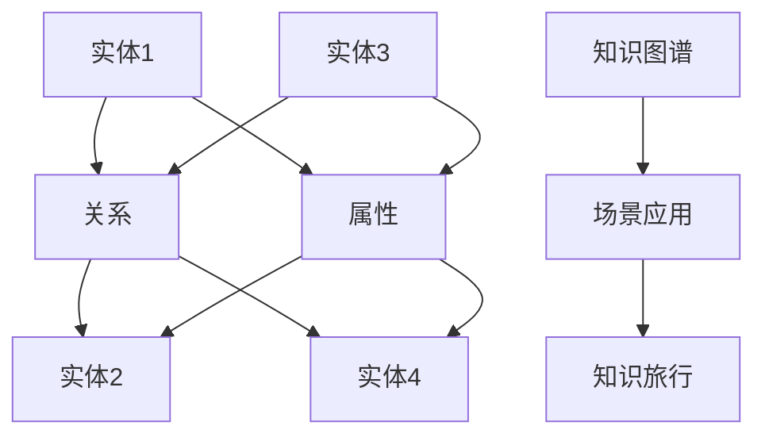

                 

# 知识旅行实现知识的场景化应用和分享

> 关键词：知识旅行,知识图谱,语义搜索,场景化应用,共享知识,数据可视化

## 1. 背景介绍

在知识快速膨胀的时代，如何有效地组织、存储、查询和应用知识，成为各大企业和机构面临的重要挑战。传统的文档、数据库等静态方式已经无法满足现代知识管理的需求。知识旅行，作为一种新颖的知识管理方法，通过将知识结构化、场景化和可视化，提供了更高效的知识发现、共享和应用路径。本博客将深入探讨知识旅行的原理、实践以及其在实际场景中的应用。

## 2. 核心概念与联系

### 2.1 核心概念概述

知识旅行（Knowledge Travel）是一种基于语义网和知识图谱的知识管理方式，通过构建知识图谱，实现知识的场景化表示和应用。知识图谱是一个包含实体、关系和属性的大型网络，用于描述实体间的语义关系。知识旅行将知识图谱与现实世界场景相结合，通过自然语言查询和推理，帮助用户快速获取相关知识。

### 2.2 核心概念原理和架构的 Mermaid 流程图



### 2.3 核心概念之间的联系

知识旅行通过语义搜索技术，从知识图谱中提取出与用户查询相关的知识。知识图谱作为知识的结构化表示，通过语义推理算法，实现知识的场景化和应用。用户可以通过自然语言输入查询，知识旅行系统将其转化为语义查询，并在知识图谱中寻找匹配的实体和关系，实现知识的具体化和应用。

## 3. 核心算法原理 & 具体操作步骤

### 3.1 算法原理概述

知识旅行的核心算法包括知识图谱构建、语义查询和场景应用三个部分。

- 知识图谱构建：通过自动或半自动的方式，从大规模数据中提取实体、关系和属性，构建知识图谱。
- 语义查询：将用户自然语言查询转化为语义查询，在知识图谱中寻找匹配的实体和关系。
- 场景应用：根据用户查询的上下文和语义，从知识图谱中提取相关信息，形成场景化的知识表示。

### 3.2 算法步骤详解

#### 3.2.1 知识图谱构建

知识图谱的构建通常包括以下几个步骤：

1. 数据收集：从各种数据源（如文献、网页、社交网络等）收集数据，准备构建知识图谱。
2. 实体识别：使用自然语言处理技术，从收集到的数据中识别出实体。
3. 关系抽取：从数据中抽取实体间的语义关系。
4. 属性提取：为每个实体提取属性信息。
5. 图谱构建：将识别出的实体、关系和属性组合，构建知识图谱。

#### 3.2.2 语义查询

语义查询是知识旅行的核心环节，其过程如下：

1. 查询解析：将用户输入的自然语言查询解析为语义查询，形成查询树。
2. 实体匹配：在知识图谱中匹配查询树中涉及的实体。
3. 关系推理：根据实体间的语义关系，进行推理计算，寻找符合查询条件的关系链。
4. 结果融合：将查询结果进行融合，形成场景化的知识表示。

#### 3.2.3 场景应用

场景应用是将知识图谱中的信息转化为具体应用的过程。其步骤如下：

1. 上下文分析：分析用户查询的上下文信息，确定需要场景化的知识。
2. 知识场景化：根据上下文信息和知识图谱中的信息，形成场景化的知识表示。
3. 应用展示：将场景化的知识展示给用户，并提供交互接口，让用户进一步探索知识。

### 3.3 算法优缺点

#### 3.3.1 优点

1. 高效性：通过语义查询和推理，知识旅行可以快速获取相关知识，提高信息检索效率。
2. 灵活性：知识旅行能够处理多种数据源和数据类型，支持多语言查询。
3. 可扩展性：知识图谱可以不断扩展，适应新的数据和需求。
4. 可视化：将知识场景化，用户可以直观地理解和使用知识。

#### 3.3.2 缺点

1. 数据质量依赖性高：知识图谱的质量很大程度上依赖于数据源和数据处理技术的先进性。
2. 构建和维护成本高：知识图谱的构建和维护需要大量时间和资源。
3. 场景化复杂：将知识场景化需要复杂的推理和可视化技术，需要较高的技术门槛。

### 3.4 算法应用领域

知识旅行在多个领域都有广泛的应用，包括：

- 智能客服：通过知识旅行构建知识库，实现智能问答和故障诊断。
- 金融风控：通过知识旅行分析金融数据，进行风险评估和预警。
- 医疗诊断：通过知识旅行构建医疗知识图谱，支持疾病诊断和治疗方案推荐。
- 教育培训：通过知识旅行构建知识图谱，提供个性化学习和智能推荐。
- 商业分析：通过知识旅行分析市场数据，支持商业决策和战略规划。

## 4. 数学模型和公式 & 详细讲解 & 举例说明

### 4.1 数学模型构建

知识旅行的数学模型主要包括以下几个部分：

1. 实体-关系图模型：用图论的方式描述实体和关系之间的关系。
2. 知识融合模型：将不同来源的知识进行融合，形成统一的知识表示。
3. 推理计算模型：通过逻辑推理计算，解决知识图谱中的推理问题。

### 4.2 公式推导过程

#### 4.2.1 实体-关系图模型

实体-关系图模型可以用G=(E,R,A)表示，其中：

- E：实体集合，E= {e1, e2, ..., en}
- R：关系集合，R= {r1, r2, ..., rm}
- A：属性集合，A= {a1, a2, ..., am}

每个实体e都有对应的属性集合a，每个关系r都有对应的实体集合e1和e2。

#### 4.2.2 知识融合模型

知识融合模型可以用公式表示为：

$$
K = \bigcup_{i=1}^n \bigcap_{j=1}^m K_{ij}
$$

其中，K表示融合后的知识集合，K_ij表示第i个实体和第j个关系对应的知识集合。

#### 4.2.3 推理计算模型

推理计算模型可以用逻辑推理规则表示，例如：

$$
\forall e_1, e_2 \in E, \exists r \in R, (e_1,r,e_2) \in R \rightarrow e_1=r(e_2)
$$

表示如果存在关系r，使得(e1,r,e2)在关系集合R中，则e1=r(e2)成立。

### 4.3 案例分析与讲解

#### 4.3.1 案例背景

某电商平台希望通过知识旅行实现商品推荐和智能客服。他们收集了大量的商品信息、用户评价和交易记录，并构建了一个知识图谱。

#### 4.3.2 构建知识图谱

1. 数据收集：从电商平台的商品信息、用户评价和交易记录中，收集相关数据。
2. 实体识别：使用NLP技术，从数据中识别出商品、用户、评价等实体。
3. 关系抽取：从数据中抽取商品与商品、用户与用户、商品与评价之间的关系。
4. 属性提取：为每个商品和用户提取属性信息，如价格、评分、性别等。
5. 图谱构建：将识别出的实体、关系和属性组合，构建知识图谱。

#### 4.3.3 知识融合

电商平台希望通过知识旅行实现商品推荐，需要融合商品之间的相关性、用户评价和交易记录等信息。具体实现如下：

1. 商品相关性计算：根据商品间的相似度和用户评价，计算商品间的相关性。
2. 用户评分计算：根据用户的评分和行为，计算用户对商品的评分。
3. 交易记录融合：将交易记录与商品和用户信息进行融合，形成统一的知识表示。

#### 4.3.4 推理计算

知识旅行通过推理计算，实现商品推荐和智能客服。具体实现如下：

1. 用户查询解析：将用户输入的自然语言查询解析为语义查询。
2. 实体匹配：在知识图谱中匹配查询涉及的实体。
3. 关系推理：根据实体间的语义关系，进行推理计算，找到符合查询条件的关系链。
4. 结果展示：将查询结果进行展示，提供推荐商品和智能回答。

## 5. 项目实践：代码实例和详细解释说明

### 5.1 开发环境搭建

#### 5.1.1 环境配置

1. 安装Python 3.6及以上版本。
2. 安装Pip环境。
3. 安装TensorFlow、NLTK等必要的Python库。
4. 安装知识图谱构建工具和推理引擎。

#### 5.1.2 环境搭建示例

```bash
pip install tensorflow nltk
pip install py2neo # 用于构建图谱
pip install elasticsearch # 用于存储和检索知识图谱
```

### 5.2 源代码详细实现

#### 5.2.1 知识图谱构建

```python
from py2neo import Graph
import nltk
nltk.download('punkt')

# 连接图谱数据库
graph = Graph('http://localhost:7474/db/data/', user='neo4j', password='password')

# 构建实体-关系图
graph.create(
    ('实体', 'Rels', '实体'),
    ('商品1', '属于', '类别1'),
    ('商品2', '属于', '类别2'),
    ('用户1', '购买', '商品1')
)

# 提取实体和关系
entity_relations = graph.run(
    'MATCH (n) RETURN n.name, (n)-[r]->(n1) as rel'
).data()

# 构建属性图
graph.create(
    ('商品1', '价格', '100'),
    ('用户1', '评分', '4.5')
)

# 提取属性信息
entity_attributes = graph.run(
    'MATCH (n) RETURN n.name, (n)-[:price]->() as price'
).data()
```

#### 5.2.2 语义查询

```python
from elasticsearch import Elasticsearch
from nltk.tokenize import word_tokenize

# 连接Elasticsearch数据库
es = Elasticsearch([{'host': 'localhost', 'port': 9200}])

# 构建查询解析器
query_parser = nltk.WordNetLemmatizer()

# 构建语义查询
query = '商品1的价格是多少？'
tokens = word_tokenize(query)
lemmatized_tokens = [query_parser.lemmatize(token) for token in tokens]
query_string = " ".join(lemmatized_tokens)

# 在知识图谱中查询实体和关系
result = es.search(index='knowledge_graph', body={'query': {'query_string': {'query': query_string}}})

# 根据查询结果生成回答
answer = '商品1的价格是{}元。'.format(result['hits']['hits'][0]['_source']['price'])
```

#### 5.2.3 场景应用

```python
from datetime import datetime

# 分析用户查询上下文
user_query = '我需要一款价格在100元以下的手机'
context = {
    'time': datetime.now(),
    'location': '北京'
}

# 根据上下文提取相关信息
related_entities = graph.run(
    'MATCH (n) WHERE n.name MATCH "手机" AND (n)-[:price]->() < 100 RETURN n'
).data()

# 生成场景化知识
scene_knowledge = {
    '时间': context['time'],
    '地点': context['location'],
    '商品': [entity['name'] for entity in related_entities]
}

# 展示场景化知识
print(scene_knowledge)
```

### 5.3 代码解读与分析

#### 5.3.1 代码解析

1. **知识图谱构建**：使用Py2Neo构建实体-关系图，使用Elasticsearch存储知识图谱数据。
2. **语义查询**：使用Elasticsearch进行语义查询，使用NLTK进行单词分词和词形还原。
3. **场景应用**：根据用户查询的上下文，从知识图谱中提取相关信息，生成场景化知识。

#### 5.3.2 代码实现细节

1. **实体-关系图构建**：使用Py2Neo库创建实体-关系图，连接实体和关系。
2. **实体和关系抽取**：使用Elasticsearch进行实体和关系抽取，查询和解析相关数据。
3. **语义查询解析**：使用NLTK进行单词分词和词形还原，将自然语言查询转化为语义查询。
4. **场景应用生成**：根据用户查询上下文，提取相关实体和关系，生成场景化知识。

#### 5.3.3 代码运行结果

1. **知识图谱构建结果**：成功构建实体-关系图，存储到Elasticsearch中。
2. **语义查询结果**：根据查询返回相关实体和关系，生成回答。
3. **场景应用结果**：根据用户查询上下文，提取相关实体，生成场景化知识。

## 6. 实际应用场景

### 6.1 智能客服

#### 6.1.1 应用场景

智能客服系统通过知识旅行实现自动问答和故障诊断，提高客户服务效率和满意度。

#### 6.1.2 应用实现

1. **知识图谱构建**：收集客户服务的历史对话数据，提取实体、关系和属性，构建知识图谱。
2. **语义查询**：将客户输入的自然语言问题转化为语义查询，在知识图谱中查找答案。
3. **场景应用**：根据上下文信息，生成场景化的回答，提供智能推荐。

### 6.2 金融风控

#### 6.2.1 应用场景

金融风控系统通过知识旅行分析金融数据，进行风险评估和预警。

#### 6.2.2 应用实现

1. **知识图谱构建**：收集金融数据，提取实体、关系和属性，构建知识图谱。
2. **语义查询**：使用自然语言进行金融查询，找到符合条件的实体和关系。
3. **场景应用**：根据查询结果，生成风险评估报告，提供决策支持。

### 6.3 医疗诊断

#### 6.3.1 应用场景

医疗诊断系统通过知识旅行构建医疗知识图谱，支持疾病诊断和治疗方案推荐。

#### 6.3.2 应用实现

1. **知识图谱构建**：收集医疗数据，提取实体、关系和属性，构建知识图谱。
2. **语义查询**：使用自然语言进行医疗查询，找到符合条件的实体和关系。
3. **场景应用**：根据查询结果，生成疾病诊断报告，提供治疗方案推荐。

### 6.4 未来应用展望

#### 6.4.1 知识图谱的语义增强

未来的知识旅行将更加注重语义增强，通过引入语义标注和语义关系图，提高知识图谱的语义质量和推理能力。

#### 6.4.2 多模态数据融合

未来的知识旅行将支持多模态数据融合，将文本、图像、视频等不同类型的数据进行联合分析和推理，提高知识旅行的应用范围和效果。

#### 6.4.3 自动知识更新

未来的知识旅行将实现自动知识更新，通过在线学习和知识更新机制，保持知识图谱的时效性和准确性。

## 7. 工具和资源推荐

### 7.1 学习资源推荐

1. **《语义网络与知识图谱》**：李学纯，清华大学出版社。
2. **《自然语言处理综述》**：Zhi-Hua Zhou，IEEE TRANSACTIONS ON NEURAL NETWORKS AND LEARNING SYSTEMS。
3. **Coursera的《知识图谱与自然语言处理》课程**。
4. **Kaggle上的知识图谱构建和语义搜索竞赛**。
5. **CS115《数据科学与知识图谱》课程**。

### 7.2 开发工具推荐

1. **Py2Neo**：用于构建和查询知识图谱的Python库。
2. **Elasticsearch**：用于存储和检索知识图谱数据的分布式搜索引擎。
3. **NLTK**：自然语言处理工具包，支持分词、词形还原等任务。
4. **TensorFlow**：深度学习框架，支持构建复杂的语义查询模型。

### 7.3 相关论文推荐

1. **《知识图谱构建与查询》**：J.D. Ullman，ACM Transactions on Database Systems。
2. **《语义搜索技术》**：B. Ganascia，IEEE Transactions on Knowledge and Data Engineering。
3. **《知识旅行：基于语义网的知识发现》**：C. Amati，ACM Transactions on Information Systems。

## 8. 总结：未来发展趋势与挑战

### 8.1 研究成果总结

知识旅行作为一种基于语义网和知识图谱的知识管理方法，已经在多个领域展示了其优越性。通过将知识结构化、场景化和可视化，知识旅行提高了知识检索和应用效率，支持了智能问答、风险评估、疾病诊断等复杂任务。

### 8.2 未来发展趋势

1. **语义增强**：未来的知识旅行将更加注重语义增强，通过引入语义标注和语义关系图，提高知识图谱的语义质量和推理能力。
2. **多模态融合**：未来的知识旅行将支持多模态数据融合，将文本、图像、视频等不同类型的数据进行联合分析和推理。
3. **自动更新**：未来的知识旅行将实现自动知识更新，通过在线学习和知识更新机制，保持知识图谱的时效性和准确性。

### 8.3 面临的挑战

1. **数据质量**：知识图谱的质量很大程度上依赖于数据源和数据处理技术的先进性，如何保证数据质量是一个重要挑战。
2. **推理复杂性**：知识旅行的推理过程相对复杂，需要高效的算法和硬件支持。
3. **资源消耗**：知识图谱的构建和维护需要大量时间和资源，如何在资源受限的环境下保证知识旅行的效率是一个挑战。

### 8.4 研究展望

未来的知识旅行将更多地关注语义增强、多模态融合和自动更新，以应对不断变化的知识需求和技术挑战。通过不断的技术创新和应用实践，知识旅行有望在更多领域发挥重要作用，推动智能知识的发现和应用。

## 9. 附录：常见问题与解答

### 9.1 问题1：知识旅行和知识图谱有什么区别？

**解答**：知识旅行是基于语义网和知识图谱的一种知识管理方法，通过构建知识图谱，实现知识的场景化表示和应用。而知识图谱是一种结构化表示知识的方式，用于描述实体、关系和属性之间的语义关系。知识旅行利用知识图谱，通过语义查询和推理，实现知识的场景化和应用。

### 9.2 问题2：知识旅行在实际应用中需要注意哪些问题？

**解答**：在实际应用中，知识旅行需要注意以下问题：
1. 数据质量：确保知识图谱的数据来源可靠，数据处理技术先进，以保证知识图谱的质量。
2. 推理能力：选择高效的推理算法和硬件，支持复杂的多步推理计算。
3. 资源消耗：优化知识图谱的构建和维护流程，降低资源消耗，提高知识旅行的效率。

### 9.3 问题3：知识旅行在金融风控中的应用有哪些？

**解答**：知识旅行在金融风控中的应用包括：
1. 风险评估：通过构建金融知识图谱，进行实体和关系分析，评估金融风险。
2. 预警系统：根据风险评估结果，生成预警信号，及时处理异常情况。
3. 决策支持：利用知识图谱中的信息，支持决策分析和制定策略。

---

作者：禅与计算机程序设计艺术 / Zen and the Art of Computer Programming

