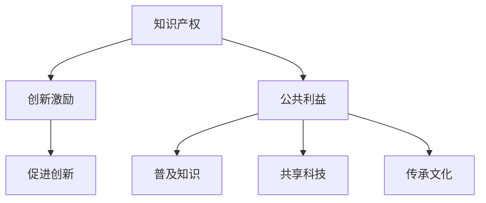

                 

# 知识的产权保护：创新激励与公共利益的平衡

> 关键词：知识产权,创新激励,公共利益,知识共享,技术保护,伦理道德

## 1. 背景介绍

在数字时代，知识的价值日益凸显。然而，知识的获取、存储、传播与利用，同时伴随着一系列复杂的问题和挑战，其中最核心的是知识产权的保护。随着人工智能、大数据、区块链等技术的发展，知识产权保护已经变得越来越重要，也面临着前所未有的挑战。本文将从技术角度出发，探讨知识产权保护与创新激励、公共利益之间的平衡，以及如何利用技术手段提升知识产权保护水平，促进知识产权的有序、高效利用。

## 2. 核心概念与联系

### 2.1 核心概念概述

**知识产权 (Intellectual Property Rights, IP)**：指对知识产权客体享有的专有权利，包括专利权、版权、商标权、商业秘密等，旨在保护创造者的智力劳动成果。

**创新激励 (Innovation Incentives)**：通过赋予知识产权，给予创新者一定的利益回报，激励他们持续投入创新，以促进科技、文化、艺术等领域的发展。

**公共利益 (Public Interest)**：知识产权制度的建立和运行，应当兼顾公共利益，如知识的普及、科技的共享、文化的传承等，推动全社会的发展进步。

这些概念之间的逻辑关系可以通过以下Mermaid流程图来展示：



这个流程图展示出知识产权保护如何通过激发创新，促进知识的普及、科技的共享和文化传承，从而实现公共利益的提升。

## 3. 核心算法原理 & 具体操作步骤
### 3.1 算法原理概述

知识产权保护的核心在于确保创新者能够从其智力成果中获得应得的利益回报，从而激励持续的创新活动。然而，过度的保护可能会阻碍知识的普及和共享，影响公共利益的实现。因此，需要寻找知识产权保护与创新激励、公共利益之间的平衡点。

基于这一原则，知识产权保护可以通过以下技术手段实现：

- **数字水印技术**：通过在数字作品中嵌入不可见的标识信息，验证作品的真实性和完整性，防止盗版和侵权。
- **区块链技术**：利用区块链的不可篡改性和分布式特性，实现知识产权的数字化记录和确权，确保信息的真实性和可信度。
- **大数据分析**：通过分析海量数据，识别侵权行为，提高知识产权保护的效率和精确度。
- **人工智能技术**：利用机器学习、自然语言处理等技术，自动识别、标注和分类知识产权，简化审查和保护流程。

### 3.2 算法步骤详解

知识产权保护的核心算法步骤如下：

**Step 1: 数据收集与预处理**
- 收集各类数字作品、创新成果等知识产权数据，并进行去重、清洗和标注。

**Step 2: 数字水印嵌入**
- 利用数字水印技术，将不可见的标识信息嵌入到作品或成果中，确保知识产权的可追溯性和真实性。

**Step 3: 区块链记录**
- 将数字水印嵌入信息、作者信息、版权声明等元数据记录到区块链上，形成确权的数字化记录。

**Step 4: 大数据分析**
- 利用大数据技术，分析作品或成果的使用情况，识别可能的侵权行为。

**Step 5: 人工智能检测**
- 使用机器学习、自然语言处理等技术，自动检测和分类作品或成果，提供知识产权保护的智能化支持。

**Step 6: 权利保护与维权**
- 根据检测结果，采取必要的法律手段，维护知识产权持有人的合法权益。

**Step 7: 反馈与优化**
- 收集用户的反馈，持续优化算法和保护机制，提升知识产权保护的水平和效率。

### 3.3 算法优缺点

基于上述技术手段的知识产权保护，具有以下优点：

- **效率高**：自动化和智能化手段大幅提高了知识产权保护的效率和精度。
- **成本低**：相比传统的人工审查和维权，数字化手段显著降低了保护成本。
- **安全性高**：数字水印和区块链技术保证了知识产权的不可篡改性和可追溯性，提高了安全性。

同时，也存在一些缺点：

- **隐私问题**：数字水印和区块链记录涉及大量的个人信息和数据，存在隐私泄露的风险。
- **技术门槛**：相关技术的应用需要较高的技术门槛，中小企业难以独立实施。
- **法律挑战**：知识产权保护的法律框架和技术手段需要不断更新，以适应不断变化的网络环境。

### 3.4 算法应用领域

知识产权保护技术广泛应用于多个领域，包括：

- **数字媒体**：音乐、电影、软件等数字作品的版权保护。
- **科学研究**：专利、论文、数据集等科研成果的知识产权保护。
- **创意产业**：设计、艺术、文学等创意作品的版权保护。
- **商业交易**：商业秘密的保护和商业信息的知识产权管理。

## 4. 数学模型和公式 & 详细讲解  
### 4.1 数学模型构建

在知识产权保护中，数字水印嵌入和区块链记录都需要依赖数学模型进行计算和验证。以下是几个核心模型的构建和说明：

**数字水印嵌入模型**
- 数字水印嵌入模型的目标是将标识信息$M$嵌入到数字作品$P$中，生成包含水印的作品$P'$。嵌入过程可以表示为：
  $$
  P' = f(P, M)
  $$
  其中，$f$为嵌入函数。

**区块链记录模型**
- 区块链记录模型通过散列函数$H$和数字签名算法$S$，实现对数字作品元数据的确权和记录。具体步骤如下：
  1. 计算数字作品的散列值$H(P)$
  2. 将作者信息、版权声明等元数据$D$与散列值结合，生成综合信息$H(D, P)$
  3. 使用数字签名算法$S$对综合信息进行签名，生成签名$S(H(D, P))$
  4. 将散列值和签名记录在区块链上

**大数据分析模型**
- 大数据分析模型利用机器学习算法$L$，从大量数据中识别可能的侵权行为。模型训练数据为$D_{train} = \{(x_i, y_i)\}_{i=1}^N$，其中$x_i$为样本，$y_i$为标签（侵权或未侵权）。模型训练过程可以表示为：
  $$
  L \leftarrow \mathop{\arg\min}_{L} \frac{1}{N}\sum_{i=1}^N \ell(L(x_i),y_i)
  $$
  其中，$\ell$为损失函数，$\ell(L(x_i),y_i)$表示模型预测结果与真实标签之间的差异。

**人工智能检测模型**
- 人工智能检测模型通常使用卷积神经网络(CNN)或循环神经网络(RNN)等深度学习模型$N$，对数字作品进行分类。模型训练过程可以表示为：
  $$
  N \leftarrow \mathop{\arg\min}_{N} \frac{1}{N}\sum_{i=1}^N \ell(N(x_i),y_i)
  $$

### 4.2 公式推导过程

**数字水印嵌入模型的推导**
- 数字水印嵌入函数$f$通常采用简单的替换算法，将标识信息$M$替换到数字作品$P$的特定位置。例如，将标识信息嵌入到图像的像素值中，生成包含水印的图像$P'$：
  $$
  P'(x) = \begin{cases}
  M & \text{if } x \in M \\
  P(x) & \text{otherwise}
  \end{cases}
  $$

**区块链记录模型的推导**
- 区块链记录过程涉及散列函数和数字签名。假设数字作品的散列值为$H(P)$，作者信息为$A$，版权声明为$C$，则综合信息为$H(D, P) = H(A, C, H(P))$。数字签名过程为：
  $$
  S(H(D, P)) = \text{sign}(\text{私钥}, H(D, P))
  $$
  其中，$\text{sign}$为数字签名算法。

**大数据分析模型的推导**
- 机器学习模型的训练过程涉及损失函数$\ell$和优化算法$\text{Opt}$。假设训练数据为$D_{train} = \{(x_i, y_i)\}_{i=1}^N$，则模型训练过程可以表示为：
  $$
  L \leftarrow \text{Opt}(\mathop{\arg\min}_{L} \frac{1}{N}\sum_{i=1}^N \ell(L(x_i),y_i))
  $$

**人工智能检测模型的推导**
- 深度学习模型$N$通常采用前向传播和反向传播算法进行训练。假设模型输入为$x$，输出为$N(x)$，则前向传播过程为：
  $$
  y = N(x)
  $$
  其中，$y$为模型预测结果，$N$为神经网络模型。反向传播过程为：
  $$
  \frac{\partial \ell(y, y_{real})}{\partial \theta} = \frac{\partial \ell(y, y_{real})}{\partial y} \frac{\partial y}{\partial \theta}
  $$
  其中，$\ell$为损失函数，$\theta$为模型参数。

### 4.3 案例分析与讲解

**数字水印案例**
- 假设某软件公司的商业软件产品包含敏感数据，希望通过数字水印技术保护其版权。可以将公司的名称和版本号等信息嵌入到软件代码中，确保软件的真实性和完整性。嵌入过程如下：
  1. 对软件代码进行散列计算，得到散列值$H(C)$
  2. 将公司名称和版本号等元数据$M$与散列值结合，生成综合信息$H(D, C)$
  3. 使用数字签名算法对综合信息进行签名，生成签名$S(H(D, C))$
  4. 将签名记录在软件代码中，形成带有水印的软件产品$P'$

**区块链记录案例**
- 假设某研究人员发表一篇学术论文，希望利用区块链技术确权和记录其知识产权。可以采用以下步骤：
  1. 计算论文的散列值$H(P)$
  2. 将作者信息、出版日期等元数据$D$与散列值结合，生成综合信息$H(D, P)$
  3. 使用数字签名算法对综合信息进行签名，生成签名$S(H(D, P))$
  4. 将散列值和签名记录在区块链上

**大数据分析案例**
- 假设某电商平台需要识别可能的盗版商品，可以采用以下步骤：
  1. 收集商品图片、描述等信息作为样本$x$
  2. 将样本$x$输入训练好的机器学习模型$L$，得到预测结果$y$
  3. 如果预测结果为侵权，则进行进一步核实
  4. 根据核实结果，采取相应措施，如下架商品

**人工智能检测案例**
- 假设某新闻网站需要检测新闻文章中的侵权内容，可以采用以下步骤：
  1. 将新闻文章输入训练好的自然语言处理模型$N$
  2. 模型输出文章中的实体、关键词等信息
  3. 根据实体和关键词，进行进一步的侵权判断
  4. 如果判断为侵权，则进行下架处理

## 5. 项目实践：代码实例和详细解释说明
### 5.1 开发环境搭建

在进行知识产权保护技术开发前，需要准备相应的开发环境。以下是使用Python进行开发的环境配置流程：

1. 安装Python：从官网下载并安装Python，选择最新版本。
2. 安装Pip：打开命令行，输入命令`pip install --upgrade pip`，更新Pip到最新版本。
3. 安装相关库：
  - 数字水印：`pip install pywatermark`
  - 区块链：`pip install pysha3 pykeystream`
  - 大数据分析：`pip install pandas numpy`
  - 人工智能检测：`pip install tensorflow keras`

完成上述步骤后，即可在本地环境中开始项目实践。

### 5.2 源代码详细实现

下面是使用Python和相关库进行数字水印嵌入和区块链记录的代码实现：

**数字水印嵌入示例**

```python
import pywatermark
import pysha3

# 数字作品内容
P = "This is a sample text with watermark."

# 标识信息
M = "Sample Watermark"

# 嵌入函数
def watermark_embed(P, M):
    # 计算散列值
    H = pysha3.sha3_256(P.encode()).hexdigest()
    # 将标识信息嵌入
    P_embed = P.replace(H, M)
    # 重新计算散列值
    H_embed = pysha3.sha3_256(P_embed.encode()).hexdigest()
    return P_embed, H_embed

# 嵌入水印
P_embed, H_embed = watermark_embed(P, M)
print(f"嵌入后的文本：{P_embed}")
print(f"散列值：{H_embed}")
```

**区块链记录示例**

```python
import pysha3
import pykeystream

# 数字作品内容
P = "This is a sample text with watermark."

# 标识信息
M = "Sample Watermark"

# 区块链记录函数
def blockchain_record(P, M):
    # 计算散列值
    H = pysha3.sha3_256(P.encode()).hexdigest()
    # 生成综合信息
    D = "Author: Alice\nDate: 2023-01-01"
    H_D_P = H + D + H
    # 生成签名
    K = pykeystream.generate_secret_key()
    S = pysha3.sha3_256(K).hexdigest()
    # 将散列值和签名记录在区块链上
    blockchain = "0123456789abcdef"
    blockchain += H_D_P
    blockchain += S
    return H, blockchain

# 记录区块链
H, blockchain = blockchain_record(P, M)
print(f"散列值：{H}")
print(f"区块链记录：{blockchain}")
```

### 5.3 代码解读与分析

**数字水印嵌入示例代码解读**

- 首先，导入了pywatermark和pysha3库，用于计算散列值和进行数字水印嵌入。
- 定义数字作品内容和标识信息，通过水mark_embed函数进行嵌入。
- 计算原作品的散列值H，将其替换为标识信息M，得到嵌入后的文本P_embed。
- 重新计算嵌入后的文本的散列值H_embed，确保水印不可见。
- 输出嵌入后的文本和散列值。

**区块链记录示例代码解读**

- 导入pysha3和pykeystream库，用于计算散列值和生成密钥。
- 定义数字作品内容和标识信息，通过blockchain_record函数进行区块链记录。
- 计算原作品的散列值H，生成综合信息H_D_P，包含作者信息和时间戳。
- 生成随机密钥K，计算其散列值S作为签名。
- 将散列值H_D_P和签名S拼接，形成区块链记录，输出散列值和记录。

## 6. 实际应用场景
### 6.1 软件版权保护

数字水印技术可以用于保护软件版权，防止软件被非法复制和分发。在软件开发过程中，将公司名称、版本号等信息嵌入到源代码中，形成带有水印的软件。即使软件被非法复制，也难以去除水印，从而证明其真实性和完整性。例如，某软件公司希望保护其商业软件，可以采用以下步骤：

1. 将公司名称和版本号等信息嵌入到软件代码中。
2. 发布带有数字水印的软件。
3. 如果软件被非法复制，可以通过数字水印技术识别和追踪侵权行为。

### 6.2 学术论文版权确权

区块链技术可以用于确权和记录学术论文的版权信息。在发表论文时，将论文的散列值和作者信息记录在区块链上，确保论文的版权归属和发表时间。例如，某研究人员发表论文，可以采用以下步骤：

1. 计算论文的散列值H。
2. 将作者信息和发表日期D与散列值H结合，生成综合信息H_D_P。
3. 生成数字签名S，记录在区块链上。

### 6.3 电商平台商品侵权检测

大数据分析技术可以用于识别电商平台上的盗版商品。通过分析商品图片、描述等信息，训练机器学习模型，检测可能的侵权行为。例如，某电商平台希望识别盗版商品，可以采用以下步骤：

1. 收集商品图片、描述等信息作为训练数据。
2. 训练机器学习模型L，对商品进行分类。
3. 如果预测为侵权，进行核实，采取相应措施。

### 6.4 新闻网站侵权检测

人工智能检测技术可以用于检测新闻网站上的侵权内容。通过训练自然语言处理模型N，检测新闻文章中的实体和关键词，判断是否侵权。例如，某新闻网站希望检测侵权内容，可以采用以下步骤：

1. 将新闻文章输入训练好的自然语言处理模型N。
2. 模型输出文章中的实体和关键词。
3. 根据实体和关键词，判断是否侵权。

## 7. 工具和资源推荐
### 7.1 学习资源推荐

为了帮助开发者掌握知识产权保护技术，推荐以下学习资源：

1. 《数字水印技术基础与实践》系列博文：介绍数字水印的原理、实现方法和应用场景。
2. 《区块链技术与应用》在线课程：详细讲解区块链的基本概念和应用案例，涵盖数字版权、智能合约等方向。
3. 《人工智能与知识产权保护》书籍：全面介绍人工智能在知识产权保护中的应用，包括数据挖掘、自然语言处理等前沿技术。
4. HuggingFace官方文档：提供大量预训练模型和代码示例，助力开发者快速上手应用。
5. CLUE开源项目：包含多种中文NLP任务，提供基于微调的baseline模型，助力中文NLP技术发展。

通过对这些资源的学习实践，相信你一定能够快速掌握知识产权保护技术的精髓，并用于解决实际的知识产权问题。

### 7.2 开发工具推荐

高效的开发离不开优秀的工具支持。以下是几款用于知识产权保护技术开发的常用工具：

1. Python：基于Python的开发环境，支持丰富的库和框架，方便快速迭代。
2. PyTorch：深度学习框架，提供高效的神经网络训练和推理能力。
3. TensorFlow：开源深度学习框架，提供丰富的模型库和优化工具。
4. Pysha3：哈希函数库，支持多种哈希算法，适合数字水印和区块链记录。
5. Pykeystream：密钥生成和管理工具，用于生成和处理加密信息。

合理利用这些工具，可以显著提升知识产权保护技术的开发效率，加快创新迭代的步伐。

### 7.3 相关论文推荐

知识产权保护技术的发展源于学界的持续研究。以下是几篇奠基性的相关论文，推荐阅读：

1. "Digital Watermarking Techniques and Applications"：介绍数字水印的基本原理和实现方法。
2. "Blockchain Technology for Intellectual Property Rights Protection"：探讨区块链技术在知识产权保护中的应用。
3. "Data Mining and Statistical Learning for Intellectual Property Rights"：介绍数据挖掘和机器学习在知识产权保护中的应用。
4. "Natural Language Processing for Intellectual Property Rights"：介绍自然语言处理技术在知识产权保护中的应用。

这些论文代表了大规模语言模型微调技术的发展脉络。通过学习这些前沿成果，可以帮助研究者把握学科前进方向，激发更多的创新灵感。

## 8. 总结：未来发展趋势与挑战

### 8.1 研究成果总结

本文对知识产权保护技术进行了全面的探讨，从数字水印、区块链、大数据分析到人工智能检测，详细讲解了每一步的技术原理和实现方法。通过系统梳理，展示了知识产权保护技术的广泛应用前景和潜在挑战。

### 8.2 未来发展趋势

展望未来，知识产权保护技术将呈现以下几个发展趋势：

1. 技术融合：数字水印、区块链、人工智能等技术将不断融合，形成更加完善的知识产权保护体系。
2. 跨领域应用：知识产权保护技术将拓展到更多领域，如医疗、金融、教育等，实现跨领域知识的整合和共享。
3. 自动化和智能化：自动化和智能化手段将大幅提升知识产权保护效率，降低人工成本。
4. 安全性提升：通过区块链、加密技术等手段，增强知识产权保护的安全性和可信度。
5. 法律与技术协同：知识产权保护的法律框架和技术手段将不断更新，实现法律与技术的协同发展。

### 8.3 面临的挑战

尽管知识产权保护技术已经取得了一定的进展，但在迈向更加智能化、普适化应用的过程中，仍面临以下挑战：

1. 隐私问题：数字水印和区块链记录涉及大量的个人信息和数据，存在隐私泄露的风险。
2. 技术门槛：相关技术的应用需要较高的技术门槛，中小企业难以独立实施。
3. 法律挑战：知识产权保护的法律框架和技术手段需要不断更新，以适应不断变化的网络环境。
4. 成本问题：自动化和智能化手段需要较高的成本投入，中小企业难以承担。

### 8.4 研究展望

面对知识产权保护技术所面临的种种挑战，未来的研究需要在以下几个方面寻求新的突破：

1. 探索更高效、更安全的数字水印算法。
2. 研究适合中小企业应用的低成本区块链解决方案。
3. 开发易于部署和维护的人工智能检测系统。
4. 探索更有效的隐私保护机制，保护用户隐私。
5. 建立健全的法律框架和技术标准，确保知识产权保护的法律合规性。

这些研究方向将推动知识产权保护技术的发展，助力企业在数字时代中更好地保护其智力成果，促进全社会的创新与发展。

## 9. 附录：常见问题与解答

**Q1: 什么是数字水印？**

A: 数字水印是一种将不可见的信息嵌入到数字作品中的技术，用于证明作品的真实性和完整性。嵌入的水印可以在一定程度上防止非法复制和分发，确保数字作品的版权归属。

**Q2: 数字水印技术是否适用于所有类型的数字作品？**

A: 数字水印技术适用于文本、图像、音频、视频等多种类型的数字作品。但不同类型的作品需要采用不同的嵌入方法，确保水印的不可见性和鲁棒性。

**Q3: 数字水印对数字作品的影响有哪些？**

A: 数字水印技术虽然可以保护数字作品的版权，但可能会对作品的分辨率、音视频质量等产生一定的影响，需要权衡嵌入水印的强度和作品质量。

**Q4: 区块链技术在知识产权保护中的应用有哪些？**

A: 区块链技术可以用于确权和记录知识产权信息，确保知识产权的可追溯性和不可篡改性。可以用于版权登记、数字资产交易等领域。

**Q5: 大数据分析技术在知识产权保护中的应用有哪些？**

A: 大数据分析技术可以用于检测侵权行为，识别盗版商品，优化知识产权保护策略。需要收集和分析大量的数据，训练机器学习模型进行识别和分类。

**Q6: 人工智能检测技术在知识产权保护中的应用有哪些？**

A: 人工智能检测技术可以用于检测侵权内容，识别抄袭行为，优化知识产权保护机制。需要训练深度学习模型进行分类和判断。

**Q7: 如何平衡知识产权保护与公共利益？**

A: 知识产权保护与公共利益的平衡需要考虑以下几个方面：
1. 赋予创新者合理的利益回报，激发持续创新。
2. 确保知识的普及和共享，促进科技、文化的发展。
3. 建立健全的法律框架和技术标准，确保知识产权保护的法律合规性。

总之，知识产权保护需要技术、法律和伦理等多方面的协同合作，才能实现创新激励与公共利益的平衡。

---

作者：禅与计算机程序设计艺术 / Zen and the Art of Computer Programming

