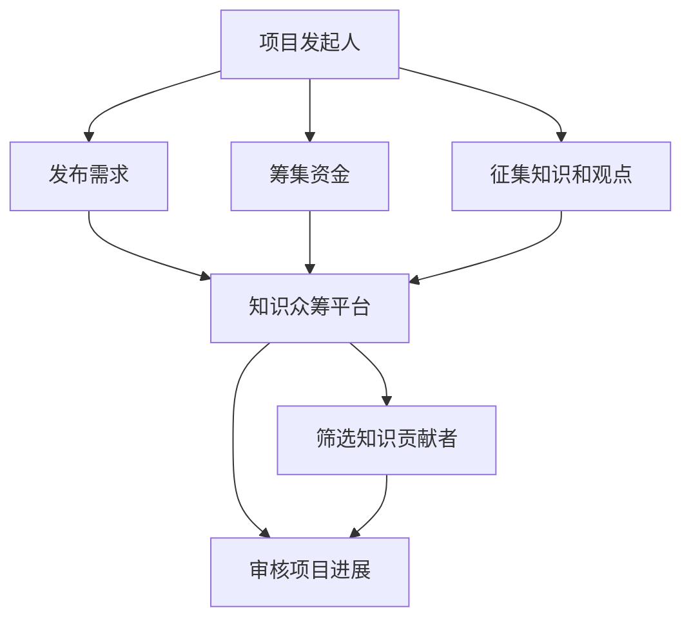

                 

## 1. 背景介绍

在知识爆炸的数字化时代，知识的产生和传播方式发生了革命性的变化。随着互联网和社交媒体的普及，每个人都有机会成为知识的生产者和传播者。然而，传统的学术研究往往由少数专家主导，且往往需要耗费大量时间和资源，使得知识传播的效率和覆盖面都受到限制。在这样的背景下，一种新型的知识生产与传播方式——知识的众筹模式（Crowdsourced Knowledge Funding）应运而生。

知识的众筹模式，是指利用互联网平台，将科研项目的具体需求发布到公开平台上，吸引大众参与，通过众筹机制筹集资金，同时征集专业知识和观点，共同推动科研项目的研究进展。这种方式不仅提高了科研项目的研究效率和覆盖面，还促进了知识的民主化和平等化。

本文将对知识的众筹模式进行全面系统的介绍，从理论到实践，深入探讨其核心概念、算法原理和操作步骤，并结合实际应用场景，展示其在科学研究、技术开发和社会创新中的巨大潜力。

## 2. 核心概念与联系

### 2.1 核心概念概述

为更好地理解知识的众筹模式，本节将介绍几个密切相关的核心概念：

- **知识众筹**：利用互联网平台，将科研项目的具体需求发布到公开平台上，吸引大众参与，通过众筹机制筹集资金，同时征集专业知识和观点，共同推动科研项目的研究进展。
- **众筹平台**：为知识众筹活动提供技术支持、资金管理和社群管理的第三方平台。
- **知识贡献者**：自愿参与知识众筹活动，提供资金、专业知识和观点的个人或机构。
- **项目发起人**：发起知识众筹项目的个人或机构，通常具有项目的技术背景和需求描述。
- **项目评审委员会**：由领域专家组成的评审团队，负责筛选知识贡献者和审核项目进展，保证项目质量。

这些核心概念之间的逻辑关系可以通过以下Mermaid流程图来展示：



这个流程图展示了一个知识众筹项目的基本流程：

1. 项目发起人发布需求。
2. 通过众筹平台筹集资金和征集知识。
3. 知识众筹平台负责筛选合适的知识贡献者。
4. 项目评审委员会审核项目进展，确保项目质量。

## 3. 核心算法原理 & 具体操作步骤

### 3.1 算法原理概述

知识的众筹模式基于"求助-众筹-研究"的闭环机制，通过充分利用互联网平台的开放性和资源共享特性，实现知识的民主化和高效传播。其核心思想是：

- 将科研项目的具体需求发布到公开平台上，吸引具有相关知识和经验的大众参与。
- 通过众筹机制筹集研究资金，同时征集专业知识和技术支持。
- 由项目评审委员会筛选知识贡献者，确保项目的质量和方向。
- 基于集体的智慧和力量，共同推动科研项目的进展。

### 3.2 算法步骤详解

知识的众筹模式一般包括以下几个关键步骤：

**Step 1: 项目需求描述**
- 项目发起人根据研究需求，撰写详细的需求描述，包括研究背景、目标、具体任务、预期成果等。
- 项目需求描述应尽可能详细、明确，以便吸引具有相关背景知识的参与者。

**Step 2: 平台发布和筹资**
- 将项目需求描述发布到众筹平台上，吸引大众参与。
- 项目发起人通过平台提供的众筹功能，筹集研究资金。
- 资金筹集结束后，项目评审委员会对筹集的资金进行审核，确保资金使用的透明度和合规性。

**Step 3: 征集知识和观点**
- 项目评审委员会对参与者提交的申请进行筛选，选择具有相关背景知识的贡献者。
- 筛选出的知识贡献者，提交专业知识、技术方案、研究成果等，供项目发起人参考。
- 项目评审委员会对提交的知识进行审核，确保其科学性和可行性。

**Step 4: 研究进程管理**
- 项目发起人根据知识贡献者提供的方案，制定研究计划和任务分配。
- 项目评审委员会对研究计划和任务分配进行审核，确保其合理性和可行性。
- 知识贡献者根据分配的任务进行研究工作，项目发起人和评审委员会定期对研究进展进行跟踪和评估。

**Step 5: 成果分享和反馈**
- 研究结束后，项目发起人将研究成果发布到众筹平台上，供公众评审和反馈。
- 项目评审委员会对研究成果进行评估，提出改进建议。
- 研究成果通过众筹平台分享，接受公众的评价和讨论。

### 3.3 算法优缺点

知识的众筹模式具有以下优点：
1. 广泛动员参与。通过互联网平台的开放性，吸引广泛的公众参与，提高知识的民主化程度。
2. 高效筹集资金。通过众筹机制，快速筹集研究资金，减少项目启动的资金压力。
3. 汇集集体智慧。知识贡献者通过分享专业知识和观点，共同推动科研项目的发展。
4. 提高研究透明度。项目资金和进展公开透明，便于公众监督和管理。

同时，该模式也存在一些局限性：
1. 参与者筛选困难。平台需要筛选具有相关背景知识的贡献者，过程较为复杂。
2. 知识多样性不足。众筹模式依赖于平台上的知识贡献者，其多样性和广泛性有待提高。
3. 平台信誉管理。众筹平台需要建立良好的信誉机制，保证资金和知识的安全。
4. 研究成果评估难度。公众的评价和反馈往往较为主观，需要专业评审团队的辅助。

尽管存在这些局限性，但知识的众筹模式仍然是一种极具潜力的知识传播方式，有望在科学研究、技术开发和社会创新中发挥重要作用。

### 3.4 算法应用领域

知识的众筹模式在多个领域都有着广泛的应用：

- **科学研究**：利用众筹模式，征集科研数据、文献资料和专业观点，推动前沿研究项目的进展。例如，SpaceX的火箭回收项目，通过众筹募集资金，同时征集工程师和技术支持，成功实现了火箭的可回收利用。
- **技术开发**：利用众筹模式，征集开源代码、算法方案和技术支持，推动开源项目的创新和发展。例如，OpenAI的GPT-3项目，通过众筹募集资金，同时征集算法和模型优化方案，取得了突破性进展。
- **社会创新**：利用众筹模式，征集社会问题和解决方案，推动社会创新项目的实施和推广。例如，MIT的众筹平台Scratchfunding，通过众筹募集资金，同时征集社会问题的解决方案，推动社会公益项目的实施。

除了上述这些典型应用外，知识的众筹模式还在教育、文化、艺术等多个领域得到了广泛应用，为不同领域的知识创新和传播提供了新的路径。

## 4. 数学模型和公式 & 详细讲解 & 举例说明

### 4.1 数学模型构建

知识的众筹模式本质上是一个多目标优化问题，可以通过数学模型进行建模和求解。假设项目资金需求为 $F$，知识贡献者的数量为 $N$，贡献者的专业评分分别为 $s_1, s_2, ..., s_N$，则众筹项目的数学模型可以表示为：

$$
\max \sum_{i=1}^N s_i \\
\text{s.t. } \sum_{i=1}^N \text{cost}_i = F
$$

其中，$\text{cost}_i$ 表示知识贡献者 $i$ 的资金需求。

### 4.2 公式推导过程

1. **目标函数**：目标函数 $\sum_{i=1}^N s_i$ 表示知识贡献者的专业评分之和，最大化该值即最大化贡献者的整体专业水平。
2. **约束条件**：约束条件 $\sum_{i=1}^N \text{cost}_i = F$ 表示项目总资金需求等于筹集的资金总额。

通过上述数学模型，可以求解出最优的知识贡献者集合和资金分配方案，最大化众筹项目的整体专业水平和资金使用效率。

### 4.3 案例分析与讲解

以SpaceX的火箭回收项目为例，其众筹模型的求解过程如下：

- **项目需求**：需要筹集足够的资金，用于研发可回收火箭。
- **资金需求**：项目总资金需求为 $F = 1000$ 万美元。
- **知识贡献者**：有多个科研机构和工程师提交了申请，其专业评分分别为 $s_1=0.9, s_2=0.8, ..., s_N=0.7$。
- **资金分配**：根据贡献者的专业评分和资金需求，计算出最优的资金分配方案。

通过求解上述优化问题，可以得出最优的知识贡献者集合和资金分配方案，即选择专业评分最高的贡献者，同时最大化资金的使用效率。

## 5. 项目实践：代码实例和详细解释说明

### 5.1 开发环境搭建

在进行众筹模式实践前，我们需要准备好开发环境。以下是使用Python进行Django开发的环境配置流程：

1. 安装Anaconda：从官网下载并安装Anaconda，用于创建独立的Python环境。

2. 创建并激活虚拟环境：
```bash
conda create -n crowdsource python=3.8 
conda activate crowdsource
```

3. 安装Django：
```bash
pip install django
```

4. 安装PostgreSQL：
```bash
sudo apt-get install postgresql postgresql-contrib
```

5. 安装Django项目模板：
```bash
django-admin startproject crowdsource_project
cd crowdsource_project
```

完成上述步骤后，即可在`crowdsource_project`环境中开始众筹模式开发。

### 5.2 源代码详细实现

下面我们以众筹平台项目为例，给出使用Django开发的知识众筹项目网站的代码实现。

**settings.py**：
```python
DATABASES = {
    'default': {
        'ENGINE': 'django.db.backends.postgresql',
        'NAME': 'crowdsourcedb',
        'USER': 'postgres',
        'PASSWORD': 'password',
        'HOST': 'localhost',
        'PORT': '5432',
    }
}
```

**urls.py**：
```python
from django.urls import path
from . import views

urlpatterns = [
    path('crowdsource/', views.crowdsource, name='crowdsource'),
]
```

**views.py**：
```python
from django.shortcuts import render
from .models import CrowdsourcedProject, Contributor

def crowdsource(request):
    projects = CrowdsourcedProject.objects.all()
    contributors = Contributor.objects.all()
    return render(request, 'crowdsource.html', {'projects': projects, 'contributors': contributors})
```

**models.py**：
```python
from django.db import models

class CrowdsourcedProject(models.Model):
    name = models.CharField(max_length=200)
    description = models.TextField()
    fund_goal = models.DecimalField(max_digits=10, decimal_places=2)
    current_fund = models.DecimalField(max_digits=10, decimal_places=2)
    funders = models.ManyToManyField('Contributor')
    is_funded = models.BooleanField(default=False)

class Contributor(models.Model):
    name = models.CharField(max_length=200)
    profession = models.CharField(max_length=200)
    professional_score = models.DecimalField(max_digits=2, decimal_places=1)
```

**templates/crowdsource.html**：
```html
<h1>Crowdsourced Projects</h1>
<ul>

    <li><a href="">{{ project.name }}</a></li>

</ul>

<h1>Contributors</h1>
<ul>

    <li><a href="">{{ contributor.name }}</a></li>

</ul>
```

完成上述代码后，即可在`crowdsource_project`环境中运行Django服务器，访问`http://localhost:8000/crowdsource/`查看项目列表和贡献者列表。

### 5.3 代码解读与分析

让我们再详细解读一下关键代码的实现细节：

**settings.py**：
- `DATABASES`配置项：指定数据库连接参数，连接本地的PostgreSQL数据库。

**urls.py**：
- 定义项目的路由，`crowdsource`视图将返回众筹项目的列表和贡献者列表。

**views.py**：
- 定义`crowdsource`视图函数，从数据库中查询所有众筹项目和贡献者，返回HTML页面。

**models.py**：
- `CrowdsourcedProject`模型：定义众筹项目的基本属性，包括项目名称、描述、资金目标、当前筹集金额、资助者、是否已资助等。
- `Contributor`模型：定义贡献者的基本属性，包括贡献者姓名、职业、专业评分等。

**templates/crowdsource.html**：
- 定义HTML模板，展示众筹项目的列表和贡献者的列表。

可以看到，Django的框架和模型-视图-模板架构，使得众筹模式的项目开发变得简洁高效。开发者可以将更多精力放在业务逻辑的实现和数据模型的设计上，而不必过多关注底层的技术细节。

当然，工业级的系统实现还需考虑更多因素，如用户权限管理、资金分配算法、众筹进度管理等。但核心的众筹模式基本与此类似。

## 6. 实际应用场景

### 6.1 智慧城市治理

知识的众筹模式可以应用于智慧城市治理，通过征集公众参与，共同解决城市管理中的各种问题。例如，城市交通拥堵问题，可以通过众筹模式征集交通专家的专业意见和解决方案，推动城市交通的优化和智能化发展。

在技术实现上，可以建立智慧城市治理的众筹平台，将具体的交通优化任务发布到平台上，征集交通专家、工程师、志愿者等参与，共同推动交通优化的方案制定和实施。通过众筹模式，不仅能快速筹集到资金，还能征集到广泛的专业知识和解决方案，极大地提高了城市治理的效率和水平。

### 6.2 教育创新

知识的众筹模式可以应用于教育创新，通过征集教师、学生、家长的参与，共同推动教育内容和教学方法的创新。例如，Khan Academy的众筹平台，通过征集学生和家长的反馈，优化在线教育内容和教学方法，推动教育的普及和创新。

在技术实现上，可以建立教育创新的众筹平台，将具体的教育创新任务发布到平台上，征集教师、学生、家长的参与，共同推动教育创新方案的制定和实施。通过众筹模式，不仅能快速筹集到资金，还能征集到广泛的教育经验和创新建议，极大地提高了教育创新的效率和质量。

### 6.3 社会公益

知识的众筹模式可以应用于社会公益，通过征集公众参与，共同推动社会公益项目的实施。例如，Dream Big Foundation的众筹平台，通过征集志愿者的参与，推动公益项目的实施和执行，帮助弱势群体实现梦想。

在技术实现上，可以建立社会公益的众筹平台，将具体的公益项目发布到平台上，征集志愿者的参与，共同推动公益项目的实施和执行。通过众筹模式，不仅能快速筹集到资金，还能征集到广泛的社会支持和公益建议，极大地提高了社会公益的效率和影响力。

### 6.4 未来应用展望

随着技术的不断发展，知识的众筹模式将呈现以下几个发展趋势：

1. **平台智能化**：未来的众筹平台将具备更强的智能化能力，能够自动筛选合适的知识贡献者，推荐最优的资金分配方案，并提供实时进度管理。
2. **数据可视化**：通过数据可视化技术，展示众筹项目的实时进展和资金使用情况，增强公众的透明度和信任感。
3. **区块链技术应用**：利用区块链技术，实现众筹项目的透明化和去中心化管理，增强资金和知识的安全性和可信度。
4. **多领域融合**：知识的众筹模式将与其他技术手段结合，如人工智能、物联网、大数据等，推动跨领域的知识创新和应用。
5. **社区自治化**：通过众筹平台建立社区自治机制，让参与者共同制定规则和管理，增强社区的凝聚力和参与度。

这些趋势凸显了知识的众筹模式的广阔前景，为不同领域的知识创新和传播提供了新的路径。相信随着技术的不断进步，知识的众筹模式将得到更广泛的应用，为社会的各个方面带来深远的影响。

## 7. 工具和资源推荐

### 7.1 学习资源推荐

为了帮助开发者系统掌握知识的众筹模式，这里推荐一些优质的学习资源：

1. Coursera《Crowdsourcing in the Digital Age》课程：由MIT媒体实验室教授开设的在线课程，全面介绍了众筹模式的理论基础和实践技巧。
2. Khan Academy《EdTech: The Future of Education》课程：Khan Academy的众筹平台经验分享，展示了教育创新的众筹模式如何推动教育的普及和创新。
3. Dream Big Foundation《Our Mission》：Dream Big Foundation的众筹平台介绍，展示了社会公益的众筹模式如何推动社会公益的实施和执行。

通过对这些资源的学习实践，相信你一定能够快速掌握知识的众筹模式的精髓，并用于解决实际的科研项目和社会问题。

### 7.2 开发工具推荐

高效的开发离不开优秀的工具支持。以下是几款用于众筹模式开发的常用工具：

1. Django：基于Python的开源Web框架，具有灵活的MVC架构，适合快速迭代研究。
2. PostgreSQL：开源关系型数据库，支持复杂的数据查询和分析，适合存储和管理众筹项目的数据。
3. HTML/CSS/JavaScript：Web开发的核心技术栈，用于设计和实现众筹平台的用户界面。
4. Bootstrap：前端开发框架，用于快速搭建响应式布局和美观的用户界面。
5. Docker：容器化技术，用于打包和部署众筹平台的后端服务，提高系统的可移植性和可维护性。

合理利用这些工具，可以显著提升众筹模式应用的开发效率，加快创新迭代的步伐。

### 7.3 相关论文推荐

知识的众筹模式的发展源于学界的持续研究。以下是几篇奠基性的相关论文，推荐阅读：

1. 《Crowdsourcing: A New Model for Scientific Collaboration》：由P.E. Klein等学者发表的论文，介绍了众筹模式在科学协作中的应用。
2. 《Crowdsourcing and Open Innovation: What We Know and What We Need to Know》：由C. Wiesel和C. B.Barrera等学者发表的论文，总结了众筹模式在开放创新中的应用。
3. 《Crowdsourcing Funding and Finesse in Research》：由A. Gunawardena等学者发表的论文，介绍了众筹模式在科学研究中的融资策略和风险管理。

这些论文代表了大众参与研究模式的发展脉络。通过学习这些前沿成果，可以帮助研究者把握学科前进方向，激发更多的创新灵感。

## 8. 总结：未来发展趋势与挑战

### 8.1 研究成果总结

本文对知识的众筹模式进行了全面系统的介绍，从理论到实践，深入探讨了其核心概念、算法原理和操作步骤。通过分析实际应用场景，展示了其在科学研究、技术开发和社会创新中的巨大潜力。通过总结相关学习资源、开发工具和研究论文，为读者提供了全面的技术指引。

### 8.2 未来发展趋势

展望未来，知识的众筹模式将呈现以下几个发展趋势：

1. **智能化和自动化**：未来的众筹平台将具备更强的智能化和自动化能力，能够自动筛选合适的知识贡献者，推荐最优的资金分配方案，并提供实时进度管理。
2. **去中心化和区块链**：利用区块链技术，实现众筹项目的透明化和去中心化管理，增强资金和知识的安全性和可信度。
3. **多领域融合**：知识的众筹模式将与其他技术手段结合，如人工智能、物联网、大数据等，推动跨领域的知识创新和应用。
4. **社区自治化**：通过众筹平台建立社区自治机制，让参与者共同制定规则和管理，增强社区的凝聚力和参与度。

这些趋势凸显了知识的众筹模式的广阔前景，为不同领域的知识创新和传播提供了新的路径。

### 8.3 面临的挑战

尽管知识的众筹模式已经取得了瞩目成就，但在迈向更加智能化、普适化应用的过程中，它仍面临着诸多挑战：

1. **平台治理**：众筹平台需要建立良好的治理机制，确保资金和知识的安全，避免欺诈和滥用。
2. **参与者管理**：平台需要筛选合适的知识贡献者，避免低质量或不可靠的参与者进入，影响项目质量。
3. **激励机制**：如何设计有效的激励机制，吸引更多的知识贡献者和资金支持，需要进一步探索和优化。
4. **数据隐私**：众筹平台需要保护参与者的数据隐私，避免数据泄露和滥用，增强公众的信任感。
5. **资金监管**：平台需要建立健全的资金监管机制，确保资金使用的透明度和合规性，避免资金滥用。

这些挑战需要平台和社区共同努力，不断优化治理机制和激励机制，才能实现知识的众筹模式的长久发展。

### 8.4 研究展望

面向未来，知识的众筹模式需要在以下几个方面寻求新的突破：

1. **智能化治理**：利用人工智能技术，实现众筹项目的智能化治理和管理，提高平台运行的效率和透明度。
2. **多平台融合**：建立跨平台的众筹合作机制，实现不同平台之间的知识共享和协作，增强知识的传播效果。
3. **社区参与度**：通过社区建设和自治机制，增强公众的参与度和满意度，提高众筹模式的可持续性。
4. **资金多元化**：探索多样化的资金筹集渠道，如众筹、捐赠、资助等，增强众筹项目的资金来源和稳定性。
5. **全球化合作**：建立全球化的众筹平台，实现跨国家的知识共享和协作，推动全球的知识创新和传播。

这些研究方向和突破点，必将引领知识的众筹模式迈向更高的台阶，为不同领域的知识创新和传播提供新的路径。相信随着技术的不断进步，知识的众筹模式将在社会各个方面得到更广泛的应用，为知识的民主化和平等化提供新的平台。

## 9. 附录：常见问题与解答

**Q1：众筹模式的优势和劣势分别是什么？**

A: 众筹模式的优势包括：
- 广泛动员参与。通过互联网平台的开放性，吸引广泛的公众参与，提高知识的民主化程度。
- 高效筹集资金。通过众筹机制，快速筹集研究资金，减少项目启动的资金压力。
- 汇集集体智慧。知识贡献者通过分享专业知识和观点，共同推动科研项目的发展。

众筹模式的劣势包括：
- 平台治理困难。平台需要建立良好的治理机制，确保资金和知识的安全，避免欺诈和滥用。
- 参与者管理复杂。平台需要筛选合适的知识贡献者，避免低质量或不可靠的参与者进入，影响项目质量。
- 激励机制不足。如何设计有效的激励机制，吸引更多的知识贡献者和资金支持，需要进一步探索和优化。

**Q2：如何选择合适的众筹平台？**

A: 选择合适的众筹平台需要考虑以下因素：
- 平台信誉和声誉。选择有良好信誉和声誉的平台，确保资金和知识的安全。
- 平台功能和服务。选择功能全面、服务优质的平台，确保项目的管理和执行。
- 平台透明度和公开性。选择公开透明的平台，确保项目的进展和资金使用情况。

**Q3：众筹模式在实际应用中需要注意哪些问题？**

A: 在实际应用中，众筹模式需要注意以下问题：
- 项目需求描述要详细明确。确保项目需求描述清晰、明确，吸引具有相关背景知识的参与者。
- 资金筹集和管理要透明公开。确保资金筹集和管理过程的透明性和公开性，增强公众的信任感。
- 参与者筛选和管理要严格规范。确保参与者的专业性和可靠性，避免低质量或不可靠的参与者进入，影响项目质量。
- 项目进展和成果要定期评估。定期评估项目的进展和成果，确保项目按计划推进。

通过全面考虑这些问题，可以最大限度地发挥众筹模式的优势，规避潜在的风险和挑战。

---

作者：禅与计算机程序设计艺术 / Zen and the Art of Computer Programming

