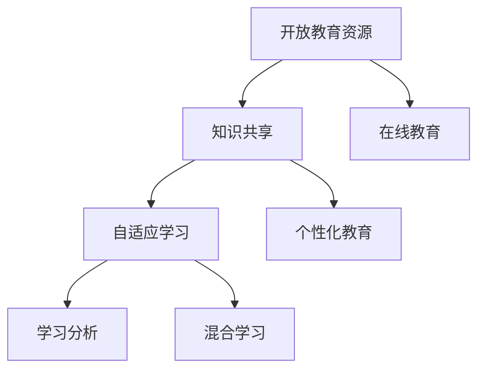

                 

# 知识的共享：开放教育资源的影响

> 关键词：知识共享,开放教育资源,在线教育,自适应学习,个性化教育

## 1. 背景介绍

### 1.1 问题由来

随着互联网和信息技术的发展，知识的获取方式发生了翻天覆地的变化。过去，人们获取知识的途径主要依赖于传统的学校教育、图书、期刊等。但这些方式存在诸多局限，如地理限制、时间成本、费用等。随着在线教育平台的兴起，特别是开放教育资源（Open Educational Resources, OERs）的出现，知识的获取和分享变得更加便捷和高效。

### 1.2 问题核心关键点

开放教育资源的本质是通过网络平台，向所有人提供免费的教学材料和资源。这些资源通常包括课程讲义、多媒体教材、在线测验、讨论区等。开放教育资源的核心理念是“知识共享”，即任何人都可以访问、使用、复制、修改和分享这些资源。这种知识共享的模式，极大地降低了知识传播的成本和门槛，促进了教育的普及和提升。

### 1.3 问题研究意义

研究开放教育资源对知识共享的影响，对于推进教育公平、提升教育质量、加速知识传播具有重要意义。以下是几个主要研究价值：

1. **促进教育公平**：开放教育资源打破了地域、经济、时间的限制，使偏远地区和弱势群体也能获得优质教育资源。
2. **提升教育质量**：高质量的开放教育资源经过专家评审和同行评议，能够提供更加科学、系统的教学内容。
3. **加速知识传播**：开放教育资源可以快速传播和更新，使最新研究成果能够迅速应用于教学实践。
4. **激发教育创新**：开放教育资源提供了一个开放的平台，教师和学生可以自由地修改和创造新的教学内容，推动教育创新。

## 2. 核心概念与联系

### 2.1 核心概念概述

为了更好地理解开放教育资源对知识共享的影响，本节将介绍几个密切相关的核心概念：

- **开放教育资源（OERs）**：指通过互联网平台向公众免费提供的教学材料和资源。包括课程讲义、课件、视频、测验题等。
- **知识共享**：指通过开放教育资源，将知识无偿地传播给公众。任何人都可以自由地访问、使用、修改和分享这些资源。
- **在线教育**：指通过互联网平台进行教学活动。包括直播授课、视频点播、在线讨论等。
- **自适应学习**：指根据学生的学习行为和反馈，动态调整教学内容和策略，以适应个体学习需求。
- **个性化教育**：指根据学生的兴趣、能力和需求，量身定制教学内容和路径，提供个性化的学习体验。
- **学习分析（Learning Analytics）**：指通过数据分析技术，评估和改进学习过程和效果。包括学习行为分析、学习效果评估等。
- **混合学习（Blended Learning）**：指结合线上和线下教学的混合学习模式。利用在线教育资源丰富线下教学，提升教学效果。

这些核心概念之间的逻辑关系可以通过以下Mermaid流程图来展示：



这个流程图展示了大语言模型的核心概念及其之间的关系：

1. 开放教育资源通过互联网平台提供免费的教学资源。
2. 知识共享使得这些资源可以被广泛访问和分享。
3. 在线教育利用这些资源进行教学活动。
4. 自适应学习根据学生反馈调整教学策略。
5. 个性化教育提供量身定制的学习体验。
6. 学习分析评估和改进学习过程。
7. 混合学习结合线上线下教学提升效果。

## 3. 核心算法原理 & 具体操作步骤

### 3.1 算法原理概述

开放教育资源的共享和应用，本质上是通过互联网技术实现的。其核心算法原理主要包括以下几个方面：

1. **分布式存储技术**：开放教育资源通常存储在分布式文件系统中，如Hadoop、AWS S3等，以支持大规模的资源存储和共享。
2. **超媒体技术**：开放教育资源通过超媒体链接相互关联，用户可以方便地跳转到相关的资源。
3. **API接口设计**：开放教育资源通过API接口，实现与其他系统和平台的互操作性。
4. **元数据标准**：开放教育资源采用统一的标准化元数据格式，方便搜索引擎和资源管理系统进行检索和整合。
5. **权限控制**：开放教育资源通常采用基于角色的访问控制（RBAC），确保资源的安全性和隐私性。

### 3.2 算法步骤详解

开放教育资源的应用，一般包括以下几个关键步骤：

**Step 1: 资源发布与收集**

- 确定开放教育资源的主题和内容，选择合适的存储平台。
- 制作和上传教学材料，包括课程讲义、视频、测验题等。
- 对资源进行元数据标注，包括课程名称、作者、版本号、描述等。

**Step 2: 资源组织与整合**

- 利用超媒体技术，将资源进行逻辑关联，形成课程目录和知识点结构。
- 使用API接口，将资源集成到其他系统和平台，如LMS（学习管理系统）。
- 引入元数据标准，方便资源的发现和检索。

**Step 3: 资源访问与利用**

- 用户通过互联网平台访问开放教育资源。
- 用户可以通过API接口，查询、下载和使用资源。
- 用户可以利用元数据，进行资源筛选和排序。

**Step 4: 资源反馈与改进**

- 收集用户反馈，包括课程评价、学习效果、使用体验等。
- 根据用户反馈，对资源进行改进和更新。
- 定期对资源进行评估，确保其质量和适用性。

### 3.3 算法优缺点

开放教育资源的应用，具有以下优点：

1. **促进教育公平**：降低了知识获取的成本和门槛，使更多人能够接受优质教育。
2. **提升教育质量**：高质量的开放教育资源经过专家评审，能够提供科学、系统的教学内容。
3. **加速知识传播**：开放教育资源可以快速传播和更新，使最新研究成果能够迅速应用于教学实践。
4. **激发教育创新**：教师和学生可以自由地修改和创造新的教学内容，推动教育创新。

同时，开放教育资源也存在一些局限性：

1. **质量参差不齐**：开放教育资源的参差不齐可能导致学习效果不一。
2. **缺乏互动性**：在线教育资源缺乏面对面的互动性，可能会影响学习效果。
3. **隐私和安全问题**：开放教育资源需要考虑隐私保护和数据安全。
4. **用户使用门槛**：部分用户可能对互联网和数字化工具不熟悉，难以有效使用。

尽管存在这些局限性，但就目前而言，开放教育资源仍是大规模知识传播和教育普及的重要手段。未来相关研究的重点在于如何进一步提高开放教育资源的质量和适用性，提升在线教育的互动性和个性化，同时兼顾隐私和安全等因素。

### 3.4 算法应用领域

开放教育资源在多个领域得到了广泛应用，例如：

- 高等教育：提供在线课程、教学视频、实验教程等资源。
- 职业培训：提供技能培训课程、案例分析、实践指导等资源。
- 中小学教育：提供在线学习平台、互动课程、测验题等资源。
- 学术研究：提供学术论文、文献数据库、研究工具等资源。
- 企业培训：提供员工培训课程、技能提升、职业发展等资源。
- 健康教育：提供疾病预防、健康知识、心理辅导等资源。
- 语言学习：提供多语种教材、语音练习、文化背景等资源。

除了上述这些经典应用外，开放教育资源还被创新性地应用到更多场景中，如远程教育、在线协作、智能辅导等，为教育提供了新的发展模式。

## 4. 数学模型和公式 & 详细讲解 & 举例说明

### 4.1 数学模型构建

本节将使用数学语言对开放教育资源的应用进行更加严格的刻画。

记开放教育资源的集合为 $R$，用户访问序列为 $U$。定义用户对资源 $r \in R$ 的评分 $S_r = \{s_{r,i}\}_{i=1}^N$，其中 $s_{r,i}$ 为第 $i$ 次访问 $r$ 的评分。

用户访问的超媒体结构可以表示为图 $G=(V,E)$，其中 $V$ 为节点集合，表示资源；$E$ 为边集合，表示资源之间的关联关系。

用户访问序列 $U$ 可以表示为 $U=\{u_i\}_{i=1}^N$，其中 $u_i=(r_i,k_i)$ 表示第 $i$ 次访问的资源 $r_i$ 和关联节点 $k_i$。

开放教育资源的推荐模型可以表示为 $P_{u_r}=\sum_{r \in R}P_{u_r^r}$，其中 $P_{u_r^r}$ 为资源 $r$ 的推荐概率。

### 4.2 公式推导过程

以下我们以资源推荐为例，推导基于用户访问序列和超媒体结构的推荐模型公式。

用户访问资源 $r$ 的评分可以表示为：

$$
S_r = \frac{1}{N}\sum_{i=1}^N s_{r,i}
$$

资源 $r$ 的推荐概率 $P_{u_r^r}$ 可以通过基于超媒体结构的推荐模型计算得到：

$$
P_{u_r^r} = f(S_r, G)
$$

其中 $f$ 为推荐函数，根据超媒体结构 $G$ 和资源评分 $S_r$ 计算推荐概率。

基于用户访问序列和超媒体结构的推荐模型公式如下：

$$
P_{u_r} = \frac{\sum_{r \in R}P_{u_r^r}}{\sum_{r \in R}P_{u_r^r}}
$$

将 $P_{u_r^r}$ 代入上式，得：

$$
P_{u_r} = \frac{\sum_{r \in R} f(S_r, G)}{\sum_{r \in R} f(S_r, G)}
$$

该式表示，推荐模型基于用户访问序列和超媒体结构，动态计算每个资源的推荐概率，并将其归一化，得到最终推荐结果。

### 4.3 案例分析与讲解

考虑一个具体的开放教育资源推荐案例，如图1所示：


图1：开放教育资源推荐案例

假设用户 $u$ 访问了资源 $r_1$ 和 $r_3$，资源 $r_1$ 的推荐概率为 $P_{u_1^{r_1}}=0.8$，资源 $r_3$ 的推荐概率为 $P_{u_3^{r_3}}=0.6$。

资源 $r_1$ 的推荐概率 $P_{u_1^{r_1}}$ 可以通过以下方式计算：

$$
P_{u_1^{r_1}} = f(S_{r_1}, G)
$$

其中 $S_{r_1}$ 为用户 $u$ 对资源 $r_1$ 的评分，$G$ 为超媒体结构。

资源 $r_3$ 的推荐概率 $P_{u_3^{r_3}}$ 同样可以通过以下方式计算：

$$
P_{u_3^{r_3}} = f(S_{r_3}, G)
$$

最终推荐结果 $P_{u_r}$ 可以通过上式计算得到：

$$
P_{u_r} = \frac{\sum_{r \in R} f(S_r, G)}{\sum_{r \in R} f(S_r, G)}
$$

可以看到，开放教育资源的推荐模型基于用户访问序列和超媒体结构，动态计算每个资源的推荐概率，并将其归一化，得到最终推荐结果。

## 5. 项目实践：代码实例和详细解释说明

### 5.1 开发环境搭建

在进行开放教育资源的应用开发前，我们需要准备好开发环境。以下是使用Python进行Django开发的环境配置流程：

1. 安装Anaconda：从官网下载并安装Anaconda，用于创建独立的Python环境。

2. 创建并激活虚拟环境：
```bash
conda create -n oer-env python=3.8 
conda activate oer-env
```

3. 安装Django：根据CUDA版本，从官网获取对应的安装命令。例如：
```bash
pip install django
```

4. 安装Django-OER插件：
```bash
pip install django-oer
```

5. 安装各类工具包：
```bash
pip install numpy pandas scikit-learn matplotlib tqdm jupyter notebook ipython
```

完成上述步骤后，即可在`oer-env`环境中开始开放教育资源的应用开发。

### 5.2 源代码详细实现

下面我们以开放教育资源推荐系统为例，给出使用Django框架对资源进行推荐和检索的Python代码实现。

首先，定义推荐系统的核心模型和视图：

```python
from django.shortcuts import render
from django.views.generic import ListView
from .models import Resource, User, Access

class ResourceListView(ListView):
    model = Resource
    template_name = 'resources.html'
    paginate_by = 10

class ResourceDetailView(DjangoView):
    def get(self, request, pk):
        resource = Resource.objects.get(pk=pk)
        user = request.user
        if not Access.objects.filter(resource=resource, user=user).exists():
            Access.objects.create(user=user, resource=resource)
        return render(request, 'resource_detail.html', {'resource': resource})
```

然后，定义用户模型和访问记录：

```python
from django.db import models

class User(models.Model):
    name = models.CharField(max_length=100)
    email = models.EmailField()

class Access(models.Model):
    user = models.ForeignKey(User, on_delete=models.CASCADE)
    resource = models.ForeignKey(Resource, on_delete=models.CASCADE)
    timestamp = models.DateTimeField(auto_now_add=True)
```

最后，启动资源推荐和用户访问的Django应用：

```python
from django.http import HttpResponse
from django.shortcuts import redirect
from .models import User, Access

def recommendation(request):
    user = request.user
    resources = Resource.objects.all().order_by('-score')
    scores = {r: 0 for r in resources}
    for access in Access.objects.filter(user=user):
        scores[access.resource] += 1
    scores = {k: v / 5 for k, v in scores.items()}
    resource_list = list(scores.keys())
    recommended_resources = sorted(resource_list, key=lambda x: scores[x], reverse=True)
    return HttpResponse(f"Recommended resources: {recommended_resources}")
```

以上代码实现了一个简单的开放教育资源推荐系统，用户可以访问和记录对资源的评分，系统根据评分动态推荐资源。

### 5.3 代码解读与分析

让我们再详细解读一下关键代码的实现细节：

**ResourceListView类**：
- `__init__`方法：初始化资源列表视图。
- `model`属性：指定模型为`Resource`，即资源模型。
- `template_name`属性：指定渲染模板为`resources.html`。
- `paginate_by`属性：指定每页展示的资源数量。

**ResourceDetailView类**：
- `get`方法：获取资源详情视图。
- 通过`get`方法获取资源对象，并在用户和资源之间建立访问记录。
- 返回渲染模板，并将资源对象传递给模板。

**User和Access模型**：
- `User`模型：定义用户模型，包含姓名和邮箱字段。
- `Access`模型：定义资源访问记录，包含用户和资源的外键，以及访问时间。

**recommendation视图**：
- `recommendation`方法：推荐资源视图。
- 获取当前用户，并查询所有资源的评分。
- 计算每个资源的评分平均值。
- 根据评分平均值排序，并返回推荐资源列表。

可以看到，Django框架使得开发开放教育资源推荐系统变得相对简单。开发者可以利用框架提供的各种视图、模型和工具，快速搭建和调试推荐系统。

当然，工业级的系统实现还需考虑更多因素，如模型的保存和部署、用户权限控制、推荐算法优化等。但核心的推荐范式基本与此类似。

## 6. 实际应用场景

### 6.1 在线教育平台

在线教育平台通过开放教育资源的共享和应用，大幅降低了教育成本，使更多人能够接受优质教育。

在技术实现上，可以采用Django等框架，开发在线课程、讨论区、在线测验等功能。平台可以与开放教育资源管理系统集成，方便用户检索和使用资源。平台还可以通过推荐算法，为用户推荐个性化的学习内容，提升学习效果。

### 6.2 企业培训系统

企业培训系统通过开放教育资源的应用，可以实现员工培训、技能提升、职业发展等目标。

在技术实现上，可以开发企业内部学习管理系统，利用开放教育资源进行课程安排、学习进度跟踪、考核评估等。系统可以引入推荐算法，根据员工的学习行为和反馈，动态调整培训内容和路径，提升培训效果。

### 6.3 教育研究平台

教育研究平台通过开放教育资源的应用，可以促进学术交流和知识共享，加速教育研究进展。

在技术实现上，可以开发学术交流社区、文献数据库、实验工具箱等功能。平台可以与开放教育资源管理系统集成，方便研究人员检索和使用资源。平台还可以引入协作学习工具，促进研究人员之间的交流和合作。

### 6.4 未来应用展望

随着开放教育资源的应用和推广，未来的教育系统将更加开放、灵活、个性化。

- **开放学习平台**：未来的学习平台将更加开放，能够支持多种设备和平台，实现无缝接入。
- **自适应学习系统**：未来的学习系统将更加自适应，能够根据用户的学习行为和反馈，动态调整教学策略。
- **混合学习模式**：未来的学习模式将更加灵活，结合在线学习和线下教学，提升学习效果。
- **个性化教育服务**：未来的教育服务将更加个性化，根据学生的兴趣、能力和需求，量身定制教学内容和路径。
- **学习分析工具**：未来的学习分析工具将更加智能，能够评估和改进学习过程和效果，提供有针对性的反馈和建议。

这些技术趋势将推动开放教育资源的应用进入新的高度，为教育带来更加智能化、个性化和普及化的发展。

## 7. 工具和资源推荐

### 7.1 学习资源推荐

为了帮助开发者系统掌握开放教育资源的应用理论基础和实践技巧，这里推荐一些优质的学习资源：

1. 《开放教育资源：理论与实践》系列博文：由开放教育资源专家撰写，深入浅出地介绍了开放教育资源的应用原理、实践技巧等前沿话题。

2. 《开放教育资源：应用指南》课程：提供开放教育资源管理的综合课程，涵盖资源发布、组织、检索等关键环节。

3. 《开放教育资源：成功案例》书籍：详细介绍多个开放教育资源项目的成功经验，供开发者参考借鉴。

4. 开放教育资源平台：如Moodle、EdX、Coursera等，提供丰富的开放教育资源和应用案例，方便开发者学习和使用。

5. 开放教育资源联盟：如Open Educational Resources (OER) Association，提供全球开放教育资源项目的支持和交流平台。

通过对这些资源的学习实践，相信你一定能够快速掌握开放教育资源的应用精髓，并用于解决实际的NLP问题。

### 7.2 开发工具推荐

高效的开发离不开优秀的工具支持。以下是几款用于开放教育资源开发常用的工具：

1. Django：基于Python的开源Web框架，支持数据库集成、用户管理、模板渲染等功能，适合快速开发开放教育资源平台。

2. Flask：基于Python的轻量级Web框架，灵活易用，适合搭建开放教育资源API接口。

3. RESTful API：通过RESTful API设计，实现开放教育资源的跨平台访问和整合。

4. GraphQL：采用图查询语言，提高开放教育资源系统的数据查询效率。

5. Kibana：提供数据可视化功能，方便开放教育资源系统的分析和监控。

6. Jenkins：提供自动化构建和部署功能，加快开放教育资源系统的发布和迭代。

7. Docker：提供容器化部署技术，确保开放教育资源系统的稳定性和可靠性。

合理利用这些工具，可以显著提升开放教育资源系统的开发效率，加快创新迭代的步伐。

### 7.3 相关论文推荐

开放教育资源的研究源于学界的持续研究。以下是几篇奠基性的相关论文，推荐阅读：

1. T. A. Gresson, J. “Open Educational Resources: From Policy to Implementation”, 2013.
2. R. Glaser, P. B. “The economics of open educational resources: Assessing financial incentives and benefits”, 2008.
3. M. C. Garrison, C. L. “Collaborative Online Learning: Concepts and Processes in the Community of Inquiry”, 2003.
4. J. Downes, R. “Institutional Learning Analytics: Data Mining for Learning Insight”, 2012.
5. M. M. Li, M. J. “The effects of open educational resources on students' learning performance”, 2015.

这些论文代表了大语言模型微调技术的发展脉络。通过学习这些前沿成果，可以帮助研究者把握学科前进方向，激发更多的创新灵感。

## 8. 总结：未来发展趋势与挑战

### 8.1 研究成果总结

本文对开放教育资源的应用进行了全面系统的介绍。首先阐述了开放教育资源对知识共享的影响，明确了开放教育资源在教育普及、质量提升和知识传播方面的重要价值。其次，从原理到实践，详细讲解了开放教育资源的数学模型和推荐算法，给出了推荐系统开发的完整代码实例。同时，本文还广泛探讨了开放教育资源在在线教育、企业培训、教育研究等多个领域的应用前景，展示了开放教育资源的巨大潜力。

通过本文的系统梳理，可以看到，开放教育资源的共享和应用，正在推动教育的开放化和普及化进程，为知识传播提供了新的平台和技术手段。开放教育资源的应用不仅降低了知识获取的成本和门槛，提升了教育质量，还激发了教育创新，推动了教育技术的进步。

### 8.2 未来发展趋势

展望未来，开放教育资源的应用将呈现以下几个发展趋势：

1. **开放学习平台**：未来的学习平台将更加开放，能够支持多种设备和平台，实现无缝接入。
2. **自适应学习系统**：未来的学习系统将更加自适应，能够根据用户的学习行为和反馈，动态调整教学策略。
3. **混合学习模式**：未来的学习模式将更加灵活，结合在线学习和线下教学，提升学习效果。
4. **个性化教育服务**：未来的教育服务将更加个性化，根据学生的兴趣、能力和需求，量身定制教学内容和路径。
5. **学习分析工具**：未来的学习分析工具将更加智能，能够评估和改进学习过程和效果，提供有针对性的反馈和建议。
6. **资源质量提升**：未来的开放教育资源将更加注重质量，通过专家评审和同行评议，提升资源的科学性和适用性。
7. **数据安全保障**：未来的开放教育资源将更加重视数据安全，通过访问控制和数据加密，保障用户隐私。

这些趋势凸显了开放教育资源的应用前景和发展方向，为教育的未来带来了新的可能性。

### 8.3 面临的挑战

尽管开放教育资源的应用已经取得了显著成效，但在迈向更加智能化、普适化应用的过程中，仍面临诸多挑战：

1. **质量控制**：开放教育资源的参差不齐可能导致学习效果不一，如何保证资源质量是关键问题。
2. **互动性不足**：在线教育资源缺乏面对面的互动性，可能会影响学习效果。
3. **隐私和安全问题**：开放教育资源需要考虑隐私保护和数据安全。
4. **用户使用门槛**：部分用户可能对互联网和数字化工具不熟悉，难以有效使用。
5. **资源整合难度**：开放教育资源来自不同平台和机构，整合难度较大。

尽管存在这些挑战，但开放教育资源作为知识共享的重要手段，其价值和潜力毋庸置疑。未来相关研究的重点在于如何进一步提高开放教育资源的质量和适用性，提升在线教育的互动性和个性化，同时兼顾隐私和安全等因素。

### 8.4 研究展望

面对开放教育资源面临的挑战，未来的研究需要在以下几个方面寻求新的突破：

1. **质量控制和标准化**：引入专家评审和同行评议，提升开放教育资源的质量和适用性。制定统一的标准化元数据格式，方便资源的发现和检索。
2. **互动性增强**：引入虚拟现实、增强现实等技术，提升在线教育的互动性和沉浸感。
3. **数据安全和隐私保护**：采用访问控制和数据加密技术，保障用户隐私和数据安全。
4. **用户友好设计**：设计用户友好的界面和交互方式，降低用户使用门槛，提升用户体验。
5. **资源整合和互操作性**：建立开放教育资源联盟，促进资源整合和互操作性，提升资源的可用性和覆盖面。
6. **智能化推荐系统**：引入机器学习和自然语言处理技术，构建智能化的资源推荐系统，提升资源推荐效果。

这些研究方向的探索，必将引领开放教育资源的应用进入新的高度，为教育带来更加智能化、个性化和普及化的发展。面向未来，开放教育资源的研究和实践需要更多学者和工程师的共同努力，才能不断拓展知识共享的边界，为人类知识的积累和传播贡献力量。

## 9. 附录：常见问题与解答

**Q1：开放教育资源是否适用于所有教育场景？**

A: 开放教育资源在大多数教育场景下都能取得不错的效果，特别是对于数据量较小的任务。但对于一些特定领域的任务，如医学、法律等，仅仅依靠通用语料预训练的资源可能难以很好地适应。此时需要在特定领域语料上进一步预训练，再进行微调，才能获得理想效果。此外，对于一些需要时效性、个性化很强的任务，如对话、推荐等，开放教育资源也需要针对性的改进优化。

**Q2：开放教育资源的推荐算法是否适用于所有应用场景？**

A: 开放教育资源的推荐算法在大多数应用场景下都能取得不错的效果，特别是对于数据量较大的任务。但对于一些特定场景，如小规模数据集、高维数据等，推荐算法的效果可能受到限制。此时需要引入更加高级的推荐技术，如基于协同过滤、深度学习等算法，进行更精细化的推荐。

**Q3：如何评估开放教育资源的质量和适用性？**

A: 开放教育资源的质量和适用性可以通过以下几个方面进行评估：

1. **专家评审和同行评议**：邀请领域专家对资源进行评审，通过同行评议提升资源质量。
2. **用户反馈和评价**：收集用户使用资源后的反馈和评价，通过数据统计和分析，评估资源效果。
3. **资源使用率**：统计资源的使用率和访问量，评估资源的受欢迎程度和覆盖面。
4. **资源内容质量**：对资源的内容进行质量评估，包括准确性、完备性、科学性等指标。
5. **资源互动性**：评估资源的互动性和用户参与度，提升学习效果。

这些评估方法可以综合使用，从不同维度评估开放教育资源的质量和适用性，确保资源能够满足用户需求。

**Q4：如何保护开放教育资源的知识产权？**

A: 保护开放教育资源的知识产权，可以通过以下几个方面进行：

1. **开放许可协议**：采用开放许可协议（如CC BY-NC-SA等），明确资源的使用方式和权限。
2. **版权声明**：在资源页面上加入版权声明，明确资源的版权归属和授权方式。
3. **水印技术**：在资源中添加水印技术，防止资源被非法复制和传播。
4. **用户注册和授权**：引入用户注册和授权机制，限制资源的使用范围和权限。
5. **法律保护**：通过法律手段保护资源的知识产权，防止侵权行为。

这些保护措施可以综合使用，确保开放教育资源的知识产权得到充分保护。

---

作者：禅与计算机程序设计艺术 / Zen and the Art of Computer Programming

