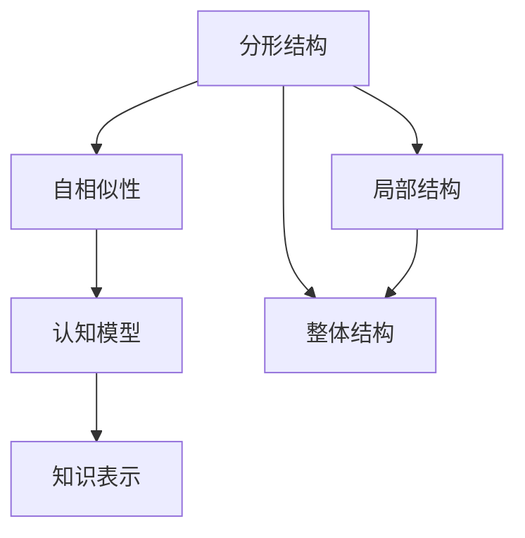

                 

# 知识的分形结构：自相似性在认知中的应用

## 1. 背景介绍

### 1.1 问题由来

在认知科学和人工智能领域，理解和建模人类知识结构一直是一个核心挑战。知识本身不是线性的，而是具有层次性和自相似性。这种自相似性体现在知识的组织和关联上，类似于分形结构的特征，在各个层级上呈现相似的模式和规律。认知科学研究如何将这种自相似性应用到知识的建模和表示中，从而提升人工智能系统的理解和推理能力。

### 1.2 问题核心关键点

认知科学的研究表明，人类的认知过程涉及到复杂的非线性动力学和自组织过程。这种自组织特性使得知识系统具有高度的自相似性，即局部结构和整体结构在形态上相似。认知模型需要捕捉这种自相似性，以更好地理解人类认知的复杂性。

### 1.3 问题研究意义

研究知识的分形结构，对于构建更高效、更灵活的认知模型具有重要意义：

1. **提高模型的泛化能力**：自相似性意味着模型在处理新数据时能够利用已有的知识结构，从而提高泛化能力。
2. **增强模型的适应性**：自相似性结构使得模型能够快速适应不同的任务和场景，增强系统的适应性和鲁棒性。
3. **促进跨领域应用**：自相似性结构使得知识系统能够在不同领域之间进行有效的迁移学习，促进跨领域知识的应用和融合。
4. **提升模型的可解释性**：自相似性结构有助于解释模型内部的知识表示和推理过程，提高模型的透明度和可理解性。

## 2. 核心概念与联系

### 2.1 核心概念概述

要理解自相似性在认知中的应用，首先需要了解几个关键概念：

- **分形结构(Fractal Structure)**：指一种在各个尺度上均保持相似形态的几何结构。在认知中，分形结构可以类比为知识的组织方式，即局部知识和整体知识在结构上具有相似性。
- **自相似性(Self-similarity)**：指一个系统的局部结构和整体结构在形态上具有相似性。在认知中，自相似性可以视为知识系统的内在特性，即在抽象和具体层次上都具有类似的结构和功能。
- **认知模型(Cognitive Model)**：指用于模拟人类认知过程的数学或计算模型，如神经网络、符号系统等。
- **知识表示(Knowledge Representation)**：指将知识转化为计算机可处理的形式，以便于存储、检索和推理。

这些概念通过自相似性这条线索相互联系，共同构成了认知科学的理论框架。

### 2.2 核心概念原理和架构的 Mermaid 流程图



这个流程图展示了分形结构、自相似性、认知模型和知识表示之间的逻辑关系：

- 分形结构在局部和整体上保持相似，形成自相似性。
- 自相似性是认知模型的内在特征，通过自相似性，模型可以在不同层次上抽象和推理。
- 认知模型通过知识表示将抽象知识转化为具体形式，便于计算和处理。

## 3. 核心算法原理 & 具体操作步骤

### 3.1 算法原理概述

自相似性在认知中的应用，主要通过以下几个关键算法和步骤实现：

1. **分形结构识别**：识别知识系统中的局部和整体结构相似性。
2. **自相似性映射**：将局部结构和整体结构映射到统一的抽象空间中，以便于推理和泛化。
3. **认知模型训练**：在自相似性映射的基础上，训练认知模型，使其能够理解和推理抽象和具体的知识。
4. **知识表示转换**：将训练好的认知模型转换为知识表示，以便于存储和检索。

### 3.2 算法步骤详解

#### 3.2.1 分形结构识别

分形结构识别是自相似性认知应用的基础。具体步骤如下：

1. **数据采集**：收集知识系统中的数据，如文本、图像、语音等。
2. **局部特征提取**：使用特征提取算法（如卷积神经网络、稠密向量空间表示等）提取局部特征。
3. **局部相似度计算**：计算不同局部特征之间的相似度，可以使用余弦相似度、欧氏距离等。
4. **局部相似性聚类**：将相似度高的局部特征聚类，形成局部结构。

#### 3.2.2 自相似性映射

自相似性映射的目的是将局部结构和整体结构映射到统一的抽象空间中。具体步骤如下：

1. **全局特征提取**：使用全局特征提取算法（如深度学习中的卷积神经网络）提取整体特征。
2. **局部-全局相似度计算**：计算局部结构和全局结构之间的相似度。
3. **映射转换**：将局部结构映射到全局结构中，形成自相似性映射。

#### 3.2.3 认知模型训练

在自相似性映射的基础上，训练认知模型。具体步骤如下：

1. **模型选择**：选择合适的认知模型（如神经网络、符号系统等）。
2. **输入设计**：设计模型的输入，将自相似性映射的结果作为输入。
3. **训练优化**：使用监督学习或无监督学习算法（如反向传播、强化学习等）训练模型。
4. **性能评估**：在测试集上评估模型的性能，调整超参数以优化模型。

#### 3.2.4 知识表示转换

将训练好的认知模型转换为知识表示，以便于存储和检索。具体步骤如下：

1. **知识提取**：使用符号表示法（如一阶逻辑、语义网等）提取模型的知识。
2. **知识存储**：将提取的知识存储到知识库或数据库中。
3. **知识检索**：使用知识检索算法（如基于向量空间的方法、图搜索算法等）检索知识。

### 3.3 算法优缺点

自相似性在认知中的应用具有以下优点：

1. **提升泛化能力**：自相似性使得模型能够在不同场景和任务中快速泛化。
2. **增强适应性**：自相似性结构能够适应不同层次和粒度的知识。
3. **促进跨领域应用**：自相似性使得知识能够在不同领域之间迁移应用。

同时，也存在一些局限性：

1. **数据需求高**：分形结构识别和自相似性映射需要大量高质量的数据。
2. **算法复杂**：自相似性映射和认知模型训练需要复杂的算法和计算资源。
3. **可解释性不足**：自相似性映射后的知识表示可能缺乏可解释性。

### 3.4 算法应用领域

自相似性在认知中的应用已经广泛应用于以下几个领域：

- **认知建模**：如神经网络、符号系统等认知模型的构建和训练。
- **知识表示**：如语义网、知识图谱等知识库的设计和实现。
- **自然语言处理**：如语言模型的构建、文本摘要、机器翻译等任务。
- **计算机视觉**：如物体识别、图像分类、图像生成等任务。
- **语音识别**：如语音合成、语音识别等任务。
- **人机交互**：如智能问答、对话系统等任务。

## 4. 数学模型和公式 & 详细讲解 & 举例说明

### 4.1 数学模型构建

本节将使用数学语言对自相似性在认知中的应用进行更加严格的刻画。

设知识系统为 $K$，局部结构为 $L$，整体结构为 $G$，自相似性映射为 $M$。

定义知识系统 $K$ 的局部结构 $L$ 和整体结构 $G$ 之间的自相似性映射 $M$ 为：

$$
M: L \rightarrow G
$$

### 4.2 公式推导过程

以文本分类任务为例，展示自相似性在认知中的应用。

假设文本分类任务的数据集为 $D = \{(x_i, y_i)\}_{i=1}^N$，其中 $x_i$ 为文本，$y_i$ 为分类标签。

设文本的局部特征为 $f(x_i)$，整体特征为 $g(x_i)$，自相似性映射为 $M$。

文本分类模型的输入为 $M(f(x_i))$，即映射后的局部特征。

分类模型的输出为 $p(y_i|M(f(x_i)))$，即条件概率分布。

使用交叉熵损失函数，定义分类模型 $M$ 的经验风险：

$$
\mathcal{L}(M) = \frac{1}{N} \sum_{i=1}^N -y_i \log p(y_i|M(f(x_i)))
$$

使用梯度下降算法优化模型参数，最小化经验风险，得到分类模型 $M$ 的优化目标：

$$
\theta^* = \mathop{\arg\min}_{\theta} \mathcal{L}(\theta)
$$

### 4.3 案例分析与讲解

以计算机视觉中的物体识别任务为例，展示自相似性在认知中的应用。

设图像分类任务的数据集为 $D = \{(x_i, y_i)\}_{i=1}^N$，其中 $x_i$ 为图像，$y_i$ 为物体类别。

设图像的局部特征为 $f(x_i)$，整体特征为 $g(x_i)$，自相似性映射为 $M$。

物体识别模型的输入为 $M(f(x_i))$，即映射后的局部特征。

识别模型的输出为 $p(y_i|M(f(x_i)))$，即条件概率分布。

使用交叉熵损失函数，定义识别模型 $M$ 的经验风险：

$$
\mathcal{L}(M) = \frac{1}{N} \sum_{i=1}^N -y_i \log p(y_i|M(f(x_i)))
$$

使用梯度下降算法优化模型参数，最小化经验风险，得到识别模型 $M$ 的优化目标：

$$
\theta^* = \mathop{\arg\min}_{\theta} \mathcal{L}(\theta)
$$

## 5. 项目实践：代码实例和详细解释说明

### 5.1 开发环境搭建

在进行自相似性在认知中的应用开发前，我们需要准备好开发环境。以下是使用Python进行TensorFlow开发的环境配置流程：

1. 安装Anaconda：从官网下载并安装Anaconda，用于创建独立的Python环境。

2. 创建并激活虚拟环境：
```bash
conda create -n tf-env python=3.8 
conda activate tf-env
```

3. 安装TensorFlow：根据CUDA版本，从官网获取对应的安装命令。例如：
```bash
conda install tensorflow -c pytorch -c conda-forge
```

4. 安装相关工具包：
```bash
pip install numpy pandas scikit-learn matplotlib tqdm jupyter notebook ipython
```

完成上述步骤后，即可在`tf-env`环境中开始开发实践。

### 5.2 源代码详细实现

下面以物体识别任务为例，给出使用TensorFlow进行认知模型训练的Python代码实现。

首先，定义数据集：

```python
import tensorflow as tf
import numpy as np
import matplotlib.pyplot as plt

# 定义数据集
train_dataset = tf.data.Dataset.from_tensor_slices((x_train, y_train))
test_dataset = tf.data.Dataset.from_tensor_slices((x_test, y_test))

# 数据增强
data_augmentation = tf.keras.Sequential([
    tf.keras.layers.experimental.preprocessing.RandomFlip("horizontal"),
    tf.keras.layers.experimental.preprocessing.RandomRotation(0.2)
])

train_dataset = train_dataset.map(lambda x, y: (data_augmentation(x), y))
```

然后，定义模型：

```python
# 定义卷积神经网络模型
model = tf.keras.Sequential([
    tf.keras.layers.Conv2D(32, (3, 3), activation='relu', input_shape=(256, 256, 3)),
    tf.keras.layers.MaxPooling2D((2, 2)),
    tf.keras.layers.Conv2D(64, (3, 3), activation='relu'),
    tf.keras.layers.MaxPooling2D((2, 2)),
    tf.keras.layers.Flatten(),
    tf.keras.layers.Dense(64, activation='relu'),
    tf.keras.layers.Dense(num_classes, activation='softmax')
])
```

接着，定义损失函数和优化器：

```python
# 定义损失函数
loss_fn = tf.keras.losses.CategoricalCrossentropy()

# 定义优化器
optimizer = tf.keras.optimizers.Adam()
```

最后，执行训练过程：

```python
# 定义训练过程
@tf.function
def train_step(x, y):
    with tf.GradientTape() as tape:
        logits = model(x, training=True)
        loss_value = loss_fn(y, logits)
    gradients = tape.gradient(loss_value, model.trainable_variables)
    optimizer.apply_gradients(zip(gradients, model.trainable_variables))
    return loss_value

# 训练模型
epochs = 10
batch_size = 32

for epoch in range(epochs):
    for batch in train_dataset:
        x_batch, y_batch = batch
        loss = train_step(x_batch, y_batch)
        print(f"Epoch {epoch+1}, loss: {loss:.4f}")
```

以上就是使用TensorFlow进行物体识别任务认知模型训练的完整代码实现。可以看到，TensorFlow提供了丰富的API和工具，使得认知模型的开发和训练变得简洁高效。

### 5.3 代码解读与分析

让我们再详细解读一下关键代码的实现细节：

**数据集定义**：
- 使用`tf.data.Dataset.from_tensor_slices`方法从TensorFlow数据集生成器中获取数据。
- 使用`data_augmentation`模块进行数据增强，增加数据的多样性。

**模型定义**：
- 使用`tf.keras.Sequential`定义卷积神经网络模型，包含卷积层、池化层、全连接层等组件。
- 使用`tf.keras.layers.Dense`定义输出层，使用`softmax`激活函数输出类别概率分布。

**损失函数和优化器**：
- 使用`tf.keras.losses.CategoricalCrossentropy`定义交叉熵损失函数。
- 使用`tf.keras.optimizers.Adam`定义Adam优化器。

**训练过程**：
- 定义`train_step`函数，使用梯度下降算法更新模型参数。
- 在每个epoch中，遍历训练数据集，使用`train_step`函数进行训练，并输出损失值。

## 6. 实际应用场景

### 6.1 智能问答系统

自相似性在智能问答系统中的应用，可以显著提升系统的准确性和泛化能力。智能问答系统通常需要处理复杂的多层次知识结构，自相似性可以用于构建知识的层次化表示，使得系统能够更好地理解和推理用户的查询。

在技术实现上，可以使用自相似性映射将用户查询映射到知识库中的对应节点，同时使用分形结构识别技术，识别出查询中的关键信息，形成局部结构，再将其映射到整体知识结构中。系统根据映射结果，从知识库中检索相关信息，并生成响应。

### 6.2 医疗影像分析

自相似性在医疗影像分析中的应用，可以用于快速识别和分类不同类型的影像数据。医疗影像通常包含复杂的空间结构和层次化的特征，自相似性可以用于构建影像数据的层次化表示，使得系统能够更好地识别和分类影像。

在技术实现上，可以使用自相似性映射将影像数据映射到统一的空间中，同时使用分形结构识别技术，识别出影像中的关键特征，形成局部结构，再将其映射到整体影像结构中。系统根据映射结果，使用分类器对影像进行分类，并生成相应的诊断报告。

### 6.3 自然语言生成

自相似性在自然语言生成中的应用，可以用于生成与已有文本相似的新文本。自然语言生成通常需要处理大规模文本数据，自相似性可以用于构建文本数据的层次化表示，使得系统能够更好地生成与已有文本相似的新文本。

在技术实现上，可以使用自相似性映射将新文本映射到已有文本的相似度空间中，同时使用分形结构识别技术，识别出新文本中的关键信息，形成局部结构，再将其映射到整体文本结构中。系统根据映射结果，生成与已有文本相似的新文本。

## 7. 工具和资源推荐

### 7.1 学习资源推荐

为了帮助开发者系统掌握自相似性在认知中的应用理论基础和实践技巧，这里推荐一些优质的学习资源：

1. 《Fractal Geometry of Nature》书籍：由Mandelbrot撰写，介绍了分形几何的基本概念和应用，是分形结构理论的经典之作。
2. 《Fractal and Chaos》书籍：由Mandelbrot撰写，介绍了分形和混沌理论的基本概念和应用。
3. 《Deep Learning》书籍：由Ian Goodfellow撰写，介绍了深度学习的基本概念和应用，其中包含许多自相似性相关的算法和模型。
4. 《Cognitive Modeling》书籍：由Larry Rosenblatt撰写，介绍了认知模型的基本概念和应用，涵盖自相似性相关的认知模型。
5. TensorFlow官方文档：TensorFlow的官方文档，提供了丰富的API和工具，帮助开发者构建自相似性相关的认知模型。

通过对这些资源的学习实践，相信你一定能够快速掌握自相似性在认知中的应用精髓，并用于解决实际的认知问题。

### 7.2 开发工具推荐

高效的开发离不开优秀的工具支持。以下是几款用于认知建模开发的常用工具：

1. TensorFlow：基于Python的开源深度学习框架，支持分形结构识别和自相似性映射。
2. PyTorch：基于Python的开源深度学习框架，支持分形结构识别和自相似性映射。
3. TensorBoard：TensorFlow配套的可视化工具，用于监控模型的训练过程和性能。
4. Weights & Biases：模型训练的实验跟踪工具，用于记录和可视化模型训练过程中的各项指标。
5. Jupyter Notebook：用于编写和执行代码的交互式开发环境，支持TensorFlow和PyTorch等深度学习框架。

合理利用这些工具，可以显著提升认知建模任务的开发效率，加快创新迭代的步伐。

### 7.3 相关论文推荐

自相似性在认知中的应用源于学界的持续研究。以下是几篇奠基性的相关论文，推荐阅读：

1. Mandelbrot's Fractals: The Beauty of Fractal Geometry：Mandelbrot的经典论文，介绍了分形几何的基本概念和应用。
2. Fractal and Chaos: Geometrical Depth in Chaos：Mandelbrot的另一篇经典论文，介绍了分形和混沌理论的基本概念和应用。
3. Deep Learning：Ian Goodfellow的著作，介绍了深度学习的基本概念和应用，其中包含许多自相似性相关的算法和模型。
4. Cognitive Modeling：Larry Rosenblatt的著作，介绍了认知模型的基本概念和应用，涵盖自相似性相关的认知模型。
5. Fractal Neural Networks：Tamizhchelvan等人的论文，探讨了使用分形结构的神经网络模型在图像识别和语音识别中的应用。

这些论文代表了大语言模型微调技术的发展脉络。通过学习这些前沿成果，可以帮助研究者把握学科前进方向，激发更多的创新灵感。

## 8. 总结：未来发展趋势与挑战

### 8.1 总结

本文对自相似性在认知中的应用进行了全面系统的介绍。首先阐述了自相似性在认知科学中的重要性，明确了自相似性在认知建模中的独特价值。其次，从原理到实践，详细讲解了自相似性在认知应用中的数学模型和算法步骤，给出了自相似性在认知建模的完整代码实例。同时，本文还广泛探讨了自相似性在智能问答、医疗影像、自然语言生成等多个领域的应用前景，展示了自相似性在认知建模的巨大潜力。此外，本文精选了自相似性在认知应用中的各类学习资源，力求为读者提供全方位的技术指引。

通过本文的系统梳理，可以看到，自相似性在认知中的应用正在成为认知建模的重要范式，极大地拓展了认知建模的应用边界，催生了更多的落地场景。得益于分形结构识别和自相似性映射的创新技术，认知建模正在向更加高效、灵活、智能的方向发展，为人类认知智能的进化带来深远影响。

### 8.2 未来发展趋势

展望未来，自相似性在认知中的应用将呈现以下几个发展趋势：

1. **模型复杂性增加**：随着认知建模的深入，模型的复杂性将进一步增加，自相似性结构将变得更加精细化和层次化。
2. **跨领域应用拓展**：自相似性结构将突破单一领域的限制，应用于更多领域，如金融、生物、社会科学等。
3. **实时性要求提升**：自相似性结构将在实时性和速度上不断优化，以适应更多的应用场景。
4. **可解释性加强**：自相似性结构将逐步增强模型的可解释性，使得认知建模更加透明和可信。
5. **自适应性增强**：自相似性结构将更加适应不同的数据分布和任务需求，提升模型的泛化能力。

### 8.3 面临的挑战

尽管自相似性在认知中的应用已经取得了瞩目成就，但在迈向更加智能化、普适化应用的过程中，它仍面临诸多挑战：

1. **数据需求高**：分形结构识别和自相似性映射需要大量高质量的数据，数据获取和处理成本较高。
2. **算法复杂**：自相似性结构建模需要复杂的算法和计算资源，开发和优化成本较高。
3. **可解释性不足**：自相似性结构可能缺乏可解释性，模型内部决策过程难以理解。
4. **跨领域适用性差**：自相似性结构在不同领域之间的迁移能力有限，需要针对特定领域进行定制化设计。
5. **鲁棒性不足**：自相似性结构面对复杂多变的数据时，泛化性能可能受到影响。

### 8.4 研究展望

面对自相似性在认知应用中面临的挑战，未来的研究需要在以下几个方面寻求新的突破：

1. **跨领域知识整合**：将不同领域的知识进行整合，构建更加全面和丰富的知识表示。
2. **实时性优化**：优化自相似性结构，提升模型的实时性和效率。
3. **可解释性增强**：增强自相似性结构的可解释性，提高模型的透明度和可信度。
4. **鲁棒性提升**：提高自相似性结构的鲁棒性，增强模型的泛化能力和适应性。
5. **跨领域迁移能力**：提高自相似性结构在不同领域之间的迁移能力，提升模型的跨领域应用能力。

这些研究方向的探索，必将引领自相似性在认知建模向更高的台阶发展，为认知建模技术的应用和推广提供新的动力。相信随着学界和产业界的共同努力，自相似性在认知建模将不断突破现有瓶颈，为构建更加智能、普适的认知系统铺平道路。

## 9. 附录：常见问题与解答

**Q1：自相似性在认知建模中的意义是什么？**

A: 自相似性在认知建模中具有重要的意义：

1. **提升泛化能力**：自相似性结构能够将局部知识和整体知识映射到统一的空间中，提高模型的泛化能力。
2. **增强适应性**：自相似性结构能够适应不同层次和粒度的知识，提高模型的适应性和鲁棒性。
3. **促进跨领域应用**：自相似性结构能够在不同领域之间进行迁移学习，促进跨领域知识的应用和融合。
4. **提高可解释性**：自相似性结构能够将复杂的多层次知识表示为简单的结构，提高模型的可解释性。

**Q2：自相似性在认知建模中如何识别局部结构和整体结构？**

A: 自相似性在认知建模中识别局部结构和整体结构，通常使用以下方法：

1. **分形结构识别**：使用分形结构识别算法（如分形维数、自相似性指数等）计算局部结构的复杂度，并与整体结构的复杂度进行比较。
2. **局部特征提取**：使用特征提取算法（如卷积神经网络、稠密向量空间表示等）提取局部特征，并计算不同局部特征之间的相似度。
3. **局部-整体相似度计算**：计算局部结构和整体结构之间的相似度，使用余弦相似度、欧氏距离等方法。
4. **映射转换**：将局部结构映射到整体结构中，形成自相似性映射。

**Q3：自相似性在认知建模中的主要应用有哪些？**

A: 自相似性在认知建模中的主要应用包括：

1. **智能问答系统**：用于构建知识库和知识表示，提高系统的准确性和泛化能力。
2. **医疗影像分析**：用于快速识别和分类不同类型的影像数据，提高诊断的准确性和效率。
3. **自然语言生成**：用于生成与已有文本相似的新文本，提高生成的质量和多样性。
4. **语音识别和生成**：用于提取和生成语音信号，提高语音识别的准确性和自然度。
5. **机器人导航**：用于构建环境地图和路径规划，提高机器人的导航精度和鲁棒性。

**Q4：自相似性在认知建模中面临哪些挑战？**

A: 自相似性在认知建模中面临以下挑战：

1. **数据需求高**：分形结构识别和自相似性映射需要大量高质量的数据，数据获取和处理成本较高。
2. **算法复杂**：自相似性结构建模需要复杂的算法和计算资源，开发和优化成本较高。
3. **可解释性不足**：自相似性结构可能缺乏可解释性，模型内部决策过程难以理解。
4. **跨领域适用性差**：自相似性结构在不同领域之间的迁移能力有限，需要针对特定领域进行定制化设计。
5. **鲁棒性不足**：自相似性结构面对复杂多变的数据时，泛化性能可能受到影响。

**Q5：自相似性在认知建模中有哪些潜在的应用场景？**

A: 自相似性在认知建模中的潜在应用场景包括：

1. **多模态认知建模**：结合图像、文本、语音等多种模态的数据，构建更加全面和丰富的认知模型。
2. **跨语言认知建模**：结合不同语言的数据，构建跨语言的认知模型，促进全球范围内的知识共享和应用。
3. **人机协同认知建模**：结合人类专家的知识和经验，构建人机协同的认知模型，提高系统的智能化水平。
4. **认知计算**：结合认知建模和计算机科学，构建认知计算系统，提高计算系统的智能化水平。
5. **智能教育**：结合认知建模和教育学，构建智能教育系统，提高教育质量和效率。

这些应用场景展示了自相似性在认知建模的广泛潜力和未来发展方向。随着技术的不断进步和应用的深入探索，自相似性在认知建模中的应用将更加丰富和深入。

---

作者：禅与计算机程序设计艺术 / Zen and the Art of Computer Programming

