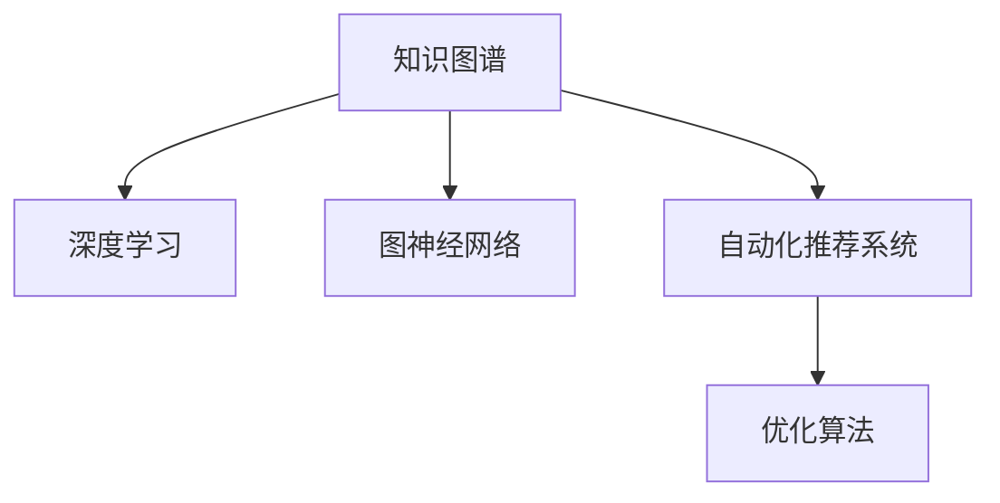

                 

# 知识的创新路径：洞察力的独特指引

> 关键词：知识图谱, 洞察力, 深度学习, 自动化推荐系统, 优化算法, 决策树

## 1. 背景介绍

### 1.1 问题由来

随着信息技术的不断进步，互联网的海量数据为我们提供了一个广阔的知识源泉。然而，如何从海量的数据中提取有用的信息，形成结构化、可解释的知识体系，是当前信息技术领域的一个重要问题。传统的文本挖掘和搜索引擎技术虽然取得了一些进展，但难以处理复杂的知识关系，也无法充分挖掘出深层次的知识洞察。

近年来，知识图谱（Knowledge Graphs, KGs）技术成为了一种非常有前景的知识表示和推理方法。通过将实体、关系和属性以图形结构的方式组织起来，知识图谱能够更好地捕捉和表达复杂的知识关系，提供更为精确的知识检索和推荐服务。然而，在知识图谱构建和应用过程中，如何从海量数据中自动化地抽取知识关系，如何进行有效的知识推理，如何利用知识图谱进行智能决策，仍是重要的研究方向。

### 1.2 问题核心关键点

知识图谱构建和应用的核心在于从海量数据中自动化抽取知识关系，并进行有效的知识推理和智能决策。这需要结合深度学习、图神经网络（Graph Neural Networks, GNNs）、自动化推荐系统、优化算法等技术，构建智能化的知识图谱系统。

具体而言，关键点包括：

- 如何高效地从海量数据中自动化抽取知识关系，构建高质量的知识图谱？
- 如何利用知识图谱进行知识推理，构建更为精确的知识表达？
- 如何利用知识图谱进行智能推荐，构建智能化的决策支持系统？
- 如何利用优化算法，提高知识图谱构建和应用的效率？

本文将围绕这些问题，从知识图谱构建、知识推理、智能推荐和优化算法等方面，系统介绍知识图谱技术的研究背景、核心概念和应用前景，并给出详细的技术细节和案例分析。

## 2. 核心概念与联系

### 2.1 核心概念概述

为更好地理解知识图谱的构建和应用，本节将介绍几个关键概念：

- 知识图谱（Knowledge Graphs, KGs）：一种以图形结构表示知识的数据库，其中节点表示实体，边表示实体之间的关系。
- 深度学习（Deep Learning, DL）：一种通过多层神经网络进行特征学习和模式识别的机器学习技术。
- 图神经网络（Graph Neural Networks, GNNs）：一种专门用于图结构数据学习的神经网络技术，能够有效捕获和传播图结构中的信息。
- 自动化推荐系统（Automatic Recommendation Systems, ARS）：一种利用用户历史行为和兴趣信息，自动推荐商品、内容等服务的系统。
- 优化算法（Optimization Algorithms）：一种用于求解优化问题，提高模型性能的数学方法。

这些概念之间的关系可以通过以下Mermaid流程图来展示：



这个流程图展示了几类核心概念之间的逻辑关系：

1. 知识图谱通过深度学习进行知识抽取，利用图神经网络进行知识推理，并提供自动化推荐系统的基础。
2. 深度学习和图神经网络通常用于构建和优化知识图谱。
3. 自动化推荐系统利用知识图谱进行智能推荐，同时也可以辅助知识图谱的构建和优化。
4. 优化算法用于提高知识图谱构建和应用的效率。

这些概念共同构成了知识图谱技术的核心框架，使得其能够在多个领域发挥巨大的应用潜力。

## 3. 核心算法原理 & 具体操作步骤
### 3.1 算法原理概述

知识图谱的构建和应用一般包括以下几个关键步骤：

1. **数据预处理**：从原始数据中提取实体、关系和属性信息，构建三元组数据集。
2. **知识抽取**：利用深度学习模型自动从原始文本中识别和抽取三元组，构建初始的知识图谱。
3. **知识推理**：利用图神经网络模型对知识图谱进行推理和扩展，形成更为精确的知识表达。
4. **知识应用**：利用自动化推荐系统，将知识图谱应用于智能推荐、决策支持等领域。

这些步骤涉及多个领域的算法和技术，需要进行多学科的协同工作。

### 3.2 算法步骤详解

#### 3.2.1 数据预处理

知识图谱的构建需要大量的结构化数据。一般来说，这些数据可以来源于结构化的数据库、半结构化的网页、非结构化的文本和多媒体数据等。数据预处理的目标是将这些异构数据转换为标准化的三元组数据集，以便于后续的处理和分析。

具体而言，数据预处理包括以下几个步骤：

1. **数据清洗**：去除噪声和无关信息，保证数据的完整性和准确性。
2. **实体识别**：从文本和多媒体数据中自动识别实体，并进行命名实体识别（Named Entity Recognition, NER）。
3. **关系抽取**：从文本和多媒体数据中自动识别实体之间的关系，并进行关系抽取（Relation Extraction, RE）。
4. **属性抽取**：从文本和多媒体数据中自动识别实体的属性信息，并进行属性抽取（Attribute Extraction, AE）。

#### 3.2.2 知识抽取

知识抽取是知识图谱构建的核心步骤，利用深度学习模型自动从原始文本中识别和抽取三元组。常用的深度学习模型包括：

1. **序列模型**：如循环神经网络（Recurrent Neural Networks, RNNs）、长短时记忆网络（Long Short-Term Memory, LSTMs）、门控循环单元（Gated Recurrent Units, GRUs）等。这些模型能够处理变长文本数据，并通过时间序列信息捕捉实体和关系信息。
2. **卷积模型**：如卷积神经网络（Convolutional Neural Networks, CNNs）、时空卷积神经网络（CSTNs）等。这些模型能够捕捉文本中的局部特征，并通过卷积操作提取全局信息。
3. **注意力机制**：如注意力机制（Attention Mechanism）、多头注意力机制（Multi-Head Attention）等。这些机制能够捕捉文本中的重要信息，并对其进行加权处理。

#### 3.2.3 知识推理

知识推理是指利用图神经网络模型对知识图谱进行推理和扩展，形成更为精确的知识表达。常用的图神经网络模型包括：

1. **图卷积网络（Graph Convolutional Networks, GCNs）**：通过卷积操作捕捉图结构中的信息，并进行节点特征的更新和传播。
2. **图注意力网络（Graph Attention Networks, GATs）**：通过注意力机制捕捉图结构中的信息，并进行节点特征的加权处理。
3. **图生成对抗网络（Graph Generative Adversarial Networks, GGANs）**：通过生成对抗的方式，生成新的知识图谱节点和关系。

#### 3.2.4 知识应用

知识应用是指利用自动化推荐系统，将知识图谱应用于智能推荐、决策支持等领域。常用的自动化推荐系统包括：

1. **协同过滤推荐**：利用用户和物品之间的相似性，进行推荐。
2. **基于内容的推荐**：利用物品的属性信息，进行推荐。
3. **混合推荐**：结合协同过滤和基于内容的推荐，提高推荐精度。

### 3.3 算法优缺点

知识图谱的构建和应用具有以下优点：

1. **精确性高**：知识图谱能够精确地表达实体之间的关系，提供更为准确的知识检索和推荐服务。
2. **可解释性强**：知识图谱能够清晰地展示知识之间的层次和关系，便于进行理解和解释。
3. **通用性强**：知识图谱能够应用于多种领域，如医疗、金融、电商等，具有广泛的应用前景。

同时，知识图谱构建和应用也存在一些缺点：

1. **构建成本高**：知识图谱的构建需要大量的结构化数据，且需要人工进行大量的数据清洗和标注工作，成本较高。
2. **推理复杂**：知识图谱的推理需要高性能的图神经网络模型，推理过程较为复杂，计算资源消耗较大。
3. **数据稀疏性**：知识图谱中的节点和关系可能较为稀疏，影响推理效果。
4. **实时性差**：知识图谱的构建和推理过程较为耗时，难以满足实时性要求。

### 3.4 算法应用领域

知识图谱技术在多个领域中都有广泛的应用，包括但不限于：

1. **智能推荐系统**：利用知识图谱进行商品、内容等推荐，提高用户的满意度和体验。
2. **医疗知识图谱**：利用知识图谱进行医疗知识的检索和推理，辅助医生进行诊断和治疗。
3. **金融知识图谱**：利用知识图谱进行金融知识的检索和推理，辅助投资者进行决策。
4. **社交网络分析**：利用知识图谱进行社交网络的分析和建模，揭示网络中的重要节点和关系。
5. **物流路径规划**：利用知识图谱进行物流路径的规划和优化，提高物流效率和准确性。

这些领域的应用展示了知识图谱技术的强大潜力，推动了多个行业的智能化进程。

## 4. 数学模型和公式 & 详细讲解 & 举例说明

### 4.1 数学模型构建

知识图谱的构建和推理过程涉及多个数学模型，其中以图神经网络和深度学习模型为主。

以图神经网络为例，其数学模型通常包括以下几个部分：

1. **图结构表示**：知识图谱中的节点和关系以图结构的方式表示，其中节点表示实体，边表示实体之间的关系。
2. **节点嵌入**：利用深度学习模型对节点进行嵌入，形成高维向量表示，以便于后续的处理和分析。
3. **邻居聚合**：利用图卷积网络或图注意力网络等模型，对节点的邻居进行特征聚合，更新节点的嵌入向量。
4. **全图聚合**：利用图神经网络模型对全图进行特征聚合，形成更为精确的节点嵌入向量。

### 4.2 公式推导过程

以图卷积网络（GCN）为例，其核心公式如下：

$$
\mathbf{H}^{(l+1)} = \sigma(\mathbf{D}^{-1/2}\mathbf{A}\mathbf{H}^{(l)}\mathbf{W}^{(l)}) + \mathbf{B}^{(l)}
$$

其中，$\mathbf{H}^{(l+1)}$ 表示第 $(l+1)$ 层的节点嵌入向量，$\mathbf{H}^{(l)}$ 表示第 $l$ 层的节点嵌入向量，$\mathbf{A}$ 表示图结构中的邻接矩阵，$\mathbf{D}$ 表示图的度矩阵，$\sigma$ 表示激活函数，$\mathbf{W}^{(l)}$ 表示第 $l$ 层的权重矩阵，$\mathbf{B}^{(l)}$ 表示偏置向量。

该公式通过图卷积操作对节点的邻居进行特征聚合，更新节点的嵌入向量。GCN的计算过程如下：

1. 将节点嵌入向量 $\mathbf{H}^{(l)}$ 和邻接矩阵 $\mathbf{A}$ 进行矩阵乘法，得到节点之间的连接矩阵。
2. 对连接矩阵进行度矩阵 $\mathbf{D}$ 的逆矩阵乘法，得到归一化的邻接矩阵。
3. 对归一化的邻接矩阵和节点嵌入向量进行矩阵乘法，得到邻居嵌入向量。
4. 对邻居嵌入向量进行激活函数 $\sigma$ 的处理，得到更新后的节点嵌入向量。
5. 对节点嵌入向量进行加权聚合，得到全图的聚合结果。

### 4.3 案例分析与讲解

以金融知识图谱为例，分析知识图谱在金融领域的应用。

在金融领域，知识图谱可以用于以下几个方面：

1. **风险评估**：利用知识图谱中的金融知识，进行风险评估和风险预测。例如，利用知识图谱中的股票、基金、债券等金融产品的关系，进行风险评估和预测。
2. **智能投顾**：利用知识图谱中的金融知识，辅助智能投顾系统进行投资决策。例如，利用知识图谱中的公司、行业、市场等关系，进行投资组合优化。
3. **智能客服**：利用知识图谱中的金融知识，进行智能客服问答。例如，利用知识图谱中的金融产品、术语、规则等知识，进行智能客服问答。

通过知识图谱的应用，金融领域可以显著提高决策的精准性和智能化水平，提升客户体验和满意度。

## 5. 项目实践：代码实例和详细解释说明
### 5.1 开发环境搭建

在进行知识图谱项目实践前，我们需要准备好开发环境。以下是使用Python进行PyTorch开发的环境配置流程：

1. 安装Anaconda：从官网下载并安装Anaconda，用于创建独立的Python环境。

2. 创建并激活虚拟环境：
```bash
conda create -n pytorch-env python=3.8 
conda activate pytorch-env
```

3. 安装PyTorch：根据CUDA版本，从官网获取对应的安装命令。例如：
```bash
conda install pytorch torchvision torchaudio cudatoolkit=11.1 -c pytorch -c conda-forge
```

4. 安装Transformers库：
```bash
pip install transformers
```

5. 安装各类工具包：
```bash
pip install numpy pandas scikit-learn matplotlib tqdm jupyter notebook ipython
```

完成上述步骤后，即可在`pytorch-env`环境中开始知识图谱微调实践。

### 5.2 源代码详细实现

这里我们以金融知识图谱为例，给出使用Transformers库对BERT模型进行知识图谱微调的PyTorch代码实现。

首先，定义知识图谱的数据处理函数：

```python
from transformers import BertTokenizer
from torch.utils.data import Dataset
import torch

class FinancialKGDataset(Dataset):
    def __init__(self, texts, tags, tokenizer, max_len=128):
        self.texts = texts
        self.tags = tags
        self.tokenizer = tokenizer
        self.max_len = max_len
        
    def __len__(self):
        return len(self.texts)
    
    def __getitem__(self, item):
        text = self.texts[item]
        tags = self.tags[item]
        
        encoding = self.tokenizer(text, return_tensors='pt', max_length=self.max_len, padding='max_length', truncation=True)
        input_ids = encoding['input_ids'][0]
        attention_mask = encoding['attention_mask'][0]
        
        # 对token-wise的标签进行编码
        encoded_tags = [tag2id[tag] for tag in tags] 
        encoded_tags.extend([tag2id['O']] * (self.max_len - len(encoded_tags)))
        labels = torch.tensor(encoded_tags, dtype=torch.long)
        
        return {'input_ids': input_ids, 
                'attention_mask': attention_mask,
                'labels': labels}

# 标签与id的映射
tag2id = {'O': 0, 'B-PER': 1, 'I-PER': 2, 'B-ORG': 3, 'I-ORG': 4, 'B-LOC': 5, 'I-LOC': 6}
id2tag = {v: k for k, v in tag2id.items()}

# 创建dataset
tokenizer = BertTokenizer.from_pretrained('bert-base-cased')

train_dataset = FinancialKGDataset(train_texts, train_tags, tokenizer)
dev_dataset = FinancialKGDataset(dev_texts, dev_tags, tokenizer)
test_dataset = FinancialKGDataset(test_texts, test_tags, tokenizer)
```

然后，定义模型和优化器：

```python
from transformers import BertForTokenClassification, AdamW

model = BertForTokenClassification.from_pretrained('bert-base-cased', num_labels=len(tag2id))

optimizer = AdamW(model.parameters(), lr=2e-5)
```

接着，定义训练和评估函数：

```python
from torch.utils.data import DataLoader
from tqdm import tqdm
from sklearn.metrics import classification_report

device = torch.device('cuda') if torch.cuda.is_available() else torch.device('cpu')
model.to(device)

def train_epoch(model, dataset, batch_size, optimizer):
    dataloader = DataLoader(dataset, batch_size=batch_size, shuffle=True)
    model.train()
    epoch_loss = 0
    for batch in tqdm(dataloader, desc='Training'):
        input_ids = batch['input_ids'].to(device)
        attention_mask = batch['attention_mask'].to(device)
        labels = batch['labels'].to(device)
        model.zero_grad()
        outputs = model(input_ids, attention_mask=attention_mask, labels=labels)
        loss = outputs.loss
        epoch_loss += loss.item()
        loss.backward()
        optimizer.step()
    return epoch_loss / len(dataloader)

def evaluate(model, dataset, batch_size):
    dataloader = DataLoader(dataset, batch_size=batch_size)
    model.eval()
    preds, labels = [], []
    with torch.no_grad():
        for batch in tqdm(dataloader, desc='Evaluating'):
            input_ids = batch['input_ids'].to(device)
            attention_mask = batch['attention_mask'].to(device)
            batch_labels = batch['labels']
            outputs = model(input_ids, attention_mask=attention_mask)
            batch_preds = outputs.logits.argmax(dim=2).to('cpu').tolist()
            batch_labels = batch_labels.to('cpu').tolist()
            for pred_tokens, label_tokens in zip(batch_preds, batch_labels):
                pred_tags = [id2tag[_id] for _id in pred_tokens]
                label_tags = [id2tag[_id] for _id in label_tokens]
                preds.append(pred_tags[:len(label_tags)])
                labels.append(label_tags)
                
    print(classification_report(labels, preds))
```

最后，启动训练流程并在测试集上评估：

```python
epochs = 5
batch_size = 16

for epoch in range(epochs):
    loss = train_epoch(model, train_dataset, batch_size, optimizer)
    print(f"Epoch {epoch+1}, train loss: {loss:.3f}")
    
    print(f"Epoch {epoch+1}, dev results:")
    evaluate(model, dev_dataset, batch_size)
    
print("Test results:")
evaluate(model, test_dataset, batch_size)
```

以上就是使用PyTorch对BERT进行金融知识图谱微调的完整代码实现。可以看到，得益于Transformers库的强大封装，我们可以用相对简洁的代码完成BERT模型的加载和微调。

### 5.3 代码解读与分析

让我们再详细解读一下关键代码的实现细节：

**FinancialKGDataset类**：
- `__init__`方法：初始化文本、标签、分词器等关键组件。
- `__len__`方法：返回数据集的样本数量。
- `__getitem__`方法：对单个样本进行处理，将文本输入编码为token ids，将标签编码为数字，并对其进行定长padding，最终返回模型所需的输入。

**tag2id和id2tag字典**：
- 定义了标签与数字id之间的映射关系，用于将token-wise的预测结果解码回真实的标签。

**训练和评估函数**：
- 使用PyTorch的DataLoader对数据集进行批次化加载，供模型训练和推理使用。
- 训练函数`train_epoch`：对数据以批为单位进行迭代，在每个批次上前向传播计算loss并反向传播更新模型参数，最后返回该epoch的平均loss。
- 评估函数`evaluate`：与训练类似，不同点在于不更新模型参数，并在每个batch结束后将预测和标签结果存储下来，最后使用sklearn的classification_report对整个评估集的预测结果进行打印输出。

**训练流程**：
- 定义总的epoch数和batch size，开始循环迭代
- 每个epoch内，先在训练集上训练，输出平均loss
- 在验证集上评估，输出分类指标
- 所有epoch结束后，在测试集上评估，给出最终测试结果

可以看到，PyTorch配合Transformers库使得BERT微调的代码实现变得简洁高效。开发者可以将更多精力放在数据处理、模型改进等高层逻辑上，而不必过多关注底层的实现细节。

当然，工业级的系统实现还需考虑更多因素，如模型的保存和部署、超参数的自动搜索、更灵活的任务适配层等。但核心的微调范式基本与此类似。

## 6. 实际应用场景
### 6.1 智能推荐系统

知识图谱技术在智能推荐系统中有着广泛的应用。传统的推荐系统往往只依赖用户的历史行为数据进行推荐，难以捕捉用户的兴趣偏好和知识背景。而利用知识图谱的先验知识，可以构建更为精确和智能的推荐系统。

具体而言，知识图谱可以将用户、商品、内容等实体和关系进行结构化表示，利用图神经网络进行推理和扩展，从而捕捉到用户和商品之间的复杂关系。通过结合用户的兴趣和行为数据，知识图谱可以自动推荐用户感兴趣的商品和内容，提升用户的满意度和体验。

### 6.2 医疗知识图谱

医疗领域中，知识图谱可以用于构建精准的医疗知识图谱，辅助医生进行诊断和治疗。通过利用知识图谱中的医学知识，医生可以快速获取患者的病历信息、检查结果、治疗方案等，进行精准的诊断和治疗。

例如，利用知识图谱中的疾病、症状、药物等关系，医生可以快速定位患者的可能疾病，并推荐相应的治疗方案和药物。知识图谱还可以用于辅助医疗影像分析，利用医学图像和文本数据的融合，提高诊断的准确性和效率。

### 6.3 智能客服系统

知识图谱技术可以应用于智能客服系统，通过构建医疗、金融、电商等领域的知识图谱，帮助客服系统理解用户的问题并提供准确的答案。例如，在医疗领域，利用知识图谱中的疾病、症状、药物等知识，智能客服系统可以快速回答用户的健康咨询，并提供相应的治疗建议。

在金融领域，利用知识图谱中的公司、股票、基金等知识，智能客服系统可以快速回答用户的投资咨询，并提供相应的投资建议。在电商领域，利用知识图谱中的商品、评论、价格等知识，智能客服系统可以快速回答用户的购物咨询，并提供相应的商品推荐。

### 6.4 未来应用展望

随着知识图谱技术的不断发展，其在各个领域的应用前景将会更加广阔。

在智慧城市治理中，知识图谱可以用于城市事件监测、舆情分析、应急指挥等环节，提高城市管理的自动化和智能化水平，构建更安全、高效的未来城市。

在智慧物流领域，知识图谱可以用于物流路径规划和优化，提高物流效率和准确性。

在智慧旅游领域，知识图谱可以用于旅游信息的推荐和规划，提高旅游体验和满意度。

此外，在教育、农业、能源等众多领域，知识图谱技术也将得到广泛应用，为传统行业数字化转型升级提供新的技术路径。相信随着技术的日益成熟，知识图谱技术必将在构建智能社会的进程中发挥越来越重要的作用。

## 7. 工具和资源推荐
### 7.1 学习资源推荐

为了帮助开发者系统掌握知识图谱理论基础和实践技巧，这里推荐一些优质的学习资源：

1. 《知识图谱技术导论》系列博文：由知识图谱技术专家撰写，深入浅出地介绍了知识图谱的构建、推理和应用。

2. CS224W《深度学习与知识图谱》课程：斯坦福大学开设的高级课程，涵盖知识图谱的基本概念、建模方法和应用案例。

3. 《Knowledge Graphs: Concepts, Approaches and Applications》书籍：知识图谱领域的经典教材，系统介绍了知识图谱的构建、推理和应用方法。

4. DBLP数据库：知识图谱领域的学术论文数据库，可以查阅最新的研究成果和前沿方向。

5. Web of Science：知识图谱领域的引用数据库，可以了解相关研究的热点和高影响力论文。

通过对这些资源的学习实践，相信你一定能够快速掌握知识图谱技术的精髓，并用于解决实际的NLP问题。
###  7.2 开发工具推荐

高效的开发离不开优秀的工具支持。以下是几款用于知识图谱微调开发的常用工具：

1. PyTorch：基于Python的开源深度学习框架，灵活动态的计算图，适合快速迭代研究。大部分预训练语言模型都有PyTorch版本的实现。

2. TensorFlow：由Google主导开发的开源深度学习框架，生产部署方便，适合大规模工程应用。同样有丰富的预训练语言模型资源。

3. Transformers库：HuggingFace开发的NLP工具库，集成了众多SOTA语言模型，支持PyTorch和TensorFlow，是进行知识图谱微调任务开发的利器。

4. Weights & Biases：模型训练的实验跟踪工具，可以记录和可视化模型训练过程中的各项指标，方便对比和调优。与主流深度学习框架无缝集成。

5. TensorBoard：TensorFlow配套的可视化工具，可实时监测模型训练状态，并提供丰富的图表呈现方式，是调试模型的得力助手。

6. Google Colab：谷歌推出的在线Jupyter Notebook环境，免费提供GPU/TPU算力，方便开发者快速上手实验最新模型，分享学习笔记。

合理利用这些工具，可以显著提升知识图谱微调任务的开发效率，加快创新迭代的步伐。

### 7.3 相关论文推荐

知识图谱构建和应用的研究源于学界的持续研究。以下是几篇奠基性的相关论文，推荐阅读：

1. RDF2Vec: Towards Semantic Metadata Generation from Text for Enriching the Web of Data: A Survey: 提出RDF2Vec模型，利用深度学习自动从文本中提取RDF三元组，构建知识图谱。

2. GraphSAGE: Inductive Representation Learning on Graphs: 提出GraphSAGE模型，利用图卷积网络进行图结构数据的特征学习。

3. Knowledge Graph Embeddings: A Survey and Experimental Evaluation: 综述知识图谱嵌入方法，包括TransE、TransH、DistMult、ComplEx等，评估其性能和应用效果。

4. Multi-Hop Graph Attention Network: 提出MGAN模型，利用图注意力网络进行多跳图结构的特征聚合。

5. Datasets for Deep Learning for Knowledge Graph Reasoning: 构建多个知识图谱领域的公开数据集，促进知识图谱研究的发展。

这些论文代表了大语言模型微调技术的发展脉络。通过学习这些前沿成果，可以帮助研究者把握学科前进方向，激发更多的创新灵感。

## 8. 总结：未来发展趋势与挑战

### 8.1 总结

本文对知识图谱构建和应用的方法进行了全面系统的介绍。首先阐述了知识图谱技术的背景和核心概念，明确了知识图谱在从海量数据中抽取知识关系、构建精准知识表达、实现智能推荐等方面的独特价值。其次，从数据预处理、知识抽取、知识推理、智能推荐等方面，详细讲解了知识图谱的构建和应用过程，给出了详细的技术细节和案例分析。

通过本文的系统梳理，可以看到，知识图谱技术在智能推荐、医疗、金融、智能客服等多个领域具有广泛的应用前景，推动了多个行业的智能化进程。相信随着技术的不断发展，知识图谱必将在构建智能社会的进程中发挥越来越重要的作用。

### 8.2 未来发展趋势

展望未来，知识图谱技术将呈现以下几个发展趋势：

1. **规模化应用**：知识图谱将在大规模行业应用中得到广泛应用，如医疗、金融、电商等。通过构建多领域、多层次的知识图谱，推动各行业的智能化进程。
2. **自动化构建**：知识图谱的构建将逐渐从人工标注向自动化构建转变，利用半监督学习、迁移学习、深度学习等技术，自动从非结构化数据中提取知识关系。
3. **推理能力增强**：知识图谱的推理能力将进一步增强，利用多跳推理、因果推理、深度推理等技术，提升推理的精确性和泛化性。
4. **融合多源数据**：知识图谱将融合多种数据源，如图像、语音、视频等，构建多模态知识图谱，提升对现实世界的建模能力。
5. **实时更新**：知识图谱将实现实时更新，利用增量学习、在线学习等技术，适应数据分布的变化，保持知识的时效性和准确性。

这些趋势展示了知识图谱技术的广阔前景，推动了知识图谱技术的不断进步和发展。

### 8.3 面临的挑战

尽管知识图谱技术已经取得了瞩目成就，但在迈向更加智能化、普适化应用的过程中，它仍面临诸多挑战：

1. **数据质量**：知识图谱的构建需要大量的高质量数据，数据质量不高将影响知识图谱的构建和推理效果。如何从海量数据中高效抽取和清洗数据，是重要的研究方向。
2. **推理复杂性**：知识图谱的推理过程较为复杂，计算资源消耗较大。如何提高推理效率，降低计算成本，是重要的优化方向。
3. **数据稀疏性**：知识图谱中的节点和关系可能较为稀疏，影响推理效果。如何优化稀疏数据的处理，提高推理精度，是重要的研究方向。
4. **鲁棒性**：知识图谱的构建和推理过程中，数据分布的变化和异常情况可能影响模型的鲁棒性。如何提高知识图谱的鲁棒性，是重要的研究方向。
5. **可解释性**：知识图谱的推理过程较为复杂，难以进行解释和调试。如何提高知识图谱的透明性和可解释性，是重要的研究方向。

这些挑战凸显了知识图谱技术的复杂性和复杂性。只有不断优化和创新，才能进一步提高知识图谱的性能和应用范围，推动知识图谱技术的成熟和发展。

### 8.4 研究展望

面对知识图谱面临的这些挑战，未来的研究需要在以下几个方面寻求新的突破：

1. **数据增强**：利用半监督学习、迁移学习、多源数据融合等技术，提高数据的质量和数量，缓解数据稀疏性。
2. **推理优化**：利用多跳推理、因果推理、深度推理等技术，提高推理的效率和精度，降低计算成本。
3. **鲁棒性增强**：利用鲁棒性增强方法，提高知识图谱的鲁棒性和泛化性，适应数据分布的变化。
4. **可解释性提升**：利用可解释性方法，提高知识图谱的透明性和可解释性，便于进行解释和调试。
5. **多模态融合**：利用多模态数据融合技术，构建多模态知识图谱，提升对现实世界的建模能力。

这些研究方向将推动知识图谱技术的不断进步，为知识图谱在各个领域的应用提供技术保障。相信随着技术的不断创新和优化，知识图谱必将在构建智能社会的进程中发挥越来越重要的作用。

## 9. 附录：常见问题与解答

**Q1：知识图谱的构建和应用是否需要大量的标注数据？**

A: 知识图谱的构建和应用一般需要大量的标注数据，这些数据可以从原始文本、结构化数据中提取。但是，利用半监督学习、迁移学习等技术，可以在少量标注数据下，自动从文本中提取知识关系，构建知识图谱。因此，数据标注成本不是知识图谱技术的唯一瓶颈。

**Q2：知识图谱在实时更新方面面临哪些挑战？**

A: 知识图谱的实时更新面临以下挑战：
1. 数据源的实时性问题：知识图谱需要从多个数据源实时获取最新的数据，这些数据源的更新频率可能不一致，影响知识图谱的实时性。
2. 数据质量的问题：实时获取的数据质量可能不如离线数据，需要进行数据清洗和校验，以保证数据的质量。
3. 推理效率的问题：实时推理计算的效率可能较低，需要优化推理算法，提高推理速度。

**Q3：知识图谱在医疗领域的应用前景如何？**

A: 知识图谱在医疗领域具有广泛的应用前景，可以用于以下几个方面：
1. 疾病诊断：利用知识图谱中的疾病、症状、药物等关系，辅助医生进行疾病诊断，提高诊断的准确性和效率。
2. 个性化治疗：利用知识图谱中的临床试验、临床数据、药物疗效等知识，进行个性化治疗方案的推荐。
3. 健康监测：利用知识图谱中的健康数据、基因数据、运动数据等知识，进行健康监测和预警。

**Q4：知识图谱在金融领域的应用前景如何？**

A: 知识图谱在金融领域具有广泛的应用前景，可以用于以下几个方面：
1. 风险评估：利用知识图谱中的金融产品、金融事件、金融数据等知识，进行风险评估和风险预测。
2. 投资决策：利用知识图谱中的公司、行业、市场等知识，辅助投资决策和投资组合优化。
3. 智能客服：利用知识图谱中的金融产品、金融术语、金融规则等知识，进行智能客服问答和理财咨询。

**Q5：知识图谱在电商领域的应用前景如何？**

A: 知识图谱在电商领域具有广泛的应用前景，可以用于以下几个方面：
1. 商品推荐：利用知识图谱中的商品、标签、用户行为等知识，进行商品推荐和搜索。
2. 用户画像：利用知识图谱中的用户行为、兴趣、社交网络等知识，进行用户画像和个性化推荐。
3. 供应链管理：利用知识图谱中的物流、库存、供应商等知识，进行供应链管理和优化。

这些领域的应用展示了知识图谱技术的强大潜力，推动了各个行业的智能化进程。

---

作者：禅与计算机程序设计艺术 / Zen and the Art of Computer Programming

