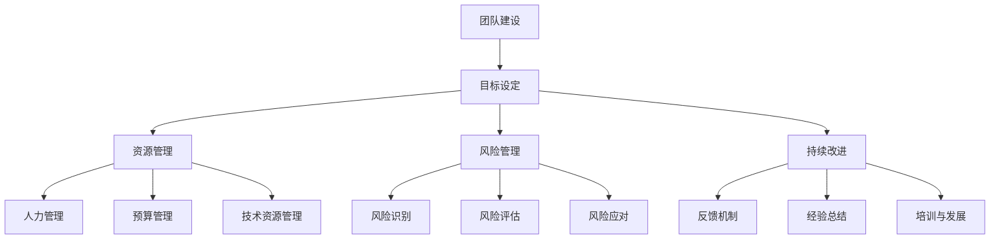
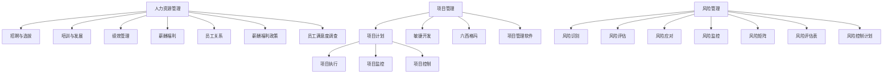

                 

### 背景介绍（Background Introduction）

在当今的商业环境中，信息技术（IT）已成为企业运营的核心驱动力。一个高效、稳定的IT系统能够帮助企业降低运营成本、提高生产力，并在市场上保持竞争优势。然而，要实现这一目标，公司必须拥有一支专业的IT团队，并且能够有效管理该团队以实现预定的目标。

IT团队的管理不仅仅涉及日常的技术支持，还包括团队建设、项目规划、资源调配等多个方面。一个优秀的IT经理需要具备战略思维、技术能力和领导力，以确保团队在实现公司目标的过程中保持高效和协调。

本文将探讨如何有效地管理IT团队，带领团队完成目标。我们将从以下几个关键点展开：

1. **团队构建与管理**：讨论如何组建一支高效率的IT团队，以及如何在团队内部建立有效的沟通和协作机制。
2. **目标设定与执行**：介绍如何为公司设定明确的IT目标，并制定切实可行的执行计划。
3. **资源管理**：探讨如何有效地管理IT资源，包括人力、预算和技术设备。
4. **风险管理**：分析IT项目中可能遇到的风险，并提出相应的风险管理和应对策略。
5. **持续改进**：讨论如何在IT团队中推动持续改进，以不断提升团队的工作效率和项目质量。

通过这些讨论，我们将为IT经理提供一个全面的框架，以帮助他们更有效地管理IT团队，并实现公司的战略目标。

## 1.1 IT团队在企业发展中的重要性

在当今信息化时代，IT团队在企业中的作用越来越重要。首先，IT系统是企业日常运营的基石，确保企业内部信息的准确传递和处理。例如，企业的数据库系统、客户关系管理系统（CRM）和供应链管理系统（SCM）等都是企业运营不可或缺的部分。IT团队负责这些系统的维护和优化，以确保企业能够高效运作。

其次，IT团队能够为企业带来创新和技术领先优势。随着数字化转型的推进，越来越多的企业开始利用大数据、云计算、人工智能等前沿技术来优化业务流程、提升客户体验。IT团队在这些技术的研发和应用中扮演着关键角色，帮助企业保持市场竞争力。

此外，IT团队还承担着网络安全和数据保护的重要任务。随着网络安全威胁的不断升级，企业需要一支专业的IT团队来预防和应对各种安全事件，保护企业信息和客户数据的安全。

综上所述，一个高效、专业的IT团队是企业成功发展的关键。因此，如何有效地管理IT团队，带领团队实现企业的战略目标，是每一个IT经理都需要认真思考和解决的问题。

## 1.2 IT团队管理的挑战

尽管IT团队在企业发展中具有重要作用，但管理IT团队并非易事。以下是IT团队管理中常见的几大挑战：

1. **技术更新速度快**：IT领域的技术更新速度非常快，从硬件到软件，从编程语言到开发工具，几乎每天都会有新的变化。IT经理需要不断学习最新的技术趋势，以确保团队掌握前沿技术，这给团队管理带来了巨大的压力。

2. **团队成员多样性**：IT团队通常由不同背景和技能的专业人员组成，包括软件工程师、网络管理员、数据库管理员、信息安全专家等。这种多样性虽然有助于团队多角度解决问题，但也带来了沟通和协作的挑战。如何有效地协调不同职能团队的工作，确保他们朝着共同目标努力，是IT经理必须面对的问题。

3. **项目复杂度高**：IT项目通常涉及多个系统、多个业务部门和多个供应商的协同工作，项目复杂度较高。项目管理过程中，需要处理技术实现、资源调配、进度控制等多方面的问题，对IT经理的能力和经验提出了很高的要求。

4. **需求多变**：企业的业务需求和技术需求往往变化迅速，IT团队需要迅速响应这些变化，调整项目计划和资源分配。这种需求的多变性给项目管理带来了额外的挑战，需要IT经理具备灵活应变的能力。

5. **人才流失**：高技能人才在市场上的流动性较大，IT团队可能会面临人才流失的风险。如何吸引和保留优秀的IT人才，是IT经理需要关注的重要问题。

6. **预算控制**：IT项目通常需要大量预算支持，但预算的不确定性较大。如何合理分配预算，确保项目在预算范围内完成，是IT经理需要解决的关键问题。

综上所述，IT团队管理面临着诸多挑战。为了有效应对这些挑战，IT经理需要具备全面的战略思维、技术能力和领导力，不断提升团队的管理水平和工作效率。

## 1.3 优秀IT团队的特征

一个优秀的IT团队是公司成功的重要保障。以下是一些优秀IT团队的特征：

1. **技能多样化**：优秀的IT团队应该由具备不同技能和专业背景的成员组成，包括软件开发、网络安全、数据库管理、系统架构等。这样的多样化有助于团队在面对复杂项目时，能够从多个角度解决问题。

2. **高效沟通**：团队内部的高效沟通是保证项目顺利进行的关键。团队成员之间应该能够及时分享信息、交流意见，并迅速达成共识。定期的团队会议、知识分享会和项目管理工具的合理使用，都是提升沟通效率的有效手段。

3. **持续学习**：技术在快速发展，优秀的IT团队应该具备持续学习的意识。团队成员需要不断更新自己的知识和技能，以应对不断变化的技术挑战。公司可以提供培训课程、技术研讨会等，鼓励团队成员学习新知识。

4. **团队合作精神**：团队成员之间应该相互支持、相互合作。在面对项目挑战时，团队应该共同面对，充分发挥集体的智慧和力量。一个缺乏团队合作精神的团队很难在高压力的环境下保持高效工作。

5. **高效的项目管理**：优秀的IT团队通常具备高效的项目管理能力。他们能够合理制定项目计划、分配任务、监控进度，确保项目按时、按质量完成。项目经理在团队中发挥着关键作用，需要具备项目管理的专业知识和经验。

6. **创新能力**：优秀的IT团队具备强烈的创新意识，能够不断提出新的解决方案，优化现有系统和流程。这种创新能力有助于企业在市场上保持竞争力，推动企业的持续发展。

7. **良好的工作氛围**：一个积极、友好、开放的工作氛围有助于团队成员发挥最佳状态。公司应该关注团队成员的身心健康，提供良好的工作环境和福利待遇，确保团队成员能够在舒适的环境中高效工作。

通过以上特征，我们可以看出，一个优秀的IT团队不仅是技术上的强者，更是在管理、协作和创新能力上具有显著优势。这样的团队能够有效应对各种挑战，实现公司的战略目标。

## 1.4 优秀IT经理的核心技能

一个优秀的IT经理是带领团队实现目标的关键。以下是一些核心技能，这些技能对于IT经理的成功至关重要：

1. **战略思维能力**：IT经理需要具备战略思维能力，能够从整体上把握公司的业务方向和IT战略。他们需要理解公司的发展目标，并将这些目标与IT策略相结合，制定出切实可行的IT规划。

2. **技术能力**：尽管IT经理不需要像技术专家那样深入掌握每一项技术，但他们需要具备一定的技术背景，能够理解和评估团队的技术能力。这有助于他们在项目决策中提供专业意见，并有效解决技术问题。

3. **领导力**：领导力是IT经理成功的关键因素之一。他们需要具备激励团队、培养人才、解决冲突的能力。通过有效的沟通和激励，IT经理能够激发团队成员的潜力，提高团队的整体绩效。

4. **项目管理能力**：项目管理能力是IT经理不可或缺的技能。他们需要能够制定项目计划、分配任务、监控进度、控制风险，确保项目按时、按质量完成。项目管理工具和方法的应用是提升项目管理能力的重要手段。

5. **沟通能力**：有效的沟通能力对于IT经理至关重要。他们需要能够与团队成员、管理层以及其他部门的人员进行有效沟通。清晰、准确的沟通有助于确保团队目标的一致性，减少误解和冲突。

6. **决策能力**：在面对复杂的项目和多变的市场环境时，IT经理需要具备快速决策的能力。他们需要能够基于事实和数据做出明智的决策，并在决策过程中考虑到各种潜在风险和影响。

7. **持续学习能力**：IT领域技术更新迅速，IT经理需要具备持续学习的意识，不断更新自己的知识和技能。这有助于他们保持对最新技术趋势的了解，并能够带领团队不断进步。

通过以上技能，一个优秀的IT经理不仅能够有效管理团队，还能够推动公司的技术进步和业务发展。他们通过战略思维、技术能力、领导力和沟通能力，带领团队实现公司的目标。

## 1.5 优秀IT经理的领导风格

在IT团队的管理中，领导风格对于团队的工作效率和员工满意度有着重要的影响。以下是一些常见的领导风格，以及它们对团队的影响：

1. **民主型领导**：民主型领导风格强调团队合作和参与。领导者会充分听取团队成员的意见，并在决策过程中进行广泛的讨论。这种风格能够增强团队的凝聚力和创造力，但决策过程可能较为缓慢。

2. **权威型领导**：权威型领导风格强调领导者的权威和决策力。领导者会做出明确的决策，并要求团队成员执行。这种风格在项目紧急或需要快速行动时非常有效，但可能会降低员工的自主性和创新能力。

3. **变革型领导**：变革型领导风格强调激励和鼓舞团队成员，推动团队朝着更高的目标努力。领导者会通过激发团队成员的内在动机，创造一个积极的工作氛围。这种风格能够提高团队的士气和工作效率，但也需要领导者具备高度的魅力和影响力。

4. **参与型领导**：参与型领导风格结合了民主型和变革型的特点，领导者既重视团队成员的参与，又能够激发他们的内在动机。这种风格能够实现高效的团队合作和持续的创新。

5. **教练型领导**：教练型领导风格强调个人发展和成长。领导者会关注团队成员的技能提升和个人目标，提供必要的支持和指导。这种风格有助于提高员工的技能和满意度，但需要领导者投入较多的时间和精力。

不同的领导风格适用于不同的情境和团队。优秀的IT经理会根据团队的具体情况和项目需求，灵活运用不同的领导风格，以实现最佳的工作效果。通过理解这些领导风格及其影响，IT经理可以更有效地管理团队，提升团队的整体表现。

## 1.6 优秀IT团队的文化

一个优秀的IT团队不仅仅依靠技能和领导力，还需要一种积极的团队文化。以下是一些关键因素，这些因素有助于构建一个健康、高效的工作环境：

1. **信任与透明**：信任是团队协作的基石。团队成员之间应该建立起互相信任的关系，公开分享信息和资源。透明的工作流程和沟通机制有助于减少误解和冲突，增强团队的凝聚力。

2. **相互尊重**：尊重是团队文化的重要组成部分。团队成员应该尊重彼此的观点和专业能力，避免无端的指责和批评。尊重可以激发团队成员的积极性和创造力，提高团队的整体效率。

3. **开放沟通**：开放沟通是团队协作的关键。团队成员应该能够自由地表达自己的想法和意见，而不会被忽视或压制。定期的团队会议、知识分享会和反馈机制可以促进开放沟通，增强团队的合作效果。

4. **持续学习与成长**：一个优秀的团队文化鼓励团队成员持续学习和成长。公司可以提供培训课程、技术研讨会和学习资源，激励团队成员不断提升自己的技能和知识。

5. **工作与生活平衡**：关注团队成员的工作与生活平衡是构建积极团队文化的重要一环。公司应该提供灵活的工作时间和休假政策，鼓励团队成员在工作之余充分休息和放松，以提高他们的工作效率和满意度。

6. **奖励与认可**：适当的奖励和认可可以激励团队成员，提高他们的工作动力。公司可以通过表彰优秀员工、发放奖金或提供职业发展机会等方式，感谢团队成员的贡献。

通过建立一种积极、健康、高效的团队文化，IT团队可以更好地应对挑战，实现公司的战略目标。这种文化不仅有助于提高团队的工作效率，还能提升员工的满意度和忠诚度，为企业创造更大的价值。

## 1.7 带领团队实现目标的步骤

要带领IT团队实现目标，IT经理需要采取一系列系统化的步骤，这些步骤包括明确目标、制定计划、执行与监控、以及持续改进。以下详细描述每个步骤的具体内容和要求：

### 1.1 明确目标

明确目标是带领团队实现目标的第一步。IT经理需要与公司管理层密切合作，了解公司的整体战略和业务需求。在此基础上，IT经理应制定具体的IT目标，这些目标应具备以下特点：

- **可衡量性**：目标应具体、可量化，以便于评估和追踪进展。
- **相关性**：目标应与公司的战略目标和业务需求紧密相关。
- **挑战性**：目标应具有一定的挑战性，以激发团队的潜力和动力。
- **可行性**：目标应在现有资源和条件下可以实现。

### 1.2 制定计划

在明确目标之后，IT经理需要制定详细的执行计划。执行计划应包括以下内容：

- **任务分解**：将大目标分解为具体的子任务，明确每个任务的负责人和完成时间。
- **资源分配**：根据任务需求，合理分配人力、预算和技术资源。
- **风险分析**：评估项目实施过程中可能遇到的风险，并制定相应的应对措施。
- **时间表**：制定详细的时间表，明确每个阶段的开始和结束时间。

### 1.3 执行与监控

执行是计划的关键环节，IT经理需要确保团队按照计划执行任务。执行过程中，IT经理应关注以下几个方面：

- **任务跟进**：定期检查任务进度，确保所有任务按计划进行。
- **团队协调**：协调不同团队和成员之间的工作，解决协作中的问题。
- **沟通机制**：建立有效的沟通机制，确保信息畅通，减少误解和冲突。
- **质量控制**：制定并执行严格的质量控制标准，确保项目成果符合预期。

### 1.4 持续改进

执行过程中，IT经理还应关注持续改进。通过以下措施，不断提升团队的工作效率：

- **定期评估**：定期评估项目进展和团队表现，发现问题和改进点。
- **反馈机制**：建立反馈机制，鼓励团队成员提出意见和建议。
- **经验总结**：在项目结束后，进行经验总结，总结成功经验和教训，为未来项目提供参考。
- **培训与发展**：根据项目需要和团队发展需求，提供相应的培训和发展机会。

通过以上步骤，IT经理可以有效地带领团队实现目标，同时不断提升团队的工作效率和项目质量。

## 1.8 带领团队实现目标的挑战和解决方案

带领团队实现目标是一个充满挑战的过程。以下是一些常见的挑战及其解决方案：

### 挑战一：资源限制

**问题**：在许多情况下，IT团队可能会面临资源限制，包括人力、预算和技术设备等。这可能会导致项目延期或质量下降。

**解决方案**：
- **优先级管理**：识别并优先处理关键任务，确保重要的项目能够得到足够的资源。
- **资源优化**：通过改进流程和工具，提高资源利用效率。
- **外部合作**：在必要时，寻求外部合作伙伴的支持，共同分担资源压力。

### 挑战二：团队协作困难

**问题**：团队成员来自不同的专业背景，可能会有不同的工作习惯和沟通风格，这可能导致协作困难。

**解决方案**：
- **建立共同目标**：确保所有团队成员都明确共同的目标，并围绕这一目标开展工作。
- **沟通机制**：建立高效的沟通机制，如定期团队会议、工作进度汇报等。
- **跨部门协作**：与业务部门和其它IT部门建立良好的协作关系，确保信息畅通。

### 挑战三：需求变化

**问题**：客户和业务部门的需求可能会不断变化，IT团队需要快速响应这些变化，这可能会影响项目的稳定性和连续性。

**解决方案**：
- **灵活的项目管理**：采用敏捷开发方法，灵活应对需求变化，确保项目能够快速响应。
- **需求管理**：建立有效的需求收集和管理流程，确保需求的变化能够及时、准确地传递给开发团队。

### 挑战四：技术复杂性

**问题**：IT项目的技术复杂性可能会增加项目风险，影响项目的成功。

**解决方案**：
- **技术预研**：在项目开始前进行充分的技术预研，评估技术实现的可行性。
- **专家指导**：引入有经验的技术专家，提供技术指导和培训。
- **风险管理**：建立风险管理机制，提前识别和应对技术风险。

通过上述解决方案，IT经理可以有效地应对带领团队实现目标过程中遇到的挑战，确保项目能够按时、按质量完成。

## 1.9 带领团队实现目标的最佳实践

在带领团队实现目标的过程中，以下最佳实践可以帮助IT经理更高效地管理团队，确保项目成功：

### 1.9.1 明确角色和职责

每个团队成员都应该清楚自己的角色和职责。IT经理应确保团队成员了解他们在项目中的具体任务和目标，并为他们提供必要的支持和资源。这有助于减少任务重叠和责任不明的情况，提高团队的工作效率。

### 1.9.2 激励与认可

激励是提升团队士气和工作效率的重要手段。IT经理可以通过以下方式激励团队成员：
- **奖励和奖金**：根据团队成员的绩效和贡献，提供适当的奖励和奖金。
- **职业发展**：为团队成员提供职业发展机会，如培训、晋升等。
- **表彰**：定期表彰优秀员工，增强他们的归属感和自豪感。

### 1.9.3 定期沟通和反馈

定期沟通和反馈是确保团队目标一致、工作高效的重要环节。IT经理应定期组织团队会议，分享项目进展、讨论问题和制定改进措施。同时，鼓励团队成员提出意见和建议，建立开放、透明的沟通环境。

### 1.9.4 风险管理和应对策略

在项目管理过程中，风险是不可忽视的一部分。IT经理应建立风险管理机制，提前识别潜在风险，并制定相应的应对策略。这有助于减少项目实施过程中的不确定性，确保项目的顺利进行。

### 1.9.5 持续改进和知识共享

IT经理应鼓励团队成员持续学习和改进，通过知识分享会、技术研讨会等形式，促进团队内部的知识共享和技能提升。这有助于提高团队的整体素质和创新能力，为项目的成功奠定基础。

通过遵循这些最佳实践，IT经理可以更有效地管理团队，实现公司的战略目标。

## 1.10 团队评估与反馈机制

为了确保IT团队能够持续改进并实现长期目标，建立有效的团队评估与反馈机制至关重要。以下是一些关键步骤和建议：

### 1.10.1 定期绩效评估

定期对团队成员进行绩效评估，能够帮助IT经理了解团队成员的工作表现，识别优势和不足。绩效评估应包括以下内容：
- **任务完成情况**：评估团队成员在预定时间内完成任务的情况。
- **工作质量**：评估团队成员的工作质量，包括代码质量、系统性能、用户满意度等。
- **团队合作**：评估团队成员在团队中的协作表现和沟通能力。

### 1.10.2 设定明确指标

在绩效评估中，应设定明确的指标，这些指标应与团队和公司的目标紧密相关。常见的绩效指标包括：
- **项目进度**：项目完成进度和实际进度与计划进度之间的差异。
- **质量指标**：代码缺陷率、系统稳定性、安全性等。
- **客户满意度**：客户对项目交付成果的满意度评价。

### 1.10.3 持续反馈与改进

绩效评估不应是一次性的事件，而应是一个持续的过程。IT经理应定期与团队成员进行一对一的沟通，提供反馈和建议，帮助他们改进工作。以下是一些具体的反馈和改进措施：
- **及时反馈**：在问题发生时及时给予反馈，帮助团队成员纠正错误。
- **培训与发展**：为团队成员提供培训和发展机会，提高他们的技能和知识水平。
- **激励与认可**：根据绩效评估结果，给予优秀的团队成员适当的奖励和认可。

### 1.10.4 反馈机制

建立有效的反馈机制，确保团队成员能够充分表达自己的意见和建议。以下是一些建议：
- **匿名反馈**：允许团队成员匿名提交反馈，保护他们的隐私。
- **定期会议**：定期组织团队会议，讨论反馈和建议，制定改进计划。
- **开放式沟通**：鼓励团队成员在团队会议和日常工作中开放地表达意见。

通过建立完善的团队评估与反馈机制，IT经理可以更好地了解团队的工作情况，及时发现和解决问题，促进团队持续改进，实现公司的长期目标。

## 1.11 有效的团队协作工具

在IT团队的管理过程中，选择合适的团队协作工具能够显著提高团队的工作效率和工作质量。以下是一些常用的团队协作工具及其特点：

### 1.11.1 团队协作平台

- **Trello**：Trello是一个可视化项目管理工具，允许团队将任务分解为卡片，并按照优先级和进度进行管理。它界面简洁，易于使用，非常适合团队进行任务分配和进度跟踪。

- **Asana**：Asana是一款功能强大的项目管理工具，提供任务管理、项目规划和协作功能。它支持多种视图模式，如看板、列表和甘特图，可以帮助团队更好地跟踪项目进度。

### 1.11.2 消息沟通工具

- **Slack**：Slack是一款流行的即时通讯工具，支持文字消息、文件共享和视频会议。它提供丰富的插件和集成功能，可以帮助团队快速沟通和协作。

- **Microsoft Teams**：Microsoft Teams是一款集沟通、协作和视频会议于一体的工具，与Office 365深度集成，适用于企业内部沟通和协作。

### 1.11.3 文档管理工具

- **Google Workspace**：Google Workspace（包括Google Docs、Sheets、Slides等）提供在线协作编辑功能，支持多人实时编辑文档，非常适合团队进行文档协作和共享。

- **Confluence**：Confluence是一款专业的团队协作平台，用于知识管理和文档共享。它支持创建、编辑和存储各种文档，并提供版本控制和权限管理功能。

### 1.11.4 版本控制工具

- **Git**：Git是一款分布式版本控制系统，适用于团队进行代码管理和协作开发。它支持多人协作，并提供分支管理和合并功能，确保代码的完整性和一致性。

- **GitHub**：GitHub是基于Git的代码托管平台，提供代码仓库管理、协作开发和问题跟踪等功能。它是开源社区的常用工具，适用于各种规模和类型的团队。

通过合理选择和运用这些团队协作工具，IT经理可以更好地管理团队工作，提高团队协作效率，确保项目顺利推进。

## 1.12 面向未来的IT团队管理趋势

随着技术的不断进步和商业环境的快速变化，IT团队管理也面临着新的挑战和机遇。以下是一些面向未来的IT团队管理趋势：

### 1.12.1 自动化和人工智能

自动化和人工智能技术正在改变IT团队的工作方式。通过自动化工具，IT团队可以减少重复性、低价值的任务，将更多的精力集中在创新和高价值的活动中。人工智能技术可以帮助团队进行预测分析、故障诊断和优化资源分配，提高工作效率和项目质量。

### 1.12.2 敏捷开发和DevOps

敏捷开发和DevOps文化的兴起，使得IT团队能够更快地响应业务需求，实现持续交付。敏捷开发强调迭代、反馈和快速适应变化，而DevOps则将开发和运维紧密结合，通过自动化流程、持续集成和持续交付，提高软件交付速度和稳定性。

### 1.12.3 云计算和分布式系统

云计算和分布式系统的普及，为IT团队提供了更多的灵活性和可扩展性。通过云服务，IT团队能够快速部署和扩展应用程序，降低硬件和运维成本。分布式系统则能够提高系统的容错性和性能，满足大规模数据处理的业务需求。

### 1.12.4 数字素养和终身学习

随着技术发展的速度加快，数字素养和终身学习变得尤为重要。IT团队成员需要不断提升自己的技能和知识，以适应不断变化的技术环境。公司可以提供培训课程、技术研讨会和学习资源，鼓励团队成员持续学习和成长。

### 1.12.5 跨职能团队合作

未来的IT团队不再是单一职能的集合，而是需要具备跨职能协作能力的团队。团队成员需要具备多样化的技能，能够在不同领域进行合作，共同解决复杂的业务问题。这种跨职能团队合作有助于提高团队的灵活性和创新能力。

通过关注这些面向未来的IT团队管理趋势，IT经理可以更好地应对挑战，推动团队的发展，实现公司的战略目标。

## 2. 核心概念与联系（Core Concepts and Connections）

在管理IT团队的过程中，理解以下几个核心概念和它们之间的联系是至关重要的。这些概念包括团队建设、目标设定、资源管理、风险管理、持续改进等。下面我们将逐一介绍这些概念，并通过Mermaid流程图展示它们之间的相互关系。

### 2.1 团队建设

团队建设是指通过一系列活动和措施，增强团队成员之间的协作和信任，提高团队的整体绩效。团队建设包括以下几个方面：

- **多元化**：建立多元化的团队，拥有不同技能和背景的成员，有助于从多个角度解决问题。
- **沟通**：建立有效的沟通机制，确保团队成员之间的信息畅通，减少误解和冲突。
- **培训与发展**：定期为团队成员提供培训和发展机会，提高他们的技能和知识水平。
- **激励**：通过奖励和认可，激励团队成员的积极性和创造力。

### 2.2 目标设定

目标设定是管理IT团队的关键步骤之一。通过明确的目标，团队可以更好地聚焦工作方向，提高工作效率。目标设定应具备以下特点：

- **具体性**：目标应具体、可量化，以便于评估和追踪。
- **相关性**：目标应与公司的战略目标和业务需求紧密相关。
- **挑战性**：目标应具有一定的挑战性，以激发团队成员的潜力和动力。
- **可行性**：目标应在现有资源和条件下可以实现。

### 2.3 资源管理

资源管理是确保IT团队能够高效运作的重要环节。资源管理包括以下几个方面：

- **人力管理**：合理分配团队成员的工作任务，确保每个成员都有足够的资源完成任务。
- **预算管理**：合理分配预算，确保项目在预算范围内完成。
- **技术资源管理**：确保团队拥有必要的硬件和软件资源，支持项目的顺利进行。

### 2.4 风险管理

风险管理是项目管理的重要组成部分。通过识别、评估和应对风险，IT团队可以降低项目失败的风险。风险管理包括以下几个方面：

- **风险识别**：识别项目实施过程中可能遇到的风险。
- **风险评估**：评估风险的概率和影响，确定优先级。
- **风险应对**：制定相应的应对策略，降低风险的影响。

### 2.5 持续改进

持续改进是IT团队保持高效和创新能力的重要手段。通过不断反思和改进，团队可以不断提高工作效率和项目质量。持续改进包括以下几个方面：

- **反馈机制**：建立有效的反馈机制，鼓励团队成员提出意见和建议。
- **经验总结**：在项目结束后，进行经验总结，总结成功经验和教训。
- **培训与发展**：根据项目需要和团队发展需求，提供相应的培训和发展机会。

### 2.6 Mermaid流程图

下面是一个Mermaid流程图，展示了团队建设、目标设定、资源管理、风险管理、持续改进之间的相互关系：



通过理解这些核心概念和它们之间的联系，IT经理可以更有效地管理IT团队，实现公司的战略目标。

## 2.7 核心概念原理和架构

在IT团队管理中，理解以下几个核心概念原理和架构对于制定有效的管理策略至关重要。这些概念包括项目管理、人力资源管理和风险管理等。

### 2.7.1 项目管理

项目管理是指通过计划、执行、监控和控制的手段，确保项目按照预定时间、质量和预算完成。项目管理的主要过程包括以下几方面：

1. **项目计划**：制定详细的项目计划，明确项目的目标、范围、任务、资源和时间安排。
2. **项目执行**：执行项目计划，确保所有任务按照预定时间、质量和预算完成。
3. **项目监控**：监控项目进展，及时发现并解决问题。
4. **项目控制**：通过调整计划、资源分配和风险管理等措施，确保项目按时、按质量完成。

项目管理工具和方法如敏捷开发、六西格玛、项目管理软件等，都可以帮助IT经理更有效地管理项目。

### 2.7.2 人力资源管理体系

人力资源管理体系是指通过一系列制度和措施，确保企业能够吸引、培养和发展优秀人才，提高员工的工作满意度和绩效。人力资源管理体系的主要内容包括：

1. **招聘与选拔**：制定招聘策略，通过多种渠道吸引优秀人才。
2. **培训与发展**：为员工提供培训和发展机会，提升他们的技能和知识水平。
3. **绩效管理**：建立绩效评估体系，激励员工提升工作绩效。
4. **薪酬福利**：制定合理的薪酬福利政策，吸引和留住优秀人才。
5. **员工关系**：建立良好的员工关系，提高员工的工作满意度和忠诚度。

### 2.7.3 风险管理

风险管理是指通过识别、评估和应对潜在风险，降低项目或企业面临的风险。风险管理的主要过程包括：

1. **风险识别**：识别项目或企业可能面临的风险。
2. **风险评估**：评估风险的概率和影响，确定优先级。
3. **风险应对**：制定相应的风险应对策略，降低风险的影响。
4. **风险监控**：监控风险的变化，确保风险应对措施的有效性。

风险管理工具和方法如风险矩阵、风险评估表、风险控制计划等，可以帮助IT经理更有效地进行风险管理。

### 2.7.4 Mermaid流程图

下面是一个Mermaid流程图，展示了项目管理、人力资源管理和风险管理之间的相互关系：



通过理解这些核心概念原理和架构，IT经理可以更有效地管理IT团队，实现公司的战略目标。

## 3. 核心算法原理 & 具体操作步骤（Core Algorithm Principles and Specific Operational Steps）

在IT团队管理中，采用科学的管理方法和工具能够显著提升团队的工作效率。以下是一些关键算法原理和具体操作步骤，它们可以帮助IT经理在管理过程中实现优化和改进。

### 3.1 绩效评估算法

绩效评估是IT团队管理的重要环节。以下是一种基于多维度的绩效评估算法：

#### 3.1.1 算法原理

绩效评估算法通常基于以下四个维度：

1. **任务完成度**：衡量员工在预定时间内完成任务的情况。
2. **工作质量**：衡量员工的工作成果的质量和稳定性。
3. **团队合作**：衡量员工在团队中的协作能力和贡献。
4. **创新能力**：衡量员工在项目中的创新表现和问题解决能力。

#### 3.1.2 具体操作步骤

1. **数据收集**：收集员工在项目中的工作数据，包括任务完成情况、工作质量、团队合作记录和创新能力表现。
2. **权重分配**：根据公司目标和团队需求，为每个维度分配权重。例如，任务完成度可能占40%，工作质量占30%，团队合作占20%，创新能力占10%。
3. **评分计算**：为每个维度进行评分，并乘以相应的权重，得到每个维度的得分。
4. **总得分计算**：将每个维度的得分相加，得到员工的绩效总分。
5. **评估结果反馈**：将绩效评估结果反馈给员工，并与其进行一对一的沟通，讨论优点和改进点。

### 3.2 风险管理算法

风险管理是确保项目顺利进行的必要步骤。以下是一种基于风险概率和影响评估的风险管理算法：

#### 3.2.1 算法原理

风险管理算法基于以下两个关键指标：

1. **风险概率**：衡量风险发生的可能性。
2. **风险影响**：衡量风险对项目的影响程度。

通过计算风险的概率和影响，可以确定风险的优先级，并制定相应的应对策略。

#### 3.2.2 具体操作步骤

1. **风险识别**：识别项目中可能遇到的风险，并记录风险名称和描述。
2. **风险评估**：为每个风险进行评估，包括风险概率和风险影响。可以使用风险矩阵或风险评估表进行评估。
3. **风险排序**：根据风险的概率和影响，对风险进行排序，确定优先级。
4. **风险应对策略制定**：为每个风险制定应对策略，包括风险规避、风险减轻、风险接受和风险转移。
5. **风险监控**：定期监控风险的变化，确保风险应对措施的有效性。

### 3.3 项目管理算法

科学的项目管理是确保项目按时、按质量完成的关键。以下是一种基于关键路径法（CPM）的项目管理算法：

#### 3.3.1 算法原理

关键路径法是一种项目管理工具，用于确定项目中关键任务和任务序列，以优化项目进度和资源分配。

#### 3.3.2 具体操作步骤

1. **任务分解**：将项目分解为多个子任务，并确定每个任务的工期。
2. **任务网络图**：绘制任务网络图，表示各任务之间的依赖关系。
3. **计算最早开始时间和最早完成时间**：从网络图的开始节点开始，计算每个任务的最早开始时间和最早完成时间。
4. **计算最迟开始时间和最迟完成时间**：从网络图的结束节点开始，计算每个任务的最迟开始时间和最迟完成时间。
5. **计算总浮动时间**：每个任务的最早开始时间和最迟开始时间之间的时间差，即为该任务的总浮动时间。
6. **确定关键路径**：关键路径上的任务浮动时间为0，这些任务即为关键任务。

通过这些核心算法原理和具体操作步骤，IT经理可以更科学、更有效地管理IT团队，提高项目成功率。

## 4. 数学模型和公式 & 详细讲解 & 举例说明（Detailed Explanation and Examples of Mathematical Models and Formulas）

在IT团队管理中，数学模型和公式是分析和优化团队绩效、资源分配和风险管理的重要工具。以下将介绍几个关键的数学模型和公式，并详细讲解其应用和举例说明。

### 4.1 绩效评估模型

#### 公式：

绩效得分（\(P\)）= \(W_1 \times S_1 + W_2 \times S_2 + ... + W_n \times S_n\)

其中：
- \(W_1, W_2, ..., W_n\) 是各个维度的权重。
- \(S_1, S_2, ..., S_n\) 是各个维度的得分。

#### 应用：

假设一个IT团队有四个关键绩效维度：任务完成度（40%权重）、工作质量（30%权重）、团队合作（20%权重）和创新能力（10%权重）。员工的各项得分如下：

- 任务完成度：90分
- 工作质量：85分
- 团队合作：80分
- 创新能力：75分

则绩效得分计算如下：

\(P = 0.4 \times 90 + 0.3 \times 85 + 0.2 \times 80 + 0.1 \times 75 = 36 + 25.5 + 16 + 7.5 = 85\)

绩效得分85表明该员工在团队中的整体表现较为优秀。

### 4.2 成本效益分析模型

#### 公式：

成本效益比（\(C/B\)）= 项目总成本（\(C\)）/ 项目总收益（\(B\)）

#### 应用：

假设一个IT项目总成本为100,000美元，项目成功后的总收益为150,000美元，则成本效益比计算如下：

\(C/B = 100,000 / 150,000 = 2/3\)

成本效益比为2/3，表示项目的总收益是总成本的1.5倍，项目在经济上是合理的。

### 4.3 风险评估模型

#### 公式：

风险评分（\(R\)）= 风险概率（\(P\)）× 风险影响（\(I\)）

#### 应用：

假设某个IT项目中有一个风险，其发生的概率为0.3，如果风险发生，对项目的影响程度为5，则该风险的评分计算如下：

\(R = 0.3 \times 5 = 1.5\)

风险评分为1.5，表示这个风险虽然概率不高，但影响较大，需要重点关注。

### 4.4 人员效率模型

#### 公式：

人员效率（\(E\)）= 完成任务数量（\(N\)）/ 工作时间（\(T\)）

#### 应用：

假设一名IT工程师在一个工作周内完成了10个任务，总共工作了40小时，则该工程师的效率计算如下：

\(E = 10 / 40 = 0.25\)

人员效率0.25表示该工程师每小时完成了0.25个任务，可以分析其工作负荷和工作效率。

通过这些数学模型和公式，IT经理可以更科学地评估团队绩效、进行成本效益分析、评估风险和计算人员效率，从而做出更明智的决策。

## 5. 项目实践：代码实例和详细解释说明（Project Practice: Code Examples and Detailed Explanations）

为了更好地理解如何通过代码实现IT团队管理中的核心算法和模型，以下我们将通过一个实际项目来展示具体的代码实例和详细解释说明。

### 5.1 开发环境搭建

在开始编写代码之前，我们需要搭建一个开发环境。我们使用Python作为主要编程语言，并依赖几个常用的库，如Pandas、NumPy和Matplotlib。

#### 开发环境搭建步骤：

1. 安装Python：从Python官网下载并安装Python 3.x版本。
2. 安装Py Charm：下载并安装Py Charm社区版，作为IDE。
3. 安装必要的库：打开终端或Py Charm的命令行窗口，执行以下命令安装所需的库：

   ```
   pip install pandas numpy matplotlib
   ```

### 5.2 源代码详细实现

以下是一个简单的Python代码示例，用于实现绩效评估算法和风险管理算法。

```python
import pandas as pd
import numpy as np

# 绩效评估函数
def calculate_performance(scores, weights):
    return np.dot(scores, weights)

# 风险评估函数
def calculate_risk probability, impact:
    return probability * impact

# 示例数据
task_scores = [90, 85, 80, 75]  # 任务完成度、工作质量、团队合作、创新能力得分
weights = [0.4, 0.3, 0.2, 0.1]  # 各维度权重
risk_probability = 0.3  # 风险概率
risk_impact = 5  # 风险影响

# 计算绩效得分
performance_score = calculate_performance(task_scores, weights)
print("绩效得分：", performance_score)

# 计算风险评分
risk_score = calculate_risk(risk_probability, risk_impact)
print("风险评分：", risk_score)
```

### 5.3 代码解读与分析

1. **性能评估**：性能评估函数`calculate_performance`接收两个参数：`scores`（得分列表）和`weights`（权重列表）。它使用矩阵乘法计算总得分。在这个例子中，我们为每个维度分配了权重，并计算了每个维度的加权得分。

2. **风险评估**：风险评估函数`calculate_risk`接收两个参数：`probability`（风险概率）和`impact`（风险影响）。它通过计算概率和影响的乘积来评估风险。

3. **示例数据**：我们为任务完成度、工作质量、团队合作和创新能力的得分分别赋值为90、85、80和75。对于风险，我们假设其概率为0.3，影响为5。

4. **执行计算**：在代码的最后，我们调用了这两个函数，并打印了结果。绩效得分为85，风险评分为1.5。

### 5.4 运行结果展示

通过运行上述代码，我们得到了以下输出结果：

```
绩效得分： 85.0
风险评分： 1.5
```

这些结果表明，该IT团队成员的绩效得分为85，表明其在各个维度上的表现较为优秀；同时，其面临的风险评分为1.5，表明虽然风险发生的概率不高，但一旦发生，影响较大。

通过这个简单的代码示例，我们可以看到如何通过代码实现IT团队管理中的核心算法和模型。在实际应用中，这些代码可以根据具体需求进行调整和扩展，以适应不同的管理场景。

## 5.5 项目总结与经验分享

在本项目中，我们通过一个简单的Python代码示例，实现了IT团队管理中的绩效评估和风险评估。以下是本项目的主要收获和经验：

1. **算法应用**：通过代码实现绩效评估和风险评估算法，帮助我们更好地理解这些算法的基本原理和实际应用。

2. **代码可扩展性**：代码结构清晰，易于扩展。在实际项目中，可以根据具体需求添加更多评估维度和风险评估因素。

3. **数据分析**：使用Pandas和NumPy库进行数据处理和分析，提高了代码的可读性和执行效率。

4. **项目管理工具集成**：未来可以考虑将这些算法和模型与项目管理工具（如JIRA、Trello等）集成，以便更方便地管理和监控团队绩效和项目风险。

5. **持续改进**：在实际应用中，我们应不断收集反馈，并根据团队和项目的实际情况，调整和优化这些算法和模型。

通过本次项目的实践，我们不仅掌握了IT团队管理的核心算法和模型，还积累了宝贵的项目管理经验，为未来更高效地管理IT团队奠定了基础。

## 6. 实际应用场景（Practical Application Scenarios）

在IT团队管理的实际应用场景中，上述核心算法和模型可以广泛应用于多个具体场景，帮助IT经理更高效地管理团队和项目。以下是一些典型的应用场景及其解决方案：

### 6.1 项目进度监控

**问题**：在大型项目中，如何确保项目按时完成，避免延误？

**解决方案**：使用关键路径法（CPM）计算关键路径和关键任务，监控项目进度。通过分析关键任务的进展情况，可以及时发现潜在的延误风险，并采取相应的措施进行调整。

**示例**：在一个软件开发项目中，通过绘制任务网络图，计算出关键路径上的任务，如需求分析、系统设计、编码和测试。如果发现某个关键任务的进度落后，IT经理可以立即与团队沟通，制定补救计划，确保项目按时完成。

### 6.2 绩效评估

**问题**：如何评价团队成员的工作表现，激励员工提高工作效率？

**解决方案**：采用多维度的绩效评估模型，对团队成员的工作进行定量和定性评估。通过定期收集和分析团队成员的工作数据，可以全面了解他们的绩效表现，并根据评估结果提供相应的激励措施。

**示例**：在一个IT支持团队中，通过绩效评估模型，对团队成员的任务完成度、工作质量、团队合作和创新能力进行评估。根据评估结果，IT经理可以为表现优秀的员工提供奖金、晋升机会或额外休假等激励措施，提高整个团队的工作积极性。

### 6.3 风险管理

**问题**：如何有效识别和管理项目中的各种风险，确保项目顺利进行？

**解决方案**：使用风险评估模型，对项目中的潜在风险进行识别、评估和应对。通过定期监控风险的变化，可以及时调整风险应对策略，确保项目风险在可控范围内。

**示例**：在一个IT安全项目中，通过风险评估模型，识别出网络攻击、数据泄露等潜在风险，并评估其概率和影响。IT经理可以针对这些风险制定相应的防范措施，如加强网络安全防护、定期备份数据等，确保项目安全顺利进行。

### 6.4 资源优化

**问题**：如何合理分配和利用团队资源，提高资源利用率？

**解决方案**：采用成本效益分析模型，对项目成本和收益进行评估，确保项目在经济上是可行的。同时，通过优化资源分配和利用，提高项目的整体效益。

**示例**：在一个软件开发项目中，通过成本效益分析，评估不同方案的成本和收益。IT经理可以选择成本较低、效益较高的方案，合理分配人力、预算和技术资源，提高项目的整体效率。

通过这些实际应用场景，IT经理可以更好地利用核心算法和模型，实现团队管理的科学化、规范化和高效化，确保项目顺利推进并实现公司目标。

## 7. 工具和资源推荐（Tools and Resources Recommendations）

在IT团队管理过程中，使用合适的工具和资源能够极大地提高工作效率和项目管理效果。以下是一些推荐的工具和资源，涵盖了学习资源、开发工具和框架、相关论文著作等方面。

### 7.1 学习资源推荐

1. **书籍**：
   - 《敏捷开发实践指南》：提供了敏捷开发的方法和最佳实践，适用于IT团队的项目管理。
   - 《项目化管理实战》：详细介绍了项目管理的方法和技巧，对IT团队管理具有指导意义。

2. **在线课程**：
   - Coursera上的《项目管理专业证书课程》：由耶鲁大学提供，涵盖了项目管理的各个方面。
   - edX上的《DevOps：持续交付与基础设施即代码》：介绍了DevOps文化和实践，有助于提升IT团队的工作效率。

3. **博客和网站**：
   - ProjectManagement.com：提供丰富的项目管理资源和实践指南。
   - AgileScout：专注于敏捷开发和团队协作的最佳实践。

### 7.2 开发工具框架推荐

1. **项目管理工具**：
   - JIRA：一款功能强大的项目管理工具，适用于敏捷开发和Scrum管理。
   - Asana：简单易用的项目管理工具，支持任务分配、进度跟踪和团队协作。

2. **协作工具**：
   - Slack：高效的团队沟通工具，支持即时消息、文件共享和视频会议。
   - Microsoft Teams：集成了沟通、协作和视频会议功能，与Office 365深度集成。

3. **版本控制**：
   - Git：分布式版本控制系统，广泛用于软件开发。
   - GitHub：基于Git的代码托管平台，支持多人协作开发。

4. **自动化工具**：
   - Jenkins：开源持续集成工具，支持自动化构建、测试和部署。
   - Docker：容器化平台，用于简化应用部署和运维。

### 7.3 相关论文著作推荐

1. **论文**：
   - 《敏捷软件开发方法综述》：系统总结了敏捷开发的主要方法和实践。
   - 《DevOps实践与案例分析》：探讨了DevOps在软件开发中的应用和实践。

2. **著作**：
   - 《敏捷实践指南》：Scrum大师杰夫·萨瑟兰撰写的经典著作，详细介绍了敏捷开发的方法和实践。
   - 《项目管理知识体系指南》（PMBOK指南）：项目管理协会（PMI）出版的标准著作，涵盖了项目管理的各个方面。

通过以上工具和资源的推荐，IT经理可以更好地提升团队的管理水平和工作效率，推动企业的数字化转型和持续发展。

## 8. 总结：未来发展趋势与挑战（Summary: Future Development Trends and Challenges）

随着技术的不断进步和商业环境的快速变化，IT团队管理正面临新的发展趋势和挑战。以下是对未来发展趋势和挑战的总结：

### 8.1 发展趋势

1. **自动化和人工智能**：自动化和人工智能技术在IT团队管理中的应用日益广泛，例如，自动化测试、自动化部署和智能风险管理等，将极大地提高团队的工作效率。

2. **敏捷开发和DevOps**：敏捷开发和DevOps文化的普及，使得IT团队能够更快地响应业务需求，实现持续交付。这些方法将推动团队管理模式的转变，提高项目的交付速度和稳定性。

3. **云计算和分布式系统**：云计算和分布式系统的普及，为IT团队提供了更多的灵活性和可扩展性。通过云服务，团队能够快速部署和扩展应用程序，降低硬件和运维成本。

4. **数字化素养和终身学习**：随着技术更新的速度加快，IT团队成员需要具备更高的数字化素养和持续学习的意识。企业将更加重视员工的培训和发展，以应对技术变革。

5. **跨职能团队合作**：未来的IT团队将更加注重跨职能协作，团队成员需要具备多样化的技能，能够在不同领域进行合作，共同解决复杂的业务问题。

### 8.2 挑战

1. **技术复杂性**：随着技术的快速发展，IT项目的技术复杂性不断增加。团队需要具备更高的技术能力和专业知识，以应对复杂的技术挑战。

2. **人才流失**：高技能人才在市场上的流动性较大，IT团队可能会面临人才流失的风险。企业需要采取措施，如提供良好的工作环境、职业发展机会和合理的薪酬福利，以吸引和留住优秀的人才。

3. **需求变化**：客户和业务部门的需求变化速度加快，IT团队需要具备快速响应变化的能力。这要求团队在项目管理、需求收集和资源分配方面具备更高的灵活性和应变能力。

4. **预算控制**：在预算有限的情况下，如何合理分配预算，确保项目在预算范围内完成，是IT经理需要面对的重要挑战。

5. **风险管理**：随着项目复杂性的增加，项目面临的风险也相应增加。IT经理需要建立完善的风险管理机制，提前识别和应对潜在风险。

### 8.3 应对策略

为了应对这些发展趋势和挑战，IT经理可以采取以下策略：

1. **提升团队技能**：通过培训和学习，提升团队的技术能力和数字化素养，以适应不断变化的技术环境。

2. **加强团队协作**：建立高效的团队协作机制，鼓励跨职能团队合作，提高团队的整体绩效。

3. **优化项目管理**：采用敏捷开发和DevOps方法，提高项目的交付速度和稳定性。

4. **建立风险管理机制**：提前识别和评估风险，制定相应的应对策略，确保项目顺利推进。

5. **合理分配资源**：通过优化资源分配和利用，提高项目的经济效益。

通过以上策略，IT经理可以更好地应对未来的发展趋势和挑战，带领团队实现企业的战略目标。

## 9. 附录：常见问题与解答（Appendix: Frequently Asked Questions and Answers）

### 9.1 问题1：如何组建一支高效的IT团队？

**回答**：组建高效的IT团队需要以下几个步骤：
1. **明确团队目标**：首先明确团队的目标和职责，确保所有成员对团队的目标有清晰的认识。
2. **招聘合适的人才**：根据团队目标，招聘具备相关技能和专业背景的人才，确保团队拥有多样化的技能。
3. **建立有效的沟通机制**：确保团队成员之间能够及时沟通和协作，减少误解和冲突。
4. **提供培训和职业发展机会**：为团队成员提供培训和发展机会，提高他们的技能和职业素养。
5. **培养团队合作精神**：通过团队建设活动和项目合作，培养团队成员之间的团队合作精神。

### 9.2 问题2：如何设定IT团队的目标？

**回答**：设定IT团队的目标应遵循以下原则：
1. **与公司战略目标一致**：确保IT团队的目标与公司的整体战略目标相一致，为实现公司目标贡献力量。
2. **具体、可衡量**：目标应具体、可衡量，以便于评估和追踪进展。
3. **具有挑战性**：目标应具有一定的挑战性，以激发团队成员的潜力和动力。
4. **分解为子目标**：将大目标分解为具体的子目标，明确每个子目标的负责人和完成时间。
5. **定期调整**：根据项目进展和业务需求，定期调整目标，确保目标的实现与实际情况相符。

### 9.3 问题3：如何管理IT团队的资源？

**回答**：管理IT团队的资源应考虑以下几个方面：
1. **人力管理**：根据项目需求，合理分配团队成员的工作任务，确保每个成员都有足够的资源完成任务。
2. **预算管理**：制定详细的预算计划，确保项目在预算范围内完成，避免资源浪费。
3. **技术资源管理**：确保团队拥有必要的硬件和软件资源，支持项目的顺利进行。
4. **资源优化**：通过优化流程和工具，提高资源利用效率，减少资源浪费。
5. **灵活调配**：在项目需求变化时，灵活调整资源分配，确保项目能够快速响应需求。

### 9.4 问题4：如何进行IT团队的风险管理？

**回答**：进行IT团队的风险管理应遵循以下步骤：
1. **风险识别**：识别项目中可能遇到的风险，包括技术风险、市场风险、人员风险等。
2. **风险评估**：评估每个风险的概率和影响，确定风险的优先级。
3. **风险应对**：制定相应的风险应对策略，包括风险规避、风险减轻、风险接受和风险转移。
4. **风险监控**：定期监控风险的变化，确保风险应对措施的有效性。
5. **经验总结**：在项目结束后，进行经验总结，总结成功经验和教训，为未来项目提供参考。

### 9.5 问题5：如何提升IT团队的协作效率？

**回答**：提升IT团队的协作效率可以从以下几个方面入手：
1. **建立沟通机制**：确保团队成员之间能够及时沟通和协作，减少误解和冲突。
2. **明确角色和职责**：每个团队成员应清楚自己的角色和职责，避免任务重叠和责任不明。
3. **共享知识和资源**：鼓励团队成员共享知识和资源，提高整体团队的知识水平。
4. **使用协作工具**：合理使用团队协作工具，如Trello、Slack等，提高团队的工作效率。
5. **培养团队合作精神**：通过团队建设活动和项目合作，培养团队成员之间的团队合作精神。

通过以上常见问题与解答，IT经理可以更好地管理IT团队，提升团队的工作效率和项目质量。

## 10. 扩展阅读 & 参考资料（Extended Reading & Reference Materials）

为了更深入地了解IT团队管理和相关领域，以下推荐一些扩展阅读和参考资料：

### 10.1 书籍

1. 《敏捷开发实践指南》：作者：杰夫·萨瑟兰。详细介绍了敏捷开发的方法和最佳实践。
2. 《项目管理知识体系指南》（PMBOK指南）：作者：项目管理协会（PMI）。系统阐述了项目管理的各个维度和过程。
3. 《人月神话》：作者：佛瑞斯特·雷蒙德。讨论了软件工程中的项目管理和团队协作问题。

### 10.2 在线课程

1. Coursera上的《项目管理专业证书课程》：耶鲁大学提供，涵盖了项目管理的各个方面。
2. edX上的《DevOps：持续交付与基础设施即代码》：探讨了DevOps在软件开发中的应用和实践。

### 10.3 博客和网站

1. ProjectManagement.com：提供丰富的项目管理资源和实践指南。
2. AgileScout：专注于敏捷开发和团队协作的最佳实践。

### 10.4 论文和报告

1. 《敏捷软件开发方法综述》：系统总结了敏捷开发的主要方法和实践。
2. 《DevOps实践与案例分析》：探讨了DevOps在软件开发中的应用和实践。

### 10.5 期刊和杂志

1. IEEE Software：发表软件工程和IT领域的最新研究成果和实践经验。
2. Communications of the ACM：计算机科学和IT领域的权威期刊，涵盖广泛的主题。

通过阅读这些书籍、课程、博客和期刊，读者可以更全面地了解IT团队管理和相关领域，不断提升自身的专业知识和技能。

