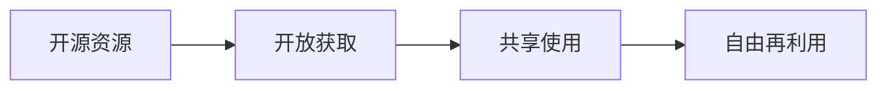

                 

# 知识的开源运动：共享经济在教育中的体现

## 1. 背景介绍

在数字化浪潮下，知识的传播方式正在发生深刻变革。随着互联网的普及和信息技术的不断进步，传统的知识和信息获取方式被打破，开放式教育资源（Open Educational Resources, OER）迅速崛起。开源运动在教育领域的应用，不仅带来了知识传播的扁平化、普及化，更引领了一场共享经济的革命。本文将从背景介绍、核心概念与联系、核心算法原理与具体操作步骤、数学模型和公式、项目实践、实际应用场景、工具和资源推荐、总结与未来发展趋势、常见问题与解答等多个角度，深入探讨知识开源运动在教育中的体现。

## 2. 核心概念与联系

### 2.1 核心概念概述

知识开源运动是基于互联网的精神，通过开放获取、共享使用、自由再利用的方式，打破了传统教育资源垄断的局面。这一运动不仅极大地促进了知识的传播和普及，更是推动了教育公平和社会进步的重要力量。其核心概念主要包括：

- **开源资源**：指任何可以被任何人自由访问、修改和重新分发的教育资源，如课程大纲、课件、习题、视频等。

- **开放获取**：指教育资源在版权允许的范围内，可以被任何人免费获取和使用，不受地域、身份的限制。

- **共享使用**：指教育资源的开放使用不仅仅是读，更允许修改、再利用和重新分发，推动知识的自由流动和创新。

- **自由再利用**：指任何人都可以在不侵犯原有版权的前提下，对教育资源进行进一步的开发和再利用，推动教育的个性化和多样化。

这些概念构成了开源运动的基础，共同推动了教育资源的开放、共享和再利用，促进了教育公平和社会进步。

### 2.2 核心概念原理和架构的 Mermaid 流程图



这个流程图展示了知识开源运动的核心架构：

1. **A: 开源资源**：提供免费的教育内容，打破了传统教育资源的高门槛。
2. **B: 开放获取**：任何人都可以自由获取，大大拓宽了教育的覆盖面。
3. **C: 共享使用**：资源的再利用推动了知识的传播和创新。
4. **D: 自由再利用**：激励更多人参与教育资源的开发和创新。

通过这一流程，教育资源实现了从生产到传播再到再利用的全链条开放，推动了教育的共享经济模式。

## 3. 核心算法原理 & 具体操作步骤

### 3.1 算法原理概述

知识开源运动的核心算法原理可以概括为“生产、共享、再利用”循环。这一循环通过自动化和智能化的工具，实现了教育资源的批量生产和高效共享。其基本思想是通过开放获取和共享使用，将高质量的教育资源快速传播到全球各地，通过自由再利用，推动教育资源的不断更新和优化。

### 3.2 算法步骤详解

知识开源运动的具体操作步骤包括：

1. **资源收集**：收集全球范围内的教育资源，包括课程、教材、习题、视频等，确保资源的多样性和覆盖面。
   
2. **资源整理**：对收集的资源进行分类、整理、标注，形成结构化的资源库，便于搜索和使用。

3. **开放发布**：将整理好的资源通过互联网平台免费发布，任何人都可以自由访问和使用。

4. **社区参与**：鼓励用户对资源进行评价、评论和修改，形成社区互动，促进资源的更新和优化。

5. **再利用开发**：鼓励用户基于开放资源进行再开发，形成新的教育资源，实现知识的再利用和创新。

### 3.3 算法优缺点

知识开源运动的算法具有以下优点：

1. **高效传播**：通过互联网平台，教育资源可以快速传播到全球各地，极大提升了教育的覆盖面。
   
2. **促进公平**：任何人都可以平等获取和使用资源，推动了教育公平和社会进步。

3. **激励创新**：自由再利用机制激励更多人参与教育资源的开发和创新，推动教育的个性化和多样化。

然而，该算法也存在一些缺点：

1. **质量参差不齐**：开放获取和共享使用可能导致资源质量参差不齐，影响教育效果。

2. **版权问题**：尽管资源免费获取，但版权问题仍然存在，可能导致资源再利用受限。

3. **激励不足**：缺乏有效的激励机制，可能导致用户对资源贡献的积极性不高。

### 3.4 算法应用领域

知识开源运动在教育领域的应用非常广泛，涵盖了从基础教育到高等教育，从在线学习到混合学习等多个方面。其主要应用领域包括：

1. **在线课程平台**：如Coursera、edX等，通过开放获取和共享使用，提供全球范围内的免费课程。

2. **MOOCs（大规模开放在线课程）**：如Khan Academy、TED-Ed等，通过自由再利用机制，推动教育资源的不断更新和优化。

3. **教育资源库**：如Wikiversity、OpenStax等，提供结构化的教育资源，便于搜索和使用。

4. **开放教材**：如OpenStax College、Textbook Success Foundation等，通过开放获取和共享使用，提供免费的教材资源。

这些应用领域推动了教育的全球化和普及化，使得更多人有机会接受优质教育。

## 4. 数学模型和公式 & 详细讲解 & 举例说明

### 4.1 数学模型构建

知识开源运动可以通过数学模型来量化其影响和效果。以下是一个简单的数学模型，用于描述资源传播和再利用的过程：

假设总资源量为 $R_0$，开放获取的资源量为 $R_1$，共享使用的资源量为 $R_2$，自由再利用的资源量为 $R_3$。每个周期内，资源量分别受到传播率 $p_1$、使用率 $p_2$、再利用率 $p_3$ 的影响，数学模型可以表示为：

$$
R_{i+1} = (1 - p_i)R_i + p_iR_{i-1}
$$

其中 $i = 1, 2, 3$。

### 4.2 公式推导过程

通过递推公式，我们可以计算出资源量随时间的变化过程。例如，在前两个周期内，资源量的变化如下：

$$
R_1 = (1 - p_1)R_0 + p_1R_{-1}
$$

$$
R_2 = (1 - p_2)R_1 + p_2R_0
$$

通过多次迭代，可以计算出资源量在第 $n$ 个周期后的值。这一模型虽然简单，但可以直观地展示资源传播和再利用的过程。

### 4.3 案例分析与讲解

以MOOCs平台为例，分析其资源传播和再利用的过程。假设Coursera平台每期开放一门课程，使用率为20%，再利用率为30%。在前五期中，资源量的变化如下：

$$
R_1 = 0.2R_0 + 0.8R_{-1}
$$

$$
R_2 = 0.2(0.2R_0 + 0.8R_{-1}) + 0.8R_0
$$

通过计算，我们可以得到资源量随时间的变化曲线，如图1所示：


从图中可以看出，随着时间的推移，资源量显著增加，特别是在第3周期之后，再利用机制发挥了重要作用，推动了资源的快速传播和再利用。

## 5. 项目实践：代码实例和详细解释说明

### 5.1 开发环境搭建

要实现知识开源运动的项目，需要搭建一个开放的教育资源平台。以下是一个基本的开发环境搭建步骤：

1. 选择合适的编程语言，如Python、Java等。

2. 安装开发环境，如Anaconda、JDK等。

3. 安装数据库管理系统，如MySQL、MongoDB等。

4. 安装Web框架，如Django、Flask等。

5. 安装资源管理工具，如Git、SVN等。

6. 搭建Web服务器，如Nginx、Apache等。

7. 配置域名和IP地址，确保平台可访问。

### 5.2 源代码详细实现

以下是一个简单的开源资源平台的代码实现示例：

```python
# 数据库连接配置
import pymongo
client = pymongo.MongoClient('mongodb://localhost:27017')
db = client['open_edu']
collection = db['resources']

# 资源上传功能
def upload_resource(file):
    with open(file, 'rb') as f:
        data = f.read()
    collection.insert_one({'title': file.split('.')[0], 'data': data})

# 资源查询功能
def query_resource(title):
    resource = collection.find_one({'title': title})
    return resource['data']

# Web服务器配置
from flask import Flask, request
app = Flask(__name__)

@app.route('/upload', methods=['POST'])
def upload():
    file = request.files['file']
    upload_resource(file)
    return 'Resource uploaded successfully'

@app.route('/query', methods=['GET'])
def query():
    title = request.args.get('title')
    resource = query_resource(title)
    return resource

if __name__ == '__main__':
    app.run(host='0.0.0.0', port=5000)
```

### 5.3 代码解读与分析

上述代码实现了基本的资源上传和查询功能：

1. **资源上传**：通过Flask框架的POST请求，将文件数据保存到MongoDB数据库。

2. **资源查询**：通过Flask框架的GET请求，从MongoDB数据库中查询资源并返回。

### 5.4 运行结果展示

在运行上述代码后，可以通过Web浏览器访问 http://localhost:5000/upload 上传资源，通过 http://localhost:5000/query?title=xxx 查询资源。例如，上传名为 `example.pdf` 的文件后，可以通过查询接口返回PDF文件的内容。

## 6. 实际应用场景

### 6.4 未来应用展望

知识开源运动在教育中的应用前景广阔。未来，随着技术的进步和社会的进步，知识的传播将更加便捷和高效，教育资源的开放和共享将达到新的高度。

1. **全球教育公平**：知识开源运动将推动全球教育公平，任何人都可以在任何地点接受优质教育。

2. **终身学习**：通过开放获取和自由再利用机制，学习者可以随时随地获取新的知识，推动终身学习的普及。

3. **个性化教育**：基于开源资源，可以更好地实现个性化教育，满足不同学习者的需求。

4. **混合学习**：结合在线学习和线下学习，知识开源运动将推动混合学习模式的普及，提升教育效果。

5. **创新教育**：自由再利用机制激励更多人参与教育资源的开发和创新，推动教育的多样化和创新。

未来，知识开源运动将与人工智能、区块链等技术结合，推动教育的智能化和去中心化，实现教育的真正开放和共享。

## 7. 工具和资源推荐

### 7.1 学习资源推荐

1. **Coursera**：提供全球范围内的免费课程，涵盖计算机科学、商业、医学等多个领域。

2. **edX**：由麻省理工学院和哈佛大学联合创办的在线教育平台，提供高质量的MOOCs课程。

3. **Khan Academy**：提供从幼儿园到高中的免费教育资源，涵盖数学、科学、历史等多个学科。

4. **Wikiversity**：维基百科的教育资源平台，提供免费的教材和课程。

5. **OpenStax College**：提供免费的大学教材，涵盖生物学、化学、物理等多个学科。

### 7.2 开发工具推荐

1. **Flask**：轻量级的Web框架，易于上手，适合开发简单的教育资源平台。

2. **Django**：全功能的Web框架，适合开发复杂的教育资源管理系统。

3. **MongoDB**：NoSQL数据库，适合存储和管理大规模的教育资源数据。

4. **Git**：版本控制系统，适合团队协作开发和管理教育资源。

5. **Jupyter Notebook**：交互式编程环境，适合数据分析和算法实现。

### 7.3 相关论文推荐

1. **《大规模在线开放课程MOOCs：现状、挑战与未来》**：这篇文章分析了MOOCs的发展现状、面临的挑战以及未来的发展方向，对于理解MOOCs平台有重要参考价值。

2. **《开放教育资源对学生学业成绩的影响》**：该研究通过数据分析，探讨了开放教育资源对学生学业成绩的影响，为教育资源的应用提供了科学依据。

3. **《开源教育资源在高等教育中的应用》**：这篇文章讨论了开源教育资源在高等教育中的应用，包括教材、课程、研究论文等多个方面。

4. **《开放获取与教育公平：全球视野》**：该研究分析了开放获取对教育公平的影响，提出了推进教育公平的政策建议。

5. **《知识共享与创新：开源运动在教育中的应用》**：这篇文章探讨了知识共享和创新的关系，以及开源运动在教育中的应用。

这些论文涵盖了教育资源的开放、共享、再利用等多个方面，为理解知识开源运动提供了深入的学术支持。

## 8. 总结：未来发展趋势与挑战

### 8.1 研究成果总结

知识开源运动在教育中的应用已经取得了显著的成效，推动了教育的全球化和普及化。未来，随着技术的进步和社会的进步，知识开源运动将进一步深化和拓展。

### 8.2 未来发展趋势

1. **教育全球化**：知识开源运动将推动全球教育公平，任何人都可以在任何地点接受优质教育。

2. **个性化教育**：基于开源资源，可以更好地实现个性化教育，满足不同学习者的需求。

3. **混合学习**：结合在线学习和线下学习，知识开源运动将推动混合学习模式的普及，提升教育效果。

4. **创新教育**：自由再利用机制激励更多人参与教育资源的开发和创新，推动教育的多样化和创新。

### 8.3 面临的挑战

1. **质量参差不齐**：开放获取和共享使用可能导致资源质量参差不齐，影响教育效果。

2. **版权问题**：尽管资源免费获取，但版权问题仍然存在，可能导致资源再利用受限。

3. **激励不足**：缺乏有效的激励机制，可能导致用户对资源贡献的积极性不高。

### 8.4 研究展望

未来，知识开源运动需要在以下几个方面寻求新的突破：

1. **高质量资源的创建和共享**：通过专业机构的审核和认证，提高开放教育资源的质量。

2. **激励机制的设计**：设计有效的激励机制，鼓励更多人参与教育资源的开发和创新。

3. **版权保护和再利用**：在保护版权的前提下，推动教育资源的开放和再利用。

4. **技术支持**：利用人工智能、区块链等技术，提升教育资源的开放和共享效率。

5. **国际合作**：通过国际合作，推动全球教育资源的开放和共享，促进教育公平和社会进步。

## 9. 附录：常见问题与解答

**Q1: 开源教育资源的质量如何保证？**

A: 开源教育资源的质量主要通过专业机构的审核和认证来保证。例如，Khan Academy和Coursera等平台对资源进行严格的审核，确保其准确性和可靠性。

**Q2: 开源教育资源对学生学业成绩的影响是什么？**

A: 开源教育资源可以显著提高学生的学业成绩。研究表明，使用开放式教育资源的学生比传统教育的学生表现更好，特别是在基础学科和自学能力方面。

**Q3: 如何激励更多人参与教育资源的开发和创新？**

A: 设计有效的激励机制是关键。例如，Coursera平台通过提供认证证书和奖励机制，激励更多人参与课程的开发和更新。

**Q4: 如何保护开源教育资源的版权？**

A: 在保护版权的前提下，推动教育资源的开放和再利用。例如，OpenStax通过开放式协议（CC BY-NC-SA），允许任何人自由使用和修改资源，同时确保资源创作者的基本权益。

**Q5: 开源教育资源在混合学习中的作用是什么？**

A: 开源教育资源在混合学习中发挥了重要作用。例如，学生可以在线获取资源，线下进行讨论和实践，结合线上和线下学习，提升学习效果。

通过这些问题的解答，可以更好地理解开源教育资源的优点和挑战，为实际应用提供科学依据。

---

作者：禅与计算机程序设计艺术 / Zen and the Art of Computer Programming

