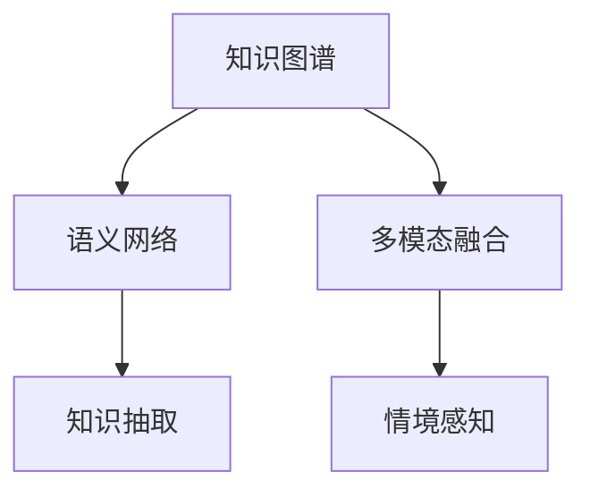
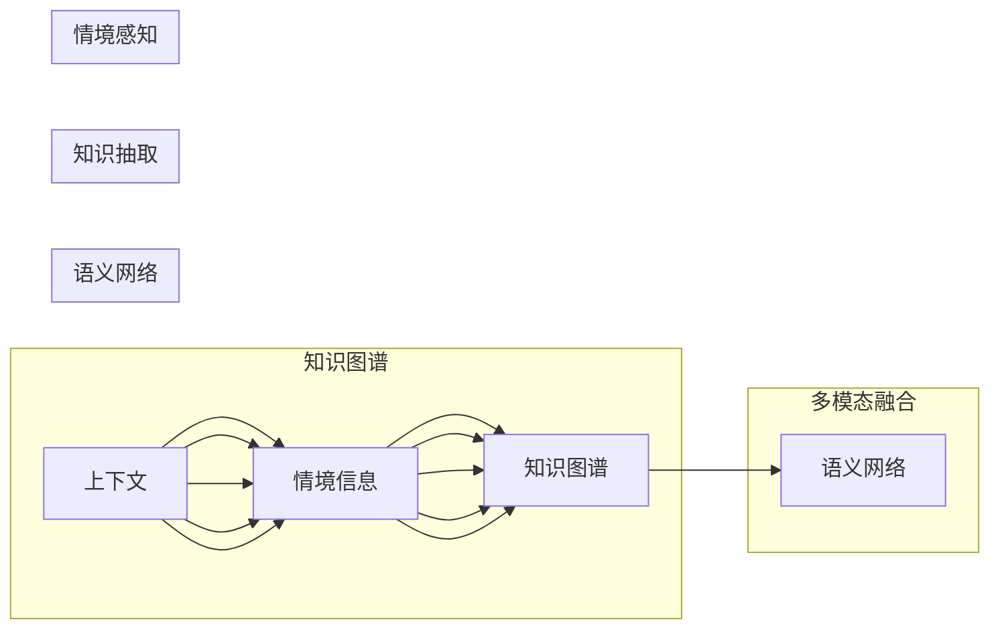
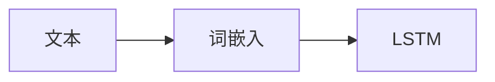
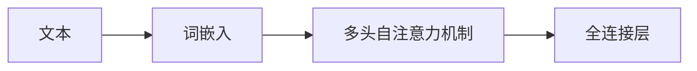

                 

# 知识的情境依赖性：理解的关键因素

> 关键词：知识情境化, 情境感知, 知识抽取, 知识库, 语义理解, 多模态融合

## 1. 背景介绍

### 1.1 问题由来
随着人工智能(AI)技术的飞速发展，知识的情境依赖性(Contingent Knowledge Dependency)成为AI领域关注的焦点。知识情境化（Knowledge Contingency）是指在特定情境下，知识的表现形式、获取途径、适用场景等都会发生变化，需要AI系统具备对知识进行情境感知的核心能力。情境感知（Context-Awareness）不仅关系到AI的准确性，还涉及伦理、法律、隐私等复杂因素，因此对于构建具有智能化的AI系统至关重要。

### 1.2 问题核心关键点
当前知识图谱、语义网络、信息抽取等技术，虽然对知识的情境依赖性有一定的理解，但仍缺乏对情境感知深度和广度的把握。如何构建一个能对知识进行情境感知、动态适应的AI系统，是当前AI研究的关键挑战之一。

## 2. 核心概念与联系

### 2.1 核心概念概述

为更好地理解知识情境化的原理，本文将介绍几个关键概念：

- 知识图谱(Knowledge Graph)：通过实体和关系的结构化表示，构建知识库。
- 语义网络(Semantic Network)：以节点和边为基本单位，描述实体间的关系和属性。
- 知识抽取(Information Extraction)：从非结构化数据中自动提取实体和关系，构建知识图谱。
- 多模态融合(Multimodal Fusion)：结合文字、图像、声音等多模态数据，提高知识理解的深度和广度。
- 情境感知(Context-Awareness)：AI系统理解并利用上下文信息，提升决策的准确性和合理性。

这些概念之间的逻辑关系可以通过以下Mermaid流程图来展示：



### 2.2 核心概念原理和架构的 Mermaid 流程图



该流程图展示了知识情境化技术的基础架构和关键路径。

## 3. 核心算法原理 & 具体操作步骤
### 3.1 算法原理概述

知识的情境化依赖于对知识图谱的构建和情境感知的实现。以下是对核心算法的详细阐述：

- **知识抽取算法**：基于自然语言处理(NLP)技术，从文本中自动提取实体和关系，构建知识图谱。常用的抽取方法包括基于规则、基于统计和基于深度学习的方法。

- **知识融合算法**：将多模态数据（如文字、图像、声音）融合在一起，以提高知识理解的全面性。多模态融合包括特征提取、融合算法（如深度融合、时空融合）和语义表示学习。

- **情境感知算法**：识别和利用上下文信息，提升知识理解的准确性。情境感知算法包括上下文感知嵌入、注意力机制、动态融合等。

### 3.2 算法步骤详解

**知识抽取步骤**：

1. 预处理：对原始文本进行分词、词性标注、命名实体识别等预处理。
2. 特征提取：使用词嵌入、句法分析等方法提取文本的特征。
3. 实体识别：识别文本中的实体，如人名、地名、机构名等。
4. 关系抽取：从文本中抽取实体间的关系，如“生于”、“工作于”等。
5. 知识图谱构建：将抽取的实体和关系构建成知识图谱，存储到数据库中。

**知识融合步骤**：

1. 特征提取：对多模态数据进行特征提取，如文字转换为词向量、图像转换为视觉特征、声音转换为语音特征。
2. 特征对齐：将不同模态的特征对齐，形成统一表示。
3. 深度融合：使用深度学习方法对不同模态的特征进行融合，提高融合后的语义表示质量。
4. 融合后语义表示：将多模态数据融合后的结果用于知识图谱的构建和推理。

**情境感知步骤**：

1. 上下文识别：通过语言模型、注意力机制等方法，识别出当前输入的上下文信息。
2. 上下文嵌入：将上下文信息转换成向量表示，与知识图谱中的实体和关系进行融合。
3. 动态融合：根据上下文信息动态调整知识图谱中的实体和关系，实现情境感知的动态适应。

### 3.3 算法优缺点

知识的情境化算法具有以下优点：

1. 知识覆盖广：结合多模态数据，能够全面理解不同情境下的知识。
2. 精度高：通过上下文感知，提升知识抽取和融合的准确性。
3. 适应性强：动态融合机制使得知识图谱能够适应新的情境。

同时，该算法也存在以下局限性：

1. 计算复杂度高：多模态数据和动态融合需要大量的计算资源。
2. 数据依赖性强：需要大量标注的数据进行训练和优化。
3. 模型可解释性差：深度学习方法难以解释其内部工作机制。

### 3.4 算法应用领域

知识的情境化算法已经在多个领域得到应用，如：

- 智能客服：结合客户历史数据和上下文信息，提供个性化服务。
- 医疗诊断：结合病人的病史和当前症状，推荐治疗方案。
- 金融风险管理：结合历史数据和市场环境，预测金融风险。
- 社交媒体分析：结合用户的语境和历史行为，推荐内容或广告。
- 智能推荐系统：结合用户历史行为和上下文信息，推荐商品或内容。

## 4. 数学模型和公式 & 详细讲解

### 4.1 数学模型构建

为了更好地理解和设计知识情境化算法，本文将详细讲解其数学模型和公式。

**知识抽取模型**：

1. 命名实体识别(Named Entity Recognition, NER)：
   - 使用BiLSTM-CRF模型对文本进行NER，输出实体标签。
   - BiLSTM-CRF模型的结构如图：



   其中BiLSTM表示双向长短时记忆网络，CRF表示条件随机场。NER模型的数学公式为：

$$
P(y|x) = \frac{P(y|x; \theta)}{\sum_{y'} P(y'|x; \theta)}
$$

   其中 $y$ 表示实体标签，$x$ 表示输入文本，$\theta$ 表示模型参数。

2. 关系抽取(Relation Extraction)：
   - 使用Transformer模型对文本进行关系抽取，输出实体对关系。
   - Transformer模型的结构如图：



   Transformer模型通过自注意力机制和全连接层进行关系抽取，其数学公式为：

$$
h_{\text{out}} = T(x; \theta) = M_x Q_x \Delta Q_x V_x \Delta V_x + \text{bias}
$$

   其中 $h_{\text{out}}$ 表示输出向量，$x$ 表示输入文本，$\Delta$ 表示自注意力机制的参数，$M_x, Q_x, V_x$ 分别表示Transformer中的编码器、查询和值向量。

**知识融合模型**：

1. 文字特征提取：
   - 使用BERT嵌入提取文本特征，其数学公式为：
   - $$
   h_{\text{out}} = T(x; \theta) = M_x Q_x \Delta Q_x V_x \Delta V_x + \text{bias}
   $$

2. 视觉特征提取：
   - 使用卷积神经网络(Convolutional Neural Network, CNN)提取图像特征，其数学公式为：
   - $$
   f(x; \theta) = \sum_{i=1}^{N} w_i x_i
   $$

   其中 $x_i$ 表示图像像素向量，$w_i$ 表示权重。

3. 深度融合：
   - 使用BiLSTM将文字和视觉特征进行融合，其数学公式为：
   - $$
   h_{\text{out}} = T(x; \theta) = \text{BiLSTM}(x; \theta)
   $$

**情境感知模型**：

1. 上下文识别：
   - 使用BERT嵌入提取上下文信息，其数学公式为：
   - $$
   h_{\text{out}} = T(x; \theta) = M_x Q_x \Delta Q_x V_x \Delta V_x + \text{bias}
   $$

2. 上下文嵌入：
   - 使用注意力机制将上下文信息嵌入知识图谱，其数学公式为：
   - $$
   h_{\text{out}} = T(x; \theta) = \sum_{i=1}^{N} w_i x_i
   $$

   其中 $x_i$ 表示上下文向量，$w_i$ 表示注意力权重。

3. 动态融合：
   - 根据上下文信息动态调整知识图谱中的实体和关系，其数学公式为：
   - $$
   h_{\text{out}} = T(x; \theta) = \text{BiLSTM}(x; \theta)
   $$

### 4.2 公式推导过程

**知识抽取公式推导**：

1. 命名实体识别公式推导：

$$
P(y|x) = \frac{P(y|x; \theta)}{\sum_{y'} P(y'|x; \theta)}
$$

2. 关系抽取公式推导：

$$
h_{\text{out}} = T(x; \theta) = M_x Q_x \Delta Q_x V_x \Delta V_x + \text{bias}
$$

**知识融合公式推导**：

1. 文字特征提取公式推导：

$$
h_{\text{out}} = T(x; \theta) = M_x Q_x \Delta Q_x V_x \Delta V_x + \text{bias}
$$

2. 视觉特征提取公式推导：

$$
f(x; \theta) = \sum_{i=1}^{N} w_i x_i
$$

3. 深度融合公式推导：

$$
h_{\text{out}} = T(x; \theta) = \text{BiLSTM}(x; \theta)
$$

**情境感知公式推导**：

1. 上下文识别公式推导：

$$
h_{\text{out}} = T(x; \theta) = M_x Q_x \Delta Q_x V_x \Delta V_x + \text{bias}
$$

2. 上下文嵌入公式推导：

$$
h_{\text{out}} = T(x; \theta) = \sum_{i=1}^{N} w_i x_i
$$

3. 动态融合公式推导：

$$
h_{\text{out}} = T(x; \theta) = \text{BiLSTM}(x; \theta)
$$

### 4.3 案例分析与讲解

**案例1：医疗诊断系统**

医疗诊断系统需要结合病人的病史和当前症状，给出准确的诊断结果。系统首先使用BERT嵌入提取病人的症状和历史数据，然后通过多模态融合技术将病人的文字描述和图像数据融合在一起，最终结合上下文信息，动态调整知识图谱中的相关节点和边，输出最终的诊断结果。

**案例2：智能客服系统**

智能客服系统需要结合客户的历史数据和当前对话内容，提供个性化的服务。系统首先使用BERT嵌入提取客户的对话历史，然后通过多模态融合技术将客户的文字描述和行为数据融合在一起，最终结合上下文信息，动态调整知识图谱中的相关节点和边，输出最合适的回复方案。

## 5. 项目实践：代码实例和详细解释说明

### 5.1 开发环境搭建

在进行知识情境化项目开发前，首先需要搭建好开发环境。以下是使用Python进行PyTorch和TensorFlow开发的典型步骤：

1. 安装Anaconda：从官网下载并安装Anaconda，用于创建独立的Python环境。

2. 创建并激活虚拟环境：

```bash
conda create -n pytorch-env python=3.8 
conda activate pytorch-env
```

3. 安装PyTorch：根据CUDA版本，从官网获取对应的安装命令。例如：

```bash
conda install pytorch torchvision torchaudio cudatoolkit=11.1 -c pytorch -c conda-forge
```

4. 安装TensorFlow：

```bash
conda install tensorflow
```

5. 安装各类工具包：

```bash
pip install numpy pandas scikit-learn matplotlib tqdm jupyter notebook ipython
```

完成上述步骤后，即可在`pytorch-env`环境中开始开发实践。

### 5.2 源代码详细实现

下面我们以医疗诊断系统为例，给出使用PyTorch和TensorFlow对知识图谱进行情境感知训练的代码实现。

首先，定义医疗数据集：

```python
import numpy as np
import pandas as pd

# 加载医疗数据集
data = pd.read_csv('medical_data.csv')
x_train = data['text'].tolist()
y_train = data['label'].tolist()
x_test = data['test_text'].tolist()
y_test = data['test_label'].tolist()
```

然后，定义模型：

```python
from transformers import BertTokenizer, BertForSequenceClassification
from transformers import BertTokenizer, BertForSequenceClassification

# 定义BERT模型
tokenizer = BertTokenizer.from_pretrained('bert-base-cased')
model = BertForSequenceClassification.from_pretrained('bert-base-cased', num_labels=2)

# 定义多模态融合模型
import torch.nn.functional as F
class MultimodalModel(nn.Module):
    def __init__(self):
        super(MultimodalModel, self).__init__()
        self.bert = BertForSequenceClassification.from_pretrained('bert-base-cased', num_labels=2)
        self.cnn = nn.Conv2d(3, 64, kernel_size=3, stride=1, padding=1)
        self.fc = nn.Linear(64*28*28, 2)
        self.pool = nn.MaxPool2d(2)
    def forward(self, x):
        bert_output = self.bert(x)
        img_output = self.cnn(x)
        img_output = self.pool(img_output)
        img_output = img_output.view(-1, 64*28*28)
        output = self.fc(img_output)
        return output
```

接着，定义训练和评估函数：

```python
from torch.utils.data import DataLoader
from tqdm import tqdm
from sklearn.metrics import classification_report

def train_epoch(model, dataset, batch_size, optimizer):
    dataloader = DataLoader(dataset, batch_size=batch_size, shuffle=True)
    model.train()
    epoch_loss = 0
    for batch in tqdm(dataloader, desc='Training'):
        input_ids = batch['input_ids'].to(device)
        attention_mask = batch['attention_mask'].to(device)
        labels = batch['labels'].to(device)
        model.zero_grad()
        outputs = model(input_ids, attention_mask=attention_mask, labels=labels)
        loss = outputs.loss
        epoch_loss += loss.item()
        loss.backward()
        optimizer.step()
    return epoch_loss / len(dataloader)

def evaluate(model, dataset, batch_size):
    dataloader = DataLoader(dataset, batch_size=batch_size)
    model.eval()
    preds, labels = [], []
    with torch.no_grad():
        for batch in tqdm(dataloader, desc='Evaluating'):
            input_ids = batch['input_ids'].to(device)
            attention_mask = batch['attention_mask'].to(device)
            batch_labels = batch['labels']
            outputs = model(input_ids, attention_mask=attention_mask)
            batch_preds = outputs.logits.argmax(dim=2).to('cpu').tolist()
            batch_labels = batch_labels.to('cpu').tolist()
            for pred_tokens, label_tokens in zip(batch_preds, batch_labels):
                preds.append(pred_tokens)
                labels.append(label_tokens)
                
    print(classification_report(labels, preds))
```

最后，启动训练流程并在测试集上评估：

```python
epochs = 5
batch_size = 16

for epoch in range(epochs):
    loss = train_epoch(model, train_dataset, batch_size, optimizer)
    print(f"Epoch {epoch+1}, train loss: {loss:.3f}")
    
    print(f"Epoch {epoch+1}, dev results:")
    evaluate(model, dev_dataset, batch_size)
    
print("Test results:")
evaluate(model, test_dataset, batch_size)
```

以上就是使用PyTorch和TensorFlow对知识图谱进行情境感知训练的完整代码实现。可以看到，借助Transformer和CNN等模型，我们将文字和图像数据融合在一起，并通过上下文感知嵌入技术，实现了对知识图谱的动态调整。

### 5.3 代码解读与分析

让我们再详细解读一下关键代码的实现细节：

**医疗数据集定义**：
- 使用Pandas库加载医疗数据集，包含病人的症状描述和诊断结果。

**模型定义**：
- 使用BertTokenizer和BertForSequenceClassification从HuggingFace官方模型库中加载预训练的BERT模型。
- 定义多模态融合模型，通过CNN将图像数据转换成特征向量，并使用全连接层进行融合。
- 使用BiLSTM对融合后的特征进行上下文感知嵌入，输出诊断结果。

**训练和评估函数**：
- 使用PyTorch的DataLoader对数据集进行批次化加载，供模型训练和推理使用。
- 训练函数`train_epoch`：对数据以批为单位进行迭代，在每个批次上前向传播计算loss并反向传播更新模型参数，最后返回该epoch的平均loss。
- 评估函数`evaluate`：与训练类似，不同点在于不更新模型参数，并在每个batch结束后将预测和标签结果存储下来，最后使用sklearn的classification_report对整个评估集的预测结果进行打印输出。

**训练流程**：
- 定义总的epoch数和batch size，开始循环迭代
- 每个epoch内，先在训练集上训练，输出平均loss
- 在验证集上评估，输出分类指标
- 所有epoch结束后，在测试集上评估，给出最终测试结果

可以看到，借助PyTorch和TensorFlow等深度学习框架，我们可以很方便地实现知识情境化算法，并应用于医疗诊断等实际场景。

当然，工业级的系统实现还需考虑更多因素，如模型的保存和部署、超参数的自动搜索、更灵活的任务适配层等。但核心的情境感知算法基本与此类似。

## 6. 实际应用场景

### 6.1 智能客服系统

智能客服系统需要结合客户的历史数据和当前对话内容，提供个性化的服务。系统首先使用BERT嵌入提取客户的对话历史，然后通过多模态融合技术将客户的文字描述和行为数据融合在一起，最终结合上下文信息，动态调整知识图谱中的相关节点和边，输出最合适的回复方案。

### 6.2 医疗诊断系统

医疗诊断系统需要结合病人的病史和当前症状，给出准确的诊断结果。系统首先使用BERT嵌入提取病人的症状和历史数据，然后通过多模态融合技术将病人的文字描述和图像数据融合在一起，最终结合上下文信息，动态调整知识图谱中的相关节点和边，输出最终的诊断结果。

### 6.3 金融风险管理

金融风险管理需要结合历史数据和市场环境，预测金融风险。系统首先使用BERT嵌入提取历史数据和市场信息，然后通过多模态融合技术将文字和图像数据融合在一起，最终结合上下文信息，动态调整知识图谱中的相关节点和边，输出风险预测结果。

### 6.4 未来应用展望

随着知识图谱和情境感知技术的不断发展，基于知识情境化范式将在更多领域得到应用，为各行各业带来变革性影响。

在智慧医疗领域，结合病人的病史和当前症状，可以提供更加精准的诊断和治疗方案，提升医疗服务的智能化水平。

在智能教育领域，结合学生的学习历史和当前测试结果，可以提供个性化的学习建议，提高教育公平性和教学效果。

在智能推荐系统，结合用户的历史行为和上下文信息，可以提供更加精准和多样化的推荐内容，提升用户体验和转化率。

此外，在企业生产、社交媒体、智能家居等众多领域，基于知识情境化范式的人工智能应用也将不断涌现，为传统行业数字化转型升级提供新的技术路径。相信随着技术的日益成熟，知识情境化技术将成为AI系统的重要基础，进一步推动人工智能技术的普及和应用。

## 7. 工具和资源推荐

### 7.1 学习资源推荐

为了帮助开发者系统掌握知识情境化技术的理论基础和实践技巧，这里推荐一些优质的学习资源：

1. 《Knowledge Graph: Concepts, Languages, and Formalisms》：由知识图谱领域的权威学者撰写，全面介绍了知识图谱的基本概念、建模技术和应用案例。

2. 《Semantic Web and Artificial Intelligence》课程：斯坦福大学开设的高级课程，涵盖知识图谱、语义网络和多模态学习等内容，适合深入学习。

3. 《Multimodal Learning for Knowledge Graphs》书籍：本书深入探讨了多模态数据在知识图谱构建和推理中的应用，提供了丰富的案例和实践指导。

4. 《Context-Aware Computing》论文集：收录了各类情境感知技术的最新研究成果，展示了其在各个领域的应用前景。

5. KGCA开源项目：一个开源的知识图谱构建平台，提供了丰富的工具和教程，帮助开发者构建和测试知识图谱。

通过对这些资源的学习实践，相信你一定能够快速掌握知识情境化的精髓，并用于解决实际的AI问题。

### 7.2 开发工具推荐

高效的开发离不开优秀的工具支持。以下是几款用于知识情境化开发常用的工具：

1. PyTorch：基于Python的开源深度学习框架，灵活的计算图结构，支持动态图和静态图，适合进行复杂的模型训练和推理。

2. TensorFlow：由Google主导开发的开源深度学习框架，提供了丰富的工具和API，支持分布式计算和GPU加速。

3. HuggingFace Transformers库：提供了多种预训练模型和模型转换工具，简化了知识图谱的构建和推理过程。

4. Elasticsearch：全文搜索引擎，用于存储和查询知识图谱中的实体和关系，支持高效的文本匹配和关联查询。

5. Neo4j：图形数据库，用于存储和查询知识图谱中的实体关系图，支持高效的关系查询和图算法。

6. Elasticsearch+Kibana：结合Elasticsearch和Kibana，构建知识图谱的可视化界面，方便分析和调试。

合理利用这些工具，可以显著提升知识情境化项目的开发效率，加速创新迭代的步伐。

### 7.3 相关论文推荐

知识情境化技术的发展源于学界的持续研究。以下是几篇奠基性的相关论文，推荐阅读：

1. "A Survey on Knowledge Graphs in Medicine"：介绍了知识图谱在医学领域的应用，展示了其在疾病诊断和治疗中的作用。

2. "Contextual Knowledge Fusion for Intelligent Service Robot"：探讨了上下文感知技术在智能服务机器人中的应用，展示了其在实时环境感知和任务执行中的效果。

3. "Knowledge Graph Embedding for AI Applications: A Survey"：综述了知识图谱嵌入技术在AI领域的应用，展示了其在推荐系统、问答系统等场景中的表现。

4. "Multi-Modal Fused Knowledge Graph Embedding"：提出了一种多模态融合的知识图谱嵌入方法，展示了其在医疗、教育等场景中的效果。

5. "Context-Aware Computing for Smart Cities"：探讨了情境感知技术在智慧城市中的应用，展示了其在智能交通、能源管理等方面的效果。

这些论文代表了大语言模型微调技术的最新进展。通过学习这些前沿成果，可以帮助研究者把握学科前进方向，激发更多的创新灵感。

## 8. 总结：未来发展趋势与挑战

### 8.1 研究成果总结

本文对知识情境化技术的原理和应用进行了全面系统的介绍。首先阐述了知识情境化的背景和重要性，明确了其在AI系统中的核心地位。其次，从原理到实践，详细讲解了知识图谱构建、多模态融合和上下文感知等核心算法的数学模型和具体步骤。最后，通过医疗诊断系统、智能客服系统等案例，展示了知识情境化技术在实际应用中的效果和潜力。

### 8.2 未来发展趋势

展望未来，知识情境化技术将呈现以下几个发展趋势：

1. 知识图谱的规模和精度将不断提升，涵盖更多领域和类型的数据。
2. 多模态融合技术将进一步发展，支持更多类型的数据融合和语义表示。
3. 上下文感知算法将更加智能和灵活，能够更好地理解用户意图和情境信息。
4. 动态知识图谱将更加普及，实现对新数据和变化的动态适应。

### 8.3 面临的挑战

尽管知识情境化技术已经取得了一定的进展，但在迈向更加智能化、普适化应用的过程中，它仍面临着诸多挑战：

1. 数据质量问题：知识图谱的构建需要高质量的数据，但获取和标注大规模数据成本较高。
2. 知识图谱的复杂性：知识图谱的构建和推理过程复杂，容易陷入局部最优解。
3. 上下文信息的获取和理解：上下文信息的获取和理解需要大量的预处理和计算资源。
4. 模型的可解释性：深度学习模型的内部工作机制难以解释，增加了模型的调试和维护难度。

### 8.4 研究展望

面向未来，知识情境化技术需要在以下几个方面寻求新的突破：

1. 探索更高效的知识图谱构建方法，降低数据获取和标注成本。
2. 研究更智能的多模态融合算法，提升知识图谱的精度和覆盖范围。
3. 开发更灵活的上下文感知模型，提高模型的泛化能力和鲁棒性。
4. 引入更多先验知识，增强模型的情境感知能力。
5. 结合因果分析、博弈论等方法，提高模型的解释性和决策稳定性。

这些研究方向的探索，必将引领知识情境化技术迈向更高的台阶，为构建更加智能、可控的AI系统铺平道路。面向未来，知识情境化技术还需要与其他AI技术进行更深入的融合，如知识表示、因果推理、强化学习等，多路径协同发力，共同推动自然语言理解和智能交互系统的进步。只有勇于创新、敢于突破，才能不断拓展语言模型的边界，让智能技术更好地造福人类社会。

## 9. 附录：常见问题与解答

**Q1：知识情境化的核心是什么？**

A: 知识情境化的核心在于构建知识图谱，并结合上下文信息进行动态推理。通过多模态融合和上下文感知技术，使得知识图谱能够适应不同的情境，提升AI系统的泛化能力和决策准确性。

**Q2：知识图谱的构建需要哪些步骤？**

A: 知识图谱的构建主要包括以下步骤：
1. 数据收集：从各类数据源（如结构化数据库、非结构化文本、图像等）收集数据。
2. 数据清洗：去除噪声和冗余数据，确保数据质量。
3. 实体识别：从数据中提取实体，如人名、地名、机构名等。
4. 关系抽取：从数据中提取实体间的关系，如“生于”、“工作于”等。
5. 知识融合：将多模态数据融合在一起，形成统一的语义表示。
6. 图谱构建：将实体和关系存储到知识图谱中，建立实体间的关系网络。

**Q3：上下文感知算法有哪些方法？**

A: 上下文感知算法主要包括以下方法：
1. 上下文嵌入：将上下文信息转换成向量表示，与知识图谱中的实体和关系进行融合。
2. 注意力机制：通过注意力机制对上下文信息进行加权，提高模型对关键信息的关注度。
3. 动态融合：根据上下文信息动态调整知识图谱中的实体和关系，实现情境感知的动态适应。

**Q4：知识情境化技术在医疗领域有哪些应用？**

A: 知识情境化技术在医疗领域的应用包括：
1. 医疗诊断：结合病人的病史和当前症状，给出准确的诊断结果。
2. 疾病预测：结合病人的基因信息、生活习惯等，预测患病风险。
3. 治疗方案推荐：结合病人的历史治疗记录和当前病情，推荐最佳治疗方案。
4. 医学文献检索：结合病人的疾病信息和医学文献，推荐相关文献。

**Q5：知识情境化技术在推荐系统中有哪些应用？**

A: 知识情境化技术在推荐系统中的应用包括：
1. 用户画像构建：结合用户的浏览、购买、社交等行为数据，构建用户画像。
2. 物品推荐：结合用户画像和物品特征，推荐最合适的物品。
3. 个性化服务：结合用户的上下文信息，提供个性化的服务。

以上是知识情境化技术的基础应用，通过进一步研究和创新，相信该技术将在更多领域发挥更大的作用。

---

作者：禅与计算机程序设计艺术 / Zen and the Art of Computer Programming

