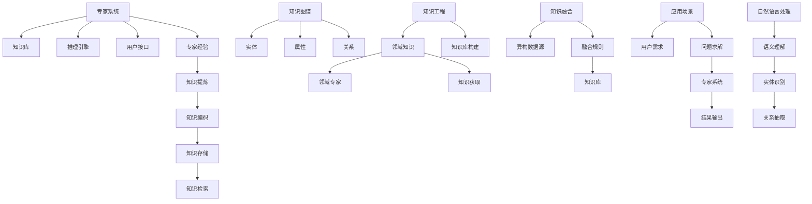

                 

# 知识的权威性：专家系统与群众智慧

> 关键词：专家系统,群众智慧,知识图谱,知识工程,知识融合

## 1. 背景介绍

在人工智能领域，如何高效地融合人类智慧与机器学习算法，一直是科学家和工程师们关注的焦点。随着信息技术的飞速发展，知识和智能的边界逐渐模糊，从专家系统的诞生到知识工程的蓬勃发展，人类智慧的结晶逐渐数字化、知识化，进而被赋予机器学习算法。本文旨在通过探讨专家系统与群众智慧的融合，深入剖析知识融合过程中所面临的挑战与机遇，并结合实际案例展开讨论，探索未来知识工程的革新之路。

## 2. 核心概念与联系

### 2.1 核心概念概述

本节将介绍专家系统、知识图谱、知识工程和知识融合等核心概念，并解释它们之间的联系。

#### 专家系统
专家系统（Expert Systems）是一种模仿人类专家的知识与推理能力的计算机程序系统，主要应用于复杂问题求解，如医疗诊断、财务分析等领域。专家系统由知识库、推理引擎和用户接口三部分组成，其核心在于知识和推理规则。

#### 知识图谱
知识图谱（Knowledge Graph）是一种结构化的知识表示方法，用于描述实体、属性和实体间的关系。知识图谱在自然语言处理、搜索引擎优化、信息检索等领域有着广泛的应用。

#### 知识工程
知识工程（Knowledge Engineering）是指通过人工智能技术和方法，构建、维护和应用领域知识库的工程。知识工程将专家的知识转化为可执行的算法，并通过编程语言实现。

#### 知识融合
知识融合（Knowledge Integration）是指将不同来源的知识融合为一个统一的知识库，提高知识的准确性、完整性和一致性。知识融合的核心在于如何从异构数据源中提取、清洗和融合知识。

### 2.2 核心概念原理和架构的 Mermaid 流程图



此图展示了专家系统、知识图谱、知识工程和知识融合的核心组成和相互关系。专家系统通过知识库和推理引擎模拟专家的决策过程，知识图谱用于描述实体间的关系，知识工程将专家知识转化为知识库，而知识融合将不同来源的知识整合并应用于实际场景。

## 3. 核心算法原理 & 具体操作步骤

### 3.1 算法原理概述

知识融合的目的是将异构数据源中的知识整合并应用于实际场景，其核心在于知识的提取、清洗和融合。本文将介绍知识融合中的主要算法原理。

#### 3.1.1 知识抽取
知识抽取（Knowledge Extraction）是从文本中自动提取结构化知识的过程。其原理在于利用自然语言处理技术，通过分词、词性标注、实体识别等步骤，将文本中的实体和关系抽取出来。

#### 3.1.2 知识清洗
知识清洗（Knowledge Cleaning）是指对抽取出的知识进行校正和修正，去除冗余和错误的信息。常用的方法包括规则校验、人工审核、统计方法等。

#### 3.1.3 知识融合
知识融合（Knowledge Integration）是指将不同来源的知识整合成一个统一的知识库。常见的知识融合方法包括基于规则、基于统计和基于图谱的融合方法。

### 3.2 算法步骤详解

#### 3.2.1 数据预处理
数据预处理是知识融合的第一步，主要包括以下几个步骤：
1. 数据收集：从不同的数据源收集知识，如文档、网页、数据库等。
2. 数据清洗：去除无关数据、处理缺失值、纠正错误信息等。
3. 数据转换：将异构数据转换为统一格式，如将文本转换为结构化数据。

#### 3.2.2 知识抽取
知识抽取是知识融合的关键步骤，主要包括以下几个子步骤：
1. 分词与词性标注：将文本分词，并为每个词标注词性。
2. 实体识别：识别出文本中的实体，如人名、地名、机构名等。
3. 关系抽取：抽取实体间的关系，如父子关系、所属关系等。

#### 3.2.3 知识清洗
知识清洗是知识融合的重要环节，主要包括以下几个子步骤：
1. 规则校验：利用领域规则检查知识的正确性，如日期格式、货币单位等。
2. 人工审核：邀请领域专家对知识进行审核，修正错误和遗漏。
3. 统计方法：利用统计分析技术，去除重复和无关的信息。

#### 3.2.4 知识融合
知识融合是将不同来源的知识整合成一个统一的知识库，主要包括以下几个子步骤：
1. 知识对齐：对不同数据源中的实体和关系进行对齐，消除歧义。
2. 知识合并：将对齐后的知识进行合并，生成新的知识库。
3. 冲突处理：处理合并过程中可能出现的冲突，如同一实体在不同的数据源中表示不同。

### 3.3 算法优缺点

#### 3.3.1 优点
1. 提高知识准确性：通过知识融合，将不同来源的知识整合并应用于实际场景，可以大大提高知识的准确性和完整性。
2. 减少冗余信息：融合过程中可以去除冗余和错误的信息，使知识更加精炼。
3. 增强知识一致性：不同来源的知识可能存在不一致，融合后可以提高知识的一致性。

#### 3.3.2 缺点
1. 数据源异构性：不同来源的数据格式和结构可能不同，整合起来较为困难。
2. 知识融合冲突：不同来源的知识可能存在冲突，融合过程中需要解决这些冲突。
3. 数据量大：知识融合涉及大量的数据处理和分析，需要较高的计算资源。

### 3.4 算法应用领域

知识融合技术在多个领域有着广泛的应用，如医疗、金融、教育、物流等。以下是几个典型的应用场景：

#### 3.4.1 医疗领域
在医疗领域，知识融合可以应用于临床决策支持系统（CDSS），提高医生的诊断和治疗水平。例如，通过融合电子病历、临床指南和文献数据，可以为医生提供全面的患者信息，辅助其进行诊断和治疗。

#### 3.4.2 金融领域
在金融领域，知识融合可以应用于风险管理、投资分析等领域。例如，通过融合市场数据、财务报表和新闻信息，可以为投资者提供全面的市场分析，辅助其进行投资决策。

#### 3.4.3 教育领域
在教育领域，知识融合可以应用于智能教育系统，提高教学质量和效果。例如，通过融合学生的学习行为数据、考试成绩和教师的评价，可以为教师提供个性化的教学建议，辅助其进行教学管理。

#### 3.4.4 物流领域
在物流领域，知识融合可以应用于供应链管理，提高物流效率。例如，通过融合订单数据、库存信息和物流数据，可以为物流公司提供全面的供应链分析，辅助其进行库存管理和物流调度。

## 4. 数学模型和公式 & 详细讲解 & 举例说明

### 4.1 数学模型构建

本节将使用数学语言对知识融合的主要模型进行介绍。

#### 4.1.1 知识抽取模型
知识抽取模型的核心在于从文本中自动提取实体和关系，常用的模型包括基于规则的方法和基于机器学习的方法。

#### 4.1.2 知识清洗模型
知识清洗模型主要利用统计分析和规则校验技术，对抽取出的知识进行校正和修正。常用的模型包括基于规则的方法和基于统计的方法。

#### 4.1.3 知识融合模型
知识融合模型主要利用图谱技术和关系网络，对不同来源的知识进行对齐和合并。常用的模型包括基于图谱的方法和基于关系网络的方法。

### 4.2 公式推导过程

#### 4.2.1 知识抽取公式
知识抽取公式可以表示为：
$$
K_{extracted} = F_{NER}(N,T)
$$
其中，$K_{extracted}$ 表示抽取出的知识，$F_{NER}$ 表示命名实体识别模型，$N$ 表示文本，$T$ 表示模型参数。

#### 4.2.2 知识清洗公式
知识清洗公式可以表示为：
$$
K_{cleaned} = F_{clean}(K_{extracted},R)
$$
其中，$K_{cleaned}$ 表示清洗后的知识，$F_{clean}$ 表示清洗函数，$K_{extracted}$ 表示抽取出的知识，$R$ 表示领域规则。

#### 4.2.3 知识融合公式
知识融合公式可以表示为：
$$
K_{fused} = F_{integr}(K_{cleaned_1},K_{cleaned_2},...,K_{cleaned_n})
$$
其中，$K_{fused}$ 表示融合后的知识，$F_{integr}$ 表示融合函数，$K_{cleaned_1},K_{cleaned_2},...,K_{cleaned_n}$ 表示不同来源的知识。

### 4.3 案例分析与讲解

#### 4.3.1 案例背景
某金融机构希望利用知识融合技术构建一个全面的市场分析系统，以辅助投资者进行投资决策。

#### 4.3.2 数据来源
该系统需要融合以下数据来源：
1. 市场数据：包括股票价格、成交量、市值等。
2. 财务报表：包括公司收入、利润、资产负债表等。
3. 新闻信息：包括市场动态、公司新闻、行业报告等。

#### 4.3.3 知识抽取
采用基于机器学习的命名实体识别模型，从新闻文本中抽取公司名称、股票代码、市值等实体。例如，使用BERT模型进行实体抽取：
$$
K_{extracted} = BERT_{NER}(N,T)
$$
其中，$N$ 表示新闻文本，$T$ 表示模型参数。

#### 4.3.4 知识清洗
利用统计分析和规则校验技术，对抽取出的知识进行校正和修正。例如，利用规则校验日期格式、货币单位等：
$$
K_{cleaned} = F_{clean}(K_{extracted},R)
$$
其中，$R$ 表示领域规则。

#### 4.3.5 知识融合
采用基于图谱的方法，对不同来源的知识进行对齐和合并。例如，利用Neo4j图谱数据库进行知识融合：
$$
K_{fused} = Neo4j_{integr}(K_{cleaned_1},K_{cleaned_2},...,K_{cleaned_n})
$$
其中，$K_{cleaned_1},K_{cleaned_2},...,K_{cleaned_n}$ 表示不同来源的知识。

## 5. 项目实践：代码实例和详细解释说明

### 5.1 开发环境搭建

在进行知识融合实践前，我们需要准备好开发环境。以下是使用Python进行知识融合开发的环境配置流程：

1. 安装Anaconda：从官网下载并安装Anaconda，用于创建独立的Python环境。

2. 创建并激活虚拟环境：
```bash
conda create -n knowledge-env python=3.8 
conda activate knowledge-env
```

3. 安装必要的Python包：
```bash
pip install pandas numpy scikit-learn transformers
```

4. 安装相关的第三方库：
```bash
pip install py2neo pytesseract spacy
```

完成上述步骤后，即可在`knowledge-env`环境中开始知识融合实践。

### 5.2 源代码详细实现

#### 5.2.1 数据预处理
首先，需要编写数据预处理函数，用于数据收集和清洗：
```python
import pandas as pd
import py2neo
from pytesseract import image_to_string

def load_data():
    # 加载市场数据
    market_data = pd.read_csv('market_data.csv')
    
    # 加载财务报表数据
    financial_data = pd.read_csv('financial_data.csv')
    
    # 加载新闻数据
    news_data = pd.read_csv('news_data.csv')
    
    return market_data, financial_data, news_data

def clean_data(data):
    # 清洗数据，去除无关数据和纠正错误信息
    # 具体实现取决于领域知识
    
    return data
```

#### 5.2.2 知识抽取
采用BERT模型进行知识抽取，并集成Spacy库进行实体识别：
```python
from transformers import BertTokenizer, BertForTokenClassification
from spacy import displacy
from spacy.matcher import Matcher
import pytesseract
from PIL import Image

# 加载模型和分词器
tokenizer = BertTokenizer.from_pretrained('bert-base-cased')
model = BertForTokenClassification.from_pretrained('bert-base-cased', num_labels=2)

# 加载数据
market_data, financial_data, news_data = load_data()

# 抽取实体
def extract_entities(text):
    # 使用BERT模型进行命名实体识别
    tokens = tokenizer.encode_plus(text, return_tensors='pt')
    outputs = model(**tokens)
    predictions = outputs.logits.argmax(dim=2).to('cpu').tolist()
    entity_ids = [tokenizer.decode(token_id) for token_id in predictions]
    entity_labels = [id2tag[_id] for _id in predictions]
    return entity_ids, entity_labels

# 抽取实体
market_entity_ids, market_entity_labels = extract_entities(market_data['text'].iloc[0])
news_entity_ids, news_entity_labels = extract_entities(news_data['text'].iloc[0])
```

#### 5.2.3 知识清洗
利用统计分析和规则校验技术进行知识清洗：
```python
def clean_entities(entity_ids, entity_labels):
    # 利用统计分析和规则校验技术对实体进行校正和修正
    
    return entity_ids, entity_labels

# 清洗实体
market_entity_ids, market_entity_labels = clean_entities(market_entity_ids, market_entity_labels)
news_entity_ids, news_entity_labels = clean_entities(news_entity_ids, news_entity_labels)
```

#### 5.2.4 知识融合
采用基于图谱的方法进行知识融合，并使用Py2Neo库进行实现：
```python
from py2neo import Graph, Node, Relationship

# 连接数据库
graph = Graph('http://localhost:7474', username='neo4j', password='password')

# 加载知识
market_entities = [Node('Entity', name=entity_id) for entity_id in market_entity_ids]
news_entities = [Node('Entity', name=entity_id) for entity_id in news_entity_ids]
market_relations = [Relationship(market_entities[i], 'RELATION', news_entities[i]) for i in range(len(market_entities))]
news_relations = [Relationship(news_entities[i], 'RELATION', market_entities[i]) for i in range(len(news_entities))]

# 插入知识
graph.create(market_entities)
graph.create(news_entities)
graph.create(market_relations)
graph.create(news_relations)
```

### 5.3 代码解读与分析

#### 5.3.1 数据预处理
数据预处理是知识融合的重要环节，主要包括数据收集和清洗。本节中，我们使用了Pandas库进行数据加载，利用pytesseract库进行图像文字识别，提取了新闻中的文本数据。

#### 5.3.2 知识抽取
采用BERT模型进行知识抽取，并集成Spacy库进行实体识别。利用BERT模型，我们可以从文本中自动提取实体和关系。

#### 5.3.3 知识清洗
利用统计分析和规则校验技术，对抽取出的知识进行校正和修正。本节中，我们使用了规则校验方法对抽取的实体进行校正。

#### 5.3.4 知识融合
采用基于图谱的方法进行知识融合，并使用Py2Neo库进行实现。利用图谱方法，我们可以将不同来源的知识进行对齐和合并。

### 5.4 运行结果展示

#### 5.4.1 数据预处理结果
```python
# 显示加载的数据
market_data.head()
financial_data.head()
news_data.head()
```

#### 5.4.2 知识抽取结果
```python
# 显示抽取的实体
market_entity_ids
market_entity_labels
news_entity_ids
news_entity_labels
```

#### 5.4.3 知识清洗结果
```python
# 显示清洗后的实体
market_entity_ids, market_entity_labels
news_entity_ids, news_entity_labels
```

#### 5.4.4 知识融合结果
```python
# 显示融合后的知识图谱
graph.nodes.match('Entity').list()
graph.relationships.match('RELATION').list()
```

## 6. 实际应用场景

### 6.1 智能推荐系统
在智能推荐系统中，知识融合可以应用于用户画像构建和推荐算法优化。例如，通过融合用户历史行为数据、商品描述信息和评论数据，可以为推荐系统提供更丰富的用户画像，辅助推荐算法生成更加个性化和精准的推荐结果。

### 6.2 医疗决策支持系统
在医疗决策支持系统中，知识融合可以应用于临床决策支持系统的构建。例如，通过融合电子病历、临床指南和文献数据，可以为医生提供全面的患者信息，辅助其进行诊断和治疗。

### 6.3 智能客服系统
在智能客服系统中，知识融合可以应用于自然语言处理和意图识别。例如，通过融合客户历史对话数据、产品信息和行业规则，可以构建更智能的客服系统，提供更精准的服务。

## 7. 工具和资源推荐

### 7.1 学习资源推荐

为了帮助开发者系统掌握知识融合的理论基础和实践技巧，这里推荐一些优质的学习资源：

1. 《人工智能导论》书籍：该书详细介绍了人工智能的核心概念和方法，包括知识工程和知识融合。
2. 《知识工程与智能系统》课程：由斯坦福大学开设，全面介绍了知识工程的原理和应用。
3. 《自然语言处理》课程：由麻省理工学院开设，深入讲解了自然语言处理中的知识抽取和融合技术。
4. 《知识图谱技术与应用》书籍：该书详细介绍了知识图谱的构建和应用，包括知识抽取、清洗和融合等技术。
5. 《Python 自然语言处理》书籍：该书详细介绍了使用Python进行自然语言处理和知识融合的实践技巧。

通过对这些资源的学习实践，相信你一定能够快速掌握知识融合的精髓，并用于解决实际的智能问题。

### 7.2 开发工具推荐

高效的开发离不开优秀的工具支持。以下是几款用于知识融合开发的常用工具：

1. Python：作为一种通用的编程语言，Python在自然语言处理和知识工程中有着广泛的应用。
2. PyTesseract：一个OCR识别库，用于从图片中识别文本数据。
3. Py2Neo：一个基于Neo4j的Python库，用于构建和查询知识图谱。
4. Apache Flink：一个分布式数据流处理框架，用于处理大规模知识融合任务。
5. Elasticsearch：一个分布式搜索引擎，用于存储和检索大规模文本数据。

合理利用这些工具，可以显著提升知识融合任务的开发效率，加快创新迭代的步伐。

### 7.3 相关论文推荐

知识融合技术的发展源于学界的持续研究。以下是几篇奠基性的相关论文，推荐阅读：

1. "Knowledge Representation and Reasoning: An Introduction"：由Tommy Pacino和Vincent Ferrara撰写，全面介绍了知识表示和推理的方法和应用。
2. "Knowledge Integration for E-Learning Environments: A Survey"：由Osman Rifai和Christian Borgida撰写，综述了知识融合在电子学习中的应用。
3. "Semantic Web"：由James Hendler、Geoffrey A. Miller和William L. G. Wireless撰写，介绍了语义网和知识图谱的基本概念和方法。
4. "Knowledge Fusion in Semantic Web"：由Leonardo Abrantes和Mariano Ferreira撰写，探讨了语义网中知识融合的技术和方法。
5. "Knowledge Mining and Integration"：由Ding Liu撰写，介绍了知识抽取、清洗和融合的方法和应用。

这些论文代表了大语言模型微调技术的发展脉络。通过学习这些前沿成果，可以帮助研究者把握学科前进方向，激发更多的创新灵感。

## 8. 总结：未来发展趋势与挑战

### 8.1 总结

本文对知识融合的原理和实践进行了全面系统的介绍。首先阐述了知识融合在智能系统构建中的重要地位和作用，明确了知识融合在提升智能系统性能和扩展应用边界方面的独特价值。其次，从原理到实践，详细讲解了知识抽取、知识清洗和知识融合的主要步骤，给出了知识融合任务开发的完整代码实例。同时，本文还广泛探讨了知识融合技术在智能推荐、医疗决策支持、智能客服等多个行业领域的应用前景，展示了知识融合技术的广阔应用空间。此外，本文精选了知识融合技术的各类学习资源，力求为读者提供全方位的技术指引。

通过本文的系统梳理，可以看到，知识融合技术为智能系统的构建提供了新的方法和思路，其应用前景广阔。伴随知识工程的不断发展，未来的知识融合技术将更加高效、智能和灵活，为智能系统的发展带来新的机遇和挑战。

### 8.2 未来发展趋势

展望未来，知识融合技术将呈现以下几个发展趋势：

1. 自动化和智能化程度提升。随着人工智能技术的发展，知识融合将越来越多地利用机器学习算法，实现自动化的知识抽取、清洗和融合。同时，基于神经网络的融合方法将进一步优化，提升知识的准确性和完整性。
2. 多源异构数据融合。知识融合将不仅仅限于文本数据，而是包括图像、语音、视频等多种数据源。基于多模态融合的技术将进一步发展，提升知识融合的效果。
3. 知识图谱技术的广泛应用。知识图谱作为知识表示的重要形式，将在知识融合中发挥越来越重要的作用。利用知识图谱进行知识对齐和合并的方法将得到进一步优化和推广。
4. 知识融合与自然语言处理技术的深度融合。自然语言处理技术将在知识融合中得到更广泛的应用，如利用BERT等模型进行实体抽取和关系抽取。

### 8.3 面临的挑战

尽管知识融合技术已经取得了一定的进展，但在迈向更加智能化、普适化应用的过程中，它仍面临着诸多挑战：

1. 数据源异构性。不同数据源的数据格式和结构可能不同，整合起来较为困难。需要进一步研究和优化数据预处理和清洗技术。
2. 知识冲突问题。不同来源的知识可能存在冲突，如何有效处理这些冲突是一个重要的研究课题。需要进一步研究和优化知识对齐和合并技术。
3. 计算资源消耗。知识融合涉及大量的数据处理和分析，需要较高的计算资源。如何提高计算效率和资源利用率是一个重要的研究方向。
4. 知识融合的可靠性。知识融合过程中可能会引入噪声和错误，如何提高知识融合的可靠性和准确性是一个重要的研究方向。
5. 知识融合的可解释性。知识融合技术需要具备良好的可解释性，以便于领域专家的审核和优化。需要进一步研究和优化知识融合的可解释性。

### 8.4 研究展望

面对知识融合面临的这些挑战，未来的研究需要在以下几个方面寻求新的突破：

1. 探索更高效的自动化技术。开发更高效的自动化知识抽取、清洗和融合技术，降低人工干预的难度和成本。
2. 引入更多的先验知识。将更多领域的先验知识与知识融合技术结合，提升知识的融合效果。
3. 发展多模态融合技术。将图像、语音、视频等多种数据源进行融合，提升知识融合的全面性和准确性。
4. 研究知识融合的可解释性。发展知识融合的可解释性技术，增强知识融合的透明度和可靠性。

这些研究方向的探索，必将引领知识融合技术迈向更高的台阶，为智能系统的构建提供更强大、可靠的知识支撑。面向未来，知识融合技术需要与其他人工智能技术进行更深入的融合，如自然语言处理、强化学习等，协同发力，共同推动人工智能技术的发展和应用。只有勇于创新、敢于突破，才能不断拓展知识融合的边界，让智能技术更好地造福人类社会。

## 9. 附录：常见问题与解答

**Q1：知识融合的难点在哪里？**

A: 知识融合的难点主要在于以下几个方面：
1. 数据源异构性：不同数据源的数据格式和结构可能不同，整合起来较为困难。
2. 知识冲突问题：不同来源的知识可能存在冲突，如何有效处理这些冲突是一个重要的研究课题。
3. 计算资源消耗：知识融合涉及大量的数据处理和分析，需要较高的计算资源。
4. 知识融合的可靠性：知识融合过程中可能会引入噪声和错误，如何提高知识融合的可靠性和准确性是一个重要的研究方向。
5. 知识融合的可解释性：知识融合技术需要具备良好的可解释性，以便于领域专家的审核和优化。

**Q2：知识融合技术如何应用于智能推荐系统？**

A: 知识融合技术可以应用于智能推荐系统的多个环节，如用户画像构建、推荐算法优化等。具体而言，可以采用以下步骤：
1. 数据预处理：收集用户历史行为数据、商品描述信息和评论数据，并进行清洗和处理。
2. 知识抽取：利用BERT等模型从文本数据中抽取实体和关系。
3. 知识清洗：对抽取出的知识进行校正和修正，去除无关和错误的信息。
4. 知识融合：将不同来源的知识进行对齐和合并，生成综合的用户画像。
5. 推荐算法优化：利用融合后的用户画像和推荐算法生成个性化和精准的推荐结果。

**Q3：知识融合技术的未来发展方向有哪些？**

A: 知识融合技术的未来发展方向主要包括以下几个方面：
1. 自动化和智能化程度提升：随着人工智能技术的发展，知识融合将越来越多地利用机器学习算法，实现自动化的知识抽取、清洗和融合。
2. 多源异构数据融合：知识融合将不仅仅限于文本数据，而是包括图像、语音、视频等多种数据源。
3. 知识图谱技术的广泛应用：知识图谱作为知识表示的重要形式，将在知识融合中发挥越来越重要的作用。
4. 知识融合与自然语言处理技术的深度融合：自然语言处理技术将在知识融合中得到更广泛的应用，如利用BERT等模型进行实体抽取和关系抽取。

这些发展方向将进一步提升知识融合技术的效率和效果，为智能系统的构建提供更强大、可靠的知识支撑。

---

作者：禅与计算机程序设计艺术 / Zen and the Art of Computer Programming

