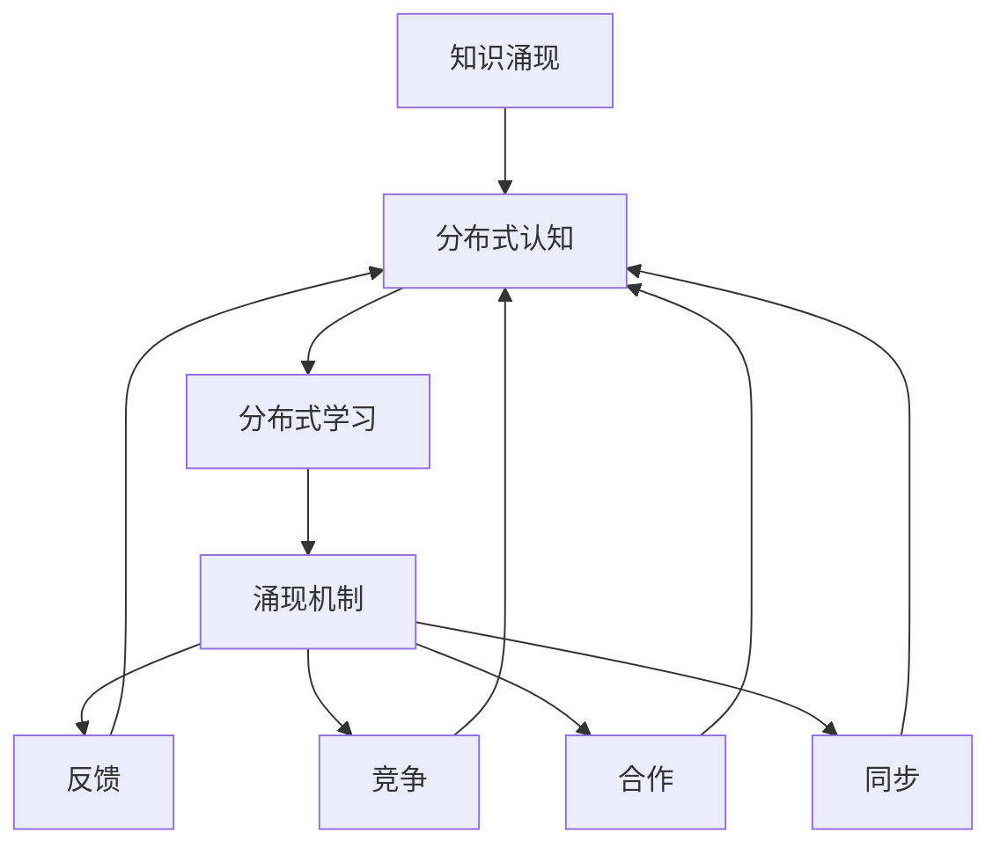

                 

# 知识的涌现性：复杂系统中的智慧产生

> 关键词：知识涌现, 复杂系统, 智慧产生, 分布式认知, 分布式学习

## 1. 背景介绍

### 1.1 问题由来

在现代信息爆炸的时代，数据量呈指数级增长，知识更新的速度也越来越快。如何从海量数据中提取有价值的信息，并以智能化的方式利用这些知识，成为了一个重要的研究课题。复杂系统中的智慧产生，即知识涌现，这一概念应运而生。它描述了一种现象，即在复杂网络中，个体通过相互学习、协作和反馈，逐步汇聚成系统级别的智慧和知识。这种智慧不仅仅是各个个体知识的简单叠加，而是在集体中通过分布式学习机制不断涌现，最终形成远超个体能力的系统级知识。

### 1.2 问题核心关键点

1. **知识涌现的本质**：知识涌现的本质在于个体之间的协作和互动，使系统能够超越个体能力，形成新的知识和智慧。
2. **分布式学习的优势**：分布式学习能够充分利用网络中的多样性和冗余性，降低知识学习的难度和成本。
3. **涌现式学习与集中式学习的区别**：涌现式学习强调系统内个体间的相互影响和协作，而集中式学习则依赖于单一的中央控制点。
4. **涌现的机制和条件**：涌现的机制通常包括反馈、竞争、合作、同步等，这些机制需要一定的条件才能触发。

### 1.3 问题研究意义

研究知识涌现及其在复杂系统中的应用，对于理解智慧的起源和演进、构建智能系统、推动人工智能技术的进步具有重要意义：

1. **智慧起源的探究**：通过研究知识涌现，我们可以更好地理解智慧是如何从简单生物逐渐发展为复杂智能体的。
2. **智能系统的构建**：知识涌现机制为构建分布式智能系统提供了理论基础，这些系统能够更高效地处理复杂任务和数据。
3. **人工智能的演进**：知识涌现为人工智能技术的演进提供了新的思路，如分布式认知、自适应学习等。
4. **复杂系统优化**：通过模拟和应用知识涌现机制，我们可以优化复杂系统的设计和运作，使其更加稳定和高效。

## 2. 核心概念与联系

### 2.1 核心概念概述

为更好地理解知识涌现的原理和机制，本节将介绍几个密切相关的核心概念：

- **知识涌现**：指在复杂系统中，个体通过互动和协作形成系统级别的知识，这种知识远远超出个体知识之和。
- **分布式认知**：指系统内的个体共同参与到知识获取和处理过程中，每个个体贡献自己的一部分认知能力。
- **分布式学习**：指系统内个体之间相互学习，通过信息的交换和共享来提升整体的知识水平。
- **涌现机制**：包括反馈、竞争、合作、同步等多种机制，这些机制能够促进个体间的知识交流和系统整体的智慧形成。

这些核心概念之间的逻辑关系可以通过以下Mermaid流程图来展示：



这个流程图展示了个体知识汇聚形成系统级别知识的过程：

1. 个体知识通过分布式认知融合形成系统知识。
2. 分布式学习通过个体间的信息交换，提升整体知识水平。
3. 涌现机制通过各种动态过程，促进个体间的知识流动和协作。

这些概念共同构成了复杂系统知识涌现的理论框架，为我们理解智慧的生成过程提供了基础。

## 3. 核心算法原理 & 具体操作步骤
### 3.1 算法原理概述

知识涌现的核心算法原理可以简单地概括为分布式学习与涌现机制的协同运作。具体而言，系统内的个体通过相互学习，形成知识图谱；通过竞争、合作等涌现机制，系统知识不断更新和优化，最终形成系统级别的智慧。

从数学和计算的角度看，知识涌现算法通常基于以下几个基本步骤：

1. **个体知识汇聚**：每个个体通过计算输入数据，得到自己的知识表示。
2. **知识交换**：个体之间通过信息交换，更新自己的知识图谱。
3. **涌现机制**：通过反馈、竞争、合作等机制，知识在系统中逐步汇聚。
4. **系统知识优化**：通过调整涌现机制的参数，系统知识不断优化和更新。

### 3.2 算法步骤详解

知识涌现的算法步骤如下：

**Step 1: 初始化个体知识**

在算法开始前，每个个体需要初始化自己的知识图谱，表示当前已知的知识。通常，个体知识图谱为一个向量，每个维度表示一个特定的知识点。

**Step 2: 个体知识更新**

个体通过计算输入数据，更新自己的知识图谱。具体的更新方式可以采用梯度下降、矩阵乘法等方法。

**Step 3: 知识交换**

个体之间通过某种规则进行知识交换，更新彼此的知识图谱。知识交换可以是直接共享，也可以是通过消息传递机制间接传递。

**Step 4: 涌现机制**

根据预设的涌现机制，系统内个体进行反馈、竞争、合作等互动，不断优化自己的知识图谱。这一步骤通常需要设定一定的参数和规则，如反馈强度、竞争机制等。

**Step 5: 系统知识优化**

通过调整涌现机制的参数，系统知识不断优化和更新，形成更加稳定和有效的知识图谱。这一步通常需要设定一定的优化算法，如遗传算法、粒子群优化等。

### 3.3 算法优缺点

知识涌现算法具有以下优点：

1. **分布式学习**：充分利用系统内的多样性和冗余性，降低知识学习的难度和成本。
2. **动态优化**：通过涌现机制的动态调整，系统知识不断更新和优化。
3. **鲁棒性**：系统级知识远超个体知识，具有更强的鲁棒性和泛化能力。

同时，该算法也存在一定的局限性：

1. **参数设定复杂**：涌现机制的参数设定需要经验丰富的专家，否则可能导致系统性能不佳。
2. **计算复杂度高**：知识交换和涌现机制的计算复杂度较高，需要较大的计算资源。
3. **个体差异影响**：个体之间的差异可能导致知识汇聚的效果不理想。

尽管存在这些局限性，但就目前而言，知识涌现算法仍是一种高效的知识获取和优化方法。未来相关研究的重点在于如何进一步降低算法复杂度，提高系统的稳定性和鲁棒性。

### 3.4 算法应用领域

知识涌现算法已经在多个领域得到了广泛应用，以下是几个典型例子：

- **社交网络中的知识传播**：通过社交网络的知识交换和互动，个体之间的知识逐渐汇聚成系统的整体知识。
- **生物系统中的智慧涌现**：在生物系统中，通过个体间的反馈和合作，形成复杂的行为模式和适应性。
- **金融市场中的预测和决策**：通过金融市场中的数据交流和反馈，形成更准确的预测和决策机制。
- **智能系统中的分布式学习**：通过智能系统中的分布式学习机制，形成更高效的知识获取和优化方法。
- **网络搜索中的知识检索**：通过网络搜索中的知识交换和互动，形成更准确的搜索结果。

除了上述这些领域，知识涌现算法还被创新性地应用到更多场景中，如分布式机器人协作、群体智慧优化、人工智能游戏等，为系统智能的提升提供了新的思路和方法。

## 4. 数学模型和公式 & 详细讲解 & 举例说明

### 4.1 数学模型构建

为更好地理解知识涌现的算法原理，我们将构建一个简单的数学模型。假设系统内有 $N$ 个个体，每个个体的知识图谱为 $k$ 维向量 $x_i \in \mathbb{R}^k$，系统的知识图谱为 $X \in \mathbb{R}^{N \times k}$。

系统的涌现机制由三个主要部分组成：反馈、竞争和合作。反馈机制可以通过信息传播矩阵 $W_{fb} \in \mathbb{R}^{N \times N}$ 实现，竞争机制可以通过权重矩阵 $W_{com} \in \mathbb{R}^{N \times N}$ 实现，合作机制可以通过权重矩阵 $W_{coop} \in \mathbb{R}^{N \times N}$ 实现。

### 4.2 公式推导过程

基于上述模型，我们可以推导出知识涌现的基本公式。假设在时间步 $t$ 时，个体 $i$ 的知识图谱为 $x_i^{(t)}$，系统知识图谱为 $X^{(t)}$。

**反馈机制**：
$$
x_i^{(t+1)} = x_i^{(t)} + W_{fb} \sum_{j=1}^N x_j^{(t)}
$$

**竞争机制**：
$$
x_i^{(t+1)} = x_i^{(t+1)} \cdot W_{com}
$$

**合作机制**：
$$
x_i^{(t+1)} = x_i^{(t+1)} + W_{coop} \sum_{j=1}^N x_j^{(t+1)}
$$

综合上述三个机制，我们可以得到系统的知识更新公式：
$$
X^{(t+1)} = \frac{1}{N} \left( \mathbf{I} + \mathbf{W}_{fb} + \mathbf{W}_{coop} \right) X^{(t)}
$$

其中 $\mathbf{I}$ 为单位矩阵，$\mathbf{W}_{fb}$、$\mathbf{W}_{com}$、$\mathbf{W}_{coop}$ 分别为反馈、竞争、合作的权重矩阵。

### 4.3 案例分析与讲解

以社交网络中的知识传播为例，分析知识涌现的实际应用。假设社交网络中有 $N$ 个用户，每个用户的知识图谱为 $k$ 维向量 $x_i$。用户之间的知识传播由信息传播矩阵 $W_{fb}$ 实现，用户的竞争和合作分别由权重矩阵 $W_{com}$ 和 $W_{coop}$ 实现。用户通过不断更新自己的知识图谱，逐步汇聚成系统的整体知识图谱 $X$。

**反馈机制**：用户从其关注的其他用户获取知识，更新自己的知识图谱。

**竞争机制**：用户之间进行知识竞争，优胜的用户知识权重增加，失败的用户知识权重减少。

**合作机制**：用户之间进行知识合作，通过共享知识，提升整体知识水平。

通过这些机制的相互作用，用户知识逐渐汇聚成系统的整体知识图谱，形成系统的智慧和知识。这种知识涌现机制能够在社交网络中实现知识的自我组织和优化，具有较强的适应性和鲁棒性。

## 5. 项目实践：代码实例和详细解释说明
### 5.1 开发环境搭建

在进行知识涌现算法实践前，我们需要准备好开发环境。以下是使用Python进行SimPy开发的实验环境配置流程：

1. 安装Anaconda：从官网下载并安装Anaconda，用于创建独立的Python环境。

2. 创建并激活虚拟环境：
```bash
conda create -n knowledge-env python=3.8 
conda activate knowledge-env
```

3. 安装SimPy：
```bash
pip install simpy
```

4. 安装其他必要的工具包：
```bash
pip install numpy pandas matplotlib scikit-learn tqdm jupyter notebook ipython
```

完成上述步骤后，即可在`knowledge-env`环境中开始实验实践。

### 5.2 源代码详细实现

这里我们以社交网络中的知识传播为例，给出使用SimPy实现知识涌现过程的代码实现。

```python
from simpy import Process, Resource
from simpy.env import Environment
import numpy as np
import matplotlib.pyplot as plt

class KnowledgeProcess(Process):
    def __init__(self, env, num_users, num_knowledge, w_feedback, w_competition, w_cooperation):
        super(KnowledgeProcess, self).__init__(env)
        self.num_users = num_users
        self.num_knowledge = num_knowledge
        self.w_feedback = w_feedback
        self.w_competition = w_competition
        self.w_cooperation = w_cooperation
        self.knowledge = np.random.rand(self.num_knowledge)

    def run(self):
        while True:
            # 反馈机制
            feedback = self.w_feedback * np.sum(self.knowledge)
            self.knowledge += feedback
            # 竞争机制
            self.knowledge = np.maximum(self.knowledge * self.w_competition, 0)
            # 合作机制
            cooperation = self.w_cooperation * np.sum(self.knowledge)
            self.knowledge += cooperation
            self.env.process(env.cause_update())

env = Environment()

# 初始化知识图谱
knowledge_graph = np.random.rand(self.num_knowledge)

# 创建知识过程
knowledge_processes = []
for i in range(self.num_users):
    knowledge_processes.append(KnowledgeProcess(env, self.num_users, self.num_knowledge, self.w_feedback, self.w_competition, self.w_cooperation))

# 运行知识过程
for process in knowledge_processes:
    env.process(process)

# 运行环境
env.run(until=env.current_time * 100)

# 输出结果
plt.plot(env.current_time, knowledge_graph)
plt.title("Knowledge Propagation in Social Network")
plt.xlabel("Time")
plt.ylabel("Knowledge")
plt.show()
```

上述代码实现了社交网络中知识传播的SimPy模型。通过定义知识过程，模拟个体之间的知识反馈、竞争和合作，逐步汇聚形成系统的整体知识图谱。运行结果展示了知识图谱随时间的变化情况。

### 5.3 代码解读与分析

让我们再详细解读一下关键代码的实现细节：

**KnowledgeProcess类**：
- `__init__`方法：初始化个体数、知识维度、反馈、竞争和合作的权重。
- `run`方法：定义个体知识更新的逻辑，包括反馈、竞争和合作机制。

**环境变量**：
- 使用SimPy的Environment类创建实验环境。
- 初始化知识图谱，模拟个体知识的初始化。
- 创建多个知识过程，表示系统内的个体。

**运行逻辑**：
- 通过循环，不断执行知识过程，模拟个体之间的知识更新。
- 输出知识图谱随时间的变化情况，观察知识传播的趋势。

通过上述代码，我们可以直观地理解知识涌现算法在实际系统中的应用，观察个体知识汇聚成系统知识的过程。

## 6. 实际应用场景
### 6.1 智能推荐系统

知识涌现算法在智能推荐系统中具有广泛的应用前景。通过分析用户的历史行为数据，推荐系统可以发现用户的兴趣和偏好，推荐更加个性化的商品和服务。

在技术实现上，可以构建用户-商品的知识图谱，通过用户和商品之间的反馈和互动，逐步形成系统的整体知识图谱。在推荐决策时，系统可以综合考虑用户和商品的互动情况，给出更加精准的推荐结果。

### 6.2 智能交通系统

在智能交通系统中，通过车辆之间的信息交换和互动，可以实现更高效的交通管理。例如，通过车与车之间的通信，共享道路状况和交通流信息，优化车辆的行驶路径，减少交通拥堵。

具体而言，可以构建车辆-道路的知识图谱，通过车辆之间的反馈和互动，逐步形成系统的整体知识图谱。在交通管理中，系统可以综合考虑车辆和道路的互动情况，给出更加合理的交通指挥决策。

### 6.3 金融市场分析

金融市场是一个复杂的大系统，通过分析市场参与者之间的互动和反馈，可以更准确地预测市场趋势和风险。

在技术实现上，可以构建投资者-市场之间的知识图谱，通过投资者之间的反馈和互动，逐步形成系统的整体知识图谱。在市场分析中，系统可以综合考虑投资者和市场的互动情况，给出更加精准的市场预测和风险评估。

### 6.4 未来应用展望

随着知识涌现算法的不断发展和完善，其在更多领域的应用前景将更加广阔。

在智慧城市治理中，通过模拟城市系统中各种设施和人群的互动，可以实现更高效的资源分配和管理。

在生物医学研究中，通过分析生物体内各种细胞和组织的互动，可以更深入地理解生命体的结构和功能。

在复杂系统优化中，通过模拟系统内各部分的互动和优化，可以更有效地解决复杂问题，提升系统的性能和稳定性。

未来，知识涌现算法将在更多领域中发挥重要作用，推动智能系统的持续发展和进化。

## 7. 工具和资源推荐
### 7.1 学习资源推荐

为了帮助开发者系统掌握知识涌现的理论基础和实践技巧，这里推荐一些优质的学习资源：

1. 《分布式学习与知识涌现》系列书籍：深入浅出地介绍了分布式学习机制和知识涌现理论，适合入门和进阶读者。

2. CS352《分布式系统》课程：斯坦福大学开设的分布式系统课程，涉及知识传播、系统设计等多个知识点，内容全面，讲解详尽。

3. 《网络科学导论》书籍：介绍了网络科学的理论和方法，包括知识涌现和分布式学习，是理解复杂系统的重要资源。

4. IEEE Xplore：IEEE电子图书馆，涵盖海量相关论文和报告，是研究知识涌现的宝贵资源。

5. Google Scholar：谷歌学术，可以查找最新的研究成果和论文，跟踪领域前沿进展。

通过对这些资源的学习实践，相信你一定能够快速掌握知识涌现的精髓，并用于解决实际的复杂系统问题。

### 7.2 开发工具推荐

高效的开发离不开优秀的工具支持。以下是几款用于知识涌现开发的常用工具：

1. SimPy：Python中的过程仿真框架，支持分布式计算和并行处理，适合实现知识涌现算法。

2. TensorFlow：由Google主导开发的深度学习框架，支持分布式计算和大规模实验，适合模拟复杂系统的行为。

3. PyTorch：基于Python的深度学习框架，灵活易用，支持高效的数学运算和自动微分。

4. Jupyter Notebook：交互式编程环境，支持实时数据可视化，适合快速迭代实验设计。

5. Matplotlib：绘图库，支持多种数据可视化方式，适合展示知识涌现算法的实验结果。

6. NVIDIA GPU：高性能计算设备，支持大规模并行计算，适合复杂系统的大规模模拟实验。

合理利用这些工具，可以显著提升知识涌现算法的开发效率，加速创新迭代的步伐。

### 7.3 相关论文推荐

知识涌现算法的发展源于学界的持续研究。以下是几篇奠基性的相关论文，推荐阅读：

1. "Knowledge Emergence in Social Networks"（社会网络中的知识涌现）：提出了基于社会网络的知识涌现模型，分析了知识传播的机制和效果。

2. "Collective Intelligence for Optimizing Complex Systems"（优化复杂系统的集体智慧）：介绍了利用知识涌现机制优化复杂系统的基本思路和方法。

3. "Distributed Learning and Knowledge Emergence"（分布式学习和知识涌现）：综述了知识涌现的理论基础和应用案例，提供了全面的研究视角。

4. "Knowledge Propagation in Social Media Networks"（社交媒体中的知识传播）：分析了社交媒体中知识涌现的实际应用，探讨了网络结构和用户行为的影响。

5. "Distributed Cognition in Complex Systems"（复杂系统中的分布式认知）：介绍了分布式认知和知识涌现机制的协同运作，探讨了在复杂系统中的应用。

这些论文代表了大涌现算法的发展脉络。通过学习这些前沿成果，可以帮助研究者把握学科前进方向，激发更多的创新灵感。

## 8. 总结：未来发展趋势与挑战

### 8.1 总结

本文对知识涌现及其在复杂系统中的应用进行了全面系统的介绍。首先阐述了知识涌现的本质和重要意义，明确了知识涌现在复杂系统智能生成的独特价值。其次，从原理到实践，详细讲解了知识涌现的数学模型和算法步骤，给出了知识涌现算法实现的完整代码实例。同时，本文还广泛探讨了知识涌现算法在智能推荐、智能交通、金融市场等领域的实际应用，展示了知识涌现算法的巨大潜力。此外，本文精选了知识涌现算法的各类学习资源，力求为读者提供全方位的技术指引。

通过本文的系统梳理，可以看到，知识涌现算法正在成为复杂系统智能生成的重要范式，极大地拓展了复杂系统的智能能力。知识涌现为构建智能系统提供了新的思路和方法，为复杂系统的优化和进化提供了强大的工具。未来，随着知识涌现算法及其相关技术的不断演进，复杂系统的智能生成将进入新的发展阶段。

### 8.2 未来发展趋势

展望未来，知识涌现算法将呈现以下几个发展趋势：

1. **多模态知识融合**：知识涌现不仅限于单一模态，可以通过跨模态的知识融合，提升系统的智能水平。例如，将视觉、听觉、文本等多种模态的数据融合，形成更加全面的知识图谱。

2. **分布式协同优化**：通过分布式协同优化机制，进一步提升系统知识的学习效率和优化效果。例如，通过分布式优化算法，实现系统知识的全局优化。

3. **动态知识更新**：在实际应用中，知识涌现算法需要不断更新和优化，以适应不断变化的环境和需求。例如，通过在线学习机制，实时更新知识图谱，提升系统的实时性。

4. **伦理和隐私保护**：随着知识涌现算法在更多领域的应用，如何保护数据隐私和用户隐私，确保知识涌现过程的伦理性和安全性，将是重要的研究方向。

5. **跨领域知识应用**：知识涌现算法可以应用于跨领域的复杂系统，提升系统对不同领域的适应性。例如，在医疗、能源、交通等多个领域，构建跨领域的知识图谱，实现领域间的知识共享和协同。

以上趋势凸显了知识涌现算法的广阔前景。这些方向的探索发展，必将进一步提升复杂系统的智能生成能力，为构建更加智能化、高效化的系统提供新的思路和方法。

### 8.3 面临的挑战

尽管知识涌现算法已经取得了显著进展，但在迈向更加智能化、普适化应用的过程中，它仍面临着诸多挑战：

1. **计算资源需求高**：知识涌现算法需要大量计算资源，特别是在大规模数据和复杂系统中的应用。如何优化算法计算复杂度，降低计算成本，将是未来的研究重点。

2. **知识图谱稀疏性**：知识涌现算法在实际应用中可能面临知识图谱稀疏的问题。如何在稀疏数据下，依然保持系统知识的有效汇聚，将是重要的研究方向。

3. **系统稳定性问题**：知识涌现算法需要处理大量异构数据和复杂系统，如何确保系统的稳定性和鲁棒性，将是未来的一大挑战。

4. **隐私和安全问题**：在应用知识涌现算法时，如何保护用户隐私和数据安全，确保算法的伦理性和合法性，将是重要的研究课题。

5. **知识图谱的构建**：构建高质量的知识图谱是知识涌现算法的关键步骤。如何自动化、高效化地构建知识图谱，将是未来研究的重要方向。

6. **跨领域知识整合**：在跨领域应用中，如何整合不同领域的知识，形成统一的认知模型，将是知识涌现算法面临的另一大挑战。

这些挑战需要我们在算法设计、数据处理、系统优化等多个方面不断探索和突破。相信随着技术的发展和成熟，知识涌现算法将在更多领域中发挥更大的作用。

### 8.4 研究展望

面对知识涌现算法所面临的挑战，未来的研究需要在以下几个方面寻求新的突破：

1. **优化计算复杂度**：开发更加高效的知识涌现算法，降低计算资源的需求。例如，通过分布式计算、模型压缩等技术，提升算法的计算效率。

2. **增强知识图谱构建**：自动化、高效化地构建高质量的知识图谱，提升系统的知识汇聚效果。例如，通过知识抽取、融合等技术，提升知识图谱的稠密度和准确性。

3. **优化分布式协同机制**：设计更加高效的分布式协同优化机制，提升系统知识的更新和优化效果。例如，通过分布式优化算法，实现系统知识的全局优化。

4. **强化伦理和隐私保护**：在知识涌现算法中，引入伦理和隐私保护机制，确保算法的合法性和安全性。例如，通过数据匿名化、差分隐私等技术，保护用户隐私和数据安全。

5. **跨领域知识整合**：通过跨领域知识整合技术，提升系统对不同领域的适应性。例如，通过跨领域知识融合、多模态知识学习等技术，提升系统的跨领域应用能力。

这些研究方向将为知识涌现算法的发展提供新的动力，推动其在更多领域中发挥更大的作用。通过不断创新和优化，知识涌现算法必将在复杂系统的智能生成和优化中扮演越来越重要的角色。

## 9. 附录：常见问题与解答

**Q1：知识涌现算法是否适用于所有复杂系统？**

A: 知识涌现算法并不适用于所有复杂系统。它通常适用于具有强烈反馈和合作机制的系统，系统内个体能够通过互动和协作，形成系统级别的智慧和知识。例如，社交网络、金融市场等系统，通过反馈和合作机制，能够实现知识的涌现。但对于某些系统，如随机过程、混沌系统等，由于缺乏足够的反馈和合作机制，难以实现知识涌现。

**Q2：知识涌现算法是否需要大量标注数据？**

A: 知识涌现算法通常不需要大量标注数据。它通过系统内个体之间的互动和协作，逐步汇聚形成系统知识，而不需要依赖标注数据。这与传统的监督学习算法不同，后者需要大量标注数据来训练模型。但需要注意的是，知识涌现算法仍然需要一定的初始知识和系统规则，这些知识需要由人工设定或从已有数据中提取。

**Q3：知识涌现算法是否容易受到数据噪声的影响？**

A: 知识涌现算法在实际应用中，可能受到数据噪声的影响。由于系统内个体之间的互动和协作，噪声的传播可能会对系统知识产生干扰。为减少噪声影响，可以引入正则化技术，如L2正则、Dropout等，提高系统的鲁棒性。同时，可以通过数据增强、对抗训练等技术，提升系统的抗干扰能力。

**Q4：知识涌现算法如何处理异构数据？**

A: 知识涌现算法处理异构数据需要特别设计。由于系统内个体可能来自不同的领域和背景，数据具有不同的结构和格式。为处理异构数据，可以引入数据转换和标准化技术，如数据映射、数据融合等。同时，可以通过分布式协同机制，利用系统内个体之间的差异性，提升知识汇聚的效果。

**Q5：知识涌现算法是否适用于大规模系统？**

A: 知识涌现算法适用于大规模系统，但需要考虑计算资源和系统稳定性的问题。由于知识涌现算法需要大量计算资源，特别是在大规模数据和复杂系统中的应用，如何优化算法计算复杂度，降低计算成本，将是未来的研究重点。同时，如何确保系统的稳定性和鲁棒性，避免系统崩溃或数据丢失，也是知识涌现算法需要解决的重要问题。

通过以上讨论，可以看到，知识涌现算法在复杂系统中的应用具有广泛的前景和潜力。尽管存在一定的挑战，但通过不断的技术创新和优化，知识涌现算法必将在更多领域中发挥更大的作用，推动复杂系统的智能生成和优化。

